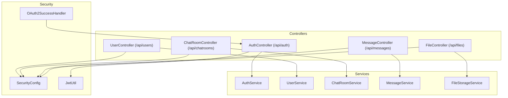
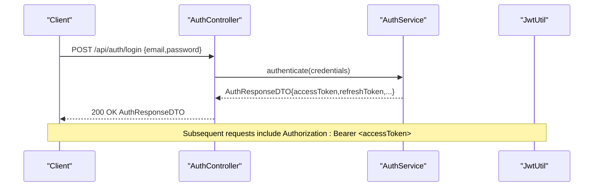
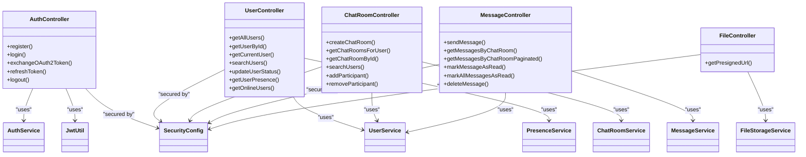
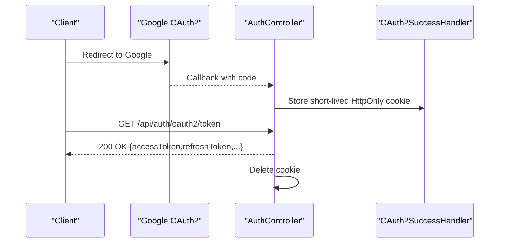
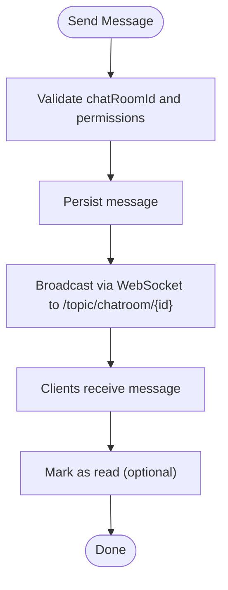

# API Reference

<cite>
**Referenced Files in This Document**
- [AuthController.java](file://src/main/java/com/chatify/chat_backend/controller/AuthController.java)
- [UserController.java](file://src/main/java/com/chatify/chat_backend/controller/UserController.java)
- [ChatRoomController.java](file://src/main/java/com/chatify/chat_backend/controller/ChatRoomController.java)
- [MessageController.java](file://src/main/java/com/chatify/chat_backend/controller/MessageController.java)
- [FileController.java](file://src/main/java/com/chatify/chat_backend/controller/FileController.java)
- [AuthService.java](file://src/main/java/com/chatify/chat_backend/service/AuthService.java)
- [UserService.java](file://src/main/java/com/chatify/chat_backend/service/UserService.java)
- [ChatRoomService.java](file://src/main/java/com/chatify/chat_backend/service/ChatRoomService.java)
- [MessageService.java](file://src/main/java/com/chatify/chat_backend/service/MessageService.java)
- [FileStorageService.java](file://src/main/java/com/chatify/chat_backend/service/FileStorageService.java)
- [JwtUtil.java](file://src/main/java/com/chatify/chat_backend/security/JwtUtil.java)
- [SecurityConfig.java](file://src/main/java/com/chatify/chat_backend/config/SecurityConfig.java)
- [WebMvcConfig.java](file://src/main/java/com/chatify/chat_backend/config/WebMvcConfig.java)
- [WebSocketConfig.java](file://src/main/java/com/chatify/chat_backend/config/WebSocketConfig.java)
- [OAuth2SuccessHandler.java](file://src/main/java/com/chatify/chat_backend/security/OAuth2SuccessHandler.java)
- [AuthResponseDTO.java](file://src/main/java/com/chatify/chat_backend/dto/AuthResponseDTO.java)
- [UserRegistrationDTO.java](file://src/main/java/com/chatify/chat_backend/dto/UserRegistrationDTO.java)
- [UserLoginDTO.java](file://src/main/java/com/chatify/chat_backend/dto/UserLoginDTO.java)
- [SendMessageDTO.java](file://src/main/java/com/chatify/chat_backend/dto/SendMessageDTO.java)
- [CreateChatRequest.java](file://src/main/java/com/chatify/chat_backend/dto/CreateChatRequest.java)
- [FileUploadResponseDTO.java](file://src/main/java/com/chatify/chat_backend/dto/FileUploadResponseDTO.java)
- [ErrorResponse.java](file://src/main/java/com/chatify/chat_backend/exception/ErrorResponse.java)
- [GlobalExceptionHandler.java](file://src/main/java/com/chatify/chat_backend/exception/GlobalExceptionHandler.java)
- [auth.js](file://chatify-frontend/src/api/auth.js)
- [users.js](file://chatify-frontend/src/api/users.js)
- [chatrooms.js](file://chatify-frontend/src/api/chatrooms.js)
- [messages.js](file://chatify-frontend/src/api/messages.js)
- [api.js](file://chatify-frontend/src/services/api.js)
</cite>

## Table of Contents
1. [Introduction](#introduction)
2. [Project Structure](#project-structure)
3. [Core Components](#core-components)
4. [Architecture Overview](#architecture-overview)
5. [Detailed Component Analysis](#detailed-component-analysis)
6. [Dependency Analysis](#dependency-analysis)
7. [Performance Considerations](#performance-considerations)
8. [Troubleshooting Guide](#troubleshooting-guide)
9. [Conclusion](#conclusion)
10. [Appendices](#appendices)

## Introduction
This document provides a comprehensive API reference for the Chatify REST API. It covers authentication, user management, chat rooms, messages, and file handling endpoints. For each endpoint group, you will find HTTP methods, URL patterns, request/response schemas, authentication requirements, error handling, and practical curl examples. It also includes client integration patterns, security considerations, rate limiting guidance, and performance optimization tips.

## Project Structure
The backend is a Spring Boot application organized by layers:
- Controllers expose REST endpoints under /api/{resource}.
- Services encapsulate business logic.
- DTOs define request/response schemas.
- SecurityConfig and JwtUtil manage authentication and authorization.
- Frontend API modules demonstrate client usage patterns.

**Diagram sources**
- [AuthController.java:19-33](file://src/main/java/com/chatify/chat_backend/controller/AuthController.java#L19-L33)
- [UserController.java:15-25](file://src/main/java/com/chatify/chat_backend/controller/UserController.java#L15-L25)
- [ChatRoomController.java:16-26](file://src/main/java/com/chatify/chat_backend/controller/ChatRoomController.java#L16-L26)
- [MessageController.java:16-30](file://src/main/java/com/chatify/chat_backend/controller/MessageController.java#L16-L30)
- [FileController.java:9-17](file://src/main/java/com/chatify/chat_backend/controller/FileController.java#L9-L17)
- [AuthService.java](file://src/main/java/com/chatify/chat_backend/service/AuthService.java)
- [UserService.java](file://src/main/java/com/chatify/chat_backend/service/UserService.java)
- [ChatRoomService.java](file://src/main/java/com/chatify/chat_backend/service/ChatRoomService.java)
- [MessageService.java](file://src/main/java/com/chatify/chat_backend/service/MessageService.java)
- [FileStorageService.java](file://src/main/java/com/chatify/chat_backend/service/FileStorageService.java)
- [SecurityConfig.java](file://src/main/java/com/chatify/chat_backend/config/SecurityConfig.java)
- [JwtUtil.java:18-53](file://src/main/java/com/chatify/chat_backend/security/JwtUtil.java#L18-L53)
- [OAuth2SuccessHandler.java](file://src/main/java/com/chatify/chat_backend/security/OAuth2SuccessHandler.java)

**Section sources**
- [AuthController.java:19-33](file://src/main/java/com/chatify/chat_backend/controller/AuthController.java#L19-L33)
- [UserController.java:15-25](file://src/main/java/com/chatify/chat_backend/controller/UserController.java#L15-L25)
- [ChatRoomController.java:16-26](file://src/main/java/com/chatify/chat_backend/controller/ChatRoomController.java#L16-L26)
- [MessageController.java:16-30](file://src/main/java/com/chatify/chat_backend/controller/MessageController.java#L16-L30)
- [FileController.java:9-17](file://src/main/java/com/chatify/chat_backend/controller/FileController.java#L9-L17)

## Core Components
- Authentication: Registration, login, token refresh, logout, and OAuth2 token exchange.
- Users: Retrieve users, current user, search, update status, presence, and online users.
- Chat Rooms: Create, list, fetch by ID, search users, add/remove participants.
- Messages: Send, fetch history (paginated), mark as read, mark all as read, delete.
- Files: Generate presigned URLs for S3 uploads.

**Section sources**
- [AuthController.java:35-140](file://src/main/java/com/chatify/chat_backend/controller/AuthController.java#L35-L140)
- [UserController.java:27-73](file://src/main/java/com/chatify/chat_backend/controller/UserController.java#L27-L73)
- [ChatRoomController.java:28-102](file://src/main/java/com/chatify/chat_backend/controller/ChatRoomController.java#L28-L102)
- [MessageController.java:32-95](file://src/main/java/com/chatify/chat_backend/controller/MessageController.java#L32-L95)
- [FileController.java:19-30](file://src/main/java/com/chatify/chat_backend/controller/FileController.java#L19-L30)

## Architecture Overview
The API follows REST conventions with bearer token authentication. Controllers delegate to services, which interact with repositories and external systems (e.g., S3 via presigned URLs). JWT is used for sessionless authentication, and refresh tokens are supported. OAuth2 Google flow integrates via a temporary HttpOnly cookie exchanged server-side.

**Diagram sources**
- [AuthController.java:45-53](file://src/main/java/com/chatify/chat_backend/controller/AuthController.java#L45-L53)
- [AuthService.java](file://src/main/java/com/chatify/chat_backend/service/AuthService.java)
- [JwtUtil.java:60-79](file://src/main/java/com/chatify/chat_backend/security/JwtUtil.java#L60-L79)

## Detailed Component Analysis

### Authentication API
Endpoints:
- POST /api/auth/register
- POST /api/auth/login
- GET /api/auth/oauth2/token
- POST /api/auth/refresh
- POST /api/auth/logout

Authentication methods:
- Bearer JWT for protected endpoints.
- OAuth2 Google integration using a temporary HttpOnly cookie.

Request/response schemas:
- UserRegistrationDTO: username, email, password
- UserLoginDTO: email, password
- AuthResponseDTO: accessToken, refreshToken, username, email, id

Behavior:
- Registration accepts user data and returns a success message.
- Login validates credentials and returns tokens.
- OAuth2 token exchange reads a short-lived HttpOnly cookie and returns tokens, then deletes the cookie.
- Refresh accepts a refresh token and returns new tokens.
- Logout accepts an optional Bearer token and invalidates sessions.

curl examples:
- Register: curl -X POST https://yourdomain.com/api/auth/register -H "Content-Type: application/json" -d '{"username":"john","email":"john@example.com","password":"pass"}'
- Login: curl -X POST https://yourdomain.com/api/auth/login -H "Content-Type: application/json" -d '{"email":"john@example.com","password":"pass"}'
- Refresh: curl -X POST https://yourdomain.com/api/auth/refresh -H "Content-Type: application/json" -d '{"refreshToken":"<refresh_token>"}'
- Logout: curl -X POST https://yourdomain.com/api/auth/logout -H "Authorization: Bearer <access_token>"

Security considerations:
- Access tokens are validated server-side; ensure HTTPS in production.
- OAuth2 cookie is HttpOnly, scoped, and single-use.
- Refresh tokens should be stored securely and rotated.

Error handling:
- Typical responses include 400 Bad Request for invalid input, 401 Unauthorized for invalid credentials or tokens, and 403 Forbidden for unauthorized actions.

**Section sources**
- [AuthController.java:35-140](file://src/main/java/com/chatify/chat_backend/controller/AuthController.java#L35-L140)
- [UserRegistrationDTO.java:10-17](file://src/main/java/com/chatify/chat_backend/dto/UserRegistrationDTO.java#L10-L17)
- [UserLoginDTO.java:10-15](file://src/main/java/com/chatify/chat_backend/dto/UserLoginDTO.java#L10-L15)
- [AuthResponseDTO.java:10-16](file://src/main/java/com/chatify/chat_backend/dto/AuthResponseDTO.java#L10-L16)
- [JwtUtil.java:96-118](file://src/main/java/com/chatify/chat_backend/security/JwtUtil.java#L96-L118)

### User Management API
Endpoints:
- GET /api/users
- GET /api/users/{id}
- GET /api/users/me
- GET /api/users/search?query={query}
- PUT /api/users/{id}/status
- GET /api/users/{id}/presence
- GET /api/users/online

Behavior:
- Retrieve all users, a specific user by ID, or the current user based on the authenticated principal.
- Search users by query string across username and email.
- Update user status (requires the caller to be the target user).
- Fetch presence and online users.

curl examples:
- Get all users: curl -H "Authorization: Bearer <access_token>" https://yourdomain.com/api/users
- Search users: curl -H "Authorization: Bearer <access_token>" "https://yourdomain.com/api/users/search?query=john"
- Update status: curl -X PUT -H "Authorization: Bearer <access_token>" -H "Content-Type: application/json" "https://yourdomain.com/api/users/1/status" -d '{"status":"AWAY"}'

Security considerations:
- Status update enforces ownership; non-matching users receive 403 Forbidden.

**Section sources**
- [UserController.java:27-73](file://src/main/java/com/chatify/chat_backend/controller/UserController.java#L27-L73)

### Chat Room API
Endpoints:
- POST /api/chatrooms
- GET /api/chatrooms
- GET /api/chatrooms/{id}
- GET /api/chatrooms/search?query={query}
- POST /api/chatrooms/{id}/participants
- DELETE /api/chatrooms/{id}/participants/{userId}

Behavior:
- Create a chat room with a name, group flag, and participant IDs; the creator is included automatically.
- List chat rooms for the authenticated user.
- Fetch a chat room by ID for the authenticated user.
- Search users (client-side filtering in current implementation).
- Add or remove participants; requires the authenticated user to be a member.

curl examples:
- Create chat room: curl -X POST -H "Authorization: Bearer <access_token>" -H "Content-Type: application/json" https://yourdomain.com/api/chatrooms -d '{"name":"Team","isGroupChat":true,"participantIds":[2,3]}'
- Add participant: curl -X POST -H "Authorization: Bearer <access_token>" -H "Content-Type: application/json" https://yourdomain.com/api/chatrooms/1/participants -d '{"userId":4}'
- Remove participant: curl -X DELETE -H "Authorization: Bearer <access_token>" https://yourdomain.com/api/chatrooms/1/participants/4

Security considerations:
- All operations require membership in the chat room.

**Section sources**
- [ChatRoomController.java:28-102](file://src/main/java/com/chatify/chat_backend/controller/ChatRoomController.java#L28-L102)
- [CreateChatRequest.java:5-26](file://src/main/java/com/chatify/chat_backend/dto/CreateChatRequest.java#L5-L26)

### Message API
Endpoints:
- POST /api/messages
- GET /api/messages/chatroom/{chatRoomId}
- GET /api/messages/chatroom/{chatRoomId}/paginated?page={page}&size={size}
- PUT /api/messages/{id}/read
- PUT /api/messages/chatroom/{chatRoomId}/read-all
- DELETE /api/messages/{id}

Behavior:
- Send a message with chatRoomId, content, type, and optional file metadata.
- Fetch all messages for a chat room.
- Paginated fetch with defaults page=0, size=20.
- Mark a single message as read.
- Mark all messages in a chat room as read.
- Delete a message (author-only).

curl examples:
- Send message: curl -X POST -H "Authorization: Bearer <access_token>" -H "Content-Type: application/json" https://yourdomain.com/api/messages -d '{"chatRoomId":1,"content":"Hello","messageType":"TEXT"}'
- Get paginated messages: curl -H "Authorization: Bearer <access_token>" "https://yourdomain.com/api/messages/chatroom/1/paginated?page=0&size=20"
- Mark all as read: curl -X PUT -H "Authorization: Bearer <access_token>" https://yourdomain.com/api/messages/chatroom/1/read-all

Security considerations:
- All operations enforce membership in the chat room.

**Section sources**
- [MessageController.java:32-95](file://src/main/java/com/chatify/chat_backend/controller/MessageController.java#L32-L95)
- [SendMessageDTO.java:12-21](file://src/main/java/com/chatify/chat_backend/dto/SendMessageDTO.java#L12-L21)

### File API
Endpoints:
- POST /api/files/presigned-url?fileName={name}&contentType={type}&fileSize={bytes}

Behavior:
- Generate a presigned URL for direct S3 upload with file metadata.
- Upload directly to S3 using the returned URL.

curl examples:
- Generate presigned URL: curl -H "Authorization: Bearer <access_token>" "https://yourdomain.com/api/files/presigned-url?fileName=image.jpg&contentType=image/jpeg&fileSize=1024"

Security considerations:
- Bucket policies should restrict read access; no ACL header is needed for downloads.

**Section sources**
- [FileController.java:19-30](file://src/main/java/com/chatify/chat_backend/controller/FileController.java#L19-L30)
- [FileUploadResponseDTO.java](file://src/main/java/com/chatify/chat_backend/dto/FileUploadResponseDTO.java)

## Dependency Analysis

**Diagram sources**
- [AuthController.java:25-33](file://src/main/java/com/chatify/chat_backend/controller/AuthController.java#L25-L33)
- [UserController.java:19-25](file://src/main/java/com/chatify/chat_backend/controller/UserController.java#L19-L25)
- [ChatRoomController.java:20-26](file://src/main/java/com/chatify/chat_backend/controller/ChatRoomController.java#L20-L26)
- [MessageController.java:20-30](file://src/main/java/com/chatify/chat_backend/controller/MessageController.java#L20-L30)
- [FileController.java:13-17](file://src/main/java/com/chatify/chat_backend/controller/FileController.java#L13-L17)
- [AuthService.java](file://src/main/java/com/chatify/chat_backend/service/AuthService.java)
- [UserService.java](file://src/main/java/com/chatify/chat_backend/service/UserService.java)
- [ChatRoomService.java](file://src/main/java/com/chatify/chat_backend/service/ChatRoomService.java)
- [MessageService.java](file://src/main/java/com/chatify/chat_backend/service/MessageService.java)
- [FileStorageService.java](file://src/main/java/com/chatify/chat_backend/service/FileStorageService.java)
- [JwtUtil.java:18-53](file://src/main/java/com/chatify/chat_backend/security/JwtUtil.java#L18-L53)
- [SecurityConfig.java](file://src/main/java/com/chatify/chat_backend/config/SecurityConfig.java)

**Section sources**
- [AuthController.java:25-33](file://src/main/java/com/chatify/chat_backend/controller/AuthController.java#L25-L33)
- [UserController.java:19-25](file://src/main/java/com/chatify/chat_backend/controller/UserController.java#L19-L25)
- [ChatRoomController.java:20-26](file://src/main/java/com/chatify/chat_backend/controller/ChatRoomController.java#L20-L26)
- [MessageController.java:20-30](file://src/main/java/com/chatify/chat_backend/controller/MessageController.java#L20-L30)
- [FileController.java:13-17](file://src/main/java/com/chatify/chat_backend/controller/FileController.java#L13-L17)

## Performance Considerations
- Pagination: Use paginated message retrieval to limit payload sizes.
- Presence and online queries: Cache presence states to reduce database load.
- File uploads: Prefer presigned URLs to offload traffic from the API server.
- Token lifetimes: Configure JWT expiration appropriately to balance security and refresh frequency.
- Rate limiting: Implement per-endpoint limits (e.g., 300 requests/minute) to protect backend resources.

[No sources needed since this section provides general guidance]

## Troubleshooting Guide
Common errors and resolutions:
- 401 Unauthorized: Verify Authorization header format and token validity.
- 403 Forbidden: Ensure the requesting user matches the resource owner (e.g., updating status).
- 404 Not Found: Confirm resource IDs and membership in chat rooms.
- OAuth2 token exchange failures: Check cookie presence and expiry; retry login flow.

Error handling strategy:
- Centralized exception handling returns structured ErrorResponse objects.
- Client-side interceptors handle automatic token refresh and logout on repeated 401/403.

**Section sources**
- [ErrorResponse.java](file://src/main/java/com/chatify/chat_backend/exception/ErrorResponse.java)
- [GlobalExceptionHandler.java](file://src/main/java/com/chatify/chat_backend/exception/GlobalExceptionHandler.java)
- [api.js:48-97](file://chatify-frontend/src/services/api.js#L48-L97)

## Conclusion
This API reference outlines Chatify’s public endpoints, authentication mechanisms, and client integration patterns. By following the documented schemas, security practices, and performance tips, you can build reliable integrations and maintain backward compatibility as the platform evolves.

[No sources needed since this section summarizes without analyzing specific files]

## Appendices

### Authentication Flow (OAuth2 Google)

**Diagram sources**
- [AuthController.java:69-107](file://src/main/java/com/chatify/chat_backend/controller/AuthController.java#L69-L107)
- [OAuth2SuccessHandler.java](file://src/main/java/com/chatify/chat_backend/security/OAuth2SuccessHandler.java)

### Message Delivery and Read Receipts

**Diagram sources**
- [MessageController.java:32-44](file://src/main/java/com/chatify/chat_backend/controller/MessageController.java#L32-L44)
- [WebSocketConfig.java](file://src/main/java/com/chatify/chat_backend/config/WebSocketConfig.java)

### Client Implementation Guidelines
- Use Axios interceptors to attach Authorization headers and refresh tokens automatically.
- Store tokens in secure storage; avoid exposing tokens in URLs.
- Implement exponential backoff for retries on transient failures.
- Respect pagination parameters for message history.

**Section sources**
- [auth.js:1-22](file://chatify-frontend/src/api/auth.js#L1-L22)
- [users.js:1-37](file://chatify-frontend/src/api/users.js#L1-L37)
- [chatrooms.js:1-31](file://chatify-frontend/src/api/chatrooms.js#L1-L31)
- [messages.js:1-53](file://chatify-frontend/src/api/messages.js#L1-L53)
- [api.js:11-97](file://chatify-frontend/src/services/api.js#L11-L97)