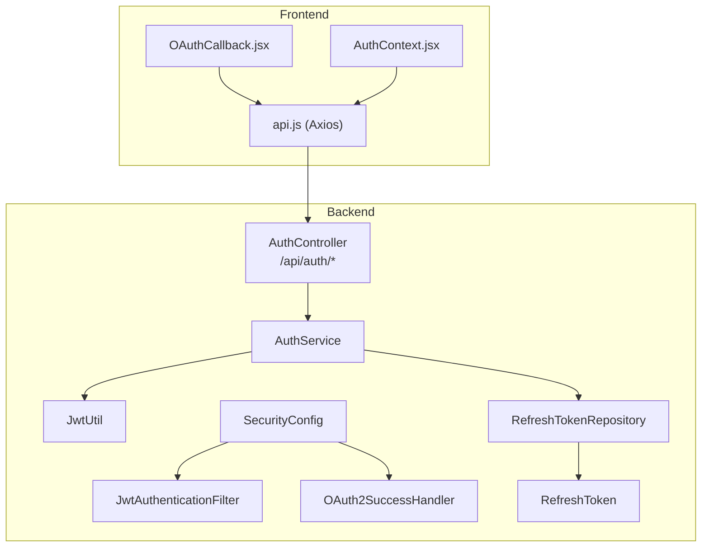
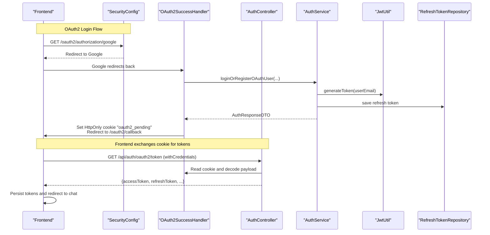
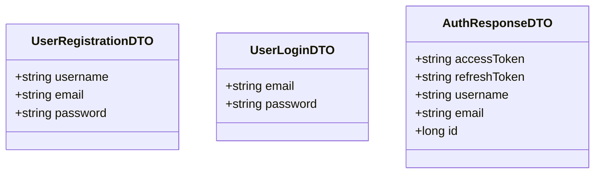
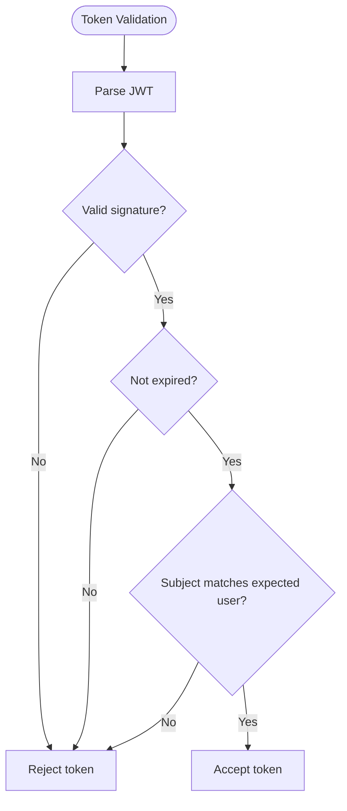
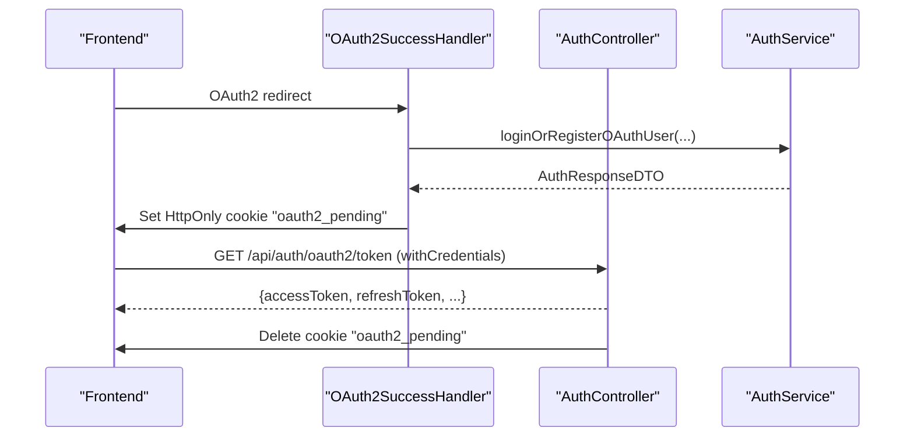
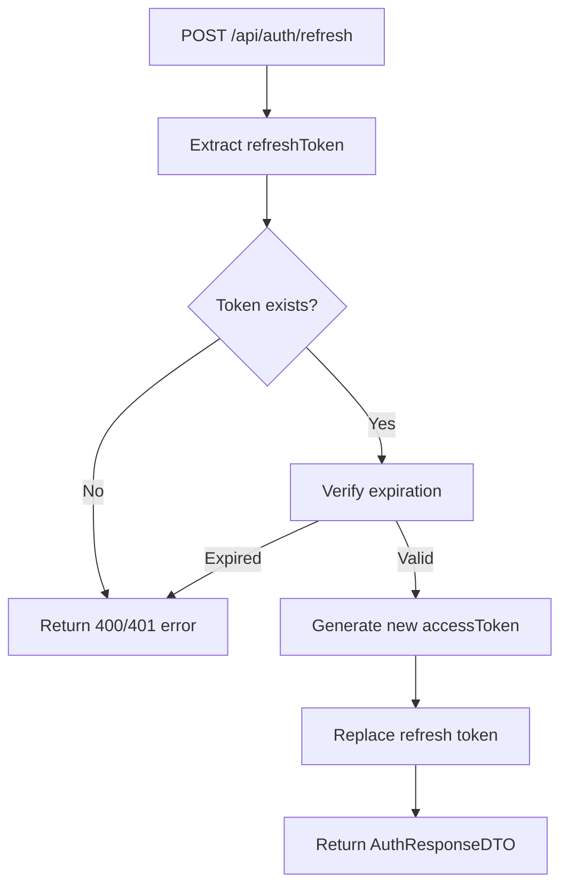
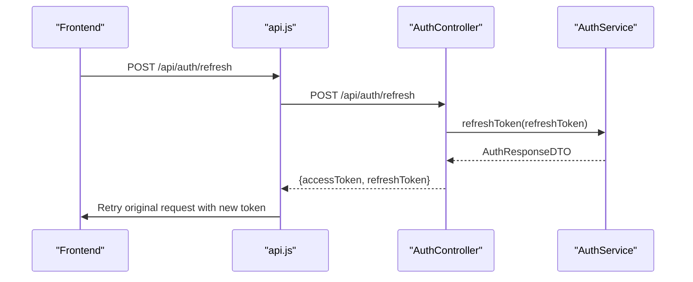
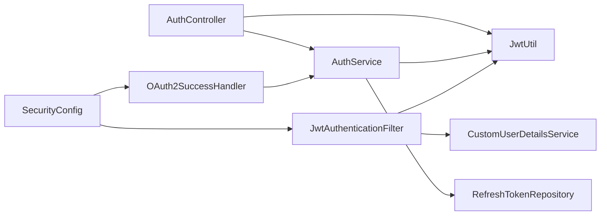

# Authentication API

<cite>
**Referenced Files in This Document**
- [AuthController.java](file://src/main/java/com/chatify/chat_backend/controller/AuthController.java)
- [AuthService.java](file://src/main/java/com/chatify/chat_backend/service/AuthService.java)
- [UserRegistrationDTO.java](file://src/main/java/com/chatify/chat_backend/dto/UserRegistrationDTO.java)
- [UserLoginDTO.java](file://src/main/java/com/chatify/chat_backend/dto/UserLoginDTO.java)
- [AuthResponseDTO.java](file://src/main/java/com/chatify/chat_backend/dto/AuthResponseDTO.java)
- [RefreshToken.java](file://src/main/java/com/chatify/chat_backend/entity/RefreshToken.java)
- [RefreshTokenRepository.java](file://src/main/java/com/chatify/chat_backend/repository/RefreshTokenRepository.java)
- [JwtUtil.java](file://src/main/java/com/chatify/chat_backend/security/JwtUtil.java)
- [JwtAuthenticationFilter.java](file://src/main/java/com/chatify/chat_backend/security/JwtAuthenticationFilter.java)
- [OAuth2SuccessHandler.java](file://src/main/java/com/chatify/chat_backend/security/OAuth2SuccessHandler.java)
- [SecurityConfig.java](file://src/main/java/com/chatify/chat_backend/config/SecurityConfig.java)
- [auth.js](file://chatify-frontend/src/api/auth.js)
- [api.js](file://chatify-frontend/src/services/api.js)
- [OAuthCallback.jsx](file://chatify-frontend/src/pages/OAuthCallback.jsx)
- [AuthContext.jsx](file://chatify-frontend/src/context/AuthContext.jsx)
</cite>

## Table of Contents
1. [Introduction](#introduction)
2. [Project Structure](#project-structure)
3. [Core Components](#core-components)
4. [Architecture Overview](#architecture-overview)
5. [Detailed Component Analysis](#detailed-component-analysis)
6. [Dependency Analysis](#dependency-analysis)
7. [Performance Considerations](#performance-considerations)
8. [Troubleshooting Guide](#troubleshooting-guide)
9. [Conclusion](#conclusion)
10. [Appendices](#appendices)

## Introduction
This document provides comprehensive API documentation for the Authentication API, covering user registration, login, OAuth2 token exchange, refresh token management, and logout. It explains request/response schemas, JWT token handling, OAuth2 Google integration using HttpOnly cookies, token validation, refresh token mechanisms, and client-side integration for a React frontend. It also includes authentication flow diagrams, security considerations, rate limiting strategies, error handling patterns, curl examples, and debugging approaches.

## Project Structure
The authentication subsystem spans backend controllers, services, DTOs, entities, repositories, and security filters, plus a React frontend that integrates with the backend APIs.



**Diagram sources**
- [AuthController.java:19-140](file://src/main/java/com/chatify/chat_backend/controller/AuthController.java#L19-L140)
- [AuthService.java:21-162](file://src/main/java/com/chatify/chat_backend/service/AuthService.java#L21-L162)
- [JwtUtil.java:18-145](file://src/main/java/com/chatify/chat_backend/security/JwtUtil.java#L18-L145)
- [JwtAuthenticationFilter.java:16-78](file://src/main/java/com/chatify/chat_backend/security/JwtAuthenticationFilter.java#L16-L78)
- [OAuth2SuccessHandler.java:20-88](file://src/main/java/com/chatify/chat_backend/security/OAuth2SuccessHandler.java#L20-L88)
- [SecurityConfig.java:27-120](file://src/main/java/com/chatify/chat_backend/config/SecurityConfig.java#L27-L120)
- [RefreshToken.java:10-31](file://src/main/java/com/chatify/chat_backend/entity/RefreshToken.java#L10-L31)
- [RefreshTokenRepository.java:10-20](file://src/main/java/com/chatify/chat_backend/repository/RefreshTokenRepository.java#L10-L20)
- [api.js:1-121](file://chatify-frontend/src/services/api.js#L1-L121)
- [OAuthCallback.jsx:1-63](file://chatify-frontend/src/pages/OAuthCallback.jsx#L1-L63)
- [AuthContext.jsx:1-53](file://chatify-frontend/src/context/AuthContext.jsx#L1-L53)

**Section sources**
- [AuthController.java:19-140](file://src/main/java/com/chatify/chat_backend/controller/AuthController.java#L19-L140)
- [AuthService.java:21-162](file://src/main/java/com/chatify/chat_backend/service/AuthService.java#L21-L162)
- [SecurityConfig.java:27-120](file://src/main/java/com/chatify/chat_backend/config/SecurityConfig.java#L27-L120)

## Core Components
- AuthController: Exposes endpoints for registration, login, OAuth2 token exchange, refresh, and logout.
- AuthService: Implements business logic for registration, login, OAuth2 user linking, token generation, refresh token lifecycle, and logout cleanup.
- DTOs: UserRegistrationDTO, UserLoginDTO, AuthResponseDTO define request/response schemas.
- JwtUtil: Generates and validates JWTs with configurable secret and expiration.
- JwtAuthenticationFilter: Extracts and validates Authorization Bearer tokens for protected routes.
- OAuth2SuccessHandler: Handles OAuth2 success, prepares AuthResponseDTO payload in an HttpOnly cookie, and redirects back to the frontend.
- SecurityConfig: Configures CORS, CSRF, session policy, permitAll for auth endpoints, and OAuth2 success handler.
- Frontend API integrations: Axios wrapper, OAuth callback page, and AuthContext manage tokens and refresh logic.

**Section sources**
- [AuthController.java:35-140](file://src/main/java/com/chatify/chat_backend/controller/AuthController.java#L35-L140)
- [AuthService.java:45-162](file://src/main/java/com/chatify/chat_backend/service/AuthService.java#L45-L162)
- [UserRegistrationDTO.java:10-17](file://src/main/java/com/chatify/chat_backend/dto/UserRegistrationDTO.java#L10-L17)
- [UserLoginDTO.java:10-15](file://src/main/java/com/chatify/chat_backend/dto/UserLoginDTO.java#L10-L15)
- [AuthResponseDTO.java:10-16](file://src/main/java/com/chatify/chat_backend/dto/AuthResponseDTO.java#L10-L16)
- [JwtUtil.java:55-118](file://src/main/java/com/chatify/chat_backend/security/JwtUtil.java#L55-L118)
- [JwtAuthenticationFilter.java:27-77](file://src/main/java/com/chatify/chat_backend/security/JwtAuthenticationFilter.java#L27-L77)
- [OAuth2SuccessHandler.java:38-87](file://src/main/java/com/chatify/chat_backend/security/OAuth2SuccessHandler.java#L38-L87)
- [SecurityConfig.java:61-88](file://src/main/java/com/chatify/chat_backend/config/SecurityConfig.java#L61-L88)

## Architecture Overview
The authentication architecture separates concerns across controllers, services, security filters, and repositories. JWTs secure protected routes, while OAuth2 Google integration uses HttpOnly cookies to safely transport tokens to the frontend.



**Diagram sources**
- [SecurityConfig.java:83-88](file://src/main/java/com/chatify/chat_backend/config/SecurityConfig.java#L83-L88)
- [OAuth2SuccessHandler.java:38-87](file://src/main/java/com/chatify/chat_backend/security/OAuth2SuccessHandler.java#L38-L87)
- [AuthController.java:69-107](file://src/main/java/com/chatify/chat_backend/controller/AuthController.java#L69-L107)
- [AuthService.java:84-110](file://src/main/java/com/chatify/chat_backend/service/AuthService.java#L84-L110)
- [JwtUtil.java:60-79](file://src/main/java/com/chatify/chat_backend/security/JwtUtil.java#L60-L79)
- [RefreshTokenRepository.java:11-19](file://src/main/java/com/chatify/chat_backend/repository/RefreshTokenRepository.java#L11-L19)

## Detailed Component Analysis

### Endpoints and Schemas

- POST /api/auth/register
  - Purpose: Register a new local user.
  - Request body: UserRegistrationDTO
    - Fields: username, email, password
  - Response: 200 OK with message on success; 400 Bad Request with error on failure.
  - Notes: Validates uniqueness of username and email.

- POST /api/auth/login
  - Purpose: Authenticate a local user and issue tokens.
  - Request body: UserLoginDTO
    - Fields: email, password
  - Response: 200 OK with AuthResponseDTO on success; 401 Unauthorized with error on failure.
  - Notes: Issues access token and refresh token.

- GET /api/auth/oauth2/token
  - Purpose: Exchange the HttpOnly cookie set by OAuth2SuccessHandler for JWT tokens.
  - Query/Headers: None required; relies on cookies.
  - Response: 200 OK with AuthResponseDTO; 401 Unauthorized with error on failure.
  - Notes: Cookie is HttpOnly, path-scoped, and deleted after single use.

- POST /api/auth/refresh
  - Purpose: Issue new access and refresh tokens using a valid refresh token.
  - Request body: { refreshToken: string }
  - Response: 200 OK with AuthResponseDTO; 400/401 on invalid/expired refresh token.
  - Notes: Validates refresh token existence and expiration.

- POST /api/auth/logout
  - Purpose: Invalidate refresh tokens for the current user and allow logout.
  - Headers: Authorization Bearer token (optional).
  - Response: 200 OK with message.
  - Notes: Attempts to revoke refresh tokens if a valid Bearer token is provided.

**Section sources**
- [AuthController.java:35-140](file://src/main/java/com/chatify/chat_backend/controller/AuthController.java#L35-L140)
- [UserRegistrationDTO.java:10-17](file://src/main/java/com/chatify/chat_backend/dto/UserRegistrationDTO.java#L10-L17)
- [UserLoginDTO.java:10-15](file://src/main/java/com/chatify/chat_backend/dto/UserLoginDTO.java#L10-L15)
- [AuthResponseDTO.java:10-16](file://src/main/java/com/chatify/chat_backend/dto/AuthResponseDTO.java#L10-L16)

### DTO Definitions



**Diagram sources**
- [UserRegistrationDTO.java:10-17](file://src/main/java/com/chatify/chat_backend/dto/UserRegistrationDTO.java#L10-L17)
- [UserLoginDTO.java:10-15](file://src/main/java/com/chatify/chat_backend/dto/UserLoginDTO.java#L10-L15)
- [AuthResponseDTO.java:10-16](file://src/main/java/com/chatify/chat_backend/dto/AuthResponseDTO.java#L10-L16)

**Section sources**
- [UserRegistrationDTO.java:10-17](file://src/main/java/com/chatify/chat_backend/dto/UserRegistrationDTO.java#L10-L17)
- [UserLoginDTO.java:10-15](file://src/main/java/com/chatify/chat_backend/dto/UserLoginDTO.java#L10-L15)
- [AuthResponseDTO.java:10-16](file://src/main/java/com/chatify/chat_backend/dto/AuthResponseDTO.java#L10-L16)

### JWT Token Handling
- Generation: Access tokens are generated with a configurable expiration and HS256 signature using a Base64-encoded secret.
- Validation: Tokens are validated by signature and expiration; optional subject matching.
- Usage: Authorization header carries Bearer tokens for protected routes; JwtAuthenticationFilter extracts and sets authentication.



**Diagram sources**
- [JwtUtil.java:96-118](file://src/main/java/com/chatify/chat_backend/security/JwtUtil.java#L96-L118)

**Section sources**
- [JwtUtil.java:55-118](file://src/main/java/com/chatify/chat_backend/security/JwtUtil.java#L55-L118)
- [JwtAuthenticationFilter.java:37-67](file://src/main/java/com/chatify/chat_backend/security/JwtAuthenticationFilter.java#L37-L67)

### OAuth2 Google Integration with HttpOnly Cookie Pattern
- Backend sets an HttpOnly cookie named oauth2_pending containing a Base64-encoded JSON payload of AuthResponseDTO.
- Cookie is scoped to path "/" and expires in two minutes.
- Frontend calls GET /api/auth/oauth2/token with credentials enabled to receive tokens and immediately delete the cookie.
- After successful exchange, frontend stores tokens and navigates to chat.



**Diagram sources**
- [OAuth2SuccessHandler.java:38-87](file://src/main/java/com/chatify/chat_backend/security/OAuth2SuccessHandler.java#L38-L87)
- [AuthController.java:69-107](file://src/main/java/com/chatify/chat_backend/controller/AuthController.java#L69-L107)
- [AuthService.java:84-110](file://src/main/java/com/chatify/chat_backend/service/AuthService.java#L84-L110)

**Section sources**
- [OAuth2SuccessHandler.java:38-87](file://src/main/java/com/chatify/chat_backend/security/OAuth2SuccessHandler.java#L38-L87)
- [AuthController.java:69-107](file://src/main/java/com/chatify/chat_backend/controller/AuthController.java#L69-L107)
- [OAuthCallback.jsx:15-51](file://chatify-frontend/src/pages/OAuthCallback.jsx#L15-L51)

### Refresh Token Management
- On login or OAuth2 login, a refresh token is generated and persisted with an expiration.
- On refresh, the backend verifies the refresh token’s existence and expiration, issues a new access token, and replaces the refresh token.
- On logout, refresh tokens for the user are deleted.



**Diagram sources**
- [AuthService.java:122-142](file://src/main/java/com/chatify/chat_backend/service/AuthService.java#L122-L142)
- [RefreshTokenRepository.java:11-19](file://src/main/java/com/chatify/chat_backend/repository/RefreshTokenRepository.java#L11-L19)

**Section sources**
- [AuthService.java:112-142](file://src/main/java/com/chatify/chat_backend/service/AuthService.java#L112-L142)
- [RefreshToken.java:15-31](file://src/main/java/com/chatify/chat_backend/entity/RefreshToken.java#L15-L31)
- [RefreshTokenRepository.java:11-19](file://src/main/java/com/chatify/chat_backend/repository/RefreshTokenRepository.java#L11-L19)

### Logout Flow
- Frontend calls POST /api/auth/logout.
- If Authorization header is present and valid, backend revokes refresh tokens for the user.
- Response is a success message regardless of token validity.

**Section sources**
- [AuthController.java:123-139](file://src/main/java/com/chatify/chat_backend/controller/AuthController.java#L123-L139)
- [AuthService.java:144-150](file://src/main/java/com/chatify/chat_backend/service/AuthService.java#L144-L150)

### Frontend Integration Guidelines
- Axios wrapper adds Authorization header automatically from localStorage.
- Response interceptor handles 401/403 by attempting refresh token flow and queueing failed requests.
- OAuthCallback exchanges the HttpOnly cookie for tokens and logs the user in.
- AuthContext persists tokens and user data in localStorage.



**Diagram sources**
- [api.js:78-96](file://chatify-frontend/src/services/api.js#L78-L96)
- [AuthController.java:109-121](file://src/main/java/com/chatify/chat_backend/controller/AuthController.java#L109-L121)
- [AuthService.java:122-134](file://src/main/java/com/chatify/chat_backend/service/AuthService.java#L122-L134)

**Section sources**
- [api.js:11-97](file://chatify-frontend/src/services/api.js#L11-L97)
- [auth.js:1-22](file://chatify-frontend/src/api/auth.js#L1-L22)
- [OAuthCallback.jsx:15-51](file://chatify-frontend/src/pages/OAuthCallback.jsx#L15-L51)
- [AuthContext.jsx:30-44](file://chatify-frontend/src/context/AuthContext.jsx#L30-L44)

## Dependency Analysis
- AuthController depends on AuthService, JwtUtil, and Jackson ObjectMapper for cookie serialization.
- AuthService depends on UserRepository, RefreshTokenRepository, PasswordEncoder, and JwtUtil.
- JwtAuthenticationFilter depends on JwtUtil and CustomUserDetailsService.
- OAuth2SuccessHandler depends on AuthService and ObjectMapper.
- SecurityConfig wires JwtAuthenticationFilter, OAuth2SuccessHandler, and permits unauthenticated access to auth endpoints.



**Diagram sources**
- [AuthController.java:25-33](file://src/main/java/com/chatify/chat_backend/controller/AuthController.java#L25-L33)
- [AuthService.java:26-43](file://src/main/java/com/chatify/chat_backend/service/AuthService.java#L26-L43)
- [JwtAuthenticationFilter.java:19-25](file://src/main/java/com/chatify/chat_backend/security/JwtAuthenticationFilter.java#L19-L25)
- [OAuth2SuccessHandler.java:27-36](file://src/main/java/com/chatify/chat_backend/security/OAuth2SuccessHandler.java#L27-L36)
- [SecurityConfig.java:61-88](file://src/main/java/com/chatify/chat_backend/config/SecurityConfig.java#L61-L88)

**Section sources**
- [AuthController.java:25-33](file://src/main/java/com/chatify/chat_backend/controller/AuthController.java#L25-L33)
- [AuthService.java:26-43](file://src/main/java/com/chatify/chat_backend/service/AuthService.java#L26-L43)
- [JwtAuthenticationFilter.java:19-25](file://src/main/java/com/chatify/chat_backend/security/JwtAuthenticationFilter.java#L19-L25)
- [OAuth2SuccessHandler.java:27-36](file://src/main/java/com/chatify/chat_backend/security/OAuth2SuccessHandler.java#L27-L36)
- [SecurityConfig.java:61-88](file://src/main/java/com/chatify/chat_backend/config/SecurityConfig.java#L61-L88)

## Performance Considerations
- Token expiration: Configure access token lifetime to balance security and UX.
- Refresh token storage: Keep refresh tokens in secure storage; avoid storing in memory only to prevent replay.
- Database queries: Ensure refresh token repository queries are indexed on token and user.
- CORS: Allow only necessary origins and headers to minimize preflight overhead.
- Rate limiting: Apply per-endpoint rate limits for /api/auth/register, /api/auth/login, and /api/auth/refresh to mitigate brute-force attacks.

[No sources needed since this section provides general guidance]

## Troubleshooting Guide
Common issues and resolutions:
- Invalid credentials on login: Returns 401 with error message; verify email/password.
- Missing or invalid refresh token: Returns 400/401; ensure frontend stores refreshToken and retries only when available.
- OAuth2 session expired: /api/auth/oauth2/token returns 401; trigger OAuth2 login again.
- Frontend cannot exchange cookie: Ensure withCredentials is enabled and CORS allows credentials.
- Protected route unauthorized: Verify Authorization header and token validity; check JwtAuthenticationFilter configuration.

**Section sources**
- [AuthController.java:50-52](file://src/main/java/com/chatify/chat_backend/controller/AuthController.java#L50-L52)
- [AuthController.java:118-120](file://src/main/java/com/chatify/chat_backend/controller/AuthController.java#L118-L120)
- [AuthController.java:74-87](file://src/main/java/com/chatify/chat_backend/controller/AuthController.java#L74-L87)
- [api.js:78-96](file://chatify-frontend/src/services/api.js#L78-L96)

## Conclusion
The Authentication API provides robust local and OAuth2 login flows, secure JWT handling, and a reliable refresh token mechanism. The HttpOnly cookie pattern for OAuth2 token exchange mitigates XSS risks. The frontend integrates seamlessly with Axios interceptors to handle token refresh and logout. Proper configuration of secrets, expiration, and CORS ensures a secure and performant authentication experience.

[No sources needed since this section summarizes without analyzing specific files]

## Appendices

### API Reference and Examples

- POST /api/auth/register
  - Request body: UserRegistrationDTO
  - Example curl:
    ```bash
    curl -X POST https://yourdomain.com/api/auth/register \
      -H "Content-Type: application/json" \
      -d '{"username":"alice","email":"alice@example.com","password":"securePass123"}'
    ```

- POST /api/auth/login
  - Request body: UserLoginDTO
  - Example curl:
    ```bash
    curl -X POST https://yourdomain.com/api/auth/login \
      -H "Content-Type: application/json" \
      -d '{"email":"alice@example.com","password":"securePass123"}'
    ```

- GET /api/auth/oauth2/token
  - Example curl:
    ```bash
    curl -b cookies.txt -c cookies.txt -X GET "https://yourdomain.com/api/auth/oauth2/token" --cookie-jar cookies.txt
    ```
  - Notes: Cookies must be enabled; the backend sets an HttpOnly cookie on OAuth2 success.

- POST /api/auth/refresh
  - Request body: { refreshToken: string }
  - Example curl:
    ```bash
    curl -X POST https://yourdomain.com/api/auth/refresh \
      -H "Content-Type: application/json" \
      -d '{"refreshToken":"<your-refresh-token>"}'
    ```

- POST /api/auth/logout
  - Example curl:
    ```bash
    curl -X POST https://yourdomain.com/api/auth/logout \
      -H "Authorization: Bearer <your-access-token>"
    ```

**Section sources**
- [AuthController.java:35-140](file://src/main/java/com/chatify/chat_backend/controller/AuthController.java#L35-L140)
- [UserRegistrationDTO.java:10-17](file://src/main/java/com/chatify/chat_backend/dto/UserRegistrationDTO.java#L10-L17)
- [UserLoginDTO.java:10-15](file://src/main/java/com/chatify/chat_backend/dto/UserLoginDTO.java#L10-L15)
- [AuthResponseDTO.java:10-16](file://src/main/java/com/chatify/chat_backend/dto/AuthResponseDTO.java#L10-L16)

### Client Implementation Guidelines (React)
- Use Axios wrapper to attach Authorization header automatically.
- Implement response interceptor to refresh tokens on 401/403 and queue failed requests.
- Store tokens and user data in AuthContext and localStorage.
- For OAuth2, navigate to the OAuth2 authorization URL and handle the callback page to exchange the cookie for tokens.

**Section sources**
- [api.js:11-97](file://chatify-frontend/src/services/api.js#L11-L97)
- [AuthContext.jsx:30-44](file://chatify-frontend/src/context/AuthContext.jsx#L30-L44)
- [OAuthCallback.jsx:15-51](file://chatify-frontend/src/pages/OAuthCallback.jsx#L15-L51)

### Security Considerations
- Secret management: Ensure JWT secret is Base64-encoded and at least 256 bits long; load via environment variable.
- Token storage: Store access tokens in memory and refresh tokens securely; avoid exposing tokens in URLs.
- Cookie security: HttpOnly, SameSite=Lax, short max age for OAuth2 cookie; delete after single use.
- CORS: Restrict allowed origins and enable credentials only when necessary.

**Section sources**
- [JwtUtil.java:21-53](file://src/main/java/com/chatify/chat_backend/security/JwtUtil.java#L21-L53)
- [OAuth2SuccessHandler.java:69-76](file://src/main/java/com/chatify/chat_backend/security/OAuth2SuccessHandler.java#L69-L76)
- [SecurityConfig.java:107-119](file://src/main/java/com/chatify/chat_backend/config/SecurityConfig.java#L107-L119)

### Rate Limiting Strategies
- Apply sliding window or token bucket rate limits per IP for:
  - /api/auth/register
  - /api/auth/login
  - /api/auth/refresh
- Enforce limits server-side and expose metrics for monitoring.

[No sources needed since this section provides general guidance]