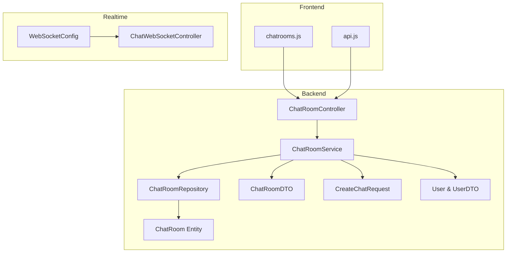
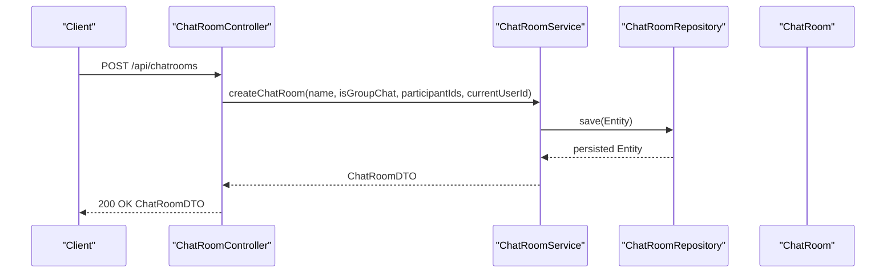
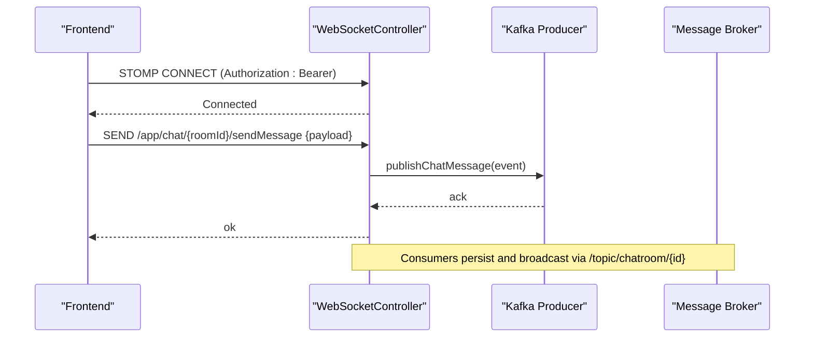
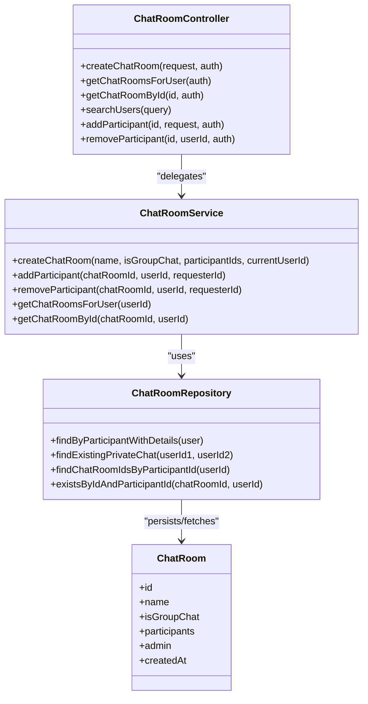

# Chat Room API

<cite>
**Referenced Files in This Document**
- [ChatRoomController.java](file://src/main/java/com/chatify/chat_backend/controller/ChatRoomController.java)
- [ChatRoomService.java](file://src/main/java/com/chatify/chat_backend/service/ChatRoomService.java)
- [ChatRoomRepository.java](file://src/main/java/com/chatify/chat_backend/repository/ChatRoomRepository.java)
- [ChatRoom.java](file://src/main/java/com/chatify/chat_backend/entity/ChatRoom.java)
- [ChatRoomDTO.java](file://src/main/java/com/chatify/chat_backend/dto/ChatRoomDTO.java)
- [CreateChatRequest.java](file://src/main/java/com/chatify/chat_backend/dto/CreateChatRequest.java)
- [UserDTO.java](file://src/main/java/com/chatify/chat_backend/dto/UserDTO.java)
- [User.java](file://src/main/java/com/chatify/chat_backend/entity/User.java)
- [UnreadCountDTO.java](file://src/main/java/com/chatify/chat_backend/dto/UnreadCountDTO.java)
- [MessageDTO.java](file://src/main/java/com/chatify/chat_backend/dto/MessageDTO.java)
- [WebSocketConfig.java](file://src/main/java/com/chatify/chat_backend/config/WebSocketConfig.java)
- [ChatWebSocketController.java](file://src/main/java/com/chatify/chat_backend/controller/ChatWebSocketController.java)
- [WebSocketEventListener.java](file://src/main/java/com/chatify/chat_backend/listener/WebSocketEventListener.java)
- [chatrooms.js](file://chatify-frontend/src/api/chatrooms.js)
- [api.js](file://chatify-frontend/src/services/api.js)
</cite>

## Table of Contents
1. [Introduction](#introduction)
2. [Project Structure](#project-structure)
3. [Core Components](#core-components)
4. [Architecture Overview](#architecture-overview)
5. [Detailed Component Analysis](#detailed-component-analysis)
6. [Dependency Analysis](#dependency-analysis)
7. [Performance Considerations](#performance-considerations)
8. [Troubleshooting Guide](#troubleshooting-guide)
9. [Conclusion](#conclusion)
10. [Appendices](#appendices)

## Introduction
This document provides API documentation for the Chat Room module, focusing on chat room creation, member management, and operations. It covers HTTP endpoints under /api/chatrooms, request/response schemas, permission controls, chat room lifecycle, and real-time synchronization via WebSocket. It also outlines concurrency considerations and operational best practices.

## Project Structure
The Chat Room API is implemented in a Spring Boot backend with DTOs, entities, repositories, services, and controllers. Frontend clients consume these endpoints via Axios and integrate with a WebSocket broker for real-time updates.

**Diagram sources**
- [ChatRoomController.java:16-102](file://src/main/java/com/chatify/chat_backend/controller/ChatRoomController.java#L16-L102)
- [ChatRoomService.java:25-46](file://src/main/java/com/chatify/chat_backend/service/ChatRoomService.java#L25-L46)
- [ChatRoomRepository.java:13-51](file://src/main/java/com/chatify/chat_backend/repository/ChatRoomRepository.java#L13-L51)
- [ChatRoom.java:11-45](file://src/main/java/com/chatify/chat_backend/entity/ChatRoom.java#L11-L45)
- [ChatRoomDTO.java:11-31](file://src/main/java/com/chatify/chat_backend/dto/ChatRoomDTO.java#L11-L31)
- [CreateChatRequest.java:5-26](file://src/main/java/com/chatify/chat_backend/dto/CreateChatRequest.java#L5-L26)
- [User.java:11-56](file://src/main/java/com/chatify/chat_backend/entity/User.java#L11-L56)
- [WebSocketConfig.java:27-111](file://src/main/java/com/chatify/chat_backend/config/WebSocketConfig.java#L27-L111)
- [ChatWebSocketController.java:22-47](file://src/main/java/com/chatify/chat_backend/controller/ChatWebSocketController.java#L22-L47)
- [chatrooms.js:1-31](file://chatify-frontend/src/api/chatrooms.js#L1-L31)
- [api.js:1-121](file://chatify-frontend/src/services/api.js#L1-L121)

**Section sources**
- [ChatRoomController.java:16-102](file://src/main/java/com/chatify/chat_backend/controller/ChatRoomController.java#L16-L102)
- [ChatRoomService.java:25-46](file://src/main/java/com/chatify/chat_backend/service/ChatRoomService.java#L25-L46)
- [ChatRoomRepository.java:13-51](file://src/main/java/com/chatify/chat_backend/repository/ChatRoomRepository.java#L13-L51)
- [ChatRoom.java:11-45](file://src/main/java/com/chatify/chat_backend/entity/ChatRoom.java#L11-L45)
- [ChatRoomDTO.java:11-31](file://src/main/java/com/chatify/chat_backend/dto/ChatRoomDTO.java#L11-L31)
- [CreateChatRequest.java:5-26](file://src/main/java/com/chatify/chat_backend/dto/CreateChatRequest.java#L5-L26)
- [User.java:11-56](file://src/main/java/com/chatify/chat_backend/entity/User.java#L11-L56)
- [WebSocketConfig.java:27-111](file://src/main/java/com/chatify/chat_backend/config/WebSocketConfig.java#L27-L111)
- [ChatWebSocketController.java:22-47](file://src/main/java/com/chatify/chat_backend/controller/ChatWebSocketController.java#L22-L47)
- [chatrooms.js:1-31](file://chatify-frontend/src/api/chatrooms.js#L1-L31)
- [api.js:1-121](file://chatify-frontend/src/services/api.js#L1-L121)

## Core Components
- ChatRoomController: Exposes REST endpoints for chat room CRUD and participant management.
- ChatRoomService: Implements business logic for creation, membership management, and DTO mapping.
- ChatRoomRepository: JPA repository with optimized queries for chat rooms and participants.
- ChatRoom Entity: JPA entity representing chat rooms with group/private flags, participants, admin, and timestamps.
- DTOs: ChatRoomDTO, CreateChatRequest, UserDTO, MessageDTO, UnreadCountDTO define request/response shapes.
- WebSocket: Real-time messaging and presence updates via STOMP over SockJS.

**Section sources**
- [ChatRoomController.java:16-102](file://src/main/java/com/chatify/chat_backend/controller/ChatRoomController.java#L16-L102)
- [ChatRoomService.java:25-46](file://src/main/java/com/chatify/chat_backend/service/ChatRoomService.java#L25-L46)
- [ChatRoomRepository.java:13-51](file://src/main/java/com/chatify/chat_backend/repository/ChatRoomRepository.java#L13-L51)
- [ChatRoom.java:11-45](file://src/main/java/com/chatify/chat_backend/entity/ChatRoom.java#L11-L45)
- [ChatRoomDTO.java:11-31](file://src/main/java/com/chatify/chat_backend/dto/ChatRoomDTO.java#L11-L31)
- [CreateChatRequest.java:5-26](file://src/main/java/com/chatify/chat_backend/dto/CreateChatRequest.java#L5-L26)
- [UserDTO.java:10-22](file://src/main/java/com/chatify/chat_backend/dto/UserDTO.java#L10-L22)
- [MessageDTO.java:12-33](file://src/main/java/com/chatify/chat_backend/dto/MessageDTO.java#L12-L33)
- [UnreadCountDTO.java:3-6](file://src/main/java/com/chatify/chat_backend/dto/UnreadCountDTO.java#L3-L6)

## Architecture Overview
The API follows layered architecture:
- Controllers expose endpoints and delegate to services.
- Services encapsulate domain logic, enforce permissions, and orchestrate repositories.
- Repositories manage persistence with optimized queries.
- DTOs decouple internal entities from external APIs.
- WebSocket endpoints enable real-time updates and presence.

**Diagram sources**
- [ChatRoomController.java:28-44](file://src/main/java/com/chatify/chat_backend/controller/ChatRoomController.java#L28-L44)
- [ChatRoomService.java:110-156](file://src/main/java/com/chatify/chat_backend/service/ChatRoomService.java#L110-L156)
- [ChatRoomRepository.java:13-51](file://src/main/java/com/chatify/chat_backend/repository/ChatRoomRepository.java#L13-L51)
- [ChatRoom.java:11-45](file://src/main/java/com/chatify/chat_backend/entity/ChatRoom.java#L11-L45)

## Detailed Component Analysis

### REST Endpoints

- Base Path: /api/chatrooms
- Authentication: Requires a valid Bearer token; endpoints use method-level security.

Endpoints:
- POST /
  - Purpose: Create a chat room.
  - Authenticated user is the creator/admin for group chats.
  - Private chat creation enforces exactly one participant besides the creator.
  - Request body: CreateChatRequest
  - Response: ChatRoomDTO

- GET /
  - Purpose: List chat rooms for the authenticated user.
  - Response: Array of ChatRoomDTO

- GET /{id}
  - Purpose: Retrieve a specific chat room by ID if the user is a participant.
  - Response: ChatRoomDTO

- GET /search?query={term}
  - Purpose: Search users by username or email (client-side filtering in current implementation).
  - Response: Array of UserDTO

- POST /{id}/participants
  - Purpose: Add a participant to a group chat.
  - Request body: { "userId": number }
  - Response: ChatRoomDTO

- DELETE /{id}/participants/{userId}
  - Purpose: Remove a participant from a group chat.
  - Response: ChatRoomDTO

Notes:
- Private chat creation is validated server-side; duplicate private chats are returned if found.
- Group chat requires at least one participant besides the creator.
- Only the admin can add/remove participants in group chats.

**Section sources**
- [ChatRoomController.java:28-102](file://src/main/java/com/chatify/chat_backend/controller/ChatRoomController.java#L28-L102)
- [ChatRoomService.java:110-194](file://src/main/java/com/chatify/chat_backend/service/ChatRoomService.java#L110-L194)
- [ChatRoomRepository.java:28-39](file://src/main/java/com/chatify/chat_backend/repository/ChatRoomRepository.java#L28-L39)

### Request and Response Schemas

- CreateChatRequest
  - name: string
  - isGroupChat: boolean
  - participantIds: array of numbers

- ChatRoomDTO
  - id: number
  - name: string
  - isGroupChat: boolean
  - participants: array of UserDTO
  - admin: UserDTO or null
  - createdAt: datetime
  - unreadCount: number
  - lastMessage: string or null
  - lastMessageTimestamp: datetime or null
  - lastMessageSenderId: number or null
  - lastMessageSenderName: string or null

- UserDTO
  - id: number
  - username: string
  - email: string
  - profilePicture: string or null
  - status: enum string
  - lastSeen: datetime or null
  - createdAt: datetime

- MessageDTO (used for last message fields)
  - id: number
  - content: string
  - messageType: enum string
  - fileUrl: string or null
  - fileName: string or null
  - senderId: number
  - senderUsername: string
  - chatRoomId: number
  - timestamp: datetime
  - readByUserIds: array of numbers
  - status: enum string

- UnreadCountDTO (projection interface)
  - chatRoomId: number
  - unreadCount: number

**Section sources**
- [CreateChatRequest.java:5-26](file://src/main/java/com/chatify/chat_backend/dto/CreateChatRequest.java#L5-L26)
- [ChatRoomDTO.java:14-31](file://src/main/java/com/chatify/chat_backend/dto/ChatRoomDTO.java#L14-L31)
- [UserDTO.java:13-22](file://src/main/java/com/chatify/chat_backend/dto/UserDTO.java#L13-L22)
- [MessageDTO.java:15-33](file://src/main/java/com/chatify/chat_backend/dto/MessageDTO.java#L15-L33)
- [UnreadCountDTO.java:3-6](file://src/main/java/com/chatify/chat_backend/dto/UnreadCountDTO.java#L3-L6)

### Permission Controls and Lifecycle

- Private vs Group
  - Private chat: isGroupChat=false; enforced to have exactly one other participant.
  - Group chat: isGroupChat=true; admin is the creator; admin can manage members.

- Membership Management
  - Add participant: Only admin can add; validates group chat and admin ownership.
  - Remove participant: Only admin can remove; validates group chat and admin ownership.
  - Access control: getChatRoomById checks participant membership; unauthorized users receive an error.

- Metadata and Visibility
  - ChatRoom entity stores name, isGroupChat flag, participants, admin, and createdAt.
  - No explicit visibility flag is present; access is controlled by membership.

- Lifecycle
  - Creation: Validates type and participant counts; deduplicates private chats; persists and maps DTO.
  - Retrieval: Optimized batch queries for room lists; single queries for individual rooms.
  - Updates: Participants added/removed via dedicated endpoints; admin-only.

**Section sources**
- [ChatRoomService.java:110-194](file://src/main/java/com/chatify/chat_backend/service/ChatRoomService.java#L110-L194)
- [ChatRoomRepository.java:28-39](file://src/main/java/com/chatify/chat_backend/repository/ChatRoomRepository.java#L28-L39)
- [ChatRoom.java:17-43](file://src/main/java/com/chatify/chat_backend/entity/ChatRoom.java#L17-L43)

### Real-Time Synchronization

- WebSocket Broker
  - Endpoint: /ws (SockJS-enabled)
  - Message broker destinations: /topic and /user
  - Authentication: CONNECT frames must include a valid Bearer token; parsed by JWT filter.

- WebSocket Endpoints
  - /chat/{roomId}/sendMessage: Publishes events to Kafka; consumers persist and broadcast.
  - /chat.read/{messageId}: Acknowledges read receipts; broadcasts to /topic/chatroom/{id}/read.
  - /chat.delivered: Acknowledges delivery; broadcasts to /topic/chatroom/{id}/delivery.
  - /chat.seen: Acknowledges seen; broadcasts to /topic/chatroom/{id}/seen.
  - /presence.update: Updates and broadcasts presence changes.

- Frontend Integration
  - Frontend connects to /ws and subscribes to room-specific topics.
  - Messages are sent via the primary /chat/{roomId}/sendMessage mapping.

**Diagram sources**
- [WebSocketConfig.java:43-111](file://src/main/java/com/chatify/chat_backend/config/WebSocketConfig.java#L43-L111)
- [ChatWebSocketController.java:81-110](file://src/main/java/com/chatify/chat_backend/controller/ChatWebSocketController.java#L81-L110)

**Section sources**
- [WebSocketConfig.java:27-111](file://src/main/java/com/chatify/chat_backend/config/WebSocketConfig.java#L27-L111)
- [ChatWebSocketController.java:22-181](file://src/main/java/com/chatify/chat_backend/controller/ChatWebSocketController.java#L22-L181)
- [WebSocketEventListener.java:16-55](file://src/main/java/com/chatify/chat_backend/listener/WebSocketEventListener.java#L16-L55)

### Concurrency and Consistency Considerations

- Transactional Boundaries
  - Member add/remove and creation are transactional to maintain consistency.
  - Access checks occur within transactions to prevent race conditions.

- Idempotent Private Chat Creation
  - Duplicate private chats are detected and returned without duplication.

- Read State and Unread Counts
  - Batched queries fetch last messages, unread counts, and user read states efficiently.
  - Single-room mapping recalculates unread counts when needed.

- WebSocket Delivery Guarantees
  - STOMP acknowledgements for delivered/seen/read are supported; consumers broadcast updates to subscribed clients.

**Section sources**
- [ChatRoomService.java:50-100](file://src/main/java/com/chatify/chat_backend/service/ChatRoomService.java#L50-L100)
- [ChatRoomService.java:110-194](file://src/main/java/com/chatify/chat_backend/service/ChatRoomService.java#L110-L194)
- [ChatWebSocketController.java:112-181](file://src/main/java/com/chatify/chat_backend/controller/ChatWebSocketController.java#L112-L181)

### Examples

- Create a Private Chat
  - Method: POST /
  - Body: { "name": "Private Chat", "isGroupChat": false, "participantIds": [2] }
  - Response: ChatRoomDTO with isGroupChat=false and admin=null

- Create a Group Chat
  - Method: POST /
  - Body: { "name": "Team Alpha", "isGroupChat": true, "participantIds": [2, 3] }
  - Response: ChatRoomDTO with isGroupChat=true, admin as current user

- Add a Participant
  - Method: POST /{id}/participants
  - Body: { "userId": 4 }
  - Response: Updated ChatRoomDTO

- Remove a Participant
  - Method: DELETE /{id}/participants/{userId}
  - Response: Updated ChatRoomDTO

- Search Users (Client-side)
  - Method: GET /api/chatrooms/search?query={term}
  - Response: Array of UserDTO

- Frontend API Calls
  - Listing rooms: GET /api/chatrooms
  - Getting a room: GET /api/chatrooms/{id}
  - Creating a room: POST /api/chatrooms
  - Adding participant: POST /api/chatrooms/{id}/participants
  - Removing participant: DELETE /api/chatrooms/{id}/participants/{userId}

**Section sources**
- [ChatRoomController.java:28-102](file://src/main/java/com/chatify/chat_backend/controller/ChatRoomController.java#L28-L102)
- [chatrooms.js:3-31](file://chatify-frontend/src/api/chatrooms.js#L3-L31)
- [api.js:104-121](file://chatify-frontend/src/services/api.js#L104-L121)

## Dependency Analysis

**Diagram sources**
- [ChatRoomController.java:16-102](file://src/main/java/com/chatify/chat_backend/controller/ChatRoomController.java#L16-L102)
- [ChatRoomService.java:25-46](file://src/main/java/com/chatify/chat_backend/service/ChatRoomService.java#L25-L46)
- [ChatRoomRepository.java:13-51](file://src/main/java/com/chatify/chat_backend/repository/ChatRoomRepository.java#L13-L51)
- [ChatRoom.java:11-45](file://src/main/java/com/chatify/chat_backend/entity/ChatRoom.java#L11-L45)

**Section sources**
- [ChatRoomController.java:16-102](file://src/main/java/com/chatify/chat_backend/controller/ChatRoomController.java#L16-L102)
- [ChatRoomService.java:25-46](file://src/main/java/com/chatify/chat_backend/service/ChatRoomService.java#L25-L46)
- [ChatRoomRepository.java:13-51](file://src/main/java/com/chatify/chat_backend/repository/ChatRoomRepository.java#L13-L51)
- [ChatRoom.java:11-45](file://src/main/java/com/chatify/chat_backend/entity/ChatRoom.java#L11-L45)

## Performance Considerations
- Optimized Room Queries
  - Single query fetches rooms with participants and admin.
  - Pre-fetches user read states, last messages, and unread counts to avoid N+1 issues.
- Minimal DTO Mapping
  - Batch mapping avoids repeated database hits during list rendering.
- WebSocket Heartbeats
  - Configured broker heartbeats improve connection stability.

[No sources needed since this section provides general guidance]

## Troubleshooting Guide
Common issues and resolutions:
- Unauthorized Access
  - Adding/removing participants in private chats fails; only admins can manage group participants.
  - Accessing a room without being a participant triggers an unauthorized error.

- Bad Requests
  - Private chat must have exactly one other participant.
  - Group chat must have at least one participant.

- WebSocket Authentication
  - CONNECT frames require a valid Bearer token; otherwise connection is rejected.

- Frontend API Usage
  - Ensure Authorization header is set for protected endpoints.
  - Use correct base URLs and endpoint paths as defined in frontend API modules.

**Section sources**
- [ChatRoomService.java:119-125](file://src/main/java/com/chatify/chat_backend/service/ChatRoomService.java#L119-L125)
- [ChatRoomService.java:162-168](file://src/main/java/com/chatify/chat_backend/service/ChatRoomService.java#L162-L168)
- [ChatRoomService.java:201-203](file://src/main/java/com/chatify/chat_backend/service/ChatRoomService.java#L201-L203)
- [WebSocketConfig.java:75-105](file://src/main/java/com/chatify/chat_backend/config/WebSocketConfig.java#L75-L105)
- [api.js:12-21](file://chatify-frontend/src/services/api.js#L12-L21)
- [chatrooms.js:1-31](file://chatify-frontend/src/api/chatrooms.js#L1-L31)

## Conclusion
The Chat Room API provides a robust foundation for chat creation, membership management, and real-time communication. It enforces clear permission boundaries, optimizes data retrieval, and integrates seamlessly with WebSocket for live updates. Clients should adhere to the documented schemas and endpoints for reliable operation.

[No sources needed since this section summarizes without analyzing specific files]

## Appendices

### Endpoint Reference

- POST /api/chatrooms
  - Description: Create a private or group chat.
  - Auth: Required
  - Request: CreateChatRequest
  - Response: ChatRoomDTO

- GET /api/chatrooms
  - Description: List chat rooms for the current user.
  - Auth: Required
  - Response: Array of ChatRoomDTO

- GET /api/chatrooms/{id}
  - Description: Get a chat room by ID if the user is a participant.
  - Auth: Required
  - Response: ChatRoomDTO

- GET /api/chatrooms/search?query={term}
  - Description: Search users by username or email.
  - Auth: Required
  - Response: Array of UserDTO

- POST /api/chatrooms/{id}/participants
  - Description: Add a participant to a group chat (admin only).
  - Auth: Required
  - Request: { "userId": number }
  - Response: ChatRoomDTO

- DELETE /api/chatrooms/{id}/participants/{userId}
  - Description: Remove a participant from a group chat (admin only).
  - Auth: Required
  - Response: ChatRoomDTO

**Section sources**
- [ChatRoomController.java:28-102](file://src/main/java/com/chatify/chat_backend/controller/ChatRoomController.java#L28-L102)