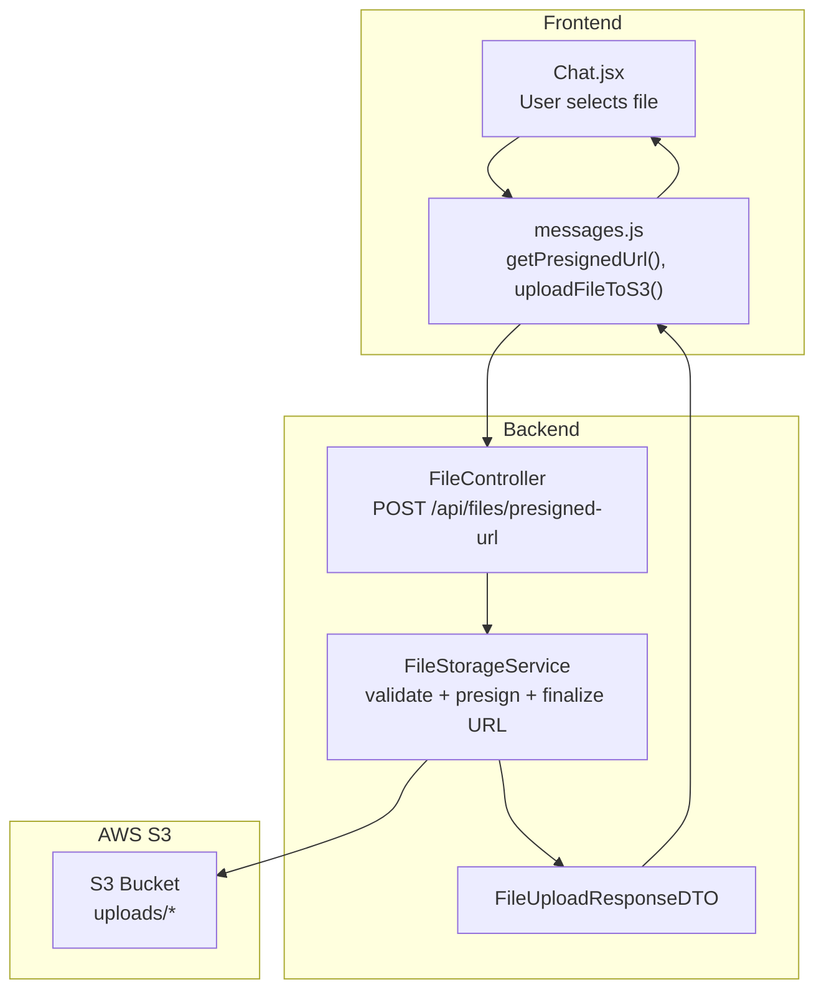
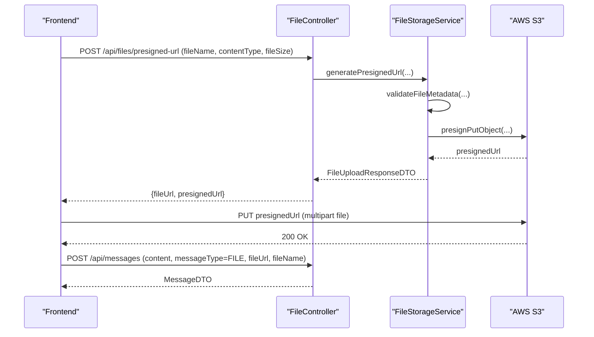
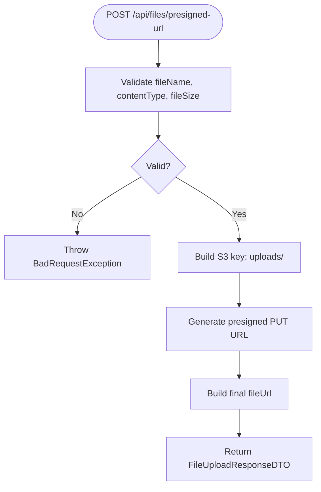
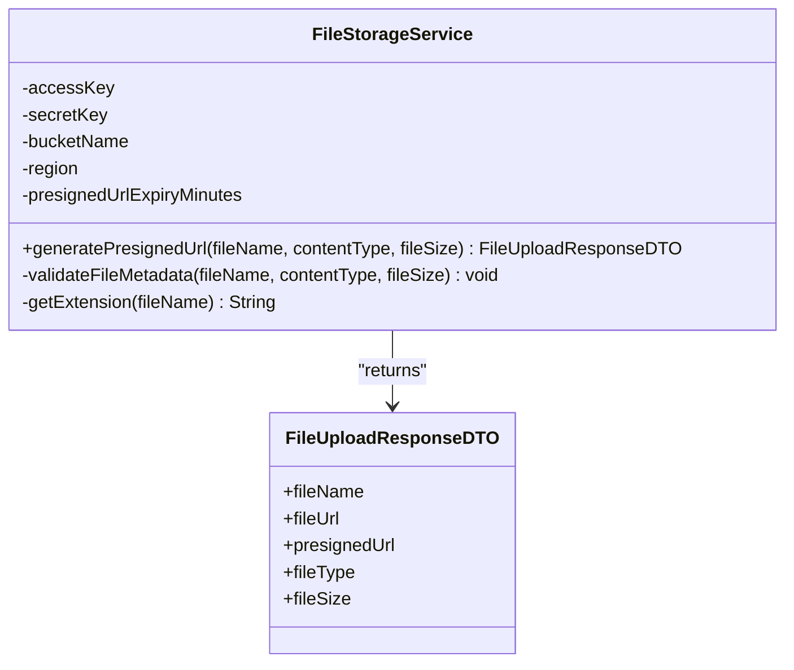
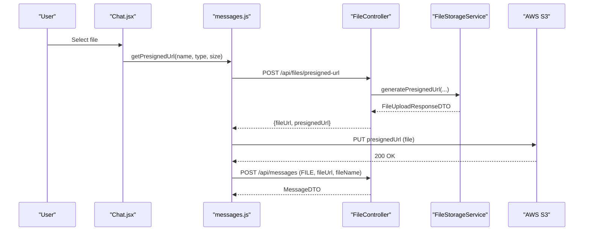
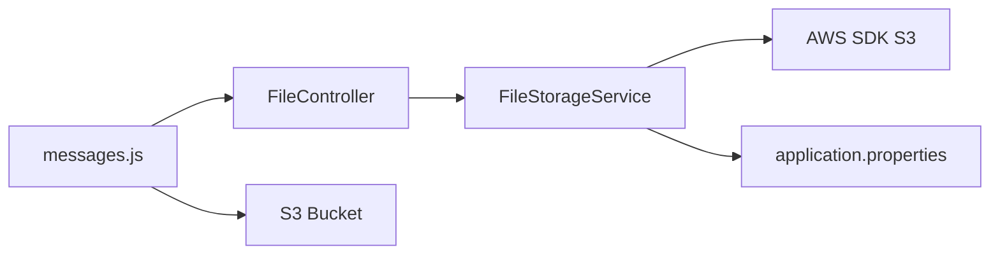

# File API

<cite>
**Referenced Files in This Document**
- [FileController.java](file://src/main/java/com/chatify/chat_backend/controller/FileController.java)
- [FileStorageService.java](file://src/main/java/com/chatify/chat_backend/service/FileStorageService.java)
- [FileUploadResponseDTO.java](file://src/main/java/com/chatify/chat_backend/dto/FileUploadResponseDTO.java)
- [SecurityConfig.java](file://src/main/java/com/chatify/chat_backend/config/SecurityConfig.java)
- [WebMvcConfig.java](file://src/main/java/com/chatify/chat_backend/config/WebMvcConfig.java)
- [messages.js](file://chatify-frontend/src/api/messages.js)
- [Chat.jsx](file://chatify-frontend/src/pages/Chat.jsx)
- [MessageItem.jsx](file://chatify-frontend/src/components/Chat/MessageItem.jsx)
- [MessageType.java](file://src/main/java/com/chatify/chat_backend/entity/enums/MessageType.java)
- [MessageService.java](file://src/main/java/com/chatify/chat_backend/service/MessageService.java)
- [application.properties](file://src/main/resources/application.properties)
- [nginx.conf](file://chatify-frontend/nginx.conf)
- [pom.xml](file://pom.xml)
</cite>

## Table of Contents
1. [Introduction](#introduction)
2. [Project Structure](#project-structure)
3. [Core Components](#core-components)
4. [Architecture Overview](#architecture-overview)
5. [Detailed Component Analysis](#detailed-component-analysis)
6. [Dependency Analysis](#dependency-analysis)
7. [Performance Considerations](#performance-considerations)
8. [Troubleshooting Guide](#troubleshooting-guide)
9. [Conclusion](#conclusion)

## Introduction
This document provides API documentation for the File API endpoints focused on file upload, URL generation, and file sharing. It covers HTTP methods, URL patterns, request/response schemas, AWS S3 integration, file validation rules, security considerations, and practical usage examples. The current implementation exposes a single endpoint to generate a presigned URL for direct S3 uploads and returns a final file URL for downstream consumption (e.g., attaching to messages).

## Project Structure
The File API is implemented in the backend Spring Boot application and integrates with AWS S3 via presigned URLs. The frontend interacts with the backend to obtain a presigned URL and then uploads directly to S3. The backend validates file metadata and constructs the final file URL for message attachments.

**Diagram sources**
- [FileController.java:19-29](file://src/main/java/com/chatify/chat_backend/controller/FileController.java#L19-L29)
- [FileStorageService.java:73-98](file://src/main/java/com/chatify/chat_backend/service/FileStorageService.java#L73-L98)
- [FileUploadResponseDTO.java:10-16](file://src/main/java/com/chatify/chat_backend/dto/FileUploadResponseDTO.java#L10-L16)
- [messages.js:38-53](file://chatify-frontend/src/api/messages.js#L38-L53)

**Section sources**
- [FileController.java:1-30](file://src/main/java/com/chatify/chat_backend/controller/FileController.java#L1-L30)
- [FileStorageService.java:1-142](file://src/main/java/com/chatify/chat_backend/service/FileStorageService.java#L1-L142)
- [FileUploadResponseDTO.java:1-16](file://src/main/java/com/chatify/chat_backend/dto/FileUploadResponseDTO.java#L1-L16)
- [messages.js:1-53](file://chatify-frontend/src/api/messages.js#L1-L53)

## Core Components
- Endpoint: POST /api/files/presigned-url
  - Purpose: Returns a presigned URL for direct S3 upload and the final file URL for later use.
  - Authentication: Requires a valid JWT (secured by Spring Security).
  - Request parameters:
    - fileName: String (required)
    - contentType: String (required; must be in allowed types)
    - fileSize: Long (required; must be within allowed max size per type)
  - Response: FileUploadResponseDTO containing fileName, fileUrl, presignedUrl, fileType, fileSize.

- FileUploadResponseDTO:
  - Fields: fileName, fileUrl, presignedUrl, fileType, fileSize.

- FileStorageService:
  - Validates file metadata (type, size, extension, name safety).
  - Generates a random S3 key under uploads/<uuid><ext>.
  - Creates a presigned PUT URL with configured expiry.
  - Builds the final public file URL for downstream use.

- SecurityConfig:
  - Secures /api/* endpoints with JWT filter.
  - Allows unauthenticated access to /uploads/** for serving files.

- WebMvcConfig:
  - Serves static files from /uploads/** from the local filesystem.

- Frontend Integration:
  - Chat.jsx orchestrates file selection and sends a message with fileUrl after successful upload.
  - messages.js performs:
    - POST /api/files/presigned-url to obtain presignedUrl and fileUrl.
    - PUT presignedUrl to upload the file directly to S3.
    - Sends a message with fileUrl and fileName to the backend.

**Section sources**
- [FileController.java:19-29](file://src/main/java/com/chatify/chat_backend/controller/FileController.java#L19-L29)
- [FileStorageService.java:73-130](file://src/main/java/com/chatify/chat_backend/service/FileStorageService.java#L73-L130)
- [FileUploadResponseDTO.java:10-16](file://src/main/java/com/chatify/chat_backend/dto/FileUploadResponseDTO.java#L10-L16)
- [SecurityConfig.java:61-89](file://src/main/java/com/chatify/chat_backend/config/SecurityConfig.java#L61-L89)
- [WebMvcConfig.java:11-18](file://src/main/java/com/chatify/chat_backend/config/WebMvcConfig.java#L11-L18)
- [messages.js:38-53](file://chatify-frontend/src/api/messages.js#L38-L53)
- [Chat.jsx:317-351](file://chatify-frontend/src/pages/Chat.jsx#L317-L351)

## Architecture Overview
The File API follows a presigned URL pattern to offload uploads to AWS S3 while keeping the backend in control of validation and metadata. The frontend obtains a presigned URL, uploads directly to S3, and then attaches the resulting fileUrl to a message.

**Diagram sources**
- [FileController.java:19-29](file://src/main/java/com/chatify/chat_backend/controller/FileController.java#L19-L29)
- [FileStorageService.java:73-98](file://src/main/java/com/chatify/chat_backend/service/FileStorageService.java#L73-L98)
- [messages.js:38-53](file://chatify-frontend/src/api/messages.js#L38-L53)
- [MessageService.java:50-57](file://src/main/java/com/chatify/chat_backend/service/MessageService.java#L50-L57)

## Detailed Component Analysis

### Endpoint: POST /api/files/presigned-url
- Method: POST
- Path: /api/files/presigned-url
- Authentication: Required (JWT)
- Query Parameters:
  - fileName: String (non-blank)
  - contentType: String (must be one of allowed MIME types)
  - fileSize: Long (positive and within allowed max size)
- Response: FileUploadResponseDTO
- Behavior:
  - Validates file metadata.
  - Generates a random S3 key under uploads/.
  - Produces a presigned PUT URL with configured expiry.
  - Returns final fileUrl for downstream use.

**Diagram sources**
- [FileController.java:19-29](file://src/main/java/com/chatify/chat_backend/controller/FileController.java#L19-L29)
- [FileStorageService.java:73-98](file://src/main/java/com/chatify/chat_backend/service/FileStorageService.java#L73-L98)
- [FileStorageService.java:100-130](file://src/main/java/com/chatify/chat_backend/service/FileStorageService.java#L100-L130)

**Section sources**
- [FileController.java:19-29](file://src/main/java/com/chatify/chat_backend/controller/FileController.java#L19-L29)
- [FileStorageService.java:73-130](file://src/main/java/com/chatify/chat_backend/service/FileStorageService.java#L73-L130)

### FileUploadResponseDTO Schema
- Fields:
  - fileName: String
  - fileUrl: String (final S3 URL)
  - presignedUrl: String (temporary PUT URL)
  - fileType: String (content type)
  - fileSize: Long

**Section sources**
- [FileUploadResponseDTO.java:10-16](file://src/main/java/com/chatify/chat_backend/dto/FileUploadResponseDTO.java#L10-L16)

### File Validation Rules
- Allowed Content Types and Max Sizes:
  - image/jpeg: 5 MB
  - image/png: 5 MB
  - image/gif: 5 MB
  - image/webp: 5 MB
  - application/pdf: 10 MB
  - application/vnd.openxmlformats-officedocument.wordprocessingml.document: 10 MB
  - video/mp4: 50 MB
  - video/quicktime: 50 MB
  - video/x-msvideo: 50 MB
- Extension Matching:
  - Each content type maps to specific extensions; extension must match content type.
- Filename Safety:
  - Must be non-blank and must not contain path traversal or separators.
- Size Validation:
  - Must be positive and not exceed the type-specific maximum.

**Section sources**
- [FileStorageService.java:40-62](file://src/main/java/com/chatify/chat_backend/service/FileStorageService.java#L40-L62)
- [FileStorageService.java:100-130](file://src/main/java/com/chatify/chat_backend/service/FileStorageService.java#L100-L130)

### AWS S3 Integration and Configuration
- Presigner Initialization:
  - Credentials and region loaded from application properties.
- Presigned URL Expiry:
  - Configured via aws.s3.presigned-url-expiry-minutes (default 5 minutes).
- Final File URL Construction:
  - https://{bucket}.s3.{region}.amazonaws.com/{key}
- Bucket Policy:
  - Public read access is assumed for uploads/* via bucket policy.

**Diagram sources**
- [FileStorageService.java:23-36](file://src/main/java/com/chatify/chat_backend/service/FileStorageService.java#L23-L36)
- [FileStorageService.java:73-98](file://src/main/java/com/chatify/chat_backend/service/FileStorageService.java#L73-L98)
- [FileUploadResponseDTO.java:10-16](file://src/main/java/com/chatify/chat_backend/dto/FileUploadResponseDTO.java#L10-L16)

**Section sources**
- [FileStorageService.java:23-71](file://src/main/java/com/chatify/chat_backend/service/FileStorageService.java#L23-L71)
- [application.properties:46-51](file://src/main/resources/application.properties#L46-L51)

### Frontend Workflow: Upload and Share
- Steps:
  - User selects a file in Chat.jsx.
  - messages.js calls POST /api/files/presigned-url to get presignedUrl and fileUrl.
  - messages.js uploads the file directly to S3 using the presignedUrl.
  - messages.js sends a message with messageType=FILE, fileUrl, and fileName.
- Supported File Types:
  - Images, PDF, DOCX, MP4, MOV, AVI (as declared in frontend FileUpload component).

**Diagram sources**
- [Chat.jsx:317-351](file://chatify-frontend/src/pages/Chat.jsx#L317-L351)
- [messages.js:38-53](file://chatify-frontend/src/api/messages.js#L38-L53)
- [FileController.java:19-29](file://src/main/java/com/chatify/chat_backend/controller/FileController.java#L19-L29)
- [FileStorageService.java:73-98](file://src/main/java/com/chatify/chat_backend/service/FileStorageService.java#L73-L98)

**Section sources**
- [Chat.jsx:14-30](file://chatify-frontend/src/pages/Chat.jsx#L14-L30)
- [messages.js:38-53](file://chatify-frontend/src/api/messages.js#L38-L53)

### Download and Serving
- Static Serving:
  - /uploads/** is mapped to the local filesystem via WebMvcConfig.
- CDN Integration:
  - The final fileUrl uses the S3 bucket domain; a CDN can front the bucket for optimized delivery.
- Nginx Proxy:
  - Nginx proxies /uploads/ to the backend for static file serving.

**Section sources**
- [WebMvcConfig.java:11-18](file://src/main/java/com/chatify/chat_backend/config/WebMvcConfig.java#L11-L18)
- [nginx.conf:56-61](file://chatify-frontend/nginx.conf#L56-L61)

### Security Considerations
- Authentication:
  - All /api/* endpoints require JWT authentication.
- Authorization:
  - No explicit per-user ownership checks are performed in the File API; ensure message creation enforces ownership.
- File Validation:
  - Strict content-type, size, and extension checks reduce risk.
- Presigned URL Expiry:
  - Short expiry minimizes exposure windows.
- Bucket Policy:
  - Public read on uploads/* is used; ensure appropriate bucket policies and consider signed URLs for private access if needed.

**Section sources**
- [SecurityConfig.java:61-89](file://src/main/java/com/chatify/chat_backend/config/SecurityConfig.java#L61-L89)
- [FileStorageService.java:100-130](file://src/main/java/com/chatify/chat_backend/service/FileStorageService.java#L100-L130)
- [application.properties:46-51](file://src/main/resources/application.properties#L46-L51)

### Storage Management and Deletion
- Current Implementation:
  - Files are stored in S3 under uploads/<uuid><ext>.
  - No built-in deletion endpoint exists in the backend for files.
- Recommendations:
  - Add a DELETE endpoint to remove S3 objects and update message records accordingly.
  - Implement retention policies and cleanup jobs if needed.

**Section sources**
- [FileStorageService.java:76-85](file://src/main/java/com/chatify/chat_backend/service/FileStorageService.java#L76-L85)

### Virus Scanning Integration
- Current Implementation:
  - No virus scanning integration is present in the backend.
- Recommendations:
  - Scan files post-upload using an external scanner or S3 event-triggered Lambda.
  - Mark or quarantine files until scan completes.

**Section sources**
- [FileStorageService.java:73-98](file://src/main/java/com/chatify/chat_backend/service/FileStorageService.java#L73-L98)

### Storage Quotas
- Current Implementation:
  - No per-user storage quota enforcement exists.
- Recommendations:
  - Track total bytes per user and reject uploads exceeding limits.

**Section sources**
- [FileStorageService.java:108-112](file://src/main/java/com/chatify/chat_backend/service/FileStorageService.java#L108-L112)

### Examples

- Upload an Image (JPEG/PNG/GIF/WEBP)
  - Client calls POST /api/files/presigned-url with fileName, contentType=image/*, fileSize.
  - Client uploads file to presignedUrl.
  - Client sends a message with messageType=IMAGE and fileUrl.

- Upload a Document (PDF/DOCX)
  - Client calls POST /api/files/presigned-url with fileName, contentType=application/*, fileSize.
  - Client uploads file to presignedUrl.
  - Client sends a message with messageType=FILE and fileUrl.

- Generate a Secure Download Link
  - The returned fileUrl is a public S3 URL. For private access, sign the URL or use a backend proxy with authentication.

- Handling Upload Errors
  - Invalid content type or size mismatch results in a 400 error.
  - Invalid filename or extension mismatch results in a 400 error.
  - Presigned URL expiry requires re-requesting a new URL.

**Section sources**
- [messages.js:38-53](file://chatify-frontend/src/api/messages.js#L38-L53)
- [FileStorageService.java:100-130](file://src/main/java/com/chatify/chat_backend/service/FileStorageService.java#L100-L130)

## Dependency Analysis
- External Dependencies:
  - AWS SDK S3 (presigner) is included via Maven.
- Internal Dependencies:
  - FileController depends on FileStorageService.
  - FileStorageService depends on AWS SDK S3 and application properties for configuration.
  - Frontend depends on FileController for presigned URL generation and S3 for upload.

**Diagram sources**
- [messages.js:38-53](file://chatify-frontend/src/api/messages.js#L38-L53)
- [FileController.java:13-17](file://src/main/java/com/chatify/chat_backend/controller/FileController.java#L13-L17)
- [FileStorageService.java:3-38](file://src/main/java/com/chatify/chat_backend/service/FileStorageService.java#L3-L38)
- [application.properties:46-51](file://src/main/resources/application.properties#L46-L51)
- [pom.xml:93-97](file://pom.xml#L93-L97)

**Section sources**
- [pom.xml:93-97](file://pom.xml#L93-L97)
- [FileController.java:13-17](file://src/main/java/com/chatify/chat_backend/controller/FileController.java#L13-L17)
- [FileStorageService.java:3-38](file://src/main/java/com/chatify/chat_backend/service/FileStorageService.java#L3-L38)

## Performance Considerations
- Direct S3 Upload:
  - Offloads bandwidth from the backend to S3, improving throughput.
- Presigned URL Expiry:
  - Keep expiry short to balance usability and security.
- CDN:
  - Use a CDN in front of the S3 bucket for global delivery optimization.

[No sources needed since this section provides general guidance]

## Troubleshooting Guide
- 400 Bad Request: File type not allowed or size exceeds limit
  - Verify contentType and fileSize against allowed types and sizes.
- 400 Bad Request: Invalid filename or extension mismatch
  - Ensure filename matches the declared content type and extension.
- 401 Unauthorized
  - Ensure a valid JWT is attached to requests to /api/*.
- 403 Forbidden
  - Confirm bucket policy allows public read on uploads/* if using public URLs.
- Upload Fails Due to Expiry
  - Request a new presigned URL if the previous one expired.

**Section sources**
- [FileStorageService.java:100-130](file://src/main/java/com/chatify/chat_backend/service/FileStorageService.java#L100-L130)
- [SecurityConfig.java:61-89](file://src/main/java/com/chatify/chat_backend/config/SecurityConfig.java#L61-L89)

## Conclusion
The File API leverages AWS S3 presigned URLs to enable efficient, secure file uploads while maintaining strict validation and returning a final file URL for message attachments. The current implementation supports a defined set of file types and sizes, with straightforward frontend integration. Enhancements such as file deletion, virus scanning, storage quotas, and optional private access controls would further strengthen the solution.