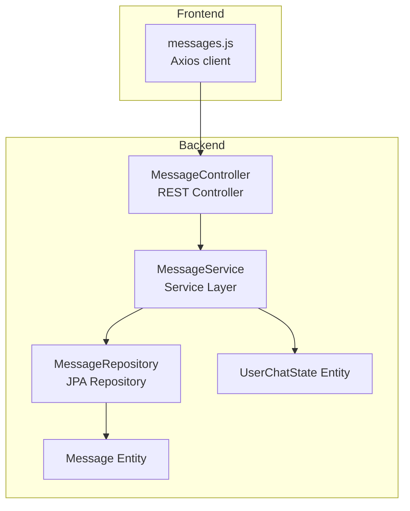
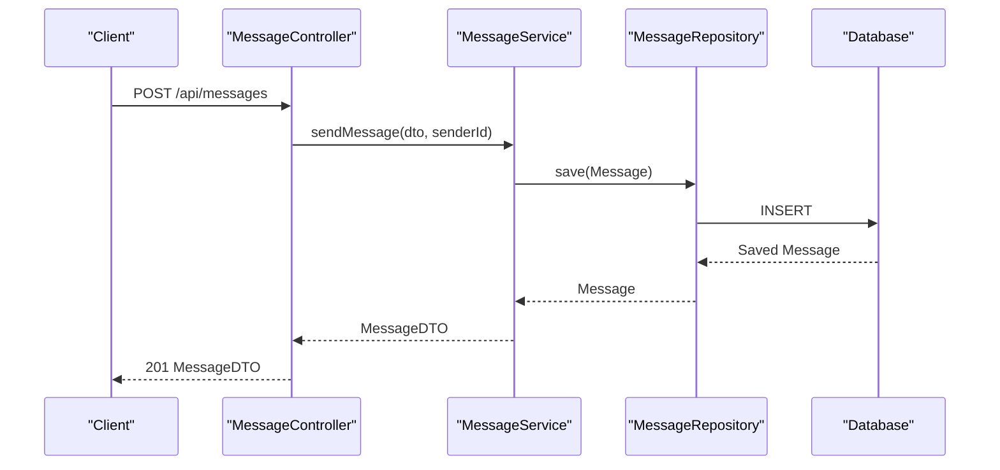
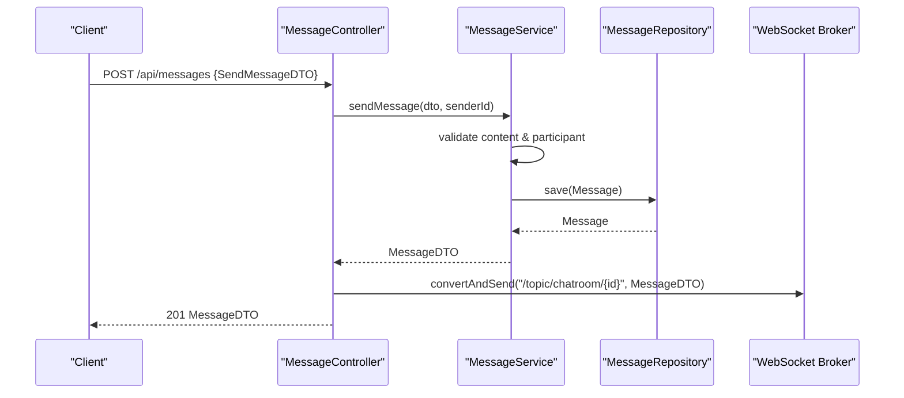
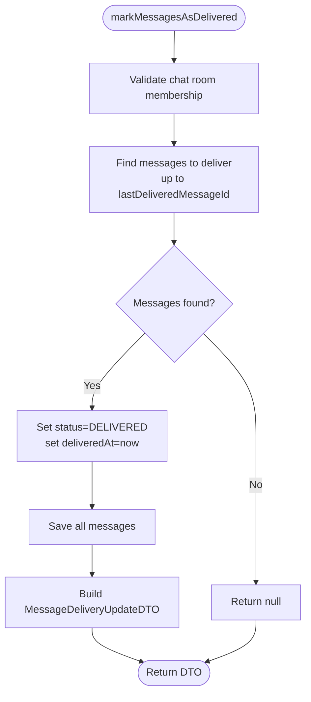
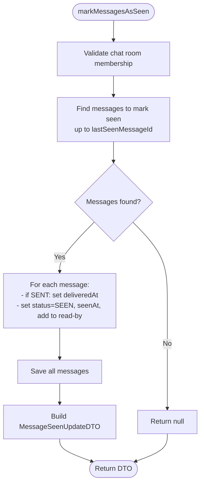
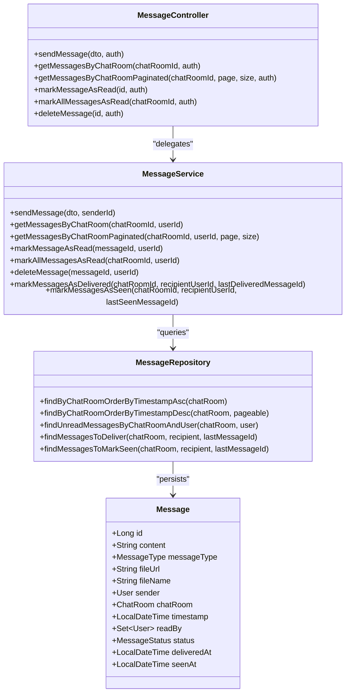

# Message API

<cite>
**Referenced Files in This Document**
- [MessageController.java](file://src/main/java/com/chatify/chat_backend/controller/MessageController.java)
- [MessageService.java](file://src/main/java/com/chatify/chat_backend/service/MessageService.java)
- [MessageRepository.java](file://src/main/java/com/chatify/chat_backend/repository/MessageRepository.java)
- [MessageDTO.java](file://src/main/java/com/chatify/chat_backend/dto/MessageDTO.java)
- [SendMessageDTO.java](file://src/main/java/com/chatify/chat_backend/dto/SendMessageDTO.java)
- [MessageDeliveredAckDTO.java](file://src/main/java/com/chatify/chat_backend/dto/MessageDeliveredAckDTO.java)
- [MessageSeenAckDTO.java](file://src/main/java/com/chatify/chat_backend/dto/MessageSeenAckDTO.java)
- [MessageDeliveryUpdateDTO.java](file://src/main/java/com/chatify/chat_backend/dto/MessageDeliveryUpdateDTO.java)
- [MessageSeenUpdateDTO.java](file://src/main/java/com/chatify/chat_backend/dto/MessageSeenUpdateDTO.java)
- [Message.java](file://src/main/java/com/chatify/chat_backend/entity/Message.java)
- [MessageStatus.java](file://src/main/java/com/chatify/chat_backend/entity/enums/MessageStatus.java)
- [MessageType.java](file://src/main/java/com/chatify/chat_backend/entity/enums/MessageType.java)
- [UserChatState.java](file://src/main/java/com/chatify/chat_backend/entity/UserChatState.java)
- [messages.js](file://chatify-frontend/src/api/messages.js)
</cite>

## Table of Contents
1. [Introduction](#introduction)
2. [Project Structure](#project-structure)
3. [Core Components](#core-components)
4. [Architecture Overview](#architecture-overview)
5. [Detailed Component Analysis](#detailed-component-analysis)
6. [Dependency Analysis](#dependency-analysis)
7. [Performance Considerations](#performance-considerations)
8. [Troubleshooting Guide](#troubleshooting-guide)
9. [Conclusion](#conclusion)

## Introduction
This document provides comprehensive API documentation for the Message API, covering message sending, retrieval, delivery acknowledgments, and read receipts. It explains HTTP endpoints, request/response schemas, workflows, status management, threading, and performance considerations. The backend is implemented in Java with Spring Boot, while the frontend demonstrates client-side usage via Axios.

## Project Structure
The Message API spans the controller, service, repository, DTOs, entities, and enums layers. The frontend provides example client calls for retrieving and paginating messages, sending messages, marking messages as read, and marking all messages as read.

**Diagram sources**
- [MessageController.java:16-95](file://src/main/java/com/chatify/chat_backend/controller/MessageController.java#L16-L95)
- [MessageService.java:29-286](file://src/main/java/com/chatify/chat_backend/service/MessageService.java#L29-L286)
- [MessageRepository.java:17-111](file://src/main/java/com/chatify/chat_backend/repository/MessageRepository.java#L17-L111)
- [Message.java:13-69](file://src/main/java/com/chatify/chat_backend/entity/Message.java#L13-L69)
- [UserChatState.java:14-65](file://src/main/java/com/chatify/chat_backend/entity/UserChatState.java#L14-L65)
- [messages.js:1-53](file://chatify-frontend/src/api/messages.js#L1-L53)

**Section sources**
- [MessageController.java:16-95](file://src/main/java/com/chatify/chat_backend/controller/MessageController.java#L16-L95)
- [MessageService.java:29-286](file://src/main/java/com/chatify/chat_backend/service/MessageService.java#L29-L286)
- [MessageRepository.java:17-111](file://src/main/java/com/chatify/chat_backend/repository/MessageRepository.java#L17-L111)
- [Message.java:13-69](file://src/main/java/com/chatify/chat_backend/entity/Message.java#L13-L69)
- [UserChatState.java:14-65](file://src/main/java/com/chatify/chat_backend/entity/UserChatState.java#L14-L65)
- [messages.js:1-53](file://chatify-frontend/src/api/messages.js#L1-L53)

## Core Components
- MessageController: Exposes REST endpoints for sending, retrieving, marking as read, marking all as read, and deleting messages.
- MessageService: Implements business logic for message operations, status updates, and read tracking.
- MessageRepository: Provides JPA queries for message retrieval, unread counts, and delivery/seen updates.
- DTOs: Define request/response schemas for messages, send requests, and delivery/seen updates.
- Entities: Represent persisted message state, including status timestamps and read-by relationships.
- Enums: Define message types and statuses.

**Section sources**
- [MessageController.java:16-95](file://src/main/java/com/chatify/chat_backend/controller/MessageController.java#L16-L95)
- [MessageService.java:29-286](file://src/main/java/com/chatify/chat_backend/service/MessageService.java#L29-L286)
- [MessageRepository.java:17-111](file://src/main/java/com/chatify/chat_backend/repository/MessageRepository.java#L17-L111)
- [MessageDTO.java:12-33](file://src/main/java/com/chatify/chat_backend/dto/MessageDTO.java#L12-L33)
- [SendMessageDTO.java:12-21](file://src/main/java/com/chatify/chat_backend/dto/SendMessageDTO.java#L12-L21)
- [Message.java:13-69](file://src/main/java/com/chatify/chat_backend/entity/Message.java#L13-L69)
- [MessageStatus.java:3-7](file://src/main/java/com/chatify/chat_backend/entity/enums/MessageStatus.java#L3-L7)
- [MessageType.java:3-7](file://src/main/java/com/chatify/chat_backend/entity/enums/MessageType.java#L3-L7)

## Architecture Overview
The Message API follows a layered architecture:
- Controller validates and authenticates requests, delegates to the service.
- Service enforces authorization, constructs entities, and persists state.
- Repository executes database queries for retrieval and bulk updates.
- DTOs decouple persistence from API responses.
- Frontend consumes endpoints via Axios.

**Diagram sources**
- [MessageController.java:32-44](file://src/main/java/com/chatify/chat_backend/controller/MessageController.java#L32-L44)
- [MessageService.java:50-78](file://src/main/java/com/chatify/chat_backend/service/MessageService.java#L50-L78)
- [MessageRepository.java:17-24](file://src/main/java/com/chatify/chat_backend/repository/MessageRepository.java#L17-L24)

## Detailed Component Analysis

### Endpoints and Workflows

#### Send Message
- Method: POST
- Path: /api/messages
- Request: SendMessageDTO
- Response: MessageDTO
- Workflow:
  - Validate content presence (text or file).
  - Verify chat room participation.
  - Persist message with SENT status.
  - Broadcast via WebSocket to chat room topic.

**Diagram sources**
- [MessageController.java:32-44](file://src/main/java/com/chatify/chat_backend/controller/MessageController.java#L32-L44)
- [MessageService.java:50-78](file://src/main/java/com/chatify/chat_backend/service/MessageService.java#L50-L78)

**Section sources**
- [MessageController.java:32-44](file://src/main/java/com/chatify/chat_backend/controller/MessageController.java#L32-L44)
- [MessageService.java:50-78](file://src/main/java/com/chatify/chat_backend/service/MessageService.java#L50-L78)
- [SendMessageDTO.java:12-21](file://src/main/java/com/chatify/chat_backend/dto/SendMessageDTO.java#L12-L21)
- [MessageDTO.java:12-33](file://src/main/java/com/chatify/chat_backend/dto/MessageDTO.java#L12-L33)

#### Retrieve Messages (Unpaginated)
- Method: GET
- Path: /api/messages/chatroom/{chatRoomId}
- Response: List<MessageDTO>
- Behavior: Returns all messages ordered by insertion time ascending.

**Section sources**
- [MessageController.java:46-53](file://src/main/java/com/chatify/chat_backend/controller/MessageController.java#L46-L53)
- [MessageService.java:80-95](file://src/main/java/com/chatify/chat_backend/service/MessageService.java#L80-L95)
- [MessageRepository.java:20-22](file://src/main/java/com/chatify/chat_backend/repository/MessageRepository.java#L20-L22)

#### Retrieve Messages (Paginated)
- Method: GET
- Path: /api/messages/chatroom/{chatRoomId}/paginated
- Query Params: page (default 0), size (default 20)
- Response: Page<MessageDTO>
- Behavior: Returns messages ordered by timestamp descending with pagination.

**Section sources**
- [MessageController.java:55-65](file://src/main/java/com/chatify/chat_backend/controller/MessageController.java#L55-L65)
- [MessageService.java:97-112](file://src/main/java/com/chatify/chat_backend/service/MessageService.java#L97-L112)
- [MessageRepository.java:22-22](file://src/main/java/com/chatify/chat_backend/repository/MessageRepository.java#L22-L22)

#### Mark Message as Read
- Method: PUT
- Path: /api/messages/{id}/read
- Response: MessageDTO
- Behavior: Adds current user to read-by set and returns updated message.

**Section sources**
- [MessageController.java:67-74](file://src/main/java/com/chatify/chat_backend/controller/MessageController.java#L67-L74)
- [MessageService.java:114-129](file://src/main/java/com/chatify/chat_backend/service/MessageService.java#L114-L129)
- [MessageRepository.java:26-29](file://src/main/java/com/chatify/chat_backend/repository/MessageRepository.java#L26-L29)

#### Mark All Messages as Read
- Method: PUT
- Path: /api/messages/chatroom/{chatRoomId}/read-all
- Response: 200 OK
- Behavior: Marks all unread messages for the user as SEEN and updates UserChatState.

**Section sources**
- [MessageController.java:76-84](file://src/main/java/com/chatify/chat_backend/controller/MessageController.java#L76-L84)
- [MessageService.java:131-179](file://src/main/java/com/chatify/chat_backend/service/MessageService.java#L131-L179)
- [MessageRepository.java:26-29](file://src/main/java/com/chatify/chat_backend/repository/MessageRepository.java#L26-L29)
- [UserChatState.java:25-65](file://src/main/java/com/chatify/chat_backend/entity/UserChatState.java#L25-L65)

#### Delete Message
- Method: DELETE
- Path: /api/messages/{id}
- Response: 204 No Content
- Behavior: Only the sender can delete their message.

**Section sources**
- [MessageController.java:86-94](file://src/main/java/com/chatify/chat_backend/controller/MessageController.java#L86-L94)
- [MessageService.java:181-191](file://src/main/java/com/chatify/chat_backend/service/MessageService.java#L181-L191)

### Delivery and Read Receipts

#### Delivery Acknowledgment Mechanism
- Endpoint: Service method to mark messages as delivered given a chat room, recipient, and last delivered message identifier.
- Behavior:
  - Validates chat room membership.
  - Finds messages up to the provided ID that are eligible for delivery.
  - Updates status to DELIVERED and sets deliveredAt timestamp.
  - Returns MessageDeliveryUpdateDTO indicating the last delivered message.

**Diagram sources**
- [MessageService.java:193-228](file://src/main/java/com/chatify/chat_backend/service/MessageService.java#L193-L228)
- [MessageRepository.java:36-56](file://src/main/java/com/chatify/chat_backend/repository/MessageRepository.java#L36-L56)

**Section sources**
- [MessageService.java:193-228](file://src/main/java/com/chatify/chat_backend/service/MessageService.java#L193-L228)
- [MessageRepository.java:36-56](file://src/main/java/com/chatify/chat_backend/repository/MessageRepository.java#L36-L56)
- [MessageDeliveredAckDTO.java:6-9](file://src/main/java/com/chatify/chat_backend/dto/MessageDeliveredAckDTO.java#L6-L9)
- [MessageDeliveryUpdateDTO.java:8-11](file://src/main/java/com/chatify/chat_backend/dto/MessageDeliveryUpdateDTO.java#L8-L11)

#### Read (Seen) Receipt Tracking
- Endpoint: Service method to mark messages as seen given a chat room, recipient, and last seen message identifier.
- Behavior:
  - Validates chat room membership.
  - Finds messages up to the provided ID that are eligible for being marked seen.
  - Ensures SENT messages are updated with deliveredAt timestamp.
  - Sets status to SEEN, sets seenAt timestamp, adds recipient to read-by set.
  - Returns MessageSeenUpdateDTO indicating the last seen message.

**Diagram sources**
- [MessageService.java:230-269](file://src/main/java/com/chatify/chat_backend/service/MessageService.java#L230-L269)
- [MessageRepository.java:48-59](file://src/main/java/com/chatify/chat_backend/repository/MessageRepository.java#L48-L59)

**Section sources**
- [MessageService.java:230-269](file://src/main/java/com/chatify/chat_backend/service/MessageService.java#L230-L269)
- [MessageRepository.java:48-59](file://src/main/java/com/chatify/chat_backend/repository/MessageRepository.java#L48-L59)
- [MessageSeenAckDTO.java:6-9](file://src/main/java/com/chatify/chat_backend/dto/MessageSeenAckDTO.java#L6-L9)
- [MessageSeenUpdateDTO.java:8-11](file://src/main/java/com/chatify/chat_backend/dto/MessageSeenUpdateDTO.java#L8-L11)

### Message Status Management
- Statuses: SENT, DELIVERED, SEEN
- Persistence: Stored in the Message entity with optional timestamps for deliveredAt and seenAt.
- Transitions:
  - SENT upon creation.
  - DELIVERED when delivery is acknowledged.
  - SEEN when the recipient scrolls to or acknowledges the message.

**Section sources**
- [MessageStatus.java:3-7](file://src/main/java/com/chatify/chat_backend/entity/enums/MessageStatus.java#L3-L7)
- [Message.java:59-67](file://src/main/java/com/chatify/chat_backend/entity/Message.java#L59-L67)

### Message Threading and Chat History
- Threading: Messages are grouped by chatRoomId.
- Ordering:
  - Unpaginated retrieval orders by insertion time ascending.
  - Paginated retrieval orders by timestamp descending.
- Chat history: Retrieval endpoints support fetching full history or paginated chunks.

**Section sources**
- [MessageService.java:80-112](file://src/main/java/com/chatify/chat_backend/service/MessageService.java#L80-L112)
- [MessageRepository.java:20-22](file://src/main/java/com/chatify/chat_backend/repository/MessageRepository.java#L20-L22)

### Read Receipt Tracking with UserChatState
- Read tracking:
  - Individual message read-by set stores users who have read the message.
  - Bulk read-all updates marks messages as SEEN and updates UserChatState with lastReadMessage and lastReadAt.
- Purpose: Enables efficient unread counting and last-read position tracking per user per chat room.

**Section sources**
- [MessageService.java:131-179](file://src/main/java/com/chatify/chat_backend/service/MessageService.java#L131-L179)
- [Message.java:51-57](file://src/main/java/com/chatify/chat_backend/entity/Message.java#L51-L57)
- [UserChatState.java:39-50](file://src/main/java/com/chatify/chat_backend/entity/UserChatState.java#L39-L50)

### Frontend Usage Examples
- Retrieve messages (unpaginated):
  - GET /api/messages/chatroom/{chatRoomId}
- Retrieve messages (paginated):
  - GET /api/messages/chatroom/{chatRoomId}/paginated?page=&size=
- Send message:
  - POST /api/messages with SendMessageDTO payload
- Mark message as read:
  - PUT /api/messages/{id}/read
- Mark all messages as read:
  - PUT /api/messages/chatroom/{chatRoomId}/read-all
- Delete message:
  - DELETE /api/messages/{id}

**Section sources**
- [messages.js:3-36](file://chatify-frontend/src/api/messages.js#L3-L36)

## Dependency Analysis

**Diagram sources**
- [MessageController.java:16-95](file://src/main/java/com/chatify/chat_backend/controller/MessageController.java#L16-L95)
- [MessageService.java:29-286](file://src/main/java/com/chatify/chat_backend/service/MessageService.java#L29-L286)
- [MessageRepository.java:17-111](file://src/main/java/com/chatify/chat_backend/repository/MessageRepository.java#L17-L111)
- [Message.java:13-69](file://src/main/java/com/chatify/chat_backend/entity/Message.java#L13-L69)

**Section sources**
- [MessageController.java:16-95](file://src/main/java/com/chatify/chat_backend/controller/MessageController.java#L16-L95)
- [MessageService.java:29-286](file://src/main/java/com/chatify/chat_backend/service/MessageService.java#L29-L286)
- [MessageRepository.java:17-111](file://src/main/java/com/chatify/chat_backend/repository/MessageRepository.java#L17-L111)
- [Message.java:13-69](file://src/main/java/com/chatify/chat_backend/entity/Message.java#L13-L69)

## Performance Considerations
- Pagination: Use the paginated endpoint to limit result sizes and reduce memory overhead.
- Sorting: Prefer timestamp-descending order for recent-first views.
- Indexing: Ensure database indexes exist on chat_room_id, sender_id, and timestamp for optimal query performance.
- Read tracking: Use UserChatState for efficient last-read tracking and unread counting.
- Delivery/Seen updates: Batch updates minimize round-trips and improve throughput.

[No sources needed since this section provides general guidance]

## Troubleshooting Guide
- Unauthorized Access:
  - Error occurs when a user attempts to access a chat room they are not part of.
  - Check chat room membership validation in service methods.
- Resource Not Found:
  - Occurs when accessing non-existent messages or chat rooms.
  - Ensure proper ID validation and error handling.
- Bad Request:
  - Thrown when sending messages without content or file attachment.
  - Validate SendMessageDTO before invoking the send endpoint.

**Section sources**
- [MessageService.java:50-78](file://src/main/java/com/chatify/chat_backend/service/MessageService.java#L50-L78)
- [MessageService.java:80-95](file://src/main/java/com/chatify/chat_backend/service/MessageService.java#L80-L95)
- [MessageService.java:97-112](file://src/main/java/com/chatify/chat_backend/service/MessageService.java#L97-L112)
- [MessageService.java:114-129](file://src/main/java/com/chatify/chat_backend/service/MessageService.java#L114-L129)
- [MessageService.java:131-179](file://src/main/java/com/chatify/chat_backend/service/MessageService.java#L131-L179)
- [MessageService.java:181-191](file://src/main/java/com/chatify/chat_backend/service/MessageService.java#L181-L191)

## Conclusion
The Message API provides robust capabilities for sending, retrieving, acknowledging delivery, and tracking read receipts. Its layered design ensures clear separation of concerns, while DTOs and entities maintain flexibility and performance. By leveraging pagination, batch updates, and UserChatState, applications can achieve scalable and responsive messaging experiences.