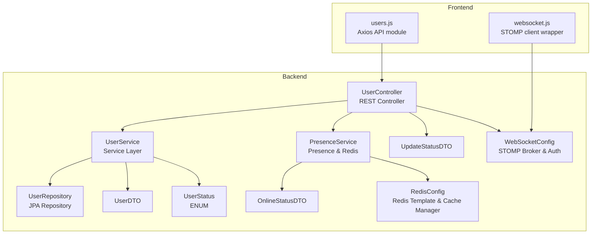
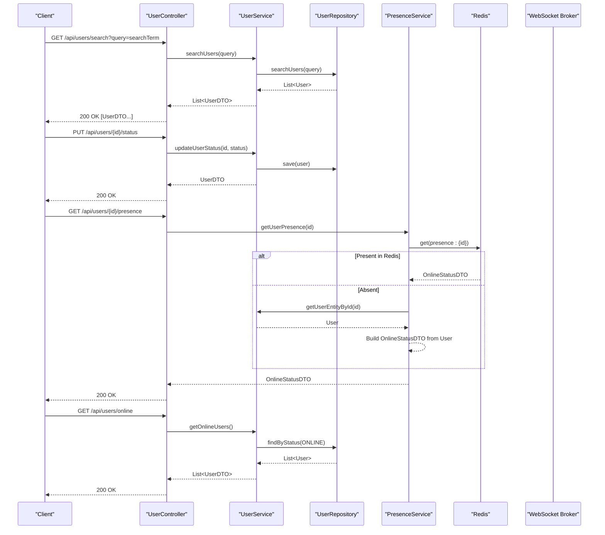
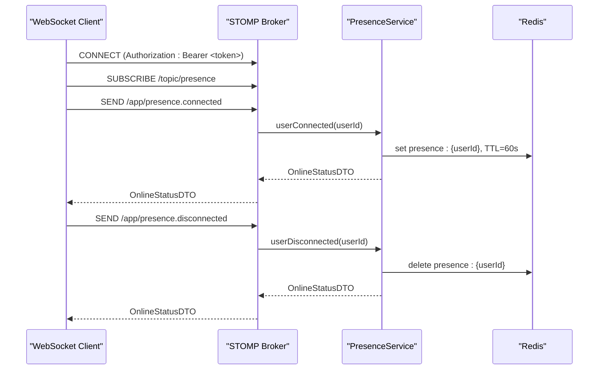
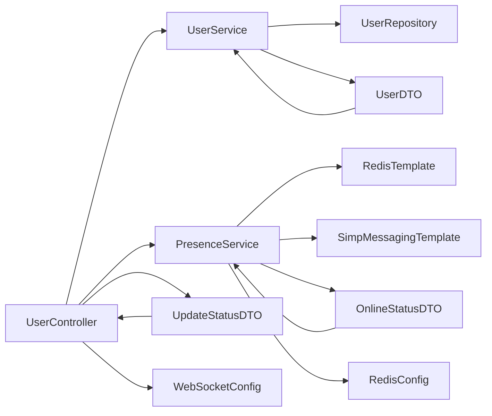

# User Management API

<cite>
**Referenced Files in This Document**
- [UserController.java](file://src/main/java/com/chatify/chat_backend/controller/UserController.java)
- [UserService.java](file://src/main/java/com/chatify/chat_backend/service/UserService.java)
- [PresenceService.java](file://src/main/java/com/chatify/chat_backend/service/PresenceService.java)
- [UserRepository.java](file://src/main/java/com/chatify/chat_backend/repository/UserRepository.java)
- [UserDTO.java](file://src/main/java/com/chatify/chat_backend/dto/UserDTO.java)
- [OnlineStatusDTO.java](file://src/main/java/com/chatify/chat_backend/dto/OnlineStatusDTO.java)
- [UpdateStatusDTO.java](file://src/main/java/com/chatify/chat_backend/dto/UpdateStatusDTO.java)
- [UserStatus.java](file://src/main/java/com/chatify/chat_backend/entity/enums/UserStatus.java)
- [RedisConfig.java](file://src/main/java/com/chatify/chat_backend/config/RedisConfig.java)
- [WebSocketConfig.java](file://src/main/java/com/chatify/chat_backend/config/WebSocketConfig.java)
- [users.js](file://chatify-frontend/src/api/users.js)
- [websocket.js](file://chatify-frontend/src/services/websocket.js)
- [POSTMAN_API_DOCUMENTATION.md](file://POSTMAN_API_DOCUMENTATION.md)
</cite>

## Table of Contents
1. [Introduction](#introduction)
2. [Project Structure](#project-structure)
3. [Core Components](#core-components)
4. [Architecture Overview](#architecture-overview)
5. [Detailed Component Analysis](#detailed-component-analysis)
6. [Dependency Analysis](#dependency-analysis)
7. [Performance Considerations](#performance-considerations)
8. [Troubleshooting Guide](#troubleshooting-guide)
9. [Conclusion](#conclusion)
10. [Appendices](#appendices)

## Introduction
This document provides comprehensive API documentation for the User Management API, focusing on user search, status updates, presence information, and online user retrieval. It covers HTTP endpoints, request/response schemas, pagination, filtering, sorting, and real-time presence synchronization via WebSocket. The backend is built with Spring Boot and integrates Redis for caching and presence tracking, while the frontend demonstrates client-side usage patterns.

## Project Structure
The User Management API resides in the Spring Boot backend under the controller, service, repository, DTO, and entity packages. Frontend integration is demonstrated through dedicated API modules and a WebSocket service.

**Diagram sources**
- [UserController.java:15-74](file://src/main/java/com/chatify/chat_backend/controller/UserController.java#L15-L74)
- [UserService.java:18-129](file://src/main/java/com/chatify/chat_backend/service/UserService.java#L18-L129)
- [PresenceService.java:19-132](file://src/main/java/com/chatify/chat_backend/service/PresenceService.java#L19-L132)
- [UserRepository.java:14-31](file://src/main/java/com/chatify/chat_backend/repository/UserRepository.java#L14-L31)
- [UserDTO.java:10-22](file://src/main/java/com/chatify/chat_backend/dto/UserDTO.java#L10-L22)
- [OnlineStatusDTO.java:10-19](file://src/main/java/com/chatify/chat_backend/dto/OnlineStatusDTO.java#L10-L19)
- [UpdateStatusDTO.java:9-16](file://src/main/java/com/chatify/chat_backend/dto/UpdateStatusDTO.java#L9-L16)
- [UserStatus.java:3-7](file://src/main/java/com/chatify/chat_backend/entity/enums/UserStatus.java#L3-L7)
- [RedisConfig.java:23-108](file://src/main/java/com/chatify/chat_backend/config/RedisConfig.java#L23-L108)
- [WebSocketConfig.java:27-111](file://src/main/java/com/chatify/chat_backend/config/WebSocketConfig.java#L27-L111)
- [users.js:1-37](file://chatify-frontend/src/api/users.js#L1-L37)
- [websocket.js:1-327](file://chatify-frontend/src/services/websocket.js#L1-L327)

**Section sources**
- [UserController.java:15-74](file://src/main/java/com/chatify/chat_backend/controller/UserController.java#L15-L74)
- [UserService.java:18-129](file://src/main/java/com/chatify/chat_backend/service/UserService.java#L18-L129)
- [PresenceService.java:19-132](file://src/main/java/com/chatify/chat_backend/service/PresenceService.java#L19-L132)
- [UserRepository.java:14-31](file://src/main/java/com/chatify/chat_backend/repository/UserRepository.java#L14-L31)
- [RedisConfig.java:23-108](file://src/main/java/com/chatify/chat_backend/config/RedisConfig.java#L23-L108)
- [WebSocketConfig.java:27-111](file://src/main/java/com/chatify/chat_backend/config/WebSocketConfig.java#L27-L111)
- [users.js:1-37](file://chatify-frontend/src/api/users.js#L1-L37)
- [websocket.js:1-327](file://chatify-frontend/src/services/websocket.js#L1-L327)

## Core Components
- UserController: Exposes REST endpoints for user search, status updates, presence retrieval, and online users.
- UserService: Orchestrates user operations, caching, and database interactions.
- PresenceService: Manages user presence with Redis TTL, broadcasts presence changes via WebSocket, and supports online user enumeration.
- DTOs: UserDTO, OnlineStatusDTO, UpdateStatusDTO define request/response structures.
- Repositories and Entities: UserRepository and User entity power search, filtering, and status queries.
- Frontend API: Axios-based clients for REST calls and a STOMP wrapper for WebSocket presence.

**Section sources**
- [UserController.java:15-74](file://src/main/java/com/chatify/chat_backend/controller/UserController.java#L15-L74)
- [UserService.java:18-129](file://src/main/java/com/chatify/chat_backend/service/UserService.java#L18-L129)
- [PresenceService.java:19-132](file://src/main/java/com/chatify/chat_backend/service/PresenceService.java#L19-L132)
- [UserDTO.java:10-22](file://src/main/java/com/chatify/chat_backend/dto/UserDTO.java#L10-L22)
- [OnlineStatusDTO.java:10-19](file://src/main/java/com/chatify/chat_backend/dto/OnlineStatusDTO.java#L10-L19)
- [UpdateStatusDTO.java:9-16](file://src/main/java/com/chatify/chat_backend/dto/UpdateStatusDTO.java#L9-L16)
- [UserRepository.java:14-31](file://src/main/java/com/chatify/chat_backend/repository/UserRepository.java#L14-L31)

## Architecture Overview
The User Management API follows a layered architecture:
- REST endpoints in UserController delegate to UserService for business logic.
- UserService uses UserRepository for persistence and DTO mapping.
- PresenceService integrates Redis for fast presence reads and TTL-based expiration, and uses SimpMessagingTemplate to broadcast presence events.
- WebSocketConfig enables STOMP broker and JWT-based authentication for real-time presence updates.
- Frontend clients consume REST endpoints and subscribe to WebSocket presence topics.

**Diagram sources**
- [UserController.java:43-72](file://src/main/java/com/chatify/chat_backend/controller/UserController.java#L43-L72)
- [UserService.java:74-116](file://src/main/java/com/chatify/chat_backend/service/UserService.java#L74-L116)
- [UserRepository.java:24-28](file://src/main/java/com/chatify/chat_backend/repository/UserRepository.java#L24-L28)
- [PresenceService.java:83-99](file://src/main/java/com/chatify/chat_backend/service/PresenceService.java#L83-L99)
- [RedisConfig.java:48-66](file://src/main/java/com/chatify/chat_backend/config/RedisConfig.java#L48-L66)

**Section sources**
- [UserController.java:43-72](file://src/main/java/com/chatify/chat_backend/controller/UserController.java#L43-L72)
- [UserService.java:74-116](file://src/main/java/com/chatify/chat_backend/service/UserService.java#L74-L116)
- [PresenceService.java:83-99](file://src/main/java/com/chatify/chat_backend/service/PresenceService.java#L83-L99)
- [UserRepository.java:24-28](file://src/main/java/com/chatify/chat_backend/repository/UserRepository.java#L24-L28)
- [RedisConfig.java:48-66](file://src/main/java/com/chatify/chat_backend/config/RedisConfig.java#L48-L66)

## Detailed Component Analysis

### REST Endpoints

#### GET /api/users/search
- Purpose: Search users by username or email.
- Authentication: Required.
- Query Parameters:
  - query (String): Search term; matches username or email (case-insensitive).
- Response: 200 OK with array of UserDTO.
- Notes: Uses JPQL LIKE with LOWER for case-insensitive matching.

**Section sources**
- [UserController.java:43-47](file://src/main/java/com/chatify/chat_backend/controller/UserController.java#L43-L47)
- [UserService.java:74-79](file://src/main/java/com/chatify/chat_backend/service/UserService.java#L74-L79)
- [UserRepository.java:24-26](file://src/main/java/com/chatify/chat_backend/repository/UserRepository.java#L24-L26)

#### PUT /api/users/{id}/status
- Purpose: Update the authenticated user's status.
- Authentication: Required; enforces ownership (id must match authenticated user).
- Path Parameters:
  - id (Long): User identifier.
- Request Body: UpdateStatusDTO with status field.
  - status: ONLINE, OFFLINE, or AWAY.
- Response: 200 OK with updated UserDTO.
- Behavior:
  - On OFFLINE, sets lastSeen to current time.
  - Evicts cached user entries to prevent stale status/lastSeen.

**Section sources**
- [UserController.java:49-62](file://src/main/java/com/chatify/chat_backend/controller/UserController.java#L49-L62)
- [UserService.java:82-96](file://src/main/java/com/chatify/chat_backend/service/UserService.java#L82-L96)
- [UpdateStatusDTO.java:9-16](file://src/main/java/com/chatify/chat_backend/dto/UpdateStatusDTO.java#L9-L16)
- [UserStatus.java:3-7](file://src/main/java/com/chatify/chat_backend/entity/enums/UserStatus.java#L3-L7)

#### GET /api/users/{id}/presence
- Purpose: Retrieve a user’s presence (status and last seen).
- Authentication: Required.
- Path Parameters:
  - id (Long): User identifier.
- Response: 200 OK with OnlineStatusDTO.
- Strategy:
  - Reads from Redis if present (fast path).
  - Falls back to DB if absent (offline or key expired).

**Section sources**
- [UserController.java:64-67](file://src/main/java/com/chatify/chat_backend/controller/UserController.java#L64-L67)
- [PresenceService.java:83-99](file://src/main/java/com/chatify/chat_backend/service/PresenceService.java#L83-L99)

#### GET /api/users/online
- Purpose: Retrieve all users currently marked as ONLINE.
- Authentication: Required.
- Response: 200 OK with array of UserDTO.
- Implementation: Queries UserRepository for status = ONLINE.

**Section sources**
- [UserController.java:69-72](file://src/main/java/com/chatify/chat_backend/controller/UserController.java#L69-L72)
- [UserService.java:112-116](file://src/main/java/com/chatify/chat_backend/service/UserService.java#L112-L116)
- [UserRepository.java](file://src/main/java/com/chatify/chat_backend/repository/UserRepository.java#L28)

#### Additional Endpoints (for completeness)
- GET /api/users: Returns all users (no pagination/filtering/sorting in current implementation).
- GET /api/users/{id}: Returns a user by ID.
- GET /api/users/me: Returns the authenticated user’s profile.

**Section sources**
- [UserController.java:27-41](file://src/main/java/com/chatify/chat_backend/controller/UserController.java#L27-L41)

### Data Transfer Objects (DTOs)

#### UserDTO
- Fields:
  - id: Long
  - username: String
  - email: String
  - profilePicture: String (nullable)
  - status: UserStatus
  - lastSeen: LocalDateTime (nullable)
  - createdAt: LocalDateTime

**Section sources**
- [UserDTO.java:10-22](file://src/main/java/com/chatify/chat_backend/dto/UserDTO.java#L10-L22)
- [UserStatus.java:3-7](file://src/main/java/com/chatify/chat_backend/entity/enums/UserStatus.java#L3-L7)

#### OnlineStatusDTO
- Fields:
  - userId: Long
  - username: String
  - status: UserStatus
  - lastSeen: LocalDateTime (nullable)

**Section sources**
- [OnlineStatusDTO.java:10-19](file://src/main/java/com/chatify/chat_backend/dto/OnlineStatusDTO.java#L10-L19)
- [UserStatus.java:3-7](file://src/main/java/com/chatify/chat_backend/entity/enums/UserStatus.java#L3-L7)

#### UpdateStatusDTO
- Fields:
  - status: UserStatus (required)

**Section sources**
- [UpdateStatusDTO.java:9-16](file://src/main/java/com/chatify/chat_backend/dto/UpdateStatusDTO.java#L9-L16)
- [UserStatus.java:3-7](file://src/main/java/com/chatify/chat_backend/entity/enums/UserStatus.java#L3-L7)

### Presence and Real-Time Integration

#### Presence Lifecycle
- When a user connects/disconnects, PresenceService updates status and Redis key with TTL.
- Broadcasts presence changes to /topic/presence via WebSocket.
- Clients subscribe to /topic/presence to receive live updates.

**Diagram sources**
- [PresenceService.java:105-115](file://src/main/java/com/chatify/chat_backend/service/PresenceService.java#L105-L115)
- [WebSocketConfig.java:44-57](file://src/main/java/com/chatify/chat_backend/config/WebSocketConfig.java#L44-L57)
- [websocket.js:289-321](file://chatify-frontend/src/services/websocket.js#L289-L321)

**Section sources**
- [PresenceService.java:105-115](file://src/main/java/com/chatify/chat_backend/service/PresenceService.java#L105-L115)
- [WebSocketConfig.java:44-57](file://src/main/java/com/chatify/chat_backend/config/WebSocketConfig.java#L44-L57)
- [websocket.js:289-321](file://chatify-frontend/src/services/websocket.js#L289-L321)

### Frontend Integration Examples

#### REST Calls
- Search users: GET /api/users/search?query=searchTerm
- Update status: PUT /api/users/{id}/status with JSON { status: "AWAY" }
- Get presence: GET /api/users/{id}/presence
- Get online users: GET /api/users/online

**Section sources**
- [users.js:18-36](file://chatify-frontend/src/api/users.js#L18-L36)

#### WebSocket Presence Subscription
- Connect with JWT in Authorization header.
- Subscribe to /topic/presence to receive presence updates.
- Send /app/presence.connected on connect and /app/presence.disconnected on disconnect.

**Section sources**
- [websocket.js:42-114](file://chatify-frontend/src/services/websocket.js#L42-L114)
- [websocket.js:315-321](file://chatify-frontend/src/services/websocket.js#L315-L321)

## Dependency Analysis
- UserController depends on UserService and PresenceService.
- UserService depends on UserRepository and DTOs; uses Redis cache manager for user lookups.
- PresenceService depends on RedisTemplate, SimpMessagingTemplate, UserService, and UserRepository.
- DTOs depend on UserStatus ENUM.
- WebSocketConfig configures STOMP broker and JWT authentication.
- Frontend API module consumes REST endpoints; WebSocket service manages STOMP lifecycle.

**Diagram sources**
- [UserController.java:15-25](file://src/main/java/com/chatify/chat_backend/controller/UserController.java#L15-L25)
- [UserService.java:18-25](file://src/main/java/com/chatify/chat_backend/service/UserService.java#L18-L25)
- [PresenceService.java:19-42](file://src/main/java/com/chatify/chat_backend/service/PresenceService.java#L19-L42)
- [UserRepository.java](file://src/main/java/com/chatify/chat_backend/repository/UserRepository.java#L14)
- [RedisConfig.java:23-108](file://src/main/java/com/chatify/chat_backend/config/RedisConfig.java#L23-L108)
- [WebSocketConfig.java:27-111](file://src/main/java/com/chatify/chat_backend/config/WebSocketConfig.java#L27-L111)

**Section sources**
- [UserController.java:15-25](file://src/main/java/com/chatify/chat_backend/controller/UserController.java#L15-L25)
- [UserService.java:18-25](file://src/main/java/com/chatify/chat_backend/service/UserService.java#L18-L25)
- [PresenceService.java:19-42](file://src/main/java/com/chatify/chat_backend/service/PresenceService.java#L19-L42)
- [UserRepository.java](file://src/main/java/com/chatify/chat_backend/repository/UserRepository.java#L14)
- [RedisConfig.java:23-108](file://src/main/java/com/chatify/chat_backend/config/RedisConfig.java#L23-L108)
- [WebSocketConfig.java:27-111](file://src/main/java/com/chatify/chat_backend/config/WebSocketConfig.java#L27-L111)

## Performance Considerations
- Caching:
  - UserService caches user profiles by ID and by email with short TTL (5 minutes) to reduce DB load.
  - Cache eviction occurs on status updates and lastSeen changes to avoid stale data.
- Redis Presence:
  - Presence keys are stored with TTL to automatically expire after inactivity, preventing memory bloat.
  - Fast Redis reads for presence checks; fallback to DB for offline users.
- Pagination, Filtering, Sorting:
  - Current implementation does not expose pagination, filtering, or sorting for /api/users.
  - Recommendation: Introduce Pageable parameters (page, size) and optional sort fields for scalable user listings.
- Scalability:
  - For very large user bases, consider indexing username/email in the database and adding rate limits on search endpoints.
  - Offload presence scanning to Redis SCAN or pattern-based keys for improved performance.

[No sources needed since this section provides general guidance]

## Troubleshooting Guide
- Authentication failures:
  - Ensure Authorization: Bearer <token> is included in requests.
  - WebSocket CONNECT frames must include the Authorization header; invalid or expired tokens cause rejection.
- Forbidden status update:
  - PUT /api/users/{id}/status requires the authenticated user to match the target id; otherwise returns 403.
- Presence not updating:
  - Confirm Redis connectivity and that presence keys are being set/removed on connect/disconnect.
  - Verify WebSocket subscription to /topic/presence and that clients send /app/presence.connected and /app/presence.disconnected.
- Stale user data:
  - After status or lastSeen updates, cached DTOs are evicted; clear local caches or retry after a short interval.

**Section sources**
- [UserController.java:57-59](file://src/main/java/com/chatify/chat_backend/controller/UserController.java#L57-L59)
- [WebSocketConfig.java:75-101](file://src/main/java/com/chatify/chat_backend/config/WebSocketConfig.java#L75-L101)
- [PresenceService.java:67-78](file://src/main/java/com/chatify/chat_backend/service/PresenceService.java#L67-L78)
- [UserService.java:82-109](file://src/main/java/com/chatify/chat_backend/service/UserService.java#L82-L109)

## Conclusion
The User Management API provides robust endpoints for user search, status updates, presence retrieval, and online user discovery. It leverages Redis for efficient caching and presence tracking, and integrates WebSocket for real-time presence synchronization. While the current implementation lacks pagination and advanced filtering for user listings, the architecture supports straightforward enhancements to scale with larger user bases.

[No sources needed since this section summarizes without analyzing specific files]

## Appendices

### Endpoint Reference

- GET /api/users/search?query={searchTerm}
  - Response: 200 OK with array of UserDTO
- PUT /api/users/{id}/status
  - Request: UpdateStatusDTO
  - Response: 200 OK with UserDTO
- GET /api/users/{id}/presence
  - Response: 200 OK with OnlineStatusDTO
- GET /api/users/online
  - Response: 200 OK with array of UserDTO
- GET /api/users
  - Response: 200 OK with array of UserDTO
- GET /api/users/{id}
  - Response: 200 OK with UserDTO
- GET /api/users/me
  - Response: 200 OK with UserDTO

**Section sources**
- [UserController.java:27-72](file://src/main/java/com/chatify/chat_backend/controller/UserController.java#L27-L72)
- [POSTMAN_API_DOCUMENTATION.md:335-496](file://POSTMAN_API_DOCUMENTATION.md#L335-L496)

### Frontend Usage Patterns
- REST: Use users.js functions to call endpoints.
- WebSocket: Use websocket.js to connect, subscribe to /topic/presence, and send presence notifications.

**Section sources**
- [users.js:1-37](file://chatify-frontend/src/api/users.js#L1-L37)
- [websocket.js:1-327](file://chatify-frontend/src/services/websocket.js#L1-L327)