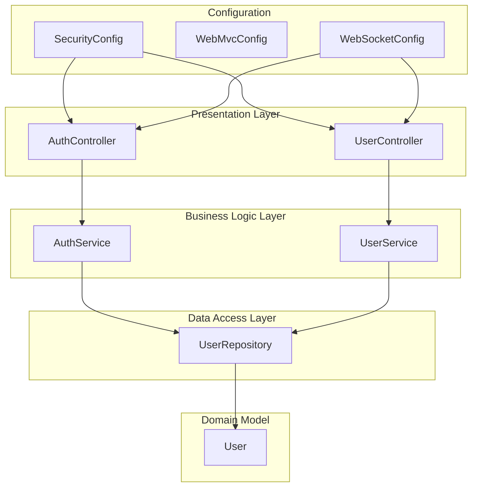
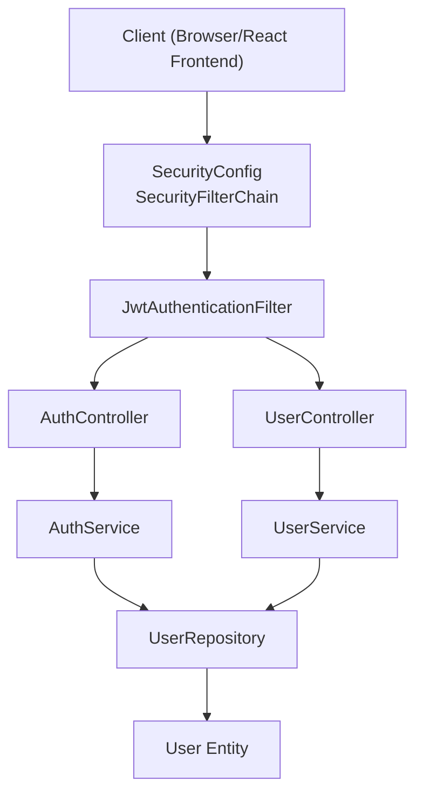
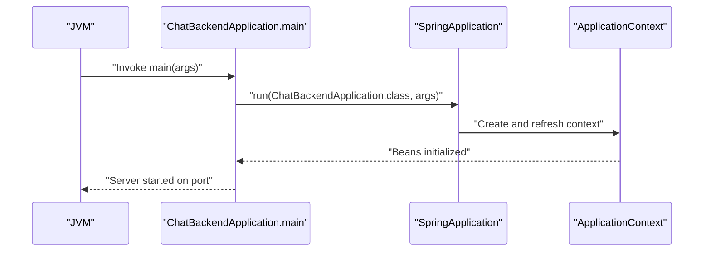
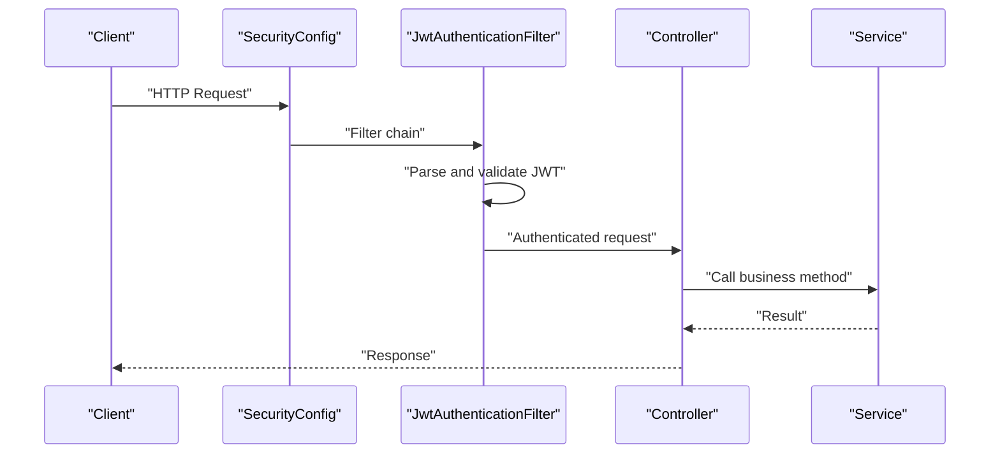
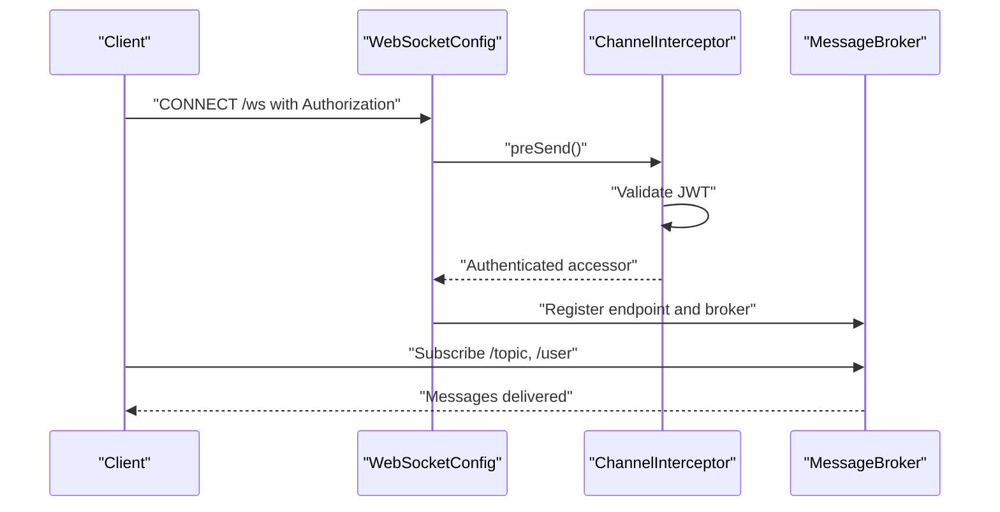
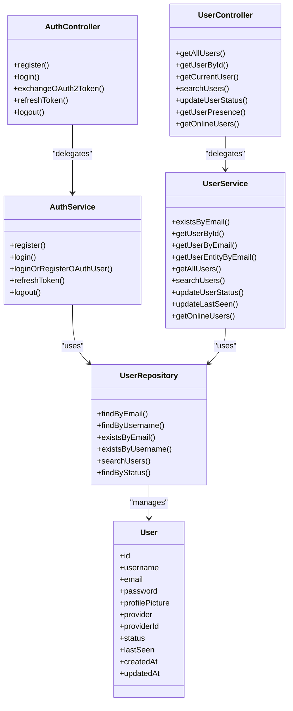
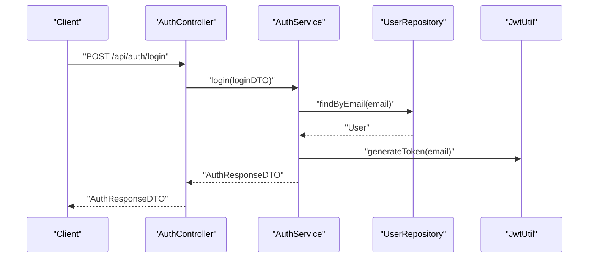
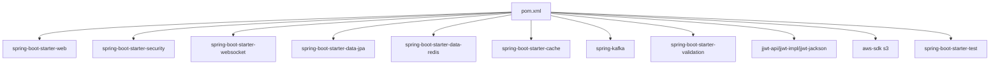

# Application Structure

<cite>
**Referenced Files in This Document**
- [ChatBackendApplication.java](file://src/main/java/com/chatify/chat_backend/ChatBackendApplication.java)
- [SecurityConfig.java](file://src/main/java/com/chatify/chat_backend/config/SecurityConfig.java)
- [WebMvcConfig.java](file://src/main/java/com/chatify/chat_backend/config/WebMvcConfig.java)
- [WebSocketConfig.java](file://src/main/java/com/chatify/chat_backend/config/WebSocketConfig.java)
- [JwtAuthenticationFilter.java](file://src/main/java/com/chatify/chat_backend/security/JwtAuthenticationFilter.java)
- [AuthController.java](file://src/main/java/com/chatify/chat_backend/controller/AuthController.java)
- [UserController.java](file://src/main/java/com/chatify/chat_backend/controller/UserController.java)
- [AuthService.java](file://src/main/java/com/chatify/chat_backend/service/AuthService.java)
- [UserService.java](file://src/main/java/com/chatify/chat_backend/service/UserService.java)
- [UserRepository.java](file://src/main/java/com/chatify/chat_backend/repository/UserRepository.java)
- [User.java](file://src/main/java/com/chatify/chat_backend/entity/User.java)
- [AuthResponseDTO.java](file://src/main/java/com/chatify/chat_backend/dto/AuthResponseDTO.java)
- [ApplicationStartupListener.java](file://src/main/java/com/chatify/chat_backend/listener/ApplicationStartupListener.java)
- [pom.xml](file://pom.xml)
- [application.properties](file://src/main/resources/application.properties)
</cite>

## Table of Contents
1. [Introduction](#introduction)
2. [Project Structure](#project-structure)
3. [Core Components](#core-components)
4. [Architecture Overview](#architecture-overview)
5. [Detailed Component Analysis](#detailed-component-analysis)
6. [Dependency Analysis](#dependency-analysis)
7. [Performance Considerations](#performance-considerations)
8. [Troubleshooting Guide](#troubleshooting-guide)
9. [Conclusion](#conclusion)

## Introduction
This document explains the Chatify backend’s layered architecture and package organization. It focuses on Spring Boot application initialization, component scanning, and configuration classes for security, web MVC, and WebSocket real-time communication. It also documents the layered architecture separating presentation (controllers), business logic (services), and data access (repositories), along with practical examples of component interactions and the rationale behind architectural decisions.

## Project Structure
The backend follows a conventional Spring Boot package layout with clear separation of concerns:
- config: Centralized configuration for security, web MVC, WebSocket, and infrastructure beans
- controller: REST endpoints for HTTP APIs
- service: Business logic and orchestration
- repository: Data access layer using Spring Data JPA
- entity: JPA domain models
- dto: Data transfer objects for request/response payloads
- security: Authentication and authorization filters and utilities
- exception: Global exception handling and custom exceptions
- listener: Startup event listeners for application lifecycle tasks
- resources: Application properties and static resources

**Diagram sources**
- [SecurityConfig.java:27-120](file://src/main/java/com/chatify/chat_backend/config/SecurityConfig.java#L27-L120)
- [WebMvcConfig.java:8-20](file://src/main/java/com/chatify/chat_backend/config/WebMvcConfig.java#L8-L20)
- [WebSocketConfig.java:27-111](file://src/main/java/com/chatify/chat_backend/config/WebSocketConfig.java#L27-L111)
- [AuthController.java:19-140](file://src/main/java/com/chatify/chat_backend/controller/AuthController.java#L19-L140)
- [UserController.java:15-74](file://src/main/java/com/chatify/chat_backend/controller/UserController.java#L15-L74)
- [AuthService.java:21-162](file://src/main/java/com/chatify/chat_backend/service/AuthService.java#L21-L162)
- [UserService.java:18-129](file://src/main/java/com/chatify/chat_backend/service/UserService.java#L18-L129)
- [UserRepository.java:13-31](file://src/main/java/com/chatify/chat_backend/repository/UserRepository.java#L13-L31)
- [User.java:11-56](file://src/main/java/com/chatify/chat_backend/entity/User.java#L11-L56)

**Section sources**
- [ChatBackendApplication.java:6-11](file://src/main/java/com/chatify/chat_backend/ChatBackendApplication.java#L6-L11)
- [pom.xml:40-155](file://pom.xml#L40-L155)

## Core Components
- Application entry point: The main class annotated with the Spring Boot stereotype triggers component scanning and starts the embedded server.
- Configuration classes:
  - SecurityConfig: Defines security filter chain, CORS, OAuth2 login, and authentication provider.
  - WebMvcConfig: Registers static resource handlers for uploaded files.
  - WebSocketConfig: Enables STOMP over WebSocket, sets up message broker, heartbeat scheduler, and inbound channel interceptors for JWT-based authentication.
- Controllers: Expose REST endpoints under /api/* and WebSocket endpoint under /ws.
- Services: Encapsulate business logic and coordinate repositories.
- Repositories: JPA interfaces for data access.
- Entities: JPA entities mapped to database tables.
- DTOs: Transfer objects for API payloads.
- Security filters: JWT filter to populate SecurityContext for HTTP requests.

**Section sources**
- [ChatBackendApplication.java:6-11](file://src/main/java/com/chatify/chat_backend/ChatBackendApplication.java#L6-L11)
- [SecurityConfig.java:27-120](file://src/main/java/com/chatify/chat_backend/config/SecurityConfig.java#L27-L120)
- [WebMvcConfig.java:8-20](file://src/main/java/com/chatify/chat_backend/config/WebMvcConfig.java#L8-L20)
- [WebSocketConfig.java:27-111](file://src/main/java/com/chatify/chat_backend/config/WebSocketConfig.java#L27-L111)
- [AuthController.java:19-140](file://src/main/java/com/chatify/chat_backend/controller/AuthController.java#L19-L140)
- [UserController.java:15-74](file://src/main/java/com/chatify/chat_backend/controller/UserController.java#L15-L74)
- [AuthService.java:21-162](file://src/main/java/com/chatify/chat_backend/service/AuthService.java#L21-L162)
- [UserService.java:18-129](file://src/main/java/com/chatify/chat_backend/service/UserService.java#L18-L129)
- [UserRepository.java:13-31](file://src/main/java/com/chatify/chat_backend/repository/UserRepository.java#L13-L31)
- [User.java:11-56](file://src/main/java/com/chatify/chat_backend/entity/User.java#L11-L56)
- [JwtAuthenticationFilter.java:16-78](file://src/main/java/com/chatify/chat_backend/security/JwtAuthenticationFilter.java#L16-L78)

## Architecture Overview
The backend implements a layered architecture:
- Presentation layer: Controllers expose HTTP endpoints and delegate to services.
- Business logic layer: Services encapsulate use-case logic, enforce policies, and manage transactions.
- Data access layer: Repositories provide CRUD and query capabilities backed by JPA/Hibernate.
- Infrastructure: Security, WebSocket, and web MVC configurations integrate with Spring Security and Spring Messaging.

**Diagram sources**
- [SecurityConfig.java:61-90](file://src/main/java/com/chatify/chat_backend/config/SecurityConfig.java#L61-L90)
- [JwtAuthenticationFilter.java:37-67](file://src/main/java/com/chatify/chat_backend/security/JwtAuthenticationFilter.java#L37-L67)
- [AuthController.java:35-53](file://src/main/java/com/chatify/chat_backend/controller/AuthController.java#L35-L53)
- [UserController.java:27-41](file://src/main/java/com/chatify/chat_backend/controller/UserController.java#L27-L41)
- [AuthService.java:45-77](file://src/main/java/com/chatify/chat_backend/service/AuthService.java#L45-L77)
- [UserService.java:27-40](file://src/main/java/com/chatify/chat_backend/service/UserService.java#L27-L40)
- [UserRepository.java:16-28](file://src/main/java/com/chatify/chat_backend/repository/UserRepository.java#L16-L28)
- [User.java:18-56](file://src/main/java/com/chatify/chat_backend/entity/User.java#L18-L56)

## Detailed Component Analysis

### Spring Boot Initialization and Component Scanning
- The main class enables auto-configuration and component scanning across the package hierarchy. Dependencies include web, security, WebSocket, JPA, Redis, Kafka, validation, and JWT libraries.
- Environment properties define database, Redis, OAuth2, AWS S3, Kafka, and CORS settings.

**Diagram sources**
- [ChatBackendApplication.java:9-11](file://src/main/java/com/chatify/chat_backend/ChatBackendApplication.java#L9-L11)
- [pom.xml:40-155](file://pom.xml#L40-L155)
- [application.properties:1-75](file://src/main/resources/application.properties#L1-L75)

**Section sources**
- [ChatBackendApplication.java:6-11](file://src/main/java/com/chatify/chat_backend/ChatBackendApplication.java#L6-L11)
- [pom.xml:40-155](file://pom.xml#L40-L155)
- [application.properties:1-75](file://src/main/resources/application.properties#L1-L75)

### Security Configuration (Authentication and Authorization)
- SecurityConfig defines:
  - CORS policy allowing configurable origins and credentials
  - CSRF disabled and session policy configured
  - Public endpoints for auth, uploads, and OAuth2
  - JWT-based authentication provider and filter integration
  - OAuth2 login success handler integration
  - Custom unauthorized entry point for API endpoints
- JwtAuthenticationFilter extracts JWT from Authorization header, validates it, loads user details, and sets authentication in SecurityContext for non-exempt paths.

**Diagram sources**
- [SecurityConfig.java:61-90](file://src/main/java/com/chatify/chat_backend/config/SecurityConfig.java#L61-L90)
- [JwtAuthenticationFilter.java:37-67](file://src/main/java/com/chatify/chat_backend/security/JwtAuthenticationFilter.java#L37-L67)
- [AuthController.java:35-53](file://src/main/java/com/chatify/chat_backend/controller/AuthController.java#L35-L53)

**Section sources**
- [SecurityConfig.java:27-120](file://src/main/java/com/chatify/chat_backend/config/SecurityConfig.java#L27-L120)
- [JwtAuthenticationFilter.java:16-78](file://src/main/java/com/chatify/chat_backend/security/JwtAuthenticationFilter.java#L16-L78)

### Web MVC Configuration (CORS and Static Resources)
- WebMvcConfig registers a resource handler to serve uploaded files from a configurable directory, enabling clients to fetch media via /uploads/**.

**Section sources**
- [WebMvcConfig.java:8-20](file://src/main/java/com/chatify/chat_backend/config/WebMvcConfig.java#L8-L20)
- [application.properties:11-11](file://src/main/resources/application.properties#L11-L11)

### WebSocket Configuration (Real-Time Communication)
- WebSocketConfig:
  - Enables STOMP over WebSocket with SockJS fallback
  - Configures simple broker for topics and user destinations
  - Sets heartbeat scheduler and application destination prefixes
  - Adds an inbound channel interceptor to authenticate CONNECT frames using JWT
- Interceptor reads Authorization header, validates JWT via JwtUtil, and sets the user principal on the STOMP accessor.

**Diagram sources**
- [WebSocketConfig.java:43-57](file://src/main/java/com/chatify/chat_backend/config/WebSocketConfig.java#L43-L57)
- [WebSocketConfig.java:68-110](file://src/main/java/com/chatify/chat_backend/config/WebSocketConfig.java#L68-L110)

**Section sources**
- [WebSocketConfig.java:27-111](file://src/main/java/com/chatify/chat_backend/config/WebSocketConfig.java#L27-L111)

### Layered Architecture: Presentation, Business, Data
- Presentation layer:
  - AuthController: Handles registration, login, token exchange, refresh, and logout
  - UserController: Manages user retrieval, current user info, presence, and online users
- Business logic layer:
  - AuthService: Implements registration, login, OAuth2 linking, refresh token generation, and logout
  - UserService: Provides user queries, caching, and status updates with cache eviction
- Data access layer:
  - UserRepository: Extends JPA repository with custom queries and existence checks
  - User entity: Maps to users table with status and timestamps

**Diagram sources**
- [AuthController.java:35-140](file://src/main/java/com/chatify/chat_backend/controller/AuthController.java#L35-L140)
- [UserController.java:27-74](file://src/main/java/com/chatify/chat_backend/controller/UserController.java#L27-L74)
- [AuthService.java:45-162](file://src/main/java/com/chatify/chat_backend/service/AuthService.java#L45-L162)
- [UserService.java:27-129](file://src/main/java/com/chatify/chat_backend/service/UserService.java#L27-L129)
- [UserRepository.java:16-29](file://src/main/java/com/chatify/chat_backend/repository/UserRepository.java#L16-L29)
- [User.java:18-56](file://src/main/java/com/chatify/chat_backend/entity/User.java#L18-L56)

**Section sources**
- [AuthController.java:19-140](file://src/main/java/com/chatify/chat_backend/controller/AuthController.java#L19-L140)
- [UserController.java:15-74](file://src/main/java/com/chatify/chat_backend/controller/UserController.java#L15-L74)
- [AuthService.java:21-162](file://src/main/java/com/chatify/chat_backend/service/AuthService.java#L21-L162)
- [UserService.java:18-129](file://src/main/java/com/chatify/chat_backend/service/UserService.java#L18-L129)
- [UserRepository.java:13-31](file://src/main/java/com/chatify/chat_backend/repository/UserRepository.java#L13-L31)
- [User.java:11-56](file://src/main/java/com/chatify/chat_backend/entity/User.java#L11-L56)

### Practical Interaction Examples
- HTTP login flow:
  - Client posts credentials to AuthController.login
  - AuthService authenticates against UserRepository and generates JWT and refresh token
  - AuthController returns AuthResponseDTO with tokens
- Presence reset on startup:
  - ApplicationStartupListener resets stale ONLINE users and clears Redis presence keys after application readiness

**Diagram sources**
- [AuthController.java:45-53](file://src/main/java/com/chatify/chat_backend/controller/AuthController.java#L45-L53)
- [AuthService.java:61-77](file://src/main/java/com/chatify/chat_backend/service/AuthService.java#L61-L77)
- [UserRepository.java:16-16](file://src/main/java/com/chatify/chat_backend/repository/UserRepository.java#L16-L16)
- [AuthResponseDTO.java:10-16](file://src/main/java/com/chatify/chat_backend/dto/AuthResponseDTO.java#L10-L16)

**Section sources**
- [AuthController.java:35-140](file://src/main/java/com/chatify/chat_backend/controller/AuthController.java#L35-L140)
- [AuthService.java:45-162](file://src/main/java/com/chatify/chat_backend/service/AuthService.java#L45-L162)
- [ApplicationStartupListener.java:34-66](file://src/main/java/com/chatify/chat_backend/listener/ApplicationStartupListener.java#L34-L66)

### Rationale Behind Architectural Decisions
- Layered architecture ensures separation of concerns, testability, and maintainability.
- Controllers are thin and delegate to services, keeping business logic centralized.
- Repositories encapsulate persistence concerns and leverage Spring Data JPA for concise query definitions.
- SecurityConfig centralizes cross-cutting concerns like CORS, CSRF, session management, and OAuth2.
- WebSocketConfig integrates JWT validation at the protocol level for secure real-time messaging.
- Caching in UserService improves read performance for user lookups while avoiding entity caching pitfalls.

**Section sources**
- [UserService.java:32-109](file://src/main/java/com/chatify/chat_backend/service/UserService.java#L32-L109)
- [SecurityConfig.java:61-90](file://src/main/java/com/chatify/chat_backend/config/SecurityConfig.java#L61-L90)
- [WebSocketConfig.java:68-110](file://src/main/java/com/chatify/chat_backend/config/WebSocketConfig.java#L68-L110)

## Dependency Analysis
External dependencies include Spring Web, Security, WebSocket, JPA, Redis, Kafka, validation, JWT, and AWS SDK. These enable REST APIs, OAuth2, real-time messaging, persistence, caching, message queuing, and cloud storage.

**Diagram sources**
- [pom.xml:40-155](file://pom.xml#L40-L155)

**Section sources**
- [pom.xml:40-155](file://pom.xml#L40-L155)

## Performance Considerations
- Caching: UserService leverages Redis-backed caching for user DTOs with explicit eviction on status changes to prevent stale presence data.
- Heartbeats: WebSocketConfig configures a dedicated scheduler for STOMP heartbeats to keep connections alive and detect failures.
- Lazy loading: Entities avoid caching to prevent detached session issues; DTOs are used for transport.
- Transaction boundaries: Services annotate methods with appropriate propagation to minimize lock contention and ensure consistency.

**Section sources**
- [UserService.java:32-109](file://src/main/java/com/chatify/chat_backend/service/UserService.java#L32-L109)
- [WebSocketConfig.java:59-66](file://src/main/java/com/chatify/chat_backend/config/WebSocketConfig.java#L59-L66)

## Troubleshooting Guide
- Unauthorized responses: Verify Authorization header format and token validity; check SecurityConfig unauthorized entry point behavior for API routes.
- OAuth2 token exchange errors: Confirm HttpOnly cookie presence and decoding; ensure cookie path matches the exchange endpoint.
- WebSocket authentication failures: Ensure CONNECT frame includes a valid Bearer token; inspect logs for JWT parsing errors.
- Startup presence inconsistencies: ApplicationStartupListener resets stale ONLINE users and clears Redis presence keys; confirm Redis connectivity and keyspace.

**Section sources**
- [SecurityConfig.java:51-58](file://src/main/java/com/chatify/chat_backend/config/SecurityConfig.java#L51-L58)
- [AuthController.java:69-107](file://src/main/java/com/chatify/chat_backend/controller/AuthController.java#L69-L107)
- [WebSocketConfig.java:75-106](file://src/main/java/com/chatify/chat_backend/config/WebSocketConfig.java#L75-L106)
- [ApplicationStartupListener.java:34-66](file://src/main/java/com/chatify/chat_backend/listener/ApplicationStartupListener.java#L34-L66)

## Conclusion
The Chatify backend employs a clean, layered architecture with Spring Boot and Spring Security. Configuration classes centralize cross-cutting concerns, while controllers, services, and repositories form a cohesive business logic stack. Real-time communication is secured and scalable via WebSocket and JWT. The design emphasizes modularity, testability, and operational robustness.