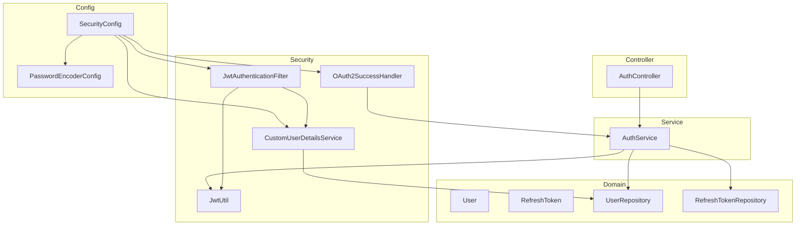
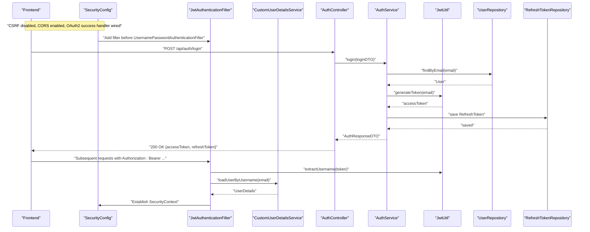
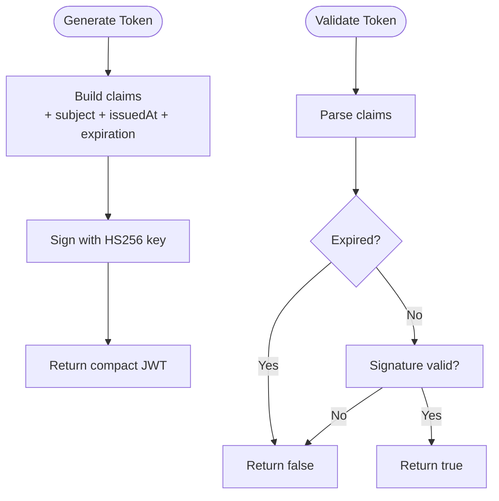
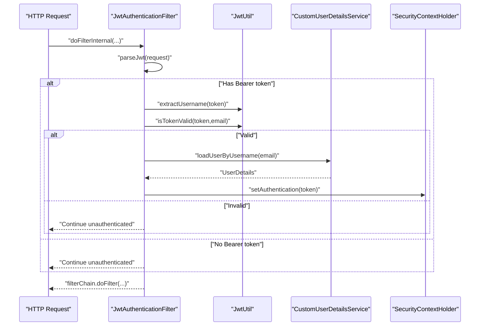
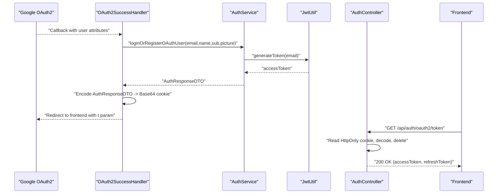
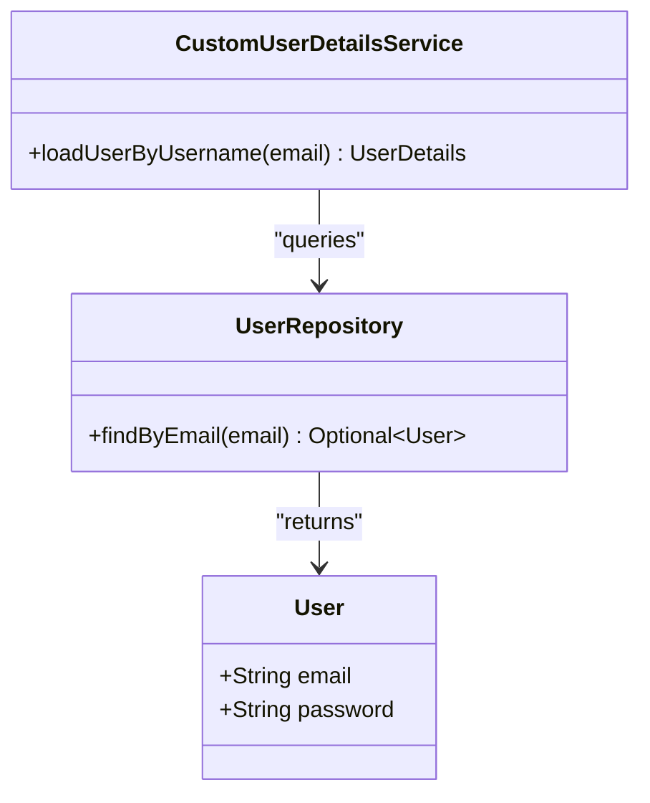
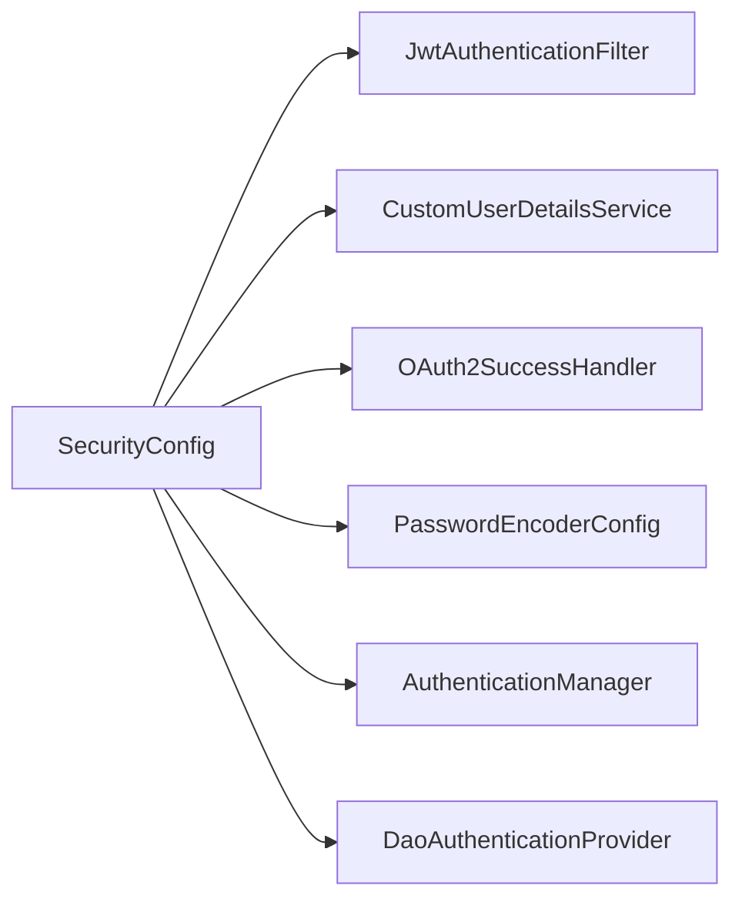
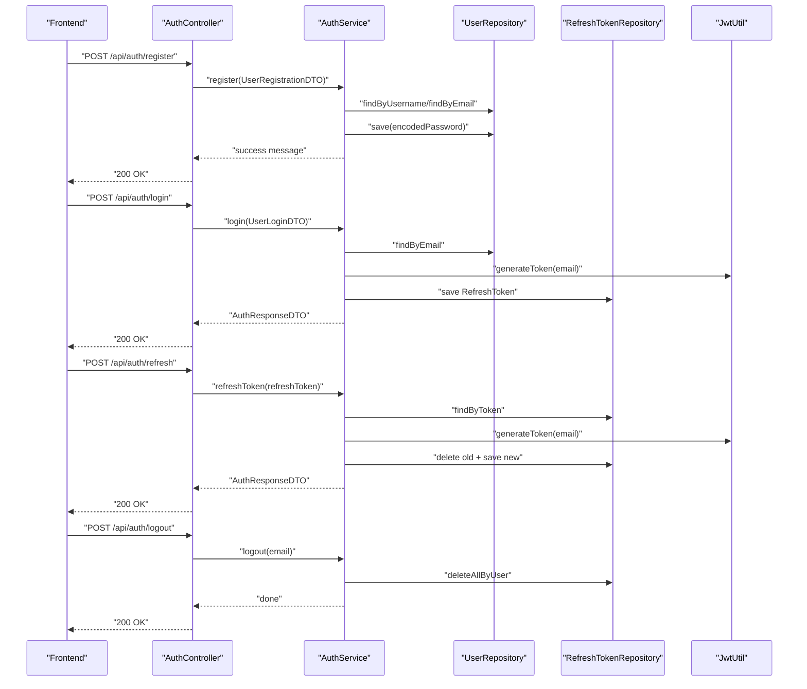
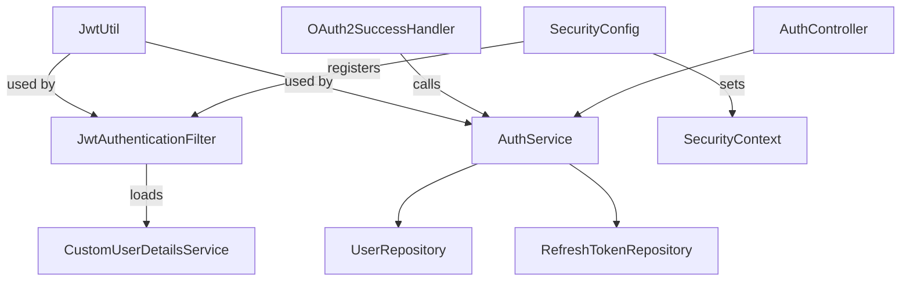

# Authentication and Security

<cite>
**Referenced Files in This Document**
- [JwtUtil.java](file://src/main/java/com/chatify/chat_backend/security/JwtUtil.java)
- [JwtAuthenticationFilter.java](file://src/main/java/com/chatify/chat_backend/security/JwtAuthenticationFilter.java)
- [CustomUserDetailsService.java](file://src/main/java/com/chatify/chat_backend/security/CustomUserDetailsService.java)
- [OAuth2SuccessHandler.java](file://src/main/java/com/chatify/chat_backend/security/OAuth2SuccessHandler.java)
- [SecurityConfig.java](file://src/main/java/com/chatify/chat_backend/config/SecurityConfig.java)
- [PasswordEncoderConfig.java](file://src/main/java/com/chatify/chat_backend/config/PasswordEncoderConfig.java)
- [AuthService.java](file://src/main/java/com/chatify/chat_backend/service/AuthService.java)
- [AuthController.java](file://src/main/java/com/chatify/chat_backend/controller/AuthController.java)
- [User.java](file://src/main/java/com/chatify/chat_backend/entity/User.java)
- [RefreshToken.java](file://src/main/java/com/chatify/chat_backend/entity/RefreshToken.java)
- [UserRepository.java](file://src/main/java/com/chatify/chat_backend/repository/UserRepository.java)
- [RefreshTokenRepository.java](file://src/main/java/com/chatify/chat_backend/repository/RefreshTokenRepository.java)
- [AuthResponseDTO.java](file://src/main/java/com/chatify/chat_backend/dto/AuthResponseDTO.java)
- [UserRegistrationDTO.java](file://src/main/java/com/chatify/chat_backend/dto/UserRegistrationDTO.java)
- [UserLoginDTO.java](file://src/main/java/com/chatify/chat_backend/dto/UserLoginDTO.java)
</cite>

## Table of Contents
1. [Introduction](#introduction)
2. [Project Structure](#project-structure)
3. [Core Components](#core-components)
4. [Architecture Overview](#architecture-overview)
5. [Detailed Component Analysis](#detailed-component-analysis)
6. [Dependency Analysis](#dependency-analysis)
7. [Performance Considerations](#performance-considerations)
8. [Troubleshooting Guide](#troubleshooting-guide)
9. [Conclusion](#conclusion)
10. [Appendices](#appendices)

## Introduction
This document explains the authentication and security subsystem of the Chatify backend, focusing on:
- JWT token lifecycle: generation, validation, and refresh
- OAuth2 Google login integration and user registration flow
- Custom user details service for loading users from the database
- Password encoding configuration and security configuration
- Authentication error handling and common security mitigations

It provides concrete examples mapped to actual code paths and diagrams to illustrate flows and relationships.

## Project Structure
The security subsystem spans several packages:
- security: JWT utilities, filters, OAuth2 success handler, and custom user details service
- config: Spring Security configuration and password encoder bean
- service: authentication service implementing registration, login, OAuth2 linking, token refresh, and logout
- controller: authentication endpoints for registration, login, token exchange, refresh, and logout
- entity/repository/dto: domain models, repositories, and DTOs supporting authentication

**Diagram sources**
- [JwtUtil.java:1-145](file://src/main/java/com/chatify/chat_backend/security/JwtUtil.java#L1-L145)
- [JwtAuthenticationFilter.java:1-78](file://src/main/java/com/chatify/chat_backend/security/JwtAuthenticationFilter.java#L1-L78)
- [CustomUserDetailsService.java:1-42](file://src/main/java/com/chatify/chat_backend/security/CustomUserDetailsService.java#L1-L42)
- [OAuth2SuccessHandler.java:1-88](file://src/main/java/com/chatify/chat_backend/security/OAuth2SuccessHandler.java#L1-L88)
- [SecurityConfig.java:1-120](file://src/main/java/com/chatify/chat_backend/config/SecurityConfig.java#L1-L120)
- [PasswordEncoderConfig.java:1-15](file://src/main/java/com/chatify/chat_backend/config/PasswordEncoderConfig.java#L1-L15)
- [AuthService.java:1-162](file://src/main/java/com/chatify/chat_backend/service/AuthService.java#L1-L162)
- [AuthController.java:1-140](file://src/main/java/com/chatify/chat_backend/controller/AuthController.java#L1-L140)
- [User.java:1-56](file://src/main/java/com/chatify/chat_backend/entity/User.java#L1-L56)
- [RefreshToken.java:1-31](file://src/main/java/com/chatify/chat_backend/entity/RefreshToken.java#L1-L31)
- [UserRepository.java:1-31](file://src/main/java/com/chatify/chat_backend/repository/UserRepository.java#L1-L31)
- [RefreshTokenRepository.java:1-20](file://src/main/java/com/chatify/chat_backend/repository/RefreshTokenRepository.java#L1-L20)

**Section sources**
- [SecurityConfig.java:1-120](file://src/main/java/com/chatify/chat_backend/config/SecurityConfig.java#L1-L120)

## Core Components
- JwtUtil: Generates, validates, and parses JWTs using a Base64-encoded HS256 key configured via application properties. It supports token lifetime configuration and extracts subject and expiration.
- JwtAuthenticationFilter: Extracts Authorization Bearer tokens from requests, validates them, loads user details, and establishes an authenticated SecurityContext for protected routes.
- CustomUserDetailsService: Loads users by email from the database and returns Spring Security UserDetails with a default ROLE_USER.
- OAuth2SuccessHandler: Handles successful Google OAuth2 callbacks, delegates user login/registration to AuthService, and sets a short-lived HttpOnly cookie containing the auth response for secure token exchange.
- SecurityConfig: Disables CSRF, configures CORS, sets session policy, registers the JWT filter, and wires OAuth2 success/failure handlers.
- PasswordEncoderConfig: Provides BCryptPasswordEncoder bean for password hashing.
- AuthService: Implements local registration and login, OAuth2 user linking and registration, JWT access/refresh token generation, refresh token rotation, and logout cleanup.
- AuthController: Exposes endpoints for registration, login, OAuth2 token exchange, refresh, and logout.

**Section sources**
- [JwtUtil.java:1-145](file://src/main/java/com/chatify/chat_backend/security/JwtUtil.java#L1-L145)
- [JwtAuthenticationFilter.java:1-78](file://src/main/java/com/chatify/chat_backend/security/JwtAuthenticationFilter.java#L1-L78)
- [CustomUserDetailsService.java:1-42](file://src/main/java/com/chatify/chat_backend/security/CustomUserDetailsService.java#L1-L42)
- [OAuth2SuccessHandler.java:1-88](file://src/main/java/com/chatify/chat_backend/security/OAuth2SuccessHandler.java#L1-L88)
- [SecurityConfig.java:1-120](file://src/main/java/com/chatify/chat_backend/config/SecurityConfig.java#L1-L120)
- [PasswordEncoderConfig.java:1-15](file://src/main/java/com/chatify/chat_backend/config/PasswordEncoderConfig.java#L1-L15)
- [AuthService.java:1-162](file://src/main/java/com/chatify/chat_backend/service/AuthService.java#L1-L162)
- [AuthController.java:1-140](file://src/main/java/com/chatify/chat_backend/controller/AuthController.java#L1-L140)

## Architecture Overview
The authentication architecture combines stateless JWT for API access with OAuth2 for social login. The flow integrates with Spring Security’s filter chain and custom providers.

**Diagram sources**
- [SecurityConfig.java:61-90](file://src/main/java/com/chatify/chat_backend/config/SecurityConfig.java#L61-L90)
- [JwtAuthenticationFilter.java:37-67](file://src/main/java/com/chatify/chat_backend/security/JwtAuthenticationFilter.java#L37-L67)
- [AuthService.java:62-77](file://src/main/java/com/chatify/chat_backend/service/AuthService.java#L62-L77)
- [JwtUtil.java:60-79](file://src/main/java/com/chatify/chat_backend/security/JwtUtil.java#L60-L79)
- [UserRepository.java:16-18](file://src/main/java/com/chatify/chat_backend/repository/UserRepository.java#L16-L18)
- [RefreshTokenRepository.java:11-18](file://src/main/java/com/chatify/chat_backend/repository/RefreshTokenRepository.java#L11-L18)

## Detailed Component Analysis

### JWT Utility Functions
- Token generation: Builds a compact HS256 JWT with subject and expiration derived from configuration.
- Validation: Checks signature and expiration; supports subject-matching validation.
- Parsing: Parses claims safely using the configured signing key.

**Diagram sources**
- [JwtUtil.java:60-102](file://src/main/java/com/chatify/chat_backend/security/JwtUtil.java#L60-L102)
- [JwtUtil.java:137-143](file://src/main/java/com/chatify/chat_backend/security/JwtUtil.java#L137-L143)

**Section sources**
- [JwtUtil.java:27-53](file://src/main/java/com/chatify/chat_backend/security/JwtUtil.java#L27-L53)
- [JwtUtil.java:60-79](file://src/main/java/com/chatify/chat_backend/security/JwtUtil.java#L60-L79)
- [JwtUtil.java:96-118](file://src/main/java/com/chatify/chat_backend/security/JwtUtil.java#L96-L118)
- [JwtUtil.java:124-143](file://src/main/java/com/chatify/chat_backend/security/JwtUtil.java#L124-L143)

### JWT Authentication Filter
- Extracts Authorization Bearer token from the header.
- Validates token and loads user details by email.
- Establishes an authenticated SecurityContext for downstream controllers.

**Diagram sources**
- [JwtAuthenticationFilter.java:37-67](file://src/main/java/com/chatify/chat_backend/security/JwtAuthenticationFilter.java#L37-L67)
- [JwtUtil.java:86-118](file://src/main/java/com/chatify/chat_backend/security/JwtUtil.java#L86-L118)
- [CustomUserDetailsService.java:24-40](file://src/main/java/com/chatify/chat_backend/security/CustomUserDetailsService.java#L24-L40)

**Section sources**
- [JwtAuthenticationFilter.java:27-35](file://src/main/java/com/chatify/chat_backend/security/JwtAuthenticationFilter.java#L27-L35)
- [JwtAuthenticationFilter.java:43-67](file://src/main/java/com/chatify/chat_backend/security/JwtAuthenticationFilter.java#L43-L67)
- [JwtAuthenticationFilter.java:69-77](file://src/main/java/com/chatify/chat_backend/security/JwtAuthenticationFilter.java#L69-L77)

### OAuth2 Success Handler and Token Exchange
- On successful Google OAuth2, the handler calls AuthService to login or register the user.
- It writes an AuthResponseDTO into a Base64-encoded HttpOnly cookie scoped to the app origin.
- Frontend calls /api/auth/oauth2/token to securely receive tokens and clears the cookie.

**Diagram sources**
- [OAuth2SuccessHandler.java:38-87](file://src/main/java/com/chatify/chat_backend/security/OAuth2SuccessHandler.java#L38-L87)
- [AuthService.java:84-110](file://src/main/java/com/chatify/chat_backend/service/AuthService.java#L84-L110)
- [JwtUtil.java:60-79](file://src/main/java/com/chatify/chat_backend/security/JwtUtil.java#L60-L79)
- [AuthController.java:69-107](file://src/main/java/com/chatify/chat_backend/controller/AuthController.java#L69-L107)

**Section sources**
- [OAuth2SuccessHandler.java:38-87](file://src/main/java/com/chatify/chat_backend/security/OAuth2SuccessHandler.java#L38-L87)
- [AuthController.java:69-107](file://src/main/java/com/chatify/chat_backend/controller/AuthController.java#L69-L107)
- [AuthService.java:84-110](file://src/main/java/com/chatify/chat_backend/service/AuthService.java#L84-L110)

### Custom User Details Service
- Loads a user by email from the database.
- Returns a UserDetails with ROLE_USER and a placeholder password when the user authenticates via OAuth2.

**Diagram sources**
- [CustomUserDetailsService.java:14-41](file://src/main/java/com/chatify/chat_backend/security/CustomUserDetailsService.java#L14-L41)
- [UserRepository.java:16-18](file://src/main/java/com/chatify/chat_backend/repository/UserRepository.java#L16-L18)
- [User.java:28-32](file://src/main/java/com/chatify/chat_backend/entity/User.java#L28-L32)

**Section sources**
- [CustomUserDetailsService.java:24-40](file://src/main/java/com/chatify/chat_backend/security/CustomUserDetailsService.java#L24-L40)
- [UserRepository.java:16-18](file://src/main/java/com/chatify/chat_backend/repository/UserRepository.java#L16-L18)
- [User.java:28-32](file://src/main/java/com/chatify/chat_backend/entity/User.java#L28-L32)

### Security Configuration and Password Encoding
- SecurityConfig disables CSRF, configures CORS, sets session policy, registers the JWT filter, and wires OAuth2 success/failure handlers.
- PasswordEncoderConfig provides BCryptPasswordEncoder for secure password hashing.
- AuthenticationManager and DaoAuthenticationProvider are configured to use CustomUserDetailsService and PasswordEncoder.

**Diagram sources**
- [SecurityConfig.java:39-98](file://src/main/java/com/chatify/chat_backend/config/SecurityConfig.java#L39-L98)
- [PasswordEncoderConfig.java:9-15](file://src/main/java/com/chatify/chat_backend/config/PasswordEncoderConfig.java#L9-L15)

**Section sources**
- [SecurityConfig.java:61-90](file://src/main/java/com/chatify/chat_backend/config/SecurityConfig.java#L61-L90)
- [SecurityConfig.java:92-98](file://src/main/java/com/chatify/chat_backend/config/SecurityConfig.java#L92-L98)
- [PasswordEncoderConfig.java:11-14](file://src/main/java/com/chatify/chat_backend/config/PasswordEncoderConfig.java#L11-L14)

### Token-Based Authentication Flow, Registration, and Login
- Local registration: Validates uniqueness and encodes passwords before persisting.
- Local login: Validates credentials, generates access and refresh tokens.
- OAuth2 registration/linking: Creates or updates a Google-linked user and issues tokens.
- Refresh tokens: Rotates refresh tokens and reissues access tokens.
- Logout: Clears refresh tokens for the user.

**Diagram sources**
- [AuthController.java:35-53](file://src/main/java/com/chatify/chat_backend/controller/AuthController.java#L35-L53)
- [AuthService.java:45-77](file://src/main/java/com/chatify/chat_backend/service/AuthService.java#L45-L77)
- [AuthController.java:109-121](file://src/main/java/com/chatify/chat_backend/controller/AuthController.java#L109-L121)
- [AuthService.java:122-142](file://src/main/java/com/chatify/chat_backend/service/AuthService.java#L122-L142)
- [AuthController.java:123-139](file://src/main/java/com/chatify/chat_backend/controller/AuthController.java#L123-L139)
- [AuthService.java:144-150](file://src/main/java/com/chatify/chat_backend/service/AuthService.java#L144-L150)

**Section sources**
- [AuthController.java:35-53](file://src/main/java/com/chatify/chat_backend/controller/AuthController.java#L35-L53)
- [AuthService.java:45-77](file://src/main/java/com/chatify/chat_backend/service/AuthService.java#L45-L77)
- [AuthController.java:109-121](file://src/main/java/com/chatify/chat_backend/controller/AuthController.java#L109-L121)
- [AuthService.java:122-142](file://src/main/java/com/chatify/chat_backend/service/AuthService.java#L122-L142)
- [AuthController.java:123-139](file://src/main/java/com/chatify/chat_backend/controller/AuthController.java#L123-L139)
- [AuthService.java:144-150](file://src/main/java/com/chatify/chat_backend/service/AuthService.java#L144-L150)

## Dependency Analysis
- JwtUtil depends on application properties for secret and expiration and uses a Base64-decoded HS256 key.
- JwtAuthenticationFilter depends on JwtUtil and CustomUserDetailsService and is placed early in the filter chain.
- OAuth2SuccessHandler depends on AuthService and ObjectMapper and sets a short-lived HttpOnly cookie.
- SecurityConfig wires all components and disables CSRF for SPA-friendly stateless APIs.
- AuthService orchestrates JWT and refresh token lifecycle and coordinates with repositories.
- AuthController exposes endpoints for registration, login, token exchange, refresh, and logout.

**Diagram sources**
- [JwtUtil.java:1-145](file://src/main/java/com/chatify/chat_backend/security/JwtUtil.java#L1-L145)
- [JwtAuthenticationFilter.java:1-78](file://src/main/java/com/chatify/chat_backend/security/JwtAuthenticationFilter.java#L1-L78)
- [CustomUserDetailsService.java:1-42](file://src/main/java/com/chatify/chat_backend/security/CustomUserDetailsService.java#L1-L42)
- [OAuth2SuccessHandler.java:1-88](file://src/main/java/com/chatify/chat_backend/security/OAuth2SuccessHandler.java#L1-L88)
- [SecurityConfig.java:1-120](file://src/main/java/com/chatify/chat_backend/config/SecurityConfig.java#L1-L120)
- [AuthService.java:1-162](file://src/main/java/com/chatify/chat_backend/service/AuthService.java#L1-L162)
- [AuthController.java:1-140](file://src/main/java/com/chatify/chat_backend/controller/AuthController.java#L1-L140)
- [UserRepository.java:1-31](file://src/main/java/com/chatify/chat_backend/repository/UserRepository.java#L1-L31)
- [RefreshTokenRepository.java:1-20](file://src/main/java/com/chatify/chat_backend/repository/RefreshTokenRepository.java#L1-L20)

**Section sources**
- [SecurityConfig.java:61-90](file://src/main/java/com/chatify/chat_backend/config/SecurityConfig.java#L61-L90)
- [AuthService.java:1-162](file://src/main/java/com/chatify/chat_backend/service/AuthService.java#L1-L162)

## Performance Considerations
- Token lifetime: Configure jwt.expiration-ms to balance security and UX. Shorter lifetimes reduce risk but increase refresh frequency.
- Refresh token storage: Using UUIDs and expiry timestamps enables efficient lookup and cleanup.
- Filter scope: JwtAuthenticationFilter excludes /ws, /api/auth, /oauth2, and /login/oauth2 to avoid redundant checks.
- Password hashing: BCrypt cost is tuned by the encoder; keep defaults for balanced performance and security.

[No sources needed since this section provides general guidance]

## Troubleshooting Guide
Common issues and resolutions:
- Unauthorized responses: Verify Authorization header format and token validity. Check SecurityConfig’s default entry point for API endpoints.
- OAuth2 failures: Confirm redirect URI matches configuration and that the HttpOnly cookie is present and unmodified. Inspect OAuth2SuccessHandler logs.
- Token validation errors: Ensure the signing key is correctly Base64-decoded and meets minimum length requirements.
- Session management: CSRF is disabled for SPA; ensure cookies are HttpOnly and SameSite=Lax as configured.
- Logout behavior: Access tokens are stateless; logout removes refresh tokens server-side. Clients should clear stored tokens.

**Section sources**
- [SecurityConfig.java:52-58](file://src/main/java/com/chatify/chat_backend/config/SecurityConfig.java#L52-L58)
- [SecurityConfig.java:68-73](file://src/main/java/com/chatify/chat_backend/config/SecurityConfig.java#L68-L73)
- [JwtUtil.java:96-102](file://src/main/java/com/chatify/chat_backend/security/JwtUtil.java#L96-L102)
- [OAuth2SuccessHandler.java:50-54](file://src/main/java/com/chatify/chat_backend/security/OAuth2SuccessHandler.java#L50-L54)
- [AuthController.java:123-139](file://src/main/java/com/chatify/chat_backend/controller/AuthController.java#L123-L139)

## Conclusion
The Chatify authentication subsystem implements a robust, stateless JWT-based API authentication model with secure OAuth2 Google integration. It leverages Spring Security’s filter chain, custom user details loading, and a refresh token mechanism to support resilient user sessions. The design emphasizes secure defaults, explicit error handling, and extensibility for additional providers.

[No sources needed since this section summarizes without analyzing specific files]

## Appendices

### Configuration Options and Defaults
- JWT secret and expiration: Provided via application properties; secret must be Base64-encoded and sufficiently long.
- Refresh token expiration: Configurable via application property with a default suitable for typical offline scenarios.
- CORS origins: Configurable via application property; defaults to common development origins.

**Section sources**
- [JwtUtil.java:27-36](file://src/main/java/com/chatify/chat_backend/security/JwtUtil.java#L27-L36)
- [AuthService.java:31-32](file://src/main/java/com/chatify/chat_backend/service/AuthService.java#L31-L32)
- [SecurityConfig.java:36-37](file://src/main/java/com/chatify/chat_backend/config/SecurityConfig.java#L36-L37)

### Extending with Additional OAuth2 Providers
To add another provider:
- Configure client credentials and authorize uri in Spring Security’s OAuth2 client settings.
- Extend the OAuth2 success handler to normalize user attributes and delegate to AuthService.
- Ensure AuthService handles provider-specific fields and merges accounts if applicable.
- Update front-end routing to support the new provider’s callback endpoint.

[No sources needed since this section provides general guidance]