# Backend Architecture

<cite>
**Referenced Files in This Document**
- [ChatBackendApplication.java](file://src/main/java/com/chatify/chat_backend/ChatBackendApplication.java)
- [pom.xml](file://pom.xml)
- [docker-compose.yml](file://docker-compose.yml)
- [README.md](file://README.md)
- [SecurityConfig.java](file://src/main/java/com/chatify/chat_backend/config/SecurityConfig.java)
- [WebSocketConfig.java](file://src/main/java/com/chatify/chat_backend/config/WebSocketConfig.java)
- [KafkaTopicConfig.java](file://src/main/java/com/chatify/chat_backend/config/KafkaTopicConfig.java)
- [RedisConfig.java](file://src/main/java/com/chatify/chat_backend/config/RedisConfig.java)
- [WebMvcConfig.java](file://src/main/java/com/chatify/chat_backend/config/WebMvcConfig.java)
- [AuthController.java](file://src/main/java/com/chatify/chat_backend/controller/AuthController.java)
- [MessageController.java](file://src/main/java/com/chatify/chat_backend/controller/MessageController.java)
- [FileController.java](file://src/main/java/com/chatify/chat_backend/controller/FileController.java)
- [UserController.java](file://src/main/java/com/chatify/chat_backend/controller/UserController.java)
- [ChatRoomController.java](file://src/main/java/com/chatify/chat_backend/controller/ChatRoomController.java)
</cite>

## Table of Contents
1. [Introduction](#introduction)
2. [Project Structure](#project-structure)
3. [Core Components](#core-components)
4. [Architecture Overview](#architecture-overview)
5. [Detailed Component Analysis](#detailed-component-analysis)
6. [Dependency Analysis](#dependency-analysis)
7. [Performance Considerations](#performance-considerations)
8. [Troubleshooting Guide](#troubleshooting-guide)
9. [Conclusion](#conclusion)
10. [Appendices](#appendices)

## Introduction
This document describes the backend architecture of Chatify, a real-time chat application built with Spring Boot. The system follows a layered architecture separating presentation, business logic, and data access concerns. It integrates WebSocket/STOMP for real-time messaging, JWT-based authentication, Kafka for asynchronous events, Redis for caching and presence tracking, and AWS S3 for secure file uploads. Infrastructure is orchestrated via Docker Compose with PostgreSQL as the primary relational store.

## Project Structure
The backend is organized into packages aligned with Spring Boot conventions:
- config: Cross-cutting concerns (security, web MVC, WebSocket, Redis, Kafka topics)
- controller: REST endpoints for authentication, chat rooms, messages, users, and file uploads
- service: Business logic and orchestration
- repository: Data access layer using Spring Data JPA
- entity: JPA domain models
- dto: Transfer objects for requests/responses
- exception: Global exception handling and custom exceptions
- security: JWT filter, user details service, OAuth2 handler
- listener: Startup and WebSocket lifecycle listeners

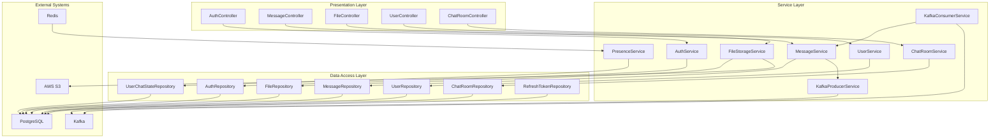

**Diagram sources**
- [AuthController.java:1-140](file://src/main/java/com/chatify/chat_backend/controller/AuthController.java#L1-L140)
- [MessageController.java:1-95](file://src/main/java/com/chatify/chat_backend/controller/MessageController.java#L1-L95)
- [FileController.java:1-30](file://src/main/java/com/chatify/chat_backend/controller/FileController.java#L1-L30)
- [UserController.java:1-74](file://src/main/java/com/chatify/chat_backend/controller/UserController.java#L1-L74)
- [ChatRoomController.java:1-102](file://src/main/java/com/chatify/chat_backend/controller/ChatRoomController.java#L1-L102)

**Section sources**
- [ChatBackendApplication.java:1-14](file://src/main/java/com/chatify/chat_backend/ChatBackendApplication.java#L1-L14)
- [pom.xml:1-176](file://pom.xml#L1-L176)
- [README.md:1-216](file://README.md#L1-L216)

## Core Components
- Application bootstrap: Central entry point initializes the Spring Boot application.
- Configuration: Security, WebSocket, Redis, Kafka, and Web MVC configurations define cross-cutting policies and integrations.
- Controllers: REST endpoints expose authentication, chat rooms, messages, users, and file upload APIs.
- Services: Implement business logic, coordinate repositories, and integrate with external systems.
- Repositories: JPA repositories for persistence.
- DTOs: Typed request/response objects for API contracts.
- Exceptions: Global exception handling and custom exceptions for error signaling.

**Section sources**
- [ChatBackendApplication.java:1-14](file://src/main/java/com/chatify/chat_backend/ChatBackendApplication.java#L1-L14)
- [SecurityConfig.java:1-120](file://src/main/java/com/chatify/chat_backend/config/SecurityConfig.java#L1-L120)
- [WebSocketConfig.java:1-111](file://src/main/java/com/chatify/chat_backend/config/WebSocketConfig.java#L1-L111)
- [RedisConfig.java:1-108](file://src/main/java/com/chatify/chat_backend/config/RedisConfig.java#L1-L108)
- [KafkaTopicConfig.java:1-23](file://src/main/java/com/chatify/chat_backend/config/KafkaTopicConfig.java#L1-L23)
- [WebMvcConfig.java:1-20](file://src/main/java/com/chatify/chat_backend/config/WebMvcConfig.java#L1-L20)

## Architecture Overview
The system employs a layered architecture:
- Presentation: REST controllers handle HTTP requests and delegate to services. WebSocket endpoints enable real-time messaging.
- Business Logic: Services encapsulate domain logic, enforce authorization, and coordinate repositories and external systems.
- Data Access: JPA repositories abstract persistence operations against PostgreSQL.
- Integrations: Redis for caching and presence, Kafka for asynchronous message events, AWS S3 for file storage via presigned URLs.

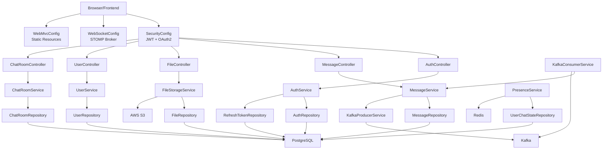

**Diagram sources**
- [SecurityConfig.java:1-120](file://src/main/java/com/chatify/chat_backend/config/SecurityConfig.java#L1-L120)
- [WebSocketConfig.java:1-111](file://src/main/java/com/chatify/chat_backend/config/WebSocketConfig.java#L1-L111)
- [WebMvcConfig.java:1-20](file://src/main/java/com/chatify/chat_backend/config/WebMvcConfig.java#L1-L20)
- [AuthController.java:1-140](file://src/main/java/com/chatify/chat_backend/controller/AuthController.java#L1-L140)
- [MessageController.java:1-95](file://src/main/java/com/chatify/chat_backend/controller/MessageController.java#L1-L95)
- [FileController.java:1-30](file://src/main/java/com/chatify/chat_backend/controller/FileController.java#L1-L30)
- [UserController.java:1-74](file://src/main/java/com/chatify/chat_backend/controller/UserController.java#L1-L74)
- [ChatRoomController.java:1-102](file://src/main/java/com/chatify/chat_backend/controller/ChatRoomController.java#L1-L102)

## Detailed Component Analysis

### Security and Authentication
- JWT-based authentication with a dedicated filter intercepting requests to validate tokens.
- OAuth2 login flow integrated with a success handler and cookie-based token exchange for secure token delivery.
- Session policy configured to IF_REQUIRED; CSRF disabled for stateless REST and STOMP.
- CORS configured centrally to allow specified origins and expose appropriate headers.

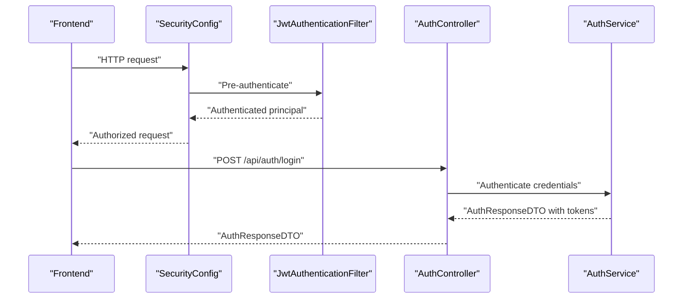

**Diagram sources**
- [SecurityConfig.java:60-90](file://src/main/java/com/chatify/chat_backend/config/SecurityConfig.java#L60-L90)
- [AuthController.java:35-53](file://src/main/java/com/chatify/chat_backend/controller/AuthController.java#L35-L53)

**Section sources**
- [SecurityConfig.java:1-120](file://src/main/java/com/chatify/chat_backend/config/SecurityConfig.java#L1-L120)
- [AuthController.java:1-140](file://src/main/java/com/chatify/chat_backend/controller/AuthController.java#L1-L140)

### WebSocket/STOMP Integration
- STOMP endpoints exposed under /ws with SockJS fallback.
- Inbound channel interceptor validates JWT from Authorization header during CONNECT frames.
- Heartbeats enabled via a dedicated task scheduler; message broker routes to /topic and /user destinations.
- Frontend subscribes to chatroom topics for messages, typing indicators, read receipts, and presence updates.

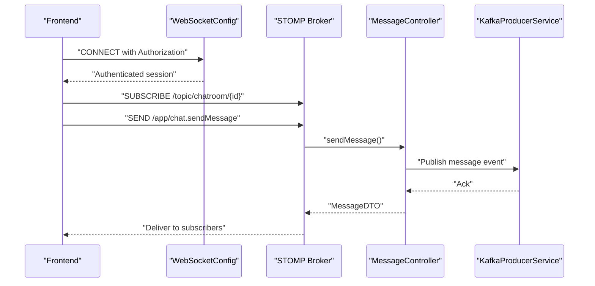

**Diagram sources**
- [WebSocketConfig.java:43-111](file://src/main/java/com/chatify/chat_backend/config/WebSocketConfig.java#L43-L111)
- [MessageController.java:32-44](file://src/main/java/com/chatify/chat_backend/controller/MessageController.java#L32-L44)

**Section sources**
- [WebSocketConfig.java:1-111](file://src/main/java/com/chatify/chat_backend/config/WebSocketConfig.java#L1-L111)
- [README.md:145-158](file://README.md#L145-L158)

### Message Delivery Pipeline and Kafka
- Messages are persisted and published to a Kafka topic for asynchronous processing.
- A consumer service listens to the topic and coordinates downstream actions (e.g., delivery receipts, analytics).
- Topic partitioning balances throughput; default partition count configured for scalability.

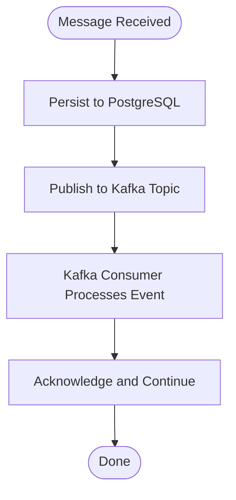

**Diagram sources**
- [KafkaTopicConfig.java:12-22](file://src/main/java/com/chatify/chat_backend/config/KafkaTopicConfig.java#L12-L22)
- [MessageController.java:39-43](file://src/main/java/com/chatify/chat_backend/controller/MessageController.java#L39-L43)

**Section sources**
- [KafkaTopicConfig.java:1-23](file://src/main/java/com/chatify/chat_backend/config/KafkaTopicConfig.java#L1-L23)
- [MessageController.java:1-95](file://src/main/java/com/chatify/chat_backend/controller/MessageController.java#L1-L95)

### File Uploads with AWS S3
- Clients request a presigned URL from the backend with file metadata.
- The backend generates a presigned PUT URL via AWS SDK and returns it to the client.
- Client uploads directly to S3; metadata stored in the database via repository.

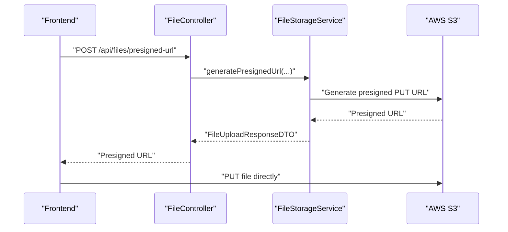

**Diagram sources**
- [FileController.java:19-29](file://src/main/java/com/chatify/chat_backend/controller/FileController.java#L19-L29)

**Section sources**
- [FileController.java:1-30](file://src/main/java/com/chatify/chat_backend/controller/FileController.java#L1-L30)
- [pom.xml:93-97](file://pom.xml#L93-L97)

### Presence Tracking with Redis
- Presence state maintained in Redis with TTL-based keys for online/offline status.
- Cache manager configured with JSON serialization for DTOs and per-cache TTL policies.
- Presence service reads/writes presence state for users.

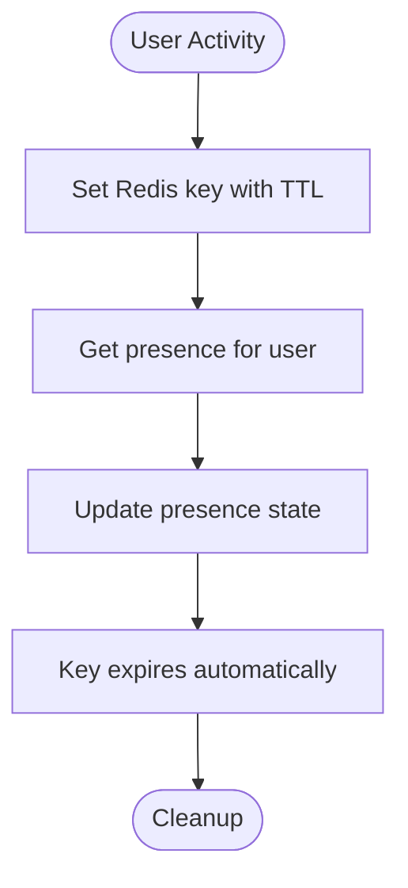

**Diagram sources**
- [RedisConfig.java:48-107](file://src/main/java/com/chatify/chat_backend/config/RedisConfig.java#L48-L107)
- [UserController.java:64-72](file://src/main/java/com/chatify/chat_backend/controller/UserController.java#L64-L72)

**Section sources**
- [RedisConfig.java:1-108](file://src/main/java/com/chatify/chat_backend/config/RedisConfig.java#L1-L108)
- [UserController.java:1-74](file://src/main/java/com/chatify/chat_backend/controller/UserController.java#L1-L74)

### REST Controllers and Responsibilities
- AuthController: Registration, login, OAuth2 token exchange, refresh, and logout.
- MessageController: Send, fetch, paginate, mark as read, and delete messages; publishes to STOMP broker.
- FileController: Generate presigned URLs for S3 uploads.
- UserController: Fetch users, current user, search, update status, presence, and online users.
- ChatRoomController: Create chat rooms, list rooms for a user, fetch room details, add/remove participants.

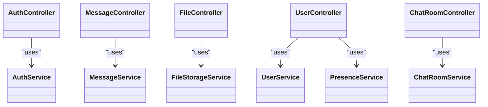

**Diagram sources**
- [AuthController.java:1-140](file://src/main/java/com/chatify/chat_backend/controller/AuthController.java#L1-L140)
- [MessageController.java:1-95](file://src/main/java/com/chatify/chat_backend/controller/MessageController.java#L1-L95)
- [FileController.java:1-30](file://src/main/java/com/chatify/chat_backend/controller/FileController.java#L1-L30)
- [UserController.java:1-74](file://src/main/java/com/chatify/chat_backend/controller/UserController.java#L1-L74)
- [ChatRoomController.java:1-102](file://src/main/java/com/chatify/chat_backend/controller/ChatRoomController.java#L1-L102)

**Section sources**
- [AuthController.java:1-140](file://src/main/java/com/chatify/chat_backend/controller/AuthController.java#L1-L140)
- [MessageController.java:1-95](file://src/main/java/com/chatify/chat_backend/controller/MessageController.java#L1-L95)
- [FileController.java:1-30](file://src/main/java/com/chatify/chat_backend/controller/FileController.java#L1-L30)
- [UserController.java:1-74](file://src/main/java/com/chatify/chat_backend/controller/UserController.java#L1-L74)
- [ChatRoomController.java:1-102](file://src/main/java/com/chatify/chat_backend/controller/ChatRoomController.java#L1-L102)

## Dependency Analysis
The backend leverages a cohesive set of Spring ecosystem dependencies and external services:
- Spring Boot starters for web, security, websockets, OAuth2 client, validation, JPA, Redis, Kafka, and cache.
- PostgreSQL for relational persistence.
- Redis for caching and presence.
- Kafka for asynchronous messaging.
- AWS SDK S3 for presigned URL generation.

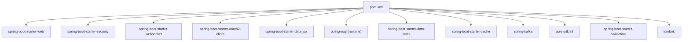

**Diagram sources**
- [pom.xml:40-154](file://pom.xml#L40-L154)

**Section sources**
- [pom.xml:1-176](file://pom.xml#L1-L176)

## Performance Considerations
- WebSocket heartbeats improve reliability; tune pool size and thread names for load characteristics.
- Redis JSON serialization avoids type erasure issues; ensure TTL alignment with presence semantics.
- Kafka topic partition count should scale with message volume; monitor lag and throughput.
- JPA pagination endpoints reduce payload sizes for message history retrieval.
- Caching reduces repeated database queries for user lookups; invalidate on profile updates.

## Troubleshooting Guide
Common issues and resolutions:
- WebSocket connection failures: Verify allowed origins, valid JWT in Authorization header, and heartbeat configuration.
- Authentication errors: Confirm token validity, secret correctness, and OAuth2 redirect cookie handling.
- CORS problems: Ensure allowed origins and exposed headers match frontend origin and headers used.
- Database connectivity: Validate credentials, schema grants, and PostgreSQL service health.
- Kafka readiness: Confirm Zookeeper and Kafka health checks pass and advertised listeners are reachable.

**Section sources**
- [SecurityConfig.java:60-90](file://src/main/java/com/chatify/chat_backend/config/SecurityConfig.java#L60-L90)
- [WebSocketConfig.java:68-111](file://src/main/java/com/chatify/chat_backend/config/WebSocketConfig.java#L68-L111)
- [README.md:189-207](file://README.md#L189-L207)

## Conclusion
Chatify’s backend applies layered architecture with clear separation of concerns, robust security via JWT and OAuth2, real-time capabilities through WebSocket/STOMP, scalable async processing with Kafka, efficient caching and presence with Redis, and secure file handling via AWS S3. The Docker Compose setup streamlines local development and deployment, while the Maven configuration centralizes dependencies and versions.

## Appendices

### Technology Stack
- Java 17, Spring Boot 3.5.5
- Spring Security (JWT, OAuth2), Spring WebSocket (STOMP), Spring Data JPA/Hibernate
- PostgreSQL, Redis, Kafka, AWS S3
- Lombok, Jackson JSON, Maven

**Section sources**
- [README.md:17-34](file://README.md#L17-L34)
- [pom.xml:22-25](file://pom.xml#L22-L25)

### Infrastructure Requirements
- PostgreSQL: Primary relational store for users, chat rooms, messages, and refresh tokens.
- Redis: Caching and presence tracking with TTL-based keys.
- Kafka: Asynchronous message pipeline for chat events.
- AWS S3: Secure file storage via presigned URLs.

**Section sources**
- [docker-compose.yml:3-137](file://docker-compose.yml#L3-L137)
- [pom.xml:63-97](file://pom.xml#L63-L97)

### System Context Diagrams

#### Real-Time Messaging and Presence
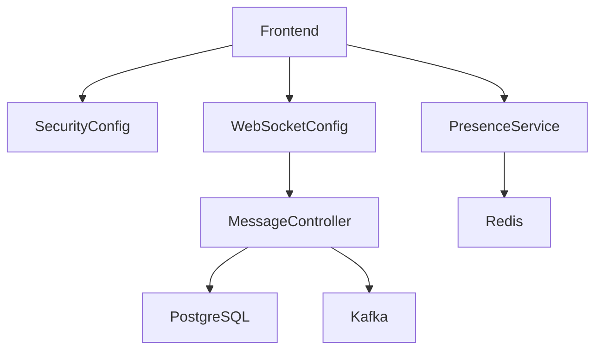

**Diagram sources**
- [WebSocketConfig.java:43-57](file://src/main/java/com/chatify/chat_backend/config/WebSocketConfig.java#L43-L57)
- [MessageController.java:32-44](file://src/main/java/com/chatify/chat_backend/controller/MessageController.java#L32-L44)
- [RedisConfig.java:68-107](file://src/main/java/com/chatify/chat_backend/config/RedisConfig.java#L68-L107)

#### User Authentication and OAuth2
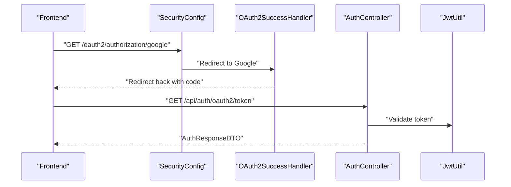

**Diagram sources**
- [SecurityConfig.java:83-88](file://src/main/java/com/chatify/chat_backend/config/SecurityConfig.java#L83-L88)
- [AuthController.java:69-107](file://src/main/java/com/chatify/chat_backend/controller/AuthController.java#L69-L107)

#### File Upload Workflow
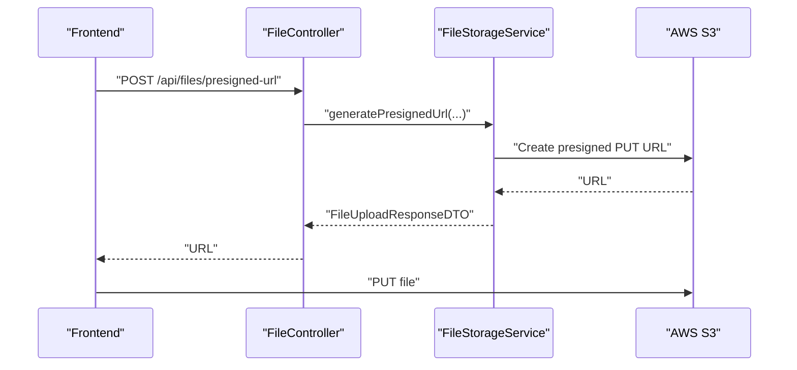

**Diagram sources**
- [FileController.java:19-29](file://src/main/java/com/chatify/chat_backend/controller/FileController.java#L19-L29)