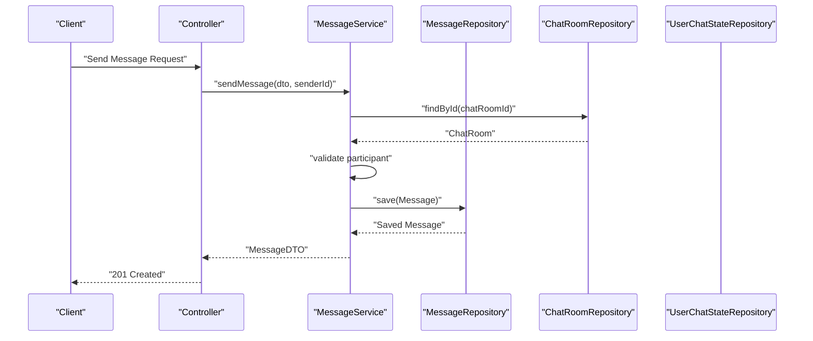
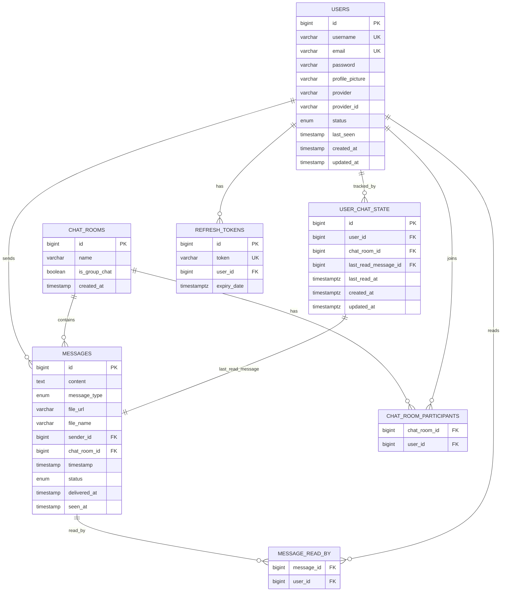
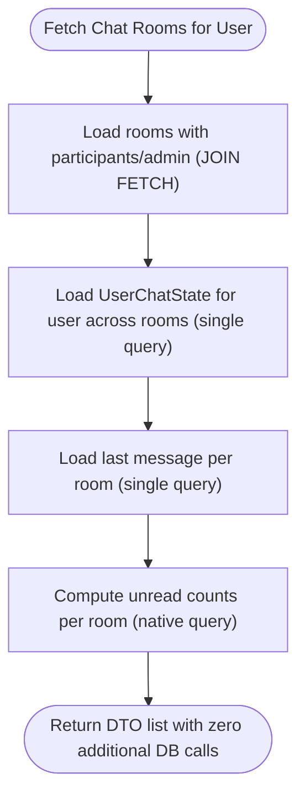
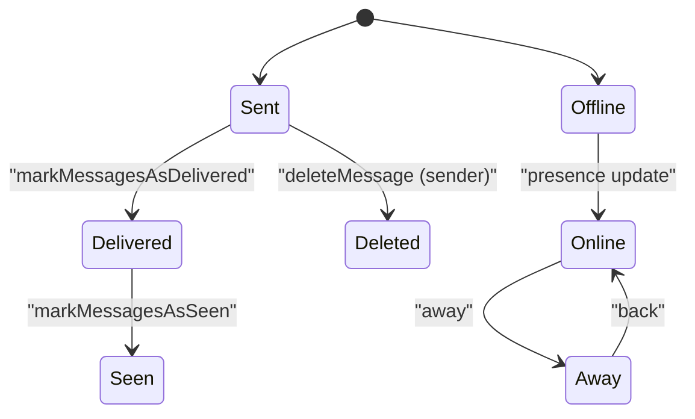
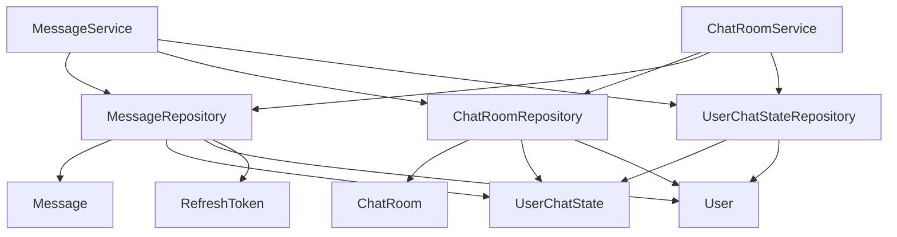

# Data Layer

<cite>
**Referenced Files in This Document**
- [User.java](file://src/main/java/com/chatify/chat_backend/entity/User.java)
- [ChatRoom.java](file://src/main/java/com/chatify/chat_backend/entity/ChatRoom.java)
- [Message.java](file://src/main/java/com/chatify/chat_backend/entity/Message.java)
- [UserChatState.java](file://src/main/java/com/chatify/chat_backend/entity/UserChatState.java)
- [RefreshToken.java](file://src/main/java/com/chatify/chat_backend/entity/RefreshToken.java)
- [MessageStatus.java](file://src/main/java/com/chatify/chat_backend/entity/enums/MessageStatus.java)
- [MessageType.java](file://src/main/java/com/chatify/chat_backend/entity/enums/MessageType.java)
- [UserStatus.java](file://src/main/java/com/chatify/chat_backend/entity/enums/UserStatus.java)
- [UserRepository.java](file://src/main/java/com/chatify/chat_backend/repository/UserRepository.java)
- [ChatRoomRepository.java](file://src/main/java/com/chatify/chat_backend/repository/ChatRoomRepository.java)
- [MessageRepository.java](file://src/main/java/com/chatify/chat_backend/repository/MessageRepository.java)
- [UserChatStateRepository.java](file://src/main/java/com/chatify/chat_backend/repository/UserChatStateRepository.java)
- [RefreshTokenRepository.java](file://src/main/java/com/chatify/chat_backend/repository/RefreshTokenRepository.java)
- [MessageService.java](file://src/main/java/com/chatify/chat_backend/service/MessageService.java)
- [ChatRoomService.java](file://src/main/java/com/chatify/chat_backend/service/ChatRoomService.java)
</cite>

## Table of Contents
1. [Introduction](#introduction)
2. [Project Structure](#project-structure)
3. [Core Components](#core-components)
4. [Architecture Overview](#architecture-overview)
5. [Detailed Component Analysis](#detailed-component-analysis)
6. [Dependency Analysis](#dependency-analysis)
7. [Performance Considerations](#performance-considerations)
8. [Troubleshooting Guide](#troubleshooting-guide)
9. [Conclusion](#conclusion)
10. [Appendices](#appendices)

## Introduction
This document provides comprehensive data model documentation for the Chatify backend focusing on JPA entities, repository patterns, and database relationships. It details the entities Message, ChatRoom, User, UserChatState, and RefreshToken, including field definitions, data types, and constraints. It also documents the enum types MessageStatus, MessageType, and UserStatus with their business meanings and usage contexts. The repository layer is explained with custom query methods, pagination support, and transaction management. Database schema diagrams illustrate table relationships, foreign key constraints, and indexing strategies. Data access patterns, query optimization techniques, and caching strategies are included, along with lifecycle management, cascading operations, entity state transitions, validation rules, business constraints, referential integrity enforcement, and examples of complex queries and performance optimizations.

## Project Structure
The data layer is organized around JPA entities under the entity package, enums under entity/enums, Spring Data JPA repositories under repository, and services under service. Controllers orchestrate requests and delegate to services, which coordinate repositories for persistence and retrieval.

```mermaid
graph TB
subgraph "Entities"
U["User"]
CR["ChatRoom"]
M["Message"]
UCS["UserChatState"]
RT["RefreshToken"]
end
subgraph "Enums"
MS["MessageStatus"]
MT["MessageType"]
US["UserStatus"]
end
subgraph "Repositories"
UR["UserRepository"]
CRR["ChatRoomRepository"]
MR["MessageRepository"]
UCSR["UserChatStateRepository"]
RTR["RefreshTokenRepository"]
end
subgraph "Services"
MSvc["MessageService"]
CRSvc["ChatRoomService"]
end
U --> RT
U <- --> CR
U <- --> M
CR <- --> M
U <- --> UCS
CR <- --> UCS
M --> UCS
MS --> M
MT --> M
US --> U
MSvc --> MR
MSvc --> CRR
MSvc --> UCSR
CRSvc --> CRR
CRSvc --> MR
CRSvc --> UCSR
```

**Diagram sources**
- [User.java:11-56](file://src/main/java/com/chatify/chat_backend/entity/User.java#L11-L56)
- [ChatRoom.java:11-45](file://src/main/java/com/chatify/chat_backend/entity/ChatRoom.java#L11-L45)
- [Message.java:13-69](file://src/main/java/com/chatify/chat_backend/entity/Message.java#L13-L69)
- [UserChatState.java:14-65](file://src/main/java/com/chatify/chat_backend/entity/UserChatState.java#L14-L65)
- [RefreshToken.java:10-31](file://src/main/java/com/chatify/chat_backend/entity/RefreshToken.java#L10-L31)
- [MessageStatus.java:3-7](file://src/main/java/com/chatify/chat_backend/entity/enums/MessageStatus.java#L3-L7)
- [MessageType.java:3-7](file://src/main/java/com/chatify/chat_backend/entity/enums/MessageType.java#L3-L7)
- [UserStatus.java:3-7](file://src/main/java/com/chatify/chat_backend/entity/enums/UserStatus.java#L3-L7)
- [UserRepository.java:13-31](file://src/main/java/com/chatify/chat_backend/repository/UserRepository.java#L13-L31)
- [ChatRoomRepository.java:13-51](file://src/main/java/com/chatify/chat_backend/repository/ChatRoomRepository.java#L13-L51)
- [MessageRepository.java:17-111](file://src/main/java/com/chatify/chat_backend/repository/MessageRepository.java#L17-L111)
- [UserChatStateRepository.java:11-25](file://src/main/java/com/chatify/chat_backend/repository/UserChatStateRepository.java#L11-L25)
- [RefreshTokenRepository.java:10-20](file://src/main/java/com/chatify/chat_backend/repository/RefreshTokenRepository.java#L10-L20)
- [MessageService.java:29-286](file://src/main/java/com/chatify/chat_backend/service/MessageService.java#L29-L286)
- [ChatRoomService.java:25-340](file://src/main/java/com/chatify/chat_backend/service/ChatRoomService.java#L25-L340)

**Section sources**
- [User.java:11-56](file://src/main/java/com/chatify/chat_backend/entity/User.java#L11-L56)
- [ChatRoom.java:11-45](file://src/main/java/com/chatify/chat_backend/entity/ChatRoom.java#L11-L45)
- [Message.java:13-69](file://src/main/java/com/chatify/chat_backend/entity/Message.java#L13-L69)
- [UserChatState.java:14-65](file://src/main/java/com/chatify/chat_backend/entity/UserChatState.java#L14-L65)
- [RefreshToken.java:10-31](file://src/main/java/com/chatify/chat_backend/entity/RefreshToken.java#L10-L31)
- [MessageStatus.java:3-7](file://src/main/java/com/chatify/chat_backend/entity/enums/MessageStatus.java#L3-L7)
- [MessageType.java:3-7](file://src/main/java/com/chatify/chat_backend/entity/enums/MessageType.java#L3-L7)
- [UserStatus.java:3-7](file://src/main/java/com/chatify/chat_backend/entity/enums/UserStatus.java#L3-L7)
- [UserRepository.java:13-31](file://src/main/java/com/chatify/chat_backend/repository/UserRepository.java#L13-L31)
- [ChatRoomRepository.java:13-51](file://src/main/java/com/chatify/chat_backend/repository/ChatRoomRepository.java#L13-L51)
- [MessageRepository.java:17-111](file://src/main/java/com/chatify/chat_backend/repository/MessageRepository.java#L17-L111)
- [UserChatStateRepository.java:11-25](file://src/main/java/com/chatify/chat_backend/repository/UserChatStateRepository.java#L11-L25)
- [RefreshTokenRepository.java:10-20](file://src/main/java/com/chatify/chat_backend/repository/RefreshTokenRepository.java#L10-L20)
- [MessageService.java:29-286](file://src/main/java/com/chatify/chat_backend/service/MessageService.java#L29-L286)
- [ChatRoomService.java:25-340](file://src/main/java/com/chatify/chat_backend/service/ChatRoomService.java#L25-L340)

## Core Components
This section documents the JPA entities and their relationships, enums, and repository interfaces.

- User
  - Identity: Long id (auto-generated)
  - Attributes: username (unique, not null), email (unique, not null), password (nullable), profilePicture (nullable), provider (not null, default "local"), providerId (nullable), status (not null, enum UserStatus, default OFFLINE), lastSeen (nullable), timestamps createdAt (immutable), updatedAt
  - Relationships: One-to-many with RefreshToken via user; Many-to-many with ChatRoom via participants; Many-to-one with itself via admin (via ChatRoom.admin)
  - Constraints: Unique indexes on username and email; Enum constraint enforced by persistence layer

- ChatRoom
  - Identity: Long id (auto-generated)
  - Attributes: name (nullable), isGroupChat (not null, default false), timestamps createdAt (immutable)
  - Relationships: Many-to-many with User via participants; Many-to-one with User via admin; Many-to-one with Message via chatRoom
  - Constraints: Unique participant pairings enforced via unique composite constraint in UserChatState; admin may be null for private chats

- Message
  - Identity: Long id (auto-generated)
  - Attributes: content (TEXT, not null), messageType (not null, enum MessageType, default TEXT), fileUrl (nullable), fileName (nullable), timestamps timestamp (immutable), status (not null, enum MessageStatus), deliveredAt (nullable), seenAt (nullable)
  - Relationships: Many-to-one with User via sender; Many-to-one with ChatRoom via chatRoom; Many-to-many with User via readBy
  - Constraints: Content or fileUrl must be present; status progression via service logic

- UserChatState
  - Identity: Long id (auto-generated)
  - Attributes: user_id (not null), chat_room_id (not null), last_read_message_id (nullable), last_read_at (nullable), timestamps createdAt (immutable), updatedAt (mutable)
  - Relationships: Many-to-one with User via user; Many-to-one with ChatRoom via chatRoom; Many-to-one with Message via lastReadMessage
  - Constraints: Composite unique constraint on (user_id, chat_room_id); PrePersist/PreUpdate manage createdAt/updatedAt

- RefreshToken
  - Identity: Long id (auto-generated)
  - Attributes: token (unique, not null), user_id (not null), expiryDate (not null)
  - Relationships: Many-to-one with User via user
  - Constraints: Unique index on token; onDelete cascade implied by referential integrity

- Enums
  - MessageStatus: SENT, DELIVERED, SEEN
  - MessageType: TEXT, IMAGE, VIDEO, FILE
  - UserStatus: ONLINE, OFFLINE, AWAY

- Repositories
  - UserRepository: CRUD plus findByEmail, findByUsername, existsByEmail, existsByUsername, searchUsers (LIKE on username/email), findByStatus
  - ChatRoomRepository: CRUD plus findByParticipantWithDetails (JOIN FETCH participants/admin), findByParticipant, findExistingPrivateChat (pair-wise group-by having), findChatRoomIdsByParticipantId, findByIsGroupChatTrue, existsByIdAndParticipantId, findByAdmin
  - MessageRepository: CRUD plus findByChatRoomOrderByTimestampAsc/Desc (paginated), findBySender, findUnreadMessagesByChatRoomAndUser, countUnreadMessagesByChatRoomAndUser, findMessagesToDeliver, findMessagesToMarkSeen, findTopByChatRoomOrderByTimestampDesc, countUnreadMessagesByUserChatState, countByChatRoomIdAndSenderIdNot, countByChatRoomIdAndIdGreaterThanAndSenderIdNot, findLastMessagesForRooms, findUnreadCountsForRooms (native)
  - UserChatStateRepository: CRUD plus findByUserIdAndChatRoomId, findByUserIdAndChatRoomIdIn (JOIN FETCH lastReadMessage)
  - RefreshTokenRepository: CRUD plus findByToken, deleteByUser, deleteAllByUser, findByUser

**Section sources**
- [User.java:11-56](file://src/main/java/com/chatify/chat_backend/entity/User.java#L11-L56)
- [ChatRoom.java:11-45](file://src/main/java/com/chatify/chat_backend/entity/ChatRoom.java#L11-L45)
- [Message.java:13-69](file://src/main/java/com/chatify/chat_backend/entity/Message.java#L13-L69)
- [UserChatState.java:14-65](file://src/main/java/com/chatify/chat_backend/entity/UserChatState.java#L14-L65)
- [RefreshToken.java:10-31](file://src/main/java/com/chatify/chat_backend/entity/RefreshToken.java#L10-L31)
- [MessageStatus.java:3-7](file://src/main/java/com/chatify/chat_backend/entity/enums/MessageStatus.java#L3-L7)
- [MessageType.java:3-7](file://src/main/java/com/chatify/chat_backend/entity/enums/MessageType.java#L3-L7)
- [UserStatus.java:3-7](file://src/main/java/com/chatify/chat_backend/entity/enums/UserStatus.java#L3-L7)
- [UserRepository.java:13-31](file://src/main/java/com/chatify/chat_backend/repository/UserRepository.java#L13-L31)
- [ChatRoomRepository.java:13-51](file://src/main/java/com/chatify/chat_backend/repository/ChatRoomRepository.java#L13-L51)
- [MessageRepository.java:17-111](file://src/main/java/com/chatify/chat_backend/repository/MessageRepository.java#L17-L111)
- [UserChatStateRepository.java:11-25](file://src/main/java/com/chatify/chat_backend/repository/UserChatStateRepository.java#L11-L25)
- [RefreshTokenRepository.java:10-20](file://src/main/java/com/chatify/chat_backend/repository/RefreshTokenRepository.java#L10-L20)

## Architecture Overview
The data layer follows a layered architecture:
- Entities encapsulate domain data and relationships
- Repositories provide type-safe persistence APIs and custom JPQL/native queries
- Services orchestrate business operations, enforce authorization, and manage transactions
- Controllers expose REST endpoints delegating to services



**Diagram sources**
- [MessageService.java:50-78](file://src/main/java/com/chatify/chat_backend/service/MessageService.java#L50-L78)
- [ChatRoomRepository.java:24-26](file://src/main/java/com/chatify/chat_backend/repository/ChatRoomRepository.java#L24-L26)
- [MessageRepository.java:17-18](file://src/main/java/com/chatify/chat_backend/repository/MessageRepository.java#L17-L18)

**Section sources**
- [MessageService.java:29-286](file://src/main/java/com/chatify/chat_backend/service/MessageService.java#L29-L286)
- [ChatRoomRepository.java:13-51](file://src/main/java/com/chatify/chat_backend/repository/ChatRoomRepository.java#L13-L51)
- [MessageRepository.java:17-111](file://src/main/java/com/chatify/chat_backend/repository/MessageRepository.java#L17-L111)

## Detailed Component Analysis

### Entity Model and Relationships
This section details each entity’s fields, types, and constraints, and illustrates relationships.



**Diagram sources**
- [User.java:11-56](file://src/main/java/com/chatify/chat_backend/entity/User.java#L11-L56)
- [ChatRoom.java:11-45](file://src/main/java/com/chatify/chat_backend/entity/ChatRoom.java#L11-L45)
- [Message.java:13-69](file://src/main/java/com/chatify/chat_backend/entity/Message.java#L13-L69)
- [UserChatState.java:14-65](file://src/main/java/com/chatify/chat_backend/entity/UserChatState.java#L14-L65)
- [RefreshToken.java:10-31](file://src/main/java/com/chatify/chat_backend/entity/RefreshToken.java#L10-L31)

**Section sources**
- [User.java:11-56](file://src/main/java/com/chatify/chat_backend/entity/User.java#L11-L56)
- [ChatRoom.java:11-45](file://src/main/java/com/chatify/chat_backend/entity/ChatRoom.java#L11-L45)
- [Message.java:13-69](file://src/main/java/com/chatify/chat_backend/entity/Message.java#L13-L69)
- [UserChatState.java:14-65](file://src/main/java/com/chatify/chat_backend/entity/UserChatState.java#L14-L65)
- [RefreshToken.java:10-31](file://src/main/java/com/chatify/chat_backend/entity/RefreshToken.java#L10-L31)

### Enum Types and Business Meanings
- MessageStatus: Tracks delivery/read state progression for messages
- MessageType: Distinguishes content types for rendering and processing
- UserStatus: Indicates presence state for user presence features

Usage contexts:
- MessageService updates Message.status and timestamps for delivery and read events
- ChatRoomService uses UserChatState to compute unread counts and last message metadata
- MessageRepository provides queries filtering by status for delivery/seen workflows

**Section sources**
- [MessageStatus.java:3-7](file://src/main/java/com/chatify/chat_backend/entity/enums/MessageStatus.java#L3-L7)
- [MessageType.java:3-7](file://src/main/java/com/chatify/chat_backend/entity/enums/MessageType.java#L3-L7)
- [UserStatus.java:3-7](file://src/main/java/com/chatify/chat_backend/entity/enums/UserStatus.java#L3-L7)
- [MessageService.java:194-269](file://src/main/java/com/chatify/chat_backend/service/MessageService.java#L194-L269)
- [ChatRoomService.java:85-94](file://src/main/java/com/chatify/chat_backend/service/ChatRoomService.java#L85-L94)

### Repository Layer Implementation
- Pagination: MessageRepository exposes Page<Message> findByChatRoomOrderByTimestampDesc for efficient scrolling
- Custom queries:
  - MessageRepository: findUnreadMessagesByChatRoomAndUser, countUnreadMessagesByChatRoomAndUser, findMessagesToDeliver, findMessagesToMarkSeen, findTopByChatRoomOrderByTimestampDesc, countUnreadMessagesByUserChatState, findLastMessagesForRooms, findUnreadCountsForRooms (native)
  - ChatRoomRepository: findByParticipantWithDetails (JOIN FETCH), findExistingPrivateChat (pair-wise), findChatRoomIdsByParticipantId, existsByIdAndParticipantId
  - UserChatStateRepository: findByUserIdAndChatRoomIdIn (JOIN FETCH lastReadMessage)
  - UserRepository: searchUsers (LIKE), findByStatus
  - RefreshTokenRepository: deleteByUser, deleteAllByUser
- Transaction management: Services annotated with @Transactional for write operations and read-only for reads

**Section sources**
- [MessageRepository.java:17-111](file://src/main/java/com/chatify/chat_backend/repository/MessageRepository.java#L17-L111)
- [ChatRoomRepository.java:13-51](file://src/main/java/com/chatify/chat_backend/repository/ChatRoomRepository.java#L13-L51)
- [UserChatStateRepository.java:11-25](file://src/main/java/com/chatify/chat_backend/repository/UserChatStateRepository.java#L11-L25)
- [UserRepository.java:13-31](file://src/main/java/com/chatify/chat_backend/repository/UserRepository.java#L13-L31)
- [RefreshTokenRepository.java:10-20](file://src/main/java/com/chatify/chat_backend/repository/RefreshTokenRepository.java#L10-L20)
- [MessageService.java:50-78](file://src/main/java/com/chatify/chat_backend/service/MessageService.java#L50-L78)
- [ChatRoomService.java:50-100](file://src/main/java/com/chatify/chat_backend/service/ChatRoomService.java#L50-L100)

### Data Access Patterns and Query Optimization
- N+1 prevention: ChatRoomRepository uses JOIN FETCH to eagerly load participants and admin in a single query
- Batch reads: MessageRepository.findLastMessagesForRooms and MessageRepository.findUnreadCountsForRooms reduce round-trips
- Efficient unread computation: Native query in MessageRepository finds unread counts per room with a single pass
- Lazy loading avoidance: JOIN FETCH in UserChatStateRepository for lastReadMessage
- Pagination: MessageRepository paginates history queries to avoid large result sets



**Diagram sources**
- [ChatRoomRepository.java:16-22](file://src/main/java/com/chatify/chat_backend/repository/ChatRoomRepository.java#L16-L22)
- [MessageRepository.java:84-94](file://src/main/java/com/chatify/chat_backend/repository/MessageRepository.java#L84-L94)
- [MessageRepository.java:97-111](file://src/main/java/com/chatify/chat_backend/repository/MessageRepository.java#L97-L111)
- [UserChatStateRepository.java:15-24](file://src/main/java/com/chatify/chat_backend/repository/UserChatStateRepository.java#L15-L24)

**Section sources**
- [ChatRoomRepository.java:16-22](file://src/main/java/com/chatify/chat_backend/repository/ChatRoomRepository.java#L16-L22)
- [MessageRepository.java:84-111](file://src/main/java/com/chatify/chat_backend/repository/MessageRepository.java#L84-L111)
- [UserChatStateRepository.java:15-24](file://src/main/java/com/chatify/chat_backend/repository/UserChatStateRepository.java#L15-L24)
- [ChatRoomService.java:50-100](file://src/main/java/com/chatify/chat_backend/service/ChatRoomService.java#L50-L100)

### Data Lifecycle Management and State Transitions
- Message lifecycle:
  - Creation: MessageService creates with status SENT
  - Delivery: MessageService.markMessagesAsDelivered updates status to DELIVERED and sets deliveredAt
  - Seen: MessageService.markMessagesAsSeen updates status to SEEN, sets seenAt, and adds recipient to readBy
  - Deletion: Only sender can delete; MessageService.deleteMessage enforces ownership
- UserChatState lifecycle:
  - Created implicitly when marking messages as read; updated with lastReadMessage and lastReadAt
  - Used to compute unread counts efficiently
- User presence:
  - User.status managed via presence service; affects visibility and notifications



**Diagram sources**
- [MessageService.java:194-269](file://src/main/java/com/chatify/chat_backend/service/MessageService.java#L194-L269)
- [MessageService.java:182-191](file://src/main/java/com/chatify/chat_backend/service/MessageService.java#L182-L191)
- [UserChatState.java:52-62](file://src/main/java/com/chatify/chat_backend/entity/UserChatState.java#L52-L62)

**Section sources**
- [MessageService.java:50-78](file://src/main/java/com/chatify/chat_backend/service/MessageService.java#L50-L78)
- [MessageService.java:194-269](file://src/main/java/com/chatify/chat_backend/service/MessageService.java#L194-L269)
- [MessageService.java:182-191](file://src/main/java/com/chatify/chat_backend/service/MessageService.java#L182-L191)
- [UserChatState.java:52-62](file://src/main/java/com/chatify/chat_backend/entity/UserChatState.java#L52-L62)

### Validation Rules, Business Constraints, and Referential Integrity
- Message validation:
  - Must have either content or fileUrl/file_name
  - Sender must be a participant of the chat room
- ChatRoom constraints:
  - Private chat must have exactly one other participant
  - Group chat must have at least one participant (excluding admin)
  - Admin can add/remove participants in group chats
- User constraints:
  - Unique username and email enforced at DB level
  - Provider/providerId support for OAuth
- Foreign keys:
  - Messages.sender_id, Messages.chat_room_id, Messages.readBy, UserChatState.user_id, UserChatState.chat_room_id, UserChatState.last_read_message_id, RefreshTokens.user_id
- Indexing strategies:
  - Unique indexes on users(username), users(email), refresh_tokens(token)
  - Composite unique index on user_chat_state(user_id, chat_room_id)
  - Implicit indexes on foreign keys for joins and lookups

**Section sources**
- [MessageService.java:50-78](file://src/main/java/com/chatify/chat_backend/service/MessageService.java#L50-L78)
- [ChatRoomService.java:110-156](file://src/main/java/com/chatify/chat_backend/service/ChatRoomService.java#L110-L156)
- [User.java:25-29](file://src/main/java/com/chatify/chat_backend/entity/User.java#L25-L29)
- [RefreshToken.java:20-21](file://src/main/java/com/chatify/chat_backend/entity/RefreshToken.java#L20-L21)
- [UserChatState.java:17-19](file://src/main/java/com/chatify/chat_backend/entity/UserChatState.java#L17-L19)

### Examples of Complex Queries and Bulk Operations
- Find rooms for a user with eager-loaded details and compute unread counts in minimal queries
  - See ChatRoomService.getChatRoomsForUser
- Compute unread counts per room using a single native query with conditional aggregation
  - See MessageRepository.findUnreadCountsForRooms
- Mark all messages as read for a user in a chat room and update UserChatState
  - See MessageService.markAllMessagesAsRead and ChatRoomService.markChatAsRead
- Deliver and mark seen workflows using filtered queries by status and last message ID
  - See MessageService.markMessagesAsDelivered and MessageService.markMessagesAsSeen

**Section sources**
- [ChatRoomService.java:50-100](file://src/main/java/com/chatify/chat_backend/service/ChatRoomService.java#L50-L100)
- [MessageRepository.java:97-111](file://src/main/java/com/chatify/chat_backend/repository/MessageRepository.java#L97-L111)
- [MessageService.java:131-179](file://src/main/java/com/chatify/chat_backend/service/MessageService.java#L131-L179)
- [MessageService.java:194-269](file://src/main/java/com/chatify/chat_backend/service/MessageService.java#L194-L269)

## Dependency Analysis
This section maps dependencies among repositories and services to understand coupling and cohesion.



**Diagram sources**
- [MessageService.java:32-47](file://src/main/java/com/chatify/chat_backend/service/MessageService.java#L32-L47)
- [ChatRoomService.java:28-45](file://src/main/java/com/chatify/chat_backend/service/ChatRoomService.java#L28-L45)
- [MessageRepository.java:17-111](file://src/main/java/com/chatify/chat_backend/repository/MessageRepository.java#L17-L111)
- [ChatRoomRepository.java:13-51](file://src/main/java/com/chatify/chat_backend/repository/ChatRoomRepository.java#L13-L51)
- [UserChatStateRepository.java:11-25](file://src/main/java/com/chatify/chat_backend/repository/UserChatStateRepository.java#L11-L25)

**Section sources**
- [MessageService.java:29-286](file://src/main/java/com/chatify/chat_backend/service/MessageService.java#L29-L286)
- [ChatRoomService.java:25-340](file://src/main/java/com/chatify/chat_backend/service/ChatRoomService.java#L25-L340)

## Performance Considerations
- Minimize N+1 queries using JOIN FETCH for associations
- Use batch queries for last messages and unread counts
- Prefer native queries for complex aggregations when JPQL is inefficient
- Apply pagination for message history to limit memory footprint
- Keep UserChatState updated to avoid expensive recomputation of unread counts
- Use unique constraints and indexes to speed up lookups and prevent duplicates

[No sources needed since this section provides general guidance]

## Troubleshooting Guide
Common issues and resolutions:
- Unauthorized access to chat rooms: Ensure user membership check before operations
  - See MessageService and ChatRoomService participant checks
- Missing participants in room details: Use JOIN FETCH queries to avoid lazy loading overhead
  - See ChatRoomRepository.findByParticipantWithDetails
- Incorrect unread counts: Verify UserChatState lastReadMessage and lastReadAt alignment with message IDs
  - See MessageService.markAllMessagesAsRead and MessageRepository.findUnreadCountsForRooms
- Duplicate private chat creation: Use findExistingPrivateChat to reuse existing room
  - See ChatRoomRepository.findExistingPrivateChat
- Refresh token cleanup: Use deleteByUser/deleteAllByUser to invalidate sessions
  - See RefreshTokenRepository

**Section sources**
- [MessageService.java:80-95](file://src/main/java/com/chatify/chat_backend/service/MessageService.java#L80-L95)
- [ChatRoomRepository.java:16-22](file://src/main/java/com/chatify/chat_backend/repository/ChatRoomRepository.java#L16-L22)
- [MessageRepository.java:97-111](file://src/main/java/com/chatify/chat_backend/repository/MessageRepository.java#L97-L111)
- [ChatRoomRepository.java:28-39](file://src/main/java/com/chatify/chat_backend/repository/ChatRoomRepository.java#L28-L39)
- [RefreshTokenRepository.java:12-18](file://src/main/java/com/chatify/chat_backend/repository/RefreshTokenRepository.java#L12-L18)

## Conclusion
The Chatify data layer employs a robust JPA-based design with carefully crafted entities, enums, and repositories. It emphasizes performance through JOIN FETCH, batch queries, and native SQL where beneficial, while enforcing business rules and referential integrity at the persistence boundary. Services encapsulate transactional workflows, ensuring consistent state transitions for messages, user presence, and chat room participation. The documented patterns provide a foundation for scalable enhancements and maintenance.

[No sources needed since this section summarizes without analyzing specific files]

## Appendices

### Appendix A: Field Reference Summary
- User: id, username, email, password, profilePicture, provider, providerId, status, lastSeen, createdAt, updatedAt
- ChatRoom: id, name, isGroupChat, createdAt
- Message: id, content, messageType, fileUrl, fileName, sender_id, chat_room_id, timestamp, status, deliveredAt, seenAt
- UserChatState: id, user_id, chat_room_id, last_read_message_id, last_read_at, createdAt, updatedAt
- RefreshToken: id, token, user_id, expiryDate

**Section sources**
- [User.java:11-56](file://src/main/java/com/chatify/chat_backend/entity/User.java#L11-L56)
- [ChatRoom.java:11-45](file://src/main/java/com/chatify/chat_backend/entity/ChatRoom.java#L11-L45)
- [Message.java:13-69](file://src/main/java/com/chatify/chat_backend/entity/Message.java#L13-L69)
- [UserChatState.java:14-65](file://src/main/java/com/chatify/chat_backend/entity/UserChatState.java#L14-L65)
- [RefreshToken.java:10-31](file://src/main/java/com/chatify/chat_backend/entity/RefreshToken.java#L10-L31)