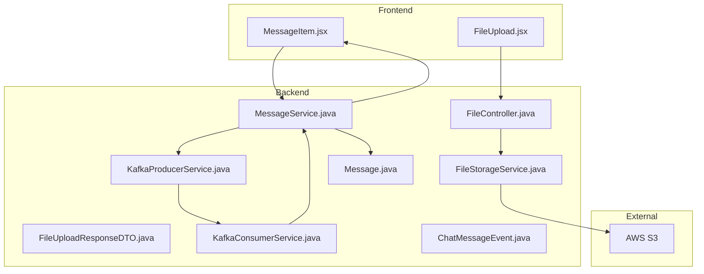
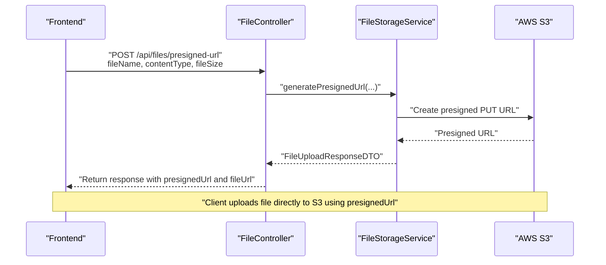
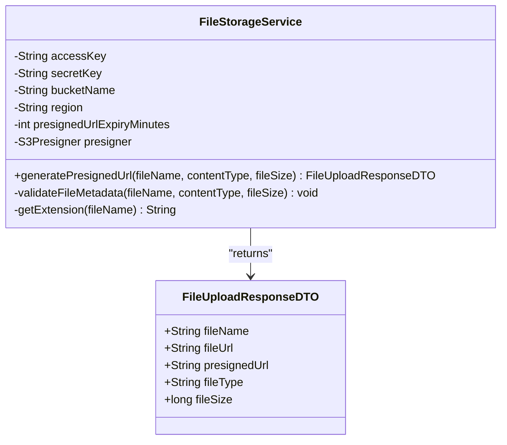
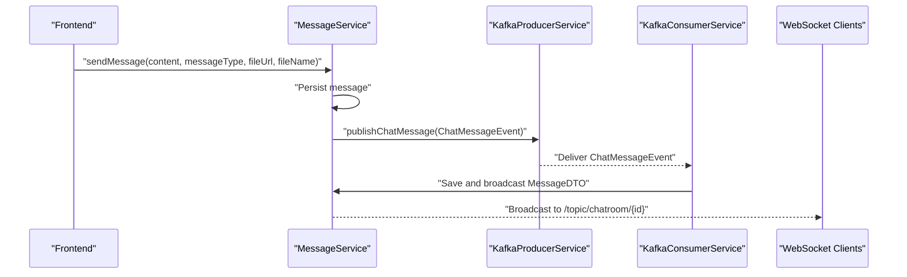
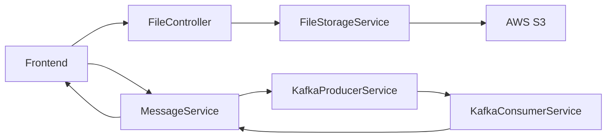
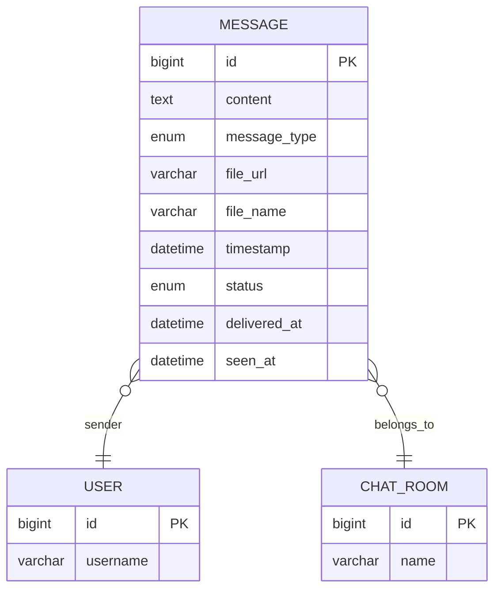

# File Storage Integration

<cite>
**Referenced Files in This Document**
- [FileStorageService.java](file://src/main/java/com/chatify/chat_backend/service/FileStorageService.java)
- [FileController.java](file://src/main/java/com/chatify/chat_backend/controller/FileController.java)
- [FileUploadResponseDTO.java](file://src/main/java/com/chatify/chat_backend/dto/FileUploadResponseDTO.java)
- [application.properties](file://src/main/resources/application.properties)
- [FileUpload.jsx](file://chatify-frontend/src/components/Chat/FileUpload.jsx)
- [MessageItem.jsx](file://chatify-frontend/src/components/Chat/MessageItem.jsx)
- [MessageService.java](file://src/main/java/com/chatify/chat_backend/service/MessageService.java)
- [ChatMessageEvent.java](file://src/main/java/com/chatify/chat_backend/dto/ChatMessageEvent.java)
- [Message.java](file://src/main/java/com/chatify/chat_backend/entity/Message.java)
- [KafkaProducerService.java](file://src/main/java/com/chatify/chat_backend/service/KafkaProducerService.java)
- [KafkaConsumerService.java](file://src/main/java/com/chatify/chat_backend/service/KafkaConsumerService.java)
</cite>

## Table of Contents
1. [Introduction](#introduction)
2. [Project Structure](#project-structure)
3. [Core Components](#core-components)
4. [Architecture Overview](#architecture-overview)
5. [Detailed Component Analysis](#detailed-component-analysis)
6. [Dependency Analysis](#dependency-analysis)
7. [Performance Considerations](#performance-considerations)
8. [Troubleshooting Guide](#troubleshooting-guide)
9. [Conclusion](#conclusion)
10. [Appendices](#appendices)

## Introduction
This document explains the file storage integration with AWS S3, focusing on configuration, upload processing, and URL generation. It covers the backend FileStorageService and FileController, the upload response DTO, validation rules, and the end-to-end workflow for uploading files and sharing them in chat messages. It also documents the integration with the message processing system using Kafka and WebSocket broadcasting, along with security considerations, error handling, performance optimization, and operational guidelines.

## Project Structure
The file storage feature spans backend services and frontend components:
- Backend Java services and controllers handle S3 configuration, presigned URL generation, and message persistence.
- Frontend components manage file selection and rendering of shared files.
- Kafka and WebSocket orchestrate message delivery after file uploads.

**Diagram sources**
- [FileController.java:19-29](file://src/main/java/com/chatify/chat_backend/controller/FileController.java#L19-L29)
- [FileStorageService.java:73-98](file://src/main/java/com/chatify/chat_backend/service/FileStorageService.java#L73-L98)
- [FileUploadResponseDTO.java:10-16](file://src/main/java/com/chatify/chat_backend/dto/FileUploadResponseDTO.java#L10-L16)
- [MessageService.java:51-78](file://src/main/java/com/chatify/chat_backend/service/MessageService.java#L51-L78)
- [KafkaProducerService.java:32-49](file://src/main/java/com/chatify/chat_backend/service/KafkaProducerService.java#L32-L49)
- [KafkaConsumerService.java:38-69](file://src/main/java/com/chatify/chat_backend/service/KafkaConsumerService.java#L38-L69)
- [ChatMessageEvent.java:16-25](file://src/main/java/com/chatify/chat_backend/dto/ChatMessageEvent.java#L16-L25)
- [Message.java:19-68](file://src/main/java/com/chatify/chat_backend/entity/Message.java#L19-L68)

**Section sources**
- [FileController.java:19-29](file://src/main/java/com/chatify/chat_backend/controller/FileController.java#L19-L29)
- [FileStorageService.java:64-71](file://src/main/java/com/chatify/chat_backend/service/FileStorageService.java#L64-L71)
- [application.properties:46-51](file://src/main/resources/application.properties#L46-L51)

## Core Components
- FileStorageService: Configures AWS S3 credentials and region, validates file metadata, generates a presigned PUT URL, and constructs the final S3 URL for retrieval.
- FileController: Exposes a REST endpoint to request a presigned URL for direct S3 upload.
- FileUploadResponseDTO: Encapsulates the response returned to clients with both the presigned URL and the final file URL.
- MessageService: Persists messages containing file URLs and coordinates downstream processing.
- KafkaProducerService and KafkaConsumerService: Publish and consume chat message events to persist and broadcast messages.
- Frontend components: Allow selecting files and render shared files in chat.

**Section sources**
- [FileStorageService.java:23-36](file://src/main/java/com/chatify/chat_backend/service/FileStorageService.java#L23-L36)
- [FileController.java:20-29](file://src/main/java/com/chatify/chat_backend/controller/FileController.java#L20-L29)
- [FileUploadResponseDTO.java:10-16](file://src/main/java/com/chatify/chat_backend/dto/FileUploadResponseDTO.java#L10-L16)
- [MessageService.java:51-78](file://src/main/java/com/chatify/chat_backend/service/MessageService.java#L51-L78)
- [KafkaProducerService.java:32-49](file://src/main/java/com/chatify/chat_backend/service/KafkaProducerService.java#L32-L49)
- [KafkaConsumerService.java:38-69](file://src/main/java/com/chatify/chat_backend/service/KafkaConsumerService.java#L38-L69)

## Architecture Overview
The file upload workflow leverages AWS S3 presigned URLs to enable direct uploads from the browser to S3, reducing server bandwidth and latency. After successful upload, the client sends the final file URL to the backend, which persists the message and publishes a Kafka event. Consumers then save the message and broadcast it to WebSocket subscribers.

**Diagram sources**
- [FileController.java:20-29](file://src/main/java/com/chatify/chat_backend/controller/FileController.java#L20-L29)
- [FileStorageService.java:73-98](file://src/main/java/com/chatify/chat_backend/service/FileStorageService.java#L73-L98)

## Detailed Component Analysis

### FileStorageService
Responsibilities:
- Load AWS S3 configuration from environment variables.
- Initialize an S3 presigner with static credentials and region.
- Validate file metadata (name, type, size, extension).
- Generate a presigned PUT URL for direct upload and construct the final S3 URL for message storage.

Key behaviors:
- Supported content types and sizes are enforced via a validation method.
- File names are sanitized against path traversal patterns.
- Final file URL is constructed using bucket name, region, and S3 key.

**Diagram sources**
- [FileStorageService.java:21-142](file://src/main/java/com/chatify/chat_backend/service/FileStorageService.java#L21-L142)
- [FileUploadResponseDTO.java:10-16](file://src/main/java/com/chatify/chat_backend/dto/FileUploadResponseDTO.java#L10-L16)

**Section sources**
- [FileStorageService.java:23-36](file://src/main/java/com/chatify/chat_backend/service/FileStorageService.java#L23-L36)
- [FileStorageService.java:64-71](file://src/main/java/com/chatify/chat_backend/service/FileStorageService.java#L64-L71)
- [FileStorageService.java:73-98](file://src/main/java/com/chatify/chat_backend/service/FileStorageService.java#L73-L98)
- [FileStorageService.java:100-130](file://src/main/java/com/chatify/chat_backend/service/FileStorageService.java#L100-L130)
- [FileStorageService.java:132-141](file://src/main/java/com/chatify/chat_backend/service/FileStorageService.java#L132-L141)

### FileController
REST endpoint:
- POST /api/files/presigned-url accepts fileName, contentType, fileSize, and Authentication.
- Delegates to FileStorageService to generate a presigned URL and returns FileUploadResponseDTO.

Security:
- Authentication is injected into the handler, ensuring only authenticated users can request presigned URLs.

**Section sources**
- [FileController.java:19-29](file://src/main/java/com/chatify/chat_backend/controller/FileController.java#L19-L29)

### FileUploadResponseDTO
Structure:
- fileName: Original file name.
- fileUrl: Final S3 URL used to display or download the file.
- presignedUrl: Temporary signed URL for direct S3 PUT.
- fileType: MIME type of the file.
- fileSize: Size of the file in bytes.

Usage:
- Returned by FileController to the frontend after metadata validation.

**Section sources**
- [FileUploadResponseDTO.java:10-16](file://src/main/java/com/chatify/chat_backend/dto/FileUploadResponseDTO.java#L10-L16)

### Frontend Integration
- FileUpload.jsx: Presents a clickable file input and filters accepted file types aligned with backend validation.
- MessageItem.jsx: Renders images, videos, and generic files using the final fileUrl returned by the backend.

**Section sources**
- [FileUpload.jsx:27](file://chatify-frontend/src/components/Chat/FileUpload.jsx#L27)
- [MessageItem.jsx:51-100](file://chatify-frontend/src/components/Chat/MessageItem.jsx#L51-L100)

### Message Persistence and Delivery
MessageService:
- Validates that a message has either text content or a file attachment.
- Persists the message with fileUrl and fileName.
- Publishes a ChatMessageEvent to Kafka.

KafkaProducerService:
- Publishes ChatMessageEvent keyed by chatRoomId to preserve ordering.

KafkaConsumerService:
- Consumes ChatMessageEvent, saves via MessageService, and broadcasts via WebSocket.

**Diagram sources**
- [MessageService.java:51-78](file://src/main/java/com/chatify/chat_backend/service/MessageService.java#L51-L78)
- [ChatMessageEvent.java:16-25](file://src/main/java/com/chatify/chat_backend/dto/ChatMessageEvent.java#L16-L25)
- [KafkaProducerService.java:32-49](file://src/main/java/com/chatify/chat_backend/service/KafkaProducerService.java#L32-L49)
- [KafkaConsumerService.java:38-69](file://src/main/java/com/chatify/chat_backend/service/KafkaConsumerService.java#L38-L69)

**Section sources**
- [MessageService.java:51-78](file://src/main/java/com/chatify/chat_backend/service/MessageService.java#L51-L78)
- [KafkaProducerService.java:32-49](file://src/main/java/com/chatify/chat_backend/service/KafkaProducerService.java#L32-L49)
- [KafkaConsumerService.java:38-69](file://src/main/java/com/chatify/chat_backend/service/KafkaConsumerService.java#L38-L69)

### Validation Rules and Limits
Supported content types and maximum sizes:
- Images: up to 5 MB each (JPEG, PNG, GIF, WEBP).
- PDF: up to 10 MB.
- DOCX: up to 10 MB.
- Video: up to 50 MB (MP4, MOV, AVI).

Validation performed:
- Rejects missing or invalid file names (no path traversal).
- Rejects unsupported content types.
- Enforces size bounds per type.
- Ensures file extension matches content type.

**Section sources**
- [FileStorageService.java:40-62](file://src/main/java/com/chatify/chat_backend/service/FileStorageService.java#L40-L62)
- [FileStorageService.java:100-130](file://src/main/java/com/chatify/chat_backend/service/FileStorageService.java#L100-L130)

### URL Generation and Access
- Final file URL: Constructed using bucket name, region, and S3 key.
- Access: Public read is enabled via bucket policy for uploads/*, allowing direct access to the final file URL.
- Presigned URL: Short-lived (default 5 minutes) to authorize direct uploads.

**Section sources**
- [FileStorageService.java:77](file://src/main/java/com/chatify/chat_backend/service/FileStorageService.java#L77)
- [FileStorageService.java:95](file://src/main/java/com/chatify/chat_backend/service/FileStorageService.java#L95)
- [application.properties:51](file://src/main/resources/application.properties#L51)

## Dependency Analysis
- FileController depends on FileStorageService.
- FileStorageService depends on AWS SDK S3 presigner and configuration properties.
- MessageService depends on repositories and Kafka producer/consumer services.
- Frontend components depend on backend endpoints and render final file URLs.

**Diagram sources**
- [FileController.java:19-29](file://src/main/java/com/chatify/chat_backend/controller/FileController.java#L19-L29)
- [FileStorageService.java:73-98](file://src/main/java/com/chatify/chat_backend/service/FileStorageService.java#L73-L98)
- [MessageService.java:51-78](file://src/main/java/com/chatify/chat_backend/service/MessageService.java#L51-L78)
- [KafkaProducerService.java:32-49](file://src/main/java/com/chatify/chat_backend/service/KafkaProducerService.java#L32-L49)
- [KafkaConsumerService.java:38-69](file://src/main/java/com/chatify/chat_backend/service/KafkaConsumerService.java#L38-L69)

**Section sources**
- [FileController.java:19-29](file://src/main/java/com/chatify/chat_backend/controller/FileController.java#L19-L29)
- [FileStorageService.java:73-98](file://src/main/java/com/chatify/chat_backend/service/FileStorageService.java#L73-L98)
- [MessageService.java:51-78](file://src/main/java/com/chatify/chat_backend/service/MessageService.java#L51-L78)
- [KafkaProducerService.java:32-49](file://src/main/java/com/chatify/chat_backend/service/KafkaProducerService.java#L32-L49)
- [KafkaConsumerService.java:38-69](file://src/main/java/com/chatify/chat_backend/service/KafkaConsumerService.java#L38-L69)

## Performance Considerations
- Direct S3 uploads: Using presigned URLs avoids server egress, improving throughput and reducing latency.
- Multipart uploads: For large files exceeding typical single-part limits, implement multipart upload with pre-signed part URLs and completion on the server side.
- CDN integration: Serve files via CloudFront or S3 Transfer Acceleration for improved global latency.
- Caching: Leverage browser caching headers and immutable ETags for static assets.
- Compression: Prefer modern image formats and video codecs to reduce payload sizes.

[No sources needed since this section provides general guidance]

## Troubleshooting Guide
Common issues and resolutions:
- Invalid file type or size: Ensure contentType matches allowed types and fileSize is within the configured limit.
- Invalid file name or extension: Avoid path traversal and ensure extension matches the declared content type.
- Network errors during upload: Verify presigned URL expiry and retry with a new URL if expired.
- Access denied: Confirm bucket policy allows public reads for uploads/* and that the final file URL is publicly accessible.
- Message not appearing: Check Kafka producer/consumer connectivity and ensure ChatMessageEvent is published and consumed successfully.

**Section sources**
- [FileStorageService.java:100-130](file://src/main/java/com/chatify/chat_backend/service/FileStorageService.java#L100-L130)
- [application.properties:51](file://src/main/resources/application.properties#L51)

## Conclusion
The file storage integration leverages AWS S3 presigned URLs to enable efficient, secure, and scalable file uploads. The backend enforces strict validation and returns both a presigned URL for direct upload and a final file URL for message sharing. The message processing pipeline integrates with Kafka and WebSocket to persist and broadcast messages seamlessly. By following the outlined security and performance recommendations, the system remains robust, maintainable, and cost-effective.

[No sources needed since this section summarizes without analyzing specific files]

## Appendices

### Configuration Reference
- aws.s3.access-key: AWS access key ID.
- aws.s3.secret-key: AWS secret access key.
- aws.s3.bucket-name: Target S3 bucket.
- aws.s3.region: AWS region.
- aws.s3.presigned-url-expiry-minutes: Duration for which presigned URLs remain valid.

**Section sources**
- [application.properties:46-51](file://src/main/resources/application.properties#L46-L51)

### Data Model for Messages with Files

**Diagram sources**
- [Message.java:19-68](file://src/main/java/com/chatify/chat_backend/entity/Message.java#L19-L68)