# Message Processing System

<cite>
**Referenced Files in This Document**
- [KafkaProducerService.java](file://src/main/java/com/chatify/chat_backend/service/KafkaProducerService.java)
- [KafkaConsumerService.java](file://src/main/java/com/chatify/chat_backend/service/KafkaConsumerService.java)
- [MessageService.java](file://src/main/java/com/chatify/chat_backend/service/MessageService.java)
- [MessageController.java](file://src/main/java/com/chatify/chat_backend/controller/MessageController.java)
- [WebSocketConfig.java](file://src/main/java/com/chatify/chat_backend/config/WebSocketConfig.java)
- [WebSocketEventListener.java](file://src/main/java/com/chatify/chat_backend/listener/WebSocketEventListener.java)
- [KafkaTopicConfig.java](file://src/main/java/com/chatify/chat_backend/config/KafkaTopicConfig.java)
- [KafkaErrorHandlerConfig.java](file://src/main/java/com/chatify/chat_backend/config/KafkaErrorHandlerConfig.java)
- [MessageRepository.java](file://src/main/java/com/chatify/chat_backend/repository/MessageRepository.java)
- [Message.java](file://src/main/java/com/chatify/chat_backend/entity/Message.java)
- [MessageStatus.java](file://src/main/java/com/chatify/chat_backend/entity/enums/MessageStatus.java)
- [MessageDTO.java](file://src/main/java/com/chatify/chat_backend/dto/MessageDTO.java)
- [ChatMessageEvent.java](file://src/main/java/com/chatify/chat_backend/dto/ChatMessageEvent.java)
- [SendMessageDTO.java](file://src/main/java/com/chatify/chat_backend/dto/SendMessageDTO.java)
- [MessageDeliveryUpdateDTO.java](file://src/main/java/com/chatify/chat_backend/dto/MessageDeliveryUpdateDTO.java)
- [MessageSeenUpdateDTO.java](file://src/main/java/com/chatify/chat_backend/dto/MessageSeenUpdateDTO.java)
- [MESSAGE_DELIVERY_DESIGN.md](file://MESSAGE_DELIVERY_DESIGN.md)
</cite>

## Table of Contents
1. [Introduction](#introduction)
2. [Project Structure](#project-structure)
3. [Core Components](#core-components)
4. [Architecture Overview](#architecture-overview)
5. [Detailed Component Analysis](#detailed-component-analysis)
6. [Dependency Analysis](#dependency-analysis)
7. [Performance Considerations](#performance-considerations)
8. [Troubleshooting Guide](#troubleshooting-guide)
9. [Conclusion](#conclusion)
10. [Appendices](#appendices)

## Introduction
This document explains the message processing system built on an event-driven architecture with Kafka and WebSocket real-time updates. It covers asynchronous message publishing, consumption, business logic processing, persistence, and state management across three states: SENT, DELIVERED, and SEEN. It also documents the message DTOs, error handling, retry mechanisms, and dead letter queue processing, and demonstrates the end-to-end flow from message creation to delivery confirmation.

## Project Structure
The message processing system spans several layers:
- Controllers expose REST endpoints for message operations and broadcast WebSocket updates.
- Services encapsulate business logic for validation, persistence, and state transitions.
- Kafka producers publish events; consumers process them and broadcast via WebSocket.
- DTOs define data contracts for internal and external communication.
- Entities model persistence and state fields.
- Configuration wires Kafka topics, error handling, and WebSocket broker settings.

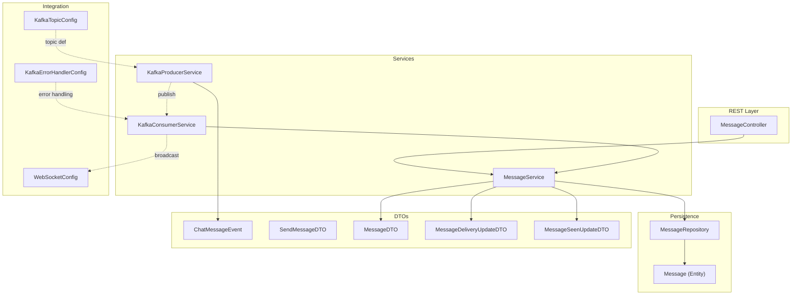

**Diagram sources**
- [MessageController.java:32-44](file://src/main/java/com/chatify/chat_backend/controller/MessageController.java#L32-L44)
- [KafkaProducerService.java:32-49](file://src/main/java/com/chatify/chat_backend/service/KafkaProducerService.java#L32-L49)
- [KafkaConsumerService.java:34-71](file://src/main/java/com/chatify/chat_backend/service/KafkaConsumerService.java#L34-L71)
- [MessageService.java:50-78](file://src/main/java/com/chatify/chat_backend/service/MessageService.java#L50-L78)
- [MessageRepository.java:18-59](file://src/main/java/com/chatify/chat_backend/repository/MessageRepository.java#L18-L59)
- [Message.java:19-68](file://src/main/java/com/chatify/chat_backend/entity/Message.java#L19-L68)
- [KafkaTopicConfig.java:12-22](file://src/main/java/com/chatify/chat_backend/config/KafkaTopicConfig.java#L12-L22)
- [KafkaErrorHandlerConfig.java:14-18](file://src/main/java/com/chatify/chat_backend/config/KafkaErrorHandlerConfig.java#L14-L18)
- [WebSocketConfig.java:51-57](file://src/main/java/com/chatify/chat_backend/config/WebSocketConfig.java#L51-L57)
- [ChatMessageEvent.java:16-25](file://src/main/java/com/chatify/chat_backend/dto/ChatMessageEvent.java#L16-L25)
- [SendMessageDTO.java:12-21](file://src/main/java/com/chatify/chat_backend/dto/SendMessageDTO.java#L12-L21)
- [MessageDTO.java:15-32](file://src/main/java/com/chatify/chat_backend/dto/MessageDTO.java#L15-L32)
- [MessageDeliveryUpdateDTO.java:8-11](file://src/main/java/com/chatify/chat_backend/dto/MessageDeliveryUpdateDTO.java#L8-L11)
- [MessageSeenUpdateDTO.java:7-11](file://src/main/java/com/chatify/chat_backend/dto/MessageSeenUpdateDTO.java#L7-L11)

**Section sources**
- [MessageController.java:16-95](file://src/main/java/com/chatify/chat_backend/controller/MessageController.java#L16-L95)
- [KafkaProducerService.java:13-50](file://src/main/java/com/chatify/chat_backend/service/KafkaProducerService.java#L13-L50)
- [KafkaConsumerService.java:12-72](file://src/main/java/com/chatify/chat_backend/service/KafkaConsumerService.java#L12-L72)
- [MessageService.java:29-286](file://src/main/java/com/chatify/chat_backend/service/MessageService.java#L29-L286)
- [KafkaTopicConfig.java:10-23](file://src/main/java/com/chatify/chat_backend/config/KafkaTopicConfig.java#L10-L23)
- [KafkaErrorHandlerConfig.java:10-19](file://src/main/java/com/chatify/chat_backend/config/KafkaErrorHandlerConfig.java#L10-L19)
- [WebSocketConfig.java:27-111](file://src/main/java/com/chatify/chat_backend/config/WebSocketConfig.java#L27-L111)
- [MessageRepository.java:17-111](file://src/main/java/com/chatify/chat_backend/repository/MessageRepository.java#L17-L111)
- [Message.java:13-69](file://src/main/java/com/chatify/chat_backend/entity/Message.java#L13-L69)
- [MessageStatus.java:3-7](file://src/main/java/com/chatify/chat_backend/entity/enums/MessageStatus.java#L3-L7)
- [MessageDTO.java:12-33](file://src/main/java/com/chatify/chat_backend/dto/MessageDTO.java#L12-L33)
- [ChatMessageEvent.java:13-25](file://src/main/java/com/chatify/chat_backend/dto/ChatMessageEvent.java#L13-L25)
- [SendMessageDTO.java:9-21](file://src/main/java/com/chatify/chat_backend/dto/SendMessageDTO.java#L9-L21)
- [MessageDeliveryUpdateDTO.java:6-12](file://src/main/java/com/chatify/chat_backend/dto/MessageDeliveryUpdateDTO.java#L6-L12)
- [MessageSeenUpdateDTO.java:6-12](file://src/main/java/com/chatify/chat_backend/dto/MessageSeenUpdateDTO.java#L6-L12)

## Core Components
- Kafka Producer Service: Asynchronously publishes ChatMessageEvent to the configured Kafka topic keyed by chat room to preserve ordering.
- Kafka Consumer Service: Consumes ChatMessageEvent, persists via MessageService, and broadcasts the saved MessageDTO to WebSocket subscribers.
- Message Service: Validates input, enforces authorization, persists messages, and manages state transitions (SENT, DELIVERED, SEEN) with batched acknowledgments.
- Message DTOs: Transfer objects for message content, status, and acknowledgment updates across layers and clients.
- WebSocket Integration: Configures STOMP broker, validates JWT on connect, and enables real-time broadcasting to chat rooms.
- Persistence: JPA repository queries support batched delivery/seen updates and unread counts.

**Section sources**
- [KafkaProducerService.java:27-49](file://src/main/java/com/chatify/chat_backend/service/KafkaProducerService.java#L27-L49)
- [KafkaConsumerService.java:26-71](file://src/main/java/com/chatify/chat_backend/service/KafkaConsumerService.java#L26-L71)
- [MessageService.java:50-269](file://src/main/java/com/chatify/chat_backend/service/MessageService.java#L50-L269)
- [MessageDTO.java:15-32](file://src/main/java/com/chatify/chat_backend/dto/MessageDTO.java#L15-L32)
- [WebSocketConfig.java:43-111](file://src/main/java/com/chatify/chat_backend/config/WebSocketConfig.java#L43-L111)
- [MessageRepository.java:36-59](file://src/main/java/com/chatify/chat_backend/repository/MessageRepository.java#L36-L59)

## Architecture Overview
The system uses an event-driven pattern:
- REST endpoints trigger message creation and immediate WebSocket broadcast.
- Kafka decouples message persistence and downstream processing.
- Consumers persist messages and broadcast via WebSocket.
- Clients send batched acknowledgments (DELIVERED, SEEN) to update server-side state.

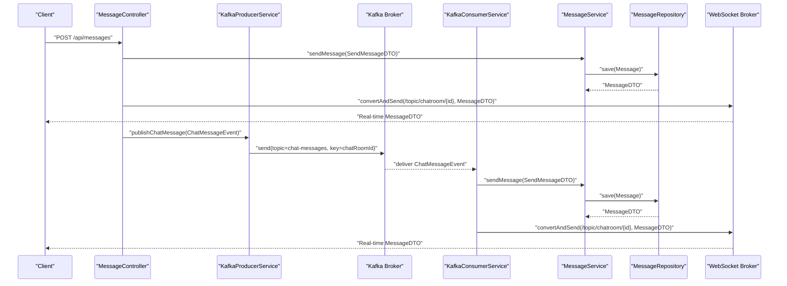

**Diagram sources**
- [MessageController.java:32-44](file://src/main/java/com/chatify/chat_backend/controller/MessageController.java#L32-L44)
- [KafkaProducerService.java:32-49](file://src/main/java/com/chatify/chat_backend/service/KafkaProducerService.java#L32-L49)
- [KafkaConsumerService.java:34-62](file://src/main/java/com/chatify/chat_backend/service/KafkaConsumerService.java#L34-L62)
- [MessageService.java:50-78](file://src/main/java/com/chatify/chat_backend/service/MessageService.java#L50-L78)
- [WebSocketConfig.java:51-57](file://src/main/java/com/chatify/chat_backend/config/WebSocketConfig.java#L51-L57)

## Detailed Component Analysis

### Kafka Producer Service
Responsibilities:
- Publish ChatMessageEvent to the Kafka topic using chatRoomId as the key to ensure in-room ordering.
- Log completion or failure asynchronously after send completes.

Key behaviors:
- Uses KafkaTemplate to send with a String key and ChatMessageEvent value.
- Logs debug info on successful send and error logs on failures.

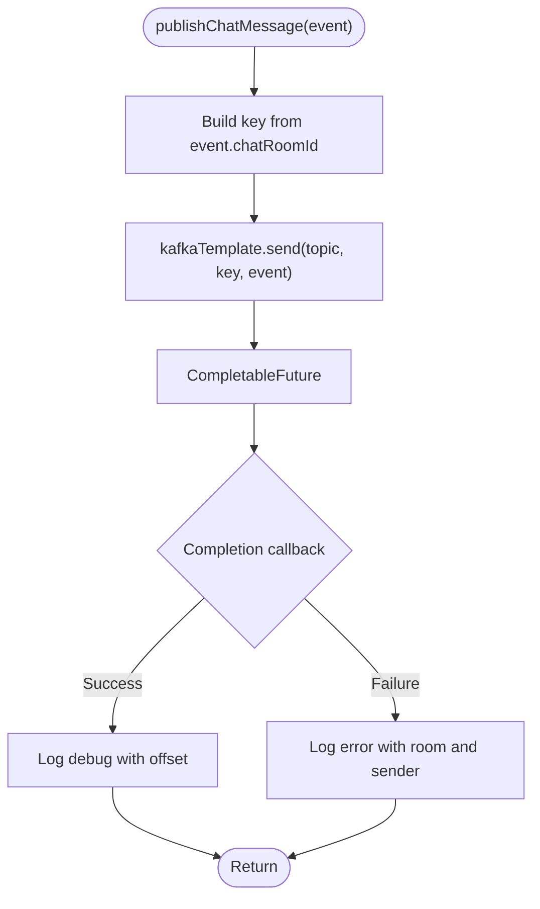

**Diagram sources**
- [KafkaProducerService.java:32-49](file://src/main/java/com/chatify/chat_backend/service/KafkaProducerService.java#L32-L49)

**Section sources**
- [KafkaProducerService.java:27-49](file://src/main/java/com/chatify/chat_backend/service/KafkaProducerService.java#L27-L49)
- [ChatMessageEvent.java:16-25](file://src/main/java/com/chatify/chat_backend/dto/ChatMessageEvent.java#L16-L25)

### Kafka Consumer Service
Responsibilities:
- Consume ChatMessageEvent from the configured topic.
- Convert to SendMessageDTO and call MessageService.sendMessage.
- Broadcast the resulting MessageDTO to WebSocket subscribers for the chat room.

Processing logic:
- Builds SendMessageDTO from ChatMessageEvent fields.
- Calls MessageService.sendMessage to persist and return MessageDTO.
- Sends MessageDTO to "/topic/chatroom/{chatRoomId}" via SimpMessageSendingOperations.
- Wraps processing in try/catch to propagate exceptions for retry handling.

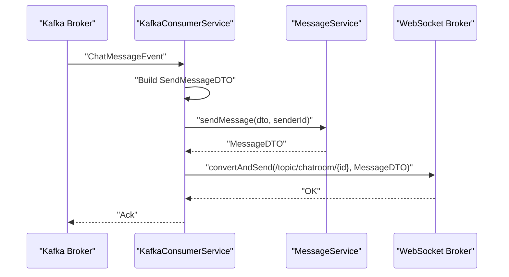

**Diagram sources**
- [KafkaConsumerService.java:34-62](file://src/main/java/com/chatify/chat_backend/service/KafkaConsumerService.java#L34-L62)
- [MessageService.java:50-78](file://src/main/java/com/chatify/chat_backend/service/MessageService.java#L50-L78)
- [WebSocketConfig.java:51-57](file://src/main/java/com/chatify/chat_backend/config/WebSocketConfig.java#L51-L57)

**Section sources**
- [KafkaConsumerService.java:26-71](file://src/main/java/com/chatify/chat_backend/service/KafkaConsumerService.java#L26-L71)
- [MessageService.java:50-78](file://src/main/java/com/chatify/chat_backend/service/MessageService.java#L50-L78)

### Message Service
Responsibilities:
- Validate message creation (content or file present).
- Enforce chat room membership for sender.
- Persist message with initial status SENT.
- Support batched delivery and seen acknowledgments with proper state transitions.
- Maintain user chat state for last read message and timestamps.

Validation and persistence:
- sendMessage validates content or file presence and checks participantship.
- Sets MessageStatus to SENT and persists the entity.

State transitions:
- markMessagesAsDelivered finds messages up to lastDeliveredMessageId, marks them DELIVERED, and sets deliveredAt.
- markMessagesAsSeen finds messages up to lastSeenMessageId, marks them SEEN, sets seenAt, and adds to readBy set.
- Both operations return DTOs indicating the acknowledged range.

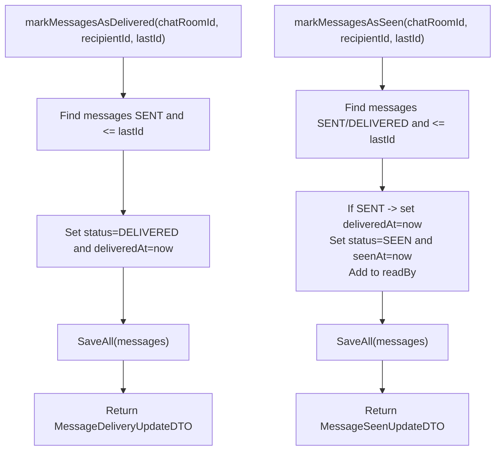

**Diagram sources**
- [MessageService.java:194-228](file://src/main/java/com/chatify/chat_backend/service/MessageService.java#L194-L228)
- [MessageService.java:231-269](file://src/main/java/com/chatify/chat_backend/service/MessageService.java#L231-L269)

**Section sources**
- [MessageService.java:50-269](file://src/main/java/com/chatify/chat_backend/service/MessageService.java#L50-L269)
- [MessageRepository.java:36-59](file://src/main/java/com/chatify/chat_backend/repository/MessageRepository.java#L36-L59)
- [MessageStatus.java:3-7](file://src/main/java/com/chatify/chat_backend/entity/enums/MessageStatus.java#L3-L7)

### Message DTOs and Data Contracts
Purpose:
- Transfer message content and metadata between layers and external APIs.
- Represent current state and read receipts for UI rendering.

Core DTOs:
- MessageDTO: Complete message representation for transport and UI.
- ChatMessageEvent: Payload published to Kafka containing minimal fields for consumer processing.
- SendMessageDTO: Request payload for message creation.
- MessageDeliveryUpdateDTO and MessageSeenUpdateDTO: Batch acknowledgment responses.

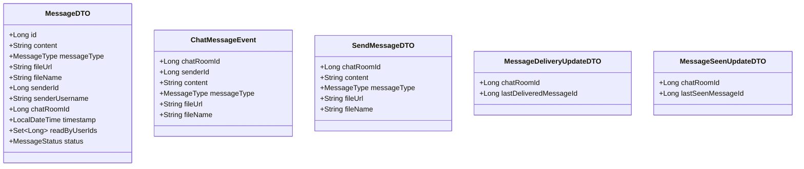

**Diagram sources**
- [MessageDTO.java:15-32](file://src/main/java/com/chatify/chat_backend/dto/MessageDTO.java#L15-L32)
- [ChatMessageEvent.java:16-25](file://src/main/java/com/chatify/chat_backend/dto/ChatMessageEvent.java#L16-L25)
- [SendMessageDTO.java:12-21](file://src/main/java/com/chatify/chat_backend/dto/SendMessageDTO.java#L12-L21)
- [MessageDeliveryUpdateDTO.java:8-11](file://src/main/java/com/chatify/chat_backend/dto/MessageDeliveryUpdateDTO.java#L8-L11)
- [MessageSeenUpdateDTO.java:7-11](file://src/main/java/com/chatify/chat_backend/dto/MessageSeenUpdateDTO.java#L7-L11)

**Section sources**
- [MessageDTO.java:15-32](file://src/main/java/com/chatify/chat_backend/dto/MessageDTO.java#L15-L32)
- [ChatMessageEvent.java:16-25](file://src/main/java/com/chatify/chat_backend/dto/ChatMessageEvent.java#L16-L25)
- [SendMessageDTO.java:12-21](file://src/main/java/com/chatify/chat_backend/dto/SendMessageDTO.java#L12-L21)
- [MessageDeliveryUpdateDTO.java:8-11](file://src/main/java/com/chatify/chat_backend/dto/MessageDeliveryUpdateDTO.java#L8-L11)
- [MessageSeenUpdateDTO.java:7-11](file://src/main/java/com/chatify/chat_backend/dto/MessageSeenUpdateDTO.java#L7-L11)

### WebSocket Integration and Real-Time Updates
WebSocketConfig:
- Registers STOMP endpoint and enables a simple broker for topics and user destinations.
- Configures heartbeats and task scheduler.
- Intercepts inbound frames to authenticate connections using JWT.

WebSocketEventListener:
- Handles session connect/disconnect events and updates presence state.

MessageController:
- Immediately broadcasts newly created messages to the chat room topic after persistence.

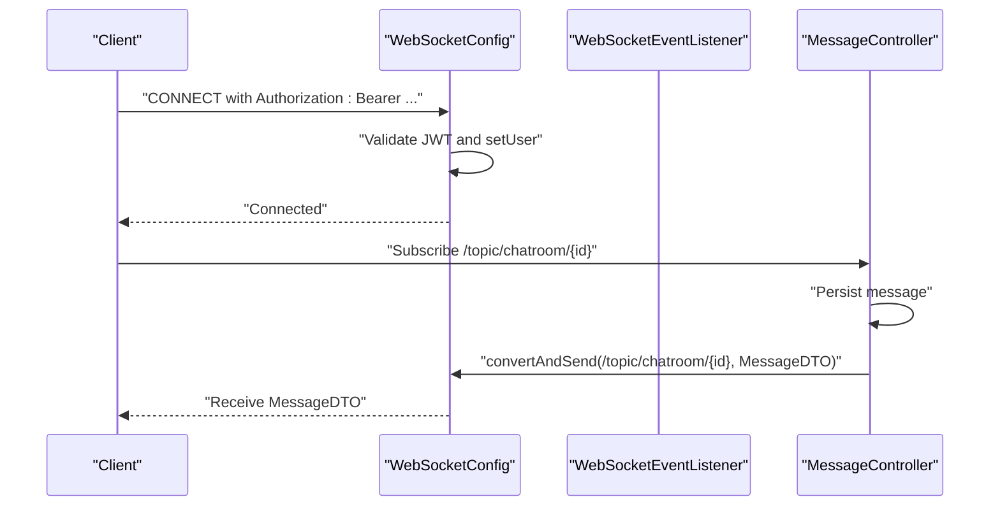

**Diagram sources**
- [WebSocketConfig.java:68-111](file://src/main/java/com/chatify/chat_backend/config/WebSocketConfig.java#L68-L111)
- [WebSocketEventListener.java:24-54](file://src/main/java/com/chatify/chat_backend/listener/WebSocketEventListener.java#L24-L54)
- [MessageController.java:32-44](file://src/main/java/com/chatify/chat_backend/controller/MessageController.java#L32-L44)

**Section sources**
- [WebSocketConfig.java:43-111](file://src/main/java/com/chatify/chat_backend/config/WebSocketConfig.java#L43-L111)
- [WebSocketEventListener.java:16-55](file://src/main/java/com/chatify/chat_backend/listener/WebSocketEventListener.java#L16-L55)
- [MessageController.java:32-44](file://src/main/java/com/chatify/chat_backend/controller/MessageController.java#L32-L44)

### Message State Machine
States and transitions:
- SENT: Persisted by the server upon creation.
- DELIVERED: Transitioned upon batched delivery acknowledgment.
- SEEN: Transitioned upon batched seen acknowledgment.

Constraints:
- Transitions are unidirectional and idempotent.
- readBy set is maintained for SEEN tracking.

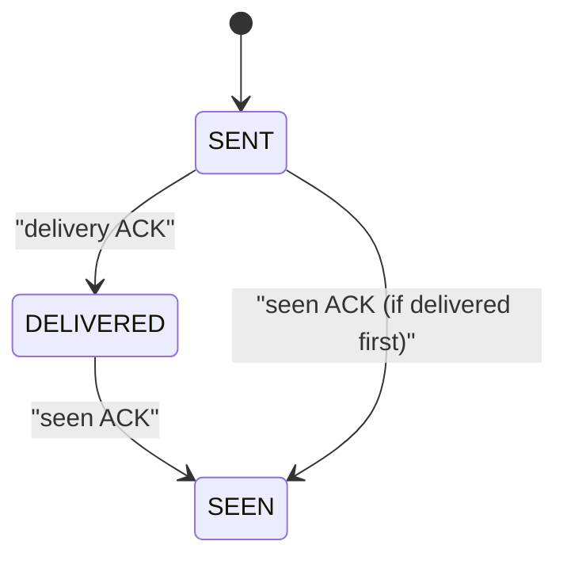

**Diagram sources**
- [MessageStatus.java:3-7](file://src/main/java/com/chatify/chat_backend/entity/enums/MessageStatus.java#L3-L7)
- [MessageService.java:194-269](file://src/main/java/com/chatify/chat_backend/service/MessageService.java#L194-L269)
- [MESSAGE_DELIVERY_DESIGN.md:29-50](file://MESSAGE_DELIVERY_DESIGN.md#L29-L50)

**Section sources**
- [MessageStatus.java:3-7](file://src/main/java/com/chatify/chat_backend/entity/enums/MessageStatus.java#L3-L7)
- [MessageService.java:194-269](file://src/main/java/com/chatify/chat_backend/service/MessageService.java#L194-L269)
- [MESSAGE_DELIVERY_DESIGN.md:29-50](file://MESSAGE_DELIVERY_DESIGN.md#L29-L50)

### Error Handling, Retry, and Dead Letter Queue
Kafka error handling:
- DefaultErrorHandler configured with FixedBackOff and DeadLetterPublishingRecoverer.
- Retries occur up to a fixed number of attempts; failures are published to a dead-letter topic.

Kafka topic configuration:
- chat-messages topic created with default partitions and replicas.

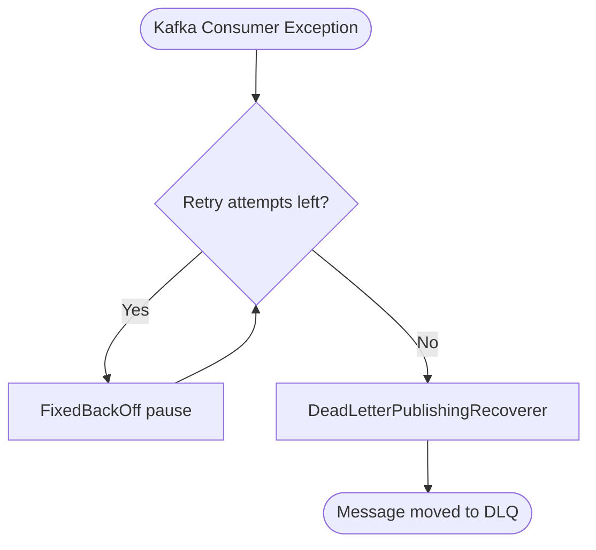

**Diagram sources**
- [KafkaErrorHandlerConfig.java:14-18](file://src/main/java/com/chatify/chat_backend/config/KafkaErrorHandlerConfig.java#L14-L18)
- [KafkaTopicConfig.java:17-22](file://src/main/java/com/chatify/chat_backend/config/KafkaTopicConfig.java#L17-L22)

**Section sources**
- [KafkaErrorHandlerConfig.java:10-19](file://src/main/java/com/chatify/chat_backend/config/KafkaErrorHandlerConfig.java#L10-L19)
- [KafkaTopicConfig.java:10-23](file://src/main/java/com/chatify/chat_backend/config/KafkaTopicConfig.java#L10-L23)

## Dependency Analysis
High-level dependencies:
- MessageController depends on MessageService and SimpMessagingTemplate for WebSocket broadcasting.
- KafkaProducerService depends on KafkaTemplate and ChatMessageEvent.
- KafkaConsumerService depends on MessageService and SimpMessageSendingOperations.
- MessageService depends on repositories and user/chat room services.
- MessageRepository defines queries supporting state transitions and unread counts.

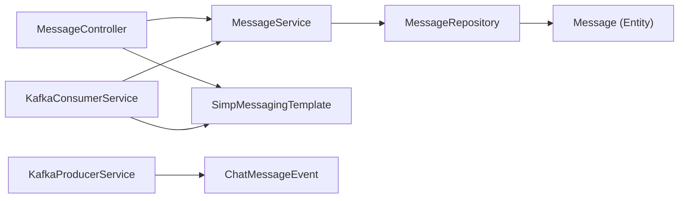

**Diagram sources**
- [MessageController.java:20-30](file://src/main/java/com/chatify/chat_backend/controller/MessageController.java#L20-L30)
- [KafkaProducerService.java:18-25](file://src/main/java/com/chatify/chat_backend/service/KafkaProducerService.java#L18-L25)
- [KafkaConsumerService.java:17-24](file://src/main/java/com/chatify/chat_backend/service/KafkaConsumerService.java#L17-L24)
- [MessageService.java:32-48](file://src/main/java/com/chatify/chat_backend/service/MessageService.java#L32-L48)
- [MessageRepository.java:17-59](file://src/main/java/com/chatify/chat_backend/repository/MessageRepository.java#L17-L59)
- [Message.java:13-69](file://src/main/java/com/chatify/chat_backend/entity/Message.java#L13-L69)

**Section sources**
- [MessageController.java:16-95](file://src/main/java/com/chatify/chat_backend/controller/MessageController.java#L16-L95)
- [KafkaProducerService.java:13-50](file://src/main/java/com/chatify/chat_backend/service/KafkaProducerService.java#L13-L50)
- [KafkaConsumerService.java:12-72](file://src/main/java/com/chatify/chat_backend/service/KafkaConsumerService.java#L12-L72)
- [MessageService.java:29-286](file://src/main/java/com/chatify/chat_backend/service/MessageService.java#L29-L286)
- [MessageRepository.java:17-111](file://src/main/java/com/chatify/chat_backend/repository/MessageRepository.java#L17-L111)
- [Message.java:13-69](file://src/main/java/com/chatify/chat_backend/entity/Message.java#L13-L69)

## Performance Considerations
- Partitioning: chat-messages topic uses multiple partitions to scale throughput; keys are chatRoomId to preserve ordering within rooms.
- Asynchronous publishing: Producer uses CompletableFuture callbacks to avoid blocking.
- Batched acknowledgments: Delivery and seen updates operate on ranges to reduce network overhead.
- WebSocket heartbeats: Heartbeat scheduling improves reliability for long-lived connections.
- Idempotent state transitions: Reduces redundant writes and supports resilience against duplicate ACKs.

[No sources needed since this section provides general guidance]

## Troubleshooting Guide
Common issues and resolutions:
- Kafka send failures: Check producer logs for error entries and verify topic configuration and broker connectivity.
- Consumer exceptions: Review logs for processing errors; ensure retry/backoff configuration and dead-letter topic routing.
- WebSocket authentication failures: Confirm Authorization header presence and JWT validity during CONNECT frames.
- State inconsistencies: Verify repository queries for delivery/seen ranges and ensure last read message updates in user chat state.

**Section sources**
- [KafkaProducerService.java:38-48](file://src/main/java/com/chatify/chat_backend/service/KafkaProducerService.java#L38-L48)
- [KafkaConsumerService.java:64-70](file://src/main/java/com/chatify/chat_backend/service/KafkaConsumerService.java#L64-L70)
- [WebSocketConfig.java:75-106](file://src/main/java/com/chatify/chat_backend/config/WebSocketConfig.java#L75-L106)
- [MessageService.java:164-178](file://src/main/java/com/chatify/chat_backend/service/MessageService.java#L164-L178)

## Conclusion
The message processing system leverages Kafka for asynchronous, scalable message ingestion and WebSocket for real-time updates. MessageService centralizes validation, persistence, and state transitions, while DTOs standardize data transfer. Robust error handling with retries and dead-letter routing ensures resilience. Together, these components deliver a reliable, event-driven chat experience.

[No sources needed since this section summarizes without analyzing specific files]

## Appendices

### End-to-End Message Flow Example
- Creation: Client posts a message; server persists and immediately broadcasts via WebSocket.
- Publishing: Server publishes ChatMessageEvent to Kafka; consumer saves and broadcasts again.
- Delivery/Seen: Client sends batched acknowledgments; server updates states and persists.

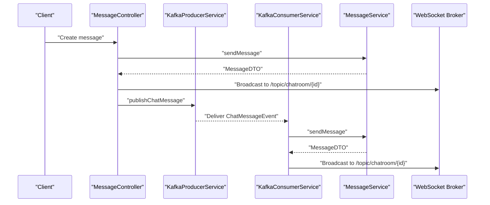

**Diagram sources**
- [MessageController.java:32-44](file://src/main/java/com/chatify/chat_backend/controller/MessageController.java#L32-L44)
- [KafkaProducerService.java:32-49](file://src/main/java/com/chatify/chat_backend/service/KafkaProducerService.java#L32-L49)
- [KafkaConsumerService.java:34-62](file://src/main/java/com/chatify/chat_backend/service/KafkaConsumerService.java#L34-L62)
- [MessageService.java:50-78](file://src/main/java/com/chatify/chat_backend/service/MessageService.java#L50-L78)
- [WebSocketConfig.java:51-57](file://src/main/java/com/chatify/chat_backend/config/WebSocketConfig.java#L51-L57)