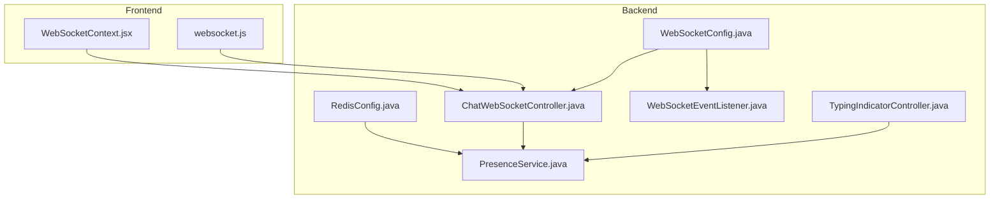
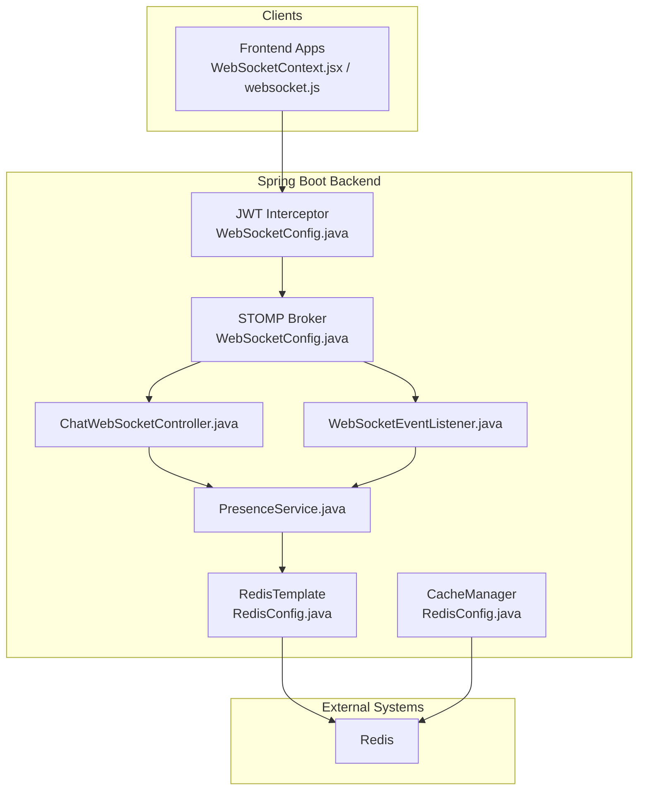
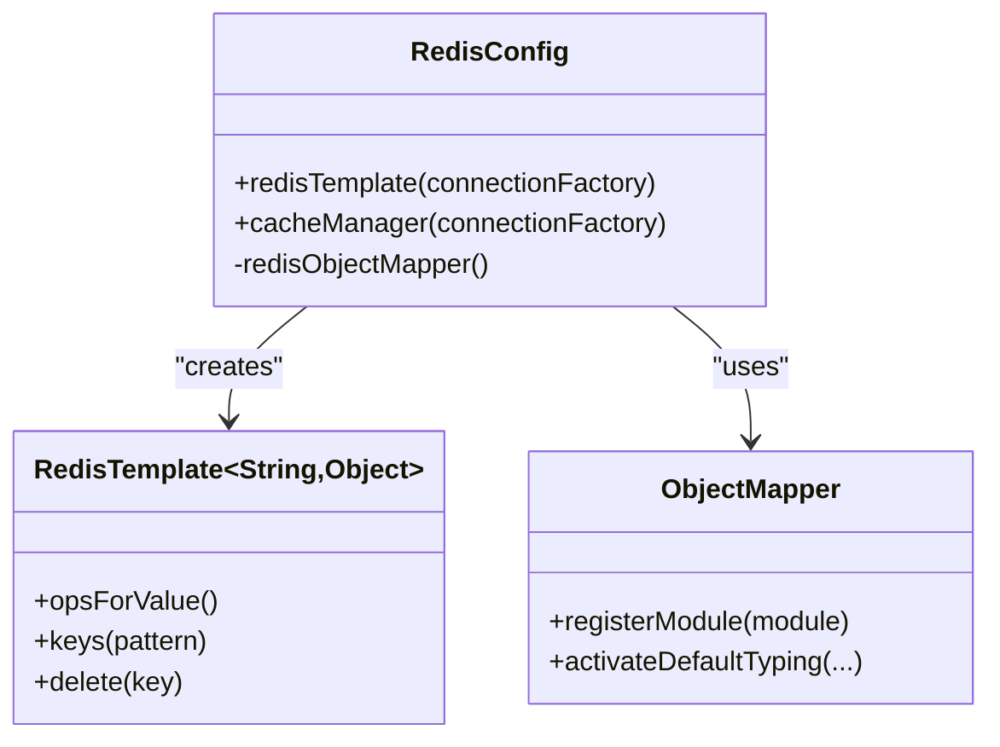
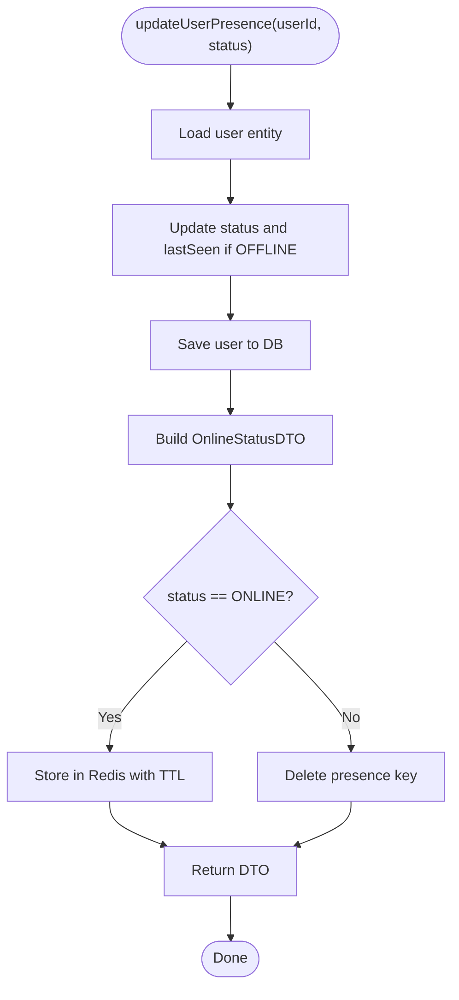
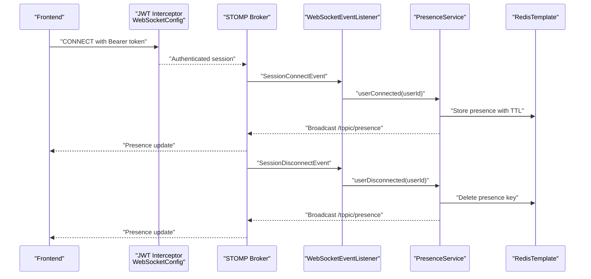
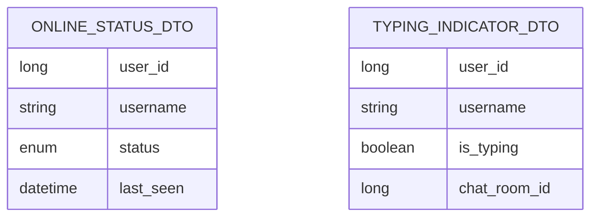
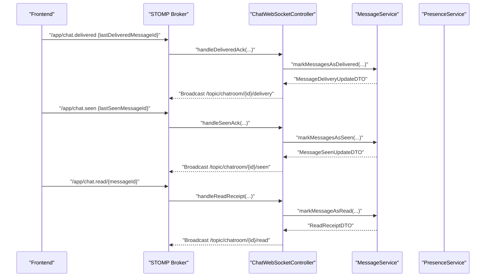
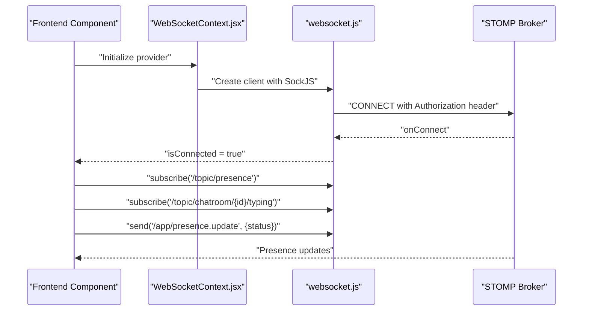
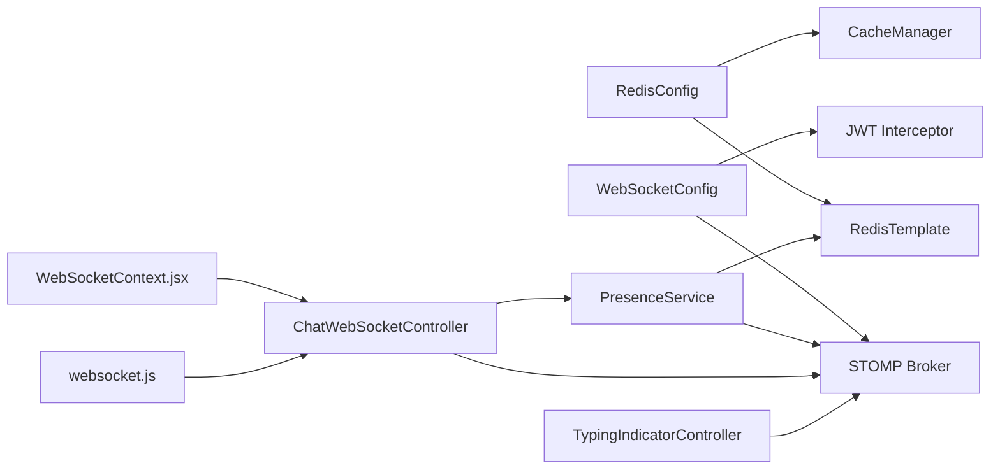

# Presence and Caching

<cite>
**Referenced Files in This Document**
- [RedisConfig.java](file://src/main/java/com/chatify/chat_backend/config/RedisConfig.java)
- [WebSocketConfig.java](file://src/main/java/com/chatify/chat_backend/config/WebSocketConfig.java)
- [PresenceService.java](file://src/main/java/com/chatify/chat_backend/service/PresenceService.java)
- [ChatWebSocketController.java](file://src/main/java/com/chatify/chat_backend/controller/ChatWebSocketController.java)
- [WebSocketEventListener.java](file://src/main/java/com/chatify/chat_backend/listener/WebSocketEventListener.java)
- [OnlineStatusDTO.java](file://src/main/java/com/chatify/chat_backend/dto/OnlineStatusDTO.java)
- [TypingIndicatorDTO.java](file://src/main/java/com/chatify/chat_backend/dto/TypingIndicatorDTO.java)
- [TypingIndicatorController.java](file://src/main/java/com/chatify/chat_backend/controller/TypingIndicatorController.java)
- [UserChatState.java](file://src/main/java/com/chatify/chat_backend/entity/UserChatState.java)
- [ChatMessageEvent.java](file://src/main/java/com/chatify/chat_backend/dto/ChatMessageEvent.java)
- [WebSocketContext.jsx](file://chatify-frontend/src/context/WebSocketContext.jsx)
- [websocket.js](file://chatify-frontend/src/services/websocket.js)
</cite>

## Table of Contents
1. [Introduction](#introduction)
2. [Project Structure](#project-structure)
3. [Core Components](#core-components)
4. [Architecture Overview](#architecture-overview)
5. [Detailed Component Analysis](#detailed-component-analysis)
6. [Dependency Analysis](#dependency-analysis)
7. [Performance Considerations](#performance-considerations)
8. [Troubleshooting Guide](#troubleshooting-guide)
9. [Conclusion](#conclusion)
10. [Appendices](#appendices)

## Introduction
This document explains the presence and caching system with a focus on Redis configuration, user presence tracking, and real-time status updates. It covers:
- Redis configuration for connection pooling, serialization, and cache key management
- PresenceService implementation for online/offline status, typing indicators, and unread counts
- Integration with WebSocket connections for real-time presence updates and typing indicators
- Concrete examples of presence data structures, cache expiration policies, and pub/sub messaging
- The relationship between presence tracking and message delivery receipts, including unread count calculations and read status propagation
- Performance optimization techniques for high-concurrency scenarios and memory management strategies
- Consistency guarantees, eventual consistency patterns, and conflict resolution for distributed presence tracking

## Project Structure
The presence and caching system spans backend Spring Boot services and frontend WebSocket integrations:
- Backend configuration: Redis and WebSocket broker configuration
- Backend services: PresenceService, WebSocket controllers, and typing indicator controller
- Frontend: WebSocket provider and service for connecting, subscribing, and publishing

**Diagram sources**
- [RedisConfig.java:1-108](file://src/main/java/com/chatify/chat_backend/config/RedisConfig.java#L1-L108)
- [WebSocketConfig.java:1-111](file://src/main/java/com/chatify/chat_backend/config/WebSocketConfig.java#L1-L111)
- [PresenceService.java:1-132](file://src/main/java/com/chatify/chat_backend/service/PresenceService.java#L1-L132)
- [ChatWebSocketController.java:1-181](file://src/main/java/com/chatify/chat_backend/controller/ChatWebSocketController.java#L1-L181)
- [WebSocketEventListener.java:1-55](file://src/main/java/com/chatify/chat_backend/listener/WebSocketEventListener.java#L1-L55)
- [TypingIndicatorController.java:1-56](file://src/main/java/com/chatify/chat_backend/controller/TypingIndicatorController.java#L1-L56)
- [WebSocketContext.jsx:1-190](file://chatify-frontend/src/context/WebSocketContext.jsx#L1-L190)
- [websocket.js:1-327](file://chatify-frontend/src/services/websocket.js#L1-L327)

**Section sources**
- [RedisConfig.java:1-108](file://src/main/java/com/chatify/chat_backend/config/RedisConfig.java#L1-L108)
- [WebSocketConfig.java:1-111](file://src/main/java/com/chatify/chat_backend/config/WebSocketConfig.java#L1-L111)
- [PresenceService.java:1-132](file://src/main/java/com/chatify/chat_backend/service/PresenceService.java#L1-L132)
- [ChatWebSocketController.java:1-181](file://src/main/java/com/chatify/chat_backend/controller/ChatWebSocketController.java#L1-L181)
- [WebSocketEventListener.java:1-55](file://src/main/java/com/chatify/chat_backend/listener/WebSocketEventListener.java#L1-L55)
- [TypingIndicatorController.java:1-56](file://src/main/java/com/chatify/chat_backend/controller/TypingIndicatorController.java#L1-L56)
- [WebSocketContext.jsx:1-190](file://chatify-frontend/src/context/WebSocketContext.jsx#L1-L190)
- [websocket.js:1-327](file://chatify-frontend/src/services/websocket.js#L1-L327)

## Core Components
- Redis configuration
  - ObjectMapper configured with JavaTimeModule and default typing to preserve class metadata for Jackson serialization
  - RedisTemplate configured with String key serializer and JSON value serializer for presence data
  - RedisCacheManager with default TTL and per-cache TTL overrides for user caches
- PresenceService
  - Manages user presence with Redis TTL-based keys and fallback to database
  - Broadcasts presence changes via STOMP topic
  - Provides online user enumeration by scanning presence keys
- WebSocket integration
  - WebSocketConfig enables STOMP broker with heartbeat scheduling and JWT-based authentication interceptor
  - WebSocketEventListener triggers presence updates on connect/disconnect events
  - ChatWebSocketController exposes presence update endpoint and delivery/read/seen acknowledgements
  - TypingIndicatorController publishes typing indicators to chat room topics

**Section sources**
- [RedisConfig.java:27-44](file://src/main/java/com/chatify/chat_backend/config/RedisConfig.java#L27-L44)
- [RedisConfig.java:48-66](file://src/main/java/com/chatify/chat_backend/config/RedisConfig.java#L48-L66)
- [RedisConfig.java:70-107](file://src/main/java/com/chatify/chat_backend/config/RedisConfig.java#L70-L107)
- [PresenceService.java:27-42](file://src/main/java/com/chatify/chat_backend/service/PresenceService.java#L27-L42)
- [PresenceService.java:49-81](file://src/main/java/com/chatify/chat_backend/service/PresenceService.java#L49-L81)
- [PresenceService.java:101-115](file://src/main/java/com/chatify/chat_backend/service/PresenceService.java#L101-L115)
- [PresenceService.java:117-131](file://src/main/java/com/chatify/chat_backend/service/PresenceService.java#L117-L131)
- [WebSocketConfig.java:43-57](file://src/main/java/com/chatify/chat_backend/config/WebSocketConfig.java#L43-L57)
- [WebSocketConfig.java:68-110](file://src/main/java/com/chatify/chat_backend/config/WebSocketConfig.java#L68-L110)
- [WebSocketEventListener.java:24-54](file://src/main/java/com/chatify/chat_backend/listener/WebSocketEventListener.java#L24-L54)
- [ChatWebSocketController.java:133-142](file://src/main/java/com/chatify/chat_backend/controller/ChatWebSocketController.java#L133-L142)
- [TypingIndicatorController.java:30-55](file://src/main/java/com/chatify/chat_backend/controller/TypingIndicatorController.java#L30-L55)

## Architecture Overview
The presence and caching architecture combines Redis for ephemeral presence state, STOMP for real-time pub/sub messaging, and JWT-based authentication for secure WebSocket sessions.

**Diagram sources**
- [WebSocketConfig.java:30-110](file://src/main/java/com/chatify/chat_backend/config/WebSocketConfig.java#L30-L110)
- [ChatWebSocketController.java:24-47](file://src/main/java/com/chatify/chat_backend/controller/ChatWebSocketController.java#L24-L47)
- [WebSocketEventListener.java:19-54](file://src/main/java/com/chatify/chat_backend/listener/WebSocketEventListener.java#L19-L54)
- [PresenceService.java:20-42](file://src/main/java/com/chatify/chat_backend/service/PresenceService.java#L20-L42)
- [RedisConfig.java:48-107](file://src/main/java/com/chatify/chat_backend/config/RedisConfig.java#L48-L107)

## Detailed Component Analysis

### Redis Configuration and Serialization
- ObjectMapper configuration ensures Java 8 time types are serialized/deserialized correctly and preserves type metadata for robust deserialization.
- RedisTemplate serializers:
  - Keys: StringRedisSerializer
  - Values: GenericJackson2JsonRedisSerializer built from the shared ObjectMapper
- RedisCacheManager:
  - Default TTL applied to caches not explicitly overridden
  - Per-cache TTLs for user-related caches to balance freshness and load

**Diagram sources**
- [RedisConfig.java:27-44](file://src/main/java/com/chatify/chat_backend/config/RedisConfig.java#L27-L44)
- [RedisConfig.java:48-66](file://src/main/java/com/chatify/chat_backend/config/RedisConfig.java#L48-L66)
- [RedisConfig.java:70-107](file://src/main/java/com/chatify/chat_backend/config/RedisConfig.java#L70-L107)

**Section sources**
- [RedisConfig.java:27-44](file://src/main/java/com/chatify/chat_backend/config/RedisConfig.java#L27-L44)
- [RedisConfig.java:48-66](file://src/main/java/com/chatify/chat_backend/config/RedisConfig.java#L48-L66)
- [RedisConfig.java:70-107](file://src/main/java/com/chatify/chat_backend/config/RedisConfig.java#L70-L107)

### PresenceService Implementation
- Presence key management:
  - Keys follow a consistent prefix pattern enabling efficient bulk scans
  - TTL-based presence keys expire automatically, acting as a safety net for crashed servers
- Presence updates:
  - Updates user entity and status, setting last seen on offline transitions
  - Stores presence DTO in Redis with TTL for online users; deletes key for offline users
- Real-time broadcasting:
  - Publishes presence changes to a global STOMP topic for clients to consume
- Online user enumeration:
  - Scans presence keys and returns current online users

**Diagram sources**
- [PresenceService.java:49-81](file://src/main/java/com/chatify/chat_backend/service/PresenceService.java#L49-L81)

**Section sources**
- [PresenceService.java:27-42](file://src/main/java/com/chatify/chat_backend/service/PresenceService.java#L27-L42)
- [PresenceService.java:49-81](file://src/main/java/com/chatify/chat_backend/service/PresenceService.java#L49-L81)
- [PresenceService.java:101-115](file://src/main/java/com/chatify/chat_backend/service/PresenceService.java#L101-L115)
- [PresenceService.java:117-131](file://src/main/java/com/chatify/chat_backend/service/PresenceService.java#L117-L131)

### WebSocket Integration and Real-Time Updates
- Authentication and heartbeat:
  - JWT-based authentication interceptor validates tokens on CONNECT frames
  - Heartbeats configured for broker and task scheduler for reliable connection health
- Presence lifecycle:
  - Connect event triggers userConnected; disconnect triggers userDisconnected
  - PresenceService persists and broadcasts presence changes
- Presence endpoint:
  - Clients can push presence updates via a dedicated STOMP endpoint
- Typing indicators:
  - TypingIndicatorController accepts typing payloads and broadcasts to chat room typing topic

**Diagram sources**
- [WebSocketConfig.java:68-110](file://src/main/java/com/chatify/chat_backend/config/WebSocketConfig.java#L68-L110)
- [WebSocketEventListener.java:24-54](file://src/main/java/com/chatify/chat_backend/listener/WebSocketEventListener.java#L24-L54)
- [PresenceService.java:105-115](file://src/main/java/com/chatify/chat_backend/service/PresenceService.java#L105-L115)

**Section sources**
- [WebSocketConfig.java:43-57](file://src/main/java/com/chatify/chat_backend/config/WebSocketConfig.java#L43-L57)
- [WebSocketConfig.java:68-110](file://src/main/java/com/chatify/chat_backend/config/WebSocketConfig.java#L68-L110)
- [WebSocketEventListener.java:24-54](file://src/main/java/com/chatify/chat_backend/listener/WebSocketEventListener.java#L24-L54)
- [ChatWebSocketController.java:133-142](file://src/main/java/com/chatify/chat_backend/controller/ChatWebSocketController.java#L133-L142)
- [TypingIndicatorController.java:30-55](file://src/main/java/com/chatify/chat_backend/controller/TypingIndicatorController.java#L30-L55)

### Presence Data Structures and Pub/Sub Messaging
- Presence data structure:
  - OnlineStatusDTO carries user identity, status, and lastSeen timestamp
- Pub/Sub channels:
  - Global presence topic receives all presence changes
  - Chat room typing topic receives typing indicator updates
  - Delivery and seen topics receive message delivery/visibility updates

**Diagram sources**
- [OnlineStatusDTO.java:13-18](file://src/main/java/com/chatify/chat_backend/dto/OnlineStatusDTO.java#L13-L18)
- [TypingIndicatorDTO.java:10-15](file://src/main/java/com/chatify/chat_backend/dto/TypingIndicatorDTO.java#L10-L15)

**Section sources**
- [OnlineStatusDTO.java:13-18](file://src/main/java/com/chatify/chat_backend/dto/OnlineStatusDTO.java#L13-L18)
- [TypingIndicatorDTO.java:10-15](file://src/main/java/com/chatify/chat_backend/dto/TypingIndicatorDTO.java#L10-L15)
- [ChatWebSocketController.java:112-131](file://src/main/java/com/chatify/chat_backend/controller/ChatWebSocketController.java#L112-L131)
- [ChatWebSocketController.java:144-161](file://src/main/java/com/chatify/chat_backend/controller/ChatWebSocketController.java#L144-L161)
- [ChatWebSocketController.java:163-180](file://src/main/java/com/chatify/chat_backend/controller/ChatWebSocketController.java#L163-L180)

### Relationship Between Presence Tracking and Message Delivery Receipts
- Presence and message delivery are decoupled:
  - PresenceService manages online/offline state and broadcasts changes
  - Message delivery receipts (delivered/seen) and read receipts are handled separately via message service endpoints
- Unread count calculation:
  - The UserChatState entity tracks last read message and timestamp, suitable for computing unread counts per chat room
  - Presence does not directly compute unread counts; this is typically derived from last read markers and message timestamps

**Diagram sources**
- [ChatWebSocketController.java:144-161](file://src/main/java/com/chatify/chat_backend/controller/ChatWebSocketController.java#L144-L161)
- [ChatWebSocketController.java:163-180](file://src/main/java/com/chatify/chat_backend/controller/ChatWebSocketController.java#L163-L180)
- [ChatWebSocketController.java:112-131](file://src/main/java/com/chatify/chat_backend/controller/ChatWebSocketController.java#L112-L131)

**Section sources**
- [UserChatState.java:25-65](file://src/main/java/com/chatify/chat_backend/entity/UserChatState.java#L25-L65)
- [ChatWebSocketController.java:112-131](file://src/main/java/com/chatify/chat_backend/controller/ChatWebSocketController.java#L112-L131)
- [ChatWebSocketController.java:144-161](file://src/main/java/com/chatify/chat_backend/controller/ChatWebSocketController.java#L144-L161)
- [ChatWebSocketController.java:163-180](file://src/main/java/com/chatify/chat_backend/controller/ChatWebSocketController.java#L163-L180)

### Frontend WebSocket Integration
- WebSocketContext.jsx and websocket.js manage connection lifecycle, token refresh, heartbeats, and subscriptions
- Subscriptions include chat rooms, typing indicators, presence, delivery, and seen topics
- Token refresh is integrated into connect headers to maintain authenticated sessions

**Diagram sources**
- [WebSocketContext.jsx:47-122](file://chatify-frontend/src/context/WebSocketContext.jsx#L47-L122)
- [websocket.js:42-114](file://chatify-frontend/src/services/websocket.js#L42-L114)
- [websocket.js:315-321](file://chatify-frontend/src/services/websocket.js#L315-L321)

**Section sources**
- [WebSocketContext.jsx:47-122](file://chatify-frontend/src/context/WebSocketContext.jsx#L47-L122)
- [websocket.js:42-114](file://chatify-frontend/src/services/websocket.js#L42-L114)
- [websocket.js:315-321](file://chatify-frontend/src/services/websocket.js#L315-L321)

## Dependency Analysis
- PresenceService depends on RedisTemplate for TTL-based presence storage and SimpMessagingTemplate for broadcasting
- WebSocketConfig provides the STOMP broker infrastructure and JWT authentication
- ChatWebSocketController and TypingIndicatorController depend on PresenceService and message services for delivery/read/seen acknowledgments
- Frontend WebSocketContext and websocket.js depend on STOMP/SockJS for transport and subscription management

**Diagram sources**
- [RedisConfig.java:48-107](file://src/main/java/com/chatify/chat_backend/config/RedisConfig.java#L48-L107)
- [WebSocketConfig.java:43-57](file://src/main/java/com/chatify/chat_backend/config/WebSocketConfig.java#L43-L57)
- [PresenceService.java:20-42](file://src/main/java/com/chatify/chat_backend/service/PresenceService.java#L20-L42)
- [ChatWebSocketController.java:24-47](file://src/main/java/com/chatify/chat_backend/controller/ChatWebSocketController.java#L24-L47)
- [TypingIndicatorController.java:15-23](file://src/main/java/com/chatify/chat_backend/controller/TypingIndicatorController.java#L15-L23)
- [WebSocketContext.jsx:10-122](file://chatify-frontend/src/context/WebSocketContext.jsx#L10-L122)
- [websocket.js:42-114](file://chatify-frontend/src/services/websocket.js#L42-L114)

**Section sources**
- [PresenceService.java:20-42](file://src/main/java/com/chatify/chat_backend/service/PresenceService.java#L20-L42)
- [ChatWebSocketController.java:24-47](file://src/main/java/com/chatify/chat_backend/controller/ChatWebSocketController.java#L24-L47)
- [WebSocketConfig.java:43-57](file://src/main/java/com/chatify/chat_backend/config/WebSocketConfig.java#L43-L57)
- [RedisConfig.java:48-107](file://src/main/java/com/chatify/chat_backend/config/RedisConfig.java#L48-L107)

## Performance Considerations
- Redis serialization and deserialization
  - Use the shared ObjectMapper to avoid per-instance overhead and ensure consistent type metadata handling
  - Prefer JSON serialization for complex DTOs to minimize conversion errors
- TTL-based presence keys
  - Set reasonable TTLs to prevent stale presence accumulation while ensuring timely cleanup on crashes
  - Use key scanning judiciously; consider pagination or sampling for very large sets
- Cache manager configuration
  - Tune per-cache TTLs to balance freshness and load; keep frequently accessed user data short-lived to reduce staleness
- WebSocket heartbeats
  - Configure heartbeat intervals aligned with client expectations and network conditions to detect broken connections promptly
- Concurrency and memory
  - Limit presence scans to necessary operations; batch updates where possible
  - Avoid storing large payloads in Redis; keep presence DTOs compact
  - Monitor Redis memory usage and eviction policies to prevent memory pressure

[No sources needed since this section provides general guidance]

## Troubleshooting Guide
- Authentication failures on WebSocket connect
  - Verify JWT token validity and extraction in the interceptor; ensure Authorization header is present and correctly formatted
- Presence not updating
  - Confirm Redis connectivity and key TTL settings; verify presence key prefix consistency
  - Check that broadcast destinations are reachable and clients are subscribed to the correct topics
- Typing indicator not visible
  - Ensure clients subscribe to the chat room typing topic and that the typing payload includes required fields
- Delivery/seen/read receipts not propagating
  - Validate message service endpoints and that updates are broadcast to the correct chat room topics

**Section sources**
- [WebSocketConfig.java:68-110](file://src/main/java/com/chatify/chat_backend/config/WebSocketConfig.java#L68-L110)
- [WebSocketEventListener.java:24-54](file://src/main/java/com/chatify/chat_backend/listener/WebSocketEventListener.java#L24-L54)
- [PresenceService.java:101-115](file://src/main/java/com/chatify/chat_backend/service/PresenceService.java#L101-L115)
- [TypingIndicatorController.java:30-55](file://src/main/java/com/chatify/chat_backend/controller/TypingIndicatorController.java#L30-L55)
- [ChatWebSocketController.java:112-131](file://src/main/java/com/chatify/chat_backend/controller/ChatWebSocketController.java#L112-L131)

## Conclusion
The presence and caching system leverages Redis for efficient, TTL-based presence state and STOMP for real-time pub/sub messaging. JWT authentication secures WebSocket sessions, while PresenceService centralizes presence lifecycle management and broadcasting. Delivery, seen, and read receipts are handled independently via message service endpoints, enabling scalable and consistent real-time communication across distributed instances.

[No sources needed since this section summarizes without analyzing specific files]

## Appendices

### Cache Expiration Policies
- Default cache TTL: applied to caches not explicitly overridden
- User caches TTL: tailored for user profile and lookup caches to balance freshness and load

**Section sources**
- [RedisConfig.java:77-89](file://src/main/java/com/chatify/chat_backend/config/RedisConfig.java#L77-L89)
- [RedisConfig.java:96-101](file://src/main/java/com/chatify/chat_backend/config/RedisConfig.java#L96-L101)

### Presence Key Management
- Key prefix: consistent naming enables efficient bulk operations
- TTL: automatic expiry prevents stale presence entries
- RedisTemplate: JSON serialization ensures accurate DTO round-trips

**Section sources**
- [PresenceService.java:27-42](file://src/main/java/com/chatify/chat_backend/service/PresenceService.java#L27-L42)
- [PresenceService.java:67-78](file://src/main/java/com/chatify/chat_backend/service/PresenceService.java#L67-L78)
- [RedisConfig.java:48-66](file://src/main/java/com/chatify/chat_backend/config/RedisConfig.java#L48-L66)

### Pub/Sub Messaging Channels
- Presence: global topic for all presence changes
- Typing: per-chat-room topic for typing indicators
- Delivery/Seen/Read: per-chat-room topics for message delivery/visibility/read acknowledgments

**Section sources**
- [ChatWebSocketController.java:108-110](file://src/main/java/com/chatify/chat_backend/controller/ChatWebSocketController.java#L108-L110)
- [ChatWebSocketController.java:112-131](file://src/main/java/com/chatify/chat_backend/controller/ChatWebSocketController.java#L112-L131)
- [ChatWebSocketController.java:144-161](file://src/main/java/com/chatify/chat_backend/controller/ChatWebSocketController.java#L144-L161)
- [ChatWebSocketController.java:163-180](file://src/main/java/com/chatify/chat_backend/controller/ChatWebSocketController.java#L163-L180)
- [TypingIndicatorController.java:30-55](file://src/main/java/com/chatify/chat_backend/controller/TypingIndicatorController.java#L30-L55)