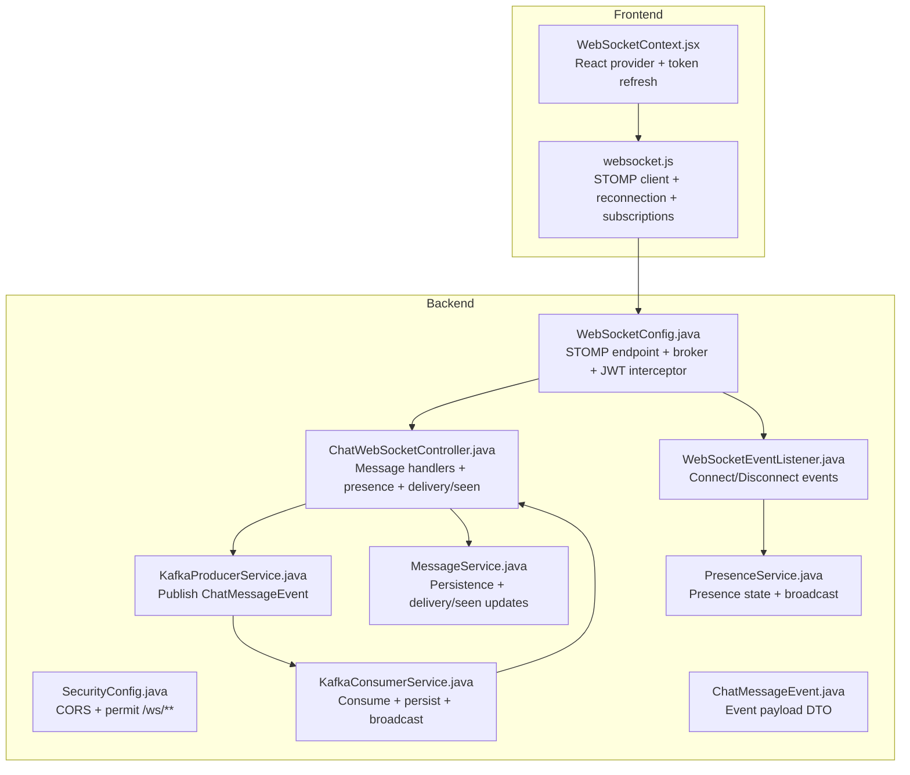
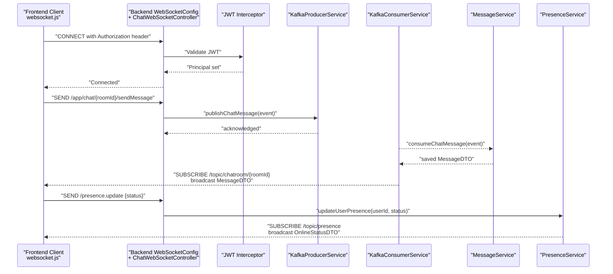
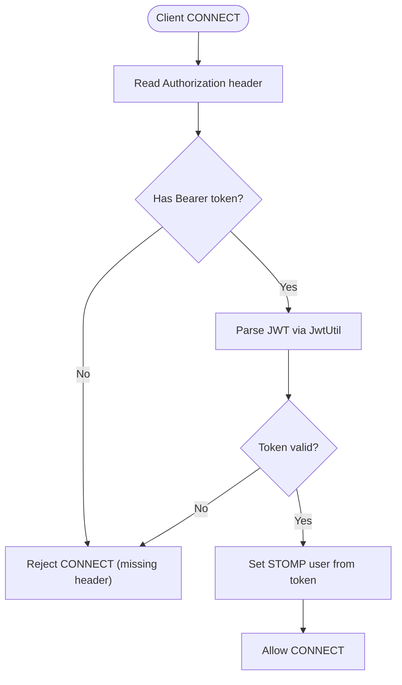
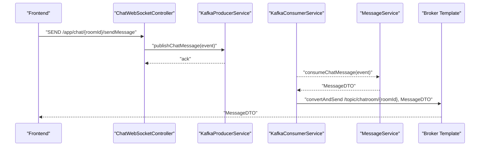
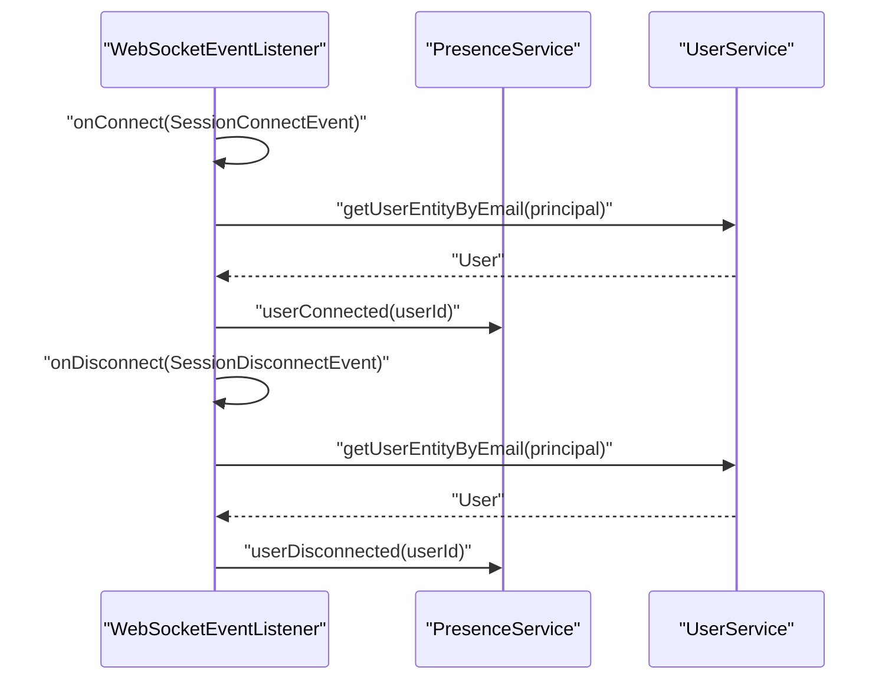
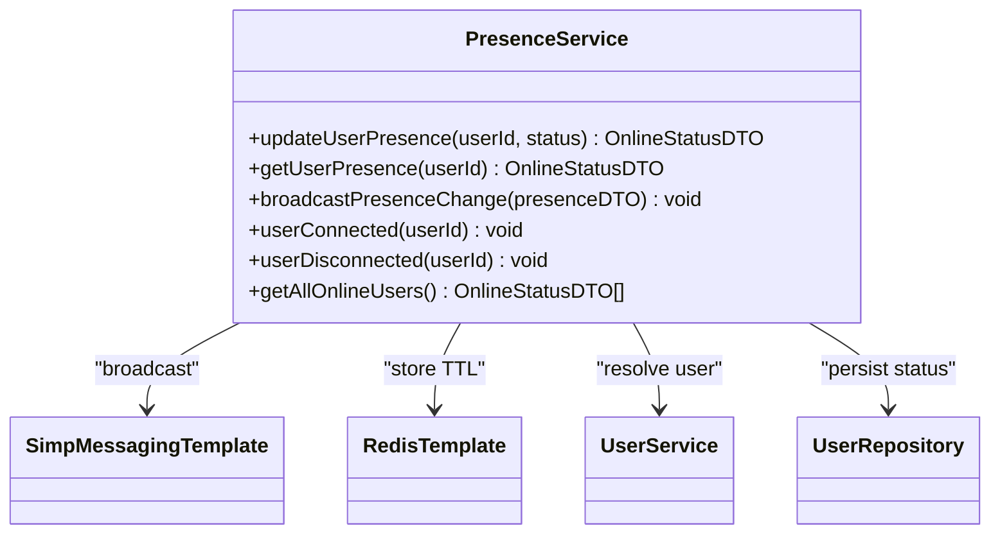
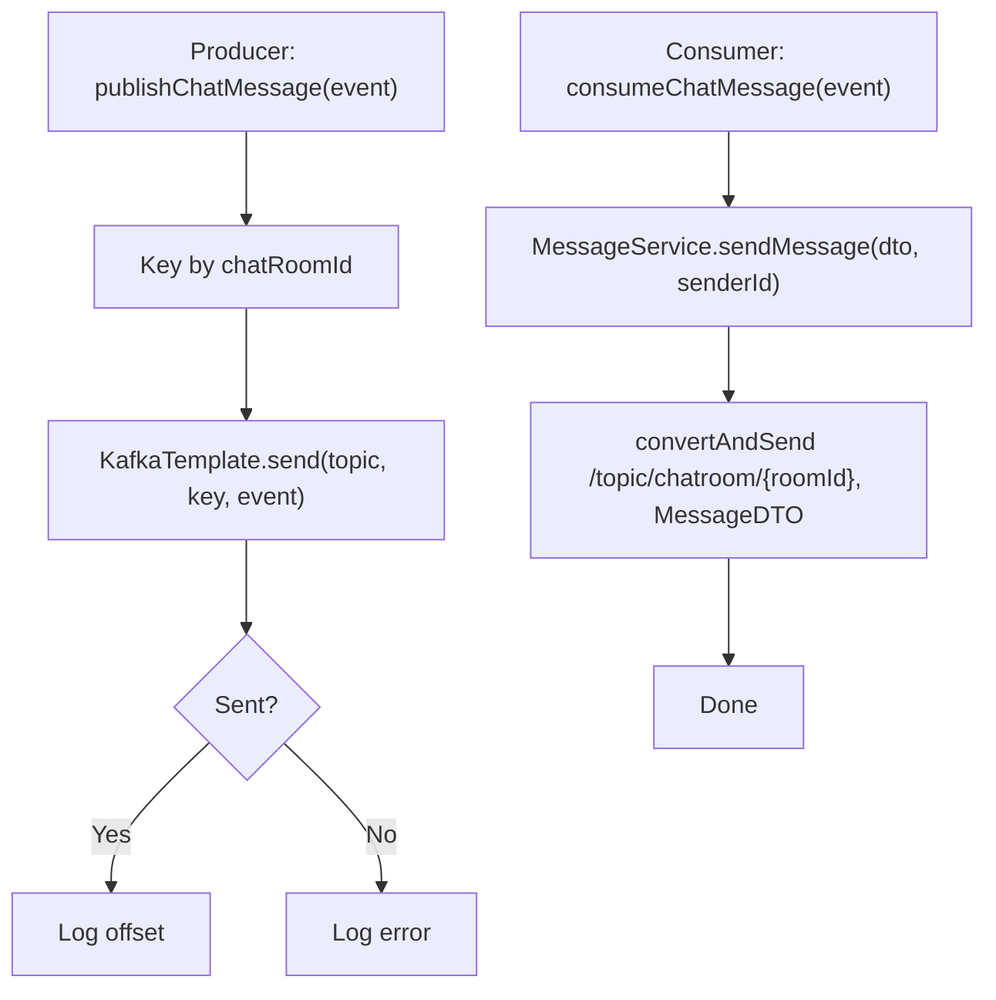
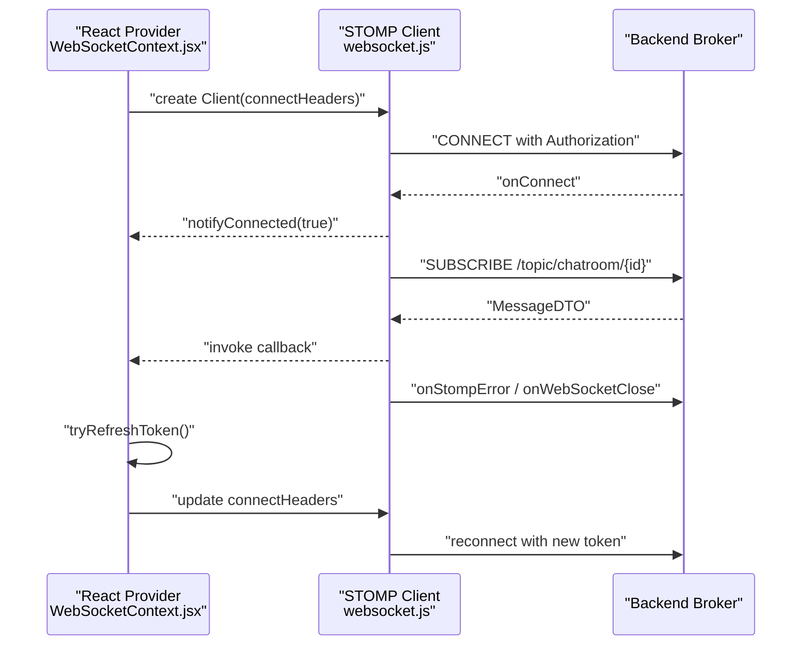
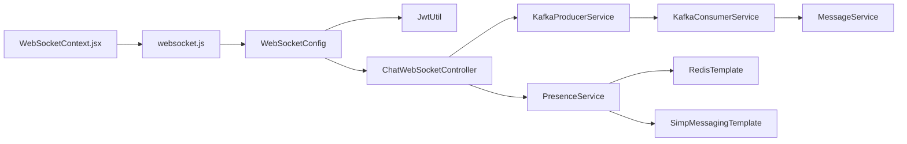

# WebSocket Implementation

<cite>
**Referenced Files in This Document**
- [WebSocketConfig.java](file://src/main/java/com/chatify/chat_backend/config/WebSocketConfig.java)
- [SecurityConfig.java](file://src/main/java/com/chatify/chat_backend/config/SecurityConfig.java)
- [ChatWebSocketController.java](file://src/main/java/com/chatify/chat_backend/controller/ChatWebSocketController.java)
- [WebSocketEventListener.java](file://src/main/java/com/chatify/chat_backend/listener/WebSocketEventListener.java)
- [KafkaProducerService.java](file://src/main/java/com/chatify/chat_backend/service/KafkaProducerService.java)
- [KafkaConsumerService.java](file://src/main/java/com/chatify/chat_backend/service/KafkaConsumerService.java)
- [PresenceService.java](file://src/main/java/com/chatify/chat_backend/service/PresenceService.java)
- [MessageService.java](file://src/main/java/com/chatify/chat_backend/service/MessageService.java)
- [ChatMessageEvent.java](file://src/main/java/com/chatify/chat_backend/dto/ChatMessageEvent.java)
- [websocket.js](file://chatify-frontend/src/services/websocket.js)
- [WebSocketContext.jsx](file://chatify-frontend/src/context/WebSocketContext.jsx)
</cite>

## Table of Contents
1. [Introduction](#introduction)
2. [Project Structure](#project-structure)
3. [Core Components](#core-components)
4. [Architecture Overview](#architecture-overview)
5. [Detailed Component Analysis](#detailed-component-analysis)
6. [Dependency Analysis](#dependency-analysis)
7. [Performance Considerations](#performance-considerations)
8. [Troubleshooting Guide](#troubleshooting-guide)
9. [Conclusion](#conclusion)
10. [Appendices](#appendices)

## Introduction
This document explains the WebSocket implementation for the STOMP protocol in the Chatify backend and frontend. It covers STOMP endpoint configuration, JWT-based authentication, message broker setup, real-time messaging handlers, presence updates, and event broadcasting. It also documents the integration with Kafka for persistent message delivery, connection lifecycle management, error handling, reconnection strategies, and performance considerations for scaling real-time features.

## Project Structure
The WebSocket implementation spans backend Spring configuration, controllers, listeners, services, and DTOs, along with frontend STOMP clients and React context providers.

**Diagram sources**
- [WebSocketConfig.java:44-57](file://src/main/java/com/chatify/chat_backend/config/WebSocketConfig.java#L44-L57)
- [SecurityConfig.java:75-80](file://src/main/java/com/chatify/chat_backend/config/SecurityConfig.java#L75-L80)
- [ChatWebSocketController.java:53-110](file://src/main/java/com/chatify/chat_backend/controller/ChatWebSocketController.java#L53-L110)
- [WebSocketEventListener.java:24-54](file://src/main/java/com/chatify/chat_backend/listener/WebSocketEventListener.java#L24-L54)
- [KafkaProducerService.java:32-49](file://src/main/java/com/chatify/chat_backend/service/KafkaProducerService.java#L32-L49)
- [KafkaConsumerService.java:34-71](file://src/main/java/com/chatify/chat_backend/service/KafkaConsumerService.java#L34-L71)
- [PresenceService.java:101-115](file://src/main/java/com/chatify/chat_backend/service/PresenceService.java#L101-L115)
- [MessageService.java:50-78](file://src/main/java/com/chatify/chat_backend/service/MessageService.java#L50-L78)
- [ChatMessageEvent.java:16-25](file://src/main/java/com/chatify/chat_backend/dto/ChatMessageEvent.java#L16-L25)
- [WebSocketContext.jsx:50-111](file://chatify-frontend/src/context/WebSocketContext.jsx#L50-L111)
- [websocket.js:59-114](file://chatify-frontend/src/services/websocket.js#L59-L114)

**Section sources**
- [WebSocketConfig.java:44-57](file://src/main/java/com/chatify/chat_backend/config/WebSocketConfig.java#L44-L57)
- [SecurityConfig.java:75-80](file://src/main/java/com/chatify/chat_backend/config/SecurityConfig.java#L75-L80)
- [ChatWebSocketController.java:53-110](file://src/main/java/com/chatify/chat_backend/controller/ChatWebSocketController.java#L53-L110)
- [WebSocketEventListener.java:24-54](file://src/main/java/com/chatify/chat_backend/listener/WebSocketEventListener.java#L24-L54)
- [KafkaProducerService.java:32-49](file://src/main/java/com/chatify/chat_backend/service/KafkaProducerService.java#L32-L49)
- [KafkaConsumerService.java:34-71](file://src/main/java/com/chatify/chat_backend/service/KafkaConsumerService.java#L34-L71)
- [PresenceService.java:101-115](file://src/main/java/com/chatify/chat_backend/service/PresenceService.java#L101-L115)
- [MessageService.java:50-78](file://src/main/java/com/chatify/chat_backend/service/MessageService.java#L50-L78)
- [ChatMessageEvent.java:16-25](file://src/main/java/com/chatify/chat_backend/dto/ChatMessageEvent.java#L16-L25)
- [WebSocketContext.jsx:50-111](file://chatify-frontend/src/context/WebSocketContext.jsx#L50-L111)
- [websocket.js:59-114](file://chatify-frontend/src/services/websocket.js#L59-L114)

## Core Components
- WebSocket configuration and STOMP endpoint setup with SockJS fallback and CORS support.
- JWT authentication interceptor on the inbound STOMP channel.
- Message broker configuration enabling simple broker destinations and user-specific queues.
- Real-time message handlers for sending, read receipts, delivered/seen acknowledgements, and presence updates.
- WebSocket event listeners for connection and disconnection lifecycle management.
- Kafka producer/consumer pipeline for persistent message delivery and broadcast.
- Presence service with Redis-backed online status and broadcast.
- Frontend STOMP client with reconnection, token refresh, and subscription management.

**Section sources**
- [WebSocketConfig.java:44-111](file://src/main/java/com/chatify/chat_backend/config/WebSocketConfig.java#L44-L111)
- [SecurityConfig.java:75-80](file://src/main/java/com/chatify/chat_backend/config/SecurityConfig.java#L75-L80)
- [ChatWebSocketController.java:53-181](file://src/main/java/com/chatify/chat_backend/controller/ChatWebSocketController.java#L53-L181)
- [WebSocketEventListener.java:24-54](file://src/main/java/com/chatify/chat_backend/listener/WebSocketEventListener.java#L24-L54)
- [KafkaProducerService.java:32-49](file://src/main/java/com/chatify/chat_backend/service/KafkaProducerService.java#L32-L49)
- [KafkaConsumerService.java:34-71](file://src/main/java/com/chatify/chat_backend/service/KafkaConsumerService.java#L34-L71)
- [PresenceService.java:101-115](file://src/main/java/com/chatify/chat_backend/service/PresenceService.java#L101-L115)
- [MessageService.java:50-78](file://src/main/java/com/chatify/chat_backend/service/MessageService.java#L50-L78)
- [websocket.js:59-114](file://chatify-frontend/src/services/websocket.js#L59-L114)
- [WebSocketContext.jsx:50-111](file://chatify-frontend/src/context/WebSocketContext.jsx#L50-L111)

## Architecture Overview
The system uses Spring WebSocket + STOMP with a simple broker for real-time messaging. Messages are persisted asynchronously via Kafka, ensuring durability and eventual consistency. Presence and connection lifecycle are managed centrally, while the frontend maintains a robust STOMP client with automatic reconnection and token refresh.

**Diagram sources**
- [WebSocketConfig.java:68-111](file://src/main/java/com/chatify/chat_backend/config/WebSocketConfig.java#L68-L111)
- [ChatWebSocketController.java:81-110](file://src/main/java/com/chatify/chat_backend/controller/ChatWebSocketController.java#L81-L110)
- [KafkaProducerService.java:32-49](file://src/main/java/com/chatify/chat_backend/service/KafkaProducerService.java#L32-L49)
- [KafkaConsumerService.java:34-71](file://src/main/java/com/chatify/chat_backend/service/KafkaConsumerService.java#L34-L71)
- [MessageService.java:50-78](file://src/main/java/com/chatify/chat_backend/service/MessageService.java#L50-L78)
- [PresenceService.java:101-115](file://src/main/java/com/chatify/chat_backend/service/PresenceService.java#L101-L115)
- [websocket.js:277-321](file://chatify-frontend/src/services/websocket.js#L277-L321)
- [WebSocketContext.jsx:152-174](file://chatify-frontend/src/context/WebSocketContext.jsx#L152-L174)

## Detailed Component Analysis

### WebSocket Configuration and Security
- STOMP endpoint registration with SockJS fallback and allowed origins.
- Simple broker configured for destinations: topics and user-specific destinations.
- Heartbeats enabled with a dedicated scheduler.
- Client inbound channel interceptor validates JWT from Authorization header and sets the STOMP user.
- Security filter chain permits WebSocket endpoints and applies JWT/OAuth2 filters for REST APIs.

**Diagram sources**
- [WebSocketConfig.java:75-106](file://src/main/java/com/chatify/chat_backend/config/WebSocketConfig.java#L75-L106)

**Section sources**
- [WebSocketConfig.java:44-57](file://src/main/java/com/chatify/chat_backend/config/WebSocketConfig.java#L44-L57)
- [WebSocketConfig.java:68-111](file://src/main/java/com/chatify/chat_backend/config/WebSocketConfig.java#L68-L111)
- [SecurityConfig.java:75-80](file://src/main/java/com/chatify/chat_backend/config/SecurityConfig.java#L75-L80)

### ChatWebSocketController: Real-Time Messaging Handlers
- Message sending:
  - Validates user membership in the chat room.
  - Builds a ChatMessageEvent and publishes to Kafka.
- Read receipts:
  - Marks message as read and broadcasts read receipt to the room’s read topic.
- Delivery/Seen acknowledgements:
  - Updates delivery/seen statuses and broadcasts updates to respective topics.
- Presence updates:
  - Updates user presence and broadcasts presence change to the global presence topic.

**Diagram sources**
- [ChatWebSocketController.java:81-110](file://src/main/java/com/chatify/chat_backend/controller/ChatWebSocketController.java#L81-L110)
- [KafkaProducerService.java:32-49](file://src/main/java/com/chatify/chat_backend/service/KafkaProducerService.java#L32-L49)
- [KafkaConsumerService.java:34-71](file://src/main/java/com/chatify/chat_backend/service/KafkaConsumerService.java#L34-L71)
- [MessageService.java:50-78](file://src/main/java/com/chatify/chat_backend/service/MessageService.java#L50-L78)

**Section sources**
- [ChatWebSocketController.java:53-181](file://src/main/java/com/chatify/chat_backend/controller/ChatWebSocketController.java#L53-L181)
- [ChatMessageEvent.java:16-25](file://src/main/java/com/chatify/chat_backend/dto/ChatMessageEvent.java#L16-L25)

### WebSocket Event Listener: Connection Lifecycle
- Handles SessionConnectEvent and SessionDisconnectEvent.
- Uses the STOMP user principal to resolve the user and update presence accordingly.
- Prevents processing of unauthenticated events.

**Diagram sources**
- [WebSocketEventListener.java:24-54](file://src/main/java/com/chatify/chat_backend/listener/WebSocketEventListener.java#L24-L54)
- [PresenceService.java:105-115](file://src/main/java/com/chatify/chat_backend/service/PresenceService.java#L105-L115)

**Section sources**
- [WebSocketEventListener.java:24-54](file://src/main/java/com/chatify/chat_backend/listener/WebSocketEventListener.java#L24-L54)

### Presence Management
- Updates user status in the database and Redis with TTL for online users.
- Broadcasts presence changes to the global presence topic.
- Provides methods to fetch online users and manage connection/disconnection transitions.

**Diagram sources**
- [PresenceService.java:101-115](file://src/main/java/com/chatify/chat_backend/service/PresenceService.java#L101-L115)

**Section sources**
- [PresenceService.java:101-115](file://src/main/java/com/chatify/chat_backend/service/PresenceService.java#L101-L115)

### Kafka Integration: Producer and Consumer
- Producer:
  - Publishes ChatMessageEvent to a Kafka topic keyed by chatRoomId to preserve ordering per room.
  - Logs success/failure asynchronously.
- Consumer:
  - Persists message via MessageService.
  - Broadcasts the saved MessageDTO to the room’s topic.

**Diagram sources**
- [KafkaProducerService.java:32-49](file://src/main/java/com/chatify/chat_backend/service/KafkaProducerService.java#L32-L49)
- [KafkaConsumerService.java:34-71](file://src/main/java/com/chatify/chat_backend/service/KafkaConsumerService.java#L34-L71)

**Section sources**
- [KafkaProducerService.java:32-49](file://src/main/java/com/chatify/chat_backend/service/KafkaProducerService.java#L32-L49)
- [KafkaConsumerService.java:34-71](file://src/main/java/com/chatify/chat_backend/service/KafkaConsumerService.java#L34-L71)

### Frontend WebSocket Clients and Subscriptions
- React provider initializes a STOMP client with SockJS, heartbeat, and dynamic Authorization headers.
- Automatic token refresh on STOMP errors or WebSocket close events with policy violations.
- Subscription helpers for chat rooms, typing indicators, read receipts, presence, and user-specific queues.
- Robust reconnection with exponential backoff and queued message flushing upon connect.

**Diagram sources**
- [WebSocketContext.jsx:50-111](file://chatify-frontend/src/context/WebSocketContext.jsx#L50-L111)
- [websocket.js:59-114](file://chatify-frontend/src/services/websocket.js#L59-L114)

**Section sources**
- [WebSocketContext.jsx:50-111](file://chatify-frontend/src/context/WebSocketContext.jsx#L50-L111)
- [websocket.js:59-114](file://chatify-frontend/src/services/websocket.js#L59-L114)

## Dependency Analysis
- Backend:
  - WebSocketConfig depends on JwtUtil for token validation and registers interceptors.
  - ChatWebSocketController depends on messaging template, services, and Kafka producer.
  - KafkaConsumerService depends on MessageService and SimpMessageSendingOperations.
  - PresenceService integrates with Redis and SimpMessagingTemplate.
- Frontend:
  - WebSocketContext.jsx and websocket.js depend on constants and token refresh utilities.

**Diagram sources**
- [WebSocketConfig.java:34-41](file://src/main/java/com/chatify/chat_backend/config/WebSocketConfig.java#L34-L41)
- [ChatWebSocketController.java:35-47](file://src/main/java/com/chatify/chat_backend/controller/ChatWebSocketController.java#L35-L47)
- [KafkaProducerService.java:23-25](file://src/main/java/com/chatify/chat_backend/service/KafkaProducerService.java#L23-L25)
- [KafkaConsumerService.java:20-24](file://src/main/java/com/chatify/chat_backend/service/KafkaConsumerService.java#L20-L24)
- [PresenceService.java:25-42](file://src/main/java/com/chatify/chat_backend/service/PresenceService.java#L25-L42)
- [WebSocketContext.jsx:50-111](file://chatify-frontend/src/context/WebSocketContext.jsx#L50-L111)
- [websocket.js:59-114](file://chatify-frontend/src/services/websocket.js#L59-L114)

**Section sources**
- [WebSocketConfig.java:34-41](file://src/main/java/com/chatify/chat_backend/config/WebSocketConfig.java#L34-L41)
- [ChatWebSocketController.java:35-47](file://src/main/java/com/chatify/chat_backend/controller/ChatWebSocketController.java#L35-L47)
- [KafkaProducerService.java:23-25](file://src/main/java/com/chatify/chat_backend/service/KafkaProducerService.java#L23-L25)
- [KafkaConsumerService.java:20-24](file://src/main/java/com/chatify/chat_backend/service/KafkaConsumerService.java#L20-L24)
- [PresenceService.java:25-42](file://src/main/java/com/chatify/chat_backend/service/PresenceService.java#L25-L42)
- [WebSocketContext.jsx:50-111](file://chatify-frontend/src/context/WebSocketContext.jsx#L50-L111)
- [websocket.js:59-114](file://chatify-frontend/src/services/websocket.js#L59-L114)

## Performance Considerations
- Message ordering per chat room:
  - Kafka producer keys messages by chatRoomId to ensure partition ordering.
- Heartbeats:
  - WebSocketConfig configures heartbeats to keep connections alive and detect dead peers.
- Presence caching:
  - Redis TTL for online users reduces DB load and provides fast presence queries.
- Backpressure and throughput:
  - Offload persistence and broadcast to Kafka consumers to avoid blocking WebSocket handlers.
- Concurrency:
  - Use thread pools and schedulers judiciously; the heartbeat scheduler is tuned for low overhead.
- Scaling:
  - Horizontal Kafka partitions per room key enable scaling message processing.
  - Scale WebSocket brokers behind load balancers and use sticky sessions if needed.

[No sources needed since this section provides general guidance]

## Troubleshooting Guide
- Authentication failures:
  - Missing or invalid Authorization header during CONNECT triggers rejection.
  - STOMP errors mentioning JWT expiration prompt token refresh in the frontend.
- Connection drops:
  - WebSocket close codes or reasons indicating policy violations trigger token refresh and reconnect.
- Message delivery:
  - Verify Kafka topic configuration and consumer group ID alignment.
  - Inspect logs for producer send failures and consumer processing exceptions.
- Presence issues:
  - Confirm Redis connectivity and TTL settings; fallback to DB for offline users.

**Section sources**
- [WebSocketConfig.java:75-106](file://src/main/java/com/chatify/chat_backend/config/WebSocketConfig.java#L75-L106)
- [WebSocketContext.jsx:74-103](file://chatify-frontend/src/context/WebSocketContext.jsx#L74-L103)
- [websocket.js:90-110](file://chatify-frontend/src/services/websocket.js#L90-L110)
- [KafkaProducerService.java:38-48](file://src/main/java/com/chatify/chat_backend/service/KafkaProducerService.java#L38-L48)
- [KafkaConsumerService.java:64-70](file://src/main/java/com/chatify/chat_backend/service/KafkaConsumerService.java#L64-L70)

## Conclusion
The WebSocket implementation leverages Spring WebSocket + STOMP with JWT authentication, a simple broker for real-time features, and Kafka for durable, ordered message processing. The frontend provides a resilient STOMP client with reconnection and token refresh. Together, these components deliver scalable, reliable real-time messaging with presence and delivery/seen tracking.

[No sources needed since this section summarizes without analyzing specific files]

## Appendices

### WebSocket Message Formats and Subscription Patterns
- Message sending:
  - Destination: /app/chat/{roomId}/sendMessage
  - Payload: includes chatRoomId, content, messageType, optional fileUrl and fileName.
- Read receipts:
  - Destination: /app/chat.read/{messageId}
  - Broadcast: /topic/chatroom/{roomId}/read
- Delivery/Seen:
  - Destinations: /app/chat.delivered and /app/chat.seen
  - Broadcasts: /topic/chatroom/{roomId}/delivery and /topic/chatroom/{roomId}/seen
- Presence:
  - Update: /app/presence.update
  - Broadcast: /topic/presence
- Room subscriptions:
  - Messages: /topic/chatroom/{roomId}
  - Typing: /topic/chatroom/{roomId}/typing
  - Read receipts: /topic/chatroom/{roomId}/read
  - Presence: /topic/chatroom/{roomId}/presence
  - Delivery: /topic/chatroom/{roomId}/delivery
  - Seen: /topic/chatroom/{roomId}/seen
- User-specific:
  - Queue: /user/queue/messages

**Section sources**
- [ChatWebSocketController.java:81-181](file://src/main/java/com/chatify/chat_backend/controller/ChatWebSocketController.java#L81-L181)
- [websocket.js:277-321](file://chatify-frontend/src/services/websocket.js#L277-L321)
- [WebSocketContext.jsx:124-174](file://chatify-frontend/src/context/WebSocketContext.jsx#L124-L174)