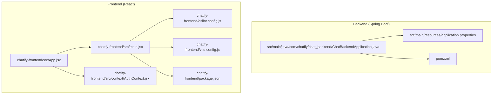
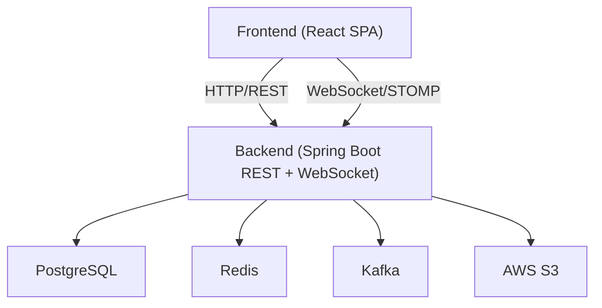
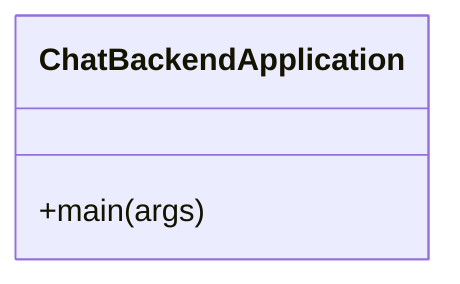
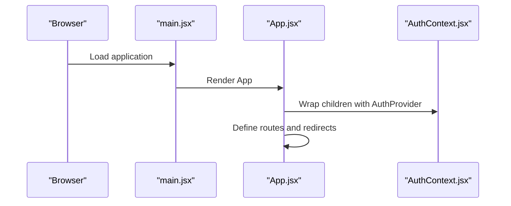
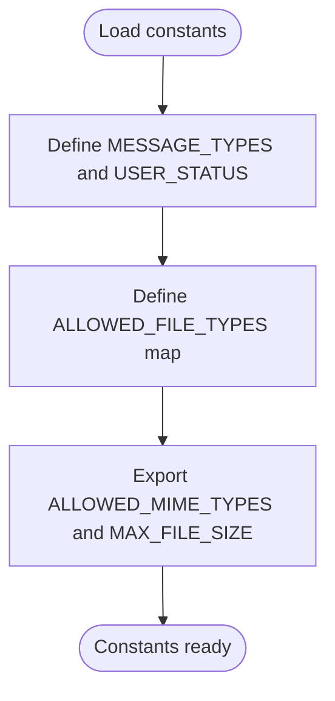
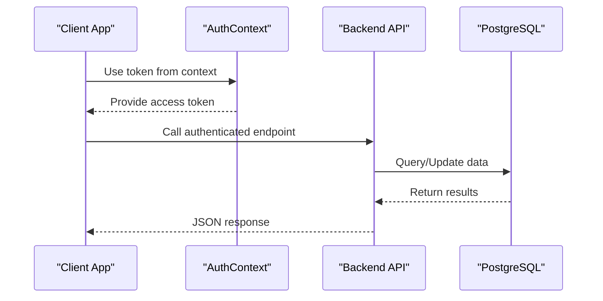
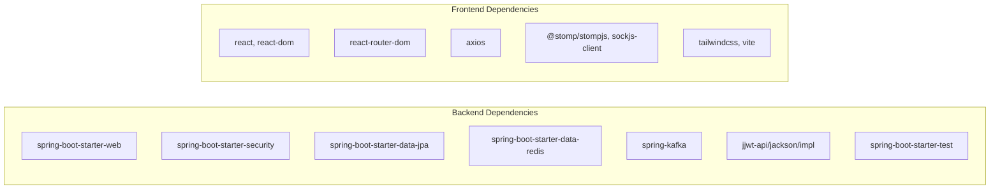

# Contributing Guidelines

<cite>
**Referenced Files in This Document**
- [README.md](file://README.md)
- [HELP.md](file://HELP.md)
- [pom.xml](file://pom.xml)
- [src/main/java/com/chatify/chat_backend/ChatBackendApplication.java](file://src/main/java/com/chatify/chat_backend/ChatBackendApplication.java)
- [src/main/resources/application.properties](file://src/main/resources/application.properties)
- [chatify-frontend/package.json](file://chatify-frontend/package.json)
- [chatify-frontend/eslint.config.js](file://chatify-frontend/eslint.config.js)
- [chatify-frontend/vite.config.js](file://chatify-frontend/vite.config.js)
- [chatify-frontend/src/App.jsx](file://chatify-frontend/src/App.jsx)
- [chatify-frontend/src/main.jsx](file://chatify-frontend/src/main.jsx)
- [chatify-frontend/src/context/AuthContext.jsx](file://chatify-frontend/src/context/AuthContext.jsx)
- [chatify-frontend/src/utils/constants.js](file://chatify-frontend/src/utils/constants.js)
- [chatify-frontend/Dockerfile](file://chatify-frontend/Dockerfile)
- [dockerfile](file://dockerfile)
- [POSTMAN_API_DOCUMENTATION.md](file://POSTMAN_API_DOCUMENTATION.md)
- [MESSAGE_DELIVERY_DESIGN.md](file://MESSAGE_DELIVERY_DESIGN.md)
</cite>

## Table of Contents
1. [Introduction](#introduction)
2. [Project Structure](#project-structure)
3. [Core Components](#core-components)
4. [Architecture Overview](#architecture-overview)
5. [Development Environment Setup](#development-environment-setup)
6. [Code Quality Standards](#code-quality-standards)
7. [Pull Request Process](#pull-request-process)
8. [Testing Requirements](#testing-requirements)
9. [Documentation Standards](#documentation-standards)
10. [Changelog Maintenance](#changelog-maintenance)
11. [Issue Reporting Guidelines](#issue-reporting-guidelines)
12. [Release Process and Versioning](#release-process-and-versioning)
13. [Types of Contributions](#types-of-contributions)
14. [Contact and Community Support](#contact-and-community-support)
15. [Troubleshooting Guide](#troubleshooting-guide)
16. [Conclusion](#conclusion)

## Introduction
Thank you for considering contributing to Chatify, a real-time chat application built with Spring Boot (backend) and React (frontend). This document outlines the development workflow, code standards, testing, documentation, and release practices to help you contribute effectively and consistently.

## Project Structure
The repository is organized into two major parts:
- Backend: Spring Boot application under src/main/java with layered architecture (controllers, services, repositories, DTOs, entities, configuration, and exception handling).
- Frontend: React application under chatify-frontend with modular components, pages, hooks, services, and utilities.

**Diagram sources**
- [src/main/java/com/chatify/chat_backend/ChatBackendApplication.java:1-14](file://src/main/java/com/chatify/chat_backend/ChatBackendApplication.java#L1-L14)
- [src/main/resources/application.properties:1-75](file://src/main/resources/application.properties#L1-L75)
- [pom.xml:1-176](file://pom.xml#L1-L176)
- [chatify-frontend/src/App.jsx:1-74](file://chatify-frontend/src/App.jsx#L1-L74)
- [chatify-frontend/src/main.jsx:1-16](file://chatify-frontend/src/main.jsx#L1-L16)
- [chatify-frontend/src/context/AuthContext.jsx:1-53](file://chatify-frontend/src/context/AuthContext.jsx#L1-L53)
- [chatify-frontend/eslint.config.js:1-30](file://chatify-frontend/eslint.config.js#L1-L30)
- [chatify-frontend/vite.config.js:1-21](file://chatify-frontend/vite.config.js#L1-L21)
- [chatify-frontend/package.json:1-40](file://chatify-frontend/package.json#L1-L40)

**Section sources**
- [README.md:159-185](file://README.md#L159-L185)

## Core Components
- Backend entry point and configuration:
  - Application bootstrap and Spring configuration are defined in the backend application class and properties file.
- Frontend routing and context providers:
  - React application sets up routing, authentication context, and WebSocket context providers.
- Build and linting:
  - Backend uses Maven with Java 17 and Spring Boot parent POM.
  - Frontend uses Vite, ESLint, and React with TypeScript typings.

**Section sources**
- [src/main/java/com/chatify/chat_backend/ChatBackendApplication.java:1-14](file://src/main/java/com/chatify/chat_backend/ChatBackendApplication.java#L1-L14)
- [src/main/resources/application.properties:1-75](file://src/main/resources/application.properties#L1-L75)
- [pom.xml:1-176](file://pom.xml#L1-L176)
- [chatify-frontend/src/App.jsx:1-74](file://chatify-frontend/src/App.jsx#L1-L74)
- [chatify-frontend/src/main.jsx:1-16](file://chatify-frontend/src/main.jsx#L1-L16)
- [chatify-frontend/package.json:1-40](file://chatify-frontend/package.json#L1-L40)

## Architecture Overview
The application follows a classic layered backend architecture with a React SPA frontend. Communication includes REST APIs and WebSocket/STOMP for real-time features. Environment variables and configuration files control runtime behavior.

**Diagram sources**
- [src/main/resources/application.properties:1-75](file://src/main/resources/application.properties#L1-L75)
- [README.md:17-34](file://README.md#L17-L34)

## Development Environment Setup
- Prerequisites:
  - Java 17, Node.js 18+, PostgreSQL 14+, Maven 3.6+.
- Backend:
  - Configure database credentials via application.properties or environment variables.
  - Build and run the backend using Maven commands.
- Frontend:
  - Install dependencies and start the Vite dev server.
  - Configure environment variables for API and WebSocket URLs.
- IDE configuration:
  - Backend: Import as Maven project; enable annotation processing for Lombok.
  - Frontend: Enable ESLint integration; configure Vite proxy for API and WebSocket traffic.

**Section sources**
- [README.md:35-111](file://README.md#L35-L111)
- [src/main/resources/application.properties:1-75](file://src/main/resources/application.properties#L1-L75)
- [chatify-frontend/vite.config.js:1-21](file://chatify-frontend/vite.config.js#L1-L21)
- [chatify-frontend/package.json:1-40](file://chatify-frontend/package.json#L1-L40)

## Code Quality Standards
- Java (Backend):
  - Follow Spring Boot conventions; keep controllers thin, delegate to services; use DTOs for requests/responses; apply Lombok sparingly for boilerplate reduction.
  - Respect layered architecture: controllers -> services -> repositories -> entities.
  - Use validation annotations and centralized exception handling.
- React (Frontend):
  - Use functional components with hooks; keep components small and reusable.
  - Centralize shared logic in custom hooks and context providers.
  - Maintain consistent naming and folder structure.
- ESLint and Formatting:
  - ESLint is configured with recommended rules and React-specific plugins.
  - Run linting locally before submitting changes.

**Section sources**
- [pom.xml:127-133](file://pom.xml#L127-L133)
- [chatify-frontend/eslint.config.js:1-30](file://chatify-frontend/eslint.config.js#L1-L30)
- [chatify-frontend/src/context/AuthContext.jsx:1-53](file://chatify-frontend/src/context/AuthContext.jsx#L1-L53)

## Pull Request Process
- Branch naming:
  - Use kebab-case; prefix with feature/, fix/, chore/, docs/, refactor/.
- Commit messages:
  - Use imperative mood; concise subject; reference issue numbers when applicable.
- Review procedure:
  - Ensure builds pass locally; include tests and documentation updates as needed.
  - Request reviews from maintainers; address feedback promptly.
- Merge criteria:
  - All checks must pass; PR must be up-to-date with base branch; follow semantic versioning guidance.

[No sources needed since this section provides general guidance]

## Testing Requirements
- Backend:
  - Write unit and integration tests using Spring Boot test starters; use an in-memory database for tests.
- Frontend:
  - Add unit tests for components and hooks; use React Testing Library where appropriate.
- API and WebSocket:
  - Validate behavior using the Postman collection and WebSocket endpoints documented in API documentation.

**Section sources**
- [pom.xml:135-154](file://pom.xml#L135-L154)
- [POSTMAN_API_DOCUMENTATION.md:1-800](file://POSTMAN_API_DOCUMENTATION.md#L1-L800)

## Documentation Standards
- API documentation:
  - Keep API documentation updated with new endpoints and changes; follow the format in the Postman documentation.
- Developer documentation:
  - Update README and architecture/design docs when introducing significant features or changes.
- Inline comments:
  - Prefer self-documenting code; add comments for complex logic or non-obvious decisions.

**Section sources**
- [POSTMAN_API_DOCUMENTATION.md:1-800](file://POSTMAN_API_DOCUMENTATION.md#L1-L800)
- [README.md:1-216](file://README.md#L1-L216)

## Changelog Maintenance
- Maintain a changelog that tracks:
  - Added features
  - Bug fixes
  - Breaking changes
  - Deprecated features
- Use semantic versioning semantics; increment patch for fixes, minor for compatible features, major for breaking changes.

[No sources needed since this section provides general guidance]

## Issue Reporting Guidelines
- Bug reports:
  - Include steps to reproduce, expected vs. actual behavior, logs, and environment details.
- Feature requests:
  - Describe the problem being solved and proposed solution; include acceptance criteria.
- Community contribution expectations:
  - Be respectful and collaborative; follow project etiquette and maintainers’ guidelines.

[No sources needed since this section provides general guidance]

## Release Process and Versioning
- Versioning:
  - The project uses Maven with a snapshot version; adopt semantic versioning for releases.
- Release checklist:
  - Update version in Maven POM; update changelog; verify builds and tests; tag commits; publish artifacts.
- Backward compatibility:
  - Avoid breaking changes in patch/minor releases; deprecate old APIs with migration guidance.

**Section sources**
- [pom.xml:18-20](file://pom.xml#L18-L20)

## Types of Contributions
- Bug fixes:
  - Link to related issues; include reproduction steps; add regression tests.
- Feature enhancements:
  - Provide API documentation updates; ensure backward compatibility where possible.
- Documentation improvements:
  - Clarify usage, add examples, improve API docs.
- Performance optimizations:
  - Benchmark changes; document trade-offs; ensure correctness.

[No sources needed since this section provides general guidance]

## Contact and Community Support
- For questions or support, use the repository’s issue tracker.
- Engage respectfully and follow community guidelines.

[No sources needed since this section provides general guidance]

## Troubleshooting Guide
- Backend:
  - Confirm Java and Maven versions; check database connectivity and credentials; validate JWT and CORS settings.
- Frontend:
  - Verify environment variables; confirm Vite proxy targets; ensure WebSocket and API URLs are correct.
- General:
  - Consult the README troubleshooting section and environment configuration tables.

**Section sources**
- [README.md:187-208](file://README.md#L187-L208)
- [src/main/resources/application.properties:11-75](file://src/main/resources/application.properties#L11-L75)
- [chatify-frontend/vite.config.js:7-20](file://chatify-frontend/vite.config.js#L7-L20)

## Detailed Component Analysis

### Backend Application Bootstrap

**Diagram sources**
- [src/main/java/com/chatify/chat_backend/ChatBackendApplication.java:1-14](file://src/main/java/com/chatify/chat_backend/ChatBackendApplication.java#L1-L14)

**Section sources**
- [src/main/java/com/chatify/chat_backend/ChatBackendApplication.java:1-14](file://src/main/java/com/chatify/chat_backend/ChatBackendApplication.java#L1-L14)

### Frontend Routing and Providers

**Diagram sources**
- [chatify-frontend/src/main.jsx:1-16](file://chatify-frontend/src/main.jsx#L1-L16)
- [chatify-frontend/src/App.jsx:1-74](file://chatify-frontend/src/App.jsx#L1-L74)
- [chatify-frontend/src/context/AuthContext.jsx:1-53](file://chatify-frontend/src/context/AuthContext.jsx#L1-L53)

**Section sources**
- [chatify-frontend/src/main.jsx:1-16](file://chatify-frontend/src/main.jsx#L1-L16)
- [chatify-frontend/src/App.jsx:1-74](file://chatify-frontend/src/App.jsx#L1-L74)
- [chatify-frontend/src/context/AuthContext.jsx:1-53](file://chatify-frontend/src/context/AuthContext.jsx#L1-L53)

### File Upload Constants

**Diagram sources**
- [chatify-frontend/src/utils/constants.js:1-34](file://chatify-frontend/src/utils/constants.js#L1-L34)

**Section sources**
- [chatify-frontend/src/utils/constants.js:1-34](file://chatify-frontend/src/utils/constants.js#L1-L34)

### API Workflow (Authenticated Requests)

**Diagram sources**
- [chatify-frontend/src/context/AuthContext.jsx:1-53](file://chatify-frontend/src/context/AuthContext.jsx#L1-L53)
- [src/main/resources/application.properties:1-75](file://src/main/resources/application.properties#L1-L75)

**Section sources**
- [chatify-frontend/src/context/AuthContext.jsx:1-53](file://chatify-frontend/src/context/AuthContext.jsx#L1-L53)
- [src/main/resources/application.properties:1-75](file://src/main/resources/application.properties#L1-L75)

## Dependency Analysis
- Backend dependencies include Spring Web, Security, Data JPA, Redis, Kafka, AWS SDK, JWT, and testing libraries.
- Frontend dependencies include React, React Router, Axios, STOMP, Tailwind, and Vite.

**Diagram sources**
- [pom.xml:40-154](file://pom.xml#L40-L154)
- [chatify-frontend/package.json:12-39](file://chatify-frontend/package.json#L12-L39)

**Section sources**
- [pom.xml:40-154](file://pom.xml#L40-L154)
- [chatify-frontend/package.json:12-39](file://chatify-frontend/package.json#L12-L39)

## Performance Considerations
- Backend:
  - Use Redis for caching and presence tracking; tune Kafka producer/consumer settings for throughput.
- Frontend:
  - Lazy-load heavy components; virtualize long lists; minimize re-renders with memoization and stable callbacks.

[No sources needed since this section provides general guidance]

## Conclusion
By following these guidelines, contributors can ensure consistent development practices, high code quality, and smooth collaboration. Thank you for helping improve Chatify!