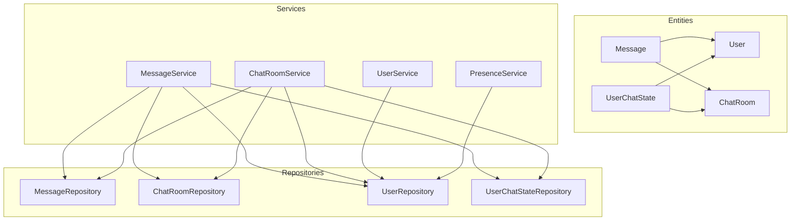
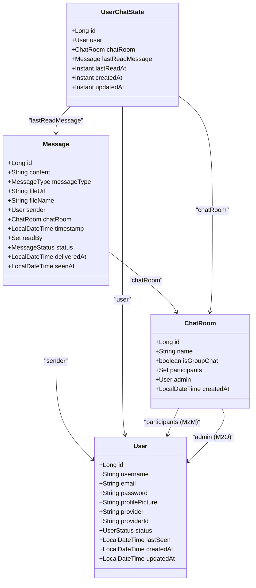
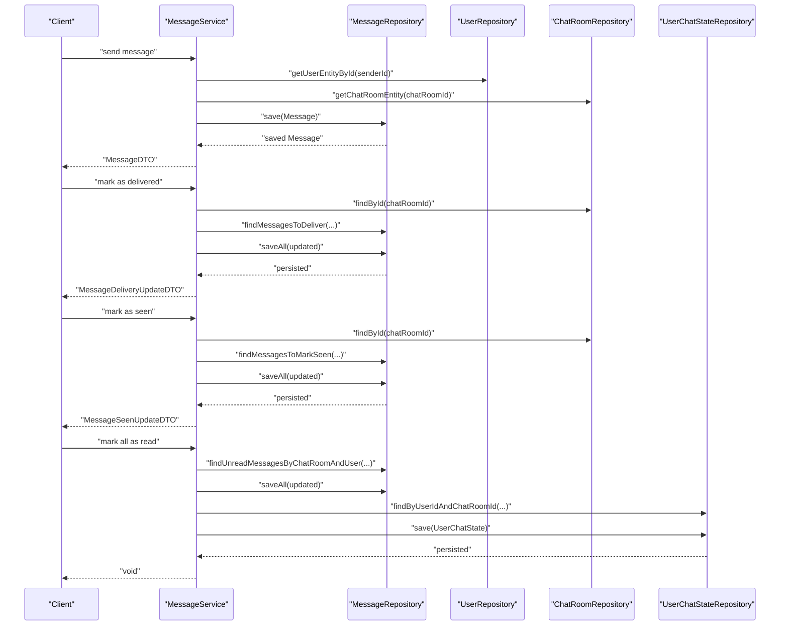
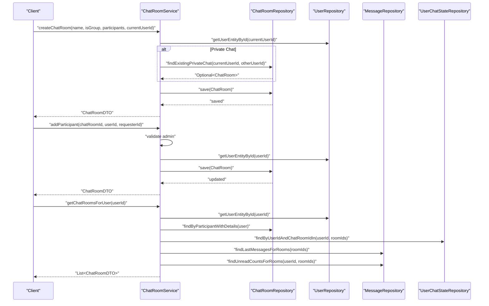
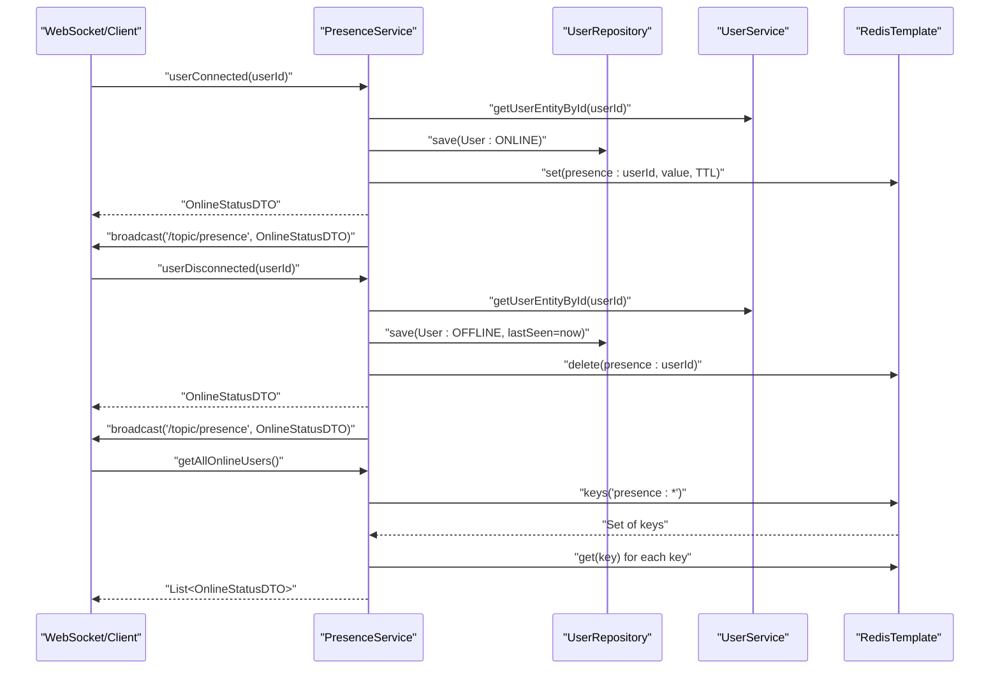
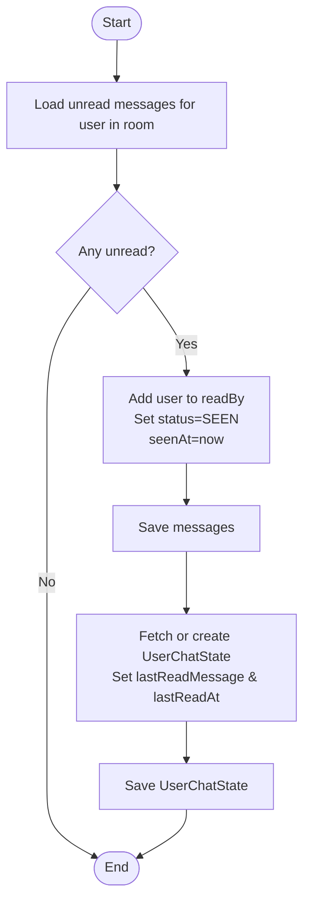
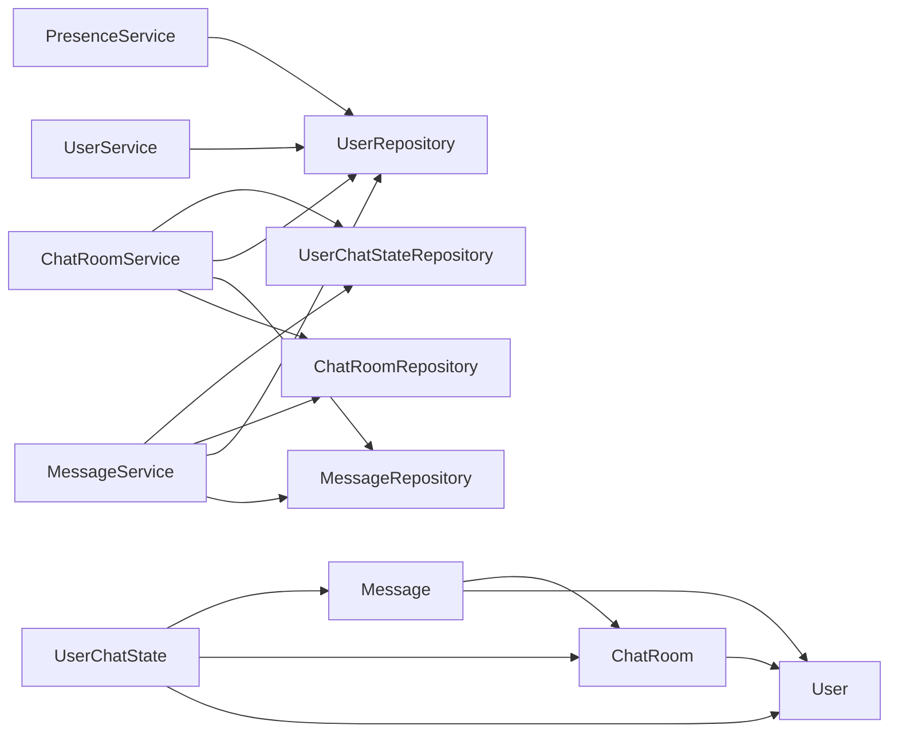

# Core Entity Definitions

<cite>
**Referenced Files in This Document**
- [Message.java](file://src/main/java/com/chatify/chat_backend/entity/Message.java)
- [ChatRoom.java](file://src/main/java/com/chatify/chat_backend/entity/ChatRoom.java)
- [User.java](file://src/main/java/com/chatify/chat_backend/entity/User.java)
- [UserChatState.java](file://src/main/java/com/chatify/chat_backend/entity/UserChatState.java)
- [MessageStatus.java](file://src/main/java/com/chatify/chat_backend/entity/enums/MessageStatus.java)
- [MessageType.java](file://src/main/java/com/chatify/chat_backend/entity/enums/MessageType.java)
- [UserStatus.java](file://src/main/java/com/chatify/chat_backend/entity/enums/UserStatus.java)
- [MessageRepository.java](file://src/main/java/com/chatify/chat_backend/repository/MessageRepository.java)
- [ChatRoomRepository.java](file://src/main/java/com/chatify/chat_backend/repository/ChatRoomRepository.java)
- [UserRepository.java](file://src/main/java/com/chatify/chat_backend/repository/UserRepository.java)
- [UserChatStateRepository.java](file://src/main/java/com/chatify/chat_backend/repository/UserChatStateRepository.java)
- [MessageService.java](file://src/main/java/com/chatify/chat_backend/service/MessageService.java)
- [ChatRoomService.java](file://src/main/java/com/chatify/chat_backend/service/ChatRoomService.java)
- [UserService.java](file://src/main/java/com/chatify/chat_backend/service/UserService.java)
- [PresenceService.java](file://src/main/java/com/chatify/chat_backend/service/PresenceService.java)
- [MessageDTO.java](file://src/main/java/com/chatify/chat_backend/dto/MessageDTO.java)
- [ChatRoomDTO.java](file://src/main/java/com/chatify/chat_backend/dto/ChatRoomDTO.java)
- [UserDTO.java](file://src/main/java/com/chatify/chat_backend/dto/UserDTO.java)
</cite>

## Table of Contents
1. [Introduction](#introduction)
2. [Project Structure](#project-structure)
3. [Core Components](#core-components)
4. [Architecture Overview](#architecture-overview)
5. [Detailed Component Analysis](#detailed-component-analysis)
6. [Dependency Analysis](#dependency-analysis)
7. [Performance Considerations](#performance-considerations)
8. [Troubleshooting Guide](#troubleshooting-guide)
9. [Conclusion](#conclusion)

## Introduction
This document defines the core database entities in the Chatify application and explains their relationships, constraints, and usage patterns. It covers:
- Message: content, type, timestamps, delivery/read status, file attachments, and read receipts
- ChatRoom: room metadata, group/private mode, participants, and admin
- User: authentication fields, OAuth2 provider integration, profile, status, and timestamps
- UserChatState: user presence and per-room read state tracking

It also documents JPA annotations, indexing and performance strategies, query optimization patterns, and sample data instances.

## Project Structure
The entities are located under the entity package and are supported by repositories, services, and DTOs for data transfer and presentation.

**Diagram sources**
- [Message.java:13-68](file://src/main/java/com/chatify/chat_backend/entity/Message.java#L13-L68)
- [ChatRoom.java:11-44](file://src/main/java/com/chatify/chat_backend/entity/ChatRoom.java#L11-L44)
- [User.java:11-56](file://src/main/java/com/chatify/chat_backend/entity/User.java#L11-L56)
- [UserChatState.java:14-64](file://src/main/java/com/chatify/chat_backend/entity/UserChatState.java#L14-L64)
- [MessageRepository.java:17-111](file://src/main/java/com/chatify/chat_backend/repository/MessageRepository.java#L17-L111)
- [ChatRoomRepository.java:13-51](file://src/main/java/com/chatify/chat_backend/repository/ChatRoomRepository.java#L13-L51)
- [UserRepository.java:13-31](file://src/main/java/com/chatify/chat_backend/repository/UserRepository.java#L13-L31)
- [UserChatStateRepository.java:11-25](file://src/main/java/com/chatify/chat_backend/repository/UserChatStateRepository.java#L11-L25)
- [MessageService.java:29-286](file://src/main/java/com/chatify/chat_backend/service/MessageService.java#L29-L286)
- [ChatRoomService.java:25-340](file://src/main/java/com/chatify/chat_backend/service/ChatRoomService.java#L25-L340)
- [UserService.java:18-129](file://src/main/java/com/chatify/chat_backend/service/UserService.java#L18-L129)
- [PresenceService.java:19-132](file://src/main/java/com/chatify/chat_backend/service/PresenceService.java#L19-L132)

**Section sources**
- [Message.java:13-68](file://src/main/java/com/chatify/chat_backend/entity/Message.java#L13-L68)
- [ChatRoom.java:11-44](file://src/main/java/com/chatify/chat_backend/entity/ChatRoom.java#L11-L44)
- [User.java:11-56](file://src/main/java/com/chatify/chat_backend/entity/User.java#L11-L56)
- [UserChatState.java:14-64](file://src/main/java/com/chatify/chat_backend/entity/UserChatState.java#L14-L64)

## Core Components
This section defines each entity’s fields, types, constraints, defaults, validations, and JPA annotations.

### Message Entity
- Purpose: Stores chat messages with content, type, sender, associated chat room, timestamps, delivery/read status, and optional file attachments.
- Field definitions and constraints:
  - id: Long, primary key, auto-generated
  - content: String (TEXT), not null; stores message body
  - messageType: MessageType enum (STRING), not null, default TEXT
  - fileUrl: String, nullable; URL to file attachment
  - fileName: String, nullable; original filename
  - sender: ManyToOne(User), not null, foreign key sender_id
  - chatRoom: ManyToOne(ChatRoom), not null, foreign key chat_room_id
  - timestamp: LocalDateTime, CreationTimestamp, updatable=false
  - readBy: ManyToMany(Set<User>), lazy fetch, join table message_read_by
  - status: MessageStatus enum (STRING), not null
  - deliveredAt: LocalDateTime, nullable
  - seenAt: LocalDateTime, nullable
- JPA annotations and purpose:
  - @Entity, @Table(name="messages"): entity mapping
  - @Id, @GeneratedValue: identity primary key
  - @Enumerated(EnumType.STRING): persist enums as strings
  - @CreationTimestamp: automatically set creation time
  - @ManyToOne(fetch=LAZY): lazy loading for sender and chatRoom
  - @ManyToMany with @JoinTable: many-to-many read receipts
  - @Column: define nullability, defaults, and column definitions
- Validation rules:
  - At least one of content or fileUrl must be present when sending
  - Sender must belong to the chat room
- Sample data instance:
  - id: 1001
  - content: "Hello there!"
  - messageType: TEXT
  - fileUrl: null
  - fileName: null
  - senderId: 42
  - chatRoomId: 5
  - status: SENT
  - timestamp: 2025-06-01T10:00:00
  - deliveredAt: null
  - seenAt: null
  - readBy: [42, 101]

**Section sources**
- [Message.java:13-68](file://src/main/java/com/chatify/chat_backend/entity/Message.java#L13-L68)
- [MessageStatus.java:3-7](file://src/main/java/com/chatify/chat_backend/entity/enums/MessageStatus.java#L3-L7)
- [MessageType.java:3-7](file://src/main/java/com/chatify/chat_backend/entity/enums/MessageType.java#L3-L7)
- [MessageService.java:50-78](file://src/main/java/com/chatify/chat_backend/service/MessageService.java#L50-L78)

### ChatRoom Entity
- Purpose: Represents a conversation room (private or group), with metadata and membership.
- Field definitions and constraints:
  - id: Long, primary key, auto-generated
  - name: String, nullable; room/group name
  - isGroupChat: boolean, not null, default false
  - participants: ManyToMany(Set<User>), lazy fetch, join table chat_room_participants
  - admin: ManyToOne(User), nullable; room admin (group chats only)
  - createdAt: LocalDateTime, CreationTimestamp, updatable=false
- JPA annotations and purpose:
  - @Entity, @Table(name="chat_rooms"): entity mapping
  - @ManyToMany with @JoinTable: participants relationship
  - @ManyToOne: admin reference
  - @CreationTimestamp: creation time
- Validation rules:
  - Private chat must have exactly one other participant besides the creator
  - Group chat must have at least one participant
  - Only admins can add/remove participants in group chats
- Sample data instance:
  - id: 5
  - name: "Team Alpha"
  - isGroupChat: true
  - adminId: 42
  - createdAt: 2025-05-20T09:15:00
  - participantIds: [42, 101, 102]

**Section sources**
- [ChatRoom.java:11-44](file://src/main/java/com/chatify/chat_backend/entity/ChatRoom.java#L11-L44)
- [ChatRoomService.java:110-156](file://src/main/java/com/chatify/chat_backend/service/ChatRoomService.java#L110-L156)
- [ChatRoomRepository.java:16-47](file://src/main/java/com/chatify/chat_backend/repository/ChatRoomRepository.java#L16-L47)

### User Entity
- Purpose: Represents application users, including local and OAuth2 providers, profile info, and presence.
- Field definitions and constraints:
  - id: Long, primary key, auto-generated
  - username: String, not null, unique
  - email: String, not null, unique
  - password: String, nullable; present for local auth
  - profilePicture: String, nullable
  - provider: String, not null, default "local"; values include "local", "google"
  - providerId: String, nullable; external identifier (e.g., Google sub)
  - status: UserStatus enum (STRING), not null, default OFFLINE
  - lastSeen: LocalDateTime, nullable; last seen timestamp (set when going OFFLINE)
  - createdAt: LocalDateTime, CreationTimestamp, updatable=false
  - updatedAt: LocalDateTime, UpdateTimestamp
- JPA annotations and purpose:
  - @Entity, @Table(name="users"): entity mapping
  - @CreationTimestamp, @UpdateTimestamp: automatic timestamps
  - @Enumerated(EnumType.STRING): persist enums as strings
- Validation rules:
  - Unique username and email
  - Provider/providerId pair aligns with OAuth2 flow
- Sample data instance:
  - id: 42
  - username: "alex"
  - email: "alex@example.com"
  - password: "$2a$..." (bcrypt hash)
  - profilePicture: "https://example.com/avatars/42.png"
  - provider: "local"
  - providerId: null
  - status: ONLINE
  - lastSeen: 2025-06-01T09:45:00
  - createdAt: 2025-05-01T12:00:00
  - updatedAt: 2025-06-01T10:00:00

**Section sources**
- [User.java:11-56](file://src/main/java/com/chatify/chat_backend/entity/User.java#L11-L56)
- [UserStatus.java:3-7](file://src/main/java/com/chatify/chat_backend/entity/enums/UserStatus.java#L3-L7)
- [UserService.java:86-96](file://src/main/java/com/chatify/chat_backend/service/UserService.java#L86-L96)
- [PresenceService.java:50-81](file://src/main/java/com/chatify/chat_backend/service/PresenceService.java#L50-L81)

### UserChatState Entity
- Purpose: Tracks per-user, per-room read state, including last read message and timestamps.
- Field definitions and constraints:
  - id: Long, primary key, auto-generated
  - user: ManyToOne(User), not null
  - chatRoom: ManyToOne(ChatRoom), not null
  - lastReadMessage: ManyToOne(Message), nullable; last message considered read
  - lastReadAt: Instant, nullable; when lastReadMessage was set
  - createdAt: Instant, not null, immutable on create
  - updatedAt: Instant, not null, updated on change
- JPA annotations and purpose:
  - @Entity, @Table with unique constraint (user_id, chat_room_id): enforces one row per user-room
  - @ManyToOne: references to User and ChatRoom
  - @PrePersist/@PreUpdate: manage createdAt/updatedAt
- Validation rules:
  - Unique per user-room combination enforced by DB unique constraint
- Sample data instance:
  - id: 200
  - userId: 42
  - chatRoomId: 5
  - lastReadMessageId: 1005
  - lastReadAt: 2025-06-01T09:55:00Z
  - createdAt: 2025-06-01T09:30:00Z
  - updatedAt: 2025-06-01T09:55:00Z

**Section sources**
- [UserChatState.java:14-64](file://src/main/java/com/chatify/chat_backend/entity/UserChatState.java#L14-L64)
- [UserChatStateRepository.java:11-25](file://src/main/java/com/chatify/chat_backend/repository/UserChatStateRepository.java#L11-L25)

## Architecture Overview
The entities form a cohesive domain model with explicit relationships and constraints. Services orchestrate operations while repositories encapsulate queries. DTOs decouple persistence from API responses.

**Diagram sources**
- [Message.java:13-68](file://src/main/java/com/chatify/chat_backend/entity/Message.java#L13-L68)
- [ChatRoom.java:11-44](file://src/main/java/com/chatify/chat_backend/entity/ChatRoom.java#L11-L44)
- [User.java:11-56](file://src/main/java/com/chatify/chat_backend/entity/User.java#L11-L56)
- [UserChatState.java:14-64](file://src/main/java/com/chatify/chat_backend/entity/UserChatState.java#L14-L64)

## Detailed Component Analysis

### Message Delivery and Read Status Workflow
This sequence illustrates how messages move from sent to delivered to seen, and how read receipts and per-room read state are maintained.

**Diagram sources**
- [MessageService.java:50-78](file://src/main/java/com/chatify/chat_backend/service/MessageService.java#L50-L78)
- [MessageService.java:194-228](file://src/main/java/com/chatify/chat_backend/service/MessageService.java#L194-L228)
- [MessageService.java:230-269](file://src/main/java/com/chatify/chat_backend/service/MessageService.java#L230-L269)
- [MessageService.java:131-179](file://src/main/java/com/chatify/chat_backend/service/MessageService.java#L131-L179)
- [MessageRepository.java:26-59](file://src/main/java/com/chatify/chat_backend/repository/MessageRepository.java#L26-L59)

**Section sources**
- [MessageService.java:50-269](file://src/main/java/com/chatify/chat_backend/service/MessageService.java#L50-L269)
- [MessageRepository.java:26-59](file://src/main/java/com/chatify/chat_backend/repository/MessageRepository.java#L26-L59)

### Chat Room Membership and Group Management
This flow shows room creation, participant checks, and admin-only operations for group chats.

**Diagram sources**
- [ChatRoomService.java:110-156](file://src/main/java/com/chatify/chat_backend/service/ChatRoomService.java#L110-L156)
- [ChatRoomService.java:158-194](file://src/main/java/com/chatify/chat_backend/service/ChatRoomService.java#L158-L194)
- [ChatRoomService.java:50-100](file://src/main/java/com/chatify/chat_backend/service/ChatRoomService.java#L50-L100)
- [ChatRoomRepository.java:16-47](file://src/main/java/com/chatify/chat_backend/repository/ChatRoomRepository.java#L16-L47)

**Section sources**
- [ChatRoomService.java:110-194](file://src/main/java/com/chatify/chat_backend/service/ChatRoomService.java#L110-L194)
- [ChatRoomRepository.java:16-47](file://src/main/java/com/chatify/chat_backend/repository/ChatRoomRepository.java#L16-L47)

### User Presence and Status Updates
This flow shows how presence is tracked via Redis with a fallback to the database and broadcasts changes.

**Diagram sources**
- [PresenceService.java:105-132](file://src/main/java/com/chatify/chat_backend/service/PresenceService.java#L105-L132)
- [PresenceService.java:50-81](file://src/main/java/com/chatify/chat_backend/service/PresenceService.java#L50-L81)
- [UserService.java:86-96](file://src/main/java/com/chatify/chat_backend/service/UserService.java#L86-L96)

**Section sources**
- [PresenceService.java:50-132](file://src/main/java/com/chatify/chat_backend/service/PresenceService.java#L50-L132)
- [UserService.java:86-96](file://src/main/java/com/chatify/chat_backend/service/UserService.java#L86-L96)

### Message Read Receipts and Unread Counts
This flow shows how read receipts are recorded and how unread counts are computed efficiently.

**Diagram sources**
- [MessageService.java:131-179](file://src/main/java/com/chatify/chat_backend/service/MessageService.java#L131-L179)
- [MessageRepository.java:26-34](file://src/main/java/com/chatify/chat_backend/repository/MessageRepository.java#L26-L34)
- [UserChatStateRepository.java:13-13](file://src/main/java/com/chatify/chat_backend/repository/UserChatStateRepository.java#L13-L13)

**Section sources**
- [MessageService.java:131-179](file://src/main/java/com/chatify/chat_backend/service/MessageService.java#L131-L179)
- [MessageRepository.java:26-34](file://src/main/java/com/chatify/chat_backend/repository/MessageRepository.java#L26-L34)
- [UserChatStateRepository.java:13-13](file://src/main/java/com/chatify/chat_backend/repository/UserChatStateRepository.java#L13-L13)

## Dependency Analysis
- Entities:
  - Message depends on User (sender) and ChatRoom
  - UserChatState depends on User, ChatRoom, and optionally Message (lastReadMessage)
  - ChatRoom depends on User for participants and admin
- Repositories:
  - MessageRepository provides delivery/seen queries and unread computations
  - ChatRoomRepository provides membership and existence checks
  - UserRepository supports auth and presence
  - UserChatStateRepository provides per-user per-room state
- Services:
  - MessageService orchestrates send/read/delivery/seen flows
  - ChatRoomService manages rooms, membership, and batched DTO assembly
  - UserService and PresenceService handle user presence and caching
- DTOs:
  - MessageDTO, ChatRoomDTO, UserDTO decouple persistence from APIs

**Diagram sources**
- [Message.java:13-68](file://src/main/java/com/chatify/chat_backend/entity/Message.java#L13-L68)
- [ChatRoom.java:11-44](file://src/main/java/com/chatify/chat_backend/entity/ChatRoom.java#L11-L44)
- [User.java:11-56](file://src/main/java/com/chatify/chat_backend/entity/User.java#L11-L56)
- [UserChatState.java:14-64](file://src/main/java/com/chatify/chat_backend/entity/UserChatState.java#L14-L64)
- [MessageService.java:29-48](file://src/main/java/com/chatify/chat_backend/service/MessageService.java#L29-L48)
- [ChatRoomService.java:25-46](file://src/main/java/com/chatify/chat_backend/service/ChatRoomService.java#L25-L46)
- [UserService.java:18-25](file://src/main/java/com/chatify/chat_backend/service/UserService.java#L18-L25)
- [PresenceService.java:19-42](file://src/main/java/com/chatify/chat_backend/service/PresenceService.java#L19-L42)

**Section sources**
- [Message.java:13-68](file://src/main/java/com/chatify/chat_backend/entity/Message.java#L13-L68)
- [ChatRoom.java:11-44](file://src/main/java/com/chatify/chat_backend/entity/ChatRoom.java#L11-L44)
- [User.java:11-56](file://src/main/java/com/chatify/chat_backend/entity/User.java#L11-L56)
- [UserChatState.java:14-64](file://src/main/java/com/chatify/chat_backend/entity/UserChatState.java#L14-L64)
- [MessageService.java:29-48](file://src/main/java/com/chatify/chat_backend/service/MessageService.java#L29-L48)
- [ChatRoomService.java:25-46](file://src/main/java/com/chatify/chat_backend/service/ChatRoomService.java#L25-L46)
- [UserService.java:18-25](file://src/main/java/com/chatify/chat_backend/service/UserService.java#L18-L25)
- [PresenceService.java:19-42](file://src/main/java/com/chatify/chat_backend/service/PresenceService.java#L19-L42)

## Performance Considerations
- Indexing strategies:
  - Messages: composite index on (chat_room_id, timestamp) for chronological queries; indexes on (sender_id) and (status) for delivery/seen filtering
  - Chat rooms: indexes on (admin_id) and participant joins for membership queries
  - Users: indexes on (username) and (email) for auth and search
  - UserChatState: unique index on (user_id, chat_room_id) to prevent duplicates
- Query optimization patterns:
  - Batched DTO assembly in ChatRoomService reduces N+1 queries by fetching rooms, states, last messages, and unread counts in fixed queries
  - Native query for unread counts leverages JOIN with user_chat_state to avoid per-room loops
  - Lazy loading with JOIN FETCH prevents excessive round trips
- Caching:
  - UserService caches user DTOs by id and email to reduce DB load
  - PresenceService caches online status in Redis with TTL for fast retrieval and automatic cleanup
- Timestamps:
  - CreationTimestamp/UpdateTimestamp minimize application-side timestamp management
  - UserChatState uses Instant for precise last-read tracking

[No sources needed since this section provides general guidance]

## Troubleshooting Guide
- Unauthorized access:
  - Ensure the requesting user is a participant of the target chat room before performing operations
  - Verify admin permissions for group chat participant management
- Delivery/seen mismatches:
  - Confirm message status transitions follow SENT → DELIVERED → SEEN
  - Check deliveredAt and seenAt timestamps are populated during updates
- Read receipts not appearing:
  - Ensure the readBy set includes the user and status is updated to SEEN
  - Validate UserChatState lastReadMessage and lastReadAt are persisted
- Presence issues:
  - If Redis is unavailable, PresenceService falls back to DB; verify TTL and key patterns
  - Ensure broadcast endpoint "/topic/presence" is subscribed to by clients

**Section sources**
- [MessageService.java:62-64](file://src/main/java/com/chatify/chat_backend/service/MessageService.java#L62-L64)
- [ChatRoomService.java:162-168](file://src/main/java/com/chatify/chat_backend/service/ChatRoomService.java#L162-L168)
- [MessageService.java:194-228](file://src/main/java/com/chatify/chat_backend/service/MessageService.java#L194-L228)
- [MessageService.java:230-269](file://src/main/java/com/chatify/chat_backend/service/MessageService.java#L230-L269)
- [PresenceService.java:101-103](file://src/main/java/com/chatify/chat_backend/service/PresenceService.java#L101-L103)

## Conclusion
The Chatify domain model centers around four core entities with clear relationships and constraints. Services enforce business rules and optimize queries to deliver scalable chat functionality. JPA annotations and enums ensure consistent persistence and validation. With proper indexing, batched DTO assembly, and Redis-backed presence caching, the system supports efficient real-time messaging and user state management.