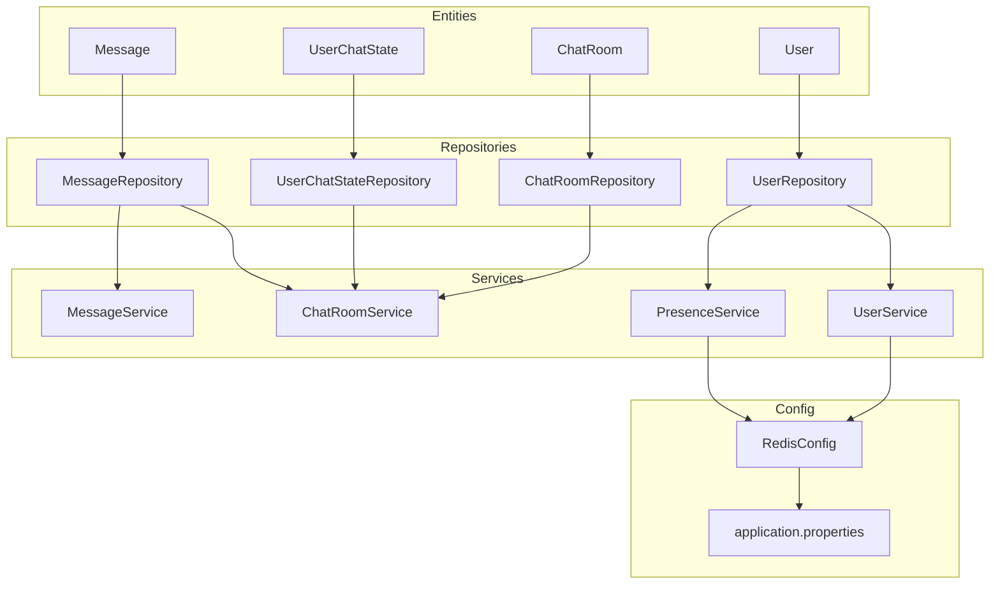
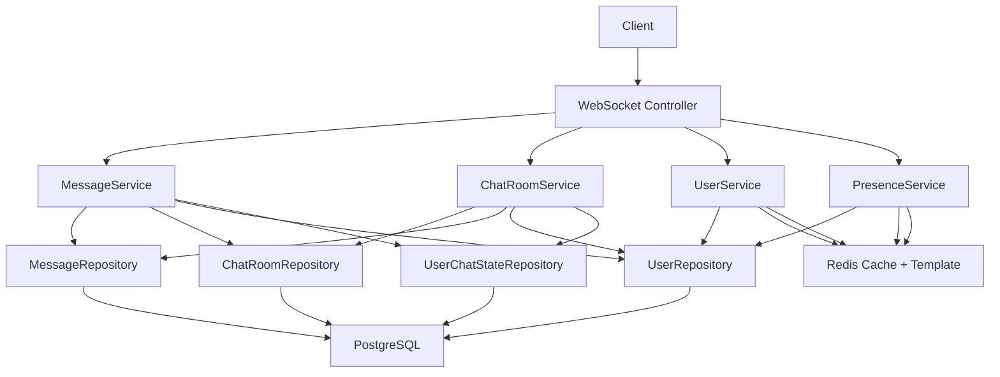
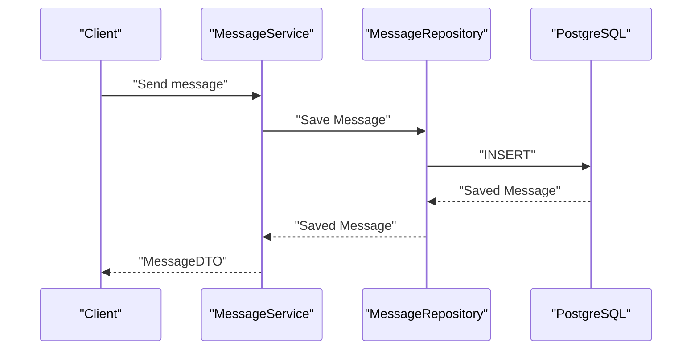
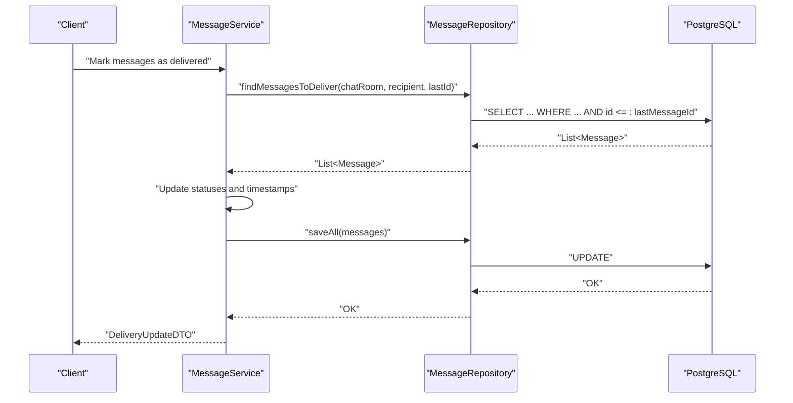
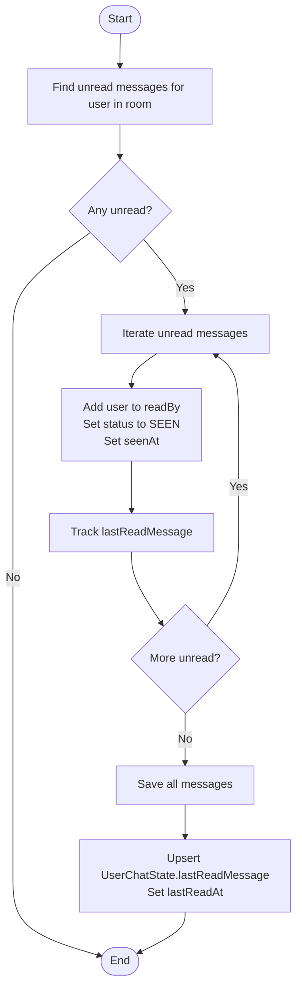
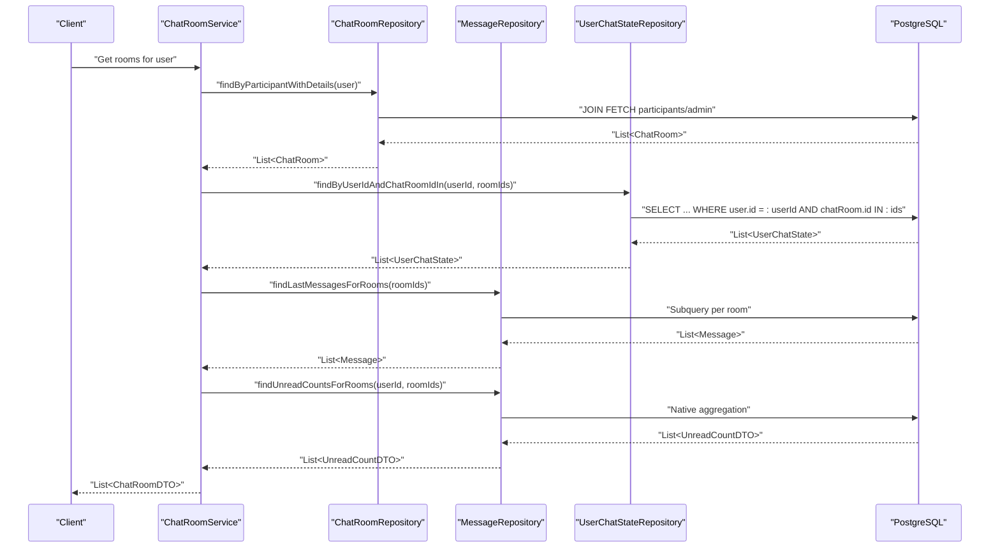
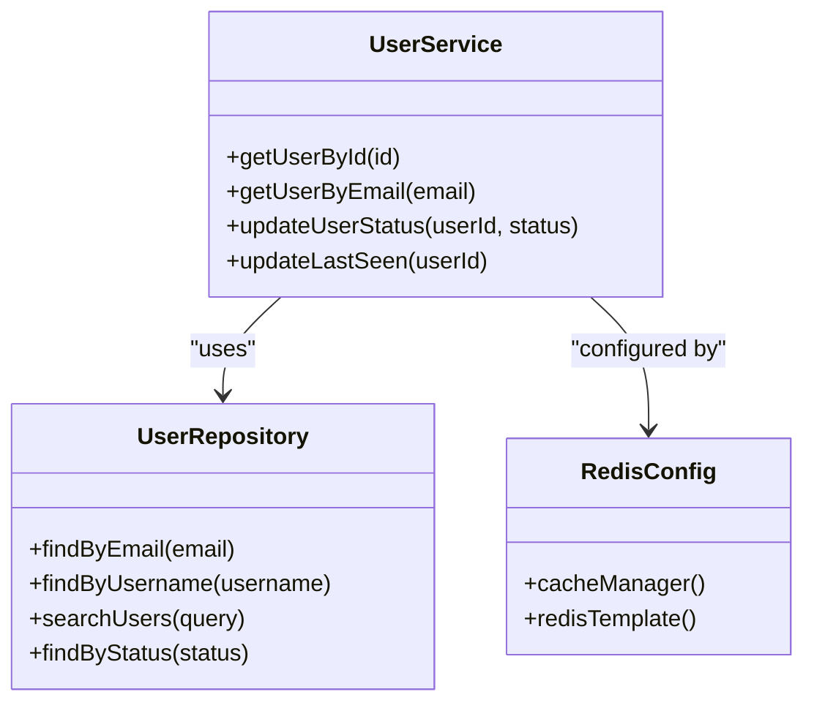
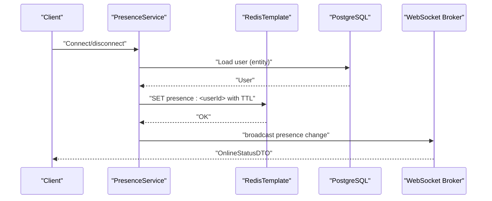
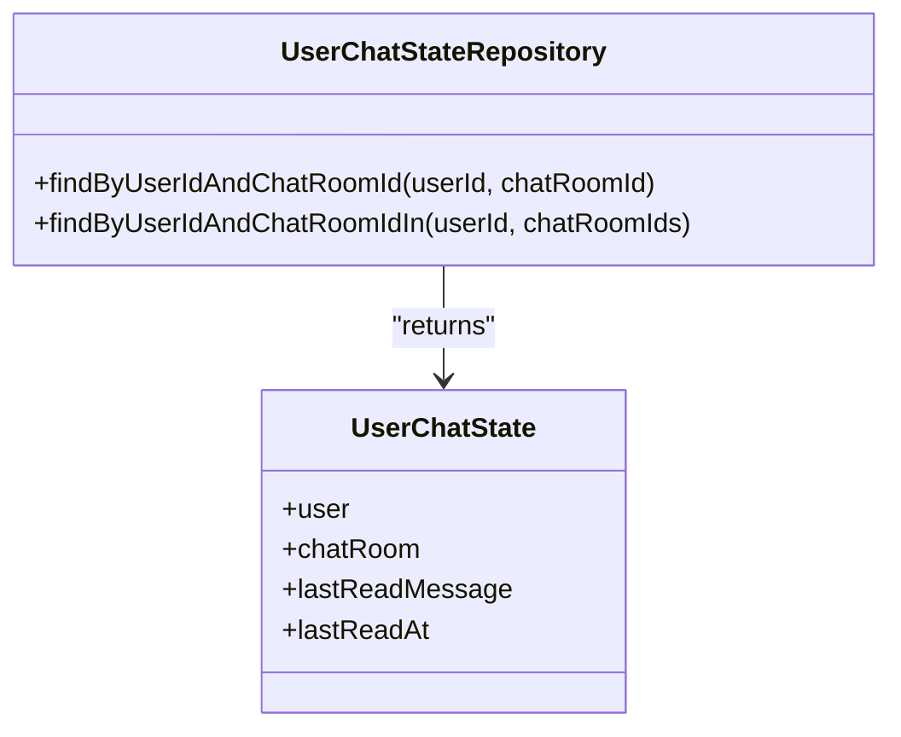
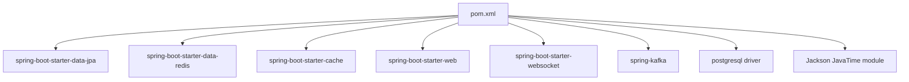

# Data Access Patterns and Performance

<cite>
**Referenced Files in This Document**
- [Message.java](file://src/main/java/com/chatify/chat_backend/entity/Message.java)
- [ChatRoom.java](file://src/main/java/com/chatify/chat_backend/entity/ChatRoom.java)
- [User.java](file://src/main/java/com/chatify/chat_backend/entity/User.java)
- [UserChatState.java](file://src/main/java/com/chatify/chat_backend/entity/UserChatState.java)
- [MessageRepository.java](file://src/main/java/com/chatify/chat_backend/repository/MessageRepository.java)
- [ChatRoomRepository.java](file://src/main/java/com/chatify/chat_backend/repository/ChatRoomRepository.java)
- [UserRepository.java](file://src/main/java/com/chatify/chat_backend/repository/UserRepository.java)
- [UserChatStateRepository.java](file://src/main/java/com/chatify/chat_backend/repository/UserChatStateRepository.java)
- [MessageService.java](file://src/main/java/com/chatify/chat_backend/service/MessageService.java)
- [ChatRoomService.java](file://src/main/java/com/chatify/chat_backend/service/ChatRoomService.java)
- [UserService.java](file://src/main/java/com/chatify/chat_backend/service/UserService.java)
- [PresenceService.java](file://src/main/java/com/chatify/chat_backend/service/PresenceService.java)
- [RedisConfig.java](file://src/main/java/com/chatify/chat_backend/config/RedisConfig.java)
- [application.properties](file://src/main/resources/application.properties)
- [pom.xml](file://pom.xml)
</cite>

## Table of Contents
1. [Introduction](#introduction)
2. [Project Structure](#project-structure)
3. [Core Components](#core-components)
4. [Architecture Overview](#architecture-overview)
5. [Detailed Component Analysis](#detailed-component-analysis)
6. [Dependency Analysis](#dependency-analysis)
7. [Performance Considerations](#performance-considerations)
8. [Troubleshooting Guide](#troubleshooting-guide)
9. [Conclusion](#conclusion)
10. [Appendices](#appendices)

## Introduction
This document analyzes the data access patterns and performance optimization strategies in the Chatify application. It focuses on JPA repository implementations for Message, ChatRoom, User, and UserChatState entities, covering custom query methods, pagination strategies, and indexing considerations. It also documents caching strategies using Redis for user presence, chat room metadata, and frequently accessed data, along with query optimization techniques such as eager vs lazy loading, batch fetching, and N+1 prevention. Transaction management, connection pooling, and database performance monitoring are addressed, including examples of complex queries for message history retrieval, unread message counts, and real-time presence updates. Finally, it covers data lifecycle management and scalability considerations for high-volume messaging scenarios.

## Project Structure
The backend follows a layered architecture:
- Entities define domain models with JPA mappings and lazy relationships.
- Repositories expose typed CRUD and custom JPQL/native queries.
- Services orchestrate transactions, enforce authorization, and optimize queries to prevent N+1.
- Configuration sets up Redis caching and database connectivity.

**Diagram sources**
- [Message.java:13-68](file://src/main/java/com/chatify/chat_backend/entity/Message.java#L13-L68)
- [ChatRoom.java:11-44](file://src/main/java/com/chatify/chat_backend/entity/ChatRoom.java#L11-L44)
- [User.java:11-56](file://src/main/java/com/chatify/chat_backend/entity/User.java#L11-L56)
- [UserChatState.java:14-64](file://src/main/java/com/chatify/chat_backend/entity/UserChatState.java#L14-L64)
- [MessageRepository.java:17-111](file://src/main/java/com/chatify/chat_backend/repository/MessageRepository.java#L17-L111)
- [ChatRoomRepository.java:13-51](file://src/main/java/com/chatify/chat_backend/repository/ChatRoomRepository.java#L13-L51)
- [UserRepository.java:13-31](file://src/main/java/com/chatify/chat_backend/repository/UserRepository.java#L13-L31)
- [UserChatStateRepository.java:11-25](file://src/main/java/com/chatify/chat_backend/repository/UserChatStateRepository.java#L11-L25)
- [MessageService.java:29-286](file://src/main/java/com/chatify/chat_backend/service/MessageService.java#L29-L286)
- [ChatRoomService.java:25-340](file://src/main/java/com/chatify/chat_backend/service/ChatRoomService.java#L25-L340)
- [UserService.java:18-129](file://src/main/java/com/chatify/chat_backend/service/UserService.java#L18-L129)
- [PresenceService.java:19-132](file://src/main/java/com/chatify/chat_backend/service/PresenceService.java#L19-L132)
- [RedisConfig.java:23-108](file://src/main/java/com/chatify/chat_backend/config/RedisConfig.java#L23-L108)
- [application.properties:1-75](file://src/main/resources/application.properties#L1-L75)

**Section sources**
- [Message.java:13-68](file://src/main/java/com/chatify/chat_backend/entity/Message.java#L13-L68)
- [ChatRoom.java:11-44](file://src/main/java/com/chatify/chat_backend/entity/ChatRoom.java#L11-L44)
- [User.java:11-56](file://src/main/java/com/chatify/chat_backend/entity/User.java#L11-L56)
- [UserChatState.java:14-64](file://src/main/java/com/chatify/chat_backend/entity/UserChatState.java#L14-L64)
- [MessageRepository.java:17-111](file://src/main/java/com/chatify/chat_backend/repository/MessageRepository.java#L17-L111)
- [ChatRoomRepository.java:13-51](file://src/main/java/com/chatify/chat_backend/repository/ChatRoomRepository.java#L13-L51)
- [UserRepository.java:13-31](file://src/main/java/com/chatify/chat_backend/repository/UserRepository.java#L13-L31)
- [UserChatStateRepository.java:11-25](file://src/main/java/com/chatify/chat_backend/repository/UserChatStateRepository.java#L11-L25)
- [MessageService.java:29-286](file://src/main/java/com/chatify/chat_backend/service/MessageService.java#L29-L286)
- [ChatRoomService.java:25-340](file://src/main/java/com/chatify/chat_backend/service/ChatRoomService.java#L25-L340)
- [UserService.java:18-129](file://src/main/java/com/chatify/chat_backend/service/UserService.java#L18-L129)
- [PresenceService.java:19-132](file://src/main/java/com/chatify/chat_backend/service/PresenceService.java#L19-L132)
- [RedisConfig.java:23-108](file://src/main/java/com/chatify/chat_backend/config/RedisConfig.java#L23-L108)
- [application.properties:1-75](file://src/main/resources/application.properties#L1-L75)

## Core Components
- Entities define relationships with lazy loading to avoid unnecessary joins and reduce payload sizes.
- Repositories encapsulate custom queries for message history, unread counts, delivery/seen transitions, and room membership.
- Services coordinate transactions, enforce authorization, and minimize round-trips via batched queries and pre-fetching.
- Redis-backed caching and presence tracking improve read performance and real-time status propagation.

Key repository methods and their roles:
- MessageRepository: paginated message retrieval, unread counting, delivery/seen updates, last message per room, and unread counts across rooms.
- ChatRoomRepository: participant-based room discovery, private chat deduplication, and room existence checks.
- UserRepository: identity and search queries with caching annotations.
- UserChatStateRepository: user-room read-state lookup and fetch with last-read message.

**Section sources**
- [MessageRepository.java:17-111](file://src/main/java/com/chatify/chat_backend/repository/MessageRepository.java#L17-L111)
- [ChatRoomRepository.java:13-51](file://src/main/java/com/chatify/chat_backend/repository/ChatRoomRepository.java#L13-L51)
- [UserRepository.java:13-31](file://src/main/java/com/chatify/chat_backend/repository/UserRepository.java#L13-L31)
- [UserChatStateRepository.java:11-25](file://src/main/java/com/chatify/chat_backend/repository/UserChatStateRepository.java#L11-L25)

## Architecture Overview
The data access stack integrates JPA repositories with Spring caching and Redis for performance. Services orchestrate transactions and query batching to prevent N+1 and reduce DB load.

**Diagram sources**
- [MessageService.java:29-286](file://src/main/java/com/chatify/chat_backend/service/MessageService.java#L29-L286)
- [ChatRoomService.java:25-340](file://src/main/java/com/chatify/chat_backend/service/ChatRoomService.java#L25-L340)
- [UserService.java:18-129](file://src/main/java/com/chatify/chat_backend/service/UserService.java#L18-L129)
- [PresenceService.java:19-132](file://src/main/java/com/chatify/chat_backend/service/PresenceService.java#L19-L132)
- [MessageRepository.java:17-111](file://src/main/java/com/chatify/chat_backend/repository/MessageRepository.java#L17-L111)
- [ChatRoomRepository.java:13-51](file://src/main/java/com/chatify/chat_backend/repository/ChatRoomRepository.java#L13-L51)
- [UserRepository.java:13-31](file://src/main/java/com/chatify/chat_backend/repository/UserRepository.java#L13-L31)
- [UserChatStateRepository.java:11-25](file://src/main/java/com/chatify/chat_backend/repository/UserChatStateRepository.java#L11-L25)
- [RedisConfig.java:23-108](file://src/main/java/com/chatify/chat_backend/config/RedisConfig.java#L23-L108)
- [application.properties:1-75](file://src/main/resources/application.properties#L1-L75)

## Detailed Component Analysis

### Message Repository and Service
MessageRepository defines:
- Sorting and pagination for message lists.
- Unread message retrieval and counting using collection member checks.
- Delivery and seen transitions with status updates and timestamps.
- Batched last message per room and unread counts per room via a native query aggregating across user_chat_state.

MessageService coordinates:
- Transactional send, read, delivery, and seen operations.
- Authorization checks against chat room participants.
- Efficient batch updates and last-read state synchronization.

**Diagram sources**
- [MessageService.java:50-78](file://src/main/java/com/chatify/chat_backend/service/MessageService.java#L50-L78)
- [MessageRepository.java:17-111](file://src/main/java/com/chatify/chat_backend/repository/MessageRepository.java#L17-L111)

**Diagram sources**
- [MessageService.java:194-228](file://src/main/java/com/chatify/chat_backend/service/MessageService.java#L194-L228)
- [MessageRepository.java:36-59](file://src/main/java/com/chatify/chat_backend/repository/MessageRepository.java#L36-L59)

**Diagram sources**
- [MessageService.java:132-179](file://src/main/java/com/chatify/chat_backend/service/MessageService.java#L132-L179)
- [MessageRepository.java:26-34](file://src/main/java/com/chatify/chat_backend/repository/MessageRepository.java#L26-L34)
- [UserChatStateRepository.java:11-25](file://src/main/java/com/chatify/chat_backend/repository/UserChatStateRepository.java#L11-L25)

Key repository methods and examples:
- Paginated retrieval: [MessageRepository.java:22](file://src/main/java/com/chatify/chat_backend/repository/MessageRepository.java#L22)
- Unread counting: [MessageRepository.java:31-34](file://src/main/java/com/chatify/chat_backend/repository/MessageRepository.java#L31-L34)
- Delivery/seen queries: [MessageRepository.java:36-59](file://src/main/java/com/chatify/chat_backend/repository/MessageRepository.java#L36-L59)
- Last message per room: [MessageRepository.java:84-94](file://src/main/java/com/chatify/chat_backend/repository/MessageRepository.java#L84-L94)
- Unread counts per room: [MessageRepository.java:97-111](file://src/main/java/com/chatify/chat_backend/repository/MessageRepository.java#L97-L111)

**Section sources**
- [MessageRepository.java:17-111](file://src/main/java/com/chatify/chat_backend/repository/MessageRepository.java#L17-L111)
- [MessageService.java:50-286](file://src/main/java/com/chatify/chat_backend/service/MessageService.java#L50-L286)

### ChatRoom Repository and Service
ChatRoomRepository provides:
- Participant-based room discovery with JOIN FETCH for eager loading of participants and admin.
- Private chat deduplication using group-by and having-count semantics.
- Room ID enumeration by participant and existence checks.

ChatRoomService optimizes room listing:
- Single-query fetch of rooms with participants/admin.
- Batch fetch of user chat states and last messages per room.
- Native query for unread counts across rooms, handling both null and populated last-read states.

**Diagram sources**
- [ChatRoomService.java:50-100](file://src/main/java/com/chatify/chat_backend/service/ChatRoomService.java#L50-L100)
- [ChatRoomRepository.java:16-26](file://src/main/java/com/chatify/chat_backend/repository/ChatRoomRepository.java#L16-L26)
- [UserChatStateRepository.java:15-24](file://src/main/java/com/chatify/chat_backend/repository/UserChatStateRepository.java#L15-L24)
- [MessageRepository.java:84-111](file://src/main/java/com/chatify/chat_backend/repository/MessageRepository.java#L84-L111)

Key repository methods and examples:
- Participant rooms with details: [ChatRoomRepository.java:16-22](file://src/main/java/com/chatify/chat_backend/repository/ChatRoomRepository.java#L16-L22)
- Private chat deduplication: [ChatRoomRepository.java:28-39](file://src/main/java/com/chatify/chat_backend/repository/ChatRoomRepository.java#L28-L39)
- Room IDs by participant: [ChatRoomRepository.java:41-42](file://src/main/java/com/chatify/chat_backend/repository/ChatRoomRepository.java#L41-L42)
- Existence check: [ChatRoomRepository.java:46-47](file://src/main/java/com/chatify/chat_backend/repository/ChatRoomRepository.java#L46-L47)
- Last message per room: [MessageRepository.java:84-94](file://src/main/java/com/chatify/chat_backend/repository/MessageRepository.java#L84-L94)
- Unread counts per room: [MessageRepository.java:97-111](file://src/main/java/com/chatify/chat_backend/repository/MessageRepository.java#L97-L111)

**Section sources**
- [ChatRoomRepository.java:13-51](file://src/main/java/com/chatify/chat_backend/repository/ChatRoomRepository.java#L13-L51)
- [ChatRoomService.java:25-340](file://src/main/java/com/chatify/chat_backend/service/ChatRoomService.java#L25-L340)

### User Repository and Caching
UserRepository supports:
- Identity lookups by email/username.
- Existence checks.
- Search by username or email substring.
- Status filtering.

UserService applies caching:
- @Cacheable on user DTO lookups by id and email with TTL configuration.
- @Caching eviction on status/lastSeen updates to keep cached DTOs fresh.
- Direct entity access methods bypass caching to avoid detached session issues.

**Diagram sources**
- [UserService.java:18-129](file://src/main/java/com/chatify/chat_backend/service/UserService.java#L18-L129)
- [UserRepository.java:13-31](file://src/main/java/com/chatify/chat_backend/repository/UserRepository.java#L13-L31)
- [RedisConfig.java:23-108](file://src/main/java/com/chatify/chat_backend/config/RedisConfig.java#L23-L108)

Key repository methods and examples:
- Email/username lookups: [UserRepository.java:16-22](file://src/main/java/com/chatify/chat_backend/repository/UserRepository.java#L16-L22)
- Search: [UserRepository.java:24-26](file://src/main/java/com/chatify/chat_backend/repository/UserRepository.java#L24-L26)
- Status filter: [UserRepository.java:28](file://src/main/java/com/chatify/chat_backend/repository/UserRepository.java#L28)
- Caching annotations: [UserService.java:32-50](file://src/main/java/com/chatify/chat_backend/service/UserService.java#L32-L50)

**Section sources**
- [UserRepository.java:13-31](file://src/main/java/com/chatify/chat_backend/repository/UserRepository.java#L13-L31)
- [UserService.java:18-129](file://src/main/java/com/chatify/chat_backend/service/UserService.java#L18-L129)
- [RedisConfig.java:23-108](file://src/main/java/com/chatify/chat_backend/config/RedisConfig.java#L23-L108)

### Presence Tracking with Redis
PresenceService maintains user presence using Redis:
- TTL-based keys for online users with automatic expiry.
- Fast presence reads from Redis; fallback to DB for offline users.
- Broadcast of presence changes via WebSocket.

**Diagram sources**
- [PresenceService.java:49-115](file://src/main/java/com/chatify/chat_backend/service/PresenceService.java#L49-L115)
- [RedisConfig.java:46-66](file://src/main/java/com/chatify/chat_backend/config/RedisConfig.java#L46-L66)

Key implementation points:
- Presence key pattern and TTL: [PresenceService.java:27-33](file://src/main/java/com/chatify/chat_backend/service/PresenceService.java#L27-L33)
- Redis template configuration: [RedisConfig.java:46-66](file://src/main/java/com/chatify/chat_backend/config/RedisConfig.java#L46-L66)
- Online users scan: [PresenceService.java:117-131](file://src/main/java/com/chatify/chat_backend/service/PresenceService.java#L117-L131)

**Section sources**
- [PresenceService.java:19-132](file://src/main/java/com/chatify/chat_backend/service/PresenceService.java#L19-L132)
- [RedisConfig.java:23-108](file://src/main/java/com/chatify/chat_backend/config/RedisConfig.java#L23-L108)

### UserChatState Repository
UserChatStateRepository provides:
- Lookup by user and room id.
- Batch fetch of states for a user across multiple rooms with lastReadMessage eagerly fetched.

**Diagram sources**
- [UserChatStateRepository.java:11-25](file://src/main/java/com/chatify/chat_backend/repository/UserChatStateRepository.java#L11-L25)
- [UserChatState.java:14-64](file://src/main/java/com/chatify/chat_backend/entity/UserChatState.java#L14-L64)

**Section sources**
- [UserChatStateRepository.java:11-25](file://src/main/java/com/chatify/chat_backend/repository/UserChatStateRepository.java#L11-L25)
- [UserChatState.java:14-64](file://src/main/java/com/chatify/chat_backend/entity/UserChatState.java#L14-L64)

## Dependency Analysis
The application leverages Spring Boot starters for JPA, Redis, cache, and web. Dependencies include PostgreSQL JDBC driver, Jackson modules for JavaTime, and Kafka for event streaming.

**Diagram sources**
- [pom.xml:40-155](file://pom.xml#L40-L155)

**Section sources**
- [pom.xml:40-155](file://pom.xml#L40-L155)

## Performance Considerations
- Lazy vs eager loading:
  - Entities use lazy relationships to avoid unnecessary joins and reduce payload sizes. Services explicitly fetch associations where needed (e.g., ChatRoomRepository JOIN FETCH for participant/admin).
- N+1 prevention:
  - ChatRoomService performs four batched queries to pre-fetch rooms, user chat states, last messages, and unread counts, then maps DTOs in-memory without additional DB calls.
- Pagination:
  - MessageService uses Pageable for descending timestamp ordering to efficiently paginate message history.
- Caching:
  - Redis-backed cache manager with per-cache TTLs and JSON serialization for DTOs. UserService caches user DTOs by id and email; PresenceService uses TTL-based presence keys.
- Connection pooling and monitoring:
  - The project does not define explicit HikariCP settings in the provided configuration. Consider tuning pool size, timeouts, and leak detection in production environments.
- Query optimization:
  - Native SQL for unread counts aggregates across rooms efficiently.
  - Collection member checks (e.g., unread queries) avoid joins for membership testing.

[No sources needed since this section provides general guidance]

## Troubleshooting Guide
Common issues and mitigations:
- Unauthorized access to chat rooms:
  - Services validate participant membership before performing operations.
- Detached entity caching:
  - UserService avoids caching JPA entities directly; DTOs are cached with eviction on status/lastSeen updates.
- Presence staleness:
  - Presence keys expire automatically; fallback to DB ensures correctness.
- Excessive DB queries:
  - Use ChatRoomService’s batched approach for room listings; avoid repeated lazy-loading loops.

**Section sources**
- [MessageService.java:80-95](file://src/main/java/com/chatify/chat_backend/service/MessageService.java#L80-L95)
- [ChatRoomService.java:50-100](file://src/main/java/com/chatify/chat_backend/service/ChatRoomService.java#L50-L100)
- [UserService.java:32-50](file://src/main/java/com/chatify/chat_backend/service/UserService.java#L32-L50)
- [PresenceService.java:83-99](file://src/main/java/com/chatify/chat_backend/service/PresenceService.java#L83-L99)

## Conclusion
Chatify employs robust data access patterns centered on JPA repositories with custom queries, pagination, and batched pre-fetching to prevent N+1 and reduce DB load. Redis caching and TTL-based presence tracking enhance read performance and real-time status propagation. Transactions are scoped appropriately across services to maintain consistency. For production, consider explicit connection pool tuning and database indexing aligned with frequent query filters and sorts.

[No sources needed since this section summarizes without analyzing specific files]

## Appendices

### Configuration References
- Database and Redis properties: [application.properties:1-75](file://src/main/resources/application.properties#L1-L75)
- Redis cache manager and template beans: [RedisConfig.java:68-108](file://src/main/java/com/chatify/chat_backend/config/RedisConfig.java#L68-L108)

**Section sources**
- [application.properties:1-75](file://src/main/resources/application.properties#L1-L75)
- [RedisConfig.java:23-108](file://src/main/java/com/chatify/chat_backend/config/RedisConfig.java#L23-L108)