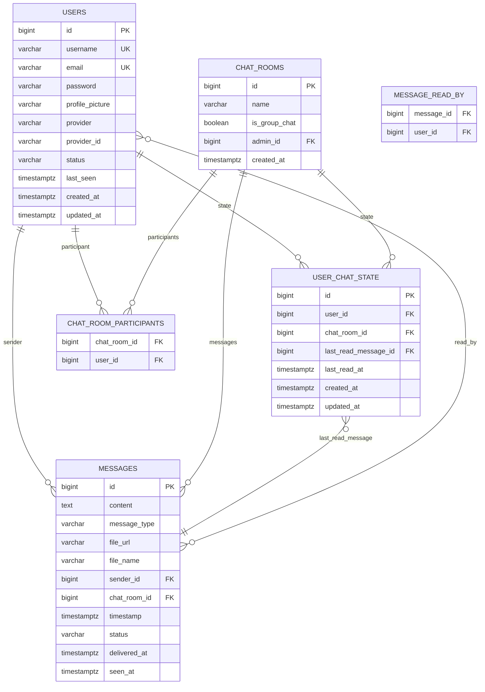
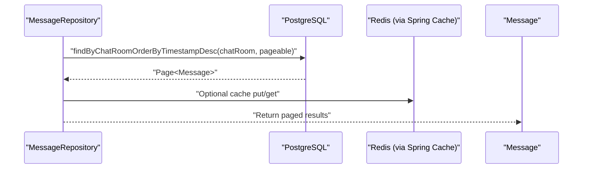
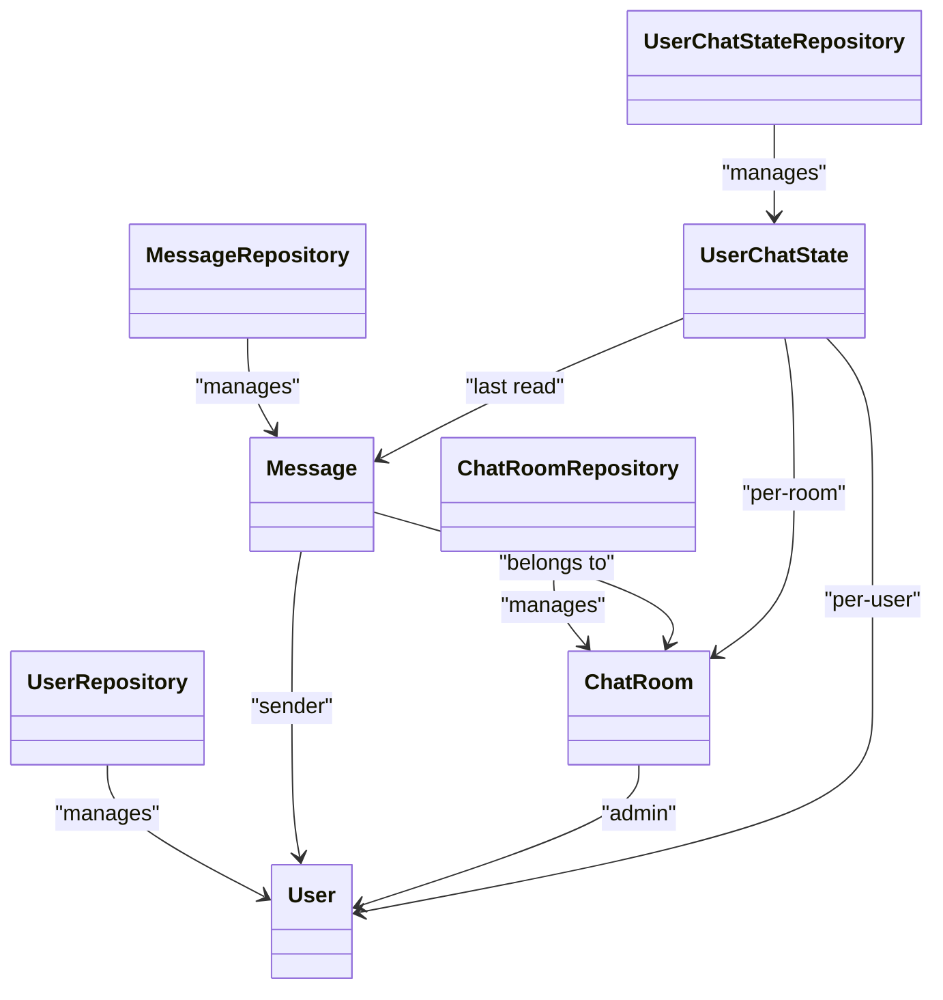

# Database Schema

<cite>
**Referenced Files in This Document**
- [Message.java](file://src/main/java/com/chatify/chat_backend/entity/Message.java)
- [ChatRoom.java](file://src/main/java/com/chatify/chat_backend/entity/ChatRoom.java)
- [User.java](file://src/main/java/com/chatify/chat_backend/entity/User.java)
- [UserChatState.java](file://src/main/java/com/chatify/chat_backend/entity/UserChatState.java)
- [MessageStatus.java](file://src/main/java/com/chatify/chat_backend/entity/enums/MessageStatus.java)
- [MessageType.java](file://src/main/java/com/chatify/chat_backend/entity/enums/MessageType.java)
- [MessageRepository.java](file://src/main/java/com/chatify/chat_backend/repository/MessageRepository.java)
- [ChatRoomRepository.java](file://src/main/java/com/chatify/chat_backend/repository/ChatRoomRepository.java)
- [UserRepository.java](file://src/main/java/com/chatify/chat_backend/repository/UserRepository.java)
- [UserChatStateRepository.java](file://src/main/java/com/chatify/chat_backend/repository/UserChatStateRepository.java)
- [application.properties](file://src/main/resources/application.properties)
</cite>

## Table of Contents
1. [Introduction](#introduction)
2. [Project Structure](#project-structure)
3. [Core Components](#core-components)
4. [Architecture Overview](#architecture-overview)
5. [Detailed Component Analysis](#detailed-component-analysis)
6. [Dependency Analysis](#dependency-analysis)
7. [Performance Considerations](#performance-considerations)
8. [Troubleshooting Guide](#troubleshooting-guide)
9. [Conclusion](#conclusion)
10. [Appendices](#appendices)

## Introduction
This document provides comprehensive data model documentation for the Chatify database schema. It focuses on the core entities Message, ChatRoom, User, and UserChatState, detailing their relationships, field definitions, data types, primary keys, foreign keys, indexes, and constraints. It also documents the enum types MessageStatus and MessageType, outlines data access patterns via JPA repositories, describes caching strategies with Redis integration, and highlights performance considerations for real-time messaging. Finally, it covers data lifecycle topics such as message retention, user data management, cleanup procedures, security requirements, access control patterns, audit trail considerations, and migration strategies for schema changes.

## Project Structure
The database schema is implemented using JPA entities mapped to PostgreSQL tables. Repositories define typed queries for efficient data access. Caching is enabled via Spring Cache backed by Redis. The application configuration defines database connectivity, Hibernate DDL behavior, and cache settings.

```mermaid
graph TB
subgraph "Entities"
U["User"]
CR["ChatRoom"]
M["Message"]
UCS["UserChatState"]
end
subgraph "Enums"
MS["MessageStatus"]
MT["MessageType"]
end
subgraph "Repositories"
UR["UserRepository"]
CRR["ChatRoomRepository"]
MR["MessageRepository"]
UCS_R["UserChatStateRepository"]
end
subgraph "Configuration"
AP["application.properties"]
end
U < --> |"participants"| CR
U < --> |"admin"| CR
U < --> |"sender"| M
CR < --> |"messages"| M
M < --> |"readBy"| U
UCS --> U
UCS --> CR
UCS --> M
M --- MS
M --- MT
UR --> U
CRR --> CR
MR --> M
UCS_R --> UCS
AP --> |"cache & db config"| UR
AP --> |"cache & db config"| CRR
AP --> |"cache & db config"| MR
AP --> |"cache & db config"| UCS_R
```

**Diagram sources**
- [User.java:18-56](file://src/main/java/com/chatify/chat_backend/entity/User.java#L18-L56)
- [ChatRoom.java:17-45](file://src/main/java/com/chatify/chat_backend/entity/ChatRoom.java#L17-L45)
- [Message.java:19-68](file://src/main/java/com/chatify/chat_backend/entity/Message.java#L19-L68)
- [UserChatState.java:25-65](file://src/main/java/com/chatify/chat_backend/entity/UserChatState.java#L25-L65)
- [MessageStatus.java:3-7](file://src/main/java/com/chatify/chat_backend/entity/enums/MessageStatus.java#L3-L7)
- [MessageType.java:3-7](file://src/main/java/com/chatify/chat_backend/entity/enums/MessageType.java#L3-L7)
- [UserRepository.java:14-31](file://src/main/java/com/chatify/chat_backend/repository/UserRepository.java#L14-L31)
- [ChatRoomRepository.java:14-51](file://src/main/java/com/chatify/chat_backend/repository/ChatRoomRepository.java#L14-L51)
- [MessageRepository.java:18-111](file://src/main/java/com/chatify/chat_backend/repository/MessageRepository.java#L18-L111)
- [UserChatStateRepository.java:11-25](file://src/main/java/com/chatify/chat_backend/repository/UserChatStateRepository.java#L11-L25)
- [application.properties:1-75](file://src/main/resources/application.properties#L1-L75)

**Section sources**
- [application.properties:1-75](file://src/main/resources/application.properties#L1-L75)

## Core Components
This section defines the core entities, their fields, data types, and constraints, and explains how they relate to each other.

- User
  - Purpose: Represents application users with authentication and presence metadata.
  - Primary Key: id (auto-generated)
  - Unique Constraints: username, email
  - Notable Columns: username, email, password, profilePicture, provider, providerId, status, lastSeen, timestamps
  - Enumerations: UserStatus (referenced via entity; defined in the entity package)
  - Timestamps: createdAt (insert-only), updatedAt (update-only)

- ChatRoom
  - Purpose: Represents chat rooms (private or group).
  - Primary Key: id (auto-generated)
  - Columns: name, isGroupChat (boolean), admin (optional), timestamps
  - Relationships: Many-to-many participants (User), many-to-one admin (User), many-to-one messages (Message)
  - Indexes/Constraints: None explicitly declared; uniqueness enforced by many-to-many mapping

- Message
  - Purpose: Stores individual messages sent in chat rooms.
  - Primary Key: id (auto-generated)
  - Columns: content (TEXT), messageType (ENUM), fileUrl, fileName, sender (required), chatRoom (required), timestamp (created automatically), readBy (many-to-many), status (ENUM), deliveredAt, seenAt
  - Enumerations: MessageStatus, MessageType
  - Timestamps: timestamp (insert-only)

- UserChatState
  - Purpose: Tracks per-user read state for each chat room (last read message and timestamps).
  - Primary Key: id (auto-generated)
  - Unique Constraint: (user_id, chat_room_id)
  - Foreign Keys: user_id, chat_room_id, last_read_message_id
  - Columns: lastReadMessage (optional), lastReadAt, createdAt, updatedAt
  - Lifecycle Hooks: PrePersist/PreUpdate set timestamps

**Section sources**
- [User.java:18-56](file://src/main/java/com/chatify/chat_backend/entity/User.java#L18-L56)
- [ChatRoom.java:17-45](file://src/main/java/com/chatify/chat_backend/entity/ChatRoom.java#L17-L45)
- [Message.java:19-68](file://src/main/java/com/chatify/chat_backend/entity/Message.java#L19-L68)
- [UserChatState.java:25-65](file://src/main/java/com/chatify/chat_backend/entity/UserChatState.java#L25-L65)
- [MessageStatus.java:3-7](file://src/main/java/com/chatify/chat_backend/entity/enums/MessageStatus.java#L3-L7)
- [MessageType.java:3-7](file://src/main/java/com/chatify/chat_backend/entity/enums/MessageType.java#L3-L7)

## Architecture Overview
The Chatify data model centers around Users, ChatRooms, Messages, and per-user read state. Relationships are:
- One-to-many: User to Message (sender), ChatRoom to Message
- Many-to-many: User to ChatRoom (participants)
- Many-to-one: Message to User (sender), Message to ChatRoom
- Many-to-one: UserChatState to User, ChatRoom, Message (last read message)



**Diagram sources**
- [User.java:18-56](file://src/main/java/com/chatify/chat_backend/entity/User.java#L18-L56)
- [ChatRoom.java:17-45](file://src/main/java/com/chatify/chat_backend/entity/ChatRoom.java#L17-L45)
- [Message.java:19-68](file://src/main/java/com/chatify/chat_backend/entity/Message.java#L19-L68)
- [UserChatState.java:25-65](file://src/main/java/com/chatify/chat_backend/entity/UserChatState.java#L25-L65)

## Detailed Component Analysis

### Entity Relationships and Field Definitions
- User
  - Unique constraints: username, email
  - Provider fields: provider, providerId support external authentication
  - Status and lastSeen enable presence tracking
- ChatRoom
  - isGroupChat distinguishes private vs group chats
  - admin references a User who manages the room
  - participants form a many-to-many relationship
- Message
  - messageType and status define content type and delivery/read states
  - readBy captures users who have read the message
  - sender and chatRoom establish ownership and grouping
- UserChatState
  - Composite unique constraint ensures one row per user-room pair
  - lastReadMessage links to the latest read message
  - createdAt/updatedAt maintained via lifecycle hooks

**Section sources**
- [User.java:18-56](file://src/main/java/com/chatify/chat_backend/entity/User.java#L18-L56)
- [ChatRoom.java:17-45](file://src/main/java/com/chatify/chat_backend/entity/ChatRoom.java#L17-L45)
- [Message.java:19-68](file://src/main/java/com/chatify/chat_backend/entity/Message.java#L19-L68)
- [UserChatState.java:25-65](file://src/main/java/com/chatify/chat_backend/entity/UserChatState.java#L25-L65)

### Enumerations
- MessageStatus: SENT, DELIVERED, SEEN
- MessageType: TEXT, IMAGE, VIDEO, FILE

These enums are persisted as strings and used across Message fields and queries.

**Section sources**
- [MessageStatus.java:3-7](file://src/main/java/com/chatify/chat_backend/entity/enums/MessageStatus.java#L3-L7)
- [MessageType.java:3-7](file://src/main/java/com/chatify/chat_backend/entity/enums/MessageType.java#L3-L7)

### Data Access Patterns with JPA Repositories
- MessageRepository
  - Paging and sorting by timestamp for chat history
  - Unread queries using collection membership checks
  - Delivery and seen marking queries scoped by chat room and last read message
  - Aggregation queries for unread counts and last messages per room
  - Native query for unread counts joining user_chat_state
- ChatRoomRepository
  - Fetch rooms with participant/admin details
  - Find existing private chat between two users
  - Retrieve room IDs by participant ID
  - Existence checks by participant
- UserRepository
  - Email/username lookup and existence checks
  - Search by username/email partial match
  - Filter by UserStatus
- UserChatStateRepository
  - Lookup by user and room
  - Bulk fetch by user and multiple rooms with lastReadMessage fetched



**Diagram sources**
- [MessageRepository.java:18-111](file://src/main/java/com/chatify/chat_backend/repository/MessageRepository.java#L18-L111)
- [application.properties:42-44](file://src/main/resources/application.properties#L42-L44)

**Section sources**
- [MessageRepository.java:18-111](file://src/main/java/com/chatify/chat_backend/repository/MessageRepository.java#L18-L111)
- [ChatRoomRepository.java:14-51](file://src/main/java/com/chatify/chat_backend/repository/ChatRoomRepository.java#L14-L51)
- [UserRepository.java:14-31](file://src/main/java/com/chatify/chat_backend/repository/UserRepository.java#L14-L31)
- [UserChatStateRepository.java:11-25](file://src/main/java/com/chatify/chat_backend/repository/UserChatStateRepository.java#L11-L25)

### Caching Strategy with Redis Integration
- Spring Cache is configured to use Redis with TTL and null-value caching disabled.
- Repositories and services can leverage @Cacheable/@CacheEvict annotations to cache frequently accessed data (e.g., user profiles, recent messages, room lists).
- For high-throughput scenarios, consider caching unread counts and last message previews per room per user.

**Section sources**
- [application.properties:42-44](file://src/main/resources/application.properties#L42-L44)

### Performance Considerations for Real-Time Messaging
- Indexing recommendations:
  - messages(chat_room_id, timestamp): for chronological pagination
  - messages(sender_id, timestamp): for sender-side history
  - messages(status, chat_room_id): for delivery/seen scans
  - user_chat_state(user_id, chat_room_id): composite PK already enforces uniqueness
  - chat_room_participants(chat_room_id, user_id): for fast participant checks
- Query patterns:
  - Prefer collection membership checks for unread counts
  - Use EXISTS/NATIVE queries for unread counts to avoid N+1
  - Batch reads for last messages per room
- Caching:
  - Cache recent messages and room summaries
  - Evict caches on write operations (new message, read receipts)
- Concurrency:
  - Use optimistic locking via @Version on entities if needed
  - Keep transactions short; avoid long-running queries during high load

[No sources needed since this section provides general guidance]

### Data Lifecycle: Retention, Cleanup, and Auditing
- Message retention:
  - Define retention policies (e.g., delete messages older than X days) via scheduled jobs or database policies.
  - Cascade deletes: ensure deletion of messages when a chat room is removed if applicable.
- User data:
  - Upon user deletion, remove associations (participants, admins) and optionally anonymize messages.
  - Respect privacy by purging sensitive fields after consent revocation.
- Cleanup procedures:
  - Periodic cleanup of expired refresh tokens and stale presence records.
  - Archive old messages to cold storage if needed.
- Audit trail:
  - Track administrative actions (room creation/deletion, role changes) in dedicated audit tables.
  - Log message delivery/seen events for compliance.

[No sources needed since this section provides general guidance]

### Data Security and Access Control
- Authentication and Authorization:
  - Enforce RBAC at the API level; ensure users can only access rooms they belong to.
  - Validate ownership for message edits/deletions.
- Data-at-rest:
  - Encrypt sensitive fields (passwords via bcrypt; file URLs via signed URLs).
- Data-in-transit:
  - Use HTTPS/TLS for all endpoints and internal communications.
- Privacy:
  - Implement GDPR-style controls: right to erasure, data portability, and access logs.

[No sources needed since this section provides general guidance]

### Migration Strategies and Version Management
- Database migrations:
  - Use Liquibase or Flyway for deterministic schema changes.
  - Keep DDL updates backward compatible; add indexes in separate changelogs.
- Enum changes:
  - Add new enum values cautiously; avoid removing existing ones to prevent runtime errors.
- Backward compatibility:
  - Introduce nullable columns for new fields; populate defaults via batch jobs.
  - Maintain stable APIs; version endpoints when breaking changes are unavoidable.

[No sources needed since this section provides general guidance]

## Dependency Analysis
This section maps repository dependencies and their relationships to entities.



**Diagram sources**
- [UserRepository.java:14-31](file://src/main/java/com/chatify/chat_backend/repository/UserRepository.java#L14-L31)
- [ChatRoomRepository.java:14-51](file://src/main/java/com/chatify/chat_backend/repository/ChatRoomRepository.java#L14-L51)
- [MessageRepository.java:18-111](file://src/main/java/com/chatify/chat_backend/repository/MessageRepository.java#L18-L111)
- [UserChatStateRepository.java:11-25](file://src/main/java/com/chatify/chat_backend/repository/UserChatStateRepository.java#L11-L25)
- [User.java:18-56](file://src/main/java/com/chatify/chat_backend/entity/User.java#L18-L56)
- [ChatRoom.java:17-45](file://src/main/java/com/chatify/chat_backend/entity/ChatRoom.java#L17-L45)
- [Message.java:19-68](file://src/main/java/com/chatify/chat_backend/entity/Message.java#L19-L68)
- [UserChatState.java:25-65](file://src/main/java/com/chatify/chat_backend/entity/UserChatState.java#L25-L65)

**Section sources**
- [MessageRepository.java:18-111](file://src/main/java/com/chatify/chat_backend/repository/MessageRepository.java#L18-L111)
- [ChatRoomRepository.java:14-51](file://src/main/java/com/chatify/chat_backend/repository/ChatRoomRepository.java#L14-L51)
- [UserRepository.java:14-31](file://src/main/java/com/chatify/chat_backend/repository/UserRepository.java#L14-L31)
- [UserChatStateRepository.java:11-25](file://src/main/java/com/chatify/chat_backend/repository/UserChatStateRepository.java#L11-L25)

## Performance Considerations
- Query optimization:
  - Use projection queries for unread counts and last messages to reduce payload size.
  - Leverage EXISTS for membership checks to minimize joins.
- Caching:
  - Cache room summaries, user profiles, and recent message previews.
  - Invalidate caches on write operations to maintain consistency.
- Asynchronous processing:
  - Offload heavy tasks (file uploads, analytics) to Kafka producers/consumers.
- Monitoring:
  - Track slow queries and cache miss rates; adjust TTL and eviction policies accordingly.

[No sources needed since this section provides general guidance]

## Troubleshooting Guide
- Common issues:
  - Missing indexes causing slow pagination or unread calculations.
  - Incorrect enum values leading to persistence failures.
  - Cache misconfiguration resulting in stale data.
- Diagnostics:
  - Enable SQL logging temporarily to inspect generated queries.
  - Verify Redis connectivity and TTL settings.
  - Monitor repository method execution times and cache hit ratios.

**Section sources**
- [application.properties:8-11](file://src/main/resources/application.properties#L8-L11)
- [application.properties:42-44](file://src/main/resources/application.properties#L42-L44)

## Conclusion
The Chatify database schema is designed around Users, ChatRooms, Messages, and per-user read state, with clear relationships and constraints. Enumerations provide strict typing for message states and content types. JPA repositories encapsulate complex queries for real-time messaging, while Redis-backed caching improves responsiveness. Proper indexing, caching strategies, and lifecycle management ensure scalability and reliability. Adhering to secure development practices and adopting structured migration strategies will sustain the system over time.

## Appendices

### Sample Data Examples
- User
  - id: auto-generated
  - username: unique
  - email: unique
  - provider/providerId: for OAuth
  - status: OFFLINE by default
- ChatRoom
  - id: auto-generated
  - name: optional
  - isGroupChat: false for private chat
  - admin: optional
- Message
  - id: auto-generated
  - content: TEXT
  - messageType: TEXT/IMAGE/VIDEO/FILE
  - status: SENT/DELIVERED/SEEN
  - sender: required
  - chatRoom: required
  - readBy: set of users
- UserChatState
  - user_id + chat_room_id: unique
  - lastReadMessage: optional
  - lastReadAt: timestamp
  - createdAt/updatedAt: managed by lifecycle hooks

[No sources needed since this section provides general guidance]