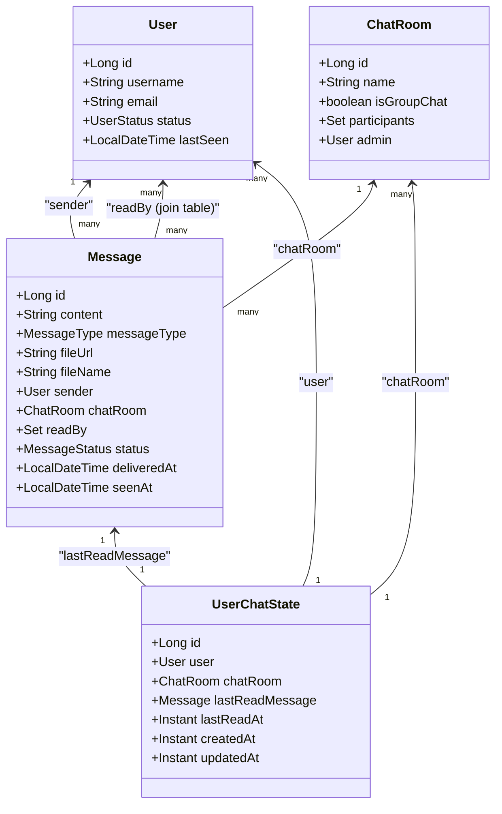
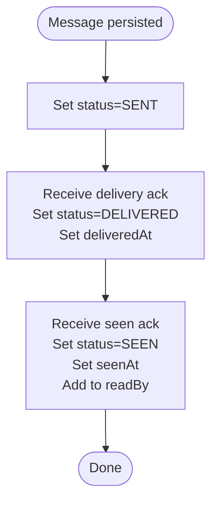
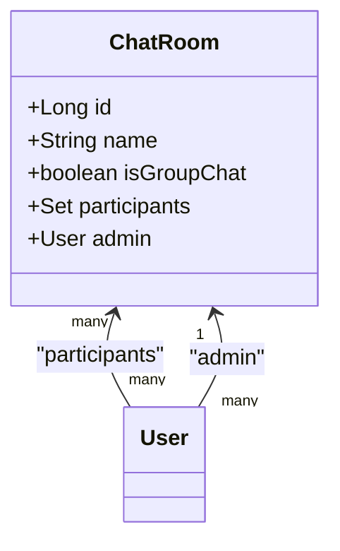
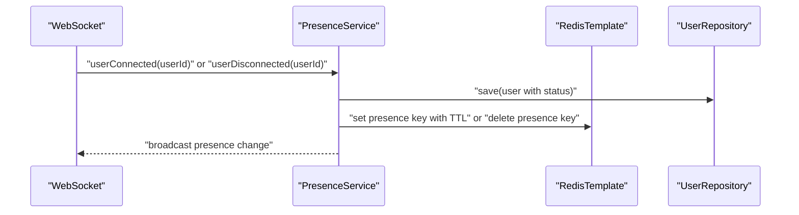
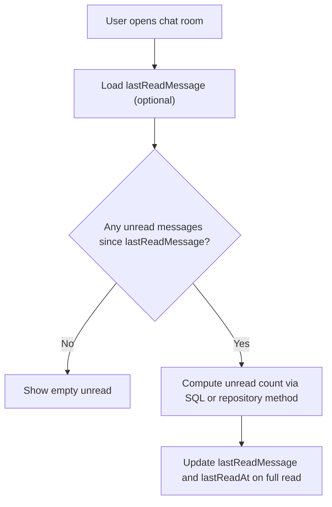
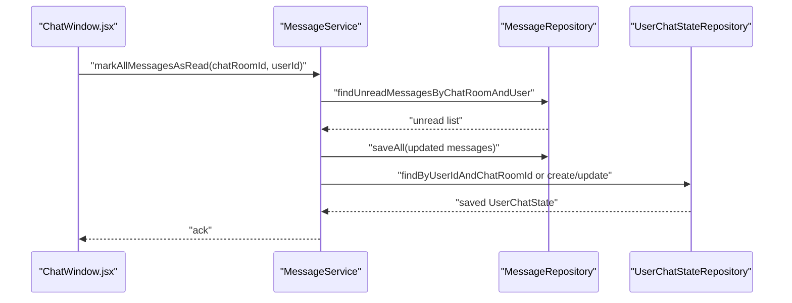
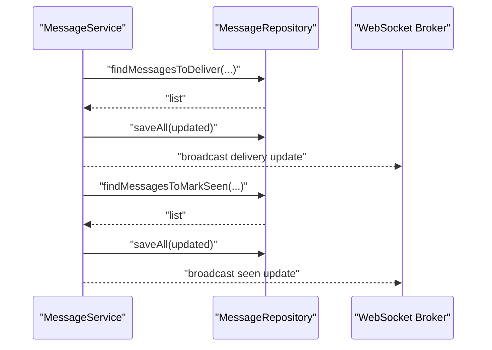
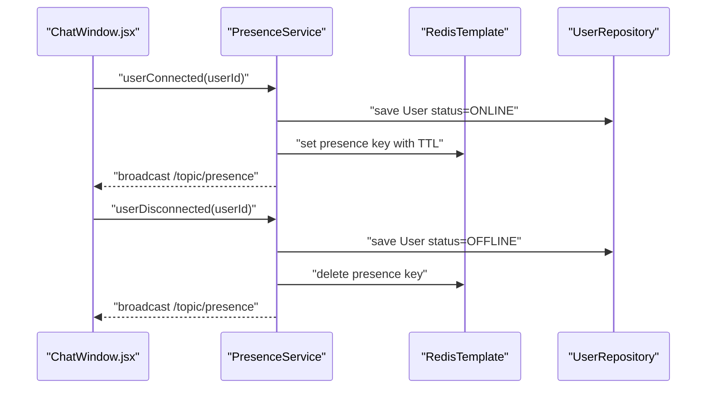
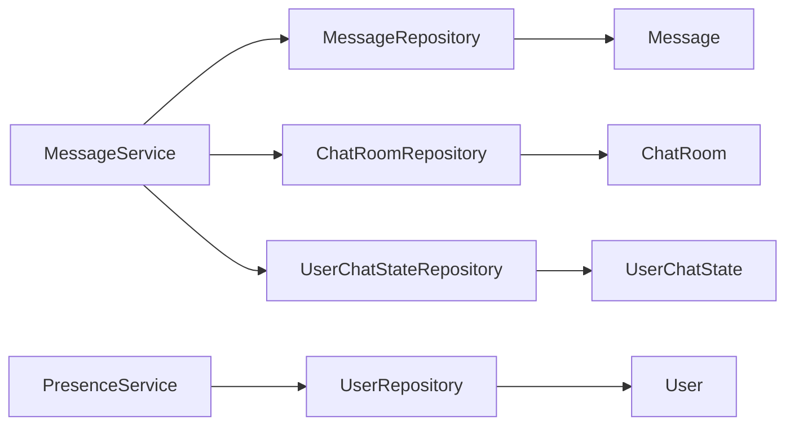

# Entity Relationships and Modeling

<cite>
**Referenced Files in This Document**
- [Message.java](file://src/main/java/com/chatify/chat_backend/entity/Message.java)
- [ChatRoom.java](file://src/main/java/com/chatify/chat_backend/entity/ChatRoom.java)
- [User.java](file://src/main/java/com/chatify/chat_backend/entity/User.java)
- [UserChatState.java](file://src/main/java/com/chatify/chat_backend/entity/UserChatState.java)
- [MessageRepository.java](file://src/main/java/com/chatify/chat_backend/repository/MessageRepository.java)
- [ChatRoomRepository.java](file://src/main/java/com/chatify/chat_backend/repository/ChatRoomRepository.java)
- [UserRepository.java](file://src/main/java/com/chatify/chat_backend/repository/UserRepository.java)
- [UserChatStateRepository.java](file://src/main/java/com/chatify/chat_backend/repository/UserChatStateRepository.java)
- [MessageService.java](file://src/main/java/com/chatify/chat_backend/service/MessageService.java)
- [PresenceService.java](file://src/main/java/com/chatify/chat_backend/service/PresenceService.java)
- [WebSocketConfig.java](file://src/main/java/com/chatify/chat_backend/config/WebSocketConfig.java)
- [MessageStatus.java](file://src/main/java/com/chatify/chat_backend/entity/enums/MessageStatus.java)
- [MessageType.java](file://src/main/java/com/chatify/chat_backend/entity/enums/MessageType.java)
- [UserStatus.java](file://src/main/java/com/chatify/chat_backend/entity/enums/UserStatus.java)
- [ChatWindow.jsx](file://chatify-frontend/src/components/Chat/ChatWindow.jsx)
</cite>

## Table of Contents
1. [Introduction](#introduction)
2. [Project Structure](#project-structure)
3. [Core Components](#core-components)
4. [Architecture Overview](#architecture-overview)
5. [Detailed Component Analysis](#detailed-component-analysis)
6. [Dependency Analysis](#dependency-analysis)
7. [Performance Considerations](#performance-considerations)
8. [Troubleshooting Guide](#troubleshooting-guide)
9. [Conclusion](#conclusion)
10. [Appendices](#appendices)

## Introduction
This document describes the entity relationship model for Chatify’s core messaging domain. It focuses on how Message, ChatRoom, User, and UserChatState relate to each other, including foreign key constraints, cascade behavior, bidirectional associations, and how these relationships enable real-time features such as read receipts, delivery/seen status, and presence tracking. It also covers lazy loading strategies, fetch types, and performance implications derived from the JPA/Hibernate mappings and Spring Data repositories.

## Project Structure
The relevant backend entities and repositories reside under the Java package com.chatify.chat_backend.entity and com.chatify.chat_backend.repository. Services orchestrate operations and enforce access control and state transitions. Frontend components consume WebSocket topics and HTTP APIs to render real-time updates.

```mermaid
graph TB
subgraph "Entities"
U["User"]
CR["ChatRoom"]
M["Message"]
UCS["UserChatState"]
end
subgraph "Repositories"
UR["UserRepository"]
CRR["ChatRoomRepository"]
MR["MessageRepository"]
UCS_R["UserChatStateRepository"]
end
subgraph "Services"
MS["MessageService"]
PS["PresenceService"]
end
subgraph "Frontend"
CW["ChatWindow.jsx"]
end
U <- --> M
CR <- --> M
U <- --> CR
U <- --> UCS
CR <- --> UCS
MS --> MR
MS --> CRR
MS --> UCS_R
PS --> UR
CW --> MS
```

**Diagram sources**
- [Message.java:1-69](file://src/main/java/com/chatify/chat_backend/entity/Message.java#L1-L69)
- [ChatRoom.java:1-45](file://src/main/java/com/chatify/chat_backend/entity/ChatRoom.java#L1-L45)
- [User.java:1-56](file://src/main/java/com/chatify/chat_backend/entity/User.java#L1-L56)
- [UserChatState.java:1-65](file://src/main/java/com/chatify/chat_backend/entity/UserChatState.java#L1-L65)
- [MessageRepository.java:1-111](file://src/main/java/com/chatify/chat_backend/repository/MessageRepository.java#L1-L111)
- [ChatRoomRepository.java:1-51](file://src/main/java/com/chatify/chat_backend/repository/ChatRoomRepository.java#L1-L51)
- [UserRepository.java:1-31](file://src/main/java/com/chatify/chat_backend/repository/UserRepository.java#L1-L31)
- [UserChatStateRepository.java:1-25](file://src/main/java/com/chatify/chat_backend/repository/UserChatStateRepository.java#L1-L25)
- [MessageService.java:1-286](file://src/main/java/com/chatify/chat_backend/service/MessageService.java#L1-L286)
- [PresenceService.java:1-132](file://src/main/java/com/chatify/chat_backend/service/PresenceService.java#L1-L132)
- [ChatWindow.jsx:1-295](file://chatify-frontend/src/components/Chat/ChatWindow.jsx#L1-L295)

**Section sources**
- [Message.java:1-69](file://src/main/java/com/chatify/chat_backend/entity/Message.java#L1-L69)
- [ChatRoom.java:1-45](file://src/main/java/com/chatify/chat_backend/entity/ChatRoom.java#L1-L45)
- [User.java:1-56](file://src/main/java/com/chatify/chat_backend/entity/User.java#L1-L56)
- [UserChatState.java:1-65](file://src/main/java/com/chatify/chat_backend/entity/UserChatState.java#L1-L65)
- [MessageRepository.java:1-111](file://src/main/java/com/chatify/chat_backend/repository/MessageRepository.java#L1-L111)
- [ChatRoomRepository.java:1-51](file://src/main/java/com/chatify/chat_backend/repository/ChatRoomRepository.java#L1-L51)
- [UserRepository.java:1-31](file://src/main/java/com/chatify/chat_backend/repository/UserRepository.java#L1-L31)
- [UserChatStateRepository.java:1-25](file://src/main/java/com/chatify/chat_backend/repository/UserChatStateRepository.java#L1-L25)
- [MessageService.java:1-286](file://src/main/java/com/chatify/chat_backend/service/MessageService.java#L1-L286)
- [PresenceService.java:1-132](file://src/main/java/com/chatify/chat_backend/service/PresenceService.java#L1-L132)
- [ChatWindow.jsx:1-295](file://chatify-frontend/src/components/Chat/ChatWindow.jsx#L1-L295)

## Core Components
- Message: Represents chat messages with sender, chat room, content, type, timestamps, and read receipts via a many-to-many association. It tracks delivery and seen statuses.
- ChatRoom: Represents chat rooms (private or group), with participants and an admin. Supports queries for room membership and existence checks.
- User: Represents users with credentials, profile info, and presence status.
- UserChatState: Tracks per-user per-room read state (last read message and timestamp), enforcing a unique constraint on (user_id, chat_room_id).

These entities are mapped with JPA/Hibernate and accessed via Spring Data repositories. Services coordinate operations and enforce authorization and state transitions.

**Section sources**
- [Message.java:1-69](file://src/main/java/com/chatify/chat_backend/entity/Message.java#L1-L69)
- [ChatRoom.java:1-45](file://src/main/java/com/chatify/chat_backend/entity/ChatRoom.java#L1-L45)
- [User.java:1-56](file://src/main/java/com/chatify/chat_backend/entity/User.java#L1-L56)
- [UserChatState.java:1-65](file://src/main/java/com/chatify/chat_backend/entity/UserChatState.java#L1-L65)

## Architecture Overview
The entity model supports real-time messaging through:
- Message read receipts via a join table (message_read_by) and per-room last-read tracking via UserChatState.
- Delivery/seen status transitions coordinated by MessageService and persisted in Message.
- Presence tracking via PresenceService using Redis for fast online status and fallback to database.



**Diagram sources**
- [Message.java:1-69](file://src/main/java/com/chatify/chat_backend/entity/Message.java#L1-L69)
- [ChatRoom.java:1-45](file://src/main/java/com/chatify/chat_backend/entity/ChatRoom.java#L1-L45)
- [User.java:1-56](file://src/main/java/com/chatify/chat_backend/entity/User.java#L1-L56)
- [UserChatState.java:1-65](file://src/main/java/com/chatify/chat_backend/entity/UserChatState.java#L1-L65)

## Detailed Component Analysis

### Message Entity
- Many-to-one to User (sender): enforced by a non-nullable sender_id foreign key.
- Many-to-one to ChatRoom: enforced by a non-nullable chat_room_id foreign key.
- Many-to-many to User via message_read_by join table: used for read receipts.
- Status lifecycle: SENT → DELIVERED → SEEN with timestamps.
- Timestamps: creation timestamp, deliveredAt, seenAt.



**Diagram sources**
- [Message.java:1-69](file://src/main/java/com/chatify/chat_backend/entity/Message.java#L1-L69)
- [MessageStatus.java:1-8](file://src/main/java/com/chatify/chat_backend/entity/enums/MessageStatus.java#L1-L8)
- [MessageService.java:194-269](file://src/main/java/com/chatify/chat_backend/service/MessageService.java#L194-L269)

**Section sources**
- [Message.java:39-67](file://src/main/java/com/chatify/chat_backend/entity/Message.java#L39-L67)
- [MessageStatus.java:1-8](file://src/main/java/com/chatify/chat_backend/entity/enums/MessageStatus.java#L1-L8)
- [MessageService.java:50-78](file://src/main/java/com/chatify/chat_backend/service/MessageService.java#L50-L78)
- [MessageService.java:194-269](file://src/main/java/com/chatify/chat_backend/service/MessageService.java#L194-L269)

### ChatRoom Entity
- Participants: many-to-many with User via chat_room_participants join table.
- Admin: many-to-one to User.
- Lazy fetch for associations to avoid unnecessary joins.



**Diagram sources**
- [ChatRoom.java:29-39](file://src/main/java/com/chatify/chat_backend/entity/ChatRoom.java#L29-L39)

**Section sources**
- [ChatRoom.java:29-39](file://src/main/java/com/chatify/chat_backend/entity/ChatRoom.java#L29-L39)
- [ChatRoomRepository.java:16-26](file://src/main/java/com/chatify/chat_backend/repository/ChatRoomRepository.java#L16-L26)

### User Entity
- Stores identity, credentials, provider info, status, and timestamps.
- Presence status is updated by PresenceService and broadcast via WebSocket.



**Diagram sources**
- [PresenceService.java:105-115](file://src/main/java/com/chatify/chat_backend/service/PresenceService.java#L105-L115)
- [WebSocketConfig.java:51-57](file://src/main/java/com/chatify/chat_backend/config/WebSocketConfig.java#L51-L57)

**Section sources**
- [User.java:1-56](file://src/main/java/com/chatify/chat_backend/entity/User.java#L1-L56)
- [UserStatus.java:1-8](file://src/main/java/com/chatify/chat_backend/entity/enums/UserStatus.java#L1-L8)
- [PresenceService.java:1-132](file://src/main/java/com/chatify/chat_backend/service/PresenceService.java#L1-L132)
- [WebSocketConfig.java:1-111](file://src/main/java/com/chatify/chat_backend/config/WebSocketConfig.java#L1-L111)

### UserChatState Entity
- Unique constraint on (user_id, chat_room_id) ensures one row per user-room pair.
- Tracks lastReadMessage and lastReadAt to compute unread counts efficiently.
- Left-join fetch in repository to avoid N+1 when loading user states.



**Diagram sources**
- [UserChatState.java:15-20](file://src/main/java/com/chatify/chat_backend/entity/UserChatState.java#L15-L20)
- [UserChatStateRepository.java:15-24](file://src/main/java/com/chatify/chat_backend/repository/UserChatStateRepository.java#L15-L24)
- [MessageRepository.java:63-72](file://src/main/java/com/chatify/chat_backend/repository/MessageRepository.java#L63-L72)

**Section sources**
- [UserChatState.java:15-50](file://src/main/java/com/chatify/chat_backend/entity/UserChatState.java#L15-L50)
- [UserChatStateRepository.java:1-25](file://src/main/java/com/chatify/chat_backend/repository/UserChatStateRepository.java#L1-L25)
- [MessageRepository.java:63-72](file://src/main/java/com/chatify/chat_backend/repository/MessageRepository.java#L63-L72)

### Read Receipts and Unread Counts
- Read receipts: Message.readBy maintains who has read a message.
- Unread computation: Repository methods filter messages where a user is not in readBy, or use UserChatState to compare lastReadMessageId.
- Full read: MessageService.markAllMessagesAsRead updates readBy and sets status to SEEN, then updates UserChatState.



**Diagram sources**
- [ChatWindow.jsx:79-80](file://chatify-frontend/src/components/Chat/ChatWindow.jsx#L79-L80)
- [MessageService.java:132-179](file://src/main/java/com/chatify/chat_backend/service/MessageService.java#L132-L179)
- [MessageRepository.java:26-34](file://src/main/java/com/chatify/chat_backend/repository/MessageRepository.java#L26-L34)
- [UserChatStateRepository.java:13-13](file://src/main/java/com/chatify/chat_backend/repository/UserChatStateRepository.java#L13-L13)

**Section sources**
- [MessageService.java:132-179](file://src/main/java/com/chatify/chat_backend/service/MessageService.java#L132-L179)
- [MessageRepository.java:26-34](file://src/main/java/com/chatify/chat_backend/repository/MessageRepository.java#L26-L34)
- [MessageRepository.java:63-72](file://src/main/java/com/chatify/chat_backend/repository/MessageRepository.java#L63-L72)
- [UserChatStateRepository.java:13-24](file://src/main/java/com/chatify/chat_backend/repository/UserChatStateRepository.java#L13-L24)

### Delivery and Seen Updates
- Delivery: MessageService.markMessagesAsDelivered updates SENT → DELIVERED and timestamps for messages up to a given ID.
- Seen: MessageService.markMessagesAsSeen updates DELIVERED → SEEN, timestamps, adds to readBy, and triggers read receipts.



**Diagram sources**
- [MessageService.java:194-228](file://src/main/java/com/chatify/chat_backend/service/MessageService.java#L194-L228)
- [MessageService.java:231-269](file://src/main/java/com/chatify/chat_backend/service/MessageService.java#L231-L269)
- [MessageRepository.java:36-59](file://src/main/java/com/chatify/chat_backend/repository/MessageRepository.java#L36-L59)

**Section sources**
- [MessageService.java:194-269](file://src/main/java/com/chatify/chat_backend/service/MessageService.java#L194-L269)
- [MessageRepository.java:36-59](file://src/main/java/com/chatify/chat_backend/repository/MessageRepository.java#L36-L59)

### Presence Tracking
- PresenceService writes User status to DB and stores a Redis key with TTL for ONLINE users.
- Broadcasts presence changes to clients via WebSocket topic.
- Frontend displays online/offline status and reacts to presence events.



**Diagram sources**
- [PresenceService.java:105-115](file://src/main/java/com/chatify/chat_backend/service/PresenceService.java#L105-L115)
- [WebSocketConfig.java:51-57](file://src/main/java/com/chatify/chat_backend/config/WebSocketConfig.java#L51-L57)
- [ChatWindow.jsx:212-239](file://chatify-frontend/src/components/Chat/ChatWindow.jsx#L212-L239)

**Section sources**
- [PresenceService.java:1-132](file://src/main/java/com/chatify/chat_backend/service/PresenceService.java#L1-L132)
- [WebSocketConfig.java:1-111](file://src/main/java/com/chatify/chat_backend/config/WebSocketConfig.java#L1-L111)
- [ChatWindow.jsx:212-239](file://chatify-frontend/src/components/Chat/ChatWindow.jsx#L212-L239)

## Dependency Analysis
- Message depends on User (sender) and ChatRoom; it also depends on User for readBy.
- ChatRoom depends on User for participants and admin.
- UserChatState depends on User, ChatRoom, and optionally Message (lastReadMessage).
- Repositories define query boundaries and fetch strategies (JOIN FETCH vs LAZY).
- Services orchestrate cross-entity operations and enforce access control.



**Diagram sources**
- [MessageRepository.java:1-111](file://src/main/java/com/chatify/chat_backend/repository/MessageRepository.java#L1-L111)
- [ChatRoomRepository.java:1-51](file://src/main/java/com/chatify/chat_backend/repository/ChatRoomRepository.java#L1-L51)
- [UserRepository.java:1-31](file://src/main/java/com/chatify/chat_backend/repository/UserRepository.java#L1-L31)
- [UserChatStateRepository.java:1-25](file://src/main/java/com/chatify/chat_backend/repository/UserChatStateRepository.java#L1-L25)
- [MessageService.java:1-286](file://src/main/java/com/chatify/chat_backend/service/MessageService.java#L1-L286)
- [PresenceService.java:1-132](file://src/main/java/com/chatify/chat_backend/service/PresenceService.java#L1-L132)

**Section sources**
- [MessageRepository.java:1-111](file://src/main/java/com/chatify/chat_backend/repository/MessageRepository.java#L1-L111)
- [ChatRoomRepository.java:1-51](file://src/main/java/com/chatify/chat_backend/repository/ChatRoomRepository.java#L1-L51)
- [UserRepository.java:1-31](file://src/main/java/com/chatify/chat_backend/repository/UserRepository.java#L1-L31)
- [UserChatStateRepository.java:1-25](file://src/main/java/com/chatify/chat_backend/repository/UserChatStateRepository.java#L1-L25)
- [MessageService.java:1-286](file://src/main/java/com/chatify/chat_backend/service/MessageService.java#L1-L286)
- [PresenceService.java:1-132](file://src/main/java/com/chatify/chat_backend/service/PresenceService.java#L1-L132)

## Performance Considerations
- Lazy loading and fetch types:
  - Entities use FetchType.LAZY for associations to minimize unnecessary joins and reduce payload sizes.
  - JOIN FETCH is selectively used in repositories (e.g., fetching participants/admin when listing rooms) to avoid N+1 queries during initialization.
- Read receipts and unread counts:
  - Using a dedicated join table (message_read_by) allows efficient set-based checks for unread messages.
  - UserChatState reduces repeated computation by caching last read position per user-room pair.
- Delivery/seen updates:
  - Repository queries target bounded ranges (up to lastMessageId) to limit work and avoid scanning entire histories.
- Presence:
  - Redis TTL-based caching provides O(1) presence reads and automatic cleanup on server failures.
- Pagination:
  - Message lists are paginated to control memory and network usage.

**Section sources**
- [Message.java:39-57](file://src/main/java/com/chatify/chat_backend/entity/Message.java#L39-L57)
- [ChatRoom.java:29-39](file://src/main/java/com/chatify/chat_backend/entity/ChatRoom.java#L29-L39)
- [UserChatState.java:31-41](file://src/main/java/com/chatify/chat_backend/entity/UserChatState.java#L31-L41)
- [MessageRepository.java:84-94](file://src/main/java/com/chatify/chat_backend/repository/MessageRepository.java#L84-L94)
- [ChatRoomRepository.java:16-22](file://src/main/java/com/chatify/chat_backend/repository/ChatRoomRepository.java#L16-L22)
- [MessageRepository.java:36-59](file://src/main/java/com/chatify/chat_backend/repository/MessageRepository.java#L36-L59)
- [PresenceService.java:67-78](file://src/main/java/com/chatify/chat_backend/service/PresenceService.java#L67-L78)

## Troubleshooting Guide
- Unauthorized access:
  - Services verify that the requesting user is a participant of the chat room before performing operations.
- Missing foreign keys:
  - Ensure sender_id and chat_room_id are set when persisting Message; violations cause constraint errors.
- Duplicate UserChatState:
  - Unique constraint prevents duplicate rows for (user_id, chat_room_id); handle creation/update atomically.
- Read receipts not updating:
  - Confirm that markMessageAsRead and markAllMessagesAsRead are invoked and that readBy is persisted.
- Delivery/seen gaps:
  - Verify repository queries for deliver/mark-seen are executed with correct chatRoomId and lastMessageId bounds.

**Section sources**
- [MessageService.java:62-64](file://src/main/java/com/chatify/chat_backend/service/MessageService.java#L62-L64)
- [MessageService.java:122-124](file://src/main/java/com/chatify/chat_backend/service/MessageService.java#L122-L124)
- [MessageService.java:139-141](file://src/main/java/com/chatify/chat_backend/service/MessageService.java#L139-L141)
- [UserChatState.java:17-19](file://src/main/java/com/chatify/chat_backend/entity/UserChatState.java#L17-L19)
- [MessageRepository.java:26-34](file://src/main/java/com/chatify/chat_backend/repository/MessageRepository.java#L26-L34)

## Conclusion
The Chatify entity model cleanly separates concerns: Message encapsulates content and delivery/seen state, ChatRoom manages membership and ownership, User tracks identity and presence, and UserChatState maintains per-user read positions. Together with targeted repository queries and lazy loading, the model supports scalable real-time messaging features while keeping data integrity and performance in mind.

## Appendices

### Relationship Summary and Constraints
- Message to User (sender): many-to-one; non-nullable sender_id.
- Message to ChatRoom: many-to-one; non-nullable chat_room_id.
- Message to User (readBy): many-to-many via message_read_by.
- ChatRoom to User (participants): many-to-many via chat_room_participants.
- ChatRoom to User (admin): many-to-one.
- UserChatState to User: many-to-one; unique (user_id, chat_room_id).
- UserChatState to ChatRoom: many-to-one; unique (user_id, chat_room_id).
- UserChatState to Message: many-to-one (lastReadMessage).

**Section sources**
- [Message.java:39-57](file://src/main/java/com/chatify/chat_backend/entity/Message.java#L39-L57)
- [ChatRoom.java:29-39](file://src/main/java/com/chatify/chat_backend/entity/ChatRoom.java#L29-L39)
- [UserChatState.java:15-41](file://src/main/java/com/chatify/chat_backend/entity/UserChatState.java#L15-L41)