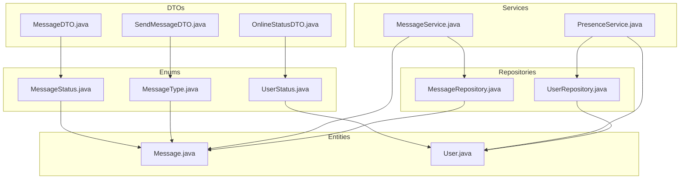
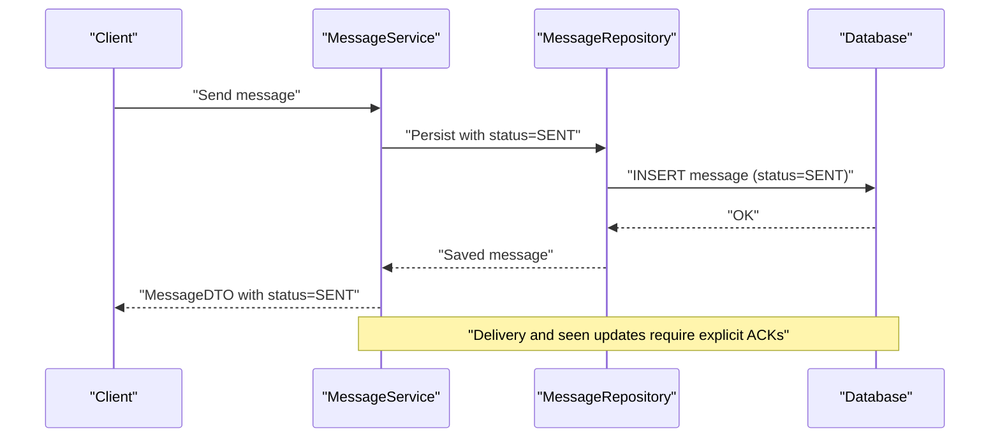
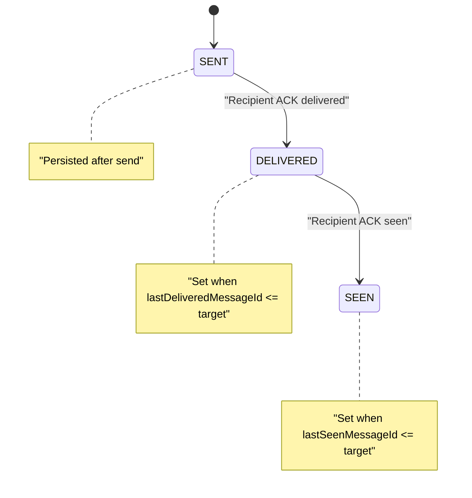
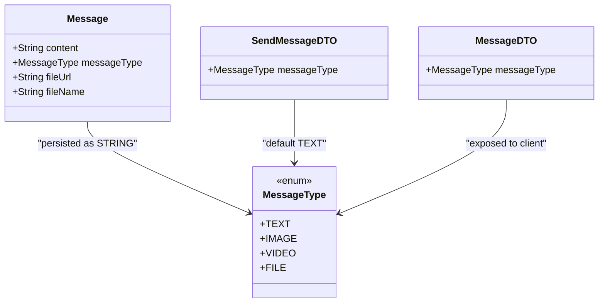
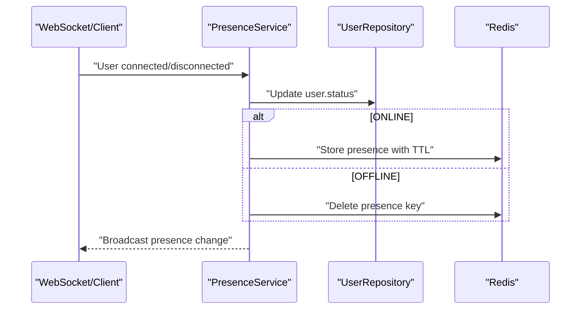
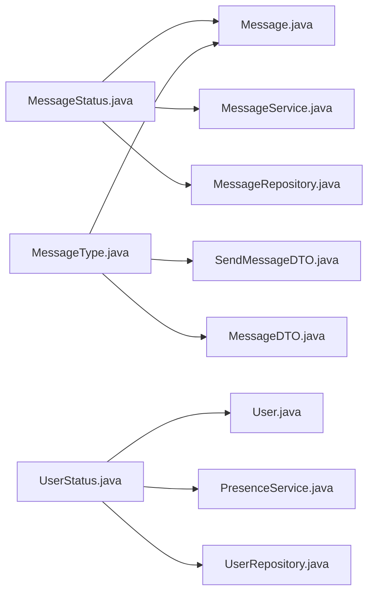

# Enum Types and Data Constraints

<cite>
**Referenced Files in This Document**
- [MessageStatus.java](file://src/main/java/com/chatify/chat_backend/entity/enums/MessageStatus.java)
- [MessageType.java](file://src/main/java/com/chatify/chat_backend/entity/enums/MessageType.java)
- [UserStatus.java](file://src/main/java/com/chatify/chat_backend/entity/enums/UserStatus.java)
- [Message.java](file://src/main/java/com/chatify/chat_backend/entity/Message.java)
- [User.java](file://src/main/java/com/chatify/chat_backend/entity/User.java)
- [MessageService.java](file://src/main/java/com/chatify/chat_backend/service/MessageService.java)
- [PresenceService.java](file://src/main/java/com/chatify/chat_backend/service/PresenceService.java)
- [MessageRepository.java](file://src/main/java/com/chatify/chat_backend/repository/MessageRepository.java)
- [UserRepository.java](file://src/main/java/com/chatify/chat_backend/repository/UserRepository.java)
- [MessageDTO.java](file://src/main/java/com/chatify/chat_backend/dto/MessageDTO.java)
- [SendMessageDTO.java](file://src/main/java/com/chatify/chat_backend/dto/SendMessageDTO.java)
- [OnlineStatusDTO.java](file://src/main/java/com/chatify/chat_backend/dto/OnlineStatusDTO.java)
- [MESSAGE_DELIVERY_DESIGN.md](file://MESSAGE_DELIVERY_DESIGN.md)
</cite>

## Table of Contents
1. [Introduction](#introduction)
2. [Project Structure](#project-structure)
3. [Core Components](#core-components)
4. [Architecture Overview](#architecture-overview)
5. [Detailed Component Analysis](#detailed-component-analysis)
6. [Dependency Analysis](#dependency-analysis)
7. [Performance Considerations](#performance-considerations)
8. [Troubleshooting Guide](#troubleshooting-guide)
9. [Conclusion](#conclusion)

## Introduction
This document defines the enum types that constrain data values across the Chatify application and explains their roles in the message delivery lifecycle, content-type handling, and user presence tracking. It specifies allowed values, defaults, persistence as strings, validation rules, state machine behaviors, and migration strategies for backward compatibility.

## Project Structure
Enums are located under the entity/enums package and are referenced by entities and services across the backend module. They influence persistence via JPA’s EnumType.STRING and are used in DTOs and repositories for validation and filtering.

**Diagram sources**
- [MessageStatus.java:1-8](file://src/main/java/com/chatify/chat_backend/entity/enums/MessageStatus.java#L1-L8)
- [MessageType.java:1-8](file://src/main/java/com/chatify/chat_backend/entity/enums/MessageType.java#L1-L8)
- [UserStatus.java:1-8](file://src/main/java/com/chatify/chat_backend/entity/enums/UserStatus.java#L1-L8)
- [Message.java:1-69](file://src/main/java/com/chatify/chat_backend/entity/Message.java#L1-L69)
- [User.java:1-56](file://src/main/java/com/chatify/chat_backend/entity/User.java#L1-L56)
- [MessageService.java:1-286](file://src/main/java/com/chatify/chat_backend/service/MessageService.java#L1-L286)
- [PresenceService.java:1-132](file://src/main/java/com/chatify/chat_backend/service/PresenceService.java#L1-L132)
- [MessageRepository.java:1-111](file://src/main/java/com/chatify/chat_backend/repository/MessageRepository.java#L1-L111)
- [UserRepository.java:1-31](file://src/main/java/com/chatify/chat_backend/repository/UserRepository.java#L1-L31)
- [MessageDTO.java:1-33](file://src/main/java/com/chatify/chat_backend/dto/MessageDTO.java#L1-L33)
- [SendMessageDTO.java:1-21](file://src/main/java/com/chatify/chat_backend/dto/SendMessageDTO.java#L1-L21)
- [OnlineStatusDTO.java:1-19](file://src/main/java/com/chatify/chat_backend/dto/OnlineStatusDTO.java#L1-L19)

**Section sources**
- [MessageStatus.java:1-8](file://src/main/java/com/chatify/chat_backend/entity/enums/MessageStatus.java#L1-L8)
- [MessageType.java:1-8](file://src/main/java/com/chatify/chat_backend/entity/enums/MessageType.java#L1-L8)
- [UserStatus.java:1-8](file://src/main/java/com/chatify/chat_backend/entity/enums/UserStatus.java#L1-L8)
- [Message.java:1-69](file://src/main/java/com/chatify/chat_backend/entity/Message.java#L1-L69)
- [User.java:1-56](file://src/main/java/com/chatify/chat_backend/entity/User.java#L1-L56)
- [MessageService.java:1-286](file://src/main/java/com/chatify/chat_backend/service/MessageService.java#L1-L286)
- [PresenceService.java:1-132](file://src/main/java/com/chatify/chat_backend/service/PresenceService.java#L1-L132)
- [MessageRepository.java:1-111](file://src/main/java/com/chatify/chat_backend/repository/MessageRepository.java#L1-L111)
- [UserRepository.java:1-31](file://src/main/java/com/chatify/chat_backend/repository/UserRepository.java#L1-L31)
- [MessageDTO.java:1-33](file://src/main/java/com/chatify/chat_backend/dto/MessageDTO.java#L1-L33)
- [SendMessageDTO.java:1-21](file://src/main/java/com/chatify/chat_backend/dto/SendMessageDTO.java#L1-L21)
- [OnlineStatusDTO.java:1-19](file://src/main/java/com/chatify/chat_backend/dto/OnlineStatusDTO.java#L1-L19)

## Core Components
This section documents each enum, its allowed values, defaults, persistence, and business logic implications.

### MessageStatus
- Allowed values: SENT, DELIVERED, SEEN
- Default assignment: Not set at the enum level; the entity sets initial status during creation.
- Persistence: EnumType.STRING stored as VARCHAR in the database.
- Business logic implications:
  - One-way progression: SENT → DELIVERED → SEEN.
  - Delivery and seen updates are triggered by explicit client acknowledgements validated server-side.
  - Timestamps tracked separately for delivery and seen events.

**Section sources**
- [MessageStatus.java:1-8](file://src/main/java/com/chatify/chat_backend/entity/enums/MessageStatus.java#L1-L8)
- [Message.java:58-61](file://src/main/java/com/chatify/chat_backend/entity/Message.java#L58-L61)
- [MessageService.java:74-74](file://src/main/java/com/chatify/chat_backend/service/MessageService.java#L74-L74)
- [MessageService.java:194-228](file://src/main/java/com/chatify/chat_backend/service/MessageService.java#L194-L228)
- [MessageService.java:231-269](file://src/main/java/com/chatify/chat_backend/service/MessageService.java#L231-L269)
- [MessageRepository.java:36-59](file://src/main/java/com/chatify/chat_backend/repository/MessageRepository.java#L36-L59)
- [MESSAGE_DELIVERY_DESIGN.md:29-77](file://MESSAGE_DELIVERY_DESIGN.md#L29-L77)

### MessageType
- Allowed values: TEXT, IMAGE, VIDEO, FILE
- Default assignment: MessageType.TEXT
- Persistence: EnumType.STRING stored as VARCHAR in the database.
- Business logic implications:
  - Content-type drives UI rendering and media handling.
  - Validation ensures a message has either content or a file attachment.

**Section sources**
- [MessageType.java:1-8](file://src/main/java/com/chatify/chat_backend/entity/enums/MessageType.java#L1-L8)
- [Message.java:28-31](file://src/main/java/com/chatify/chat_backend/entity/Message.java#L28-L31)
- [SendMessageDTO.java:18-18](file://src/main/java/com/chatify/chat_backend/dto/SendMessageDTO.java#L18-L18)
- [MessageService.java:51-78](file://src/main/java/com/chatify/chat_backend/service/MessageService.java#L51-L78)

### UserStatus
- Allowed values: ONLINE, OFFLINE, AWAY
- Default assignment: UserStatus.OFFLINE
- Persistence: EnumType.STRING stored as VARCHAR in the database.
- Business logic implications:
  - Presence maintained in Redis with TTL for online users; offline users rely on DB.
  - Last seen timestamp updated when transitioning to OFFLINE.

**Section sources**
- [UserStatus.java:1-8](file://src/main/java/com/chatify/chat_backend/entity/enums/UserStatus.java#L1-L8)
- [User.java:42-45](file://src/main/java/com/chatify/chat_backend/entity/User.java#L42-L45)
- [PresenceService.java:50-81](file://src/main/java/com/chatify/chat_backend/service/PresenceService.java#L50-L81)
- [UserRepository.java:28-28](file://src/main/java/com/chatify/chat_backend/repository/UserRepository.java#L28-L28)
- [OnlineStatusDTO.java:1-19](file://src/main/java/com/chatify/chat_backend/dto/OnlineStatusDTO.java#L1-L19)

## Architecture Overview
The enums are central to two core subsystems:
- Message delivery lifecycle: SENT → DELIVERED → SEEN, enforced by service logic and repository queries.
- User presence: ONLINE/OFFLINE/AWAY with Redis-backed caching for online users.

**Diagram sources**
- [MessageService.java:51-78](file://src/main/java/com/chatify/chat_backend/service/MessageService.java#L51-L78)
- [MessageRepository.java:17-22](file://src/main/java/com/chatify/chat_backend/repository/MessageRepository.java#L17-L22)
- [Message.java:58-61](file://src/main/java/com/chatify/chat_backend/entity/Message.java#L58-L61)

**Section sources**
- [MessageService.java:51-78](file://src/main/java/com/chatify/chat_backend/service/MessageService.java#L51-L78)
- [MessageRepository.java:17-22](file://src/main/java/com/chatify/chat_backend/repository/MessageRepository.java#L17-L22)
- [Message.java:58-61](file://src/main/java/com/chatify/chat_backend/entity/Message.java#L58-L61)

## Detailed Component Analysis

### MessageStatus State Machine
The message status follows a strict one-way progression with explicit server-side validation and timestamping.

**Diagram sources**
- [MessageStatus.java:1-8](file://src/main/java/com/chatify/chat_backend/entity/enums/MessageStatus.java#L1-L8)
- [MessageService.java:194-228](file://src/main/java/com/chatify/chat_backend/service/MessageService.java#L194-L228)
- [MessageService.java:231-269](file://src/main/java/com/chatify/chat_backend/service/MessageService.java#L231-L269)
- [MessageRepository.java:36-59](file://src/main/java/com/chatify/chat_backend/repository/MessageRepository.java#L36-L59)
- [MESSAGE_DELIVERY_DESIGN.md:29-77](file://MESSAGE_DELIVERY_DESIGN.md#L29-L77)

**Section sources**
- [MessageStatus.java:1-8](file://src/main/java/com/chatify/chat_backend/entity/enums/MessageStatus.java#L1-L8)
- [MessageService.java:194-228](file://src/main/java/com/chatify/chat_backend/service/MessageService.java#L194-L228)
- [MessageService.java:231-269](file://src/main/java/com/chatify/chat_backend/service/MessageService.java#L231-L269)
- [MessageRepository.java:36-59](file://src/main/java/com/chatify/chat_backend/repository/MessageRepository.java#L36-L59)
- [MESSAGE_DELIVERY_DESIGN.md:29-77](file://MESSAGE_DELIVERY_DESIGN.md#L29-L77)

### MessageType Usage Across Entities and Services
- Entity mapping: message_type column persists as STRING with default TEXT.
- Service validation: ensures either content or file attachment is present.
- DTO mapping: exposes messageType to clients.

**Diagram sources**
- [Message.java:28-31](file://src/main/java/com/chatify/chat_backend/entity/Message.java#L28-L31)
- [MessageType.java:1-8](file://src/main/java/com/chatify/chat_backend/entity/enums/MessageType.java#L1-L8)
- [SendMessageDTO.java:18-18](file://src/main/java/com/chatify/chat_backend/dto/SendMessageDTO.java#L18-L18)
- [MessageDTO.java:19-19](file://src/main/java/com/chatify/chat_backend/dto/MessageDTO.java#L19-L19)

**Section sources**
- [Message.java:28-31](file://src/main/java/com/chatify/chat_backend/entity/Message.java#L28-L31)
- [MessageType.java:1-8](file://src/main/java/com/chatify/chat_backend/entity/enums/MessageType.java#L1-L8)
- [SendMessageDTO.java:18-18](file://src/main/java/com/chatify/chat_backend/dto/SendMessageDTO.java#L18-L18)
- [MessageDTO.java:19-19](file://src/main/java/com/chatify/chat_backend/dto/MessageDTO.java#L19-L19)
- [MessageService.java:51-78](file://src/main/java/com/chatify/chat_backend/service/MessageService.java#L51-L78)

### UserStatus Presence Tracking
- Entity mapping: status column persists as STRING with default OFFLINE.
- Service logic: updates status and lastSeen; caches ONLINE users in Redis with TTL.
- Repository query: filters users by status.

**Diagram sources**
- [PresenceService.java:50-81](file://src/main/java/com/chatify/chat_backend/service/PresenceService.java#L50-L81)
- [PresenceService.java:106-115](file://src/main/java/com/chatify/chat_backend/service/PresenceService.java#L106-L115)
- [User.java:42-45](file://src/main/java/com/chatify/chat_backend/entity/User.java#L42-L45)
- [UserRepository.java:28-28](file://src/main/java/com/chatify/chat_backend/repository/UserRepository.java#L28-L28)
- [OnlineStatusDTO.java:16-16](file://src/main/java/com/chatify/chat_backend/dto/OnlineStatusDTO.java#L16-L16)

**Section sources**
- [UserStatus.java:1-8](file://src/main/java/com/chatify/chat_backend/entity/enums/UserStatus.java#L1-L8)
- [User.java:42-45](file://src/main/java/com/chatify/chat_backend/entity/User.java#L42-L45)
- [PresenceService.java:50-81](file://src/main/java/com/chatify/chat_backend/service/PresenceService.java#L50-L81)
- [UserRepository.java:28-28](file://src/main/java/com/chatify/chat_backend/repository/UserRepository.java#L28-L28)
- [OnlineStatusDTO.java:16-16](file://src/main/java/com/chatify/chat_backend/dto/OnlineStatusDTO.java#L16-L16)

## Dependency Analysis
Enums are referenced across entities, services, repositories, and DTOs. The coupling is low to moderate, with clear separation of concerns.

**Diagram sources**
- [MessageStatus.java:1-8](file://src/main/java/com/chatify/chat_backend/entity/enums/MessageStatus.java#L1-L8)
- [MessageType.java:1-8](file://src/main/java/com/chatify/chat_backend/entity/enums/MessageType.java#L1-L8)
- [UserStatus.java:1-8](file://src/main/java/com/chatify/chat_backend/entity/enums/UserStatus.java#L1-L8)
- [Message.java:1-69](file://src/main/java/com/chatify/chat_backend/entity/Message.java#L1-L69)
- [User.java:1-56](file://src/main/java/com/chatify/chat_backend/entity/User.java#L1-L56)
- [MessageService.java:1-286](file://src/main/java/com/chatify/chat_backend/service/MessageService.java#L1-L286)
- [PresenceService.java:1-132](file://src/main/java/com/chatify/chat_backend/service/PresenceService.java#L1-L132)
- [MessageRepository.java:1-111](file://src/main/java/com/chatify/chat_backend/repository/MessageRepository.java#L1-L111)
- [UserRepository.java:1-31](file://src/main/java/com/chatify/chat_backend/repository/UserRepository.java#L1-L31)
- [MessageDTO.java:1-33](file://src/main/java/com/chatify/chat_backend/dto/MessageDTO.java#L1-L33)
- [SendMessageDTO.java:1-21](file://src/main/java/com/chatify/chat_backend/dto/SendMessageDTO.java#L1-L21)
- [OnlineStatusDTO.java:1-19](file://src/main/java/com/chatify/chat_backend/dto/OnlineStatusDTO.java#L1-L19)

**Section sources**
- [MessageStatus.java:1-8](file://src/main/java/com/chatify/chat_backend/entity/enums/MessageStatus.java#L1-L8)
- [MessageType.java:1-8](file://src/main/java/com/chatify/chat_backend/entity/enums/MessageType.java#L1-L8)
- [UserStatus.java:1-8](file://src/main/java/com/chatify/chat_backend/entity/enums/UserStatus.java#L1-L8)
- [Message.java:1-69](file://src/main/java/com/chatify/chat_backend/entity/Message.java#L1-L69)
- [User.java:1-56](file://src/main/java/com/chatify/chat_backend/entity/User.java#L1-L56)
- [MessageService.java:1-286](file://src/main/java/com/chatify/chat_backend/service/MessageService.java#L1-L286)
- [PresenceService.java:1-132](file://src/main/java/com/chatify/chat_backend/service/PresenceService.java#L1-L132)
- [MessageRepository.java:1-111](file://src/main/java/com/chatify/chat_backend/repository/MessageRepository.java#L1-L111)
- [UserRepository.java:1-31](file://src/main/java/com/chatify/chat_backend/repository/UserRepository.java#L1-L31)
- [MessageDTO.java:1-33](file://src/main/java/com/chatify/chat_backend/dto/MessageDTO.java#L1-L33)
- [SendMessageDTO.java:1-21](file://src/main/java/com/chatify/chat_backend/dto/SendMessageDTO.java#L1-L21)
- [OnlineStatusDTO.java:1-19](file://src/main/java/com/chatify/chat_backend/dto/OnlineStatusDTO.java#L1-L19)

## Performance Considerations
- Persistence as STRING:
  - Enums are stored as text in the database, which is human-readable and safe for migrations.
  - Indexing on status columns is recommended for frequent queries (e.g., unread counts, delivery/seen updates).
- Query performance:
  - Repository queries filter by status and IDs; adding composite indexes on (chat_room_id, status, id) can improve delivery/seen batch updates.
  - Presence caching in Redis avoids repeated DB reads for online users.
- Memory and serialization:
  - Using EnumType.STRING avoids ordinal-based storage, preventing costly ordinal shifts during enum reordering.

[No sources needed since this section provides general guidance]

## Troubleshooting Guide
- Invalid enum values:
  - Ensure client and DTOs only send allowed enum values. Validation in SendMessageDTO and MessageDTO enforces non-null and correct types.
- State machine violations:
  - Messages can only advance from SENT → DELIVERED → SEEN; attempting to regress or skip states is prevented by repository queries and service logic.
- Presence inconsistencies:
  - If a user appears offline despite being online, verify Redis TTL and key existence; PresenceService falls back to DB for offline users.
- Migration risks:
  - Adding new enum values is safe; removing or renaming requires careful handling to avoid runtime errors. Backward compatibility is preserved by STRING persistence.

**Section sources**
- [SendMessageDTO.java:18-18](file://src/main/java/com/chatify/chat_backend/dto/SendMessageDTO.java#L18-L18)
- [MessageDTO.java:19-19](file://src/main/java/com/chatify/chat_backend/dto/MessageDTO.java#L19-L19)
- [MessageRepository.java:36-59](file://src/main/java/com/chatify/chat_backend/repository/MessageRepository.java#L36-L59)
- [MessageService.java:194-228](file://src/main/java/com/chatify/chat_backend/service/MessageService.java#L194-L228)
- [PresenceService.java:83-99](file://src/main/java/com/chatify/chat_backend/service/PresenceService.java#L83-L99)

## Conclusion
The enum types in Chatify enforce strong data constraints across message delivery and user presence:
- MessageStatus governs the immutable lifecycle of messages.
- MessageType controls content-type handling with sensible defaults.
- UserStatus tracks presence with Redis-backed caching and robust fallbacks.

STRING persistence ensures clarity, safety, and ease of maintenance, while service-layer validations and repository queries maintain correctness and performance.