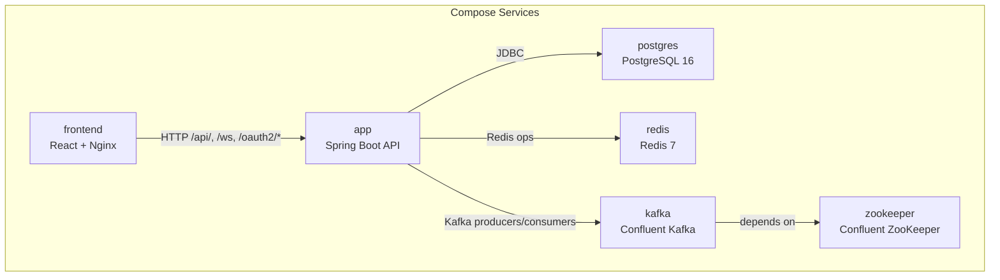
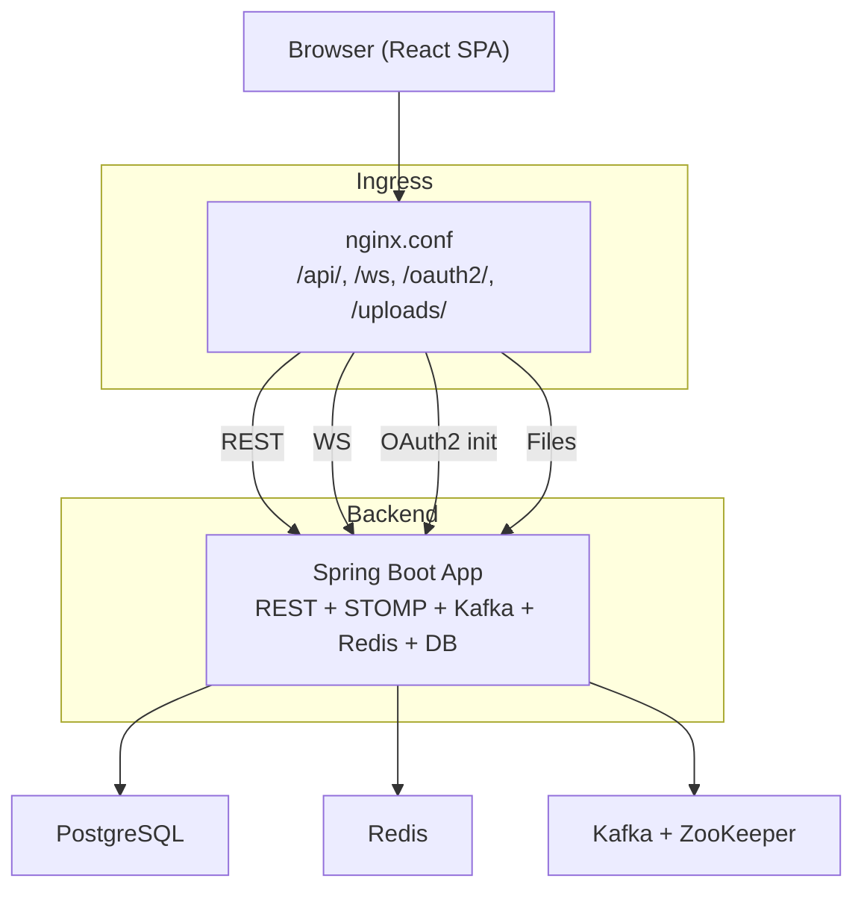
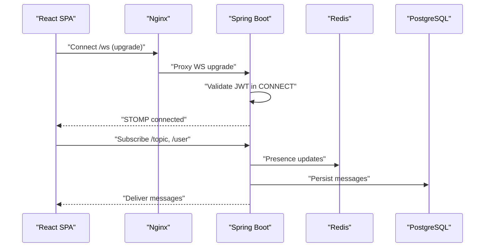
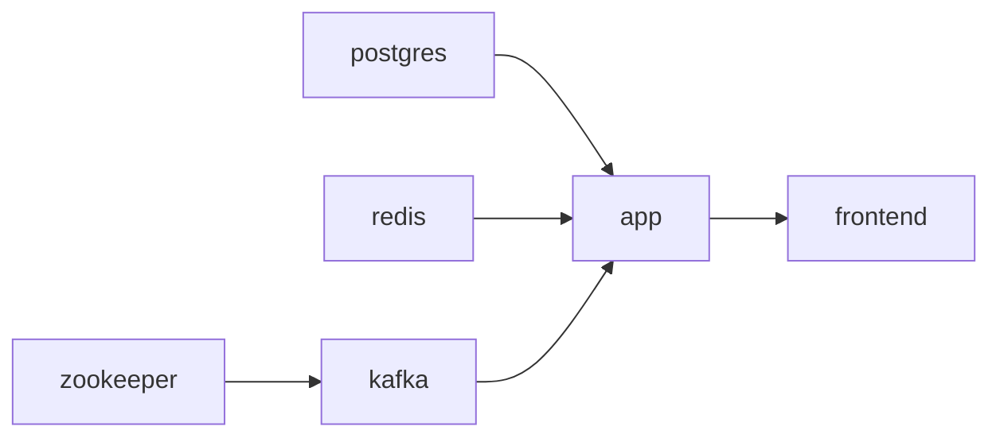

# Deployment Guide

<cite>
**Referenced Files in This Document**
- [docker-compose.yml](file://docker-compose.yml)
- [dockerfile](file://dockerfile)
- [chatify-frontend/Dockerfile](file://chatify-frontend/Dockerfile)
- [pom.xml](file://pom.xml)
- [chatify-frontend/package.json](file://chatify-frontend/package.json)
- [chatify-frontend/vite.config.js](file://chatify-frontend/vite.config.js)
- [chatify-frontend/nginx.conf](file://chatify-frontend/nginx.conf)
- [src/main/resources/application.properties](file://src/main/resources/application.properties)
- [src/main/resources/application-docker.properties](file://src/main/resources/application-docker.properties)
- [src/main/java/com/chatify/chat_backend/config/WebSocketConfig.java](file://src/main/java/com/chatify/chat_backend/config/WebSocketConfig.java)
- [src/main/java/com/chatify/chat_backend/config/SecurityConfig.java](file://src/main/java/com/chatify/chat_backend/config/SecurityConfig.java)
- [src/main/java/com/chatify/chat_backend/config/KafkaTopicConfig.java](file://src/main/java/com/chatify/chat_backend/config/KafkaTopicConfig.java)
- [src/main/java/com/chatify/chat_backend/config/KafkaErrorHandlerConfig.java](file://src/main/java/com/chatify/chat_backend/config/KafkaErrorHandlerConfig.java)
- [src/main/java/com/chatify/chat_backend/ChatBackendApplication.java](file://src/main/java/com/chatify/chat_backend/ChatBackendApplication.java)
- [README.md](file://README.md)
</cite>

## Update Summary
**Changes Made**
- Enhanced Docker Compose setup with comprehensive multi-container orchestration
- Added production-like development environment configuration
- Expanded troubleshooting guide with detailed deployment scenarios
- Updated architecture diagrams to reflect current service dependencies
- Improved environment variable configuration documentation
- Added Kafka configuration and error handling setup

## Table of Contents
1. [Introduction](#introduction)
2. [Project Structure](#project-structure)
3. [Core Components](#core-components)
4. [Architecture Overview](#architecture-overview)
5. [Detailed Component Analysis](#detailed-component-analysis)
6. [Dependency Analysis](#dependency-analysis)
7. [Performance Considerations](#performance-considerations)
8. [Troubleshooting Guide](#troubleshooting-guide)
9. [Conclusion](#conclusion)
10. [Appendices](#appendices)

## Introduction
This guide provides production-ready deployment strategies for Chatify, a real-time chat application built with Spring Boot (backend) and React (frontend). It covers containerization with Docker, orchestration using docker-compose, environment configuration for production, build processes for backend and frontend, infrastructure and scaling considerations for WebSocket connections, monitoring recommendations, security hardening, backup and disaster recovery, and step-by-step deployment instructions for Docker Swarm, Kubernetes, and cloud platforms.

**Updated** Enhanced with comprehensive Docker Compose setup and production-like development environment configuration.

## Project Structure
Chatify consists of:
- Backend: Spring Boot application packaged as a multi-stage Docker image.
- Frontend: React application built with Vite and served via Nginx in a separate container.
- Supporting services: PostgreSQL, Redis, ZooKeeper, and Kafka.



**Diagram sources**
- [docker-compose.yml:1-137](file://docker-compose.yml#L1-L137)

**Section sources**
- [docker-compose.yml:1-137](file://docker-compose.yml#L1-L137)
- [README.md:14](file://README.md#L14-L14)

## Core Components
- Backend service (app): Multi-stage Docker build using Maven and Eclipse Temurin 17 JRE. Runs on port 8080.
- Frontend service (frontend): Multi-stage build using Node 20 Alpine, Vite, and Nginx serving compiled assets.
- Database (postgres): Persistent volume-backed PostgreSQL 16 with health checks.
- Caching/Presence (redis): Password-protected Redis 7 with persistence.
- Streaming (kafka + zookeeper): Confluent Kafka with ZooKeeper; advertised listeners configured for Docker networking.
- Orchestration: docker-compose defines environment variables, health checks, and inter-service dependencies.

Key production configuration points:
- Environment variables for secrets and external integrations are injected via docker-compose.
- Backend reads production defaults from application properties and profile-specific overrides.
- Frontend builds accept compile-time environment variables for API and WebSocket base URLs.

**Updated** Enhanced with Kafka configuration and error handling setup.

**Section sources**
- [dockerfile:1-25](file://dockerfile#L1-L25)
- [chatify-frontend/Dockerfile:1-24](file://chatify-frontend/Dockerfile#L1-L24)
- [docker-compose.yml:1-137](file://docker-compose.yml#L1-L137)
- [src/main/resources/application.properties:1-75](file://src/main/resources/application.properties#L1-L75)
- [src/main/resources/application-docker.properties:1-15](file://src/main/resources/application-docker.properties#L1-L15)

## Architecture Overview
The runtime architecture comprises:
- Nginx reverse proxy handling REST API, WebSocket upgrades, OAuth2 redirects, and static assets.
- Spring Boot backend exposing REST endpoints, STOMP/WebSocket endpoints, and file uploads.
- PostgreSQL for relational data.
- Redis for caching and presence tracking.
- Kafka for asynchronous messaging and event streaming.



**Diagram sources**
- [chatify-frontend/nginx.conf:1-61](file://chatify-frontend/nginx.conf#L1-L61)
- [src/main/java/com/chatify/chat_backend/config/WebSocketConfig.java:1-111](file://src/main/java/com/chatify/chat_backend/config/WebSocketConfig.java#L1-L111)
- [src/main/java/com/chatify/chat_backend/config/SecurityConfig.java:1-120](file://src/main/java/com/chatify/chat_backend/config/SecurityConfig.java#L1-L120)
- [docker-compose.yml:1-137](file://docker-compose.yml#L1-L137)

## Detailed Component Analysis

### Backend Containerization and Build
- Multi-stage build:
  - Build stage: Maven 3.9.6 with Eclipse Temurin 17, offline dependency resolution, and packaging without tests.
  - Runtime stage: Eclipse Temurin 17 JRE Jammy minimal image, non-root user, dedicated uploads directory, and exposed port 8080.
- Entrypoint runs the Spring Boot JAR.

Build-time and runtime considerations:
- Keep the runtime image small and immutable.
- Ensure uploads directory permissions are set for the non-root user.

**Section sources**
- [dockerfile:1-25](file://dockerfile#L1-L25)
- [pom.xml:1-176](file://pom.xml#L1-L176)

### Frontend Containerization and Build
- Multi-stage build:
  - Build stage: Node 20 Alpine, install dependencies, copy source, build with Vite.
  - Runtime stage: Nginx Alpine, serve dist, apply nginx.conf.
- Build args enable injecting API and WebSocket base URLs at build time.
- Nginx routes:
  - REST API to backend.
  - WebSocket upgrade to backend.
  - OAuth2 authorization initiation to backend.
  - Uploaded files to backend.
  - SPA routing fallback to index.html.

**Section sources**
- [chatify-frontend/Dockerfile:1-24](file://chatify-frontend/Dockerfile#L1-L24)
- [chatify-frontend/vite.config.js:1-21](file://chatify-frontend/vite.config.js#L1-L21)
- [chatify-frontend/nginx.conf:1-61](file://chatify-frontend/nginx.conf#L1-L61)
- [chatify-frontend/package.json:1-40](file://chatify-frontend/package.json#L1-L40)

### Environment Variables and Configuration
Production-grade environment variables are defined in docker-compose and consumed by the backend and frontend:

Backend (application.properties and docker profile):
- Database: JDBC URL, username, password.
- Redis: host, port, password.
- JWT: secret and refresh token expiration.
- OAuth2: Google client ID/secret and redirect URI.
- CORS: allowed origins.
- AWS S3: access key, secret key, bucket name, region.
- Kafka: bootstrap servers.

Frontend (Dockerfile build args and Nginx):
- VITE_API_URL and VITE_WS_URL for API and WebSocket base URLs.
- Nginx proxies API, WS, OAuth2, and uploads to the backend.

**Updated** Enhanced with comprehensive environment variable documentation and Kafka configuration.

**Section sources**
- [docker-compose.yml:93-112](file://docker-compose.yml#L93-L112)
- [src/main/resources/application.properties:1-75](file://src/main/resources/application.properties#L1-L75)
- [src/main/resources/application-docker.properties:1-15](file://src/main/resources/application-docker.properties#L1-L15)
- [chatify-frontend/Dockerfile:5-11](file://chatify-frontend/Dockerfile#L5-L11)
- [chatify-frontend/nginx.conf:12-61](file://chatify-frontend/nginx.conf#L12-L61)

### Database Connectivity and Pooling
- JDBC URL is configured via environment variable and defaults to localhost for local runs.
- In production, use the docker network alias for PostgreSQL (as per docker-compose).
- Recommended pooling settings (to be applied in production configuration):
  - HikariCP pool size tuned to CPU cores and workload.
  - Connection timeout and leak detection enabled.
  - Read-replica support if scaling reads separately.
- Hibernate DDL auto is set to update; in production, prefer explicit migrations.

**Section sources**
- [docker-compose.yml:95-97](file://docker-compose.yml#L95-L97)
- [src/main/resources/application.properties:1-11](file://src/main/resources/application.properties#L1-L11)

### External Service Integrations
- Redis: Used for caching and presence tracking; requires password protection.
- Kafka: Producer and consumer configurations include serializers, acks, retries, idempotence, and trusted packages for JSON deserialization.
- AWS S3: Credentials and bucket configuration for file uploads and pre-signed URLs.

**Updated** Enhanced with Kafka topic configuration and error handling setup.

**Section sources**
- [docker-compose.yml:106-110](file://docker-compose.yml#L106-L110)
- [src/main/resources/application.properties:46-75](file://src/main/resources/application.properties#L46-L75)
- [src/main/java/com/chatify/chat_backend/config/KafkaTopicConfig.java:1-23](file://src/main/java/com/chatify/chat_backend/config/KafkaTopicConfig.java#L1-L23)
- [src/main/java/com/chatify/chat_backend/config/KafkaErrorHandlerConfig.java:1-19](file://src/main/java/com/chatify/chat_backend/config/KafkaErrorHandlerConfig.java#L1-L19)

### WebSocket and Real-Time Messaging
- STOMP endpoint with SockJS enabled and configurable allowed origins.
- JWT validation on WebSocket CONNECT frames.
- Heartbeats configured via a dedicated scheduler.
- Frontend uses SockJS and STOMP over WebSocket for real-time features.



**Diagram sources**
- [chatify-frontend/nginx.conf:21-31](file://chatify-frontend/nginx.conf#L21-L31)
- [src/main/java/com/chatify/chat_backend/config/WebSocketConfig.java:68-110](file://src/main/java/com/chatify/chat_backend/config/WebSocketConfig.java#L68-L110)
- [src/main/java/com/chatify/chat_backend/config/SecurityConfig.java:61-90](file://src/main/java/com/chatify/chat_backend/config/SecurityConfig.java#L61-L90)

**Section sources**
- [src/main/java/com/chatify/chat_backend/config/WebSocketConfig.java:1-111](file://src/main/java/com/chatify/chat_backend/config/WebSocketConfig.java#L1-L111)
- [src/main/java/com/chatify/chat_backend/config/SecurityConfig.java:1-120](file://src/main/java/com/chatify/chat_backend/config/SecurityConfig.java#L1-L120)
- [chatify-frontend/nginx.conf:21-31](file://chatify-frontend/nginx.conf#L21-L31)

### OAuth2 and Security Settings
- Google OAuth2 client configuration is environment-driven.
- CORS allows specified origins and credentials.
- JWT secret and refresh token expiration are configurable.
- CSRF disabled for stateless REST APIs; sessions optional.

Recommendations:
- Enforce HTTPS in production and secure cookies.
- Rotate JWT secrets regularly.
- Limit OAuth2 redirect URIs to production domains.

**Section sources**
- [docker-compose.yml:99-103](file://docker-compose.yml#L99-L103)
- [src/main/resources/application.properties:32-40](file://src/main/resources/application.properties#L32-L40)
- [src/main/java/com/chatify/chat_backend/config/SecurityConfig.java:61-90](file://src/main/java/com/chatify/chat_backend/config/SecurityConfig.java#L61-L90)

### Kafka Configuration and Error Handling
- Topic configuration with 3 partitions for scalability and single replica.
- Producer configuration with idempotence and JSON serialization.
- Consumer configuration with trusted packages and custom deserialization.
- Error handling with dead letter publishing and fixed backoff strategy.

**New Section** Added comprehensive Kafka setup documentation.

**Section sources**
- [src/main/java/com/chatify/chat_backend/config/KafkaTopicConfig.java:1-23](file://src/main/java/com/chatify/chat_backend/config/KafkaTopicConfig.java#L1-L23)
- [src/main/java/com/chatify/chat_backend/config/KafkaErrorHandlerConfig.java:1-19](file://src/main/java/com/chatify/chat_backend/config/KafkaErrorHandlerConfig.java#L1-L19)
- [src/main/resources/application.properties:54-75](file://src/main/resources/application.properties#L54-L75)

## Dependency Analysis
Inter-service dependencies and coupling:
- app depends on postgres, redis, and kafka (after zookeeper health).
- frontend depends on app.
- Health checks ensure readiness before startup.



**Diagram sources**
- [docker-compose.yml:59-119](file://docker-compose.yml#L59-L119)

**Section sources**
- [docker-compose.yml:1-137](file://docker-compose.yml#L1-L137)

## Performance Considerations
- WebSocket scaling:
  - Use sticky sessions or shared state for presence if deploying behind load balancers.
  - Consider clustering or broker sharding for high concurrency.
- Database:
  - Tune connection pool size and timeouts.
  - Use read replicas for heavy read workloads.
- Caching:
  - Leverage Redis for hot data and rate limiting.
- Kafka:
  - Increase partitions for throughput; monitor consumer lag.
  - Configure proper retention policies and replication factors.
- Frontend:
  - Enable gzip/brotli in Nginx; cache static assets aggressively.
- JVM:
  - Set appropriate heap and GC settings in production (outside current Dockerfile).

**Updated** Enhanced with Kafka performance tuning recommendations.

## Troubleshooting Guide
Common deployment issues and resolutions:

### Docker and Compose Issues
- **Container startup failures**: Check service dependencies and health checks in docker-compose.yml
- **Volume mounting errors**: Verify volume permissions and paths for postgres_data, redis_data, kafka_data
- **Network connectivity**: Ensure containers can reach each other via service names (postgres, redis, kafka)

### Database Connectivity
- **PostgreSQL connection refused**: Verify POSTGRES_DB, POSTGRES_USER, and POSTGRES_PASSWORD environment variables
- **Connection pool exhaustion**: Check HikariCP settings and connection timeout configurations
- **Migration issues**: Use explicit database migrations instead of ddl-auto=update in production

### Redis and Caching
- **Redis authentication failures**: Confirm REDIS_PASSWORD matches the redis-server command
- **Cache invalidation**: Monitor cache hit rates and TTL settings
- **Memory pressure**: Implement cache eviction policies and monitor memory usage

### Kafka and Event Streaming
- **Kafka connection failures**: Verify KAFKA_BOOTSTRAP_SERVERS matches internal listener configuration
- **Topic creation issues**: Check partition count and replication factor settings
- **Consumer lag**: Monitor consumer lag metrics and adjust consumer group configuration
- **Serialization errors**: Ensure trusted packages include com.chatify.chat_backend.dto.*

### WebSocket and Real-Time Features
- **WebSocket connection failures**: Verify allowed origins and JWT validity
- **Heartbeat issues**: Check ThreadPoolTaskScheduler configuration and thread pool sizing
- **Presence tracking**: Ensure Redis connectivity for presence state management

### Frontend and Nginx
- **SPA routing issues**: Verify try_files directive in nginx.conf handles React Router
- **API proxy errors**: Check /api/ location block and backend service availability
- **Static asset caching**: Configure appropriate cache headers for production deployment

### OAuth2 and Security
- **OAuth2 redirect loops**: Validate redirect URI and cookie settings
- **JWT token validation**: Check token expiration and signing key configuration
- **CORS policy violations**: Ensure allowed origins include frontend domains

**Updated** Enhanced with comprehensive troubleshooting scenarios including Kafka, Redis, and WebSocket issues.

**Section sources**
- [README.md:306-330](file://README.md#L306-L330)
- [chatify-frontend/nginx.conf:21-31](file://chatify-frontend/nginx.conf#L21-L31)
- [src/main/java/com/chatify/chat_backend/config/WebSocketConfig.java:68-110](file://src/main/java/com/chatify/chat_backend/config/WebSocketConfig.java#L68-L110)
- [src/main/java/com/chatify/chat_backend/config/SecurityConfig.java:107-119](file://src/main/java/com/chatify/chat_backend/config/SecurityConfig.java#L107-L119)
- [src/main/java/com/chatify/chat_backend/config/KafkaErrorHandlerConfig.java:13-19](file://src/main/java/com/chatify/chat_backend/config/KafkaErrorHandlerConfig.java#L13-L19)

## Conclusion
This guide outlines a production-ready deployment strategy for Chatify using Docker and docker-compose. By leveraging environment-driven configuration, multi-stage builds, and robust service dependencies, you can deploy a scalable, secure, and observable chat platform. The comprehensive Kafka setup, Redis caching, and WebSocket configuration provide a solid foundation for real-time messaging applications. Extend the approach to Docker Swarm or Kubernetes by translating compose services into native manifests while preserving the same configuration model.

**Updated** Enhanced with comprehensive troubleshooting and Kafka configuration guidance.

## Appendices

### Step-by-Step Deployment Instructions

#### Docker Compose (Single-Host Production)
1. **Prepare Environment Variables**
   - Create .env file with production secrets and configuration values
   - Set POSTGRES_DB, POSTGRES_USER, POSTGRES_PASSWORD
   - Configure JWT_SECRET, REDIS_PASSWORD, and external service credentials
   - Set GOOGLE_CLIENT_ID/SECRET for OAuth2 integration

2. **Start Services with Health Checks**
   ```bash
   docker compose up --build
   ```
   - Services start in dependency order (zookeeper → kafka → postgres → redis → app → frontend)
   - Monitor health checks for service readiness

3. **Access Application**
   - Frontend: http://localhost
   - Backend API: http://localhost:8080
   - WebSocket: ws://localhost:8080/ws

4. **Verify Deployment**
   - Check service logs: `docker compose logs app`
   - Verify health status: `docker compose ps`
   - Test API endpoints and WebSocket connectivity

#### Docker Swarm Deployment
1. **Convert to Stack File**
   - Transform docker-compose.yml to docker-stack.yml
   - Define secrets for sensitive variables using Docker secrets
   - Configure resource limits and restart policies

2. **Deploy Stack**
   ```bash
   docker stack deploy -c docker-stack.yml chatify
   ```

3. **Scale Services**
   - Scale backend services: `docker service scale chatify_app=3`
   - Configure overlay networks for service discovery

#### Kubernetes Deployment
1. **Create Configurations**
   - Define ConfigMaps for environment variables and Nginx config
   - Create Secrets for database passwords, JWT secret, and AWS credentials
   - Set up PersistentVolumeClaims for PostgreSQL and Redis data

2. **Deploy Infrastructure**
   - Deploy StatefulSets for PostgreSQL and Redis
   - Deploy Deployments for Kafka/ZooKeeper cluster
   - Deploy Spring Boot backend as Deployment
   - Deploy frontend as separate Deployment with Nginx

3. **Expose Services**
   - Use LoadBalancer services for external access
   - Configure Ingress for production traffic management

#### Cloud Platform Deployment
1. **Managed Services Approach**
   - Use managed PostgreSQL, Redis, and Kafka services
   - Containerize and push images to cloud container registries
   - Deploy using managed Kubernetes services (EKS, GKE, AKS)

2. **Infrastructure as Code**
   - Use Terraform or CloudFormation for infrastructure provisioning
   - Implement CI/CD pipelines for automated deployments
   - Configure monitoring and alerting systems

**Updated** Enhanced with comprehensive deployment instructions for various environments.

### Security Hardening Checklist
- **TLS Configuration**: Terminate TLS at Nginx or ingress controller; enforce HTTPS
- **Secret Management**: Store secrets in vaults or managed secret stores
- **Network Security**: Restrict Kafka/ZooKeeper exposure; use private subnets
- **Database Hardening**: Harden PostgreSQL with pg_hba.conf and network policies
- **JWT Security**: Enforce JWT expiration and refresh token rotation
- **CORS Configuration**: Audit allowed origins and cookie security flags
- **Kafka Security**: Enable SASL/SSL for Kafka communication
- **Regular Audits**: Conduct vulnerability scans and dependency updates

**Updated** Enhanced with Kafka security recommendations.

### Backup and Disaster Recovery
- **PostgreSQL Backups**: Schedule logical backups with point-in-time recovery
- **Redis Persistence**: Enable RDB/AOF persistence with regular snapshots
- **Kafka Data Protection**: Configure replication and retention policies
- **Frontend Assets**: Versioned artifacts with CDN caching
- **Disaster Recovery**: Geo-redundant deployments with automated failover

**Updated** Enhanced with comprehensive backup strategies for all components.

### Monitoring and Observability
- **Metrics Collection**: JVM metrics via Micrometer; expose Prometheus endpoints
- **Database Monitoring**: Connection pool metrics and query performance
- **Kafka Monitoring**: Consumer lag, producer throughput, and broker health
- **WebSocket Monitoring**: Connection counts, message rates, and error metrics
- **Log Aggregation**: Centralized logging with structured JSON logs
- **Distributed Tracing**: Request tracing across microservices
- **Alerting**: Health check failures, latency SLO breaches, and capacity alerts

**Updated** Enhanced with Kafka and WebSocket monitoring recommendations.

### Production Configuration Templates
- **Environment Variables**: Template for production .env file
- **Kubernetes Manifests**: Complete deployment configurations
- **Docker Compose**: Optimized production-ready service definitions
- **Security Policies**: Network policies and RBAC configurations

**New Section** Added production configuration templates for quick deployment.