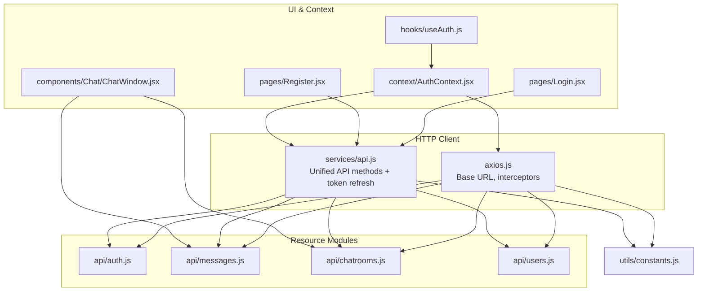
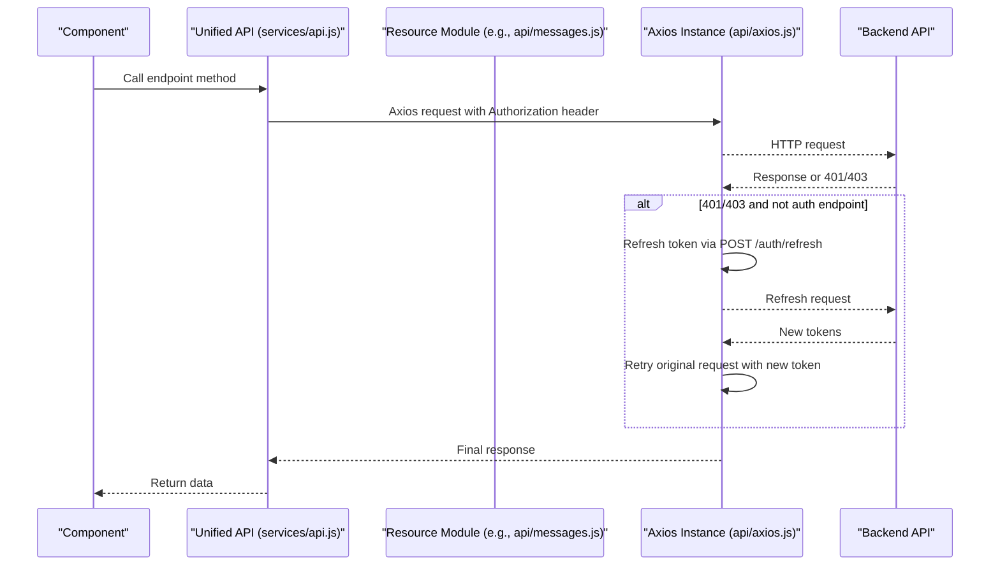
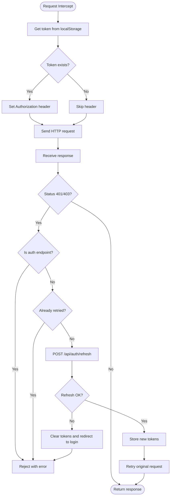
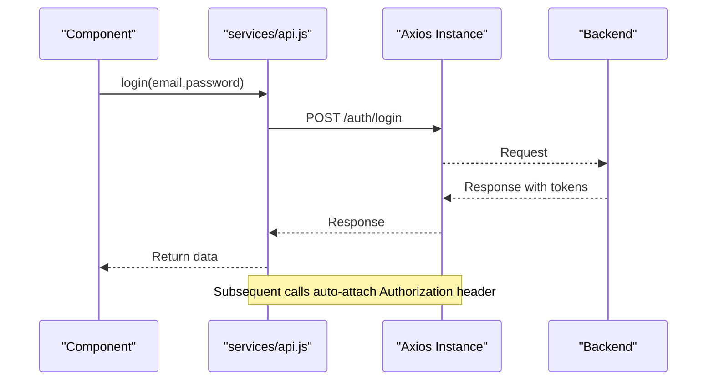
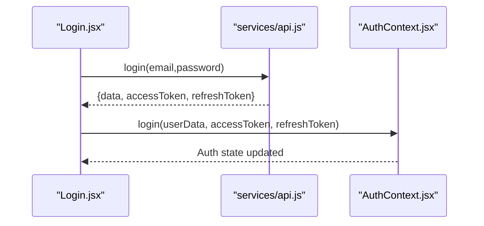
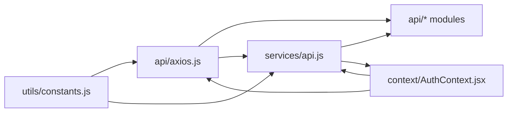

# API Integration and Service Layer

<cite>
**Referenced Files in This Document**
- [axios.js](file://chatify-frontend/src/api/axios.js)
- [api.js](file://chatify-frontend/src/services/api.js)
- [auth.js](file://chatify-frontend/src/api/auth.js)
- [messages.js](file://chatify-frontend/src/api/messages.js)
- [chatrooms.js](file://chatify-frontend/src/api/chatrooms.js)
- [users.js](file://chatify-frontend/src/api/users.js)
- [constants.js](file://chatify-frontend/src/utils/constants.js)
- [AuthContext.jsx](file://chatify-frontend/src/context/AuthContext.jsx)
- [useAuth.js](file://chatify-frontend/src/hooks/useAuth.js)
- [Login.jsx](file://chatify-frontend/src/pages/Login.jsx)
- [Register.jsx](file://chatify-frontend/src/pages/Register.jsx)
- [ChatWindow.jsx](file://chatify-frontend/src/components/Chat/ChatWindow.jsx)
- [websocket.js](file://chatify-frontend/src/services/websocket.js)
</cite>

## Table of Contents
1. [Introduction](#introduction)
2. [Project Structure](#project-structure)
3. [Core Components](#core-components)
4. [Architecture Overview](#architecture-overview)
5. [Detailed Component Analysis](#detailed-component-analysis)
6. [Dependency Analysis](#dependency-analysis)
7. [Performance Considerations](#performance-considerations)
8. [Troubleshooting Guide](#troubleshooting-guide)
9. [Conclusion](#conclusion)

## Introduction
This document explains the Chatify API integration and service layer with a focus on HTTP client configuration and RESTful communication patterns. It covers the Axios-based HTTP client configuration, authentication token injection, token refresh logic, and unified API service abstractions. It also documents the resource-specific API modules for authentication, messages, chat rooms, and users, along with usage patterns in components, error handling, loading state management, and security considerations.

## Project Structure
The API integration is organized around a shared Axios instance for HTTP requests and modular API modules per domain resource. A separate service module centralizes REST endpoints and token-refresh logic. Environment variables define base URLs for API and WebSocket endpoints.

**Diagram sources**
- [axios.js:1-67](file://chatify-frontend/src/api/axios.js#L1-L67)
- [api.js:1-121](file://chatify-frontend/src/services/api.js#L1-L121)
- [auth.js:1-22](file://chatify-frontend/src/api/auth.js#L1-L22)
- [messages.js:1-53](file://chatify-frontend/src/api/messages.js#L1-L53)
- [chatrooms.js:1-31](file://chatify-frontend/src/api/chatrooms.js#L1-L31)
- [users.js:1-37](file://chatify-frontend/src/api/users.js#L1-L37)
- [constants.js:1-34](file://chatify-frontend/src/utils/constants.js#L1-L34)
- [Login.jsx:1-165](file://chatify-frontend/src/pages/Login.jsx#L1-L165)
- [Register.jsx:1-179](file://chatify-frontend/src/pages/Register.jsx#L1-L179)
- [ChatWindow.jsx:1-295](file://chatify-frontend/src/components/Chat/ChatWindow.jsx#L1-L295)
- [AuthContext.jsx:1-53](file://chatify-frontend/src/context/AuthContext.jsx#L1-L53)
- [useAuth.js:1-8](file://chatify-frontend/src/hooks/useAuth.js#L1-L8)

**Section sources**
- [axios.js:1-67](file://chatify-frontend/src/api/axios.js#L1-L67)
- [api.js:1-121](file://chatify-frontend/src/services/api.js#L1-L121)
- [constants.js:1-34](file://chatify-frontend/src/utils/constants.js#L1-L34)

## Core Components
- Shared Axios client with base URL and interceptors for token injection and refresh.
- Unified API service module exporting REST endpoints and centralized token-refresh logic.
- Resource-specific API modules for auth, messages, chatrooms, and users.
- Authentication context managing tokens and user state.
- Environment constants for API and WebSocket URLs.

Key responsibilities:
- axios.js: Base URL configuration, request interceptor for Authorization header, response interceptor for token refresh and logout on 401.
- services/api.js: Centralized endpoint methods, robust token refresh with concurrency guard and request queuing, consistent error propagation.
- Resource modules: Thin wrappers around axios with standardized request/response shapes.
- AuthContext: Persists tokens and user data, exposes login/logout, integrates with interceptors.
- constants.js: Provides API_URL and WS_URL consumed by both HTTP and WebSocket layers.

**Section sources**
- [axios.js:1-67](file://chatify-frontend/src/api/axios.js#L1-L67)
- [api.js:1-121](file://chatify-frontend/src/services/api.js#L1-L121)
- [AuthContext.jsx:1-53](file://chatify-frontend/src/context/AuthContext.jsx#L1-L53)
- [constants.js:1-34](file://chatify-frontend/src/utils/constants.js#L1-L34)

## Architecture Overview
The HTTP client layer is configured centrally and reused by both the unified API service and resource-specific modules. The unified service encapsulates REST endpoints and token-refresh logic, while resource modules provide domain-focused APIs. Components consume either the unified service or resource modules depending on use case.

**Diagram sources**
- [api.js:48-97](file://chatify-frontend/src/services/api.js#L48-L97)
- [axios.js:25-65](file://chatify-frontend/src/api/axios.js#L25-L65)
- [messages.js:1-53](file://chatify-frontend/src/api/messages.js#L1-L53)

## Detailed Component Analysis

### HTTP Client Configuration (axios.js)
- Base URL: Constructed from environment variable with fallback to empty string.
- Headers: JSON content type set globally.
- Request interceptor: Reads token from local storage and attaches Authorization header.
- Response interceptor:
  - Detects 401 Unauthorized for non-auth endpoints.
  - Prevents duplicate refresh attempts using a retry flag.
  - Attempts token refresh via POST /api/auth/refresh with refresh token.
  - On success, stores new tokens and retries the original request.
  - On failure, clears tokens and user data and navigates to login.

**Diagram sources**
- [axios.js:11-23](file://chatify-frontend/src/api/axios.js#L11-L23)
- [axios.js:25-65](file://chatify-frontend/src/api/axios.js#L25-L65)

**Section sources**
- [axios.js:1-67](file://chatify-frontend/src/api/axios.js#L1-L67)

### Unified API Service (services/api.js)
- Base URL: Defaults to /api with environment override.
- Request interceptor: Same token injection as axios.js.
- Token refresh:
  - Tracks refresh state and queues failed requests during refresh.
  - Uses a dedicated refresh endpoint and updates Authorization defaults.
  - Forces logout when refresh fails or no refresh token is present.
- Exported endpoints:
  - Auth: login, register, refresh.
  - Chatrooms: list, paginated history, search.
  - Messages: CRUD, read-all, presigned URL generation, S3 upload.
  - Users: list, current user, presence, online users.

**Diagram sources**
- [api.js:100-121](file://chatify-frontend/src/services/api.js#L100-L121)
- [api.js:48-97](file://chatify-frontend/src/services/api.js#L48-L97)

**Section sources**
- [api.js:1-121](file://chatify-frontend/src/services/api.js#L1-L121)

### Authentication API Module (api/auth.js)
- Exposes register, login, logout, and refresh using the shared axios instance.
- Returns response.data for downstream consumption.

Usage patterns:
- Components call these methods and pass results to AuthContext.login to persist tokens and user data.

**Section sources**
- [auth.js:1-22](file://chatify-frontend/src/api/auth.js#L1-L22)

### Messages API Module (api/messages.js)
- Fetches all messages for a chat room and paginated history.
- Sends messages and marks read/unread.
- Deletes messages.
- Generates presigned URLs for file uploads and uploads directly to S3.

Data handling:
- Uses query parameters for pagination and filtering.
- Uploads bypass Axios for direct S3 PUT.

**Section sources**
- [messages.js:1-53](file://chatify-frontend/src/api/messages.js#L1-L53)

### Chat Rooms API Module (api/chatrooms.js)
- Lists, retrieves by ID, creates chat rooms.
- Adds and removes participants.

**Section sources**
- [chatrooms.js:1-31](file://chatify-frontend/src/api/chatrooms.js#L1-L31)

### Users API Module (api/users.js)
- Lists users, fetches by ID, current user profile.
- Searches users, updates status, checks presence, lists online users.

**Section sources**
- [users.js:1-37](file://chatify-frontend/src/api/users.js#L1-L37)

### Authentication Context (AuthContext.jsx)
- Manages user, token, and loading state.
- Persists tokens and user data to localStorage.
- Provides login and logout functions to components.

Integration:
- Components call unified API methods and then call AuthContext.login to set tokens and user data.
- Interceptors automatically attach Authorization headers.

**Section sources**
- [AuthContext.jsx:1-53](file://chatify-frontend/src/context/AuthContext.jsx#L1-L53)

### Hooks and Constants
- useAuth hook: Provides access to AuthContext values.
- constants.js: Defines API_URL and WS_URL consumed by HTTP and WebSocket layers.

**Section sources**
- [useAuth.js:1-8](file://chatify-frontend/src/hooks/useAuth.js#L1-L8)
- [constants.js:1-34](file://chatify-frontend/src/utils/constants.js#L1-L34)

### Component Usage Examples

#### Login Page (Login.jsx)
- Uses services/api.js login method.
- On success, calls AuthContext.login to persist tokens and user data.
- Displays user-friendly errors on failure.

**Diagram sources**
- [Login.jsx:17-33](file://chatify-frontend/src/pages/Login.jsx#L17-L33)
- [api.js:100](file://chatify-frontend/src/services/api.js#L100)
- [AuthContext.jsx:30-44](file://chatify-frontend/src/context/AuthContext.jsx#L30-L44)

**Section sources**
- [Login.jsx:1-165](file://chatify-frontend/src/pages/Login.jsx#L1-L165)
- [api.js:100-102](file://chatify-frontend/src/services/api.js#L100-L102)
- [AuthContext.jsx:30-44](file://chatify-frontend/src/context/AuthContext.jsx#L30-L44)

#### Registration Page (Register.jsx)
- Uses services/api.js register method.
- Handles server-side error messages and redirects on success.

**Section sources**
- [Register.jsx:1-179](file://chatify-frontend/src/pages/Register.jsx#L1-L179)
- [api.js:101](file://chatify-frontend/src/services/api.js#L101)

#### Chat Window (ChatWindow.jsx)
- Loads chat room metadata and messages.
- Marks messages as read upon load.
- Integrates with WebSocket for real-time updates.

**Section sources**
- [ChatWindow.jsx:58-87](file://chatify-frontend/src/components/Chat/ChatWindow.jsx#L58-L87)
- [messages.js:1-53](file://chatify-frontend/src/api/messages.js#L1-L53)
- [chatrooms.js:1-31](file://chatify-frontend/src/api/chatrooms.js#L1-L31)

## Dependency Analysis
- axios.js is imported by resource modules and services/api.js.
- services/api.js centralizes endpoints and token refresh, reducing duplication.
- Resource modules depend on axios.js for HTTP calls.
- Components depend on either services/api.js or resource modules.
- AuthContext depends on localStorage and axios interceptors for token persistence and injection.

**Diagram sources**
- [axios.js:1-67](file://chatify-frontend/src/api/axios.js#L1-L67)
- [api.js:1-121](file://chatify-frontend/src/services/api.js#L1-L121)
- [AuthContext.jsx:1-53](file://chatify-frontend/src/context/AuthContext.jsx#L1-L53)
- [constants.js:1-34](file://chatify-frontend/src/utils/constants.js#L1-L34)

**Section sources**
- [axios.js:1-67](file://chatify-frontend/src/api/axios.js#L1-L67)
- [api.js:1-121](file://chatify-frontend/src/services/api.js#L1-L121)
- [AuthContext.jsx:1-53](file://chatify-frontend/src/context/AuthContext.jsx#L1-L53)
- [constants.js:1-34](file://chatify-frontend/src/utils/constants.js#L1-L34)

## Performance Considerations
- Token refresh concurrency: services/api.js guards against concurrent refresh attempts and queues failed requests until refreshed.
- Request retry: axios.js prevents duplicate refresh attempts using a retry flag.
- Pagination: messages.js supports paginated retrieval to reduce payload sizes.
- WebSocket batching: websocket.js queues messages until connected to minimize network overhead.

[No sources needed since this section provides general guidance]

## Troubleshooting Guide
Common issues and resolutions:
- 401 Unauthorized:
  - Ensure tokens are persisted in localStorage and AuthContext is initialized.
  - Verify axios interceptors attach Authorization header.
  - Confirm refresh endpoint availability and that refresh tokens are present.
- Refresh failures:
  - services/api.js forces logout when refresh fails; check backend token signing and expiration.
  - Clear localStorage tokens and re-authenticate.
- CORS and base URL:
  - Confirm API_URL environment variable is set and reachable.
- Component error handling:
  - Wrap API calls in try/catch blocks and display user-friendly messages.
  - Use loading flags to prevent duplicate submissions.

**Section sources**
- [axios.js:25-65](file://chatify-frontend/src/api/axios.js#L25-L65)
- [api.js:48-97](file://chatify-frontend/src/services/api.js#L48-L97)
- [Login.jsx:22-32](file://chatify-frontend/src/pages/Login.jsx#L22-L32)
- [Register.jsx:27-37](file://chatify-frontend/src/pages/Register.jsx#L27-L37)

## Conclusion
The Chatify API integration leverages a shared Axios client with robust interceptors for token injection and refresh, ensuring secure and reliable HTTP communication. The unified services/api.js module provides a consistent interface for REST operations and centralized error handling, while resource-specific modules encapsulate domain logic. Components integrate seamlessly with AuthContext for state management and with WebSocket for real-time features. Together, these patterns deliver a maintainable, secure, and scalable API layer.