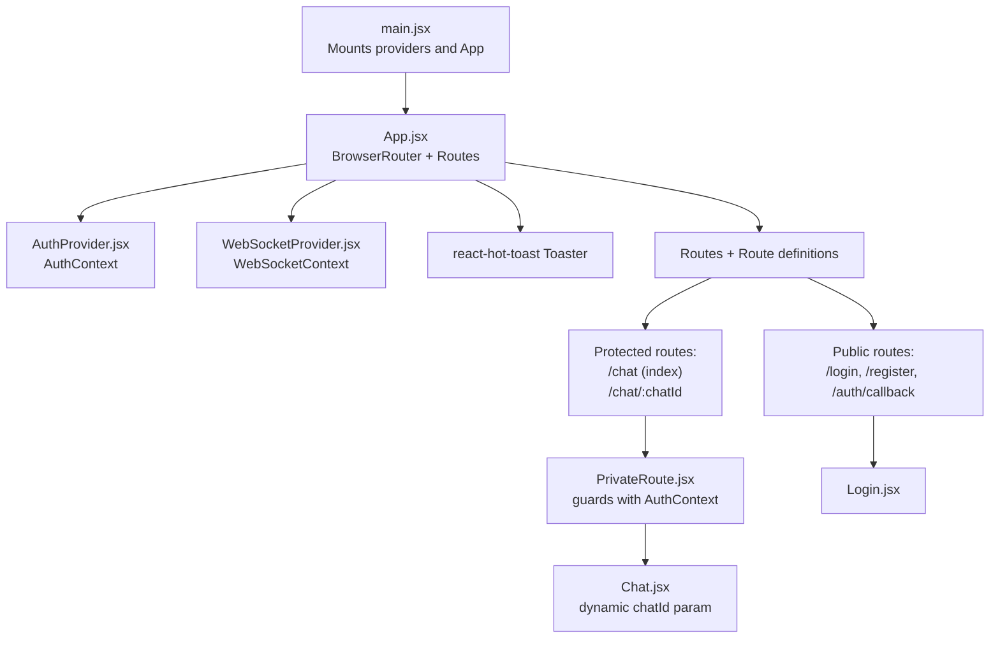
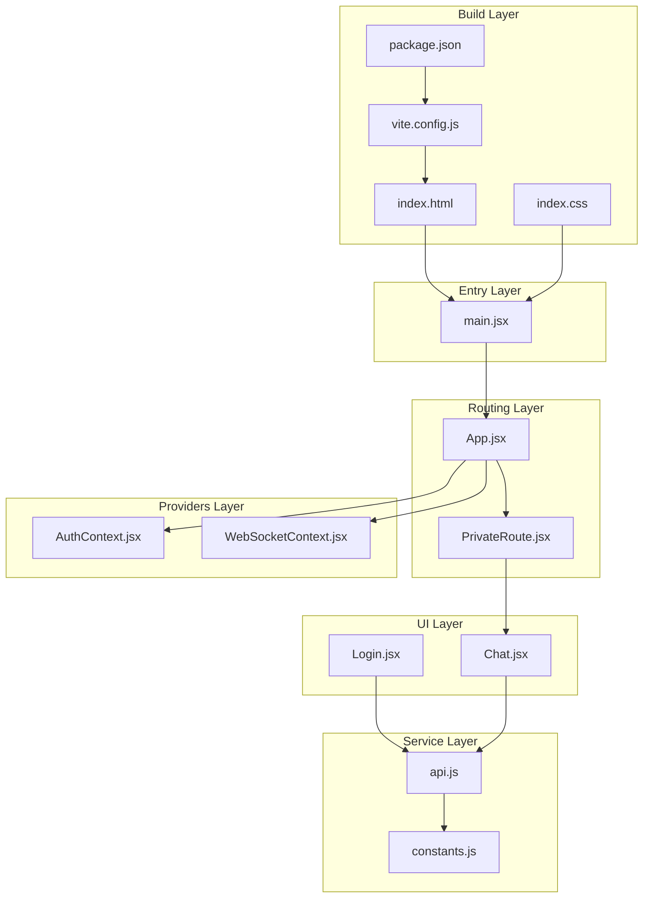
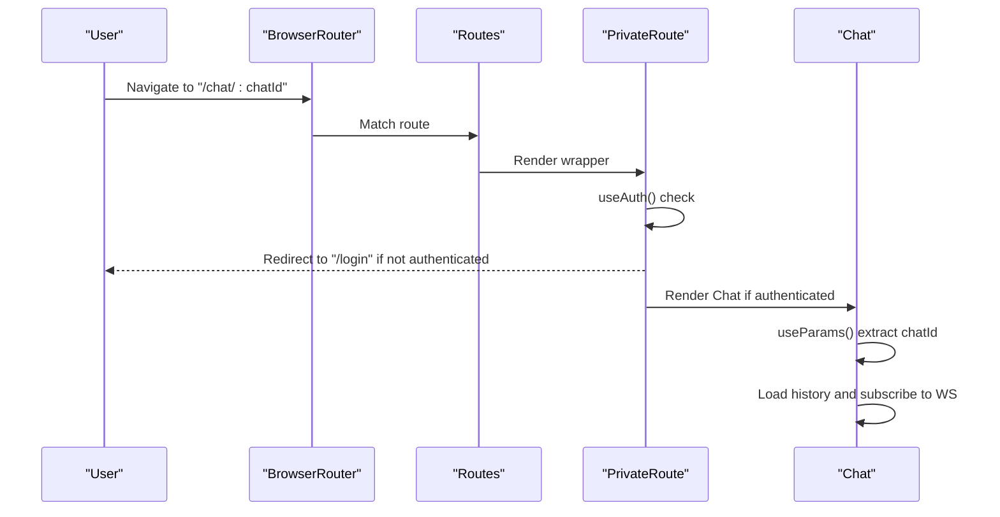
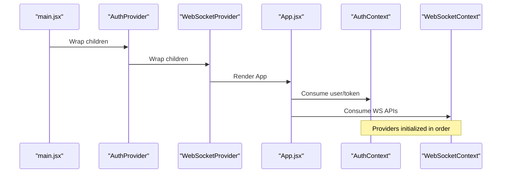
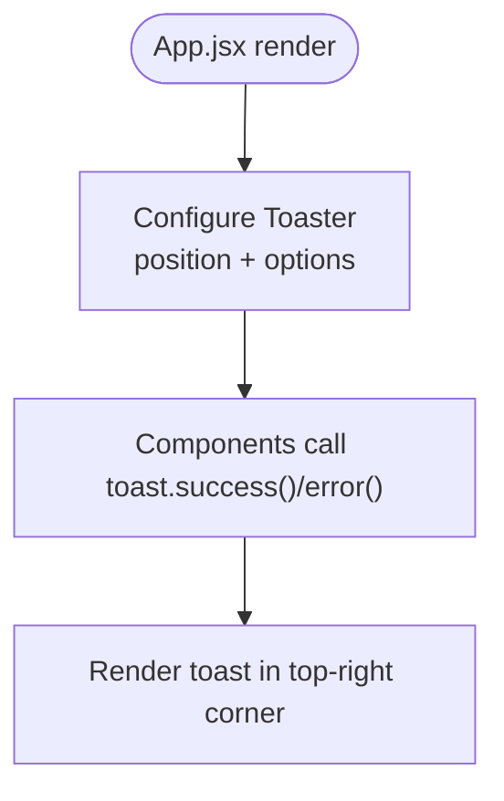
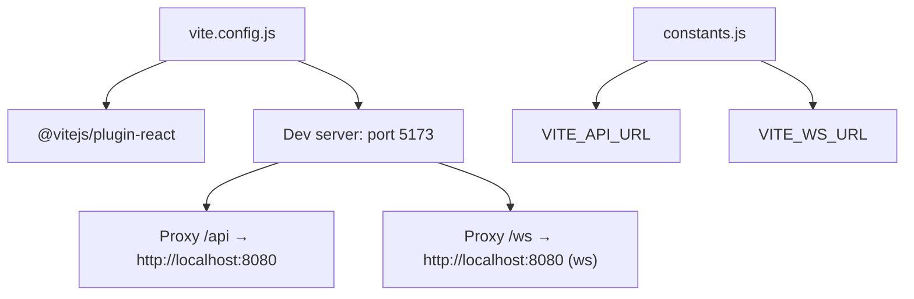
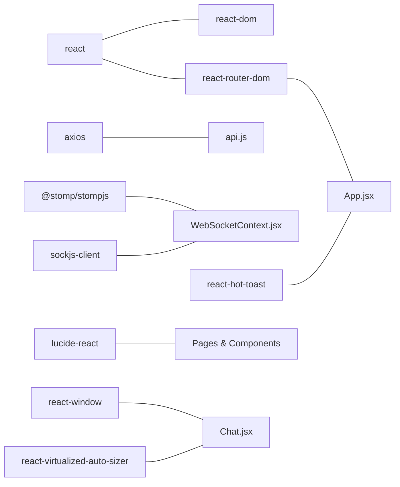

# Application Structure and Routing

<cite>
**Referenced Files in This Document**
- [App.jsx](file://chatify-frontend/src/App.jsx)
- [main.jsx](file://chatify-frontend/src/main.jsx)
- [PrivateRoute.jsx](file://chatify-frontend/src/components/PrivateRoute.jsx)
- [AuthContext.jsx](file://chatify-frontend/src/context/AuthContext.jsx)
- [WebSocketContext.jsx](file://chatify-frontend/src/context/WebSocketContext.jsx)
- [useAuth.js](file://chatify-frontend/src/hooks/useAuth.js)
- [useWebSocket.js](file://chatify-frontend/src/hooks/useWebSocket.js)
- [Chat.jsx](file://chatify-frontend/src/pages/Chat.jsx)
- [Login.jsx](file://chatify-frontend/src/pages/Login.jsx)
- [api.js](file://chatify-frontend/src/services/api.js)
- [constants.js](file://chatify-frontend/src/utils/constants.js)
- [index.html](file://chatify-frontend/index.html)
- [vite.config.js](file://chatify-frontend/vite.config.js)
- [package.json](file://chatify-frontend/package.json)
- [index.css](file://chatify-frontend/src/index.css)
</cite>

## Table of Contents
1. [Introduction](#introduction)
2. [Project Structure](#project-structure)
3. [Core Components](#core-components)
4. [Architecture Overview](#architecture-overview)
5. [Detailed Component Analysis](#detailed-component-analysis)
6. [Dependency Analysis](#dependency-analysis)
7. [Performance Considerations](#performance-considerations)
8. [Troubleshooting Guide](#troubleshooting-guide)
9. [Conclusion](#conclusion)
10. [Appendices](#appendices)

## Introduction
This document explains the Chatify frontend application structure with a focus on React 19 setup, routing configuration, providers, toast notifications, and the Vite build system. It covers how the app initializes, how authentication and WebSocket contexts are layered, and how routing enforces protection for chat features while supporting dynamic parameters. Practical examples demonstrate route protection, dynamic routing patterns, and component composition. Differences between development and production builds and environment variable handling are also addressed.

## Project Structure
The Chatify frontend is organized around a clear separation of concerns:
- Entry point and rendering: main.jsx initializes providers and mounts App.jsx.
- Routing: App.jsx defines routes with React Router, including protected routes and dynamic parameters.
- Providers: AuthProvider and WebSocketProvider wrap the app to supply authentication and real-time capabilities.
- Pages and components: Dedicated pages for authentication and chat, plus reusable components and hooks.
- Services and utilities: Axios-based API client with interceptors, constants for URLs, and Tailwind-based styling.

**Diagram sources**
- [main.jsx:8-16](file://chatify-frontend/src/main.jsx#L8-L16)
- [App.jsx:34-71](file://chatify-frontend/src/App.jsx#L34-L71)
- [AuthContext.jsx:9-52](file://chatify-frontend/src/context/AuthContext.jsx#L9-L52)
- [WebSocketContext.jsx:10-189](file://chatify-frontend/src/context/WebSocketContext.jsx#L10-L189)
- [PrivateRoute.jsx:5-18](file://chatify-frontend/src/components/PrivateRoute.jsx#L5-L18)
- [Chat.jsx:46](file://chatify-frontend/src/pages/Chat.jsx#L46)

**Section sources**
- [main.jsx:8-16](file://chatify-frontend/src/main.jsx#L8-L16)
- [App.jsx:34-71](file://chatify-frontend/src/App.jsx#L34-L71)

## Core Components
- App.jsx: Root component that wraps the app in BrowserRouter and composes providers and routes. It defines public authentication routes and nested protected routes under /chat with dynamic parameters.
- main.jsx: Renders the app inside StrictMode and sets up provider order for AuthProvider and WebSocketProvider.
- PrivateRoute.jsx: Enforces authentication by checking user state and redirecting unauthenticated users to /login.
- AuthContext.jsx: Manages user session state, tokens, and persistence in localStorage.
- WebSocketContext.jsx: Provides real-time messaging via STOMP over SockJS with automatic token refresh and reconnection logic.
- Chat.jsx: Implements dynamic routing with useParams, paginated history, virtualized lists, file uploads, and presence/read receipts.
- Login.jsx: Handles form submission, error display, and OAuth redirection.
- api.js: Axios client with request/response interceptors for token injection and refresh.
- constants.js: Exposes environment-backed API and WebSocket URLs.
- index.html: Minimal HTML shell with polyfills for SockJS.
- vite.config.js: Vite configuration with React plugin, dev server, and proxy settings.
- package.json: Dependencies and scripts for dev/build/preview/lint.
- index.css: Tailwind-based global styles and custom scrollbar utilities.

**Section sources**
- [App.jsx:12-72](file://chatify-frontend/src/App.jsx#L12-L72)
- [main.jsx:8-16](file://chatify-frontend/src/main.jsx#L8-L16)
- [PrivateRoute.jsx:5-18](file://chatify-frontend/src/components/PrivateRoute.jsx#L5-L18)
- [AuthContext.jsx:9-52](file://chatify-frontend/src/context/AuthContext.jsx#L9-L52)
- [WebSocketContext.jsx:10-189](file://chatify-frontend/src/context/WebSocketContext.jsx#L10-L189)
- [Chat.jsx:46](file://chatify-frontend/src/pages/Chat.jsx#L46)
- [Login.jsx:17-33](file://chatify-frontend/src/pages/Login.jsx#L17-L33)
- [api.js:4-97](file://chatify-frontend/src/services/api.js#L4-L97)
- [constants.js:1-34](file://chatify-frontend/src/utils/constants.js#L1-L34)
- [index.html:8-13](file://chatify-frontend/index.html#L8-L13)
- [vite.config.js:5-20](file://chatify-frontend/vite.config.js#L5-L20)
- [package.json:6-11](file://chatify-frontend/package.json#L6-L11)
- [index.css:1-99](file://chatify-frontend/src/index.css#L1-L99)

## Architecture Overview
The application follows a layered architecture:
- Entry layer: main.jsx initializes providers and mounts App.jsx.
- Routing layer: App.jsx defines routes and nests protected routes under /chat.
- Provider layer: AuthProvider supplies authentication state; WebSocketProvider supplies real-time capabilities.
- UI layer: Pages and components consume context via hooks.
- Service layer: api.js centralizes HTTP requests and token refresh logic.
- Build layer: Vite handles development server, proxying, and bundling.

**Diagram sources**
- [main.jsx:8-16](file://chatify-frontend/src/main.jsx#L8-L16)
- [App.jsx:34-71](file://chatify-frontend/src/App.jsx#L34-L71)
- [PrivateRoute.jsx:5-18](file://chatify-frontend/src/components/PrivateRoute.jsx#L5-L18)
- [AuthContext.jsx:9-52](file://chatify-frontend/src/context/AuthContext.jsx#L9-L52)
- [WebSocketContext.jsx:10-189](file://chatify-frontend/src/context/WebSocketContext.jsx#L10-L189)
- [Login.jsx:17-33](file://chatify-frontend/src/pages/Login.jsx#L17-L33)
- [Chat.jsx:46](file://chatify-frontend/src/pages/Chat.jsx#L46)
- [api.js:4-97](file://chatify-frontend/src/services/api.js#L4-L97)
- [constants.js:1-34](file://chatify-frontend/src/utils/constants.js#L1-L34)
- [vite.config.js:5-20](file://chatify-frontend/vite.config.js#L5-L20)
- [package.json:6-11](file://chatify-frontend/package.json#L6-L11)
- [index.html:8-13](file://chatify-frontend/index.html#L8-L13)
- [index.css:1-99](file://chatify-frontend/src/index.css#L1-L99)

## Detailed Component Analysis

### Routing and Protected Access
- App.jsx defines:
  - Public routes: /login, /register, /auth/callback.
  - Nested protected routes under /chat:
    - Index route renders Chat wrapped by PrivateRoute.
    - Dynamic route /chat/:chatId renders Chat wrapped by PrivateRoute.
  - Redirects: / to /chat and wildcard * to /chat.
- PrivateRoute.jsx:
  - Uses AuthContext to check user and loading state.
  - Redirects to /login with location state when unauthenticated.
- Chat.jsx:
  - Reads chatId via useParams.
  - Subscribes to WebSocket topics and manages message history and presence.

**Diagram sources**
- [App.jsx:41-67](file://chatify-frontend/src/App.jsx#L41-L67)
- [PrivateRoute.jsx:5-18](file://chatify-frontend/src/components/PrivateRoute.jsx#L5-L18)
- [Chat.jsx:46](file://chatify-frontend/src/pages/Chat.jsx#L46)

**Section sources**
- [App.jsx:41-67](file://chatify-frontend/src/App.jsx#L41-L67)
- [PrivateRoute.jsx:5-18](file://chatify-frontend/src/components/PrivateRoute.jsx#L5-L18)
- [Chat.jsx:46](file://chatify-frontend/src/pages/Chat.jsx#L46)

### Authentication Flow and Providers
- Provider setup order in main.jsx ensures AuthProvider wraps WebSocketProvider and App.
- AuthContext.jsx:
  - Initializes from localStorage on mount.
  - Provides login/logout and exposes isAuthenticated flag.
- WebSocketContext.jsx:
  - Creates STOMP client with SockJS.
  - Maintains tokenRef to reflect latest token without recreating client.
  - Implements token refresh on STOMP errors and WebSocket close events.
  - Exposes subscribe/send APIs for chatroom, presence, delivery, and seen acknowledgements.
- useAuth.js and useWebSocket.js:
  - Lightweight hooks to consume AuthContext and WebSocketContext respectively.

**Diagram sources**
- [main.jsx:8-16](file://chatify-frontend/src/main.jsx#L8-L16)
- [AuthContext.jsx:9-52](file://chatify-frontend/src/context/AuthContext.jsx#L9-L52)
- [WebSocketContext.jsx:10-189](file://chatify-frontend/src/context/WebSocketContext.jsx#L10-L189)
- [App.jsx:34-71](file://chatify-frontend/src/App.jsx#L34-L71)

**Section sources**
- [main.jsx:8-16](file://chatify-frontend/src/main.jsx#L8-L16)
- [AuthContext.jsx:9-52](file://chatify-frontend/src/context/AuthContext.jsx#L9-L52)
- [WebSocketContext.jsx:10-189](file://chatify-frontend/src/context/WebSocketContext.jsx#L10-L189)
- [useAuth.js:4-6](file://chatify-frontend/src/hooks/useAuth.js#L4-L6)
- [useWebSocket.js:4-6](file://chatify-frontend/src/hooks/useWebSocket.js#L4-L6)

### Toast Notification System
- App.jsx configures react-hot-toast Toaster with:
  - Position: top-right
  - Duration: 3000ms
  - Custom background, color, borders, and themed success/error icons
- Chat.jsx uses toast to surface errors for file type limits, size limits, and send failures.

**Diagram sources**
- [App.jsx:13-32](file://chatify-frontend/src/App.jsx#L13-L32)
- [Chat.jsx:289-351](file://chatify-frontend/src/pages/Chat.jsx#L289-L351)

**Section sources**
- [App.jsx:13-32](file://chatify-frontend/src/App.jsx#L13-L32)
- [Chat.jsx:289-351](file://chatify-frontend/src/pages/Chat.jsx#L289-L351)

### Vite Build System and Environment Handling
- Plugins: @vitejs/plugin-react enabled.
- Dev server:
  - Port 5173
  - Proxy:
    - /api → http://localhost:8080
    - /ws → http://localhost:8080 (websocket)
- Scripts:
  - dev, build, lint, preview
- Environment variables:
  - API_URL and WS_URL are read from import.meta.env.VITE_* and fall back to empty/default values.
- HTML:
  - index.html includes a SockJS polyfill for compatibility.

**Diagram sources**
- [vite.config.js:5-20](file://chatify-frontend/vite.config.js#L5-L20)
- [constants.js:1-34](file://chatify-frontend/src/utils/constants.js#L1-L34)

**Section sources**
- [vite.config.js:5-20](file://chatify-frontend/vite.config.js#L5-L20)
- [package.json:6-11](file://chatify-frontend/package.json#L6-L11)
- [constants.js:1-34](file://chatify-frontend/src/utils/constants.js#L1-L34)
- [index.html:8-13](file://chatify-frontend/index.html#L8-L13)

### Practical Examples
- Route protection:
  - Wrap any route requiring authentication with PrivateRoute. See App.jsx nested routes and PrivateRoute.jsx logic.
- Dynamic routing:
  - Use useParams in Chat.jsx to read chatId from /chat/:chatId and manage per-room state.
- Component composition:
  - App.jsx composes AuthProvider, WebSocketProvider, Toaster, and Routes.
  - main.jsx composes providers and mounts App.

**Section sources**
- [App.jsx:41-67](file://chatify-frontend/src/App.jsx#L41-L67)
- [PrivateRoute.jsx:5-18](file://chatify-frontend/src/components/PrivateRoute.jsx#L5-L18)
- [Chat.jsx:46](file://chatify-frontend/src/pages/Chat.jsx#L46)

## Dependency Analysis
Key dependencies and their roles:
- react, react-dom: React 19 runtime and DOM renderer.
- react-router-dom: Routing and navigation.
- axios: HTTP client with interceptors.
- @stomp/stompjs + sockjs-client: Real-time messaging.
- lucide-react: Icons.
- react-hot-toast: Toast notifications.
- react-window, react-virtualized-auto-sizer: Virtualization for message lists.

**Diagram sources**
- [package.json:12-23](file://chatify-frontend/package.json#L12-L23)
- [api.js:1-121](file://chatify-frontend/src/services/api.js#L1-L121)
- [WebSocketContext.jsx:1-190](file://chatify-frontend/src/context/WebSocketContext.jsx#L1-L190)
- [Chat.jsx:1-555](file://chatify-frontend/src/pages/Chat.jsx#L1-L555)

**Section sources**
- [package.json:12-23](file://chatify-frontend/package.json#L12-L23)

## Performance Considerations
- Virtualization: Chat.jsx uses virtualized lists to efficiently render large message histories.
- Pagination: Paginated history reduces initial payload and memory footprint.
- Conditional subscriptions: Subscriptions are created only when connected and chatId changes.
- Token caching: tokenRef avoids recreating the STOMP client on token updates.
- Scroll performance: Custom scrollbar utilities and GPU-accelerated scrolling classes improve smoothness.

[No sources needed since this section provides general guidance]

## Troubleshooting Guide
- Authentication redirects:
  - If redirected to /login unexpectedly, verify user state in AuthContext and localStorage persistence.
- WebSocket connectivity:
  - Check token validity and refresh flow in WebSocketContext. Verify /ws proxy and server availability.
- API errors:
  - Inspect axios interceptors in api.js for token refresh and force logout conditions.
- Environment variables:
  - Ensure VITE_API_URL and VITE_WS_URL are set appropriately for dev/prod environments.
- SockJS compatibility:
  - Confirm the polyfill in index.html is present during development.

**Section sources**
- [PrivateRoute.jsx:5-18](file://chatify-frontend/src/components/PrivateRoute.jsx#L5-L18)
- [AuthContext.jsx:9-52](file://chatify-frontend/src/context/AuthContext.jsx#L9-L52)
- [WebSocketContext.jsx:27-45](file://chatify-frontend/src/context/WebSocketContext.jsx#L27-L45)
- [api.js:48-97](file://chatify-frontend/src/services/api.js#L48-L97)
- [constants.js:1-34](file://chatify-frontend/src/utils/constants.js#L1-L34)
- [index.html:8-13](file://chatify-frontend/index.html#L8-L13)

## Conclusion
Chatify’s frontend is structured around a clear provider hierarchy, robust routing with protected access, and a real-time WebSocket layer. The Vite configuration supports efficient development with proxying and modern React tooling. The toast system and Tailwind-based styling contribute to a polished user experience. Following the outlined patterns ensures maintainable and scalable enhancements.

[No sources needed since this section summarizes without analyzing specific files]

## Appendices

### Development vs Production Build Differences
- Development:
  - Vite dev server runs on port 5173 with /api and /ws proxies.
  - React Fast Refresh enabled via @vitejs/plugin-react.
  - Environment variables loaded from .env files (if present) and consumed via import.meta.env.
- Production:
  - Build artifacts generated by vite build.
  - Environment variables must be injected at build time or via runtime configuration depending on hosting platform.
  - Ensure VITE_API_URL and VITE_WS_URL are configured for the deployed backend and WebSocket endpoints.

**Section sources**
- [vite.config.js:5-20](file://chatify-frontend/vite.config.js#L5-L20)
- [package.json:6-11](file://chatify-frontend/package.json#L6-L11)
- [constants.js:1-34](file://chatify-frontend/src/utils/constants.js#L1-L34)