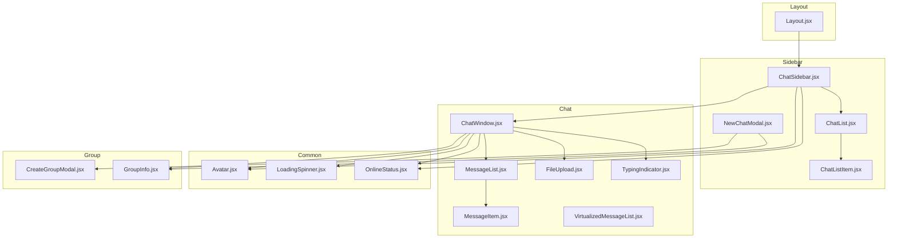
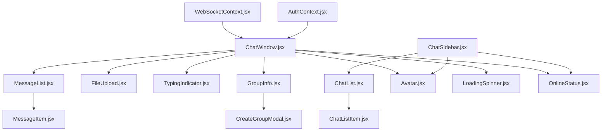
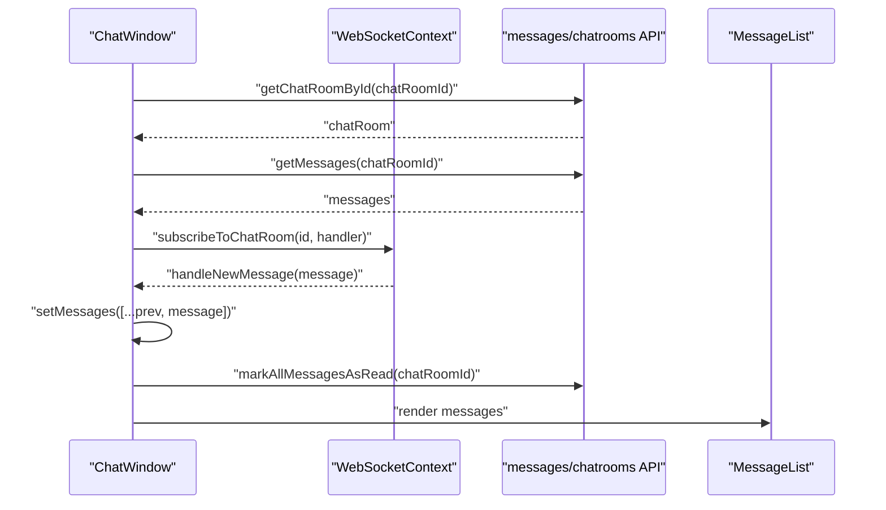
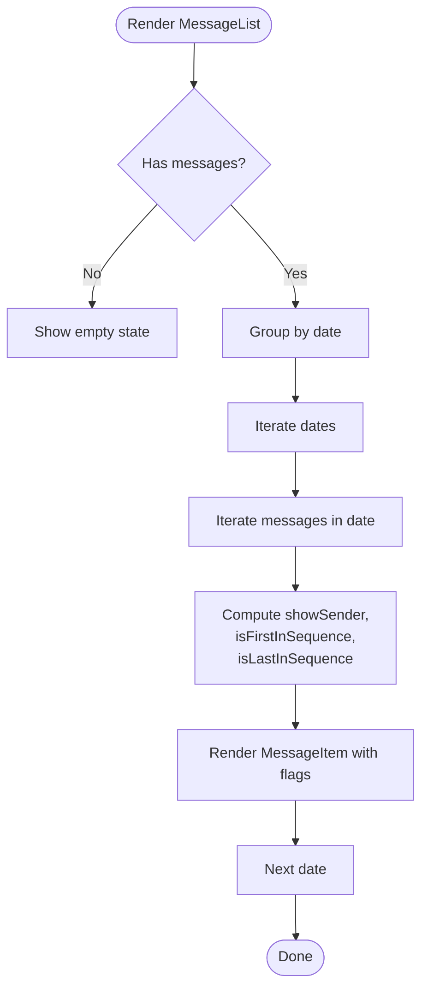
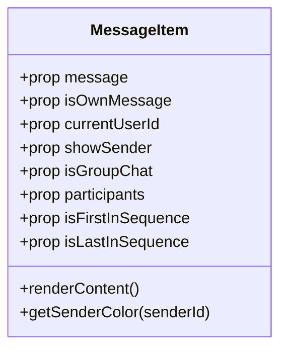
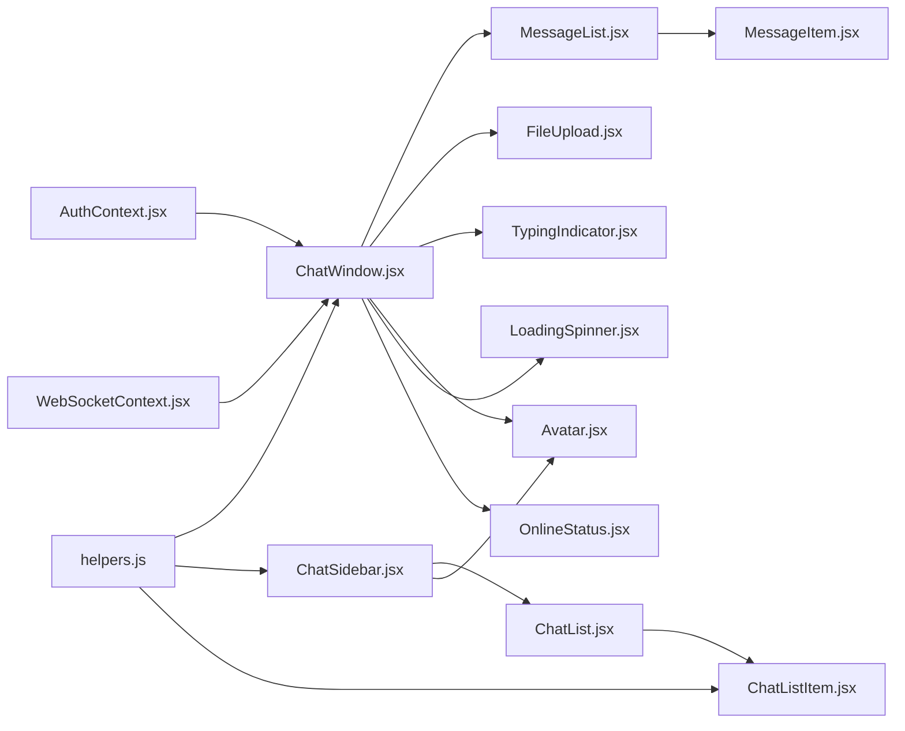

# Component Architecture

<cite>
**Referenced Files in This Document**
- [ChatWindow.jsx](file://chatify-frontend/src/components/Chat/ChatWindow.jsx)
- [MessageList.jsx](file://chatify-frontend/src/components/Chat/MessageList.jsx)
- [MessageItem.jsx](file://chatify-frontend/src/components/Chat/MessageItem.jsx)
- [FileUpload.jsx](file://chatify-frontend/src/components/Chat/FileUpload.jsx)
- [TypingIndicator.jsx](file://chatify-frontend/src/components/Chat/TypingIndicator.jsx)
- [VirtualizedMessageList.jsx](file://chatify-frontend/src/components/Chat/VirtualizedMessageList.jsx)
- [Avatar.jsx](file://chatify-frontend/src/components/Common/Avatar.jsx)
- [LoadingSpinner.jsx](file://chatify-frontend/src/components/Common/LoadingSpinner.jsx)
- [OnlineStatus.jsx](file://chatify-frontend/src/components/Common/OnlineStatus.jsx)
- [ChatList.jsx](file://chatify-frontend/src/components/Sidebar/ChatList.jsx)
- [ChatListItem.jsx](file://chatify-frontend/src/components/Sidebar/ChatListItem.jsx)
- [NewChatModal.jsx](file://chatify-frontend/src/components/Sidebar/NewChatModal.jsx)
- [CreateGroupModal.jsx](file://chatify-frontend/src/components/Group/CreateGroupModal.jsx)
- [GroupInfo.jsx](file://chatify-frontend/src/components/Group/GroupInfo.jsx)
- [Layout.jsx](file://chatify-frontend/src/components/Layout.jsx)
- [ChatSidebar.jsx](file://chatify-frontend/src/components/ChatSidebar.jsx)
- [AuthContext.jsx](file://chatify-frontend/src/context/AuthContext.jsx)
- [WebSocketContext.jsx](file://chatify-frontend/src/context/WebSocketContext.jsx)
- [useAuth.js](file://chatify-frontend/src/hooks/useAuth.js)
- [useWebSocket.js](file://chatify-frontend/src/hooks/useWebSocket.js)
- [helpers.js](file://chatify-frontend/src/utils/helpers.js)
</cite>

## Table of Contents
1. [Introduction](#introduction)
2. [Project Structure](#project-structure)
3. [Core Components](#core-components)
4. [Architecture Overview](#architecture-overview)
5. [Detailed Component Analysis](#detailed-component-analysis)
6. [Dependency Analysis](#dependency-analysis)
7. [Performance Considerations](#performance-considerations)
8. [Troubleshooting Guide](#troubleshooting-guide)
9. [Conclusion](#conclusion)

## Introduction
This document describes the Chatify component architecture with a focus on modular React component organization and composition patterns. It covers the chat component hierarchy (ChatWindow, MessageList, MessageItem, FileUpload, TypingIndicator), common components (Avatar, LoadingSpinner, OnlineStatus), sidebar components (ChatList, ChatListItem, NewChatModal), group management components (CreateGroupModal, GroupInfo), and layout integration. It also documents component props, event handling, state management, composition patterns, conditional rendering, responsive design, lifecycle management, performance optimization, and accessibility considerations.

## Project Structure
The frontend organizes components by feature domains:
- Chat: chat UI and messaging logic
- Common: reusable UI primitives
- Sidebar: conversation list and related modals
- Group: group chat management
- Root-level layout and navigation

**Diagram sources**
- [Layout.jsx:1-12](file://chatify-frontend/src/components/Layout.jsx#L1-L12)
- [ChatSidebar.jsx:1-218](file://chatify-frontend/src/components/ChatSidebar.jsx#L1-L218)
- [ChatList.jsx:1-37](file://chatify-frontend/src/components/Sidebar/ChatList.jsx#L1-L37)
- [ChatListItem.jsx:1-63](file://chatify-frontend/src/components/Sidebar/ChatListItem.jsx#L1-L63)
- [NewChatModal.jsx:1-204](file://chatify-frontend/src/components/Sidebar/NewChatModal.jsx#L1-L204)
- [ChatWindow.jsx:1-295](file://chatify-frontend/src/components/Chat/ChatWindow.jsx#L1-L295)
- [MessageList.jsx:1-96](file://chatify-frontend/src/components/Chat/MessageList.jsx#L1-L96)
- [MessageItem.jsx:1-182](file://chatify-frontend/src/components/Chat/MessageItem.jsx#L1-L182)
- [FileUpload.jsx:1-43](file://chatify-frontend/src/components/Chat/FileUpload.jsx#L1-L43)
- [TypingIndicator.jsx:1-44](file://chatify-frontend/src/components/Chat/TypingIndicator.jsx#L1-L44)
- [VirtualizedMessageList.jsx](file://chatify-frontend/src/components/Chat/VirtualizedMessageList.jsx)
- [Avatar.jsx:1-49](file://chatify-frontend/src/components/Common/Avatar.jsx#L1-L49)
- [LoadingSpinner.jsx:1-19](file://chatify-frontend/src/components/Common/LoadingSpinner.jsx#L1-L19)
- [OnlineStatus.jsx:1-25](file://chatify-frontend/src/components/Common/OnlineStatus.jsx#L1-L25)
- [CreateGroupModal.jsx:1-201](file://chatify-frontend/src/components/Group/CreateGroupModal.jsx#L1-L201)
- [GroupInfo.jsx:1-198](file://chatify-frontend/src/components/Group/GroupInfo.jsx#L1-L198)

**Section sources**
- [Layout.jsx:1-12](file://chatify-frontend/src/components/Layout.jsx#L1-L12)
- [ChatSidebar.jsx:1-218](file://chatify-frontend/src/components/ChatSidebar.jsx#L1-L218)

## Core Components
This section outlines the primary chat components and their responsibilities, props, and composition patterns.

- ChatWindow
  - Purpose: Orchestrates chat room data, scrolling behavior, WebSocket subscriptions, and renders header, message list, typing indicator, and input.
  - Key props: chatRoomId, onChatUpdated
  - State: chatRoom, messages, loading, showGroupInfo, isSubscribed
  - Event handling: handlesNewMessage, handleReadReceipt, handleMessageSent
  - Lifecycle: loads room and messages on mount/switch, subscribes/unsubscribes to WebSocket topics, manages scroll anchors, marks messages as read
  - Composition: renders MessageList, TypingIndicator, FileUpload, GroupInfo modal, and common UI elements

- MessageList
  - Purpose: Groups messages by calendar date and renders MessageItem for each message with contextual metadata (sender name, sequence, timestamps).
  - Key props: messages, currentUserId, chatRoom
  - Conditional rendering: empty state, date separators, unread indicators
  - Composition: iterates over grouped messages and passes derived flags to MessageItem

- MessageItem
  - Purpose: Renders individual message content with support for text, images, videos, and files; displays sender name in group chats; shows delivery/read status indicators.
  - Key props: message, isOwnMessage, isMe, currentUserId, showSender, isGroupChat, participants, isFirstInSequence, isLastInSequence
  - Rendering logic: dynamic content rendering, bubble styling, sender color derivation, status ticks
  - Accessibility: semantic markup, readable contrast, proper alt text for media

- FileUpload
  - Purpose: Provides a button to attach files and triggers onFileSelect callback.
  - Key props: onFileSelect, disabled
  - UX: hidden input click-through, accessible button, disabled state handling

- TypingIndicator
  - Purpose: Displays who is currently typing in the chat room (excluding current user).
  - Key props: chatRoomId
  - Data source: WebSocketContext typing users map

- VirtualizedMessageList
  - Purpose: Optimizes rendering of large message lists using virtualization to improve performance.
  - Implementation note: This component is referenced but not present in the current snapshot; see Performance Considerations for guidance.

**Section sources**
- [ChatWindow.jsx:18-295](file://chatify-frontend/src/components/Chat/ChatWindow.jsx#L18-L295)
- [MessageList.jsx:4-96](file://chatify-frontend/src/components/Chat/MessageList.jsx#L4-L96)
- [MessageItem.jsx:34-182](file://chatify-frontend/src/components/Chat/MessageItem.jsx#L34-L182)
- [FileUpload.jsx:4-43](file://chatify-frontend/src/components/Chat/FileUpload.jsx#L4-L43)
- [TypingIndicator.jsx:4-44](file://chatify-frontend/src/components/Chat/TypingIndicator.jsx#L4-L44)
- [VirtualizedMessageList.jsx](file://chatify-frontend/src/components/Chat/VirtualizedMessageList.jsx)

## Architecture Overview
The architecture follows a layered pattern:
- Context layer: AuthContext and WebSocketContext provide global state and real-time capabilities
- UI layer: ChatWindow composes MessageList and MessageItem; Sidebar composes ChatList and ChatListItem; Group modals manage group operations
- Utility layer: helpers.js provides shared utilities for formatting and transformations
- API layer: services and APIs are consumed via hooks and context

**Diagram sources**
- [AuthContext.jsx:1-53](file://chatify-frontend/src/context/AuthContext.jsx#L1-L53)
- [WebSocketContext.jsx:1-190](file://chatify-frontend/src/context/WebSocketContext.jsx#L1-L190)
- [ChatWindow.jsx:1-295](file://chatify-frontend/src/components/Chat/ChatWindow.jsx#L1-L295)
- [MessageList.jsx:1-96](file://chatify-frontend/src/components/Chat/MessageList.jsx#L1-L96)
- [MessageItem.jsx:1-182](file://chatify-frontend/src/components/Chat/MessageItem.jsx#L1-L182)
- [FileUpload.jsx:1-43](file://chatify-frontend/src/components/Chat/FileUpload.jsx#L1-L43)
- [TypingIndicator.jsx:1-44](file://chatify-frontend/src/components/Chat/TypingIndicator.jsx#L1-L44)
- [ChatSidebar.jsx:1-218](file://chatify-frontend/src/components/ChatSidebar.jsx#L1-L218)
- [ChatList.jsx:1-37](file://chatify-frontend/src/components/Sidebar/ChatList.jsx#L1-L37)
- [ChatListItem.jsx:1-63](file://chatify-frontend/src/components/Sidebar/ChatListItem.jsx#L1-L63)
- [CreateGroupModal.jsx:1-201](file://chatify-frontend/src/components/Group/CreateGroupModal.jsx#L1-L201)
- [GroupInfo.jsx:1-198](file://chatify-frontend/src/components/Group/GroupInfo.jsx#L1-L198)
- [Avatar.jsx:1-49](file://chatify-frontend/src/components/Common/Avatar.jsx#L1-L49)
- [LoadingSpinner.jsx:1-19](file://chatify-frontend/src/components/Common/LoadingSpinner.jsx#L1-L19)
- [OnlineStatus.jsx:1-25](file://chatify-frontend/src/components/Common/OnlineStatus.jsx#L1-L25)

## Detailed Component Analysis

### ChatWindow Analysis
- Responsibilities
  - Loads chat room and messages
  - Manages scroll behavior (snap to bottom, smooth scroll near bottom)
  - Subscribes to WebSocket topics and handles read receipts
  - Renders header with avatar/status, message list, typing indicator, and input
  - Conditionally renders group info modal
- Props
  - chatRoomId: identifies the active chat room
  - onChatUpdated: callback invoked on message events
- State and refs
  - Local state: chatRoom, messages, loading, showGroupInfo, isSubscribed
  - Refs: scrollContainerRef, bottomAnchorRef, loadedIdsRef, isLoadingRef, shouldScrollRef
- Event handling
  - handleNewMessage: deduplicates and appends incoming messages
  - handleReadReceipt: updates readByUserIds for a message
  - handleMessageSent: appends locally sent messages
- Lifecycle
  - Resets state on chatRoomId change
  - Subscribes after loading completes and re-subscribes on reconnect
- Composition
  - Uses helpers for display names and participant lookup
  - Integrates with common components (Avatar, OnlineStatus, LoadingSpinner)

**Diagram sources**
- [ChatWindow.jsx:58-87](file://chatify-frontend/src/components/Chat/ChatWindow.jsx#L58-L87)
- [ChatWindow.jsx:108-148](file://chatify-frontend/src/components/Chat/ChatWindow.jsx#L108-L148)
- [ChatWindow.jsx:164-189](file://chatify-frontend/src/components/Chat/ChatWindow.jsx#L164-L189)

**Section sources**
- [ChatWindow.jsx:18-295](file://chatify-frontend/src/components/Chat/ChatWindow.jsx#L18-L295)
- [helpers.js:42-56](file://chatify-frontend/src/utils/helpers.js#L42-L56)

### MessageList Analysis
- Responsibilities
  - Groups messages by calendar date
  - Computes display flags for sender name and bubble styling
  - Renders date separators and message rows
- Props
  - messages: array of message objects
  - currentUserId: ID of the logged-in user
  - chatRoom: current chat room metadata
- Rendering logic
  - Empty state when no messages
  - Date label formatting with Today/Yesterday normalization
  - Sequence detection for sender name and bubble tails/radii

**Diagram sources**
- [MessageList.jsx:17-93](file://chatify-frontend/src/components/Chat/MessageList.jsx#L17-L93)

**Section sources**
- [MessageList.jsx:4-96](file://chatify-frontend/src/components/Chat/MessageList.jsx#L4-L96)

### MessageItem Analysis
- Responsibilities
  - Renders content based on message type (text, image, video, file)
  - Displays sender name in group chats when appropriate
  - Shows delivery/read status ticks for own messages
  - Applies bubble styling and radii based on message sequence
- Props
  - message: message object
  - isOwnMessage/isMe: boolean indicating ownership
  - currentUserId: ID of the logged-in user
  - showSender: whether to show sender name
  - isGroupChat: indicates group chat context
  - participants: participant list for group chat
  - isFirstInSequence/isLastInSequence: sequence flags
- Rendering logic
  - Content renderer for different message types
  - Sender color derived from participant ID
  - Timestamp formatting and status ticks

**Diagram sources**
- [MessageItem.jsx:34-182](file://chatify-frontend/src/components/Chat/MessageItem.jsx#L34-L182)

**Section sources**
- [MessageItem.jsx:34-182](file://chatify-frontend/src/components/Chat/MessageItem.jsx#L34-L182)

### FileUpload Analysis
- Responsibilities
  - Opens hidden file input on button click
  - Invokes onFileSelect with selected file
  - Supports disabled state
- Props
  - onFileSelect: callback receiving the selected file
  - disabled: disables interaction

**Section sources**
- [FileUpload.jsx:4-43](file://chatify-frontend/src/components/Chat/FileUpload.jsx#L4-L43)

### TypingIndicator Analysis
- Responsibilities
  - Displays typing indicators for other users in the chat room
  - Handles pluralization of typing text
- Props
  - chatRoomId: active chat room identifier
- Data source
  - WebSocketContext typing users map filtered by current username

**Section sources**
- [TypingIndicator.jsx:4-44](file://chatify-frontend/src/components/Chat/TypingIndicator.jsx#L4-L44)

### Common Components
- Avatar
  - Renders profile picture or initials badge with optional online status dot
  - Props: user, size, showStatus, isOnline
- LoadingSpinner
  - Animated spinner with configurable size
  - Props: size, className
- OnlineStatus
  - Dot and optional label indicating online/offline
  - Props: isOnline, showLabel, size

**Section sources**
- [Avatar.jsx:4-49](file://chatify-frontend/src/components/Common/Avatar.jsx#L4-L49)
- [LoadingSpinner.jsx:1-19](file://chatify-frontend/src/components/Common/LoadingSpinner.jsx#L1-L19)
- [OnlineStatus.jsx:1-25](file://chatify-frontend/src/components/Common/OnlineStatus.jsx#L1-L25)

### Sidebar Components
- ChatList
  - Renders list of chat rooms or loading/empty states
  - Props: chatRooms, selectedChatRoomId, onSelectChatRoom, loading
- ChatListItem
  - Displays avatar, name, last message preview, timestamp, and unread count
  - Props: chatRoom, isSelected, onClick
  - Integrates with AuthContext and WebSocketContext for online status and display name
- NewChatModal
  - Provides UI to create new chats and modals for chat management
  - Props: none (manages internal state and navigates via react-router)

**Section sources**
- [ChatList.jsx:4-37](file://chatify-frontend/src/components/Sidebar/ChatList.jsx#L4-L37)
- [ChatListItem.jsx:6-63](file://chatify-frontend/src/components/Sidebar/ChatListItem.jsx#L6-L63)
- [NewChatModal.jsx:1-204](file://chatify-frontend/src/components/Sidebar/NewChatModal.jsx#L1-L204)

### Group Management Components
- CreateGroupModal
  - Loads users, allows selection of participants, creates group chat
  - Props: onClose, onGroupCreated
  - State: groupName, users, selectedUsers, loading, creating
- GroupInfo
  - Displays group details, participant list, and admin actions (add/remove)
  - Props: chatRoom, onClose, onChatRoomUpdated
  - State: showAddParticipant, availableUsers, loadingUsers, actionLoading

**Section sources**
- [CreateGroupModal.jsx:9-201](file://chatify-frontend/src/components/Group/CreateGroupModal.jsx#L9-L201)
- [GroupInfo.jsx:9-198](file://chatify-frontend/src/components/Group/GroupInfo.jsx#L9-L198)

### Layout Integration
- Layout
  - Wraps child routes with a container suitable for full-screen applications
  - Props: none (Outlet renders nested routes)
- ChatSidebar
  - Sidebar with tabs, room list, presence updates, and logout
  - Props: rooms, setRooms, onNewChat (forwarded via ref)

**Section sources**
- [Layout.jsx:3-12](file://chatify-frontend/src/components/Layout.jsx#L3-L12)
- [ChatSidebar.jsx:8-218](file://chatify-frontend/src/components/ChatSidebar.jsx#L8-L218)

## Dependency Analysis
- Context dependencies
  - ChatWindow depends on AuthContext for user identity and WebSocketContext for real-time features
  - ChatListItem depends on AuthContext and WebSocketContext for online status and display name
- Component coupling
  - ChatWindow composes MessageList and MessageItem; MessageList composes MessageItem
  - Sidebar components depend on helpers for display names and timestamps
- External dependencies
  - WebSocketContext integrates with SockJS and @stomp/stompjs for real-time messaging
  - Helpers encapsulate formatting and utility functions

**Diagram sources**
- [AuthContext.jsx:1-53](file://chatify-frontend/src/context/AuthContext.jsx#L1-L53)
- [WebSocketContext.jsx:1-190](file://chatify-frontend/src/context/WebSocketContext.jsx#L1-L190)
- [ChatWindow.jsx:1-295](file://chatify-frontend/src/components/Chat/ChatWindow.jsx#L1-L295)
- [MessageList.jsx:1-96](file://chatify-frontend/src/components/Chat/MessageList.jsx#L1-L96)
- [MessageItem.jsx:1-182](file://chatify-frontend/src/components/Chat/MessageItem.jsx#L1-L182)
- [FileUpload.jsx:1-43](file://chatify-frontend/src/components/Chat/FileUpload.jsx#L1-L43)
- [TypingIndicator.jsx:1-44](file://chatify-frontend/src/components/Chat/TypingIndicator.jsx#L1-L44)
- [ChatSidebar.jsx:1-218](file://chatify-frontend/src/components/ChatSidebar.jsx#L1-L218)
- [ChatList.jsx:1-37](file://chatify-frontend/src/components/Sidebar/ChatList.jsx#L1-L37)
- [ChatListItem.jsx:1-63](file://chatify-frontend/src/components/Sidebar/ChatListItem.jsx#L1-L63)
- [Avatar.jsx:1-49](file://chatify-frontend/src/components/Common/Avatar.jsx#L1-L49)
- [LoadingSpinner.jsx:1-19](file://chatify-frontend/src/components/Common/LoadingSpinner.jsx#L1-L19)
- [OnlineStatus.jsx:1-25](file://chatify-frontend/src/components/Common/OnlineStatus.jsx#L1-L25)
- [helpers.js:1-90](file://chatify-frontend/src/utils/helpers.js#L1-L90)

**Section sources**
- [AuthContext.jsx:1-53](file://chatify-frontend/src/context/AuthContext.jsx#L1-L53)
- [WebSocketContext.jsx:1-190](file://chatify-frontend/src/context/WebSocketContext.jsx#L1-L190)
- [helpers.js:1-90](file://chatify-frontend/src/utils/helpers.js#L1-L90)

## Performance Considerations
- Memoization and callbacks
  - ChatWindow uses useCallback for scroll helpers, loaders, and handlers to prevent unnecessary re-renders
  - ChatSidebar uses useMemo to filter rooms by active tab
- Virtualization
  - VirtualizedMessageList is referenced for large message lists; implement a virtualized list to avoid rendering overhead
- Refs for DOM measurements
  - ChatWindow uses refs for scroll container and anchor to control scroll behavior efficiently
- Debouncing and batching
  - Consider debouncing scroll handlers and grouping frequent UI updates
- Accessibility
  - Ensure focus management during scroll-to-bottom and modal transitions
  - Provide ARIA labels for online status and typing indicators
- Responsive design
  - Components rely on Tailwind utilities for responsive spacing and sizing; maintain consistent breakpoints across layouts

[No sources needed since this section provides general guidance]

## Troubleshooting Guide
- WebSocket reconnection
  - WebSocketContext automatically attempts token refresh on STOMP errors and reconnects with updated headers
- Scroll behavior anomalies
  - ChatWindow measures scroll thresholds and uses requestAnimationFrame to ensure DOM readiness before scrolling
- Duplicate messages
  - ChatWindow deduplicates incoming messages using a Set of loaded IDs
- Read receipts
  - ChatWindow updates readByUserIds upon receipt events and marks messages as read for non-current users
- Group participant management
  - GroupInfo handles adding/removing participants and updates chat room state via onChatRoomUpdated

**Section sources**
- [WebSocketContext.jsx:27-45](file://chatify-frontend/src/context/WebSocketContext.jsx#L27-L45)
- [WebSocketContext.jsx:74-90](file://chatify-frontend/src/context/WebSocketContext.jsx#L74-L90)
- [ChatWindow.jsx:108-148](file://chatify-frontend/src/components/Chat/ChatWindow.jsx#L108-L148)
- [ChatWindow.jsx:124-136](file://chatify-frontend/src/components/Chat/ChatWindow.jsx#L124-L136)

## Conclusion
Chatify’s component architecture emphasizes composability, separation of concerns, and real-time responsiveness. ChatWindow orchestrates data and subscriptions while delegating presentation to MessageList and MessageItem. Common components promote reuse across the app, and the sidebar and group components provide cohesive navigation and management experiences. Context providers enable centralized state and WebSocket connectivity, while helpers encapsulate shared logic. Adopting virtualization for large message lists and maintaining accessibility and responsive design will further enhance performance and usability.