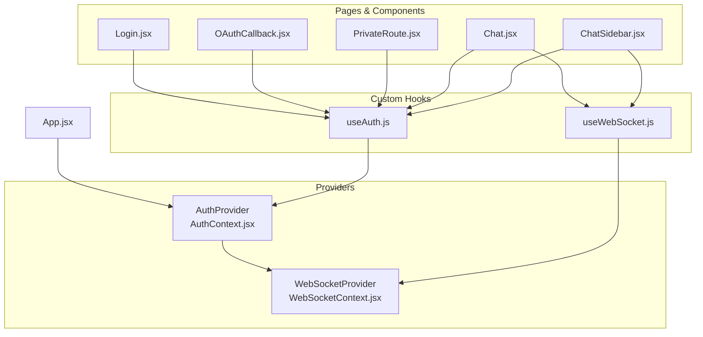
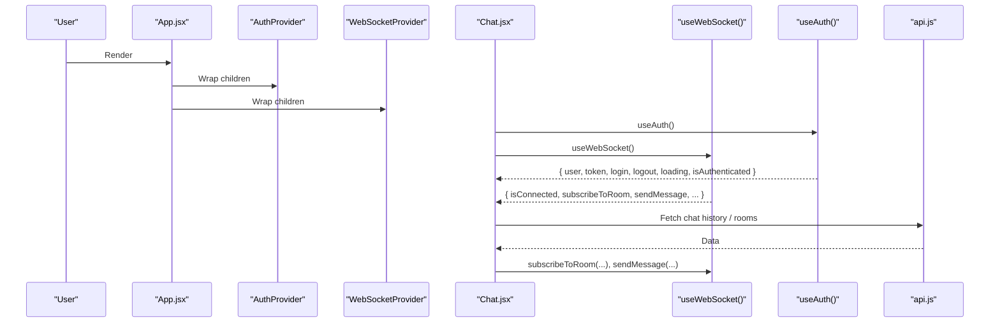
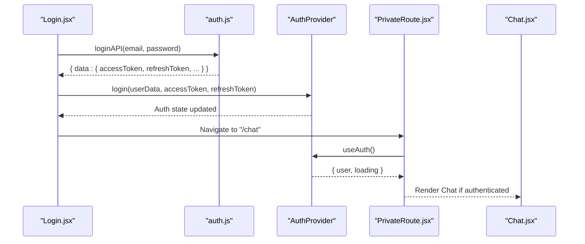
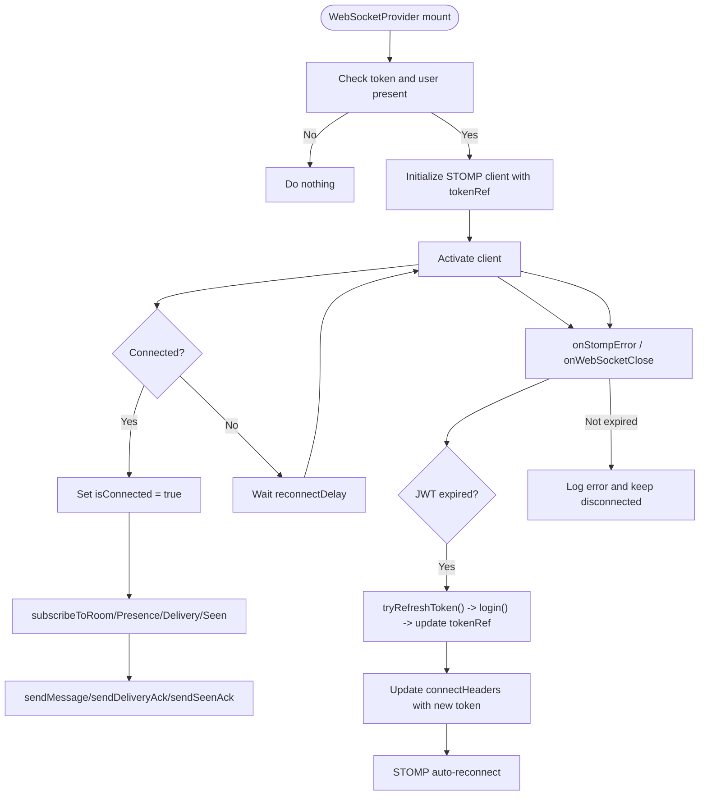
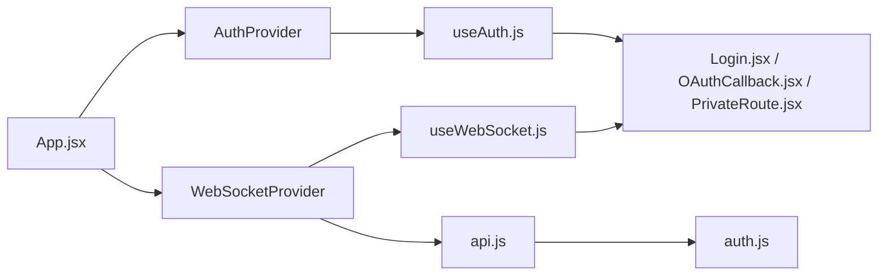

# Context Providers and State Management

<cite>
**Referenced Files in This Document**
- [App.jsx](file://chatify-frontend/src/App.jsx)
- [AuthContext.jsx](file://chatify-frontend/src/context/AuthContext.jsx)
- [WebSocketContext.jsx](file://chatify-frontend/src/context/WebSocketContext.jsx)
- [useAuth.js](file://chatify-frontend/src/hooks/useAuth.js)
- [useWebSocket.js](file://chatify-frontend/src/hooks/useWebSocket.js)
- [Login.jsx](file://chatify-frontend/src/pages/Login.jsx)
- [OAuthCallback.jsx](file://chatify-frontend/src/pages/OAuthCallback.jsx)
- [PrivateRoute.jsx](file://chatify-frontend/src/components/PrivateRoute.jsx)
- [Chat.jsx](file://chatify-frontend/src/pages/Chat.jsx)
- [ChatSidebar.jsx](file://chatify-frontend/src/components/ChatSidebar.jsx)
- [api.js](file://chatify-frontend/src/services/api.js)
- [auth.js](file://chatify-frontend/src/api/auth.js)
- [constants.js](file://chatify-frontend/src/utils/constants.js)
</cite>

## Table of Contents
1. [Introduction](#introduction)
2. [Project Structure](#project-structure)
3. [Core Components](#core-components)
4. [Architecture Overview](#architecture-overview)
5. [Detailed Component Analysis](#detailed-component-analysis)
6. [Dependency Analysis](#dependency-analysis)
7. [Performance Considerations](#performance-considerations)
8. [Troubleshooting Guide](#troubleshooting-guide)
9. [Conclusion](#conclusion)

## Introduction
This document explains the Chatify context providers and state management system built on React’s Context API and custom hooks. It covers:
- Authentication state management via AuthContext.jsx, including login, logout, JWT token handling, and OAuth2 callback processing.
- Real-time communication state via WebSocketContext.jsx, including connection lifecycle, message broadcasting, error handling, and automatic reconnection.
- Custom hooks useAuth.js and useWebSocket.js that simplify consuming context in components.
- Authentication flow from login to protected route access, token refresh mechanisms, and logout procedures.
- WebSocket connection lifecycle, message delivery/seen acknowledgments, and reconnection strategies.
- Practical examples of context consumption, state synchronization patterns, and error boundary considerations.
- Performance considerations for context updates, memory management, and component re-render optimization.

## Project Structure
The state management stack is organized around two providers and two custom hooks:
- Providers
  - AuthProvider wraps the app and manages user, token, and loading state.
  - WebSocketProvider manages STOMP/WebSocket connections, subscriptions, and message acknowledgments.
- Hooks
  - useAuth returns the current authentication context value.
  - useWebSocket returns the current WebSocket context value.

**Diagram sources**
- [App.jsx:34-71](file://chatify-frontend/src/App.jsx#L34-L71)
- [AuthContext.jsx:9-53](file://chatify-frontend/src/context/AuthContext.jsx#L9-L53)
- [WebSocketContext.jsx:10-190](file://chatify-frontend/src/context/WebSocketContext.jsx#L10-L190)
- [useAuth.js:1-8](file://chatify-frontend/src/hooks/useAuth.js#L1-L8)
- [useWebSocket.js:1-8](file://chatify-frontend/src/hooks/useWebSocket.js#L1-L8)
- [Login.jsx:14](file://chatify-frontend/src/pages/Login.jsx#L14)
- [OAuthCallback.jsx:8](file://chatify-frontend/src/pages/OAuthCallback.jsx#L8)
- [PrivateRoute.jsx:6](file://chatify-frontend/src/components/PrivateRoute.jsx#L6)
- [Chat.jsx:35-44](file://chatify-frontend/src/pages/Chat.jsx#L35-L44)
- [ChatSidebar.jsx:11-12](file://chatify-frontend/src/components/ChatSidebar.jsx#L11-L12)

**Section sources**
- [App.jsx:34-71](file://chatify-frontend/src/App.jsx#L34-L71)
- [AuthContext.jsx:9-53](file://chatify-frontend/src/context/AuthContext.jsx#L9-L53)
- [WebSocketContext.jsx:10-190](file://chatify-frontend/src/context/WebSocketContext.jsx#L10-L190)
- [useAuth.js:1-8](file://chatify-frontend/src/hooks/useAuth.js#L1-L8)
- [useWebSocket.js:1-8](file://chatify-frontend/src/hooks/useWebSocket.js#L1-L8)

## Core Components
- AuthContext.jsx
  - Exposes user, token, login, logout, loading, and isAuthenticated.
  - Persists tokens and user data to localStorage on login and clears on logout.
  - Initializes state from localStorage on mount and guards against corrupted entries.
- WebSocketContext.jsx
  - Manages STOMP/WebSocket connection via @stomp/stompjs and sockjs-client.
  - Provides subscribe/unsubscribe methods for chatroom, presence, delivery, and seen topics.
  - Provides publish methods for sending messages and delivery/seen acknowledgments.
  - Implements automatic token refresh on STOMP errors or WebSocket close events.
  - Keeps tokenRef synchronized with the latest token to ensure reconnects use the freshest credentials.
- useAuth.js and useWebSocket.js
  - Thin wrappers around useContext for convenient consumption in components.

Key state value structures:
- Auth context value: { user, token, login, logout, loading, isAuthenticated }
- WebSocket context value: { isConnected, subscribeToRoom, subscribeToPresence, subscribeToDelivery, subscribeToSeen, sendMessage, sendDeliveryAck, sendSeenAck }

**Section sources**
- [AuthContext.jsx:9-53](file://chatify-frontend/src/context/AuthContext.jsx#L9-L53)
- [WebSocketContext.jsx:10-190](file://chatify-frontend/src/context/WebSocketContext.jsx#L10-L190)
- [useAuth.js:1-8](file://chatify-frontend/src/hooks/useAuth.js#L1-L8)
- [useWebSocket.js:1-8](file://chatify-frontend/src/hooks/useWebSocket.js#L1-L8)

## Architecture Overview
The app composes providers at the root and exposes context values to pages and components through custom hooks. Authentication drives route protection, while WebSocket enables real-time messaging and presence.

**Diagram sources**
- [App.jsx:34-71](file://chatify-frontend/src/App.jsx#L34-L71)
- [AuthContext.jsx:9-53](file://chatify-frontend/src/context/AuthContext.jsx#L9-L53)
- [WebSocketContext.jsx:10-190](file://chatify-frontend/src/context/WebSocketContext.jsx#L10-L190)
- [Chat.jsx:35-44](file://chatify-frontend/src/pages/Chat.jsx#L35-L44)
- [api.js:100-121](file://chatify-frontend/src/services/api.js#L100-L121)

## Detailed Component Analysis

### Authentication Flow and State Management
- Initialization
  - AuthProvider reads user and token from localStorage on mount and sets loading to false.
  - If localStorage entries are invalid, they are removed and the app remains in a logged-out state.
- Login
  - Login page calls loginAPI and upon success invokes the context login method with userData, accessToken, and refreshToken.
  - login persists tokens and user data to localStorage and updates context state.
- Logout
  - logout removes tokens and user data from localStorage and resets context state.
- OAuth2 Callback
  - OAuthCallback exchanges an HttpOnly cookie for JWT tokens via a backend endpoint, then calls login to finalize authentication.
- Protected Routes
  - PrivateRoute uses useAuth to block navigation when user is null or loading is true.

**Diagram sources**
- [Login.jsx:17-33](file://chatify-frontend/src/pages/Login.jsx#L17-L33)
- [auth.js:8-11](file://chatify-frontend/src/api/auth.js#L8-L11)
- [AuthContext.jsx:30-44](file://chatify-frontend/src/context/AuthContext.jsx#L30-L44)
- [PrivateRoute.jsx:6-18](file://chatify-frontend/src/components/PrivateRoute.jsx#L6-L18)
- [Chat.jsx:35](file://chatify-frontend/src/pages/Chat.jsx#L35)

**Section sources**
- [AuthContext.jsx:14-28](file://chatify-frontend/src/context/AuthContext.jsx#L14-L28)
- [AuthContext.jsx:30-44](file://chatify-frontend/src/context/AuthContext.jsx#L30-L44)
- [Login.jsx:17-33](file://chatify-frontend/src/pages/Login.jsx#L17-L33)
- [OAuthCallback.jsx:15-51](file://chatify-frontend/src/pages/OAuthCallback.jsx#L15-L51)
- [PrivateRoute.jsx:6-18](file://chatify-frontend/src/components/PrivateRoute.jsx#L6-L18)

### WebSocket Provider Lifecycle and Reconnection
- Connection Establishment
  - Creates a STOMP client with SockJS using WS_URL and Authorization header from tokenRef.
  - Sets heartbeat intervals and reconnectDelay.
- Subscription Model
  - Provides subscribeToRoom, subscribeToPresence, subscribeToDelivery, subscribeToSeen.
  - Subscriptions are created only when connected and clientRef is available.
- Publishing and Acknowledgments
  - sendMessage publishes to per-room destinations.
  - sendDeliveryAck and sendSeenAck publish delivery/seen updates.
- Error Handling and Reconnection
  - onStompError detects JWT expiration and triggers token refresh; updates connectHeaders and relies on STOMP auto-reconnect.
  - onWebSocketClose checks close codes/reasons for auth-related closures and repeats refresh+reconnect.
  - onWebSocketError and onDisconnect set isConnected to false and rely on reconnectDelay.
- Token Refresh Integration
  - tryRefreshToken calls refreshTokenAPI, updates localStorage and context via login, and refreshes tokenRef for subsequent reconnects.

**Diagram sources**
- [WebSocketContext.jsx:47-122](file://chatify-frontend/src/context/WebSocketContext.jsx#L47-L122)
- [WebSocketContext.jsx:27-45](file://chatify-frontend/src/context/WebSocketContext.jsx#L27-L45)
- [WebSocketContext.jsx:124-175](file://chatify-frontend/src/context/WebSocketContext.jsx#L124-L175)

**Section sources**
- [WebSocketContext.jsx:10-190](file://chatify-frontend/src/context/WebSocketContext.jsx#L10-L190)

### Custom Hooks: useAuth and useWebSocket
- useAuth
  - Returns the current AuthContext value for easy consumption in components.
- useWebSocket
  - Returns the current WebSocketContext value for real-time features.

Usage examples:
- Chat.jsx consumes useAuth for user identity and useWebSocket for subscriptions and publishing.
- ChatSidebar.jsx consumes both hooks to manage room lists, presence, and logout.

**Section sources**
- [useAuth.js:1-8](file://chatify-frontend/src/hooks/useAuth.js#L1-L8)
- [useWebSocket.js:1-8](file://chatify-frontend/src/hooks/useWebSocket.js#L1-L8)
- [Chat.jsx:35-44](file://chatify-frontend/src/pages/Chat.jsx#L35-L44)
- [ChatSidebar.jsx:11-12](file://chatify-frontend/src/components/ChatSidebar.jsx#L11-L12)

### Context Consumption Patterns in Components
- Authentication
  - Login.jsx uses useAuth to call login after successful API authentication.
  - OAuthCallback.jsx uses useAuth to finalize login after exchanging OAuth2 tokens.
  - PrivateRoute.jsx uses useAuth to enforce route protection.
- Real-time Messaging
  - Chat.jsx uses useWebSocket to subscribe to room messages, delivery, and seen updates, and to send messages and acknowledgments.
  - ChatSidebar.jsx uses useWebSocket to subscribe to presence and room activity, updating unread counts and online status.

State synchronization patterns:
- Subscriptions are created when chatId changes and isConnected becomes true.
- Subscriptions are cleaned up on unmount to prevent leaks.
- Presence and delivery/seen updates are applied immutably to state arrays and objects.

**Section sources**
- [Login.jsx:14](file://chatify-frontend/src/pages/Login.jsx#L14)
- [OAuthCallback.jsx:8](file://chatify-frontend/src/pages/OAuthCallback.jsx#L8)
- [PrivateRoute.jsx:6](file://chatify-frontend/src/components/PrivateRoute.jsx#L6)
- [Chat.jsx:184-287](file://chatify-frontend/src/pages/Chat.jsx#L184-L287)
- [ChatSidebar.jsx:31-72](file://chatify-frontend/src/components/ChatSidebar.jsx#L31-L72)

## Dependency Analysis
- Provider composition
  - App.jsx composes AuthProvider and WebSocketProvider around routes.
- Hook dependencies
  - useAuth depends on AuthContext.
  - useWebSocket depends on WebSocketContext.
- Cross-provider dependencies
  - WebSocketProvider depends on useAuth for token and user state to initialize and maintain the connection.
- API integration
  - api.js interceptors handle token refresh for REST requests and coordinate with AuthContext state.
  - auth.js provides login, register, logout, and refreshToken endpoints used by pages and hooks.

**Diagram sources**
- [App.jsx:34-71](file://chatify-frontend/src/App.jsx#L34-L71)
- [AuthContext.jsx:9-53](file://chatify-frontend/src/context/AuthContext.jsx#L9-L53)
- [WebSocketContext.jsx:10-190](file://chatify-frontend/src/context/WebSocketContext.jsx#L10-L190)
- [useAuth.js:1-8](file://chatify-frontend/src/hooks/useAuth.js#L1-L8)
- [useWebSocket.js:1-8](file://chatify-frontend/src/hooks/useWebSocket.js#L1-L8)
- [api.js:100-121](file://chatify-frontend/src/services/api.js#L100-L121)
- [auth.js:1-22](file://chatify-frontend/src/api/auth.js#L1-L22)

**Section sources**
- [App.jsx:34-71](file://chatify-frontend/src/App.jsx#L34-L71)
- [api.js:100-121](file://chatify-frontend/src/services/api.js#L100-L121)
- [auth.js:1-22](file://chatify-frontend/src/api/auth.js#L1-L22)

## Performance Considerations
- Minimizing re-renders
  - Keep context values granular; avoid putting heavy objects in context if not needed.
  - Memoize callbacks passed to consumers using useMemo/useCallback to prevent unnecessary prop changes.
- Subscription lifecycle
  - Always unsubscribe from WebSocket subscriptions on component unmount to avoid stale closures and memory leaks.
- Token and state updates
  - Update tokenRef in WebSocketProvider to avoid recreating the STOMP client on every render.
  - Persist tokens to localStorage only on verified success to reduce IO overhead.
- Pagination and virtualization
  - Chat.jsx uses pagination and virtualized lists to limit DOM and state churn during large histories.
- Heartbeats and reconnect delays
  - Tune heartbeat and reconnectDelay to balance responsiveness and server load.

[No sources needed since this section provides general guidance]

## Troubleshooting Guide
- Authentication
  - If login appears to succeed but navigation does not occur, verify that login is called with the correct userData, accessToken, and refreshToken.
  - If tokens expire mid-session, ensure refreshTokenAPI is reachable and returns valid tokens.
- WebSocket
  - If messages do not arrive, confirm isConnected is true and subscriptions are established after chatId changes.
  - If reconnect loops occur, inspect onStompError/onWebSocketClose handlers and ensure token refresh succeeds.
- Route protection
  - If PrivateRoute blocks legitimate users, verify useAuth returns user and loading is false after initialization.

**Section sources**
- [AuthContext.jsx:30-44](file://chatify-frontend/src/context/AuthContext.jsx#L30-L44)
- [WebSocketContext.jsx:74-108](file://chatify-frontend/src/context/WebSocketContext.jsx#L74-L108)
- [PrivateRoute.jsx:9-18](file://chatify-frontend/src/components/PrivateRoute.jsx#L9-L18)

## Conclusion
Chatify’s context providers and custom hooks deliver a cohesive authentication and real-time messaging layer. AuthContext manages user and token state with localStorage persistence, while WebSocketContext orchestrates STOMP connections, subscriptions, and automatic reconnection with token refresh. Custom hooks simplify integration across components, enabling robust patterns for protected routing, live chat, presence, and delivery/seen acknowledgments. Following the outlined performance and troubleshooting guidance helps maintain a responsive and reliable user experience.