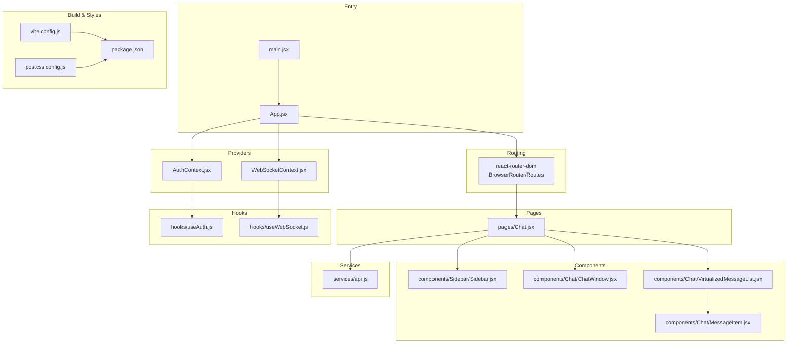
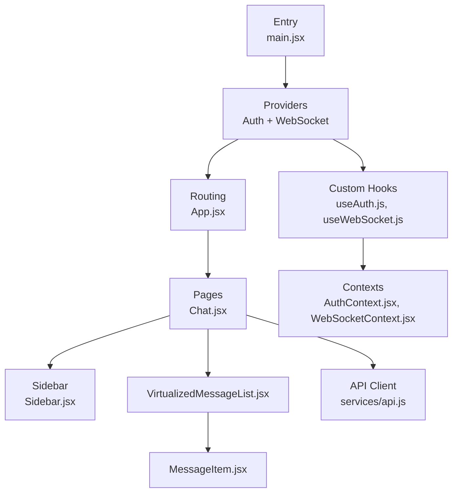
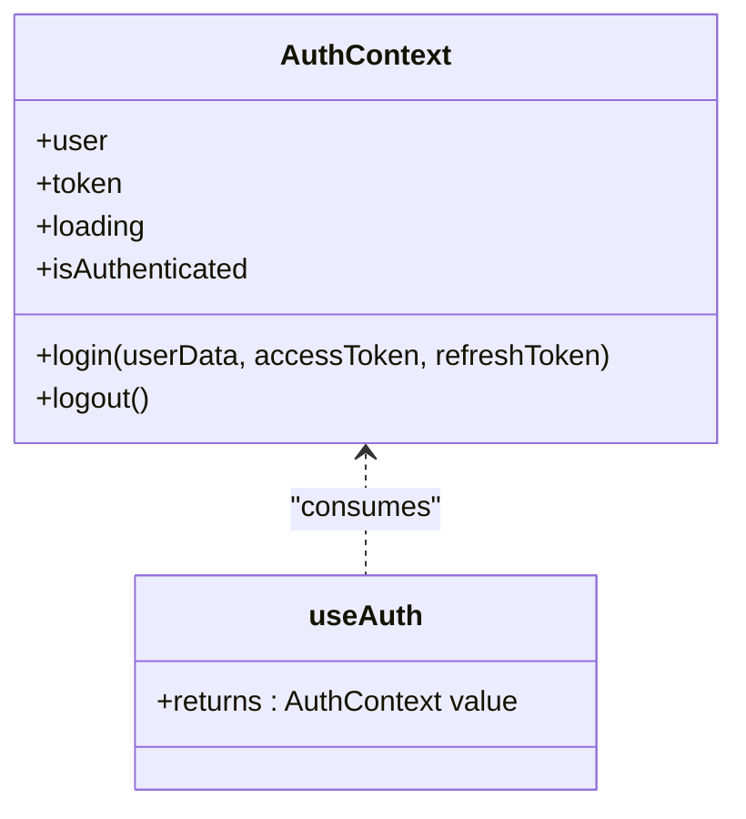
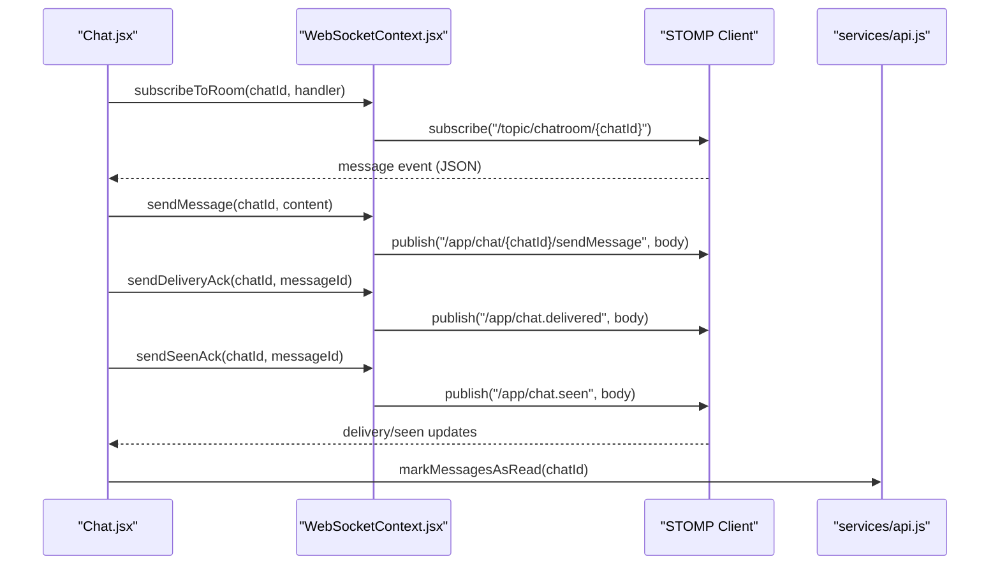
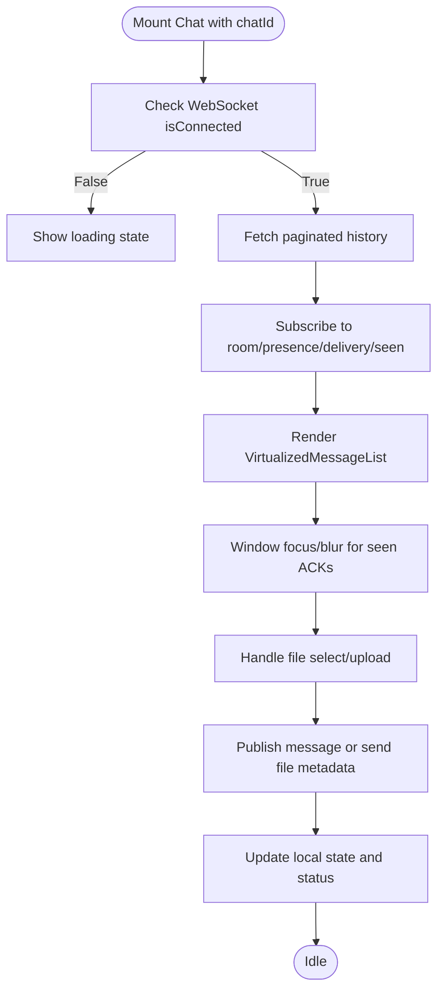
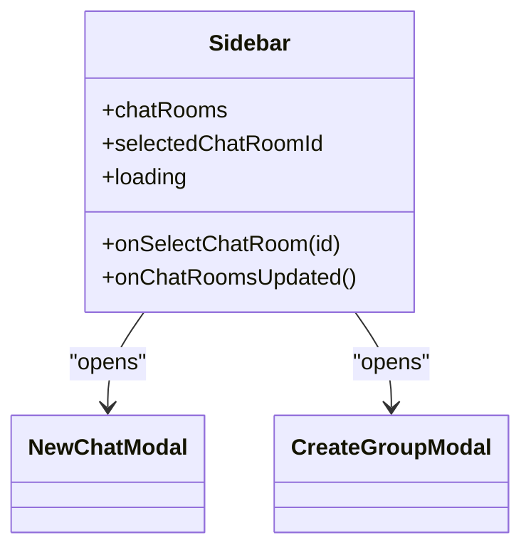
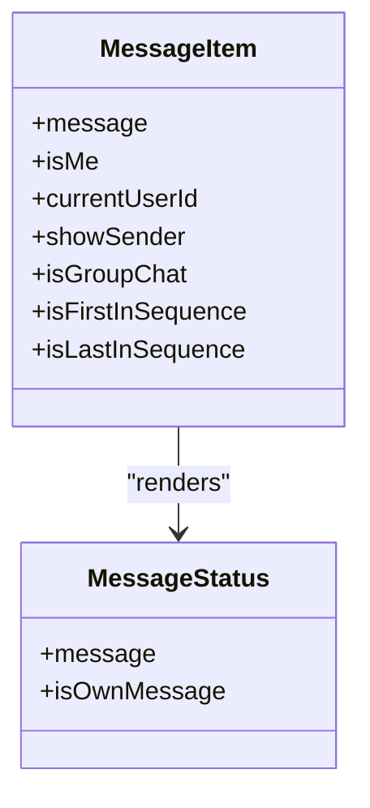
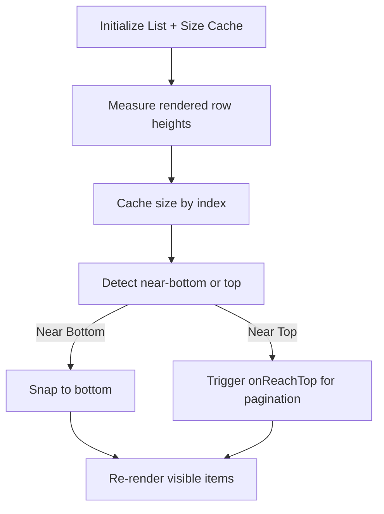
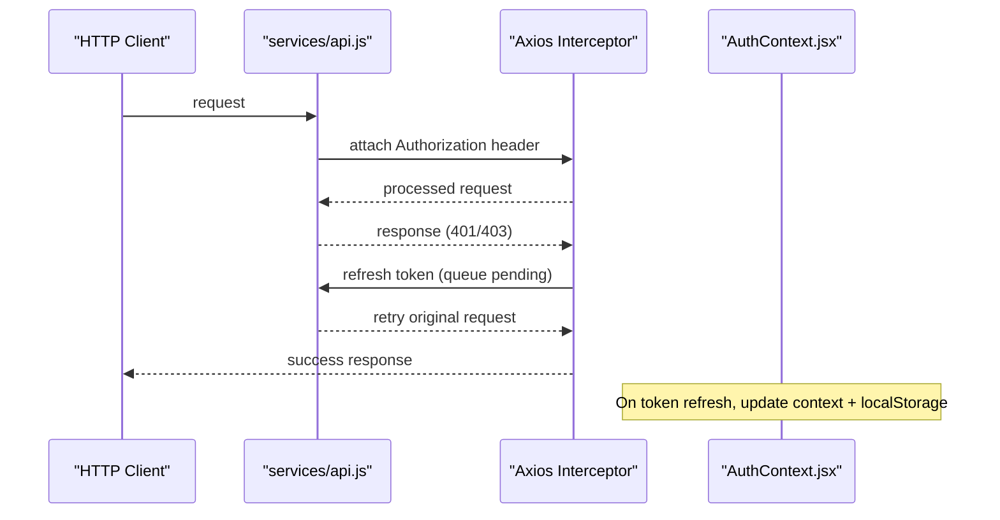
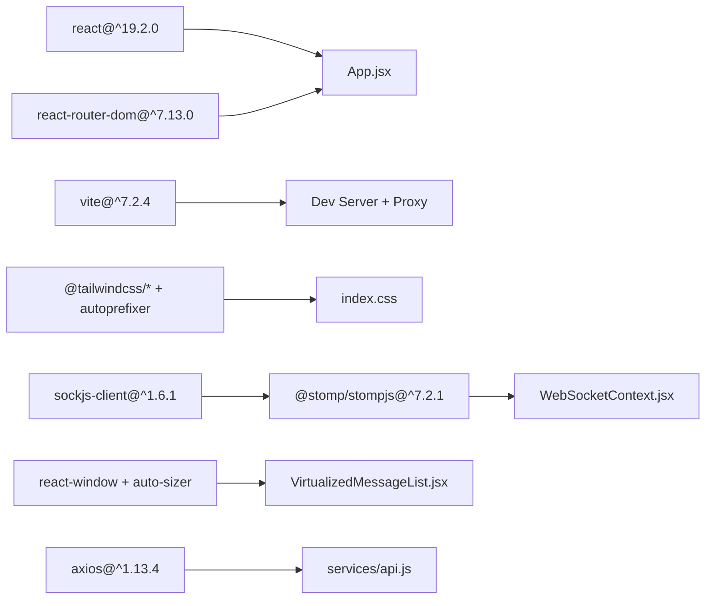

# Frontend Architecture

<cite>
**Referenced Files in This Document**
- [main.jsx](file://chatify-frontend/src/main.jsx)
- [App.jsx](file://chatify-frontend/src/App.jsx)
- [package.json](file://chatify-frontend/package.json)
- [vite.config.js](file://chatify-frontend/vite.config.js)
- [AuthContext.jsx](file://chatify-frontend/src/context/AuthContext.jsx)
- [WebSocketContext.jsx](file://chatify-frontend/src/context/WebSocketContext.jsx)
- [useAuth.js](file://chatify-frontend/src/hooks/useAuth.js)
- [useWebSocket.js](file://chatify-frontend/src/hooks/useWebSocket.js)
- [Chat.jsx](file://chatify-frontend/src/pages/Chat.jsx)
- [Sidebar.jsx](file://chatify-frontend/src/components/Sidebar/Sidebar.jsx)
- [ChatWindow.jsx](file://chatify-frontend/src/components/Chat/ChatWindow.jsx)
- [MessageItem.jsx](file://chatify-frontend/src/components/Chat/MessageItem.jsx)
- [VirtualizedMessageList.jsx](file://chatify-frontend/src/components/Chat/VirtualizedMessageList.jsx)
- [api.js](file://chatify-frontend/src/services/api.js)
- [constants.js](file://chatify-frontend/src/utils/constants.js)
- [postcss.config.js](file://chatify-frontend/postcss.config.js)
</cite>

## Table of Contents
1. [Introduction](#introduction)
2. [Project Structure](#project-structure)
3. [Core Components](#core-components)
4. [Architecture Overview](#architecture-overview)
5. [Detailed Component Analysis](#detailed-component-analysis)
6. [Dependency Analysis](#dependency-analysis)
7. [Performance Considerations](#performance-considerations)
8. [Troubleshooting Guide](#troubleshooting-guide)
9. [Conclusion](#conclusion)
10. [Appendices](#appendices)

## Introduction
This document describes the Chatify frontend architecture built with React 19 and modern frontend patterns. It explains the component hierarchy, state management via React Context providers, routing with React Router, real-time communication with WebSocket clients, and build system using Vite. It also covers UI composition, responsive design with Tailwind CSS, and performance optimizations including virtualized rendering. Cross-cutting concerns such as error handling, loading states, and presence/status display are documented alongside infrastructure requirements for development, build optimization, and deployment considerations.

## Project Structure
The frontend is organized around a clear separation of concerns:
- Entry point initializes providers and renders the app.
- Routing defines public and protected routes with nested private routes.
- Pages encapsulate top-level views (e.g., Chat).
- Components are grouped by feature: Chat, Common, Group, Sidebar.
- Hooks provide reusable context access.
- Services encapsulate API and WebSocket interactions.
- Utilities centralize constants and helpers.
- Build tooling uses Vite with PostCSS/Tailwind integration.

**Diagram sources**
- [main.jsx:1-16](file://chatify-frontend/src/main.jsx#L1-L16)
- [App.jsx:12-72](file://chatify-frontend/src/App.jsx#L12-L72)
- [AuthContext.jsx:9-53](file://chatify-frontend/src/context/AuthContext.jsx#L9-L53)
- [WebSocketContext.jsx:10-190](file://chatify-frontend/src/context/WebSocketContext.jsx#L10-L190)
- [Chat.jsx:34-555](file://chatify-frontend/src/pages/Chat.jsx#L34-L555)
- [Sidebar.jsx:10-131](file://chatify-frontend/src/components/Sidebar/Sidebar.jsx#L10-L131)
- [ChatWindow.jsx:18-295](file://chatify-frontend/src/components/Chat/ChatWindow.jsx#L18-L295)
- [MessageItem.jsx:34-182](file://chatify-frontend/src/components/Chat/MessageItem.jsx#L34-L182)
- [VirtualizedMessageList.jsx:13-132](file://chatify-frontend/src/components/Chat/VirtualizedMessageList.jsx#L13-L132)
- [api.js:1-121](file://chatify-frontend/src/services/api.js#L1-L121)
- [useAuth.js:4-8](file://chatify-frontend/src/hooks/useAuth.js#L4-L8)
- [useWebSocket.js:4-8](file://chatify-frontend/src/hooks/useWebSocket.js#L4-L8)
- [vite.config.js:1-21](file://chatify-frontend/vite.config.js#L1-L21)
- [postcss.config.js:1-7](file://chatify-frontend/postcss.config.js#L1-L7)
- [package.json:1-40](file://chatify-frontend/package.json#L1-L40)

**Section sources**
- [main.jsx:1-16](file://chatify-frontend/src/main.jsx#L1-L16)
- [App.jsx:12-72](file://chatify-frontend/src/App.jsx#L12-L72)
- [package.json:1-40](file://chatify-frontend/package.json#L1-L40)
- [vite.config.js:1-21](file://chatify-frontend/vite.config.js#L1-L21)
- [postcss.config.js:1-7](file://chatify-frontend/postcss.config.js#L1-L7)

## Core Components
- Authentication Context: Manages user session state, token persistence, and login/logout lifecycle.
- WebSocket Context: Provides real-time connectivity, subscriptions, message publishing, and automatic token refresh handling.
- Chat Page: Orchestrates chat room selection, message history loading, real-time updates, file uploads, and read/delivery receipts.
- Sidebar: Renders chat list, search, new chat/group actions, and user presence indicators.
- Message Components: Render individual messages with status indicators, file attachments, and group sender names.
- Virtualized Message List: Efficiently renders large message histories with variable row heights and infinite scroll triggers.
- Services and Hooks: Encapsulate API calls and expose typed context access for auth and WebSocket.

Key implementation references:
- [Auth provider and hooks:9-53](file://chatify-frontend/src/context/AuthContext.jsx#L9-L53), [useAuth hook:4-8](file://chatify-frontend/src/hooks/useAuth.js#L4-L8)
- [WebSocket provider and hooks:10-190](file://chatify-frontend/src/context/WebSocketContext.jsx#L10-L190), [useWebSocket hook:4-8](file://chatify-frontend/src/hooks/useWebSocket.js#L4-L8)
- [Chat page orchestration:34-555](file://chatify-frontend/src/pages/Chat.jsx#L34-L555)
- [Sidebar composition:10-131](file://chatify-frontend/src/components/Sidebar/Sidebar.jsx#L10-L131)
- [Message rendering:34-182](file://chatify-frontend/src/components/Chat/MessageItem.jsx#L34-L182)
- [Virtualized list:13-132](file://chatify-frontend/src/components/Chat/VirtualizedMessageList.jsx#L13-L132)
- [API client and interceptors:1-121](file://chatify-frontend/src/services/api.js#L1-L121)

**Section sources**
- [AuthContext.jsx:9-53](file://chatify-frontend/src/context/AuthContext.jsx#L9-L53)
- [WebSocketContext.jsx:10-190](file://chatify-frontend/src/context/WebSocketContext.jsx#L10-L190)
- [Chat.jsx:34-555](file://chatify-frontend/src/pages/Chat.jsx#L34-L555)
- [Sidebar.jsx:10-131](file://chatify-frontend/src/components/Sidebar/Sidebar.jsx#L10-L131)
- [MessageItem.jsx:34-182](file://chatify-frontend/src/components/Chat/MessageItem.jsx#L34-L182)
- [VirtualizedMessageList.jsx:13-132](file://chatify-frontend/src/components/Chat/VirtualizedMessageList.jsx#L13-L132)
- [api.js:1-121](file://chatify-frontend/src/services/api.js#L1-L121)
- [useAuth.js:4-8](file://chatify-frontend/src/hooks/useAuth.js#L4-L8)
- [useWebSocket.js:4-8](file://chatify-frontend/src/hooks/useWebSocket.js#L4-L8)

## Architecture Overview
The frontend follows a layered architecture:
- Entry layer initializes providers and mounts the app.
- Routing layer defines public and private routes with nested layouts.
- State layer uses React Context for authentication and WebSocket connectivity.
- Presentation layer composes chat windows, message lists, and UI elements.
- Integration layer handles HTTP requests and WebSocket subscriptions.

**Diagram sources**
- [main.jsx:8-16](file://chatify-frontend/src/main.jsx#L8-L16)
- [App.jsx:34-71](file://chatify-frontend/src/App.jsx#L34-L71)
- [AuthContext.jsx:9-53](file://chatify-frontend/src/context/AuthContext.jsx#L9-L53)
- [WebSocketContext.jsx:10-190](file://chatify-frontend/src/context/WebSocketContext.jsx#L10-L190)
- [Chat.jsx:34-555](file://chatify-frontend/src/pages/Chat.jsx#L34-L555)
- [Sidebar.jsx:10-131](file://chatify-frontend/src/components/Sidebar/Sidebar.jsx#L10-L131)
- [VirtualizedMessageList.jsx:13-132](file://chatify-frontend/src/components/Chat/VirtualizedMessageList.jsx#L13-L132)
- [MessageItem.jsx:34-182](file://chatify-frontend/src/components/Chat/MessageItem.jsx#L34-L182)
- [api.js:1-121](file://chatify-frontend/src/services/api.js#L1-L121)
- [useAuth.js:4-8](file://chatify-frontend/src/hooks/useAuth.js#L4-L8)
- [useWebSocket.js:4-8](file://chatify-frontend/src/hooks/useWebSocket.js#L4-L8)

## Detailed Component Analysis

### Authentication and Session Management
- Provider initializes user state from localStorage and exposes login/logout functions.
- Token and user data are persisted and refreshed automatically during API calls.
- The provider ensures safe initialization and guards against corrupted storage.

**Diagram sources**
- [AuthContext.jsx:9-53](file://chatify-frontend/src/context/AuthContext.jsx#L9-L53)
- [useAuth.js:4-8](file://chatify-frontend/src/hooks/useAuth.js#L4-L8)

**Section sources**
- [AuthContext.jsx:9-53](file://chatify-frontend/src/context/AuthContext.jsx#L9-L53)
- [useAuth.js:4-8](file://chatify-frontend/src/hooks/useAuth.js#L4-L8)

### Real-Time Communication with WebSocket
- WebSocket provider establishes a STOMP connection over SockJS.
- Automatic token refresh on JWT expiration with seamless reconnect.
- Subscription APIs for chat room, presence, delivery, and seen updates.
- Publishing APIs for sending messages and read receipts.

**Diagram sources**
- [Chat.jsx:221-287](file://chatify-frontend/src/pages/Chat.jsx#L221-L287)
- [WebSocketContext.jsx:124-175](file://chatify-frontend/src/context/WebSocketContext.jsx#L124-L175)
- [api.js:119-121](file://chatify-frontend/src/services/api.js#L119-L121)

**Section sources**
- [WebSocketContext.jsx:10-190](file://chatify-frontend/src/context/WebSocketContext.jsx#L10-L190)
- [Chat.jsx:221-287](file://chatify-frontend/src/pages/Chat.jsx#L221-L287)
- [api.js:1-121](file://chatify-frontend/src/services/api.js#L1-L121)

### Chat Page Orchestration
- Loads chat rooms and paginated message history on room change.
- Subscribes to real-time events and updates message status (delivered/seens).
- Handles file uploads via pre-signed URLs and S3-like endpoints.
- Manages focus/blur to send seen acknowledgments and marks messages as read.

**Diagram sources**
- [Chat.jsx:184-287](file://chatify-frontend/src/pages/Chat.jsx#L184-L287)
- [Chat.jsx:317-351](file://chatify-frontend/src/pages/Chat.jsx#L317-L351)
- [Chat.jsx:428-452](file://chatify-frontend/src/pages/Chat.jsx#L428-L452)

**Section sources**
- [Chat.jsx:34-555](file://chatify-frontend/src/pages/Chat.jsx#L34-L555)

### Sidebar and Group Management
- Sidebar displays chat list with search, online status, and action buttons.
- Supports creating new chats and groups, updating rooms, and navigation.
- Integrates with authentication and WebSocket contexts for presence and connectivity indicators.

**Diagram sources**
- [Sidebar.jsx:10-131](file://chatify-frontend/src/components/Sidebar/Sidebar.jsx#L10-L131)

**Section sources**
- [Sidebar.jsx:10-131](file://chatify-frontend/src/components/Sidebar/Sidebar.jsx#L10-L131)

### Message Rendering and Status Indicators
- MessageItem renders text, images, videos, and files with sender-specific styling.
- Status indicators reflect sent/delivered/seen states for outbound messages.
- Group chats display sender names and consistent bubble radii for message sequences.

**Diagram sources**
- [MessageItem.jsx:34-182](file://chatify-frontend/src/components/Chat/MessageItem.jsx#L34-L182)

**Section sources**
- [MessageItem.jsx:34-182](file://chatify-frontend/src/components/Chat/MessageItem.jsx#L34-L182)

### Virtualized Message List
- Uses react-window with AutoSizer for responsive sizing.
- Measures variable row heights with ResizeObserver and caches sizes.
- Maintains “scroll to bottom” behavior when near the end and triggers pagination when reaching the top.

**Diagram sources**
- [VirtualizedMessageList.jsx:13-132](file://chatify-frontend/src/components/Chat/VirtualizedMessageList.jsx#L13-L132)

**Section sources**
- [VirtualizedMessageList.jsx:13-132](file://chatify-frontend/src/components/Chat/VirtualizedMessageList.jsx#L13-L132)

### API Layer and Interceptors
- Axios client configured with base URL and Authorization header injection.
- Centralized token refresh logic in response interceptor with retry queue.
- Exposes CRUD operations for chatrooms, messages, and user management.

**Diagram sources**
- [api.js:11-97](file://chatify-frontend/src/services/api.js#L11-L97)
- [AuthContext.jsx:30-44](file://chatify-frontend/src/context/AuthContext.jsx#L30-L44)

**Section sources**
- [api.js:1-121](file://chatify-frontend/src/services/api.js#L1-L121)
- [AuthContext.jsx:30-44](file://chatify-frontend/src/context/AuthContext.jsx#L30-L44)

## Dependency Analysis
- React 19 powers the UI and concurrent features.
- React Router v7 manages routing and nested private routes.
- Vite provides fast dev server with proxying to backend and WebSocket endpoints.
- Tailwind CSS with PostCSS enables utility-first styling.
- SockJS and @stomp/stompjs implement WebSocket transport and STOMP protocol.
- react-window and react-virtualized-auto-sizer enable efficient virtualization.

**Diagram sources**
- [package.json:12-39](file://chatify-frontend/package.json#L12-L39)
- [vite.config.js:5-20](file://chatify-frontend/vite.config.js#L5-L20)
- [postcss.config.js:1-7](file://chatify-frontend/postcss.config.js#L1-L7)
- [WebSocketContext.jsx:2-3](file://chatify-frontend/src/context/WebSocketContext.jsx#L2-L3)
- [VirtualizedMessageList.jsx:2-3](file://chatify-frontend/src/components/Chat/VirtualizedMessageList.jsx#L2-L3)
- [api.js:1-1](file://chatify-frontend/src/services/api.js#L1-L1)

**Section sources**
- [package.json:12-39](file://chatify-frontend/package.json#L12-L39)
- [vite.config.js:5-20](file://chatify-frontend/vite.config.js#L5-L20)
- [postcss.config.js:1-7](file://chatify-frontend/postcss.config.js#L1-L7)

## Performance Considerations
- Virtualization: react-window with AutoSizer and cached row heights minimizes DOM nodes for large histories.
- Infinite scroll: Pagination triggers near the top to load older messages incrementally.
- Scroll anchoring: Smart snapping to bottom when near the end prevents unnecessary reflows.
- Memoization: useCallback and refs reduce re-renders in hot loops.
- Lazy imports: File upload flow dynamically imports module to defer bundle cost.
- Responsive design: Tailwind utilities adapt layout across screen sizes without heavy JS.

[No sources needed since this section provides general guidance]

## Troubleshooting Guide
- Authentication errors:
  - Verify token presence in localStorage and Authorization header injection.
  - Confirm refresh endpoint availability and retry queue behavior.
  - Reference: [api.js:11-97](file://chatify-frontend/src/services/api.js#L11-L97), [AuthContext.jsx:30-44](file://chatify-frontend/src/context/AuthContext.jsx#L30-L44)
- WebSocket disconnections:
  - Check heartbeat intervals and reconnect delay.
  - Validate JWT expiration handling and automatic header updates.
  - Reference: [WebSocketContext.jsx:47-122](file://chatify-frontend/src/context/WebSocketContext.jsx#L47-L122)
- Message status not updating:
  - Ensure subscriptions to delivery and seen topics are active.
  - Verify focus/blur handlers for seen ACKs and delivery ACKs.
  - Reference: [Chat.jsx:230-260](file://chatify-frontend/src/pages/Chat.jsx#L230-L260)
- File uploads failing:
  - Confirm pre-signed URL generation and upload completion before sending metadata.
  - Reference: [Chat.jsx:324-335](file://chatify-frontend/src/pages/Chat.jsx#L324-L335)
- Build and proxy issues:
  - Validate Vite proxy configuration for /api and /ws.
  - Reference: [vite.config.js:7-18](file://chatify-frontend/vite.config.js#L7-L18)

**Section sources**
- [api.js:11-97](file://chatify-frontend/src/services/api.js#L11-L97)
- [AuthContext.jsx:30-44](file://chatify-frontend/src/context/AuthContext.jsx#L30-L44)
- [WebSocketContext.jsx:47-122](file://chatify-frontend/src/context/WebSocketContext.jsx#L47-L122)
- [Chat.jsx:230-260](file://chatify-frontend/src/pages/Chat.jsx#L230-L260)
- [Chat.jsx:324-335](file://chatify-frontend/src/pages/Chat.jsx#L324-L335)
- [vite.config.js:7-18](file://chatify-frontend/vite.config.js#L7-L18)

## Conclusion
Chatify’s frontend leverages React 19, modern routing, and robust context providers to deliver a responsive, real-time chat experience. The architecture cleanly separates concerns, optimizes rendering with virtualization, and integrates seamlessly with backend services through Axios interceptors and STOMP/WebSocket subscriptions. Development and deployment are streamlined via Vite and Tailwind, while thoughtful error handling and loading states improve user experience.

[No sources needed since this section summarizes without analyzing specific files]

## Appendices

### Technology Stack
- Core: React 19, React Router 7, Vite 7
- Styling: Tailwind CSS 4, PostCSS, Autoprefixer
- Networking: Axios, SockJS, @stomp/stompjs
- Rendering: react-window, react-virtualized-auto-sizer
- Icons: lucide-react
- Notifications: react-hot-toast

**Section sources**
- [package.json:12-39](file://chatify-frontend/package.json#L12-L39)
- [postcss.config.js:1-7](file://chatify-frontend/postcss.config.js#L1-L7)

### Build System and Environment
- Dev server runs on port 5173 with proxy for /api and /ws to backend.
- Environment variables for API and WebSocket URLs.
- Tailwind integrated via PostCSS plugin.

**Section sources**
- [vite.config.js:7-18](file://chatify-frontend/vite.config.js#L7-L18)
- [constants.js:1-3](file://chatify-frontend/src/utils/constants.js#L1-L3)
- [postcss.config.js:1-7](file://chatify-frontend/postcss.config.js#L1-L7)

### Routing Configuration
- Public routes: login, register, OAuth callback.
- Protected routes: nested under /chat with PrivateRoute wrapper.
- Index route navigates to /chat by default.

**Section sources**
- [App.jsx:41-67](file://chatify-frontend/src/App.jsx#L41-L67)

### Infrastructure Requirements
- Backend endpoints for chatrooms, messages, auth, and file uploads.
- WebSocket endpoint for real-time events and STOMP subscriptions.
- Optional S3-compatible storage for file uploads.

**Section sources**
- [api.js:104-121](file://chatify-frontend/src/services/api.js#L104-L121)
- [constants.js:1-3](file://chatify-frontend/src/utils/constants.js#L1-L3)