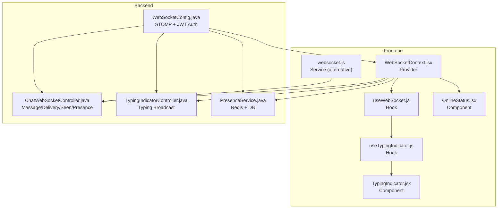
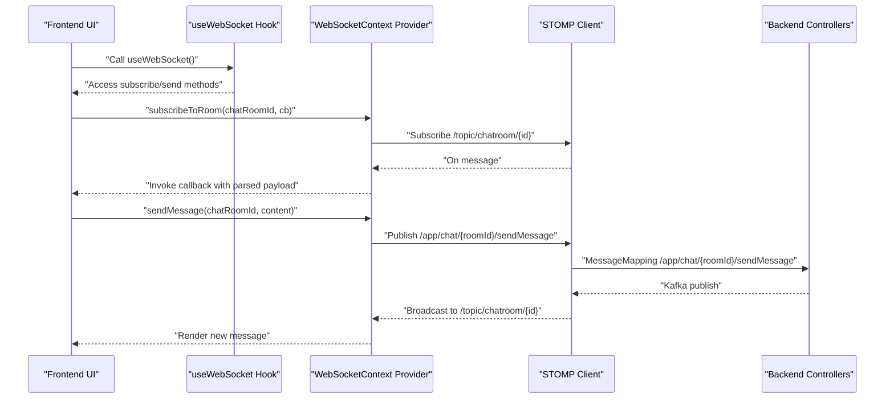
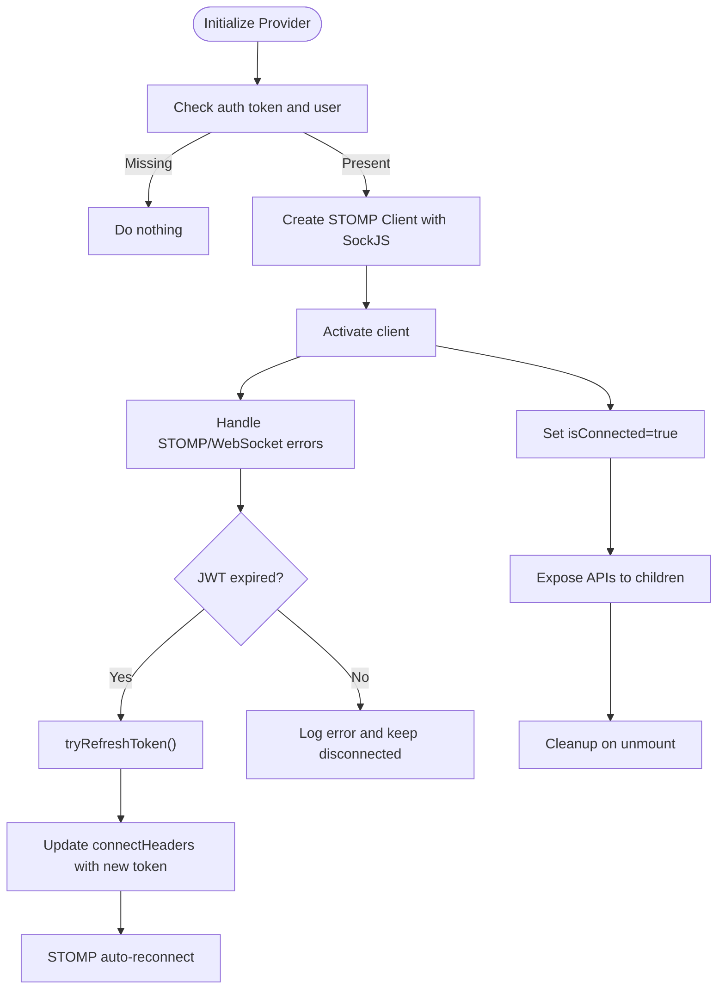
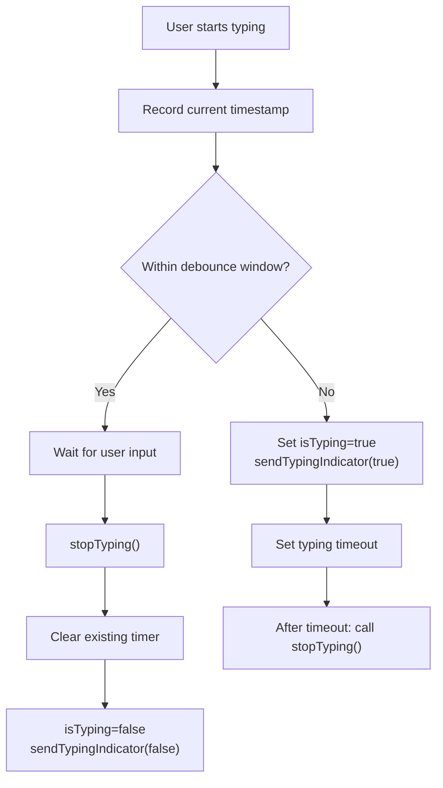
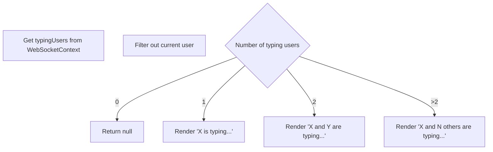
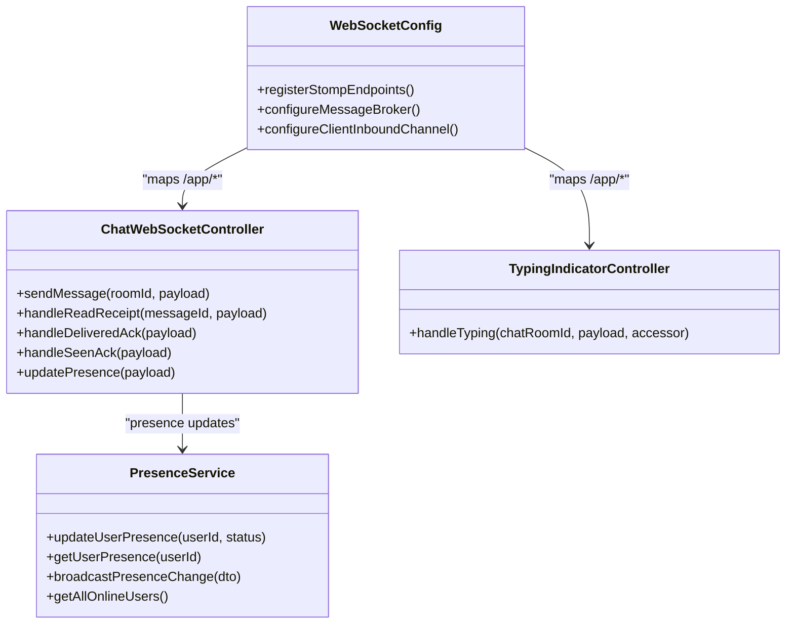
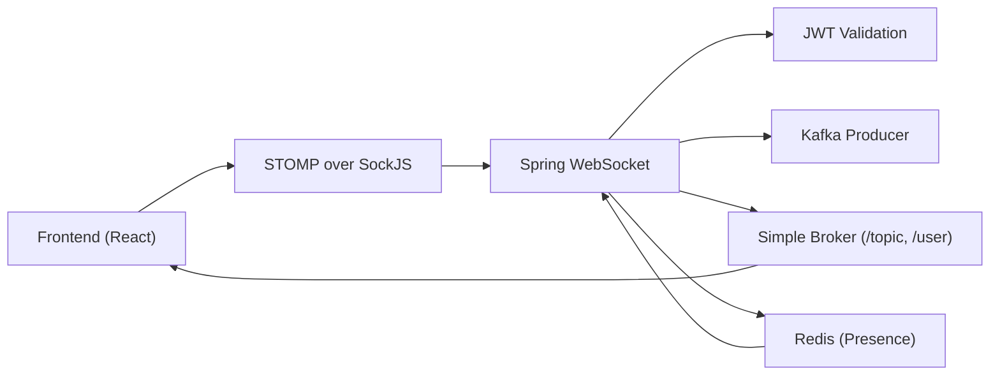

# Real-time Features Implementation

<cite>
**Referenced Files in This Document**
- [useWebSocket.js](file://chatify-frontend/src/hooks/useWebSocket.js)
- [useTypingIndicator.js](file://chatify-frontend/src/hooks/useTypingIndicator.js)
- [TypingIndicator.jsx](file://chatify-frontend/src/components/Chat/TypingIndicator.jsx)
- [OnlineStatus.jsx](file://chatify-frontend/src/components/Common/OnlineStatus.jsx)
- [WebSocketContext.jsx](file://chatify-frontend/src/context/WebSocketContext.jsx)
- [websocket.js](file://chatify-frontend/src/services/websocket.js)
- [constants.js](file://chatify-frontend/src/utils/constants.js)
- [WebSocketConfig.java](file://src/main/java/com/chatify/chat_backend/config/WebSocketConfig.java)
- [ChatWebSocketController.java](file://src/main/java/com/chatify/chat_backend/controller/ChatWebSocketController.java)
- [TypingIndicatorController.java](file://src/main/java/com/chatify/chat_backend/controller/TypingIndicatorController.java)
- [PresenceService.java](file://src/main/java/com/chatify/chat_backend/service/PresenceService.java)
- [ChatMessageEvent.java](file://src/main/java/com/chatify/chat_backend/dto/ChatMessageEvent.java)
- [TypingIndicatorDTO.java](file://src/main/java/com/chatify/chat_backend/dto/TypingIndicatorDTO.java)
- [OnlineStatusDTO.java](file://src/main/java/com/chatify/chat_backend/dto/OnlineStatusDTO.java)
- [UserStatus.java](file://src/main/java/com/chatify/chat_backend/entity/enums/UserStatus.java)
- [MessageType.java](file://src/main/java/com/chatify/chat_backend/entity/enums/MessageType.java)
</cite>

## Table of Contents
1. [Introduction](#introduction)
2. [Project Structure](#project-structure)
3. [Core Components](#core-components)
4. [Architecture Overview](#architecture-overview)
5. [Detailed Component Analysis](#detailed-component-analysis)
6. [Dependency Analysis](#dependency-analysis)
7. [Performance Considerations](#performance-considerations)
8. [Troubleshooting Guide](#troubleshooting-guide)
9. [Conclusion](#conclusion)
10. [Appendices](#appendices)

## Introduction
This document explains the real-time features implementation in Chatify, focusing on WebSocket integration and live communication patterns. It covers the frontend hooks and components for WebSocket connection management, typing indicators, and online presence, alongside the backend configuration and controllers that power these features. It also documents message synchronization, optimistic UI updates, WebSocket message formats, and strategies for error handling, reconnection, and graceful degradation.

## Project Structure
The real-time features span both frontend and backend:
- Frontend: React hooks and components manage WebSocket connections, typing indicators, and presence UI.
- Backend: Spring WebSocket configuration, controllers, and services handle authentication, message routing, typing broadcasts, and presence updates.

**Diagram sources**
- [WebSocketContext.jsx:10-190](file://chatify-frontend/src/context/WebSocketContext.jsx#L10-L190)
- [useWebSocket.js:1-8](file://chatify-frontend/src/hooks/useWebSocket.js#L1-L8)
- [useTypingIndicator.js:1-71](file://chatify-frontend/src/hooks/useTypingIndicator.js#L1-L71)
- [TypingIndicator.jsx:1-44](file://chatify-frontend/src/components/Chat/TypingIndicator.jsx#L1-L44)
- [OnlineStatus.jsx:1-25](file://chatify-frontend/src/components/Common/OnlineStatus.jsx#L1-L25)
- [websocket.js:1-327](file://chatify-frontend/src/services/websocket.js#L1-L327)
- [WebSocketConfig.java:30-111](file://src/main/java/com/chatify/chat_backend/config/WebSocketConfig.java#L30-L111)
- [ChatWebSocketController.java:24-181](file://src/main/java/com/chatify/chat_backend/controller/ChatWebSocketController.java#L24-L181)
- [TypingIndicatorController.java:14-56](file://src/main/java/com/chatify/chat_backend/controller/TypingIndicatorController.java#L14-L56)
- [PresenceService.java:19-132](file://src/main/java/com/chatify/chat_backend/service/PresenceService.java#L19-L132)

**Section sources**
- [WebSocketContext.jsx:10-190](file://chatify-frontend/src/context/WebSocketContext.jsx#L10-L190)
- [WebSocketConfig.java:30-111](file://src/main/java/com/chatify/chat_backend/config/WebSocketConfig.java#L30-L111)

## Core Components
- WebSocketContext provider establishes and manages the STOMP/WebSocket connection, exposes subscription and publish methods, and handles reconnection and token refresh.
- useWebSocket hook provides a convenient way to consume the WebSocket context.
- useTypingIndicator hook manages typing state, debounces user input, and broadcasts typing events with timeouts.
- TypingIndicator component renders animated typing notifications for other users in the chat room.
- OnlineStatus component displays user presence status with optional labels and sizing.
- websocket.js service offers an alternative class-based WebSocket service with manual reconnection and queueing.

**Section sources**
- [WebSocketContext.jsx:10-190](file://chatify-frontend/src/context/WebSocketContext.jsx#L10-L190)
- [useWebSocket.js:1-8](file://chatify-frontend/src/hooks/useWebSocket.js#L1-L8)
- [useTypingIndicator.js:1-71](file://chatify-frontend/src/hooks/useTypingIndicator.js#L1-L71)
- [TypingIndicator.jsx:1-44](file://chatify-frontend/src/components/Chat/TypingIndicator.jsx#L1-L44)
- [OnlineStatus.jsx:1-25](file://chatify-frontend/src/components/Common/OnlineStatus.jsx#L1-L25)
- [websocket.js:1-327](file://chatify-frontend/src/services/websocket.js#L1-L327)

## Architecture Overview
The frontend connects via SockJS over STOMP to the backend endpoint configured with JWT authentication. Controllers route app-level destinations to services and Kafka for persistence and asynchronous processing. Topics broadcast messages, typing indicators, delivery/seen receipts, and presence updates to subscribed clients.

**Diagram sources**
- [WebSocketContext.jsx:124-158](file://chatify-frontend/src/context/WebSocketContext.jsx#L124-L158)
- [ChatWebSocketController.java:81-110](file://src/main/java/com/chatify/chat_backend/controller/ChatWebSocketController.java#L81-L110)

## Detailed Component Analysis

### WebSocketContext Provider and useWebSocket Hook
- Establishes the STOMP client with SockJS, sets heartbeat intervals, and maintains connection state.
- Provides methods to subscribe to chat rooms, presence, delivery, and seen topics, plus to publish messages and acknowledgements.
- Handles token refresh on STOMP errors and WebSocket close events with JWT expiration detection.
- Exposes isConnected flag and subscription/publish helpers to consumers.

**Diagram sources**
- [WebSocketContext.jsx:47-122](file://chatify-frontend/src/context/WebSocketContext.jsx#L47-L122)

**Section sources**
- [WebSocketContext.jsx:10-190](file://chatify-frontend/src/context/WebSocketContext.jsx#L10-L190)
- [useWebSocket.js:1-8](file://chatify-frontend/src/hooks/useWebSocket.js#L1-L8)

### useTypingIndicator Hook
- Manages local typing state and debounces sending typing indicators to reduce network chatter.
- Starts a timeout to automatically stop typing after a fixed interval.
- Uses WebSocketContext to send typing events and fetch typing users per chat room.
- Cleans up timers and sends a stop-typing event on unmount.

**Diagram sources**
- [useTypingIndicator.js:27-48](file://chatify-frontend/src/hooks/useTypingIndicator.js#L27-L48)

**Section sources**
- [useTypingIndicator.js:1-71](file://chatify-frontend/src/hooks/useTypingIndicator.js#L1-L71)

### TypingIndicator Component
- Renders animated bouncing dots and a human-readable typing message for other users typing in the same chat room.
- Filters out the current user from the typing list to avoid self-notification.
- Returns null when no other users are typing.

**Diagram sources**
- [TypingIndicator.jsx:8-27](file://chatify-frontend/src/components/Chat/TypingIndicator.jsx#L8-L27)

**Section sources**
- [TypingIndicator.jsx:1-44](file://chatify-frontend/src/components/Chat/TypingIndicator.jsx#L1-L44)

### OnlineStatus Component
- Displays a small circle indicating online/offline status with optional label and configurable size.
- Useful for presence UI in chat lists and profiles.

**Section sources**
- [OnlineStatus.jsx:1-25](file://chatify-frontend/src/components/Common/OnlineStatus.jsx#L1-L25)

### Alternative WebSocket Service (websocket.js)
- Provides a class-based service with manual reconnection attempts, exponential backoff, and message queueing.
- Offers subscribe/unsubscribe, send, and connection state monitoring.
- Useful when a standalone service is preferred over a React context.

**Section sources**
- [websocket.js:1-327](file://chatify-frontend/src/services/websocket.js#L1-L327)

### Backend WebSocket Configuration and Controllers
- Frontend destinations are mapped to backend handlers via Spring WebSocket.
- JWT is validated during the STOMP CONNECT frame; authenticated users are attached to the session.
- ChatWebSocketController handles message sending, read/delivery/seen acknowledgements, and presence updates.
- TypingIndicatorController broadcasts typing events to the room-specific typing topic.
- PresenceService stores online users in Redis with TTL and falls back to DB for offline queries.

**Diagram sources**
- [WebSocketConfig.java:30-111](file://src/main/java/com/chatify/chat_backend/config/WebSocketConfig.java#L30-L111)
- [ChatWebSocketController.java:24-181](file://src/main/java/com/chatify/chat_backend/controller/ChatWebSocketController.java#L24-L181)
- [TypingIndicatorController.java:14-56](file://src/main/java/com/chatify/chat_backend/controller/TypingIndicatorController.java#L14-L56)
- [PresenceService.java:19-132](file://src/main/java/com/chatify/chat_backend/service/PresenceService.java#L19-L132)

**Section sources**
- [WebSocketConfig.java:30-111](file://src/main/java/com/chatify/chat_backend/config/WebSocketConfig.java#L30-L111)
- [ChatWebSocketController.java:24-181](file://src/main/java/com/chatify/chat_backend/controller/ChatWebSocketController.java#L24-L181)
- [TypingIndicatorController.java:14-56](file://src/main/java/com/chatify/chat_backend/controller/TypingIndicatorController.java#L14-L56)
- [PresenceService.java:19-132](file://src/main/java/com/chatify/chat_backend/service/PresenceService.java#L19-L132)

### Message Formats and Event Types
- Chat message event payload includes chat room ID, sender ID, content, message type, and optional file metadata.
- Typing indicator payload carries user identity, typing state, and chat room ID.
- Online status payload includes user ID, username, status, and last seen timestamp.

**Section sources**
- [ChatMessageEvent.java:13-25](file://src/main/java/com/chatify/chat_backend/dto/ChatMessageEvent.java#L13-L25)
- [TypingIndicatorDTO.java:10-15](file://src/main/java/com/chatify/chat_backend/dto/TypingIndicatorDTO.java#L10-L15)
- [OnlineStatusDTO.java:13-19](file://src/main/java/com/chatify/chat_backend/dto/OnlineStatusDTO.java#L13-L19)
- [UserStatus.java:3-7](file://src/main/java/com/chatify/chat_backend/entity/enums/UserStatus.java#L3-L7)
- [MessageType.java:3-7](file://src/main/java/com/chatify/chat_backend/entity/enums/MessageType.java#L3-L7)

## Dependency Analysis
- Frontend depends on SockJS and STOMP for transport and protocol framing.
- Backend depends on Spring WebSocket for STOMP endpoints and message broker.
- JWT authentication is enforced on the inbound channel.
- Presence data is stored in Redis with TTL and backed by DB for offline fallback.
- Message publishing uses Kafka to decouple persistence from real-time delivery.

**Diagram sources**
- [WebSocketConfig.java:44-57](file://src/main/java/com/chatify/chat_backend/config/WebSocketConfig.java#L44-L57)
- [ChatWebSocketController.java:74-110](file://src/main/java/com/chatify/chat_backend/controller/ChatWebSocketController.java#L74-L110)
- [PresenceService.java:67-78](file://src/main/java/com/chatify/chat_backend/service/PresenceService.java#L67-L78)

**Section sources**
- [WebSocketConfig.java:30-111](file://src/main/java/com/chatify/chat_backend/config/WebSocketConfig.java#L30-L111)
- [PresenceService.java:19-132](file://src/main/java/com/chatify/chat_backend/service/PresenceService.java#L19-L132)

## Performance Considerations
- Heartbeats: Both frontend and backend configure heartbeat intervals to detect dead connections promptly.
- Debouncing: Typing indicator debounce reduces redundant broadcasts.
- Message queueing: Queued messages are flushed upon reconnection to minimize data loss.
- Presence caching: Redis TTL ensures timely cleanup and fast lookups.
- Memory management: Subscriptions are unsubscribed during cleanup; timers are cleared to prevent leaks.

[No sources needed since this section provides general guidance]

## Troubleshooting Guide
Common issues and remedies:
- JWT expired: The frontend detects “expired” or “JWT” in STOMP error or WebSocket close reason and refreshes the token before reconnecting.
- Connection drops: Automatic reconnect with a fixed delay; the provider updates headers with the refreshed token.
- No typing indicators: Verify client sends to the correct destination and server broadcasts to the room typing topic.
- Presence not updating: Ensure presence updates are sent to the correct endpoint and Redis connectivity is healthy.

**Section sources**
- [WebSocketContext.jsx:74-108](file://chatify-frontend/src/context/WebSocketContext.jsx#L74-L108)
- [TypingIndicatorController.java:30-55](file://src/main/java/com/chatify/chat_backend/controller/TypingIndicatorController.java#L30-L55)
- [PresenceService.java:101-115](file://src/main/java/com/chatify/chat_backend/service/PresenceService.java#L101-L115)

## Conclusion
Chatify’s real-time features combine a robust frontend WebSocket provider with Spring WebSocket on the backend. The system supports live messaging, typing indicators, read/delivery/seen receipts, and presence updates with resilient reconnection, token refresh, and graceful degradation. Consistent message formats and topic naming enable reliable synchronization and optimistic UI updates.

[No sources needed since this section summarizes without analyzing specific files]

## Appendices

### WebSocket Message Destinations and Payloads
- Chat room messages:
  - Client publishes to: `/app/chat/{roomId}/sendMessage`
  - Server broadcasts to: `/topic/chatroom/{roomId}`
  - Payload: see [ChatMessageEvent.java:13-25](file://src/main/java/com/chatify/chat_backend/dto/ChatMessageEvent.java#L13-L25)
- Typing indicators:
  - Client publishes to: `/app/chat/typing/{chatRoomId}`
  - Server broadcasts to: `/topic/chatroom/{chatRoomId}/typing`
  - Payload: see [TypingIndicatorDTO.java:10-15](file://src/main/java/com/chatify/chat_backend/dto/TypingIndicatorDTO.java#L10-L15)
- Presence:
  - Client publishes to: `/app/presence.update`
  - Server broadcasts to: `/topic/presence`
  - Payload: see [OnlineStatusDTO.java:13-19](file://src/main/java/com/chatify/chat_backend/dto/OnlineStatusDTO.java#L13-L19)
- Delivery/Seen/Acks:
  - Client publishes to: `/app/chat.delivered`, `/app/chat.seen`
  - Server broadcasts to: `/topic/chatroom/{roomId}/delivery`, `/topic/chatroom/{roomId}/seen`
  - Payloads: see [ChatWebSocketController.java:144-180](file://src/main/java/com/chatify/chat_backend/controller/ChatWebSocketController.java#L144-L180)

**Section sources**
- [ChatWebSocketController.java:81-180](file://src/main/java/com/chatify/chat_backend/controller/ChatWebSocketController.java#L81-L180)
- [TypingIndicatorController.java:30-55](file://src/main/java/com/chatify/chat_backend/controller/TypingIndicatorController.java#L30-L55)
- [ChatMessageEvent.java:13-25](file://src/main/java/com/chatify/chat_backend/dto/ChatMessageEvent.java#L13-L25)
- [TypingIndicatorDTO.java:10-15](file://src/main/java/com/chatify/chat_backend/dto/TypingIndicatorDTO.java#L10-L15)
- [OnlineStatusDTO.java:13-19](file://src/main/java/com/chatify/chat_backend/dto/OnlineStatusDTO.java#L13-L19)