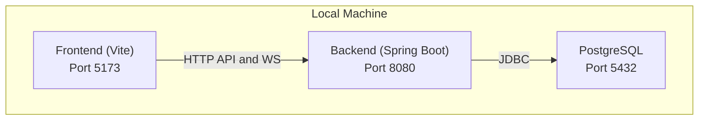

# Getting Started

<cite>
**Referenced Files in This Document**
- [README.md](file://README.md)
- [HELP.md](file://HELP.md)
- [pom.xml](file://pom.xml)
- [src/main/resources/application.properties](file://src/main/resources/application.properties)
- [chatify-frontend/package.json](file://chatify-frontend/package.json)
- [chatify-frontend/vite.config.js](file://chatify-frontend/vite.config.js)
- [chatify-frontend/.env](file://chatify-frontend/.env)
- [docker-compose.yml](file://docker-compose.yml)
- [dockerfile](file://dockerfile)
- [chatify-frontend/Dockerfile](file://chatify-frontend/Dockerfile)
- [chatify-frontend/nginx.conf](file://chatify-frontend/nginx.conf)
- [src/main/java/com/chatify/chat_backend/ChatBackendApplication.java](file://src/main/java/com/chatify/chat_backend/ChatBackendApplication.java)
</cite>

## Table of Contents
1. [Introduction](#introduction)
2. [Prerequisites](#prerequisites)
3. [Quick Setup Checklist](#quick-setup-checklist)
4. [Step-by-Step Setup](#step-by-step-setup)
5. [Environment Variables](#environment-variables)
6. [Running Locally](#running-locally)
7. [Accessing the Application](#accessing-the-application)
8. [Verification](#verification)
9. [Troubleshooting](#troubleshooting)
10. [Appendix: Project Structure Overview](#appendix-project-structure-overview)

## Introduction
This guide helps you quickly set up and run the Chatify application locally. Chatify is a real-time chat application with a Spring Boot backend and a React frontend. You will configure PostgreSQL, build and run the backend with Maven, install frontend dependencies with npm, and start the development server. We also cover environment variables, common pitfalls, and how to verify your installation.

## Prerequisites
Ensure the following tools and services are installed and available on your machine:
- Java 17 or higher
- Node.js 18 or higher
- PostgreSQL 14 or higher
- Maven 3.6 or higher

These requirements are enforced by the backend project configuration and the frontend toolchain.

**Section sources**
- [README.md:35-42](file://README.md#L35-L42)
- [pom.xml:22-25](file://pom.xml#L22-L25)

## Quick Setup Checklist
- PostgreSQL is installed and running
- Database and user created with appropriate privileges
- Backend application.properties configured or copied from example
- Frontend .env configured with API and WebSocket URLs
- Dependencies installed for backend (Maven) and frontend (npm)
- Ports 8080 (backend), 5432 (PostgreSQL), and 5173 (frontend) are available

**Section sources**
- [README.md:44-111](file://README.md#L44-L111)
- [pom.xml:22-25](file://pom.xml#L22-L25)

## Step-by-Step Setup

### 1) Database Setup
- Create the database and user with the provided SQL commands
- Connect to the database and grant schema permissions

Notes:
- The README includes SQL commands to create the database and user, and to grant schema permissions.
- Ensure PostgreSQL is running before proceeding.

**Section sources**
- [README.md:46-59](file://README.md#L46-L59)

### 2) Backend Setup
- Copy the application properties template to the active configuration file if needed
- Update database credentials in the configuration file if different from defaults
- Build and run the backend using Maven

Key commands and locations:
- Copy configuration file if needed
- Build and run commands
- Backend runs on port 8080 by default

**Section sources**
- [README.md:61-86](file://README.md#L61-L86)
- [src/main/resources/application.properties:1-75](file://src/main/resources/application.properties#L1-L75)
- [pom.xml:157-174](file://pom.xml#L157-L174)

### 3) Frontend Setup
- Navigate to the frontend directory
- Create the environment file from the template if needed
- Install dependencies with npm
- Start the development server

Key commands and locations:
- Navigate to frontend directory
- Install dependencies
- Start development server on port 5173
- Vite proxy configuration for API and WebSocket

**Section sources**
- [README.md:88-111](file://README.md#L88-L111)
- [chatify-frontend/package.json:1-40](file://chatify-frontend/package.json#L1-L40)
- [chatify-frontend/vite.config.js:1-21](file://chatify-frontend/vite.config.js#L1-L21)
- [chatify-frontend/.env:1-3](file://chatify-frontend/.env#L1-L3)

## Environment Variables

### Backend Environment Variables
The backend reads configuration from application.properties with support for environment variable overrides. Key properties include:
- Database connection URL, username, and password
- JWT secret and expiration
- Redis host, port, and password
- CORS allowed origins
- Server port
- Google OAuth2 registration
- AWS S3 configuration
- Kafka bootstrap servers and consumer/producer settings

Important defaults and overrides are defined in the configuration file.

**Section sources**
- [src/main/resources/application.properties:1-75](file://src/main/resources/application.properties#L1-L75)
- [README.md:112-133](file://README.md#L112-L133)

### Frontend Environment Variables
The frontend uses Vite and reads environment variables prefixed with VITE_. The primary variables are:
- VITE_API_URL: Backend API base URL
- VITE_WS_URL: WebSocket endpoint path

Vite proxy settings forward /api and /ws to the backend running on port 8080.

**Section sources**
- [chatify-frontend/.env:1-3](file://chatify-frontend/.env#L1-L3)
- [chatify-frontend/vite.config.js:7-19](file://chatify-frontend/vite.config.js#L7-L19)
- [README.md:127-133](file://README.md#L127-L133)

## Running Locally
Follow these steps to run the application locally:

1. Start PostgreSQL
2. Start the backend using Maven
3. Start the frontend using npm
4. Open the frontend URL in your browser

Ports:
- Backend: http://localhost:8080
- Frontend: http://localhost:5173

**Section sources**
- [README.md:134-139](file://README.md#L134-L139)
- [src/main/java/com/chatify/chat_backend/ChatBackendApplication.java:1-14](file://src/main/java/com/chatify/chat_backend/ChatBackendApplication.java#L1-L14)

## Accessing the Application
- Open http://localhost:5173 in your browser
- The frontend proxies API calls to http://localhost:8080 and WebSocket connections to /ws
- OAuth2 flows are handled by the backend; the frontend routes the browser to the appropriate endpoints

**Section sources**
- [README.md:134-139](file://README.md#L134-L139)
- [chatify-frontend/vite.config.js:7-19](file://chatify-frontend/vite.config.js#L7-L19)
- [chatify-frontend/nginx.conf:12-54](file://chatify-frontend/nginx.conf#L12-L54)

## Verification
After starting both backend and frontend:
- Confirm the backend is reachable at http://localhost:8080
- Confirm the frontend is reachable at http://localhost:5173
- Log in or register to verify authentication and real-time features (typing indicators, read receipts, WebSocket messaging)
- Check browser network tab for successful API and WebSocket connections

**Section sources**
- [README.md:134-139](file://README.md#L134-L139)

## Troubleshooting

### Database Connectivity
- Ensure PostgreSQL is running
- Verify database credentials in the backend configuration
- Confirm the database and user exist with proper permissions

**Section sources**
- [README.md:196-201](file://README.md#L196-L201)
- [src/main/resources/application.properties:1-75](file://src/main/resources/application.properties#L1-L75)

### Port Conflicts
- Backend runs on port 8080; ensure it is not occupied
- Frontend runs on port 5173; ensure it is not occupied
- Adjust ports in configuration if needed

**Section sources**
- [README.md:86](file://README.md#L86)
- [README.md:110](file://README.md#L110)
- [chatify-frontend/vite.config.js:7-8](file://chatify-frontend/vite.config.js#L7-L8)

### Dependency Problems
- Confirm Java 17 and Maven versions
- Confirm Node.js 18 and npm versions
- Clear caches if builds fail

**Section sources**
- [README.md:202-208](file://README.md#L202-L208)
- [pom.xml:22-25](file://pom.xml#L22-L25)
- [chatify-frontend/package.json:1-40](file://chatify-frontend/package.json#L1-L40)

### WebSocket Connection Issues
- Ensure the backend is running on port 8080
- Verify CORS origins are correctly configured
- Confirm JWT token validity
- Check browser console for connection errors

**Section sources**
- [README.md:189-195](file://README.md#L189-L195)
- [src/main/resources/application.properties:26-27](file://src/main/resources/application.properties#L26-L27)

## Appendix: Project Structure Overview
High-level structure for local setup:
- Backend: Spring Boot application under src/main/java and configuration under src/main/resources
- Frontend: React application under chatify-frontend with Vite configuration and environment files
- Docker compose and Dockerfiles are available for containerized deployment

[No sources needed since this diagram shows conceptual workflow, not actual code structure]