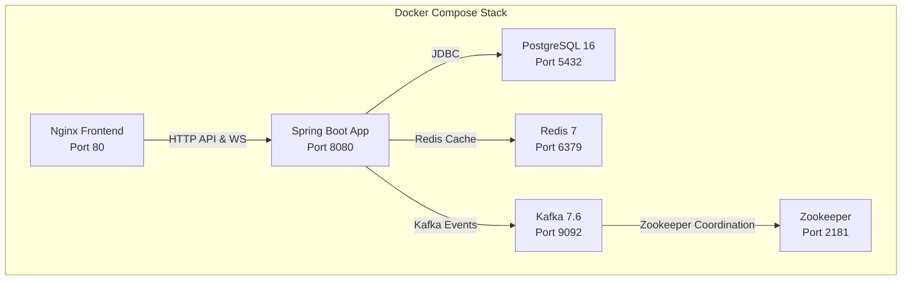
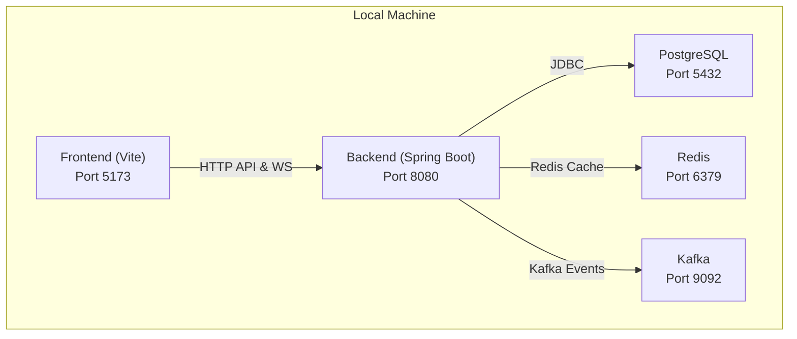

# Getting Started

<cite>
**Referenced Files in This Document**
- [README.md](file://README.md)
- [HELP.md](file://HELP.md)
- [pom.xml](file://pom.xml)
- [src/main/resources/application.properties](file://src/main/resources/application.properties)
- [chatify-frontend/package.json](file://chatify-frontend/package.json)
- [chatify-frontend/vite.config.js](file://chatify-frontend/vite.config.js)
- [chatify-frontend/.env](file://chatify-frontend/.env)
- [docker-compose.yml](file://docker-compose.yml)
- [dockerfile](file://dockerfile)
- [chatify-frontend/Dockerfile](file://chatify-frontend/Dockerfile)
- [chatify-frontend/nginx.conf](file://chatify-frontend/nginx.conf)
- [src/main/java/com/chatify/chat_backend/ChatBackendApplication.java](file://src/main/java/com/chatify/chat_backend/ChatBackendApplication.java)
</cite>

## Update Summary
**Changes Made**
- Enhanced Docker-based deployment setup with comprehensive container orchestration
- Added local development mode with separate backend and frontend setup instructions
- Expanded environment configuration documentation with detailed variable explanations
- Updated prerequisite requirements to reflect Docker approach as recommended option
- Added comprehensive troubleshooting section for containerized deployments

## Table of Contents
1. [Introduction](#introduction)
2. [Prerequisites](#prerequisites)
3. [Quick Setup Checklist](#quick-setup-checklist)
4. [Step-by-Step Setup](#step-by-step-setup)
5. [Environment Variables](#environment-variables)
6. [Running Locally](#running-locally)
7. [Accessing the Application](#accessing-the-application)
8. [Verification](#verification)
9. [Troubleshooting](#troubleshooting)
10. [Appendix: Project Structure Overview](#appendix-project-structure-overview)

## Introduction
This guide helps you quickly set up and run the Chatify application locally using two primary approaches: Docker-based deployment (recommended) or local development mode. Chatify is a real-time chat application with a Spring Boot backend and a React frontend. The Docker approach provides a production-like development environment with PostgreSQL, Redis, and Kafka containers, while the local development mode allows you to run components independently for faster iteration.

## Prerequisites
Choose one of the following setup approaches:

### Docker Approach (Recommended)
- Docker Engine
- Docker Compose
- Modern web browser

### Local Development Mode
- Java 17 or higher
- Maven 3.6 or higher
- Node.js 20 or higher
- PostgreSQL 14 or higher
- Redis server
- Kafka/Zookeeper cluster

The Docker approach is recommended as it provides a complete, reproducible environment with all dependencies pre-configured.

**Section sources**
- [README.md:111-124](file://README.md#L111-L124)

## Quick Setup Checklist
Complete these essential steps before starting:

### Docker Setup
- Create `.env` file in project root with database and service credentials
- Ensure Docker daemon is running
- Verify ports 80, 8080, 5432, 6379, 9092 are available

### Local Development Setup
- PostgreSQL service running and accessible
- Database created with appropriate privileges
- Backend application.properties configured
- Frontend .env configured with API and WebSocket URLs
- Dependencies installed for backend (Maven) and frontend (npm)

**Section sources**
- [README.md:139-160](file://README.md#L139-L160)
- [README.md:190-217](file://README.md#L190-L217)

## Step-by-Step Setup

### Option A: Docker-Based Deployment (Recommended)

#### 1) Create Environment Configuration
Create a `.env` file in the project root with the following configuration:

```env
POSTGRES_DB=chatify
POSTGRES_USER=chatuser
POSTGRES_PASSWORD=change-me

REDIS_PASSWORD=change-me

JWT_SECRET=change-me-secret

GOOGLE_CLIENT_ID=
GOOGLE_CLIENT_SECRET=

AWS_ACCESS_KEY_ID=
AWS_SECRET_ACCESS_KEY=
AWS_S3_BUCKET_NAME=
AWS_S3_REGION=
```

#### 2) Start the Complete Stack
Build and start all containers with a single command:

```bash
docker compose up --build
```

This command will:
- Build custom Docker images for backend and frontend
- Start PostgreSQL, Redis, Kafka, Zookeeper, Spring Boot backend, and Nginx frontend
- Expose ports: 80 (frontend), 8080 (backend), 5432 (PostgreSQL), 6379 (Redis), 9092 (Kafka)

#### 3) Access the Application
- Frontend: http://localhost
- Backend API: http://localhost:8080
- WebSocket endpoint: http://localhost:8080/ws

**Section sources**
- [README.md:139-186](file://README.md#L139-L186)
- [docker-compose.yml:1-137](file://docker-compose.yml#L1-L137)

### Option B: Local Development Mode

#### 1) Backend Setup
Navigate to the backend directory and start the Spring Boot application:

```bash
./mvnw spring-boot:run
```

Backend runs on port 8080 by default. Ensure PostgreSQL is running and accessible.

#### 2) Frontend Setup
Navigate to the frontend directory and start the development server:

```bash
cd chatify-frontend
npm install
npm run dev
```

Frontend runs on port 5173. The Vite development server includes proxy configuration for API and WebSocket connections.

#### 3) Database Setup
Ensure PostgreSQL is installed and running. The backend will automatically create tables using Hibernate DDL auto-update.

**Section sources**
- [README.md:190-217](file://README.md#L190-L217)
- [pom.xml:22-25](file://pom.xml#L22-L25)

## Environment Variables

### Backend Environment Variables

The backend reads configuration from environment variables with sensible defaults. Key configuration categories:

#### Database Configuration
- `SPRING_DATASOURCE_URL`: PostgreSQL connection URL (default: jdbc:postgresql://localhost:5432/chatify)
- `SPRING_DATASOURCE_USERNAME`: Database username (default: chatuser)
- `SPRING_DATASOURCE_PASSWORD`: Database password (default: chatify911868x)

#### Security Configuration
- `JWT_SECRET`: JWT token signing secret (required for authentication)
- `GOOGLE_CLIENT_ID`: Google OAuth2 client ID (optional)
- `GOOGLE_CLIENT_SECRET`: Google OAuth2 client secret (optional)

#### Caching and Storage
- `REDIS_PASSWORD`: Redis server password (required for presence tracking)
- `AWS_ACCESS_KEY_ID`: AWS access key (for S3 integration)
- `AWS_SECRET_ACCESS_KEY`: AWS secret key (for S3 integration)
- `AWS_S3_BUCKET_NAME`: S3 bucket name (for file uploads)
- `AWS_S3_REGION`: AWS region (default: ap-south-1)

#### Kafka Configuration
- `KAFKA_BOOTSTRAP_SERVERS`: Kafka broker address (default: localhost:9092)

**Section sources**
- [src/main/resources/application.properties:1-75](file://src/main/resources/application.properties#L1-L75)
- [README.md:220-240](file://README.md#L220-L240)

### Frontend Environment Variables

The frontend uses Vite with environment variables prefixed with `VITE_`:

#### Core Configuration
- `VITE_API_URL`: Backend API base URL (default: http://localhost:8080)
- `VITE_WS_URL`: WebSocket endpoint path (default: /ws)

#### Example Configuration
```env
VITE_API_URL=http://localhost:8080
VITE_WS_URL=/ws
```

The Vite development server automatically proxies `/api` requests to the backend and handles WebSocket connections.

**Section sources**
- [chatify-frontend/.env:1-3](file://chatify-frontend/.env#L1-L3)
- [chatify-frontend/vite.config.js:7-19](file://chatify-frontend/vite.config.js#L7-L19)
- [README.md:243-254](file://README.md#L243-L254)

## Running Locally

### Docker Approach
1. Ensure Docker daemon is running
2. Create `.env` file with required credentials
3. Execute `docker compose up --build`
4. Wait for all containers to become healthy (check logs)
5. Access applications at http://localhost

### Local Development Approach
1. Start PostgreSQL service
2. Configure backend application.properties
3. Start backend: `./mvnw spring-boot:run`
4. Start frontend: `cd chatify-frontend && npm run dev`
5. Access applications at http://localhost:8080 (backend) and http://localhost:5173 (frontend)

**Section sources**
- [README.md:163-186](file://README.md#L163-L186)
- [README.md:190-217](file://README.md#L190-L217)

## Accessing the Application

### Docker Deployment
- **Frontend**: http://localhost (served by Nginx container)
- **Backend API**: http://localhost:8080
- **WebSocket**: http://localhost:8080/ws

Nginx container handles:
- Static file serving for React frontend
- API proxying to backend (requests to /api/*)
- WebSocket proxying (requests to /ws)
- OAuth2 authorization flow handling
- File upload proxying

### Local Development
- **Frontend**: http://localhost:5173 (Vite development server)
- **Backend**: http://localhost:8080
- **WebSocket**: http://localhost:8080/ws

Vite development server provides hot reload and automatic proxying of API and WebSocket requests.

**Section sources**
- [README.md:171-186](file://README.md#L171-L186)
- [chatify-frontend/nginx.conf:12-61](file://chatify-frontend/nginx.conf#L12-L61)

## Verification

### Docker Deployment Verification
1. Check container health status:
   ```bash
   docker compose ps
   ```
2. Verify application accessibility:
   - Frontend: http://localhost
   - Backend: http://localhost:8080
   - WebSocket: http://localhost:8080/ws
3. Test authentication and real-time features
4. Check container logs for errors:
   ```bash
   docker compose logs app
   docker compose logs frontend
   ```

### Local Development Verification
1. Confirm backend is reachable at http://localhost:8080
2. Confirm frontend is reachable at http://localhost:5173
3. Test WebSocket connections in browser developer tools
4. Verify database connectivity in backend logs

**Section sources**
- [README.md:163-186](file://README.md#L163-L186)
- [docker-compose.yml:15-83](file://docker-compose.yml#L15-L83)

## Troubleshooting

### Docker Deployment Issues

#### Container Health Failures
- **PostgreSQL not ready**: Check database credentials in `.env` file
- **Redis connection issues**: Verify Redis password matches `.env`
- **Kafka not responding**: Ensure Zookeeper is healthy before Kafka starts
- **Backend failing**: Check application logs: `docker compose logs app`

#### Port Conflicts
- **Port 80**: Used by Nginx frontend container
- **Port 8080**: Used by Spring Boot backend container
- **Port 5432**: Used by PostgreSQL container
- **Port 6379**: Used by Redis container
- **Port 9092**: Used by Kafka container

#### Network Issues
- Ensure containers can communicate (depends_on conditions)
- Verify Docker network configuration
- Check firewall settings

### Local Development Issues

#### Database Connectivity
- Ensure PostgreSQL service is running
- Verify database credentials in application.properties
- Check database creation and user privileges

#### Port Conflicts
- Backend: 8080 (Spring Boot default)
- Frontend: 5173 (Vite default)
- Adjust ports in configuration files if needed

#### Dependency Problems
- Confirm Java 17+ and Maven versions
- Confirm Node.js 20+ and npm versions
- Clear caches if builds fail: `./mvnw clean` and `npm cache clean --force`

#### WebSocket Connection Issues
- Ensure backend is running on correct port
- Verify CORS configuration includes frontend origin
- Check JWT token validity and expiration
- Review browser console for connection errors

### Common Solutions

#### Environment Variable Issues
- Ensure all required variables are set in `.env` file
- Restart containers after environment changes
- Use `docker compose env` to verify variable resolution

#### Volume Mount Issues
- Check Docker Desktop resource allocation
- Verify volume permissions for data persistence
- Clear Docker volumes if corrupted: `docker volume prune`

#### Performance Optimization
- Increase Docker Desktop memory allocation for development
- Use Docker Desktop Kubernetes for local testing
- Monitor container resource usage

**Section sources**
- [README.md:306-330](file://README.md#L306-L330)
- [docker-compose.yml:15-83](file://docker-compose.yml#L15-L83)
- [src/main/resources/application.properties:1-75](file://src/main/resources/application.properties#L1-L75)

## Appendix: Project Structure Overview

### Docker Architecture
The Docker deployment provides a complete production-like environment:



### Local Development Architecture
Local development runs components independently:



### Container Configuration Details
- **PostgreSQL**: Latest Alpine Linux with health checks
- **Redis**: Password-protected Redis server
- **Kafka**: Confluent Platform with Zookeeper coordination
- **Spring Boot**: Multi-stage Docker build with JRE runtime
- **Frontend**: Nginx static file serving with proxy configuration

**Diagram sources**
- [docker-compose.yml:1-137](file://docker-compose.yml#L1-L137)
- [dockerfile:1-25](file://dockerfile#L1-L25)
- [chatify-frontend/Dockerfile:1-24](file://chatify-frontend/Dockerfile#L1-L24)