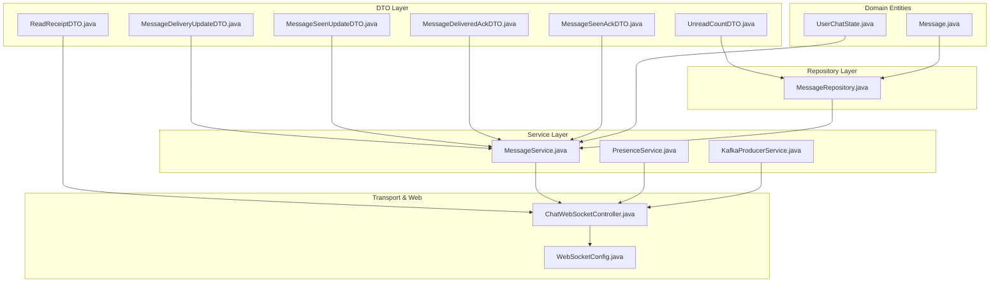
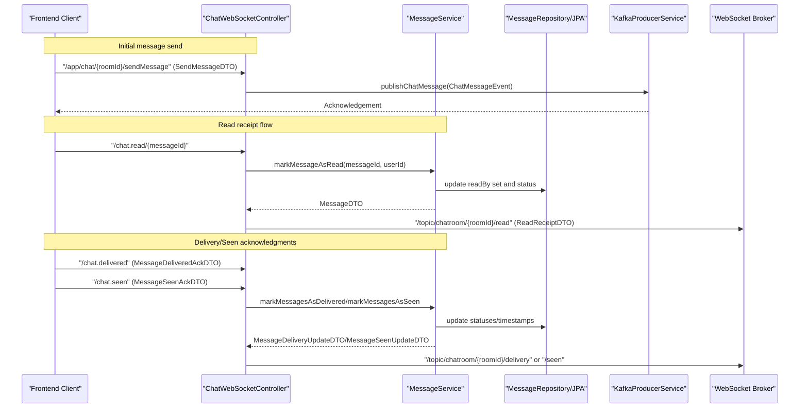
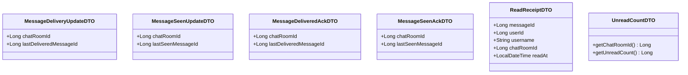
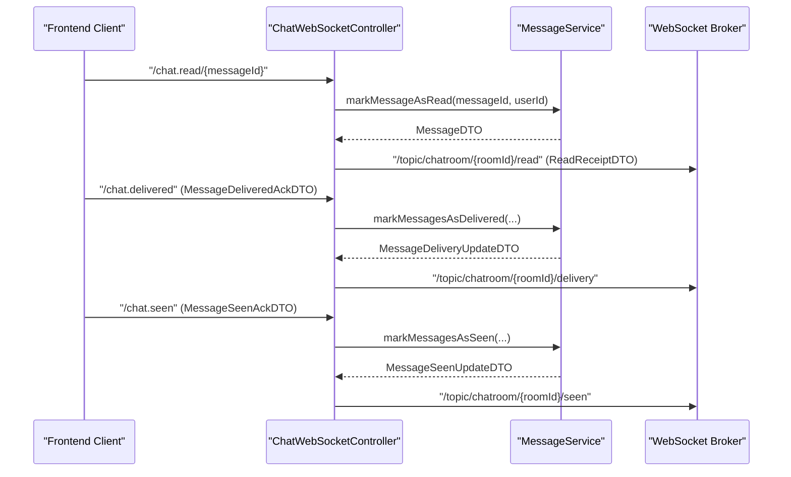
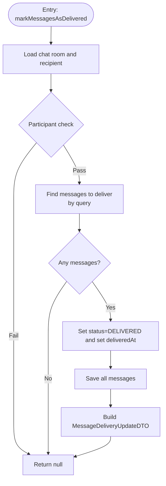
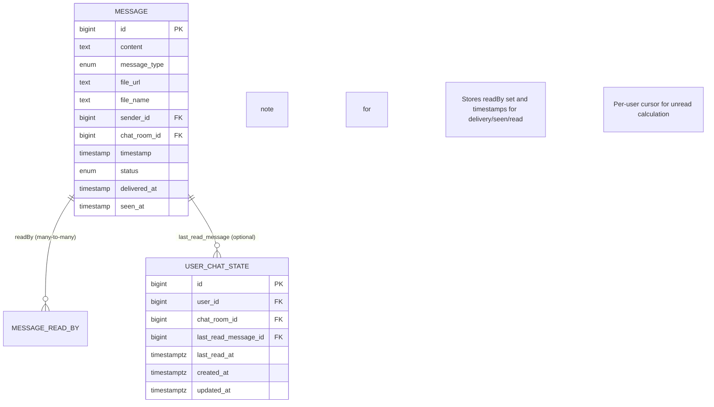
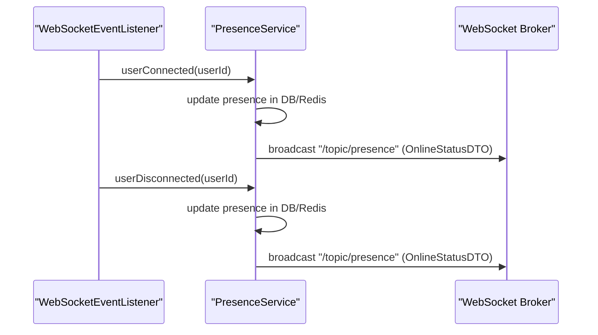
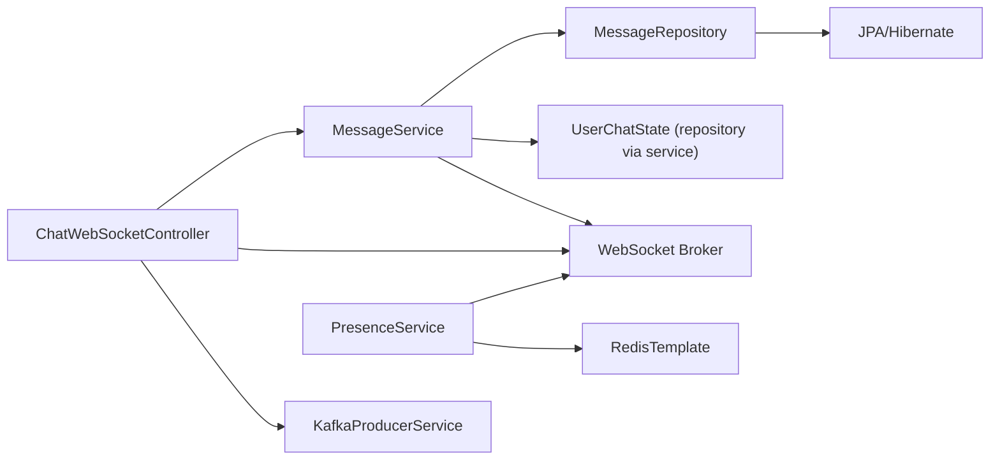

# Delivery and Read Receipt Tracking

<cite>
**Referenced Files in This Document**
- [MessageDeliveryUpdateDTO.java](file://src/main/java/com/chatify/chat_backend/dto/MessageDeliveryUpdateDTO.java)
- [MessageSeenUpdateDTO.java](file://src/main/java/com/chatify/chat_backend/dto/MessageSeenUpdateDTO.java)
- [MessageDeliveredAckDTO.java](file://src/main/java/com/chatify/chat_backend/dto/MessageDeliveredAckDTO.java)
- [MessageSeenAckDTO.java](file://src/main/java/com/chatify/chat_backend/dto/MessageSeenAckDTO.java)
- [ReadReceiptDTO.java](file://src/main/java/com/chatify/chat_backend/dto/ReadReceiptDTO.java)
- [UnreadCountDTO.java](file://src/main/java/com/chatify/chat_backend/dto/UnreadCountDTO.java)
- [MessageService.java](file://src/main/java/com/chatify/chat_backend/service/MessageService.java)
- [ChatWebSocketController.java](file://src/main/java/com/chatify/chat_backend/controller/ChatWebSocketController.java)
- [WebSocketConfig.java](file://src/main/java/com/chatify/chat_backend/config/WebSocketConfig.java)
- [MessageRepository.java](file://src/main/java/com/chatify/chat_backend/repository/MessageRepository.java)
- [Message.java](file://src/main/java/com/chatify/chat_backend/entity/Message.java)
- [UserChatState.java](file://src/main/java/com/chatify/chat_backend/entity/UserChatState.java)
- [KafkaProducerService.java](file://src/main/java/com/chatify/chat_backend/service/KafkaProducerService.java)
- [PresenceService.java](file://src/main/java/com/chatify/chat_backend/service/PresenceService.java)
- [WebSocketEventListener.java](file://src/main/java/com/chatify/chat_backend/listener/WebSocketEventListener.java)
</cite>

## Table of Contents
1. [Introduction](#introduction)
2. [Project Structure](#project-structure)
3. [Core Components](#core-components)
4. [Architecture Overview](#architecture-overview)
5. [Detailed Component Analysis](#detailed-component-analysis)
6. [Dependency Analysis](#dependency-analysis)
7. [Performance Considerations](#performance-considerations)
8. [Troubleshooting Guide](#troubleshooting-guide)
9. [Conclusion](#conclusion)
10. [Appendices](#appendices)

## Introduction
This document explains the delivery and read receipt tracking system in the backend. It covers:
- DTOs for delivery acknowledgments and read receipts
- Unread count aggregation and storage
- Real-time WebSocket broadcasting for receipt updates
- Backend service methods for persisting receipt states and updating user chat state
- Integration with presence and Kafka for scalable, ordered message handling
- End-to-end examples from send to read confirmation
- Performance and customization guidelines for high-volume scenarios

## Project Structure
The receipt tracking spans DTOs, repositories, services, controllers, and infrastructure:
- DTOs define payload structures for receipts and updates
- Repositories encapsulate queries for delivery/seen eligibility and unread counts
- Services implement business logic for marking messages delivered/seen/read and updating user chat state
- Controllers expose WebSocket endpoints for receipts and broadcast updates
- Presence and Kafka integrate with WebSocket and persistence layers

**Diagram sources**
- [MessageDeliveryUpdateDTO.java:1-12](file://src/main/java/com/chatify/chat_backend/dto/MessageDeliveryUpdateDTO.java#L1-L12)
- [MessageSeenUpdateDTO.java:1-12](file://src/main/java/com/chatify/chat_backend/dto/MessageSeenUpdateDTO.java#L1-L12)
- [MessageDeliveredAckDTO.java:1-10](file://src/main/java/com/chatify/chat_backend/dto/MessageDeliveredAckDTO.java#L1-L10)
- [MessageSeenAckDTO.java:1-10](file://src/main/java/com/chatify/chat_backend/dto/MessageSeenAckDTO.java#L1-L10)
- [ReadReceiptDTO.java:1-19](file://src/main/java/com/chatify/chat_backend/dto/ReadReceiptDTO.java#L1-L19)
- [UnreadCountDTO.java:1-6](file://src/main/java/com/chatify/chat_backend/dto/UnreadCountDTO.java#L1-L6)
- [Message.java:1-69](file://src/main/java/com/chatify/chat_backend/entity/Message.java#L1-L69)
- [UserChatState.java:1-65](file://src/main/java/com/chatify/chat_backend/entity/UserChatState.java#L1-L65)
- [MessageRepository.java:1-111](file://src/main/java/com/chatify/chat_backend/repository/MessageRepository.java#L1-L111)
- [MessageService.java:1-286](file://src/main/java/com/chatify/chat_backend/service/MessageService.java#L1-L286)
- [PresenceService.java:1-132](file://src/main/java/com/chatify/chat_backend/service/PresenceService.java#L1-L132)
- [KafkaProducerService.java:1-50](file://src/main/java/com/chatify/chat_backend/service/KafkaProducerService.java#L1-L50)
- [ChatWebSocketController.java:1-181](file://src/main/java/com/chatify/chat_backend/controller/ChatWebSocketController.java#L1-L181)
- [WebSocketConfig.java:1-111](file://src/main/java/com/chatify/chat_backend/config/WebSocketConfig.java#L1-L111)

**Section sources**
- [MessageService.java:1-286](file://src/main/java/com/chatify/chat_backend/service/MessageService.java#L1-L286)
- [ChatWebSocketController.java:1-181](file://src/main/java/com/chatify/chat_backend/controller/ChatWebSocketController.java#L1-L181)
- [WebSocketConfig.java:1-111](file://src/main/java/com/chatify/chat_backend/config/WebSocketConfig.java#L1-L111)
- [MessageRepository.java:1-111](file://src/main/java/com/chatify/chat_backend/repository/MessageRepository.java#L1-L111)
- [Message.java:1-69](file://src/main/java/com/chatify/chat_backend/entity/Message.java#L1-L69)
- [UserChatState.java:1-65](file://src/main/java/com/chatify/chat_backend/entity/UserChatState.java#L1-L65)
- [KafkaProducerService.java:1-50](file://src/main/java/com/chatify/chat_backend/service/KafkaProducerService.java#L1-L50)
- [PresenceService.java:1-132](file://src/main/java/com/chatify/chat_backend/service/PresenceService.java#L1-L132)

## Core Components
- MessageDeliveryUpdateDTO and MessageSeenUpdateDTO: transport the latest acknowledged message ID per chat room for delivery and read receipts.
- MessageDeliveredAckDTO and MessageSeenAckDTO: client-originated acknowledgments sent via WebSocket to update server-side state.
- ReadReceiptDTO: read receipt payload broadcast to the chat room’s read topic.
- UnreadCountDTO: interface for unread count projections used by repositories.
- MessageService: orchestrates persistence and state transitions for delivery, seen, and read receipts; updates user chat state.
- ChatWebSocketController: exposes WebSocket endpoints for sending messages, read receipts, delivery/seen acknowledgments, and presence updates; broadcasts receipt updates.
- MessageRepository: provides queries for eligible messages to mark delivered/seen/read and unread counts.
- Message entity: stores message status, timestamps, and read-by set.
- UserChatState: per-user, per-room cursor for last read message and timestamp.
- PresenceService and WebSocketEventListener: manage user presence and broadcast presence changes; indirectly supports receipt UX by signaling online/offline state.

**Section sources**
- [MessageDeliveryUpdateDTO.java:1-12](file://src/main/java/com/chatify/chat_backend/dto/MessageDeliveryUpdateDTO.java#L1-L12)
- [MessageSeenUpdateDTO.java:1-12](file://src/main/java/com/chatify/chat_backend/dto/MessageSeenUpdateDTO.java#L1-L12)
- [MessageDeliveredAckDTO.java:1-10](file://src/main/java/com/chatify/chat_backend/dto/MessageDeliveredAckDTO.java#L1-L10)
- [MessageSeenAckDTO.java:1-10](file://src/main/java/com/chatify/chat_backend/dto/MessageSeenAckDTO.java#L1-L10)
- [ReadReceiptDTO.java:1-19](file://src/main/java/com/chatify/chat_backend/dto/ReadReceiptDTO.java#L1-L19)
- [UnreadCountDTO.java:1-6](file://src/main/java/com/chatify/chat_backend/dto/UnreadCountDTO.java#L1-L6)
- [MessageService.java:194-269](file://src/main/java/com/chatify/chat_backend/service/MessageService.java#L194-L269)
- [ChatWebSocketController.java:112-181](file://src/main/java/com/chatify/chat_backend/controller/ChatWebSocketController.java#L112-L181)
- [MessageRepository.java:36-111](file://src/main/java/com/chatify/chat_backend/repository/MessageRepository.java#L36-L111)
- [Message.java:1-69](file://src/main/java/com/chatify/chat_backend/entity/Message.java#L1-L69)
- [UserChatState.java:1-65](file://src/main/java/com/chatify/chat_backend/entity/UserChatState.java#L1-L65)
- [PresenceService.java:1-132](file://src/main/java/com/chatify/chat_backend/service/PresenceService.java#L1-L132)
- [WebSocketEventListener.java:1-55](file://src/main/java/com/chatify/chat_backend/listener/WebSocketEventListener.java#L1-L55)

## Architecture Overview
The system integrates WebSocket, Kafka, JPA, and Redis:
- Clients send read receipts and delivery/seen acknowledgments over WebSocket.
- Controllers validate participants and delegate to services.
- Services persist state changes and optionally update user chat state.
- WebSocket topics broadcast delivery and seen updates to chat room subscribers.
- PresenceService tracks user online/offline state and broadcasts changes.
- Kafka persists messages and orders events by chat room key.

**Diagram sources**
- [ChatWebSocketController.java:81-181](file://src/main/java/com/chatify/chat_backend/controller/ChatWebSocketController.java#L81-L181)
- [MessageService.java:194-269](file://src/main/java/com/chatify/chat_backend/service/MessageService.java#L194-L269)
- [MessageRepository.java:36-59](file://src/main/java/com/chatify/chat_backend/repository/MessageRepository.java#L36-L59)
- [KafkaProducerService.java:27-50](file://src/main/java/com/chatify/chat_backend/service/KafkaProducerService.java#L27-L50)
- [WebSocketConfig.java:50-57](file://src/main/java/com/chatify/chat_backend/config/WebSocketConfig.java#L50-L57)

## Detailed Component Analysis

### DTOs for Receipt Updates
- MessageDeliveryUpdateDTO: carries chat room ID and the last delivered message ID for delivery updates.
- MessageSeenUpdateDTO: carries chat room ID and the last seen message ID for read receipts.
- MessageDeliveredAckDTO: client acknowledgment payload for delivery.
- MessageSeenAckDTO: client acknowledgment payload for read receipts.
- ReadReceiptDTO: broadcast payload for read confirmations.
- UnreadCountDTO: projection interface for unread counts per chat room.

**Diagram sources**
- [MessageDeliveryUpdateDTO.java:1-12](file://src/main/java/com/chatify/chat_backend/dto/MessageDeliveryUpdateDTO.java#L1-L12)
- [MessageSeenUpdateDTO.java:1-12](file://src/main/java/com/chatify/chat_backend/dto/MessageSeenUpdateDTO.java#L1-L12)
- [MessageDeliveredAckDTO.java:1-10](file://src/main/java/com/chatify/chat_backend/dto/MessageDeliveredAckDTO.java#L1-L10)
- [MessageSeenAckDTO.java:1-10](file://src/main/java/com/chatify/chat_backend/dto/MessageSeenAckDTO.java#L1-L10)
- [ReadReceiptDTO.java:1-19](file://src/main/java/com/chatify/chat_backend/dto/ReadReceiptDTO.java#L1-L19)
- [UnreadCountDTO.java:1-6](file://src/main/java/com/chatify/chat_backend/dto/UnreadCountDTO.java#L1-L6)

**Section sources**
- [MessageDeliveryUpdateDTO.java:1-12](file://src/main/java/com/chatify/chat_backend/dto/MessageDeliveryUpdateDTO.java#L1-L12)
- [MessageSeenUpdateDTO.java:1-12](file://src/main/java/com/chatify/chat_backend/dto/MessageSeenUpdateDTO.java#L1-L12)
- [MessageDeliveredAckDTO.java:1-10](file://src/main/java/com/chatify/chat_backend/dto/MessageDeliveredAckDTO.java#L1-L10)
- [MessageSeenAckDTO.java:1-10](file://src/main/java/com/chatify/chat_backend/dto/MessageSeenAckDTO.java#L1-L10)
- [ReadReceiptDTO.java:1-19](file://src/main/java/com/chatify/chat_backend/dto/ReadReceiptDTO.java#L1-L19)
- [UnreadCountDTO.java:1-6](file://src/main/java/com/chatify/chat_backend/dto/UnreadCountDTO.java#L1-L6)

### WebSocket Endpoints and Broadcasting
- Read receipts: clients send a message to the read endpoint; server marks the message as read and broadcasts a read receipt DTO to the chat room’s read topic.
- Delivery/Seen acknowledgments: clients send delivery/seen acks; server updates statuses and broadcasts delivery/seen update DTOs to respective topics.
- Presence updates: clients send presence updates; server updates presence state and broadcasts changes.

**Diagram sources**
- [ChatWebSocketController.java:112-181](file://src/main/java/com/chatify/chat_backend/controller/ChatWebSocketController.java#L112-L181)
- [MessageService.java:194-269](file://src/main/java/com/chatify/chat_backend/service/MessageService.java#L194-L269)

**Section sources**
- [ChatWebSocketController.java:112-181](file://src/main/java/com/chatify/chat_backend/controller/ChatWebSocketController.java#L112-L181)
- [WebSocketConfig.java:50-57](file://src/main/java/com/chatify/chat_backend/config/WebSocketConfig.java#L50-L57)

### Backend Service Methods for Receipt Updates
- markMessageAsRead: adds the user to the message’s read-by set and returns the updated message DTO.
- markAllMessagesAsRead: marks all unread messages for a user in a chat room as seen and updates the user’s last read message and timestamp.
- markMessagesAsDelivered: finds eligible messages up to a given ID and marks them delivered; returns a delivery update DTO.
- markMessagesAsSeen: finds eligible messages up to a given ID, marks them seen, and updates read-by sets; returns a seen update DTO.

**Diagram sources**
- [MessageService.java:194-228](file://src/main/java/com/chatify/chat_backend/service/MessageService.java#L194-L228)
- [MessageRepository.java:36-46](file://src/main/java/com/chatify/chat_backend/repository/MessageRepository.java#L36-L46)

**Section sources**
- [MessageService.java:115-179](file://src/main/java/com/chatify/chat_backend/service/MessageService.java#L115-L179)
- [MessageService.java:194-269](file://src/main/java/com/chatify/chat_backend/service/MessageService.java#L194-L269)
- [MessageRepository.java:36-59](file://src/main/java/com/chatify/chat_backend/repository/MessageRepository.java#L36-L59)

### Unread Count Management
- UnreadCountDTO is a projection interface used by repositories to fetch unread counts per chat room.
- MessageRepository provides a native query to compute unread counts per room efficiently.
- UserChatState stores the last read message and timestamp per user and room, enabling precise unread counting and efficient aggregation.

**Diagram sources**
- [Message.java:1-69](file://src/main/java/com/chatify/chat_backend/entity/Message.java#L1-L69)
- [UserChatState.java:1-65](file://src/main/java/com/chatify/chat_backend/entity/UserChatState.java#L1-L65)
- [MessageRepository.java:97-111](file://src/main/java/com/chatify/chat_backend/repository/MessageRepository.java#L97-L111)

**Section sources**
- [MessageRepository.java:97-111](file://src/main/java/com/chatify/chat_backend/repository/MessageRepository.java#L97-L111)
- [UserChatState.java:1-65](file://src/main/java/com/chatify/chat_backend/entity/UserChatState.java#L1-L65)

### Relationship Between Receipt Tracking and Presence
- PresenceService maintains user online/offline state and broadcasts presence changes.
- WebSocketEventListener triggers presence updates on connect/disconnect.
- While presence does not directly update receipts, it informs clients about recipient availability, influencing when receipts occur.

**Diagram sources**
- [WebSocketEventListener.java:24-54](file://src/main/java/com/chatify/chat_backend/listener/WebSocketEventListener.java#L24-L54)
- [PresenceService.java:101-115](file://src/main/java/com/chatify/chat_backend/service/PresenceService.java#L101-L115)

**Section sources**
- [WebSocketEventListener.java:1-55](file://src/main/java/com/chatify/chat_backend/listener/WebSocketEventListener.java#L1-L55)
- [PresenceService.java:1-132](file://src/main/java/com/chatify/chat_backend/service/PresenceService.java#L1-L132)

## Dependency Analysis
- Controllers depend on services and messaging templates for broadcasting.
- Services depend on repositories for persistence and user/chat room validation.
- Repositories depend on JPA and native SQL for unread and delivery/seen queries.
- PresenceService depends on Redis and DB for fast presence retrieval and caching.
- KafkaProducerService depends on Kafka template for asynchronous message publishing.

**Diagram sources**
- [ChatWebSocketController.java:1-181](file://src/main/java/com/chatify/chat_backend/controller/ChatWebSocketController.java#L1-L181)
- [MessageService.java:1-286](file://src/main/java/com/chatify/chat_backend/service/MessageService.java#L1-L286)
- [MessageRepository.java:1-111](file://src/main/java/com/chatify/chat_backend/repository/MessageRepository.java#L1-L111)
- [PresenceService.java:1-132](file://src/main/java/com/chatify/chat_backend/service/PresenceService.java#L1-L132)
- [KafkaProducerService.java:1-50](file://src/main/java/com/chatify/chat_backend/service/KafkaProducerService.java#L1-L50)

**Section sources**
- [ChatWebSocketController.java:1-181](file://src/main/java/com/chatify/chat_backend/controller/ChatWebSocketController.java#L1-L181)
- [MessageService.java:1-286](file://src/main/java/com/chatify/chat_backend/service/MessageService.java#L1-L286)
- [MessageRepository.java:1-111](file://src/main/java/com/chatify/chat_backend/repository/MessageRepository.java#L1-L111)
- [PresenceService.java:1-132](file://src/main/java/com/chatify/chat_backend/service/PresenceService.java#L1-L132)
- [KafkaProducerService.java:1-50](file://src/main/java/com/chatify/chat_backend/service/KafkaProducerService.java#L1-L50)

## Performance Considerations
- Ordered message handling: Kafka topic uses chat room ID as key to preserve ordering per room.
- Efficient receipt updates: Queries target only messages up to the acknowledged ID, minimizing scan and writes.
- Batch persistence: Services save collections of messages in bulk to reduce round-trips.
- Unread aggregation: Native queries compute unread counts per room efficiently; UserChatState avoids scanning all messages for each user.
- Presence caching: Redis stores online users with TTL for fast retrieval and reduced DB load.
- WebSocket broadcasting: Topics are scoped to chat rooms to limit fan-out.

[No sources needed since this section provides general guidance]

## Troubleshooting Guide
Common issues and resolutions:
- Unauthorized access: Participants must belong to the chat room; otherwise, exceptions are thrown during send/read/delivery/seen operations.
- No eligible messages to update: If no messages match the criteria (sent/delivered/seens), the service returns null; ensure client acknowledges correct message IDs.
- Presence not updating: Verify WebSocket CONNECT frames include a valid JWT; authentication failures prevent presence updates.
- Broadcast not received: Confirm subscriptions to the correct topics (/topic/chatroom/{roomId}/read, /delivery, /seen) and that the room ID matches.

**Section sources**
- [MessageService.java:50-78](file://src/main/java/com/chatify/chat_backend/service/MessageService.java#L50-L78)
- [MessageService.java:194-269](file://src/main/java/com/chatify/chat_backend/service/MessageService.java#L194-L269)
- [WebSocketConfig.java:75-108](file://src/main/java/com/chatify/chat_backend/config/WebSocketConfig.java#L75-L108)
- [ChatWebSocketController.java:112-181](file://src/main/java/com/chatify/chat_backend/controller/ChatWebSocketController.java#L112-L181)

## Conclusion
The receipt tracking system combines WebSocket, Kafka, JPA, and Redis to provide reliable, real-time delivery and read acknowledgments. DTOs standardize payloads, repositories optimize queries, services enforce business rules and maintain user chat state, and presence enhances UX. The design scales with ordered Kafka events and efficient unread aggregation.

[No sources needed since this section summarizes without analyzing specific files]

## Appendices

### End-to-End Receipt Flow Examples
- Send message: Client sends to the room-specific endpoint; server publishes to Kafka; consumers save and broadcast.
- Read confirmation: Client sends read receipt; server updates read-by set and broadcasts read receipt to the room.
- Delivery/Seen acknowledgments: Client sends delivery/seen acks; server updates statuses and broadcasts updates.

**Section sources**
- [ChatWebSocketController.java:81-131](file://src/main/java/com/chatify/chat_backend/controller/ChatWebSocketController.java#L81-L131)
- [MessageService.java:194-269](file://src/main/java/com/chatify/chat_backend/service/MessageService.java#L194-L269)

### Implementation Guidelines for Customization
- Adding new receipt types: Define a new DTO and a WebSocket endpoint in the controller; implement a service method to persist the new state; broadcast updates to a dedicated topic.
- Extending unread computation: Add new repository queries and projections; update UserChatState usage accordingly.
- Performance tuning: Adjust Kafka partitioning strategy, batch sizes, and Redis TTL for presence; monitor repository query plans and indexes.

[No sources needed since this section provides general guidance]