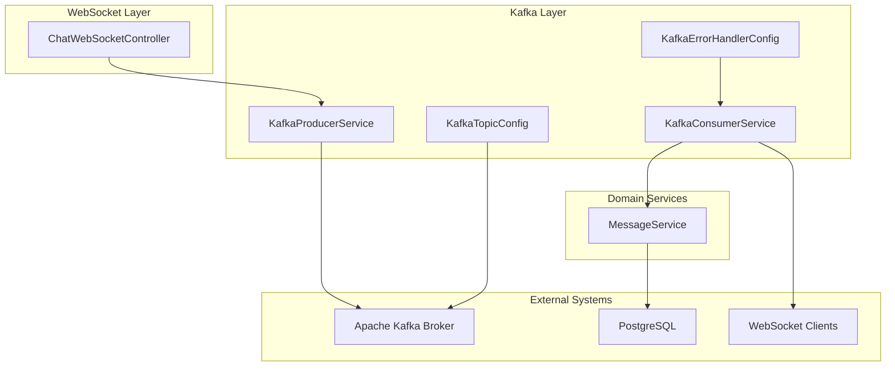
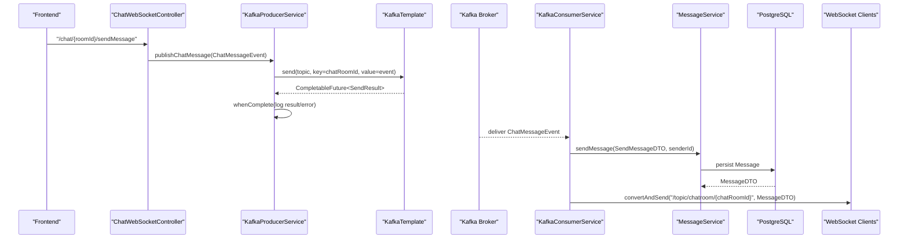
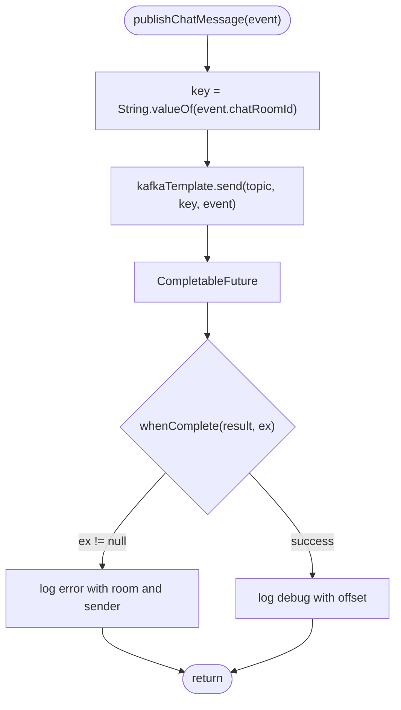
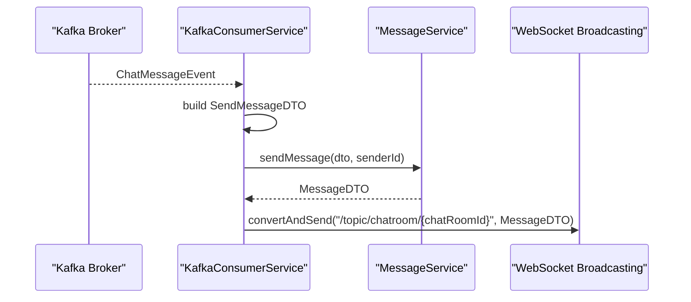
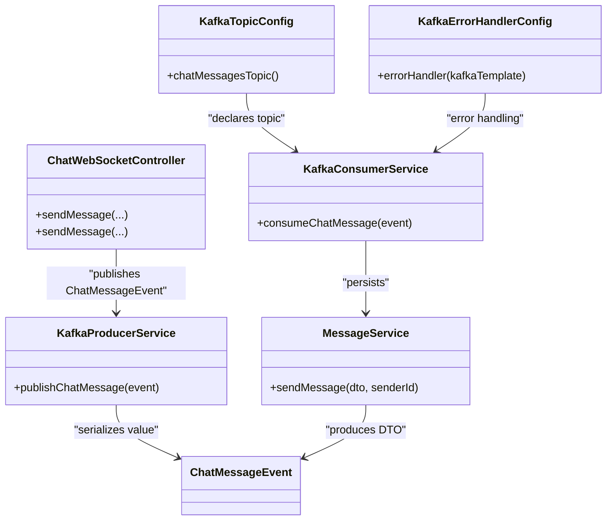

# Kafka Integration

<cite>
**Referenced Files in This Document**
- [ChatMessageEvent.java](file://src/main/java/com/chatify/chat_backend/dto/ChatMessageEvent.java)
- [KafkaProducerService.java](file://src/main/java/com/chatify/chat_backend/service/KafkaProducerService.java)
- [KafkaConsumerService.java](file://src/main/java/com/chatify/chat_backend/service/KafkaConsumerService.java)
- [KafkaTopicConfig.java](file://src/main/java/com/chatify/chat_backend/config/KafkaTopicConfig.java)
- [KafkaErrorHandlerConfig.java](file://src/main/java/com/chatify/chat_backend/config/KafkaErrorHandlerConfig.java)
- [application.properties](file://src/main/resources/application.properties)
- [ChatWebSocketController.java](file://src/main/java/com/chatify/chat_backend/controller/ChatWebSocketController.java)
- [MessageService.java](file://src/main/java/com/chatify/chat_backend/service/MessageService.java)
- [docker-compose.yml](file://docker-compose.yml)
</cite>

## Table of Contents
1. [Introduction](#introduction)
2. [Project Structure](#project-structure)
3. [Core Components](#core-components)
4. [Architecture Overview](#architecture-overview)
5. [Detailed Component Analysis](#detailed-component-analysis)
6. [Dependency Analysis](#dependency-analysis)
7. [Performance Considerations](#performance-considerations)
8. [Troubleshooting Guide](#troubleshooting-guide)
9. [Conclusion](#conclusion)

## Introduction
This document explains the Kafka-based event-driven message delivery system. It covers the ChatMessageEvent DTO for serialization and deserialization, the KafkaProducerService implementation with partition key strategy for ordering, KafkaConsumerService configuration for processing, KafkaTopicConfig setup, and the asynchronous publishing pattern using CompletableFuture. It also includes configuration examples, retry and dead-letter queue behavior, ordering guarantees, partition distribution, scaling considerations, and troubleshooting guidance.

## Project Structure
The Kafka integration spans DTOs, producers, consumers, configuration beans, and application properties. The WebSocket controller triggers asynchronous publishing to Kafka, while consumers persist messages and broadcast via WebSocket.

**Diagram sources**
- [ChatWebSocketController.java:53-110](file://src/main/java/com/chatify/chat_backend/controller/ChatWebSocketController.java#L53-L110)
- [KafkaProducerService.java:32-49](file://src/main/java/com/chatify/chat_backend/service/KafkaProducerService.java#L32-L49)
- [KafkaConsumerService.java:34-71](file://src/main/java/com/chatify/chat_backend/service/KafkaConsumerService.java#L34-L71)
- [KafkaTopicConfig.java:17-22](file://src/main/java/com/chatify/chat_backend/config/KafkaTopicConfig.java#L17-L22)
- [KafkaErrorHandlerConfig.java:15-18](file://src/main/java/com/chatify/chat_backend/config/KafkaErrorHandlerConfig.java#L15-L18)
- [MessageService.java:50-78](file://src/main/java/com/chatify/chat_backend/service/MessageService.java#L50-L78)

**Section sources**
- [ChatWebSocketController.java:1-181](file://src/main/java/com/chatify/chat_backend/controller/ChatWebSocketController.java#L1-L181)
- [KafkaProducerService.java:1-50](file://src/main/java/com/chatify/chat_backend/service/KafkaProducerService.java#L1-L50)
- [KafkaConsumerService.java:1-72](file://src/main/java/com/chatify/chat_backend/service/KafkaConsumerService.java#L1-L72)
- [KafkaTopicConfig.java:1-23](file://src/main/java/com/chatify/chat_backend/config/KafkaTopicConfig.java#L1-L23)
- [KafkaErrorHandlerConfig.java:1-19](file://src/main/java/com/chatify/chat_backend/config/KafkaErrorHandlerConfig.java#L1-L19)
- [MessageService.java:1-286](file://src/main/java/com/chatify/chat_backend/service/MessageService.java#L1-L286)

## Core Components
- ChatMessageEvent: The event payload published to Kafka, containing chat metadata and content for persistence and broadcast.
- KafkaProducerService: Asynchronously publishes events keyed by chatRoomId to preserve ordering within rooms.
- KafkaConsumerService: Consumes events, persists via MessageService, and broadcasts via WebSocket.
- KafkaTopicConfig: Declares the chat-messages topic with partitions and replicas.
- KafkaErrorHandlerConfig: Configures DefaultErrorHandler with fixed backoff and DeadLetterPublishingRecoverer.
- application.properties: Defines bootstrap servers, producer/consumer serializers, acks, retries, idempotence, group-id, JSON trusted packages, and topic name.

**Section sources**
- [ChatMessageEvent.java:16-25](file://src/main/java/com/chatify/chat_backend/dto/ChatMessageEvent.java#L16-L25)
- [KafkaProducerService.java:27-49](file://src/main/java/com/chatify/chat_backend/service/KafkaProducerService.java#L27-L49)
- [KafkaConsumerService.java:26-71](file://src/main/java/com/chatify/chat_backend/service/KafkaConsumerService.java#L26-L71)
- [KafkaTopicConfig.java:17-22](file://src/main/java/com/chatify/chat_backend/config/KafkaTopicConfig.java#L17-L22)
- [KafkaErrorHandlerConfig.java:15-18](file://src/main/java/com/chatify/chat_backend/config/KafkaErrorHandlerConfig.java#L15-L18)
- [application.properties:54-75](file://src/main/resources/application.properties#L54-L75)

## Architecture Overview
The system uses an event-driven architecture:
- WebSocket handlers create ChatMessageEvent and publish to Kafka via KafkaProducerService.
- KafkaConsumerService consumes events, delegates persistence to MessageService, and broadcasts via WebSocket.
- Topic creation and error handling are configured via dedicated beans.

**Diagram sources**
- [ChatWebSocketController.java:81-110](file://src/main/java/com/chatify/chat_backend/controller/ChatWebSocketController.java#L81-L110)
- [KafkaProducerService.java:32-49](file://src/main/java/com/chatify/chat_backend/service/KafkaProducerService.java#L32-L49)
- [KafkaConsumerService.java:38-69](file://src/main/java/com/chatify/chat_backend/service/KafkaConsumerService.java#L38-L69)
- [MessageService.java:50-78](file://src/main/java/com/chatify/chat_backend/service/MessageService.java#L50-L78)

## Detailed Component Analysis

### ChatMessageEvent DTO
- Purpose: Encapsulates all necessary fields for consumers to persist and broadcast messages without additional DB lookups.
- Fields include chatRoomId, senderId, content, messageType, optional fileUrl and fileName.
- Used as the value type for Kafka serialization/deserialization.

**Section sources**
- [ChatMessageEvent.java:16-25](file://src/main/java/com/chatify/chat_backend/dto/ChatMessageEvent.java#L16-L25)

### KafkaProducerService
- Asynchronous publishing: Uses CompletableFuture to avoid blocking the WebSocket thread.
- Partition key strategy: chatRoomId as the key ensures all messages for the same room are routed to the same partition, preserving in-room ordering.
- Logging: Emits debug logs with offset on success and error logs on failure.

**Diagram sources**
- [KafkaProducerService.java:32-49](file://src/main/java/com/chatify/chat_backend/service/KafkaProducerService.java#L32-L49)

**Section sources**
- [KafkaProducerService.java:27-49](file://src/main/java/com/chatify/chat_backend/service/KafkaProducerService.java#L27-L49)

### KafkaConsumerService
- Listener configuration: Subscribes to the chat-messages topic using group-id from application properties.
- Processing steps:
  1. Build SendMessageDTO from ChatMessageEvent.
  2. Persist via MessageService.sendMessage.
  3. Broadcast the resulting MessageDTO to "/topic/chatroom/{chatRoomId}".
- Error handling: Catches exceptions and re-throws to trigger retries per error handler configuration.

**Diagram sources**
- [KafkaConsumerService.java:38-69](file://src/main/java/com/chatify/chat_backend/service/KafkaConsumerService.java#L38-L69)
- [MessageService.java:50-78](file://src/main/java/com/chatify/chat_backend/service/MessageService.java#L50-L78)

**Section sources**
- [KafkaConsumerService.java:26-71](file://src/main/java/com/chatify/chat_backend/service/KafkaConsumerService.java#L26-L71)

### KafkaTopicConfig
- Declares the chat-messages topic with:
  - Partitions: 3 (default)
  - Replicas: 1 (default)
- This supports horizontal scaling and basic fault tolerance in single-broker setups.

**Section sources**
- [KafkaTopicConfig.java:17-22](file://src/main/java/com/chatify/chat_backend/config/KafkaTopicConfig.java#L17-L22)

### KafkaErrorHandlerConfig
- Configures DefaultErrorHandler with:
  - DeadLetterPublishingRecoverer for moving failed records after retries.
  - FixedBackOff with fixed delay and retry count.
- Combined with consumer error handling, this enables retry and dead-letter behavior.

**Section sources**
- [KafkaErrorHandlerConfig.java:15-18](file://src/main/java/com/chatify/chat_backend/config/KafkaErrorHandlerConfig.java#L15-L18)

### Application Properties (Kafka Configuration)
Key Kafka settings:
- Bootstrap servers: configurable via environment variable.
- Producer:
  - Serializers for key/value.
  - acks=all for durability.
  - retries with idempotence enabled.
- Consumer:
  - group-id for consumer group membership.
  - auto.offset.reset for initial positioning.
  - Deserializers and trusted JSON packages for ChatMessageEvent.
- Topic name: kafka.topic.chat-messages.

**Section sources**
- [application.properties:54-75](file://src/main/resources/application.properties#L54-L75)

### WebSocket Integration
- Two WebSocket endpoints route to Kafka:
  - Legacy: "/chat.sendMessage"
  - Primary: "/chat/{roomId}/sendMessage"
- Both construct ChatMessageEvent and call KafkaProducerService.publishChatMessage.

**Section sources**
- [ChatWebSocketController.java:53-110](file://src/main/java/com/chatify/chat_backend/controller/ChatWebSocketController.java#L53-L110)

### MessageService Integration
- sendMessage persists the message and returns MessageDTO.
- Used by KafkaConsumerService to obtain the persisted DTO for broadcasting.

**Section sources**
- [MessageService.java:50-78](file://src/main/java/com/chatify/chat_backend/service/MessageService.java#L50-L78)

## Dependency Analysis

**Diagram sources**
- [ChatWebSocketController.java:53-110](file://src/main/java/com/chatify/chat_backend/controller/ChatWebSocketController.java#L53-L110)
- [KafkaProducerService.java:32-49](file://src/main/java/com/chatify/chat_backend/service/KafkaProducerService.java#L32-L49)
- [KafkaConsumerService.java:38-69](file://src/main/java/com/chatify/chat_backend/service/KafkaConsumerService.java#L38-L69)
- [MessageService.java:50-78](file://src/main/java/com/chatify/chat_backend/service/MessageService.java#L50-L78)
- [KafkaTopicConfig.java:17-22](file://src/main/java/com/chatify/chat_backend/config/KafkaTopicConfig.java#L17-L22)
- [KafkaErrorHandlerConfig.java:15-18](file://src/main/java/com/chatify/chat_backend/config/KafkaErrorHandlerConfig.java#L15-L18)

**Section sources**
- [ChatWebSocketController.java:1-181](file://src/main/java/com/chatify/chat_backend/controller/ChatWebSocketController.java#L1-L181)
- [KafkaProducerService.java:1-50](file://src/main/java/com/chatify/chat_backend/service/KafkaProducerService.java#L1-L50)
- [KafkaConsumerService.java:1-72](file://src/main/java/com/chatify/chat_backend/service/KafkaConsumerService.java#L1-L72)
- [MessageService.java:1-286](file://src/main/java/com/chatify/chat_backend/service/MessageService.java#L1-L286)
- [KafkaTopicConfig.java:1-23](file://src/main/java/com/chatify/chat_backend/config/KafkaTopicConfig.java#L1-L23)
- [KafkaErrorHandlerConfig.java:1-19](file://src/main/java/com/chatify/chat_backend/config/KafkaErrorHandlerConfig.java#L1-L19)

## Performance Considerations
- Partitioning and Ordering:
  - chatRoomId as the partition key ensures in-room ordering.
  - Increase partitions for higher throughput within rooms; ensure sufficient consumer instances to match partitions.
- Idempotence and Acks:
  - Producer acks=all and idempotence reduce duplication risks under retries.
- Asynchronous Publishing:
  - CompletableFuture avoids blocking the WebSocket thread, improving latency and throughput.
- Consumer Scaling:
  - Add consumer instances within the same group to increase parallelism; Kafka rebalances partitions.
- Topic Replication:
  - Current replica factor is 1; consider increasing for production environments requiring fault tolerance.
- Backoff and Retries:
  - FixedBackOff with limited retry attempts reduces load during transient failures; configure appropriately for workload.

[No sources needed since this section provides general guidance]

## Troubleshooting Guide
Common Kafka issues and remedies:
- Consumer Lag:
  - Symptoms: delayed message delivery, rising lag metrics.
  - Actions: scale consumers, reduce processing time in consumeChatMessage, ensure efficient MessageService operations, verify database performance.
- Topic Configuration:
  - Verify chat-messages topic exists and has expected partitions; adjust partitions/replicas as needed.
  - Confirm topic name matches kafka.topic.chat-messages property.
- Network Connectivity:
  - Ensure spring.kafka.bootstrap-servers points to a reachable broker; in Docker, use internal address kafka:29092.
  - Check advertised/listeners configuration in Kafka broker settings.
- Serialization/Deserialization:
  - Ensure spring.json.trusted.packages includes the DTO package and spring.json.value.default.type matches ChatMessageEvent.
- Retries and Dead Letter Queues:
  - DefaultErrorHandler with DeadLetterPublishingRecoverer moves failed records after retries; confirm recoverer target topic and consumer configuration.
- Logs:
  - Producer logs errors and offsets; Consumer logs processing and exceptions; enable debug logging for diagnostics.

**Section sources**
- [application.properties:54-75](file://src/main/resources/application.properties#L54-L75)
- [KafkaErrorHandlerConfig.java:15-18](file://src/main/java/com/chatify/chat_backend/config/KafkaErrorHandlerConfig.java#L15-L18)
- [KafkaProducerService.java:38-48](file://src/main/java/com/chatify/chat_backend/service/KafkaProducerService.java#L38-L48)
- [KafkaConsumerService.java:64-70](file://src/main/java/com/chatify/chat_backend/service/KafkaConsumerService.java#L64-L70)
- [docker-compose.yml:111-112](file://docker-compose.yml#L111-L112)

## Conclusion
The Kafka integration implements a robust, event-driven message delivery pipeline. ChatMessageEvent carries all necessary data for persistence and broadcast. KafkaProducerService ensures ordered delivery per room via partition keys and non-blocking publishing. KafkaConsumerService integrates with MessageService and WebSocket broadcasting, with configurable error handling and retries. Topic and error-handling configurations support operational reliability, while application properties define serializers, acks, and consumer group settings. Proper tuning of partitions, replicas, and consumer scaling further enhances throughput and resilience.