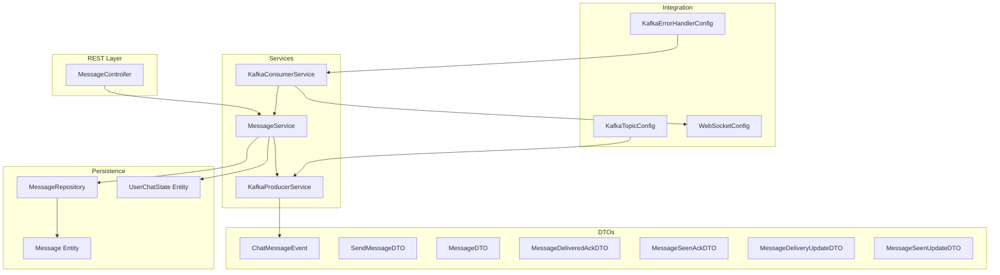
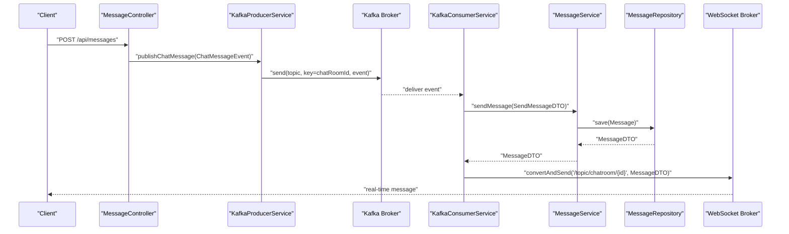
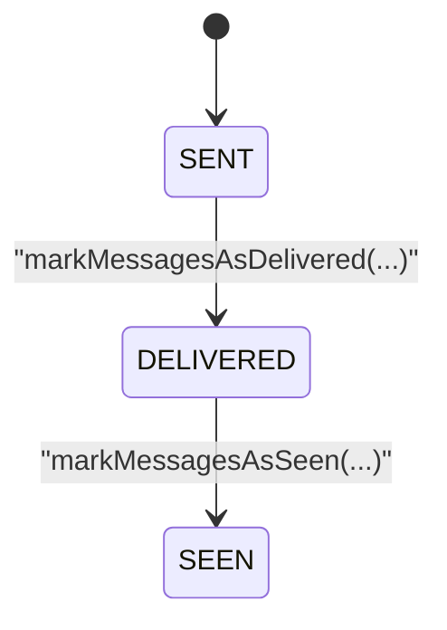
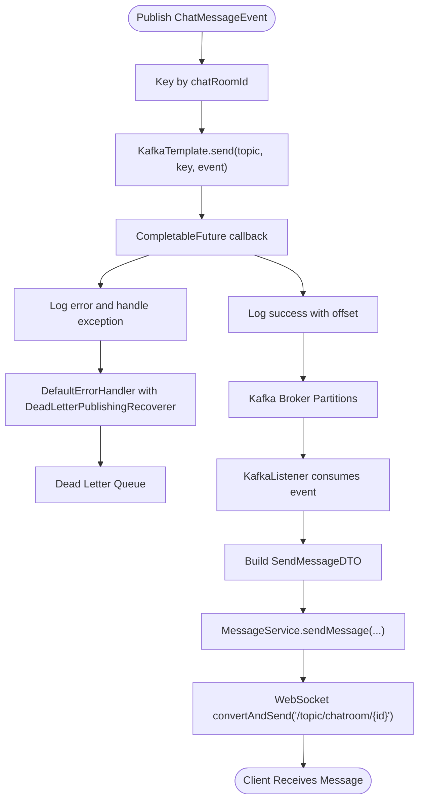
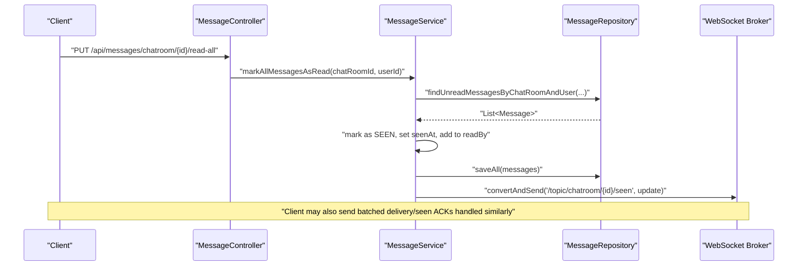
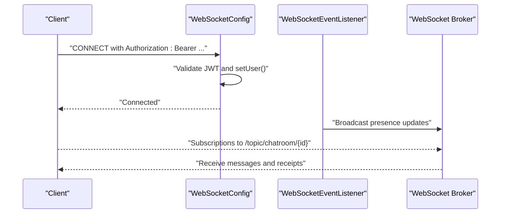
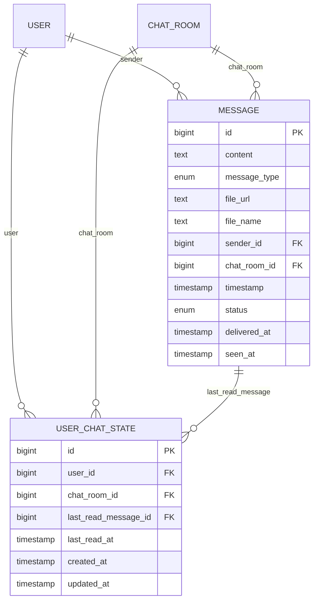
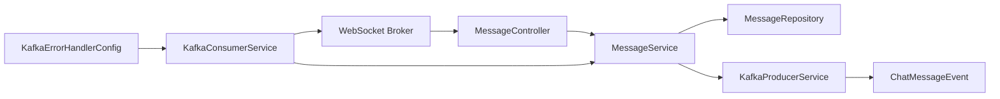

# Message Delivery System

<cite>
**Referenced Files in This Document**
- [MESSAGE_DELIVERY_DESIGN.md](file://MESSAGE_DELIVERY_DESIGN.md)
- [MessageStatus.java](file://src/main/java/com/chatify/chat_backend/entity/enums/MessageStatus.java)
- [Message.java](file://src/main/java/com/chatify/chat_backend/entity/Message.java)
- [UserChatState.java](file://src/main/java/com/chatify/chat_backend/entity/UserChatState.java)
- [MessageDTO.java](file://src/main/java/com/chatify/chat_backend/dto/MessageDTO.java)
- [ChatMessageEvent.java](file://src/main/java/com/chatify/chat_backend/dto/ChatMessageEvent.java)
- [MessageDeliveredAckDTO.java](file://src/main/java/com/chatify/chat_backend/dto/MessageDeliveredAckDTO.java)
- [MessageSeenAckDTO.java](file://src/main/java/com/chatify/chat_backend/dto/MessageSeenAckDTO.java)
- [MessageDeliveryUpdateDTO.java](file://src/main/java/com/chatify/chat_backend/dto/MessageDeliveryUpdateDTO.java)
- [MessageSeenUpdateDTO.java](file://src/main/java/com/chatify/chat_backend/dto/MessageSeenUpdateDTO.java)
- [UnreadCountDTO.java](file://src/main/java/com/chatify/chat_backend/dto/UnreadCountDTO.java)
- [SendMessageDTO.java](file://src/main/java/com/chatify/chat_backend/dto/SendMessageDTO.java)
- [MessageController.java](file://src/main/java/com/chatify/chat_backend/controller/MessageController.java)
- [MessageService.java](file://src/main/java/com/chatify/chat_backend/service/MessageService.java)
- [MessageRepository.java](file://src/main/java/com/chatify/chat_backend/repository/MessageRepository.java)
- [KafkaProducerService.java](file://src/main/java/com/chatify/chat_backend/service/KafkaProducerService.java)
- [KafkaConsumerService.java](file://src/main/java/com/chatify/chat_backend/service/KafkaConsumerService.java)
- [KafkaTopicConfig.java](file://src/main/java/com/chatify/chat_backend/config/KafkaTopicConfig.java)
- [KafkaErrorHandlerConfig.java](file://src/main/java/com/chatify/chat_backend/config/KafkaErrorHandlerConfig.java)
- [WebSocketConfig.java](file://src/main/java/com/chatify/chat_backend/config/WebSocketConfig.java)
- [WebSocketEventListener.java](file://src/main/java/com/chatify/chat_backend/listener/WebSocketEventListener.java)
- [application.properties](file://src/main/resources/application.properties)
- [docker-compose.yml](file://docker-compose.yml)
</cite>

## Update Summary
**Changes Made**
- Expanded Kafka integration documentation with detailed event-driven messaging workflows
- Added comprehensive async processing capabilities documentation
- Enhanced error handling and recovery mechanisms section
- Updated configuration options with producer/consumer settings
- Added message serialization and deserialization details
- Expanded troubleshooting guide with Kafka-specific issues

## Table of Contents
1. [Introduction](#introduction)
2. [Project Structure](#project-structure)
3. [Core Components](#core-components)
4. [Architecture Overview](#architecture-overview)
5. [Detailed Component Analysis](#detailed-component-analysis)
6. [Dependency Analysis](#dependency-analysis)
7. [Performance Considerations](#performance-considerations)
8. [Troubleshooting Guide](#troubleshooting-guide)
9. [Conclusion](#conclusion)
10. [Appendices](#appendices)

## Introduction
This document explains the message delivery system built on an event-driven architecture with robust message state management. It covers the message state machine (SENT, DELIVERED, SEEN), delivery and seen acknowledgment mechanisms, Kafka integration for asynchronous processing, WebSocket broadcasting, database persistence, and real-time notifications. The system implements at-least-once delivery guarantees with crash safety and supports both immediate local delivery and asynchronous Kafka-based processing workflows.

## Project Structure
The message delivery system spans several layers with enhanced Kafka integration:
- Controllers expose REST endpoints for message operations and real-time events
- Services encapsulate business logic for message persistence, state transitions, and acknowledgments
- Repositories define JPA queries for message retrieval and state updates
- DTOs model events and receipts exchanged across the system
- Kafka producer/consumer orchestrate asynchronous processing with event-driven workflows
- WebSocket configuration enables real-time broadcasting to clients
- Entities define persistence and state fields

**Diagram sources**
- [MessageController.java:16-95](file://src/main/java/com/chatify/chat_backend/controller/MessageController.java#L16-L95)
- [MessageService.java:29-286](file://src/main/java/com/chatify/chat_backend/service/MessageService.java#L29-L286)
- [MessageRepository.java:17-111](file://src/main/java/com/chatify/chat_backend/repository/MessageRepository.java#L17-L111)
- [Message.java:13-69](file://src/main/java/com/chatify/chat_backend/entity/Message.java#L13-L69)
- [UserChatState.java:14-65](file://src/main/java/com/chatify/chat_backend/entity/UserChatState.java#L14-L65)
- [KafkaProducerService.java:13-50](file://src/main/java/com/chatify/chat_backend/service/KafkaProducerService.java#L13-L50)
- [KafkaConsumerService.java:12-72](file://src/main/java/com/chatify/chat_backend/service/KafkaConsumerService.java#L12-L72)
- [KafkaTopicConfig.java:9-23](file://src/main/java/com/chatify/chat_backend/config/KafkaTopicConfig.java#L9-L23)
- [KafkaErrorHandlerConfig.java:1-19](file://src/main/java/com/chatify/chat_backend/config/KafkaErrorHandlerConfig.java#L1-L19)
- [WebSocketConfig.java:27-111](file://src/main/java/com/chatify/chat_backend/config/WebSocketConfig.java#L27-L111)
- [ChatMessageEvent.java:8-25](file://src/main/java/com/chatify/chat_backend/dto/ChatMessageEvent.java#L8-L25)
- [SendMessageDTO.java](file://src/main/java/com/chatify/chat_backend/dto/SendMessageDTO.java)
- [MessageDTO.java:12-33](file://src/main/java/com/chatify/chat_backend/dto/MessageDTO.java#L12-L33)
- [MessageDeliveredAckDTO.java:5-10](file://src/main/java/com/chatify/chat_backend/dto/MessageDeliveredAckDTO.java#L5-L10)
- [MessageSeenAckDTO.java:5-10](file://src/main/java/com/chatify/chat_backend/dto/MessageSeenAckDTO.java#L5-L10)
- [MessageDeliveryUpdateDTO.java:6-12](file://src/main/java/com/chatify/chat_backend/dto/MessageDeliveryUpdateDTO.java#L6-L12)
- [MessageSeenUpdateDTO.java:6-12](file://src/main/java/com/chatify/chat_backend/dto/MessageSeenUpdateDTO.java#L6-L12)

**Section sources**
- [MessageController.java:16-95](file://src/main/java/com/chatify/chat_backend/controller/MessageController.java#L16-L95)
- [MessageService.java:29-286](file://src/main/java/com/chatify/chat_backend/service/MessageService.java#L29-L286)
- [MessageRepository.java:17-111](file://src/main/java/com/chatify/chat_backend/repository/MessageRepository.java#L17-L111)
- [Message.java:13-69](file://src/main/java/com/chatify/chat_backend/entity/Message.java#L13-L69)
- [UserChatState.java:14-65](file://src/main/java/com/chatify/chat_backend/entity/UserChatState.java#L14-L65)
- [KafkaProducerService.java:13-50](file://src/main/java/com/chatify/chat_backend/service/KafkaProducerService.java#L13-L50)
- [KafkaConsumerService.java:12-72](file://src/main/java/com/chatify/chat_backend/service/KafkaConsumerService.java#L12-L72)
- [KafkaTopicConfig.java:9-23](file://src/main/java/com/chatify/chat_backend/config/KafkaTopicConfig.java#L9-L23)
- [KafkaErrorHandlerConfig.java:1-19](file://src/main/java/com/chatify/chat_backend/config/KafkaErrorHandlerConfig.java#L1-L19)
- [WebSocketConfig.java:27-111](file://src/main/java/com/chatify/chat_backend/config/WebSocketConfig.java#L27-L111)
- [ChatMessageEvent.java:8-25](file://src/main/java/com/chatify/chat_backend/dto/ChatMessageEvent.java#L8-L25)
- [SendMessageDTO.java](file://src/main/java/com/chatify/chat_backend/dto/SendMessageDTO.java)
- [MessageDTO.java:12-33](file://src/main/java/com/chatify/chat_backend/dto/MessageDTO.java#L12-L33)
- [MessageDeliveredAckDTO.java:5-10](file://src/main/java/com/chatify/chat_backend/dto/MessageDeliveredAckDTO.java#L5-L10)
- [MessageSeenAckDTO.java:5-10](file://src/main/java/com/chatify/chat_backend/dto/MessageSeenAckDTO.java#L5-L10)
- [MessageDeliveryUpdateDTO.java:6-12](file://src/main/java/com/chatify/chat_backend/dto/MessageDeliveryUpdateDTO.java#L6-L12)
- [MessageSeenUpdateDTO.java:6-12](file://src/main/java/com/chatify/chat_backend/dto/MessageSeenUpdateDTO.java#L6-L12)

## Core Components
- Message state machine: SENT → DELIVERED → SEEN, enforced server-side with no client assumptions
- Delivery and seen acknowledgments: batched receipts with chatRoomId and last acknowledged messageId
- Kafka integration: producer publishes ChatMessageEvent keyed by chatRoomId; consumer saves and broadcasts
- WebSocket broadcasting: real-time updates to chatroom subscribers
- Database persistence: Message entity stores status, timestamps, and read-by set; UserChatState tracks last read position
- Error handling: Dead letter publishing recoverer with fixed backoff for retry logic

**Section sources**
- [MESSAGE_DELIVERY_DESIGN.md:29-50](file://MESSAGE_DELIVERY_DESIGN.md#L29-L50)
- [MessageStatus.java:3-8](file://src/main/java/com/chatify/chat_backend/entity/enums/MessageStatus.java#L3-L8)
- [Message.java:59-68](file://src/main/java/com/chatify/chat_backend/entity/Message.java#L59-L68)
- [MessageService.java:193-269](file://src/main/java/com/chatify/chat_backend/service/MessageService.java#L193-L269)
- [KafkaProducerService.java:32-49](file://src/main/java/com/chatify/chat_backend/service/KafkaProducerService.java#L32-L49)
- [KafkaConsumerService.java:34-71](file://src/main/java/com/chatify/chat_backend/service/KafkaConsumerService.java#L34-L71)
- [WebSocketConfig.java:44-57](file://src/main/java/com/chatify/chat_backend/config/WebSocketConfig.java#L44-L57)
- [KafkaErrorHandlerConfig.java:13-18](file://src/main/java/com/chatify/chat_backend/config/KafkaErrorHandlerConfig.java#L13-L18)

## Architecture Overview
The system separates concerns across REST, asynchronous processing, and real-time updates with enhanced Kafka integration:
- REST endpoints accept messages and acknowledgments
- Kafka decouples producers from consumers for scalability and crash safety
- Consumers persist messages and broadcast via WebSocket
- Clients rely on server authority for state transitions
- Event-driven workflows support both immediate and delayed processing

**Diagram sources**
- [MessageController.java:32-44](file://src/main/java/com/chatify/chat_backend/controller/MessageController.java#L32-L44)
- [KafkaProducerService.java:32-49](file://src/main/java/com/chatify/chat_backend/service/KafkaProducerService.java#L32-L49)
- [KafkaConsumerService.java:34-71](file://src/main/java/com/chatify/chat_backend/service/KafkaConsumerService.java#L34-L71)
- [MessageService.java:50-78](file://src/main/java/com/chatify/chat_backend/service/MessageService.java#L50-L78)
- [MessageRepository.java:17-22](file://src/main/java/com/chatify/chat_backend/repository/MessageRepository.java#L17-L22)
- [WebSocketConfig.java:50-57](file://src/main/java/com/chatify/chat_backend/config/WebSocketConfig.java#L50-L57)

## Detailed Component Analysis

### Message State Machine and Receipts
- States: SENT, DELIVERED, SEEN. Transitions are one-way and validated server-side
- Delivery receipt: lastDeliveredMessageId marks all SENT messages up to that ID as DELIVERED
- Seen receipt: lastSeenMessageId marks all DELIVERED messages up to that ID as SEEN
- DTOs model receipts and updates for transport across services

**Diagram sources**
- [MessageStatus.java:3-8](file://src/main/java/com/chatify/chat_backend/entity/enums/MessageStatus.java#L3-L8)
- [MessageService.java:193-269](file://src/main/java/com/chatify/chat_backend/service/MessageService.java#L193-L269)

**Section sources**
- [MESSAGE_DELIVERY_DESIGN.md:29-50](file://MESSAGE_DELIVERY_DESIGN.md#L29-L50)
- [MessageStatus.java:3-8](file://src/main/java/com/chatify/chat_backend/entity/enums/MessageStatus.java#L3-L8)
- [MessageService.java:193-269](file://src/main/java/com/chatify/chat_backend/service/MessageService.java#L193-L269)
- [MessageDeliveredAckDTO.java:5-10](file://src/main/java/com/chatify/chat_backend/dto/MessageDeliveredAckDTO.java#L5-L10)
- [MessageSeenAckDTO.java:5-10](file://src/main/java/com/chatify/chat_backend/dto/MessageSeenAckDTO.java#L5-L10)
- [MessageDeliveryUpdateDTO.java:6-12](file://src/main/java/com/chatify/chat_backend/dto/MessageDeliveryUpdateDTO.java#L6-L12)
- [MessageSeenUpdateDTO.java:6-12](file://src/main/java/com/chatify/chat_backend/dto/MessageSeenUpdateDTO.java#L6-L12)

### Kafka Integration
- Producer: publishes ChatMessageEvent to a topic keyed by chatRoomId to preserve ordering per room
- Consumer: listens on the configured topic, persists via MessageService, and broadcasts via WebSocket
- Topic configuration: default partitions and replicas for throughput and availability
- Error handling: Dead letter publishing recoverer with fixed backoff for retry logic
- Serialization: JSON serializer for ChatMessageEvent with type headers enabled

**Diagram sources**
- [KafkaProducerService.java:32-49](file://src/main/java/com/chatify/chat_backend/service/KafkaProducerService.java#L32-L49)
- [KafkaConsumerService.java:34-71](file://src/main/java/com/chatify/chat_backend/service/KafkaConsumerService.java#L34-L71)
- [KafkaTopicConfig.java:16-22](file://src/main/java/com/chatify/chat_backend/config/KafkaTopicConfig.java#L16-L22)
- [KafkaErrorHandlerConfig.java:14-18](file://src/main/java/com/chatify/chat_backend/config/KafkaErrorHandlerConfig.java#L14-L18)
- [ChatMessageEvent.java:8-25](file://src/main/java/com/chatify/chat_backend/dto/ChatMessageEvent.java#L8-L25)

**Section sources**
- [KafkaProducerService.java:20-49](file://src/main/java/com/chatify/chat_backend/service/KafkaProducerService.java#L20-L49)
- [KafkaConsumerService.java:34-71](file://src/main/java/com/chatify/chat_backend/service/KafkaConsumerService.java#L34-L71)
- [KafkaTopicConfig.java:12-22](file://src/main/java/com/chatify/chat_backend/config/KafkaTopicConfig.java#L12-L22)
- [KafkaErrorHandlerConfig.java:13-18](file://src/main/java/com/chatify/chat_backend/config/KafkaErrorHandlerConfig.java#L13-L18)
- [ChatMessageEvent.java:8-25](file://src/main/java/com/chatify/chat_backend/dto/ChatMessageEvent.java#L8-L25)
- [application.properties:54-75](file://src/main/resources/application.properties#L54-L75)

### Delivery and Seen Acknowledgment Flow
- Delivery ACK: client sends lastDeliveredMessageId; server finds SENT messages up to that ID and marks them DELIVERED
- Seen ACK: client sends lastSeenMessageId; server finds DELIVERED messages up to that ID and marks them SEEN
- Both operations update UserChatState with lastReadMessage and timestamps

**Diagram sources**
- [MessageController.java:76-84](file://src/main/java/com/chatify/chat_backend/controller/MessageController.java#L76-L84)
- [MessageService.java:131-179](file://src/main/java/com/chatify/chat_backend/service/MessageService.java#L131-L179)
- [MessageRepository.java:26-34](file://src/main/java/com/chatify/chat_backend/repository/MessageRepository.java#L26-L34)
- [WebSocketConfig.java:50-57](file://src/main/java/com/chatify/chat_backend/config/WebSocketConfig.java#L50-L57)

**Section sources**
- [MessageService.java:131-179](file://src/main/java/com/chatify/chat_backend/service/MessageService.java#L131-L179)
- [MessageRepository.java:26-34](file://src/main/java/com/chatify/chat_backend/repository/MessageRepository.java#L26-L34)
- [MessageService.java:193-269](file://src/main/java/com/chatify/chat_backend/service/MessageService.java#L193-L269)

### WebSocket Broadcasting and Presence
- WebSocket endpoints and message broker are configured with STOMP and heartbeat scheduling
- Authentication is performed on CONNECT using JWT
- Presence events track user connections/disconnections

**Diagram sources**
- [WebSocketConfig.java:68-110](file://src/main/java/com/chatify/chat_backend/config/WebSocketConfig.java#L68-L110)
- [WebSocketEventListener.java:24-54](file://src/main/java/com/chatify/chat_backend/listener/WebSocketEventListener.java#L24-L54)
- [WebSocketConfig.java:50-57](file://src/main/java/com/chatify/chat_backend/config/WebSocketConfig.java#L50-L57)

**Section sources**
- [WebSocketConfig.java:44-110](file://src/main/java/com/chatify/chat_backend/config/WebSocketConfig.java#L44-L110)
- [WebSocketEventListener.java:24-54](file://src/main/java/com/chatify/chat_backend/listener/WebSocketEventListener.java#L24-L54)

### Database Schema and Queries
- Message entity fields include status, timestamps, sender, chat room, and read-by set
- UserChatState tracks last read message and timestamp per user-room pair
- Repositories provide queries for delivery/seen selection and unread counts

**Diagram sources**
- [Message.java:13-69](file://src/main/java/com/chatify/chat_backend/entity/Message.java#L13-L69)
- [UserChatState.java:14-65](file://src/main/java/com/chatify/chat_backend/entity/UserChatState.java#L14-L65)
- [MessageRepository.java:17-111](file://src/main/java/com/chatify/chat_backend/repository/MessageRepository.java#L17-L111)

**Section sources**
- [Message.java:13-69](file://src/main/java/com/chatify/chat_backend/entity/Message.java#L13-L69)
- [UserChatState.java:14-65](file://src/main/java/com/chatify/chat_backend/entity/UserChatState.java#L14-L65)
- [MessageRepository.java:17-111](file://src/main/java/com/chatify/chat_backend/repository/MessageRepository.java#L17-L111)

## Dependency Analysis
- MessageController depends on MessageService and SimpMessagingTemplate for real-time updates
- MessageService depends on repositories and user/chat room services for validation and persistence
- KafkaProducerService depends on KafkaTemplate and ChatMessageEvent
- KafkaConsumerService depends on MessageService and SimpMessageSendingOperations for broadcasting
- WebSocketConfig integrates JWT-based authentication and STOMP endpoints
- KafkaErrorHandlerConfig provides error handling with Dead Letter Publishing Recoverer

**Diagram sources**
- [MessageController.java:20-30](file://src/main/java/com/chatify/chat_backend/controller/MessageController.java#L20-L30)
- [MessageService.java:38-48](file://src/main/java/com/chatify/chat_backend/service/MessageService.java#L38-L48)
- [KafkaProducerService.java:23-25](file://src/main/java/com/chatify/chat_backend/service/KafkaProducerService.java#L23-L25)
- [KafkaConsumerService.java:20-24](file://src/main/java/com/chatify/chat_backend/service/KafkaConsumerService.java#L20-L24)
- [WebSocketConfig.java:50-57](file://src/main/java/com/chatify/chat_backend/config/WebSocketConfig.java#L50-L57)
- [KafkaErrorHandlerConfig.java:14-18](file://src/main/java/com/chatify/chat_backend/config/KafkaErrorHandlerConfig.java#L14-L18)

**Section sources**
- [MessageController.java:20-30](file://src/main/java/com/chatify/chat_backend/controller/MessageController.java#L20-L30)
- [MessageService.java:38-48](file://src/main/java/com/chatify/chat_backend/service/MessageService.java#L38-L48)
- [KafkaProducerService.java:23-25](file://src/main/java/com/chatify/chat_backend/service/KafkaProducerService.java#L23-L25)
- [KafkaConsumerService.java:20-24](file://src/main/java/com/chatify/chat_backend/service/KafkaConsumerService.java#L20-L24)
- [WebSocketConfig.java:50-57](file://src/main/java/com/chatify/chat_backend/config/WebSocketConfig.java#L50-L57)
- [KafkaErrorHandlerConfig.java:14-18](file://src/main/java/com/chatify/chat_backend/config/KafkaErrorHandlerConfig.java#L14-L18)

## Performance Considerations
- Partitioning: Using chatRoomId as the Kafka key ensures per-room ordering and predictable partitioning
- Throughput: Default topic partitions balance scalability; adjust based on load
- Idempotency: Delivery and seen operations are designed to be idempotent against duplicate ACKs
- Persistence: Batched updates reduce write amplification; consider pagination for large histories
- Producer configuration: Acks=all with retries=3 and enable.idempotence=true for crash safety
- Consumer configuration: group-id=chatify-group with auto-offset-reset=earliest for reliable processing
- Serialization: JSON serializer with type headers enabled for cross-service compatibility

## Troubleshooting Guide
Common issues and mitigations:
- Message ordering: Kafka keying by chatRoomId preserves order per room; ensure consistent keys
- Duplicate processing: Delivery/seen logic is idempotent; repeated ACKs are safe
- Failure recovery: Messages are persisted as SENT before asynchronous processing; server remains authoritative
- Authentication failures: WebSocket CONNECT requires a valid JWT; verify headers and token validity
- Consumer errors: DefaultErrorHandler with DeadLetterPublishingRecoverer provides 3 retry attempts with 1 second backoff
- Kafka connectivity: Check bootstrap servers configuration and network connectivity
- Topic creation: Ensure chat.messages topic exists with appropriate partitions and replicas
- Serialization issues: Verify JSON serializer configuration and trusted packages setting

**Section sources**
- [KafkaProducerService.java:32-49](file://src/main/java/com/chatify/chat_backend/service/KafkaProducerService.java#L32-L49)
- [KafkaConsumerService.java:64-71](file://src/main/java/com/chatify/chat_backend/service/KafkaConsumerService.java#L64-L71)
- [WebSocketConfig.java:75-106](file://src/main/java/com/chatify/chat_backend/config/WebSocketConfig.java#L75-L106)
- [KafkaErrorHandlerConfig.java:14-18](file://src/main/java/com/chatify/chat_backend/config/KafkaErrorHandlerConfig.java#L14-L18)
- [application.properties:54-75](file://src/main/resources/application.properties#L54-L75)
- [MESSAGE_DELIVERY_DESIGN.md:142-157](file://MESSAGE_DELIVERY_DESIGN.md#L142-L157)

## Conclusion
The message delivery system enforces a strict, server-authoritative state machine with robust acknowledgments, Kafka-backed asynchronous processing, and real-time WebSocket updates. The expanded Kafka integration provides comprehensive event-driven messaging workflows with enhanced error handling, serialization support, and production-ready configurations. It prioritizes correctness, crash safety, and scalability while remaining comprehensible for both beginners and advanced developers implementing reliable messaging systems.

## Appendices

### Configuration Options and Contracts
- Kafka topic: chat.messages with default partitions and replicas
- Producer configuration: acks=all, retries=3, enable.idempotence=true, String key serializer
- Consumer configuration: group-id=chatify-group, auto-offset-reset=earliest, Json deserializer
- Error handling: DefaultErrorHandler with DeadLetterPublishingRecoverer, 3 retry attempts with 1 second backoff
- Message retention: Controlled by Kafka cluster/topic retention policies (configured in docker-compose)
- Processing guarantees: At-least-once delivery with idempotent server-side updates
- Receipt DTOs: MessageDeliveredAckDTO, MessageSeenAckDTO, MessageDeliveryUpdateDTO, MessageSeenUpdateDTO

**Section sources**
- [KafkaTopicConfig.java:12-22](file://src/main/java/com/chatify/chat_backend/config/KafkaTopicConfig.java#L12-L22)
- [KafkaErrorHandlerConfig.java:14-18](file://src/main/java/com/chatify/chat_backend/config/KafkaErrorHandlerConfig.java#L14-L18)
- [application.properties:54-75](file://src/main/resources/application.properties#L54-L75)
- [docker-compose.yml:75-76](file://docker-compose.yml#L75-L76)
- [MessageDeliveredAckDTO.java:5-10](file://src/main/java/com/chatify/chat_backend/dto/MessageDeliveredAckDTO.java#L5-L10)
- [MessageSeenAckDTO.java:5-10](file://src/main/java/com/chatify/chat_backend/dto/MessageSeenAckDTO.java#L5-L10)
- [MessageDeliveryUpdateDTO.java:6-12](file://src/main/java/com/chatify/chat_backend/dto/MessageDeliveryUpdateDTO.java#L6-L12)
- [MessageSeenUpdateDTO.java:6-12](file://src/main/java/com/chatify/chat_backend/dto/MessageSeenUpdateDTO.java#L6-L12)
- [MESSAGE_DELIVERY_DESIGN.md:160-176](file://MESSAGE_DELIVERY_DESIGN.md#L160-L176)