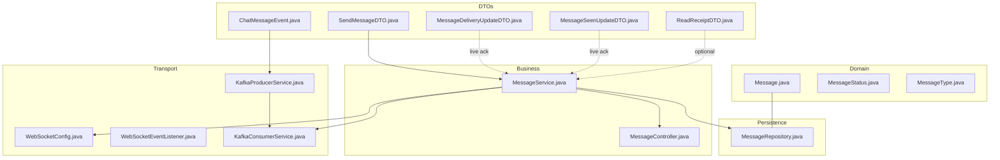
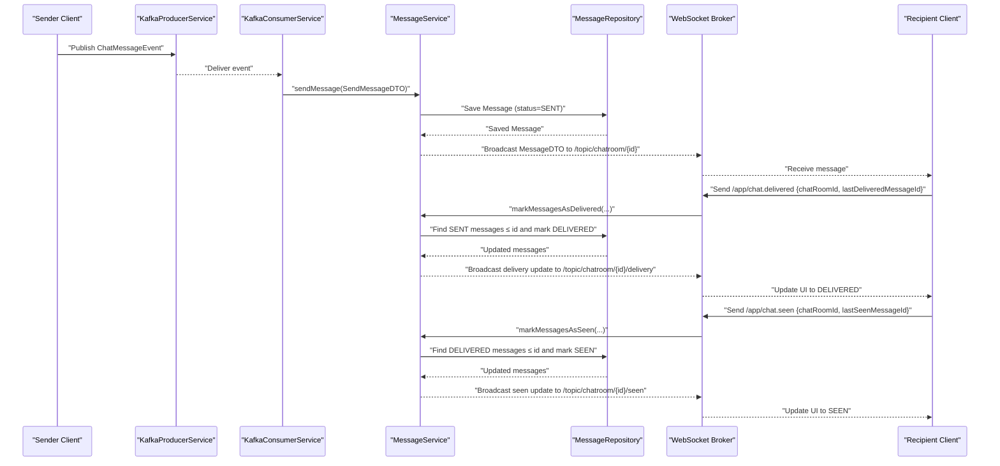
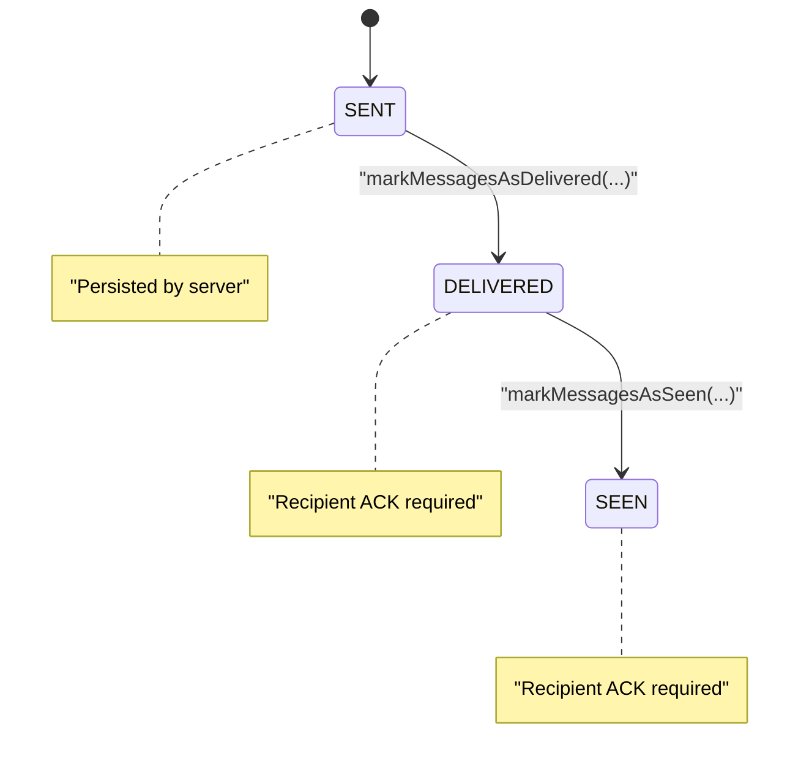
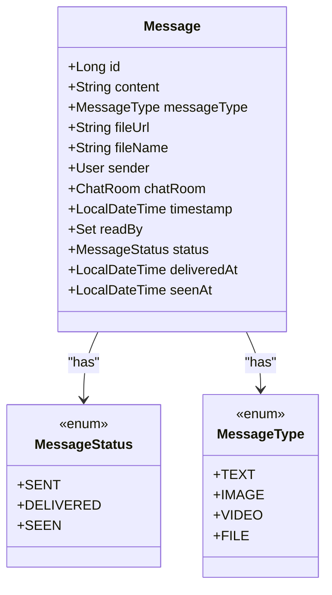
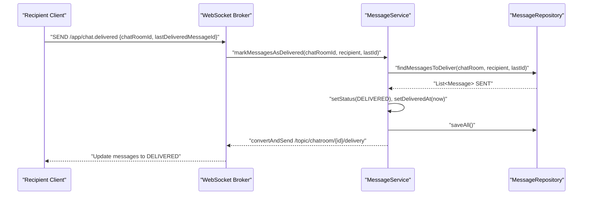
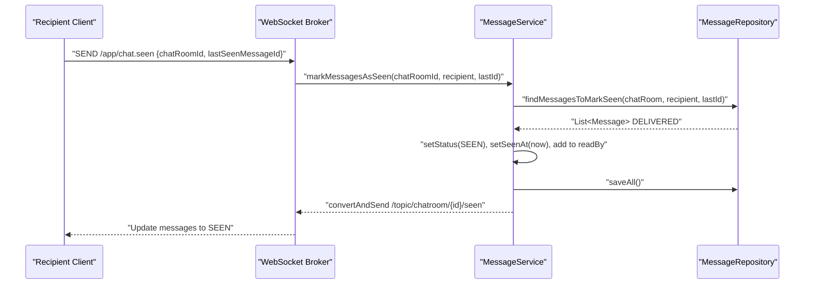
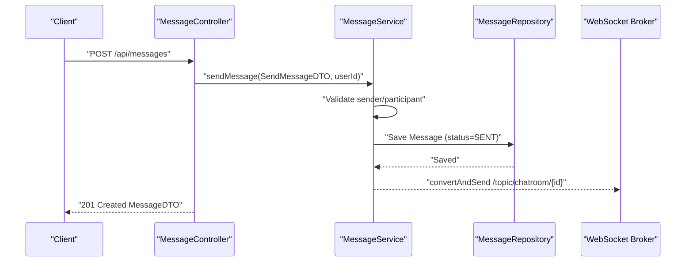
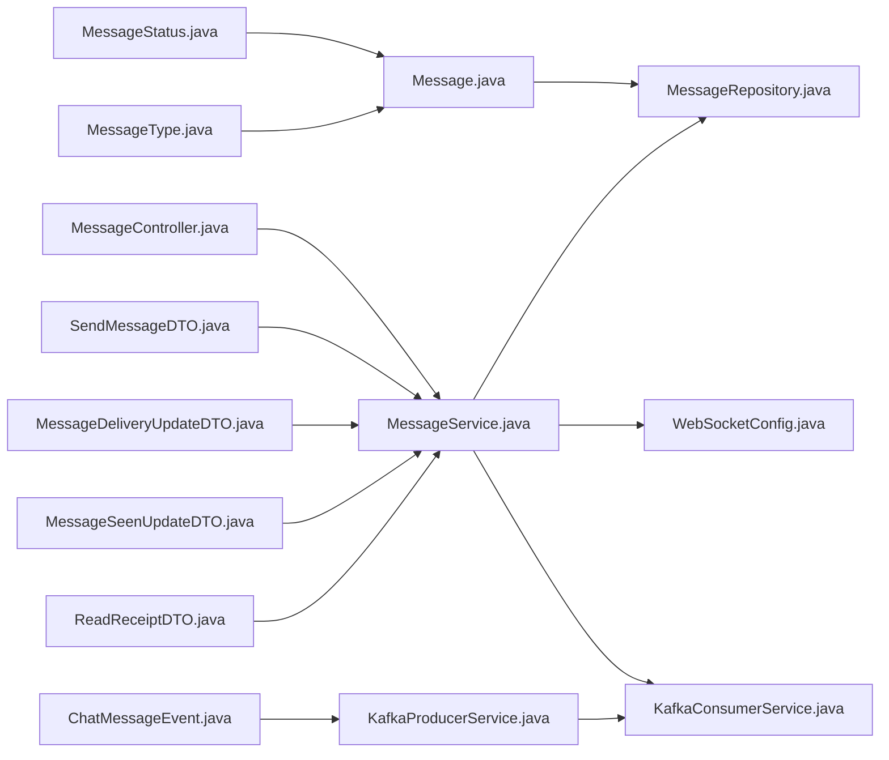

# Message State Management

<cite>
**Referenced Files in This Document**
- [MessageStatus.java](file://src/main/java/com/chatify/chat_backend/entity/enums/MessageStatus.java)
- [MessageType.java](file://src/main/java/com/chatify/chat_backend/entity/enums/MessageType.java)
- [Message.java](file://src/main/java/com/chatify/chat_backend/entity/Message.java)
- [MessageDeliveryUpdateDTO.java](file://src/main/java/com/chatify/chat_backend/dto/MessageDeliveryUpdateDTO.java)
- [MessageSeenUpdateDTO.java](file://src/main/java/com/chatify/chat_backend/dto/MessageSeenUpdateDTO.java)
- [ReadReceiptDTO.java](file://src/main/java/com/chatify/chat_backend/dto/ReadReceiptDTO.java)
- [SendMessageDTO.java](file://src/main/java/com/chatify/chat_backend/dto/SendMessageDTO.java)
- [ChatMessageEvent.java](file://src/main/java/com/chatify/chat_backend/dto/ChatMessageEvent.java)
- [MessageService.java](file://src/main/java/com/chatify/chat_backend/service/MessageService.java)
- [MessageRepository.java](file://src/main/java/com/chatify/chat_backend/repository/MessageRepository.java)
- [MessageController.java](file://src/main/java/com/chatify/chat_backend/controller/MessageController.java)
- [WebSocketConfig.java](file://src/main/java/com/chatify/chat_backend/config/WebSocketConfig.java)
- [WebSocketEventListener.java](file://src/main/java/com/chatify/chat_backend/listener/WebSocketEventListener.java)
- [KafkaProducerService.java](file://src/main/java/com/chatify/chat_backend/service/KafkaProducerService.java)
- [KafkaConsumerService.java](file://src/main/java/com/chatify/chat_backend/service/KafkaConsumerService.java)
- [MESSAGE_DELIVERY_DESIGN.md](file://MESSAGE_DELIVERY_DESIGN.md)
- [WebSocketContext.jsx](file://chatify-frontend/src/context/WebSocketContext.jsx)
- [Chat.jsx](file://chatify-frontend/src/pages/Chat.jsx)
</cite>

## Table of Contents
1. [Introduction](#introduction)
2. [Project Structure](#project-structure)
3. [Core Components](#core-components)
4. [Architecture Overview](#architecture-overview)
5. [Detailed Component Analysis](#detailed-component-analysis)
6. [Dependency Analysis](#dependency-analysis)
7. [Performance Considerations](#performance-considerations)
8. [Troubleshooting Guide](#troubleshooting-guide)
9. [Conclusion](#conclusion)
10. [Appendices](#appendices)

## Introduction
This document explains the message state management system that tracks message delivery and read receipts across a chat application. It covers the state machine with SENT, DELIVERED, and SEEN states, the enums that define message types and statuses, and the DTOs used for delivery and seen acknowledgments. It documents the end-to-end lifecycle from message creation to final read confirmation, including batched acknowledgments, offline handling, and eventual consistency. It also provides implementation guidelines for extending the system with new message types and status transitions.

## Project Structure
The message state management spans several layers:
- Domain model: Message entity and enums
- Persistence: JPA repository queries
- Business logic: MessageService orchestrates state transitions
- Transport: WebSocket for live updates and Kafka for asynchronous ingestion
- Frontend: WebSocket subscriptions and ACK triggers

**Diagram sources**
- [Message.java:1-69](file://src/main/java/com/chatify/chat_backend/entity/Message.java#L1-L69)
- [MessageStatus.java:1-8](file://src/main/java/com/chatify/chat_backend/entity/enums/MessageStatus.java#L1-L8)
- [MessageType.java:1-8](file://src/main/java/com/chatify/chat_backend/entity/enums/MessageType.java#L1-L8)
- [MessageRepository.java:1-111](file://src/main/java/com/chatify/chat_backend/repository/MessageRepository.java#L1-L111)
- [MessageService.java:1-286](file://src/main/java/com/chatify/chat_backend/service/MessageService.java#L1-L286)
- [MessageController.java:1-95](file://src/main/java/com/chatify/chat_backend/controller/MessageController.java#L1-L95)
- [WebSocketConfig.java:1-111](file://src/main/java/com/chatify/chat_backend/config/WebSocketConfig.java#L1-L111)
- [WebSocketEventListener.java:1-55](file://src/main/java/com/chatify/chat_backend/listener/WebSocketEventListener.java#L1-L55)
- [KafkaProducerService.java:1-50](file://src/main/java/com/chatify/chat_backend/service/KafkaProducerService.java#L1-L50)
- [KafkaConsumerService.java:1-72](file://src/main/java/com/chatify/chat_backend/service/KafkaConsumerService.java#L1-L72)
- [SendMessageDTO.java:1-21](file://src/main/java/com/chatify/chat_backend/dto/SendMessageDTO.java#L1-L21)
- [ChatMessageEvent.java:1-25](file://src/main/java/com/chatify/chat_backend/dto/ChatMessageEvent.java#L1-L25)
- [MessageDeliveryUpdateDTO.java:1-12](file://src/main/java/com/chatify/chat_backend/dto/MessageDeliveryUpdateDTO.java#L1-L12)
- [MessageSeenUpdateDTO.java:1-12](file://src/main/java/com/chatify/chat_backend/dto/MessageSeenUpdateDTO.java#L1-L12)
- [ReadReceiptDTO.java:1-19](file://src/main/java/com/chatify/chat_backend/dto/ReadReceiptDTO.java#L1-L19)

**Section sources**
- [Message.java:1-69](file://src/main/java/com/chatify/chat_backend/entity/Message.java#L1-L69)
- [MessageRepository.java:1-111](file://src/main/java/com/chatify/chat_backend/repository/MessageRepository.java#L1-L111)
- [MessageService.java:1-286](file://src/main/java/com/chatify/chat_backend/service/MessageService.java#L1-L286)
- [MessageController.java:1-95](file://src/main/java/com/chatify/chat_backend/controller/MessageController.java#L1-L95)
- [WebSocketConfig.java:1-111](file://src/main/java/com/chatify/chat_backend/config/WebSocketConfig.java#L1-L111)
- [KafkaProducerService.java:1-50](file://src/main/java/com/chatify/chat_backend/service/KafkaProducerService.java#L1-L50)
- [KafkaConsumerService.java:1-72](file://src/main/java/com/chatify/chat_backend/service/KafkaConsumerService.java#L1-L72)

## Core Components
- MessageStatus enum defines the three states: SENT, DELIVERED, SEEN.
- MessageType enum defines supported message categories: TEXT, IMAGE, VIDEO, FILE.
- Message entity stores content, metadata, sender, chat room, timestamps, and state fields.
- MessageRepository exposes queries to select messages eligible for delivery and seen transitions.
- MessageService implements state transitions and batched acknowledgments.
- DTOs support transport of delivery/seen updates and read receipts.

Key responsibilities:
- SENT: Created by the sender; persisted server-side.
- DELIVERED: Acknowledged by the recipient; server validates and updates.
- SEEN: Acknowledged by the recipient upon opening the chat; server validates and updates.

Validation rules:
- Transitions are unidirectional: SENT → DELIVERED → SEEN.
- Only messages sent by others to the recipient are eligible for delivery/seen updates.
- Updates are bounded by a last acknowledged message ID.

**Section sources**
- [MessageStatus.java:1-8](file://src/main/java/com/chatify/chat_backend/entity/enums/MessageStatus.java#L1-L8)
- [MessageType.java:1-8](file://src/main/java/com/chatify/chat_backend/entity/enums/MessageType.java#L1-L8)
- [Message.java:1-69](file://src/main/java/com/chatify/chat_backend/entity/Message.java#L1-L69)
- [MessageRepository.java:36-59](file://src/main/java/com/chatify/chat_backend/repository/MessageRepository.java#L36-L59)
- [MessageService.java:194-269](file://src/main/java/com/chatify/chat_backend/service/MessageService.java#L194-L269)

## Architecture Overview
The system enforces a single source of truth: the server. Clients send acknowledgments; the server validates and persists state changes. Live updates are pushed via WebSocket topics for delivery and seen events. Asynchronous ingestion uses Kafka to decouple producers from consumers.

**Diagram sources**
- [KafkaProducerService.java:1-50](file://src/main/java/com/chatify/chat_backend/service/KafkaProducerService.java#L1-L50)
- [KafkaConsumerService.java:1-72](file://src/main/java/com/chatify/chat_backend/service/KafkaConsumerService.java#L1-L72)
- [MessageService.java:50-78](file://src/main/java/com/chatify/chat_backend/service/MessageService.java#L50-L78)
- [MessageService.java:194-228](file://src/main/java/com/chatify/chat_backend/service/MessageService.java#L194-L228)
- [MessageService.java:230-269](file://src/main/java/com/chatify/chat_backend/service/MessageService.java#L230-L269)
- [MessageRepository.java:36-59](file://src/main/java/com/chatify/chat_backend/repository/MessageRepository.java#L36-L59)
- [WebSocketConfig.java:50-57](file://src/main/java/com/chatify/chat_backend/config/WebSocketConfig.java#L50-L57)
- [ChatMessageEvent.java:1-25](file://src/main/java/com/chatify/chat_backend/dto/ChatMessageEvent.java#L1-L25)
- [SendMessageDTO.java:1-21](file://src/main/java/com/chatify/chat_backend/dto/SendMessageDTO.java#L1-L21)

## Detailed Component Analysis

### State Machine and Transitions
The state machine is strict and unidirectional:
- SENT: Initial state after successful persistence.
- DELIVERED: Applied when the recipient acknowledges receipt.
- SEEN: Applied when the recipient acknowledges viewing (typically upon opening the chat).

Validation rules enforced by the server:
- Only messages sent by another user to the current recipient are eligible for updates.
- Updates are bounded by a last acknowledged message ID.
- Delivery and seen queries differ to prevent skipping states.

**Diagram sources**
- [MessageStatus.java:1-8](file://src/main/java/com/chatify/chat_backend/entity/enums/MessageStatus.java#L1-L8)
- [MessageRepository.java:36-59](file://src/main/java/com/chatify/chat_backend/repository/MessageRepository.java#L36-L59)
- [MessageService.java:194-269](file://src/main/java/com/chatify/chat_backend/service/MessageService.java#L194-L269)

**Section sources**
- [MESSAGE_DELIVERY_DESIGN.md:29-50](file://MESSAGE_DELIVERY_DESIGN.md#L29-L50)
- [MessageRepository.java:36-59](file://src/main/java/com/chatify/chat_backend/repository/MessageRepository.java#L36-L59)
- [MessageService.java:194-269](file://src/main/java/com/chatify/chat_backend/service/MessageService.java#L194-L269)

### Message Entity and Timestamps
The Message entity captures:
- Content and type (TEXT, IMAGE, VIDEO, FILE)
- Sender and chat room
- Status (SENT, DELIVERED, SEEN)
- Timestamps for delivery and seen
- A many-to-many relationship indicating who has read the message

**Diagram sources**
- [Message.java:1-69](file://src/main/java/com/chatify/chat_backend/entity/Message.java#L1-L69)
- [MessageStatus.java:1-8](file://src/main/java/com/chatify/chat_backend/entity/enums/MessageStatus.java#L1-L8)
- [MessageType.java:1-8](file://src/main/java/com/chatify/chat_backend/entity/enums/MessageType.java#L1-L8)

**Section sources**
- [Message.java:1-69](file://src/main/java/com/chatify/chat_backend/entity/Message.java#L1-L69)

### Delivery Acknowledgment Mechanism
Delivery acknowledgment is batched:
- Client sends a delivery ACK with the chat room ID and the last delivered message ID.
- Server finds all SENT messages up to that ID for the recipient and marks them DELIVERED.
- Server persists and notifies clients via a WebSocket topic.

**Diagram sources**
- [MessageService.java:194-228](file://src/main/java/com/chatify/chat_backend/service/MessageService.java#L194-L228)
- [MessageRepository.java:36-46](file://src/main/java/com/chatify/chat_backend/repository/MessageRepository.java#L36-L46)
- [MessageDeliveryUpdateDTO.java:1-12](file://src/main/java/com/chatify/chat_backend/dto/MessageDeliveryUpdateDTO.java#L1-L12)
- [WebSocketConfig.java:50-57](file://src/main/java/com/chatify/chat_backend/config/WebSocketConfig.java#L50-L57)

**Section sources**
- [MessageService.java:194-228](file://src/main/java/com/chatify/chat_backend/service/MessageService.java#L194-L228)
- [MessageRepository.java:36-46](file://src/main/java/com/chatify/chat_backend/repository/MessageRepository.java#L36-L46)
- [MessageDeliveryUpdateDTO.java:1-12](file://src/main/java/com/chatify/chat_backend/dto/MessageDeliveryUpdateDTO.java#L1-L12)
- [MESSAGE_DELIVERY_DESIGN.md:80-101](file://MESSAGE_DELIVERY_DESIGN.md#L80-L101)

### Read Receipt Tracking
Read receipts are tracked via seen acknowledgments:
- Client sends a seen ACK with the chat room ID and the last seen message ID.
- Server finds all DELIVERED messages up to that ID and marks them SEEN.
- Server persists and notifies clients via a WebSocket topic.

**Diagram sources**
- [MessageService.java:230-269](file://src/main/java/com/chatify/chat_backend/service/MessageService.java#L230-L269)
- [MessageRepository.java:48-59](file://src/main/java/com/chatify/chat_backend/repository/MessageRepository.java#L48-L59)
- [MessageSeenUpdateDTO.java:1-12](file://src/main/java/com/chatify/chat_backend/dto/MessageSeenUpdateDTO.java#L1-L12)
- [WebSocketConfig.java:50-57](file://src/main/java/com/chatify/chat_backend/config/WebSocketConfig.java#L50-L57)

**Section sources**
- [MessageService.java:230-269](file://src/main/java/com/chatify/chat_backend/service/MessageService.java#L230-L269)
- [MessageRepository.java:48-59](file://src/main/java/com/chatify/chat_backend/repository/MessageRepository.java#L48-L59)
- [MessageSeenUpdateDTO.java:1-12](file://src/main/java/com/chatify/chat_backend/dto/MessageSeenUpdateDTO.java#L1-L12)
- [MESSAGE_DELIVERY_DESIGN.md:104-125](file://MESSAGE_DELIVERY_DESIGN.md#L104-L125)

### Frontend Integration and Examples
The frontend subscribes to delivery and seen topics and sends ACKs when appropriate:
- Subscribes to /topic/chatroom/{id}/delivery and /topic/chatroom/{id}/seen.
- Sends /app/chat.delivered when receiving messages.
- Sends /app/chat.seen when opening a chat and when messages become visible.

Concrete example paths:
- Subscription setup and ACK sending: [WebSocketContext.jsx:138-174](file://chatify-frontend/src/context/WebSocketContext.jsx#L138-L174)
- Delivery update handling and UI state updates: [Chat.jsx:230-244](file://chatify-frontend/src/pages/Chat.jsx#L230-L244)
- Sending delivery ACK when messages arrive: [Chat.jsx:211-228](file://chatify-frontend/src/pages/Chat.jsx#L211-L228)

**Section sources**
- [WebSocketContext.jsx:138-174](file://chatify-frontend/src/context/WebSocketContext.jsx#L138-L174)
- [Chat.jsx:208-244](file://chatify-frontend/src/pages/Chat.jsx#L208-L244)

### Message Creation and Initial State
Message creation is handled by the controller and service:
- Controller validates the authenticated user and delegates to MessageService.
- Service persists the message with status SENT and broadcasts it to the chat room.
- Kafka consumer can also persist messages from events and broadcast them.

**Diagram sources**
- [MessageController.java:32-44](file://src/main/java/com/chatify/chat_backend/controller/MessageController.java#L32-L44)
- [MessageService.java:50-78](file://src/main/java/com/chatify/chat_backend/service/MessageService.java#L50-L78)
- [MessageRepository.java:1-111](file://src/main/java/com/chatify/chat_backend/repository/MessageRepository.java#L1-L111)
- [WebSocketConfig.java:50-57](file://src/main/java/com/chatify/chat_backend/config/WebSocketConfig.java#L50-L57)

**Section sources**
- [MessageController.java:32-44](file://src/main/java/com/chatify/chat_backend/controller/MessageController.java#L32-L44)
- [MessageService.java:50-78](file://src/main/java/com/chatify/chat_backend/service/MessageService.java#L50-L78)
- [SendMessageDTO.java:1-21](file://src/main/java/com/chatify/chat_backend/dto/SendMessageDTO.java#L1-L21)

### Edge Cases and Business Logic
- Offline users: No ACK received keeps messages SENT; on reconnect, clients re-ACK and server updates state.
- Server crashes after save: Messages remain SENT; delivery proceeds on reconnect.
- Duplicate ACKs: Idempotent; only allowed transitions occur.
- Sender self-read: The seen logic excludes sender’s own messages from state updates.
- Batched ACKs: Updates apply to all messages up to the provided ID.

**Section sources**
- [MESSAGE_DELIVERY_DESIGN.md:142-157](file://MESSAGE_DELIVERY_DESIGN.md#L142-L157)
- [MessageService.java:132-179](file://src/main/java/com/chatify/chat_backend/service/MessageService.java#L132-L179)
- [MessageRepository.java:26-29](file://src/main/java/com/chatify/chat_backend/repository/MessageRepository.java#L26-L29)

### State Consistency and Eventual Consistency
- Single source of truth: Server validates and persists state.
- Live updates: WebSocket topics deliver batched updates to clients.
- Asynchronous ingestion: Kafka decouples producers from consumers, ensuring scalability.
- Ordering: Kafka keys by chat room ID to preserve per-room ordering.

**Section sources**
- [WebSocketConfig.java:50-57](file://src/main/java/com/chatify/chat_backend/config/WebSocketConfig.java#L50-L57)
- [KafkaProducerService.java:27-37](file://src/main/java/com/chatify/chat_backend/service/KafkaProducerService.java#L27-L37)
- [KafkaConsumerService.java:26-59](file://src/main/java/com/chatify/chat_backend/service/KafkaConsumerService.java#L26-L59)

## Dependency Analysis
The following diagram shows key dependencies among components involved in message state management.

**Diagram sources**
- [MessageController.java:1-95](file://src/main/java/com/chatify/chat_backend/controller/MessageController.java#L1-L95)
- [MessageService.java:1-286](file://src/main/java/com/chatify/chat_backend/service/MessageService.java#L1-L286)
- [MessageRepository.java:1-111](file://src/main/java/com/chatify/chat_backend/repository/MessageRepository.java#L1-L111)
- [WebSocketConfig.java:1-111](file://src/main/java/com/chatify/chat_backend/config/WebSocketConfig.java#L1-L111)
- [KafkaProducerService.java:1-50](file://src/main/java/com/chatify/chat_backend/service/KafkaProducerService.java#L1-L50)
- [KafkaConsumerService.java:1-72](file://src/main/java/com/chatify/chat_backend/service/KafkaConsumerService.java#L1-L72)
- [SendMessageDTO.java:1-21](file://src/main/java/com/chatify/chat_backend/dto/SendMessageDTO.java#L1-L21)
- [ChatMessageEvent.java:1-25](file://src/main/java/com/chatify/chat_backend/dto/ChatMessageEvent.java#L1-L25)
- [MessageDeliveryUpdateDTO.java:1-12](file://src/main/java/com/chatify/chat_backend/dto/MessageDeliveryUpdateDTO.java#L1-L12)
- [MessageSeenUpdateDTO.java:1-12](file://src/main/java/com/chatify/chat_backend/dto/MessageSeenUpdateDTO.java#L1-L12)
- [ReadReceiptDTO.java:1-19](file://src/main/java/com/chatify/chat_backend/dto/ReadReceiptDTO.java#L1-L19)
- [Message.java:1-69](file://src/main/java/com/chatify/chat_backend/entity/Message.java#L1-L69)
- [MessageStatus.java:1-8](file://src/main/java/com/chatify/chat_backend/entity/enums/MessageStatus.java#L1-L8)
- [MessageType.java:1-8](file://src/main/java/com/chatify/chat_backend/entity/enums/MessageType.java#L1-L8)

**Section sources**
- [MessageController.java:1-95](file://src/main/java/com/chatify/chat_backend/controller/MessageController.java#L1-L95)
- [MessageService.java:1-286](file://src/main/java/com/chatify/chat_backend/service/MessageService.java#L1-L286)
- [MessageRepository.java:1-111](file://src/main/java/com/chatify/chat_backend/repository/MessageRepository.java#L1-L111)

## Performance Considerations
- Batched ACKs reduce network overhead and database writes.
- Queries filter by status and ID bounds to limit scanned rows.
- Kafka partitions messages by chat room ID to preserve order and improve throughput.
- WebSocket heartbeats maintain connection health and enable timely state updates.

[No sources needed since this section provides general guidance]

## Troubleshooting Guide
Common issues and remedies:
- Unauthorized access: Ensure participants belong to the chat room before state updates.
- Missing ACKs: Messages remain SENT; clients should resend ACKs on reconnect.
- Duplicate ACKs: Idempotent; server ignores invalid transitions.
- Read receipts not updating: Verify seen ACKs are sent when chat becomes active.

**Section sources**
- [MessageService.java:194-269](file://src/main/java/com/chatify/chat_backend/service/MessageService.java#L194-L269)
- [MessageRepository.java:36-59](file://src/main/java/com/chatify/chat_backend/repository/MessageRepository.java#L36-L59)
- [MESSAGE_DELIVERY_DESIGN.md:142-157](file://MESSAGE_DELIVERY_DESIGN.md#L142-L157)

## Conclusion
The message state management system enforces correctness and eventual consistency by treating the server as the single source of truth. Clients send acknowledgments; the server validates and persists state changes. Delivery and seen updates are batched and propagated via WebSocket topics. Asynchronous ingestion via Kafka ensures scalability. The design accommodates offline scenarios and duplicates while maintaining clear, unidirectional state transitions.

[No sources needed since this section summarizes without analyzing specific files]

## Appendices

### Enum Definitions
- MessageStatus: SENT, DELIVERED, SEEN
- MessageType: TEXT, IMAGE, VIDEO, FILE

**Section sources**
- [MessageStatus.java:1-8](file://src/main/java/com/chatify/chat_backend/entity/enums/MessageStatus.java#L1-L8)
- [MessageType.java:1-8](file://src/main/java/com/chatify/chat_backend/entity/enums/MessageType.java#L1-L8)

### DTO Reference
- MessageDeliveryUpdateDTO: chatRoomId, lastDeliveredMessageId
- MessageSeenUpdateDTO: chatRoomId, lastSeenMessageId
- ReadReceiptDTO: messageId, userId, username, chatRoomId, readAt
- SendMessageDTO: chatRoomId, content, messageType, fileUrl, fileName
- ChatMessageEvent: chatRoomId, senderId, content, messageType, fileUrl, fileName

**Section sources**
- [MessageDeliveryUpdateDTO.java:1-12](file://src/main/java/com/chatify/chat_backend/dto/MessageDeliveryUpdateDTO.java#L1-L12)
- [MessageSeenUpdateDTO.java:1-12](file://src/main/java/com/chatify/chat_backend/dto/MessageSeenUpdateDTO.java#L1-L12)
- [ReadReceiptDTO.java:1-19](file://src/main/java/com/chatify/chat_backend/dto/ReadReceiptDTO.java#L1-L19)
- [SendMessageDTO.java:1-21](file://src/main/java/com/chatify/chat_backend/dto/SendMessageDTO.java#L1-L21)
- [ChatMessageEvent.java:1-25](file://src/main/java/com/chatify/chat_backend/dto/ChatMessageEvent.java#L1-L25)

### Implementation Guidelines for Extensions
- Adding a new message type:
  - Extend MessageType enum.
  - Update validation in message creation to accept the new type.
  - Ensure consumers handle the new type consistently.
- Adding a new state:
  - Define a new MessageStatus value.
  - Add a new repository query method to select messages eligible for the new state.
  - Implement a new service method to validate and apply the transition.
  - Add a new DTO and WebSocket topic for client-server synchronization if needed.
  - Update frontend subscriptions and ACK logic to handle the new state.

**Section sources**
- [MessageType.java:1-8](file://src/main/java/com/chatify/chat_backend/entity/enums/MessageType.java#L1-L8)
- [MessageStatus.java:1-8](file://src/main/java/com/chatify/chat_backend/entity/enums/MessageStatus.java#L1-L8)
- [MessageRepository.java:1-111](file://src/main/java/com/chatify/chat_backend/repository/MessageRepository.java#L1-L111)
- [MessageService.java:1-286](file://src/main/java/com/chatify/chat_backend/service/MessageService.java#L1-L286)