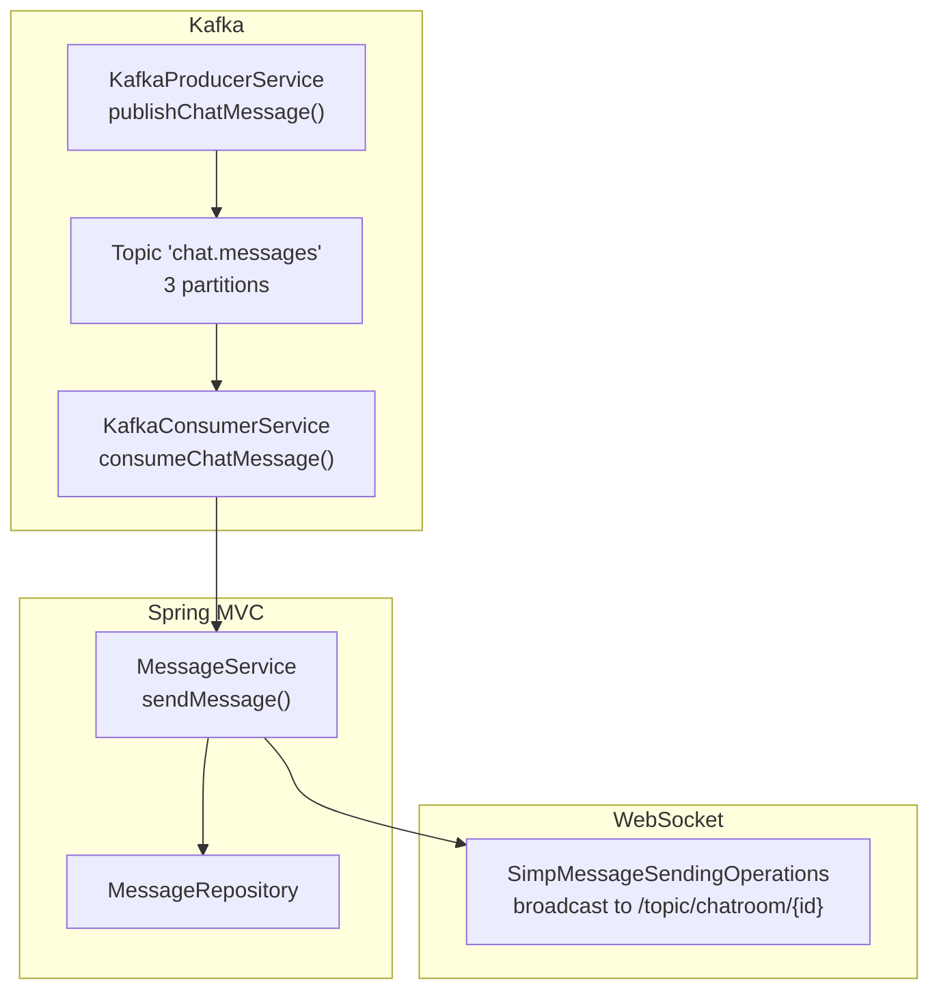
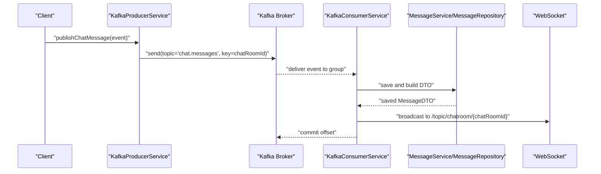
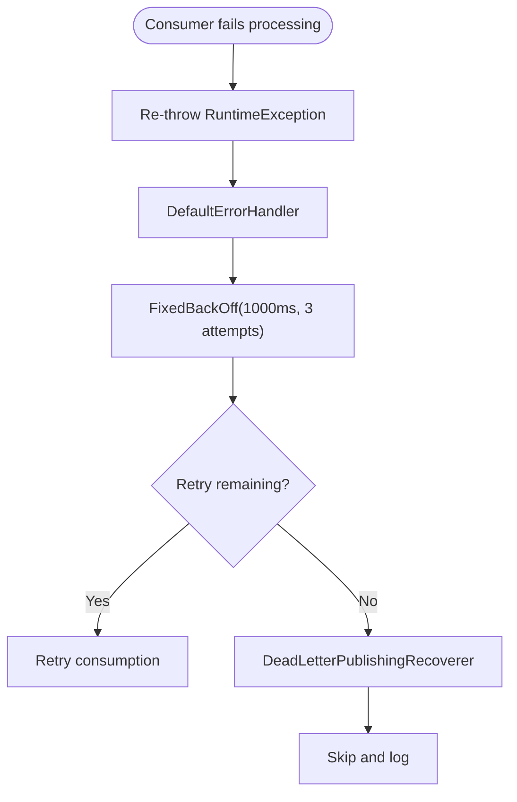
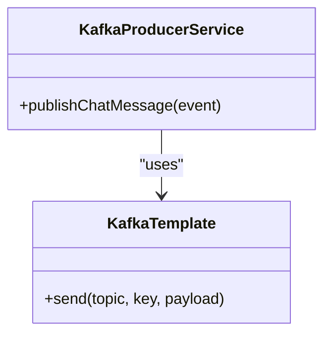
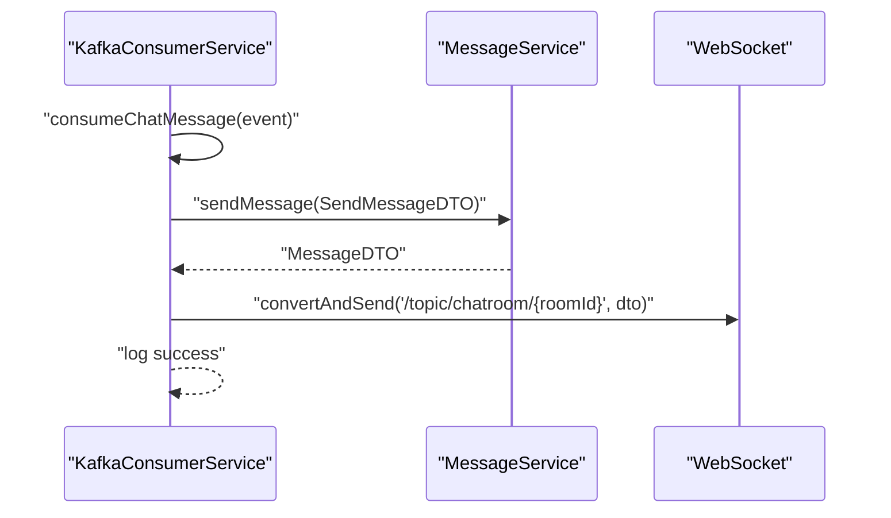
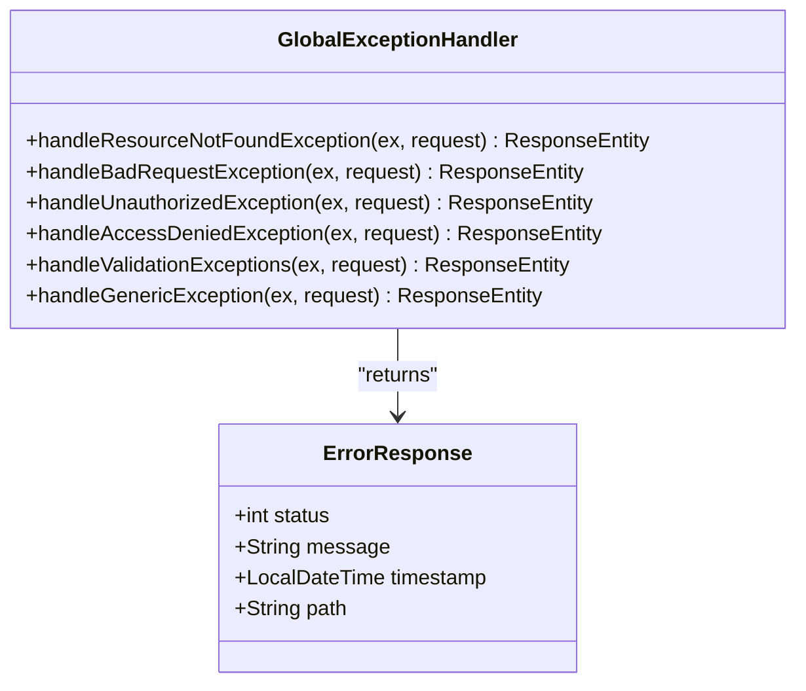
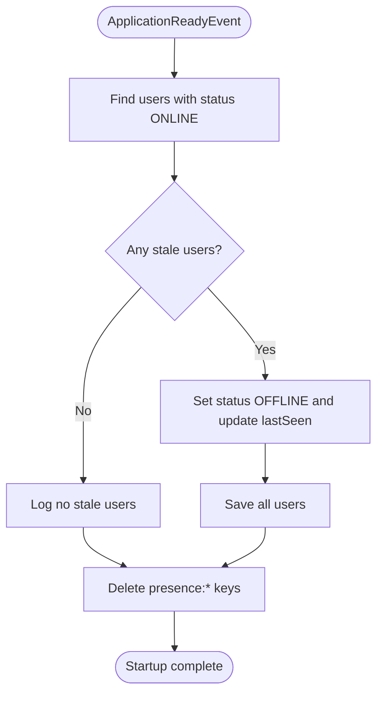
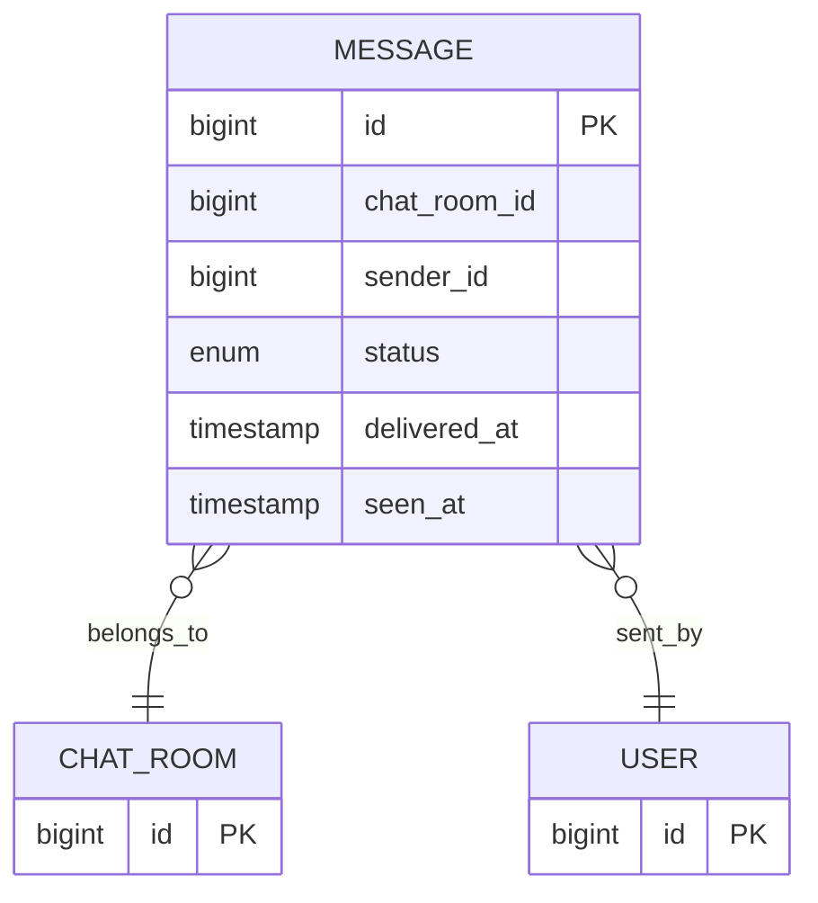
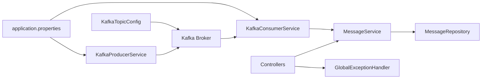

# System Reliability and Error Handling

<cite>
**Referenced Files in This Document**
- [KafkaErrorHandlerConfig.java](file://src/main/java/com/chatify/chat_backend/config/KafkaErrorHandlerConfig.java)
- [KafkaTopicConfig.java](file://src/main/java/com/chatify/chat_backend/config/KafkaTopicConfig.java)
- [ApplicationStartupListener.java](file://src/main/java/com/chatify/chat_backend/listener/ApplicationStartupListener.java)
- [GlobalExceptionHandler.java](file://src/main/java/com/chatify/chat_backend/exception/GlobalExceptionHandler.java)
- [ErrorResponse.java](file://src/main/java/com/chatify/chat_backend/exception/ErrorResponse.java)
- [KafkaConsumerService.java](file://src/main/java/com/chatify/chat_backend/service/KafkaConsumerService.java)
- [KafkaProducerService.java](file://src/main/java/com/chatify/chat_backend/service/KafkaProducerService.java)
- [MessageService.java](file://src/main/java/com/chatify/chat_backend/service/MessageService.java)
- [MessageRepository.java](file://src/main/java/com/chatify/chat_backend/repository/MessageRepository.java)
- [application.properties](file://src/main/resources/application.properties)
- [ChatMessageEvent.java](file://src/main/java/com/chatify/chat_backend/dto/ChatMessageEvent.java)
- [MessageStatus.java](file://src/main/java/com/chatify/chat_backend/entity/enums/MessageStatus.java)
- [BadRequestException.java](file://src/main/java/com/chatify/chat_backend/exception/BadRequestException.java)
- [ResourceNotFoundException.java](file://src/main/java/com/chatify/chat_backend/exception/ResourceNotFoundException.java)
- [UnauthorizedException.java](file://src/main/java/com/chatify/chat_backend/exception/UnauthorizedException.java)
</cite>

## Table of Contents
1. [Introduction](#introduction)
2. [Project Structure](#project-structure)
3. [Core Components](#core-components)
4. [Architecture Overview](#architecture-overview)
5. [Detailed Component Analysis](#detailed-component-analysis)
6. [Dependency Analysis](#dependency-analysis)
7. [Performance Considerations](#performance-considerations)
8. [Troubleshooting Guide](#troubleshooting-guide)
9. [Conclusion](#conclusion)
10. [Appendices](#appendices)

## Introduction
This document explains the reliability and error handling mechanisms in the message delivery system. It covers Kafka error handling and retry configuration, system initialization and health checks, global error responses, message deduplication and idempotency, eventual consistency patterns, retry policies and dead letter queue behavior, monitoring and alerting strategies, graceful degradation, troubleshooting, and observability patterns.

## Project Structure
The message delivery pipeline integrates Spring Kafka producers and consumers with Spring MVC controllers and WebSocket broadcasting. Reliability is achieved through:
- Kafka producer idempotence and retries
- Consumer error handler with fixed backoff and dead-letter publishing
- Global exception handling for consistent HTTP error responses
- Application startup listener for presence cleanup and readiness checks
- Idempotent processing via message keys and database constraints
- Eventual consistency via message status updates and background reconciliation

**Diagram sources**
- [KafkaProducerService.java:32-50](file://src/main/java/com/chatify/chat_backend/service/KafkaProducerService.java#L32-L50)
- [KafkaConsumerService.java:34-72](file://src/main/java/com/chatify/chat_backend/service/KafkaConsumerService.java#L34-L72)
- [MessageService.java:50-78](file://src/main/java/com/chatify/chat_backend/service/MessageService.java#L50-L78)
- [MessageRepository.java:17-111](file://src/main/java/com/chatify/chat_backend/repository/MessageRepository.java#L17-L111)

**Section sources**
- [KafkaProducerService.java:1-50](file://src/main/java/com/chatify/chat_backend/service/KafkaProducerService.java#L1-L50)
- [KafkaConsumerService.java:1-72](file://src/main/java/com/chatify/chat_backend/service/KafkaConsumerService.java#L1-L72)
- [MessageService.java:1-286](file://src/main/java/com/chatify/chat_backend/service/MessageService.java#L1-L286)
- [MessageRepository.java:1-111](file://src/main/java/com/chatify/chat_backend/repository/MessageRepository.java#L1-L111)
- [application.properties:54-75](file://src/main/resources/application.properties#L54-L75)

## Core Components
- Kafka error handler with fixed backoff and dead-letter publishing
- Kafka producer with idempotence and retries
- Kafka consumer with group-based processing and error propagation
- Global exception handler for consistent HTTP error responses
- Application startup listener for presence cleanup and readiness
- Message service implementing idempotent persistence and eventual consistency

**Section sources**
- [KafkaErrorHandlerConfig.java:10-19](file://src/main/java/com/chatify/chat_backend/config/KafkaErrorHandlerConfig.java#L10-L19)
- [application.properties:57-72](file://src/main/resources/application.properties#L57-L72)
- [KafkaConsumerService.java:34-72](file://src/main/java/com/chatify/chat_backend/service/KafkaConsumerService.java#L34-L72)
- [GlobalExceptionHandler.java:17-112](file://src/main/java/com/chatify/chat_backend/exception/GlobalExceptionHandler.java#L17-L112)
- [ApplicationStartupListener.java:18-67](file://src/main/java/com/chatify/chat_backend/listener/ApplicationStartupListener.java#L18-L67)
- [MessageService.java:50-78](file://src/main/java/com/chatify/chat_backend/service/MessageService.java#L50-L78)

## Architecture Overview
The system publishes ChatMessageEvent to Kafka with chatRoomId as the key to preserve per-room ordering. Consumers process events, persist messages, and broadcast via WebSocket. Errors are retried with bounded backoff; after retries are exhausted, messages are sent to a dead letter topic for manual inspection.

**Diagram sources**
- [KafkaProducerService.java:32-50](file://src/main/java/com/chatify/chat_backend/service/KafkaProducerService.java#L32-L50)
- [KafkaConsumerService.java:34-72](file://src/main/java/com/chatify/chat_backend/service/KafkaConsumerService.java#L34-L72)
- [MessageService.java:50-78](file://src/main/java/com/chatify/chat_backend/service/MessageService.java#L50-L78)
- [application.properties:54-75](file://src/main/resources/application.properties#L54-L75)

## Detailed Component Analysis

### Kafka Error Handler and Retry Mechanisms
- Error handler configured with a fixed backoff and a dead-letter publishing recoverer.
- Retry attempts are limited by the backoff configuration; after retries are exhausted, the message is sent to a dead letter topic.
- Consumers re-throw exceptions to trigger the error handler and avoid committing offsets on failure.

**Diagram sources**
- [KafkaErrorHandlerConfig.java:14-18](file://src/main/java/com/chatify/chat_backend/config/KafkaErrorHandlerConfig.java#L14-L18)
- [KafkaConsumerService.java:64-70](file://src/main/java/com/chatify/chat_backend/service/KafkaConsumerService.java#L64-L70)

**Section sources**
- [KafkaErrorHandlerConfig.java:10-19](file://src/main/java/com/chatify/chat_backend/config/KafkaErrorHandlerConfig.java#L10-L19)
- [KafkaConsumerService.java:34-72](file://src/main/java/com/chatify/chat_backend/service/KafkaConsumerService.java#L34-L72)

### Producer Idempotence and Retries
- Producer enables idempotence and retries with acks=all to ensure reliable delivery.
- Messages are keyed by chatRoomId to preserve ordering within rooms.

**Diagram sources**
- [KafkaProducerService.java:14-50](file://src/main/java/com/chatify/chat_backend/service/KafkaProducerService.java#L14-L50)
- [application.properties:57-62](file://src/main/resources/application.properties#L57-L62)

**Section sources**
- [KafkaProducerService.java:27-50](file://src/main/java/com/chatify/chat_backend/service/KafkaProducerService.java#L27-L50)
- [application.properties:57-62](file://src/main/resources/application.properties#L57-L62)

### Consumer Processing and Broadcasting
- Consumer listens to the configured topic and group, persists the message, and broadcasts via WebSocket.
- Exceptions are logged and rethrown to activate the error handler.

**Diagram sources**
- [KafkaConsumerService.java:34-72](file://src/main/java/com/chatify/chat_backend/service/KafkaConsumerService.java#L34-L72)
- [MessageService.java:50-78](file://src/main/java/com/chatify/chat_backend/service/MessageService.java#L50-L78)

**Section sources**
- [KafkaConsumerService.java:26-72](file://src/main/java/com/chatify/chat_backend/service/KafkaConsumerService.java#L26-L72)
- [MessageService.java:50-78](file://src/main/java/com/chatify/chat_backend/service/MessageService.java#L50-L78)

### GlobalExceptionHandler Configuration
- Centralized exception handling for REST endpoints with consistent error payloads.
- Handles domain-specific exceptions and validation errors, returning appropriate HTTP status codes.

**Diagram sources**
- [GlobalExceptionHandler.java:17-112](file://src/main/java/com/chatify/chat_backend/exception/GlobalExceptionHandler.java#L17-L112)
- [ErrorResponse.java:9-18](file://src/main/java/com/chatify/chat_backend/exception/ErrorResponse.java#L9-L18)

**Section sources**
- [GlobalExceptionHandler.java:17-112](file://src/main/java/com/chatify/chat_backend/exception/GlobalExceptionHandler.java#L17-L112)
- [ErrorResponse.java:1-18](file://src/main/java/com/chatify/chat_backend/exception/ErrorResponse.java#L1-L18)
- [BadRequestException.java:1-8](file://src/main/java/com/chatify/chat_backend/exception/BadRequestException.java#L1-L8)
- [ResourceNotFoundException.java:1-16](file://src/main/java/com/chatify/chat_backend/exception/ResourceNotFoundException.java#L1-L16)
- [UnauthorizedException.java:1-8](file://src/main/java/com/chatify/chat_backend/exception/UnauthorizedException.java#L1-L8)

### ApplicationStartupListener Initialization and Health Checks
- Resets stale online users and clears presence keys on startup to ensure accurate presence state.
- Runs after the application context is ready, ensuring repositories and Redis are available.

**Diagram sources**
- [ApplicationStartupListener.java:34-67](file://src/main/java/com/chatify/chat_backend/listener/ApplicationStartupListener.java#L34-L67)

**Section sources**
- [ApplicationStartupListener.java:18-67](file://src/main/java/com/chatify/chat_backend/listener/ApplicationStartupListener.java#L18-L67)

### Message Deduplication, Idempotent Processing, and Eventual Consistency
- Producer idempotence prevents duplicate deliveries at the broker level.
- Consumer re-throws exceptions to leverage retries; after retries, dead-lettering prevents duplicate processing loops.
- Database constraints and status transitions enforce idempotent state updates.
- Eventual consistency is achieved via message status updates (SENT, DELIVERED, SEEN) and background reconciliation queries.

**Diagram sources**
- [MessageRepository.java:18-111](file://src/main/java/com/chatify/chat_backend/repository/MessageRepository.java#L18-L111)
- [MessageStatus.java:3-8](file://src/main/java/com/chatify/chat_backend/entity/enums/MessageStatus.java#L3-L8)

**Section sources**
- [application.properties:60-62](file://src/main/resources/application.properties#L60-L62)
- [MessageRepository.java:36-59](file://src/main/java/com/chatify/chat_backend/repository/MessageRepository.java#L36-L59)
- [MessageStatus.java:1-8](file://src/main/java/com/chatify/chat_backend/entity/enums/MessageStatus.java#L1-L8)

### Dead Letter Queue Behavior
- After retries are exhausted, the error handler publishes the failed record to a dead letter topic for offline inspection and remediation.
- This pattern prevents poison pills from blocking the consumer group indefinitely.

**Section sources**
- [KafkaErrorHandlerConfig.java:14-18](file://src/main/java/com/chatify/chat_backend/config/KafkaErrorHandlerConfig.java#L14-L18)
- [KafkaConsumerService.java:64-70](file://src/main/java/com/chatify/chat_backend/service/KafkaConsumerService.java#L64-L70)

### Circuit Breaker Patterns
- Not implemented in the current codebase. Consider integrating a resilience library (e.g., Resilience4j) around downstream calls to prevent cascading failures during outages.

[No sources needed since this section provides general guidance]

## Dependency Analysis
- Kafka configuration defines producer and consumer properties, topic partitions, and JSON serialization trusted packages.
- Kafka topic configuration sets the number of partitions for throughput and scalability.
- MessageService depends on repositories and enforces business rules and idempotent state transitions.
- GlobalExceptionHandler centralizes error responses for REST controllers.

**Diagram sources**
- [application.properties:54-75](file://src/main/resources/application.properties#L54-L75)
- [KafkaTopicConfig.java:10-23](file://src/main/java/com/chatify/chat_backend/config/KafkaTopicConfig.java#L10-L23)
- [KafkaConsumerService.java:12-24](file://src/main/java/com/chatify/chat_backend/service/KafkaConsumerService.java#L12-L24)
- [MessageService.java:29-48](file://src/main/java/com/chatify/chat_backend/service/MessageService.java#L29-L48)
- [GlobalExceptionHandler.java:17-112](file://src/main/java/com/chatify/chat_backend/exception/GlobalExceptionHandler.java#L17-L112)

**Section sources**
- [application.properties:54-75](file://src/main/resources/application.properties#L54-L75)
- [KafkaTopicConfig.java:10-23](file://src/main/java/com/chatify/chat_backend/config/KafkaTopicConfig.java#L10-L23)
- [MessageService.java:29-48](file://src/main/java/com/chatify/chat_backend/service/MessageService.java#L29-L48)

## Performance Considerations
- Partition sizing: The topic is configured with three partitions to improve throughput; ensure workload distribution aligns with partition count.
- Idempotence and retries: Producer idempotence reduces duplicate processing; tune retries and backoff to balance latency and durability.
- Consumer lag: Monitor consumer lag and adjust concurrency and batch sizes to maintain low latency.
- Database writes: Batch operations and transaction boundaries minimize contention; avoid heavy work inside transactional methods.

[No sources needed since this section provides general guidance]

## Troubleshooting Guide
Common reliability issues and resolutions:
- Message ordering violations
  - Verify producer key is chatRoomId and partitions are sufficient for expected concurrency.
  - Check consumer group configuration and rebalancing frequency.
  - Ensure no out-of-order delivery due to network or broker issues.

- Consumer rebalancing
  - Monitor rebalance events and reduce long-running operations inside @KafkaListener.
  - Increase session.timeout.ms and heartbeat.interval.ms if necessary.
  - Avoid unnecessary deserialization overhead.

- System overload conditions
  - Scale consumers horizontally and increase partitions.
  - Apply rate limiting at ingress and backpressure in producers.
  - Investigate slow database queries and optimize repository queries.

- Dead letter queue backlog
  - Inspect dead letter topic records and fix root causes (schema changes, invalid payloads, or transient failures).
  - Re-inject records after fixes or manually remediate.

- Duplicate messages
  - Confirm producer idempotence is enabled.
  - Avoid manual offset commits; rely on automatic commits controlled by error handler.

- Validation and authorization errors
  - Review GlobalExceptionHandler mappings for BAD_REQUEST, UNAUTHORIZED, FORBIDDEN, and NOT_FOUND responses.
  - Ensure DTO validation triggers proper error responses.

**Section sources**
- [application.properties:57-72](file://src/main/resources/application.properties#L57-L72)
- [KafkaErrorHandlerConfig.java:14-18](file://src/main/java/com/chatify/chat_backend/config/KafkaErrorHandlerConfig.java#L14-L18)
- [GlobalExceptionHandler.java:17-112](file://src/main/java/com/chatify/chat_backend/exception/GlobalExceptionHandler.java#L17-L112)
- [MessageRepository.java:36-59](file://src/main/java/com/chatify/chat_backend/repository/MessageRepository.java#L36-L59)

## Conclusion
The message delivery system employs Kafka’s idempotence and retries, centralized error handling with dead-lettering, and robust initialization routines to ensure reliability. Idempotent processing and eventual consistency patterns, combined with consistent error responses and observability, provide a resilient foundation. Extending with circuit breakers and advanced monitoring would further strengthen fault tolerance and operability.

## Appendices
- Monitoring and alerting suggestions
  - Track consumer lag, dead letter backlog, and producer error rates.
  - Alert on sustained consumer lag, repeated dead letter spikes, and elevated error rates.
  - Instrument application logs for critical errors and timeouts.

- Logging and observability patterns
  - Use structured logs with correlation IDs for end-to-end tracing.
  - Add metrics for message throughput, processing latency, and retry counts.
  - Integrate with distributed tracing (e.g., OpenTelemetry) for deeper visibility.

[No sources needed since this section provides general guidance]