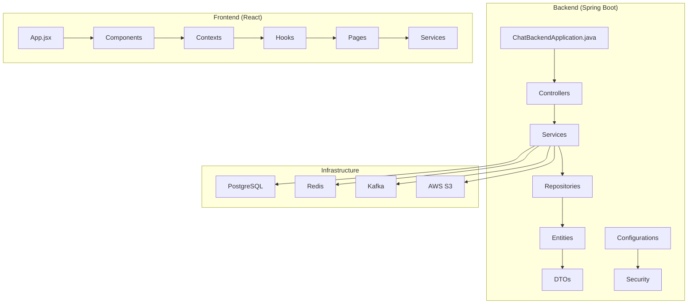
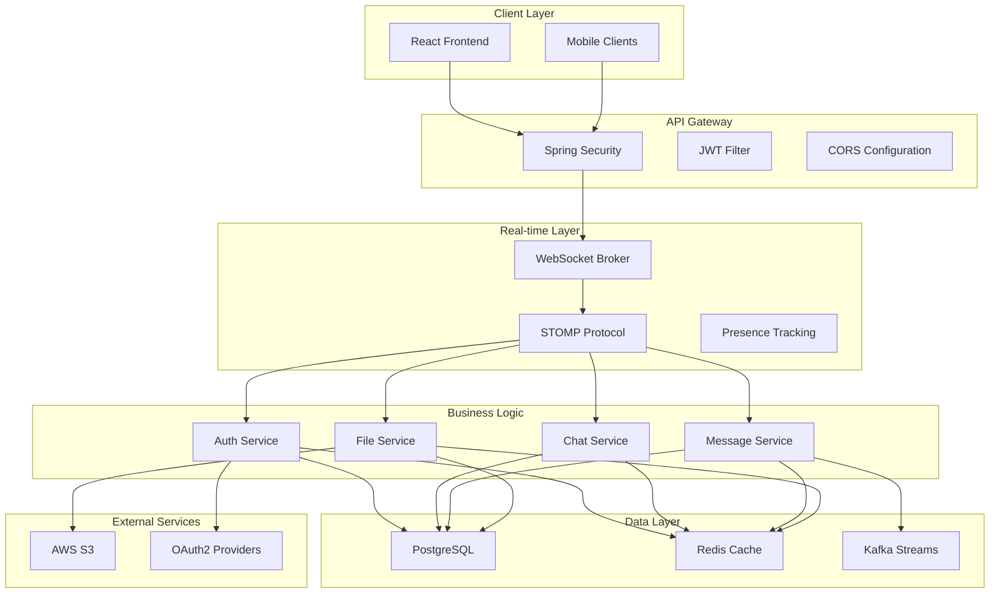
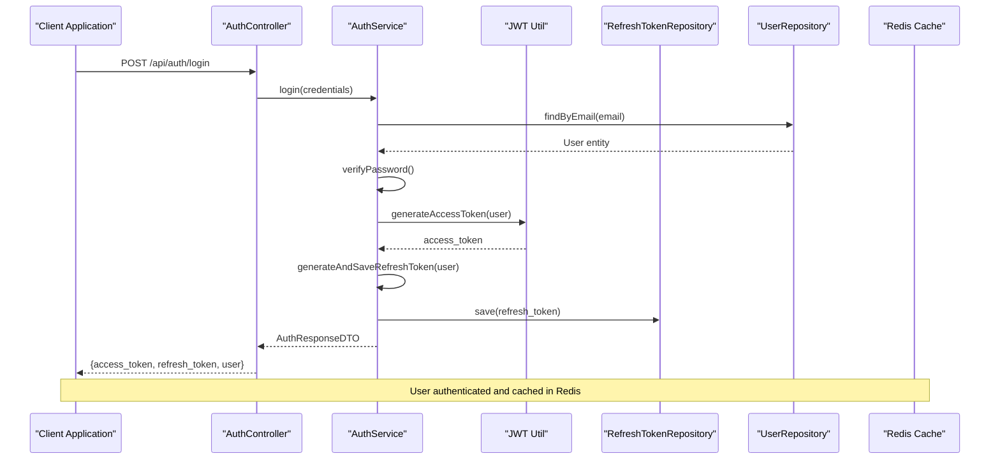
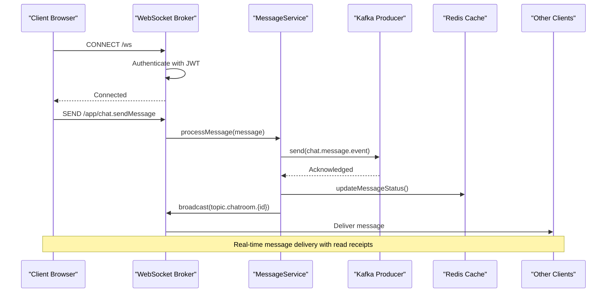
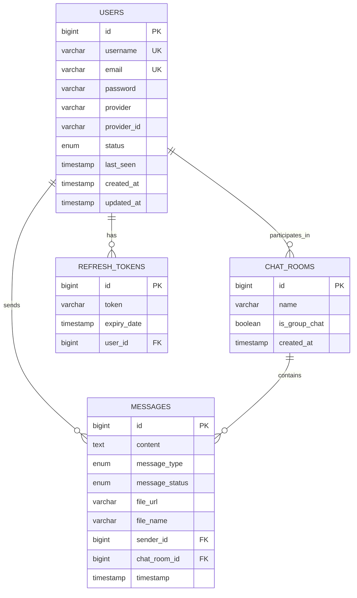
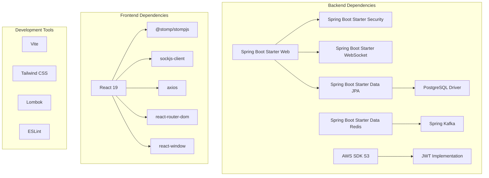

# Introduction and Purpose

<cite>
**Referenced Files in This Document**
- [README.md](file://README.md)
- [pom.xml](file://pom.xml)
- [application.properties](file://src/main/resources/application.properties)
- [WebSocketConfig.java](file://src/main/java/com/chatify/chat_backend/config/WebSocketConfig.java)
- [SecurityConfig.java](file://src/main/java/com/chatify/chat_backend/config/SecurityConfig.java)
- [AuthService.java](file://src/main/java/com/chatify/chat_backend/service/AuthService.java)
- [AuthController.java](file://src/main/java/com/chatify/chat_backend/controller/AuthController.java)
- [User.java](file://src/main/java/com/chatify/chat_backend/entity/User.java)
- [MessageDTO.java](file://src/main/java/com/chatify/chat_backend/dto/MessageDTO.java)
- [ChatRoomDTO.java](file://src/main/java/com/chatify/chat_backend/dto/ChatRoomDTO.java)
- [App.jsx](file://chatify-frontend/src/App.jsx)
- [package.json](file://chatify-frontend/package.json)
</cite>

## Table of Contents
1. [Introduction](#introduction)
2. [Project Structure](#project-structure)
3. [Core Components](#core-components)
4. [Architecture Overview](#architecture-overview)
5. [Detailed Component Analysis](#detailed-component-analysis)
6. [Dependency Analysis](#dependency-analysis)
7. [Performance Considerations](#performance-considerations)
8. [Troubleshooting Guide](#troubleshooting-guide)
9. [Conclusion](#conclusion)

## Introduction
Chatify is a modern real-time chat application designed to provide seamless communication experiences through instant messaging, group conversations, and file sharing capabilities. Built with a contemporary full-stack architecture, Chatify delivers reliable, secure, and scalable chat solutions for individuals and teams.

### What Chatify Solves
Existing chat solutions often struggle with:
- Real-time synchronization delays and inconsistent message delivery
- Complex authentication flows that expose tokens in URLs
- Limited scalability for concurrent users and large-scale deployments
- Fragmented user presence and typing indicators
- Inconsistent read receipts and message status tracking
- File sharing limitations with large payload handling

Chatify addresses these challenges by implementing:
- WebSocket-based real-time messaging with STOMP for instant delivery
- JWT-based authentication with refresh tokens for secure sessions
- Redis-backed caching and presence tracking for scalable user state
- Kafka-powered event streaming for reliable message delivery
- Comprehensive file upload support with AWS S3 integration
- OAuth2 integration for seamless third-party authentication

### Target Audience
Chatify serves multiple audiences:
- **Developers**: Looking for a robust, extensible chat platform to integrate into larger systems
- **Teams**: Seeking an internal communication solution with advanced features like typing indicators and read receipts
- **Organizations**: Needing a scalable, secure chat infrastructure for enterprise communication

### Position in the Modern Web Ecosystem
Chatify occupies a unique position in the modern web ecosystem by combining:
- **Real-time Communication**: WebSocket/STOMP for instant messaging
- **Cloud-Native Architecture**: Container-ready deployment with microservice-friendly design
- **Modern Frontend**: React-based interface with contemporary UX patterns
- **Enterprise Security**: JWT authentication, OAuth2, and comprehensive error handling
- **Scalable Infrastructure**: Redis, Kafka, and PostgreSQL for high-performance operations

## Project Structure
Chatify follows a clear separation of concerns with distinct backend and frontend components:

**Diagram sources**
- [ChatBackendApplication.java:1-14](file://src/main/java/com/chatify/chat_backend/ChatBackendApplication.java#L1-L14)
- [App.jsx:1-74](file://chatify-frontend/src/App.jsx#L1-L74)

**Section sources**
- [README.md:159-185](file://README.md#L159-L185)
- [pom.xml:1-176](file://pom.xml#L1-L176)

## Core Components
Chatify's architecture consists of several interconnected components that work together to provide a comprehensive chat experience:

### Backend Foundation
The backend is built on Spring Boot 3.5.5 with Java 17, providing:
- **REST API Layer**: Controllers handling HTTP requests for authentication, chat rooms, messages, and file operations
- **Service Layer**: Business logic for authentication, message processing, file storage, and presence tracking
- **Data Access Layer**: JPA repositories managing PostgreSQL persistence
- **Real-time Communication**: WebSocket configuration with STOMP for instant messaging
- **Security Framework**: JWT authentication, OAuth2 integration, and comprehensive CORS handling

### Frontend Architecture
The frontend utilizes React 19 with modern development practices:
- **Component-Based Design**: Modular components for chat windows, message lists, and user interfaces
- **Context Providers**: Authentication and WebSocket state management
- **Custom Hooks**: Reusable logic for authentication, typing indicators, and WebSocket connections
- **Real-time Updates**: WebSocket integration for live message delivery and presence updates

### Infrastructure Services
Chatify leverages cloud-native technologies:
- **Redis**: Caching, session management, and user presence tracking
- **Kafka**: Event streaming for message delivery and cross-service communication
- **AWS S3**: Secure file storage with pre-signed URL generation
- **PostgreSQL**: Relational data storage with JPA/Hibernate ORM

**Section sources**
- [README.md:17-34](file://README.md#L17-L34)
- [pom.xml:40-155](file://pom.xml#L40-L155)
- [application.properties:1-75](file://src/main/resources/application.properties#L1-L75)

## Architecture Overview
Chatify implements a distributed, event-driven architecture optimized for real-time communication:

**Diagram sources**
- [SecurityConfig.java:61-90](file://src/main/java/com/chatify/chat_backend/config/SecurityConfig.java#L61-L90)
- [WebSocketConfig.java:44-57](file://src/main/java/com/chatify/chat_backend/config/WebSocketConfig.java#L44-L57)
- [AuthService.java:21-44](file://src/main/java/com/chatify/chat_backend/service/AuthService.java#L21-L44)

## Detailed Component Analysis

### Authentication System
Chatify implements a comprehensive authentication system supporting multiple login methods:

**Diagram sources**
- [AuthController.java:45-53](file://src/main/java/com/chatify/chat_backend/controller/AuthController.java#L45-L53)
- [AuthService.java:62-77](file://src/main/java/com/chatify/chat_backend/service/AuthService.java#L62-L77)

The authentication system supports:
- Local authentication with password hashing
- OAuth2 integration with Google accounts
- JWT-based access tokens with configurable expiration
- Refresh token rotation for enhanced security
- Automatic username generation for OAuth2 users

**Section sources**
- [AuthController.java:1-140](file://src/main/java/com/chatify/chat_backend/controller/AuthController.java#L1-L140)
- [AuthService.java:1-162](file://src/main/java/com/chatify/chat_backend/service/AuthService.java#L1-L162)

### Real-time Messaging Architecture
Chatify's real-time messaging system leverages WebSocket technology for instant communication:

**Diagram sources**
- [WebSocketConfig.java:68-111](file://src/main/java/com/chatify/chat_backend/config/WebSocketConfig.java#L68-L111)
- [application.properties:54-75](file://src/main/resources/application.properties#L54-L75)

Key real-time features include:
- WebSocket connections with SockJS fallback
- STOMP protocol for structured messaging
- User presence tracking and typing indicators
- Read receipt notifications
- Offline message queuing and delivery

**Section sources**
- [WebSocketConfig.java:1-111](file://src/main/java/com/chatify/chat_backend/config/WebSocketConfig.java#L1-L111)
- [application.properties:13-16](file://src/main/resources/application.properties#L13-L16)

### Data Model Architecture
Chatify's data model supports complex chat scenarios with clear entity relationships:

**Diagram sources**
- [User.java:18-56](file://src/main/java/com/chatify/chat_backend/entity/User.java#L18-L56)
- [MessageDTO.java:15-32](file://src/main/java/com/chatify/chat_backend/dto/MessageDTO.java#L15-L32)
- [ChatRoomDTO.java:14-31](file://src/main/java/com/chatify/chat_backend/dto/ChatRoomDTO.java#L14-L31)

**Section sources**
- [User.java:1-56](file://src/main/java/com/chatify/chat_backend/entity/User.java#L1-L56)
- [MessageDTO.java:1-33](file://src/main/java/com/chatify/chat_backend/dto/MessageDTO.java#L1-L33)
- [ChatRoomDTO.java:1-31](file://src/main/java/com/chatify/chat_backend/dto/ChatRoomDTO.java#L1-L31)

## Dependency Analysis
Chatify's dependency structure reflects modern Java and JavaScript ecosystems:

**Diagram sources**
- [pom.xml:40-155](file://pom.xml#L40-L155)
- [package.json:12-39](file://chatify-frontend/package.json#L12-L39)

**Section sources**
- [pom.xml:1-176](file://pom.xml#L1-L176)
- [package.json:1-40](file://chatify-frontend/package.json#L1-L40)

## Performance Considerations
Chatify is designed with performance and scalability in mind:

### Scalability Features
- **Connection Pooling**: Optimized database connections for high concurrency
- **Redis Caching**: Reduced database load through intelligent caching
- **Kafka Streaming**: Asynchronous message processing for high throughput
- **WebSocket Clustering**: Support for horizontal scaling across multiple instances

### Performance Optimizations
- **Lazy Loading**: Frontend components load only when needed
- **Virtual Scrolling**: Efficient rendering of large message lists
- **Image Compression**: Optimized file uploads with automatic compression
- **CDN Integration**: Static asset delivery via content distribution networks

### Monitoring and Observability
- **Health Checks**: Built-in endpoints for service monitoring
- **Metrics Collection**: Performance metrics for database and network operations
- **Logging**: Structured logging for debugging and performance analysis

## Troubleshooting Guide
Common issues and their solutions:

### Authentication Problems
- **JWT Token Issues**: Verify token expiration and secret configuration
- **OAuth2 Failures**: Check redirect URIs and provider credentials
- **Refresh Token Rotation**: Ensure proper token lifecycle management

### Real-time Communication Issues
- **WebSocket Connection**: Verify CORS configuration and authentication headers
- **Message Delivery**: Check Kafka producer configuration and topic setup
- **Presence Updates**: Validate Redis connectivity and cache configuration

### Database Connectivity
- **PostgreSQL Connection**: Verify credentials and network accessibility
- **Schema Updates**: Monitor DDL_AUTO settings for development vs production
- **Connection Pool**: Tune pool size based on expected concurrent users

**Section sources**
- [README.md:187-208](file://README.md#L187-L208)

## Conclusion
Chatify represents a comprehensive solution for modern real-time communication needs. By combining proven technologies with innovative architectural patterns, it delivers a reliable, secure, and scalable chat platform suitable for individual users and enterprise environments alike.

The application's strength lies in its balanced approach to functionality and performance, offering essential chat features while maintaining technical excellence through clean architecture, comprehensive testing, and cloud-native deployment patterns. Whether you're building the next generation of team collaboration tools or seeking a robust foundation for custom chat implementations, Chatify provides the technical foundation and practical features needed to succeed in today's competitive communication landscape.