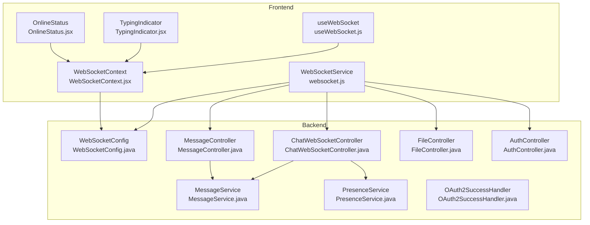
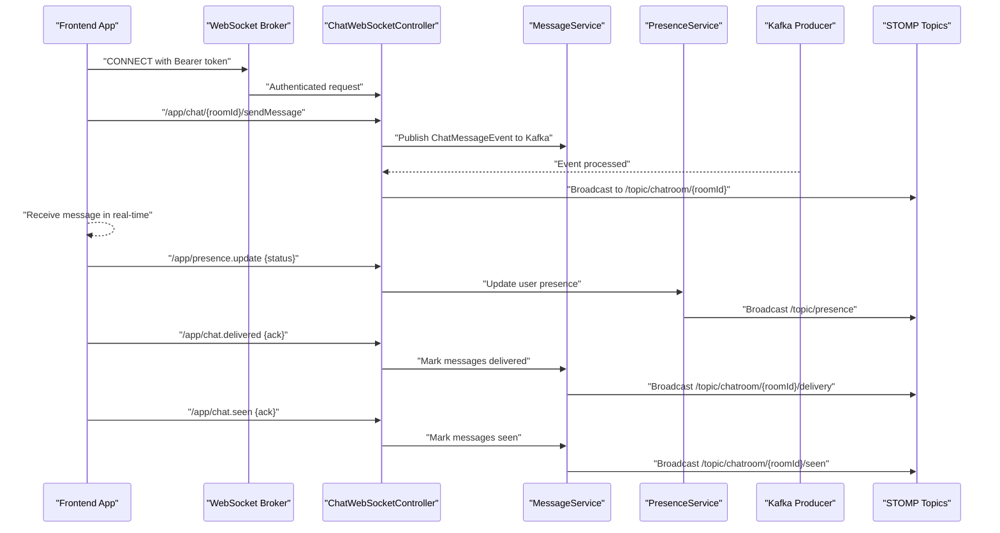
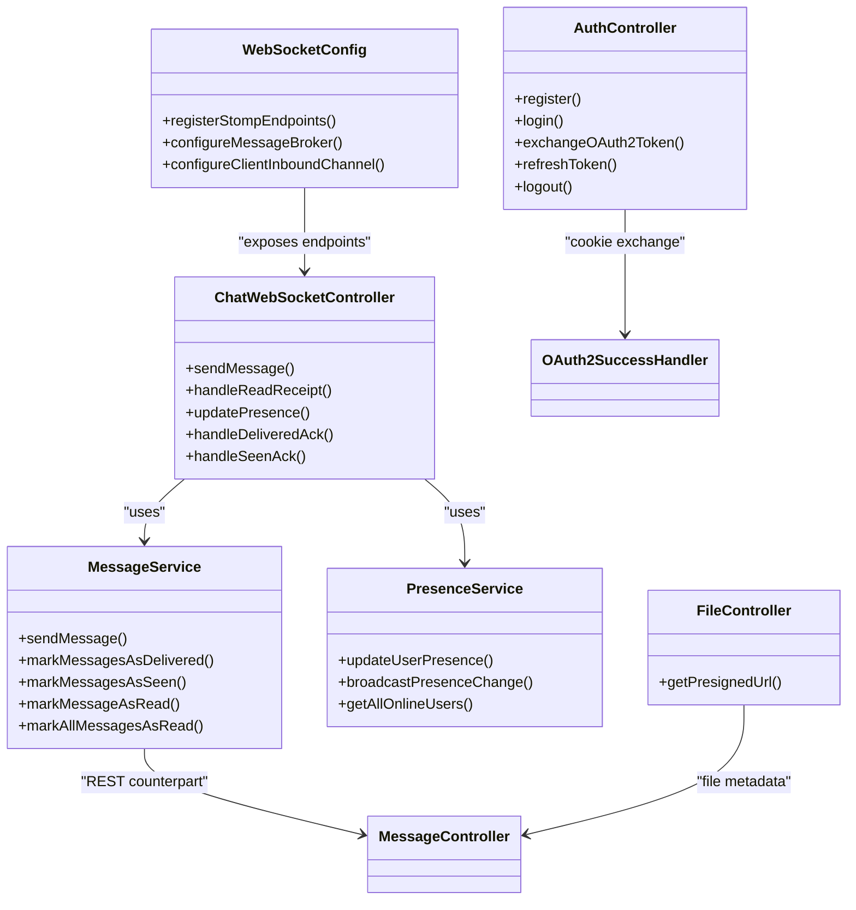

# Key Features and Capabilities

<cite>
**Referenced Files in This Document**
- [WebSocketConfig.java](file://src/main/java/com/chatify/chat_backend/config/WebSocketConfig.java)
- [ChatWebSocketController.java](file://src/main/java/com/chatify/chat_backend/controller/ChatWebSocketController.java)
- [MessageController.java](file://src/main/java/com/chatify/chat_backend/controller/MessageController.java)
- [MessageService.java](file://src/main/java/com/chatify/chat_backend/service/MessageService.java)
- [PresenceService.java](file://src/main/java/com/chatify/chat_backend/service/PresenceService.java)
- [FileController.java](file://src/main/java/com/chatify/chat_backend/controller/FileController.java)
- [AuthController.java](file://src/main/java/com/chatify/chat_backend/controller/AuthController.java)
- [OAuth2SuccessHandler.java](file://src/main/java/com/chatify/chat_backend/security/OAuth2SuccessHandler.java)
- [UserStatus.java](file://src/main/java/com/chatify/chat_backend/entity/enums/UserStatus.java)
- [MessageStatus.java](file://src/main/java/com/chatify/chat_backend/entity/enums/MessageStatus.java)
- [websocket.js](file://chatify-frontend/src/services/websocket.js)
- [WebSocketContext.jsx](file://chatify-frontend/src/context/WebSocketContext.jsx)
- [useWebSocket.js](file://chatify-frontend/src/hooks/useWebSocket.js)
- [TypingIndicator.jsx](file://chatify-frontend/src/components/Chat/TypingIndicator.jsx)
- [OnlineStatus.jsx](file://chatify-frontend/src/components/Common/OnlineStatus.jsx)
</cite>

## Table of Contents
1. [Introduction](#introduction)
2. [Project Structure](#project-structure)
3. [Core Components](#core-components)
4. [Architecture Overview](#architecture-overview)
5. [Detailed Component Analysis](#detailed-component-analysis)
6. [Dependency Analysis](#dependency-analysis)
7. [Performance Considerations](#performance-considerations)
8. [Troubleshooting Guide](#troubleshooting-guide)
9. [Conclusion](#conclusion)

## Introduction
This document presents Chatify’s key features and capabilities for real-time chat. It covers instant messaging, real-time chat rooms, multi-user conversations, message delivery receipts (DELIVERED/SEEN), typing indicators, online presence tracking, read acknowledgments, file sharing with AWS S3 integration, user management (registration, authentication, OAuth2 Google), and robust real-time infrastructure including WebSocket connectivity, automatic reconnection, and offline message handling. Practical usage examples and technical implementation details are included to help both users and developers understand how features work under the hood.

## Project Structure
Chatify is a Spring Boot backend with a React/Vite frontend. Real-time features are implemented using Spring WebSocket (STOMP over SockJS) and a STOMP client on the frontend. The backend exposes REST endpoints for file uploads and message retrieval, while WebSocket endpoints handle live events such as messages, typing indicators, presence, and delivery/seen receipts.

**Diagram sources**
- [WebSocketConfig.java:27-57](file://src/main/java/com/chatify/chat_backend/config/WebSocketConfig.java#L27-L57)
- [ChatWebSocketController.java:22-47](file://src/main/java/com/chatify/chat_backend/controller/ChatWebSocketController.java#L22-L47)
- [MessageController.java:16-30](file://src/main/java/com/chatify/chat_backend/controller/MessageController.java#L16-L30)
- [MessageService.java:29-48](file://src/main/java/com/chatify/chat_backend/service/MessageService.java#L29-L48)
- [PresenceService.java:19-42](file://src/main/java/com/chatify/chat_backend/service/PresenceService.java#L19-L42)
- [FileController.java:9-17](file://src/main/java/com/chatify/chat_backend/controller/FileController.java#L9-L17)
- [AuthController.java:19-33](file://src/main/java/com/chatify/chat_backend/controller/AuthController.java#L19-L33)
- [OAuth2SuccessHandler.java:20-36](file://src/main/java/com/chatify/chat_backend/security/OAuth2SuccessHandler.java#L20-L36)
- [websocket.js:5-20](file://chatify-frontend/src/services/websocket.js#L5-L20)
- [WebSocketContext.jsx:10-122](file://chatify-frontend/src/context/WebSocketContext.jsx#L10-L122)
- [useWebSocket.js:4-6](file://chatify-frontend/src/hooks/useWebSocket.js#L4-L6)
- [TypingIndicator.jsx:4-44](file://chatify-frontend/src/components/Chat/TypingIndicator.jsx#L4-L44)
- [OnlineStatus.jsx:1-25](file://chatify-frontend/src/components/Common/OnlineStatus.jsx#L1-L25)

**Section sources**
- [WebSocketConfig.java:27-57](file://src/main/java/com/chatify/chat_backend/config/WebSocketConfig.java#L27-L57)
- [websocket.js:5-20](file://chatify-frontend/src/services/websocket.js#L5-L20)
- [WebSocketContext.jsx:10-122](file://chatify-frontend/src/context/WebSocketContext.jsx#L10-L122)

## Core Components
- Real-time messaging and receipts: WebSocket endpoints for sending messages, delivery acknowledgments, seen acknowledgments, and read receipts.
- Presence and typing: Online presence tracking with Redis-backed TTL and broadcast; typing indicators per chat room.
- File sharing: REST endpoint to generate presigned URLs for direct AWS S3 uploads.
- User management: Registration, login, refresh token, logout, and OAuth2 Google integration with secure cookie exchange.
- Message persistence and pagination: REST endpoints for retrieving messages and paginated history.

**Section sources**
- [ChatWebSocketController.java:49-181](file://src/main/java/com/chatify/chat_backend/controller/ChatWebSocketController.java#L49-L181)
- [MessageController.java:32-95](file://src/main/java/com/chatify/chat_backend/controller/MessageController.java#L32-L95)
- [MessageService.java:50-286](file://src/main/java/com/chatify/chat_backend/service/MessageService.java#L50-L286)
- [PresenceService.java:49-132](file://src/main/java/com/chatify/chat_backend/service/PresenceService.java#L49-L132)
- [FileController.java:19-29](file://src/main/java/com/chatify/chat_backend/controller/FileController.java#L19-L29)
- [AuthController.java:35-140](file://src/main/java/com/chatify/chat_backend/controller/AuthController.java#L35-L140)
- [OAuth2SuccessHandler.java:38-88](file://src/main/java/com/chatify/chat_backend/security/OAuth2SuccessHandler.java#L38-L88)

## Architecture Overview
The system uses Spring WebSocket (STOMP over SockJS) for real-time communication and REST APIs for file and message retrieval. Frontend connects via SockJS and STOMP, authenticates using JWT, and subscribes to topics for live updates. Backend validates JWT on WebSocket CONNECT, enforces authorization for chat operations, persists messages, and publishes updates to subscribed clients.

**Diagram sources**
- [WebSocketConfig.java:68-111](file://src/main/java/com/chatify/chat_backend/config/WebSocketConfig.java#L68-L111)
- [ChatWebSocketController.java:81-181](file://src/main/java/com/chatify/chat_backend/controller/ChatWebSocketController.java#L81-L181)
- [MessageService.java:194-269](file://src/main/java/com/chatify/chat_backend/service/MessageService.java#L194-L269)
- [PresenceService.java:101-103](file://src/main/java/com/chatify/chat_backend/service/PresenceService.java#L101-L103)

## Detailed Component Analysis

### Real-Time Messaging and Multi-User Conversations
- Instant message delivery: Clients publish to `/app/chat/{roomId}/sendMessage`; backend validates membership and publishes a ChatMessageEvent to Kafka. Consumers persist and broadcast to `/topic/chatroom/{roomId}`.
- Multi-user support: Subscriptions are per-room; all participants receive messages in real-time.
- REST fallback: A legacy endpoint `/chat.sendMessage` is retained and also routed through Kafka for backward compatibility.

Practical example:
- Send a message: Client sends payload to `/app/chat/{roomId}/sendMessage`. Backend responds with persisted message DTO and broadcasts to the room topic.

Benefits:
- Decoupled pipeline via Kafka improves resilience and throughput.
- STOMP topics ensure scalable pub/sub distribution.

**Section sources**
- [ChatWebSocketController.java:81-110](file://src/main/java/com/chatify/chat_backend/controller/ChatWebSocketController.java#L81-L110)
- [MessageController.java:32-44](file://src/main/java/com/chatify/chat_backend/controller/MessageController.java#L32-L44)

### Message Delivery Receipts (DELIVERED/SEEN) and Read Acknowledgments
- Delivery receipts: Client sends `/app/chat.delivered` with the last delivered message ID; backend marks messages as DELIVERED and broadcasts `/topic/chatroom/{roomId}/delivery`.
- Seen receipts: Client sends `/app/chat.seen` with the last seen message ID; backend marks messages as SEEN and broadcasts `/topic/chatroom/{roomId}/seen`.
- Read acknowledgments: Client sends `/app/chat.read/{messageId}`; backend marks the message as read and emits a read receipt to `/topic/chatroom/{roomId}/read`.

Practical example:
- After receiving a message, client sends a seen acknowledgment to update status to SEEN and notify other users.

Benefits:
- Accurate read/delivery state tracking across users.
- Reduces ambiguity about message consumption.

**Section sources**
- [ChatWebSocketController.java:144-181](file://src/main/java/com/chatify/chat_backend/controller/ChatWebSocketController.java#L144-L181)
- [MessageService.java:194-269](file://src/main/java/com/chatify/chat_backend/service/MessageService.java#L194-L269)

### Typing Indicators
- Frontend maintains typing state per room and broadcasts `/app/chat.typing/{chatRoomId}` with `{ isTyping }`.
- Subscribers receive updates on `/topic/chatroom/{chatRoomId}/typing` and render a human-friendly indicator.

Practical example:
- When a user starts typing, client sends a typing indicator; others see “X is typing…” with animated dots.

Benefits:
- Improves conversational awareness and reduces redundant messages.

**Section sources**
- [WebSocketContext.jsx:152-174](file://chatify-frontend/src/context/WebSocketContext.jsx#L152-L174)
- [TypingIndicator.jsx:4-44](file://chatify-frontend/src/components/Chat/TypingIndicator.jsx#L4-L44)

### Online Presence Tracking
- Presence updates: Client sends `/app/presence.update { status }`. Backend updates user status, stores ONLINE in Redis with TTL, and broadcasts to `/topic/presence`.
- Offline handling: OFFLINE status sets last seen; Redis keys expire automatically as a safety net.

Practical example:
- Toggle status to ONLINE/OFFLINE/AWAY; UI receives presence updates and displays OnlineStatus badges.

Benefits:
- Real-time visibility of user availability.
- Scalable via Redis with automatic expiration.

**Section sources**
- [ChatWebSocketController.java:133-142](file://src/main/java/com/chatify/chat_backend/controller/ChatWebSocketController.java#L133-L142)
- [PresenceService.java:49-103](file://src/main/java/com/chatify/chat_backend/service/PresenceService.java#L49-L103)
- [UserStatus.java:3-7](file://src/main/java/com/chatify/chat_backend/entity/enums/UserStatus.java#L3-L7)
- [OnlineStatus.jsx:1-25](file://chatify-frontend/src/components/Common/OnlineStatus.jsx#L1-L25)

### File Sharing with AWS S3 Integration
- Upload flow: Client requests a presigned URL via `/api/files/presigned-url` with filename, content type, and size. Backend returns a signed URL for direct S3 PUT.
- Download: Use the generated URL to fetch the file from S3.
- Size limits: Enforced by the client prior to requesting a presigned URL.

Practical example:
- Select a file; request a presigned URL; upload directly to S3; store metadata (URL, filename) in the message payload.

Benefits:
- Offloads storage bandwidth from the server.
- Secure, time-limited access via signed URLs.

**Section sources**
- [FileController.java:19-29](file://src/main/java/com/chatify/chat_backend/controller/FileController.java#L19-L29)

### User Management: Registration, Authentication, OAuth2 Google
- Registration and login: REST endpoints for credentials-based auth returning tokens.
- Refresh tokens: Exchanges refresh tokens for new access tokens.
- Logout: Invalidates tokens and clears sessions.
- OAuth2 Google: Backend sets an HttpOnly cookie containing encoded auth response after successful Google login. Frontend exchanges cookie for tokens via `/api/auth/oauth2/token`.

Practical example:
- Click “Continue with Google”; backend redirects to Google, then back to frontend with a pending cookie; frontend calls oauth2/token to receive tokens securely.

Benefits:
- Secure token handling with HttpOnly cookies and short expiry.
- Seamless third-party identity integration.

**Section sources**
- [AuthController.java:35-140](file://src/main/java/com/chatify/chat_backend/controller/AuthController.java#L35-L140)
- [OAuth2SuccessHandler.java:38-88](file://src/main/java/com/chatify/chat_backend/security/OAuth2SuccessHandler.java#L38-L88)

### REST Messaging and Pagination
- Send message: POST `/api/messages` with chat room ID and content/file metadata; backend returns the created message DTO.
- Retrieve messages: GET `/api/messages/chatroom/{chatRoomId}` for full history; GET `/api/messages/chatroom/{chatRoomId}/paginated` for paginated results.
- Mark as read: PUT `/api/messages/{id}/read` and `/api/messages/chatroom/{chatRoomId}/read-all`.
- Delete message: DELETE `/api/messages/{id}` (sender only).

Practical example:
- Load chat history with pagination; mark all as read when switching tabs.

Benefits:
- Clear separation of concerns: REST for CRUD, WebSocket for real-time.

**Section sources**
- [MessageController.java:32-95](file://src/main/java/com/chatify/chat_backend/controller/MessageController.java#L32-L95)
- [MessageService.java:80-112](file://src/main/java/com/chatify/chat_backend/service/MessageService.java#L80-L112)

### WebSocket Connectivity, Reconnection, and Offline Handling
- Backend: Validates JWT on CONNECT; enables heartbeats; registers SockJS endpoint.
- Frontend: Uses SockJS + STOMP; manages connection state, queues messages when disconnected, and retries with exponential backoff.
- Automatic reconnection: On token expiry, frontend refreshes token and reconnects with updated headers.

Practical example:
- Network interruption: Client queues outgoing messages; on reconnect, flushes queue and resumes normal operation.

Benefits:
- Resilient real-time experience with minimal user intervention.

**Section sources**
- [WebSocketConfig.java:68-111](file://src/main/java/com/chatify/chat_backend/config/WebSocketConfig.java#L68-L111)
- [websocket.js:42-138](file://chatify-frontend/src/services/websocket.js#L42-L138)
- [WebSocketContext.jsx:47-122](file://chatify-frontend/src/context/WebSocketContext.jsx#L47-L122)

## Dependency Analysis
The backend components collaborate as follows:
- WebSocketConfig authenticates and configures STOMP endpoints.
- ChatWebSocketController orchestrates real-time events and delegates to services.
- MessageService encapsulates message persistence, status transitions, and read/delivery/seen updates.
- PresenceService manages user presence with Redis TTL.
- FileController generates presigned URLs for S3 uploads.
- AuthController and OAuth2SuccessHandler manage secure authentication and token exchange.

**Diagram sources**
- [WebSocketConfig.java:27-57](file://src/main/java/com/chatify/chat_backend/config/WebSocketConfig.java#L27-L57)
- [ChatWebSocketController.java:22-47](file://src/main/java/com/chatify/chat_backend/controller/ChatWebSocketController.java#L22-L47)
- [MessageService.java:29-48](file://src/main/java/com/chatify/chat_backend/service/MessageService.java#L29-L48)
- [PresenceService.java:19-42](file://src/main/java/com/chatify/chat_backend/service/PresenceService.java#L19-L42)
- [FileController.java:9-17](file://src/main/java/com/chatify/chat_backend/controller/FileController.java#L9-L17)
- [AuthController.java:19-33](file://src/main/java/com/chatify/chat_backend/controller/AuthController.java#L19-L33)
- [OAuth2SuccessHandler.java:20-36](file://src/main/java/com/chatify/chat_backend/security/OAuth2SuccessHandler.java#L20-L36)

**Section sources**
- [WebSocketConfig.java:27-57](file://src/main/java/com/chatify/chat_backend/config/WebSocketConfig.java#L27-L57)
- [ChatWebSocketController.java:22-47](file://src/main/java/com/chatify/chat_backend/controller/ChatWebSocketController.java#L22-L47)
- [MessageService.java:29-48](file://src/main/java/com/chatify/chat_backend/service/MessageService.java#L29-L48)
- [PresenceService.java:19-42](file://src/main/java/com/chatify/chat_backend/service/PresenceService.java#L19-L42)
- [FileController.java:9-17](file://src/main/java/com/chatify/chat_backend/controller/FileController.java#L9-L17)
- [AuthController.java:19-33](file://src/main/java/com/chatify/chat_backend/controller/AuthController.java#L19-L33)
- [OAuth2SuccessHandler.java:20-36](file://src/main/java/com/chatify/chat_backend/security/OAuth2SuccessHandler.java#L20-L36)

## Performance Considerations
- Use paginated message retrieval for large histories to reduce payload sizes.
- Prefer Redis for presence to minimize database load; leverage TTL to avoid stale entries.
- Batch read/delivery/seen updates where appropriate to reduce network chatter.
- Tune heartbeat intervals and reconnect delays to balance responsiveness and resource usage.

## Troubleshooting Guide
Common issues and resolutions:
- WebSocket authentication failures: Ensure Authorization header contains a valid JWT; backend rejects missing or invalid tokens on CONNECT.
- Messages not delivered: Verify user membership in the chat room; backend checks participation before publishing.
- Presence not updating: Confirm Redis is reachable and TTL configured; backend falls back to DB if Redis lookup fails.
- File upload errors: Validate presigned URL generation and content-type; ensure file size does not exceed limits.
- OAuth2 token exchange: Confirm the pending cookie exists and is HttpOnly; frontend must call the oauth2/token endpoint promptly.

**Section sources**
- [WebSocketConfig.java:75-105](file://src/main/java/com/chatify/chat_backend/config/WebSocketConfig.java#L75-L105)
- [ChatWebSocketController.java:55-63](file://src/main/java/com/chatify/chat_backend/controller/ChatWebSocketController.java#L55-L63)
- [PresenceService.java:84-99](file://src/main/java/com/chatify/chat_backend/service/PresenceService.java#L84-L99)
- [FileController.java:21-29](file://src/main/java/com/chatify/chat_backend/controller/FileController.java#L21-L29)
- [AuthController.java:69-107](file://src/main/java/com/chatify/chat_backend/controller/AuthController.java#L69-L107)

## Conclusion
Chatify delivers a comprehensive real-time chat platform with robust messaging, presence, typing indicators, delivery/seen/read receipts, secure file sharing, and seamless user authentication including OAuth2 Google. The backend leverages Spring WebSocket and Kafka for scalability, while the frontend ensures resilient connectivity with automatic reconnection and offline handling. Together, these features provide a modern, reliable, and user-friendly chat experience.