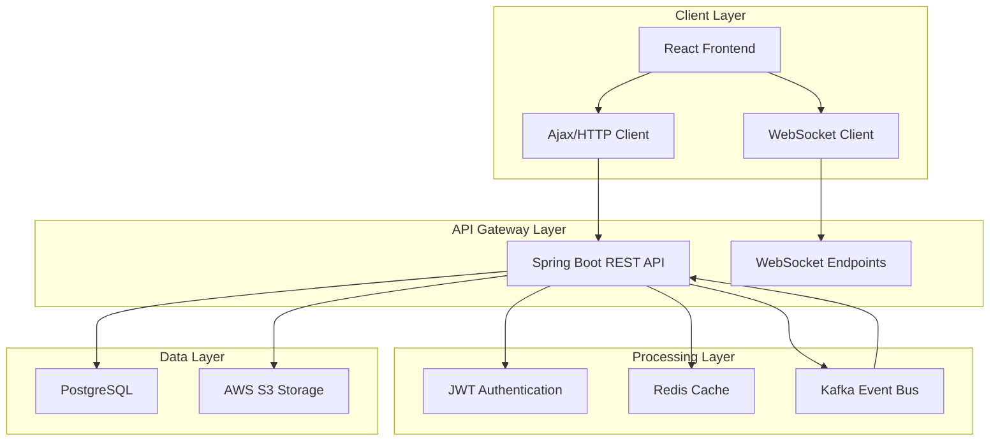
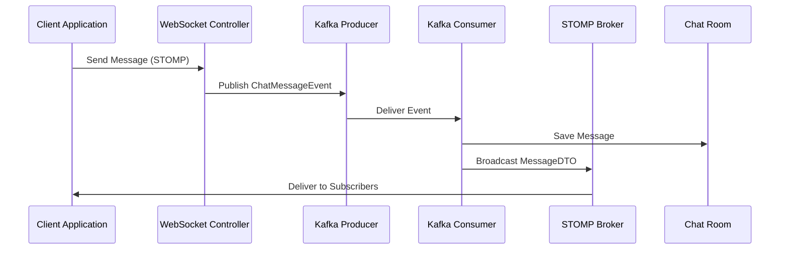
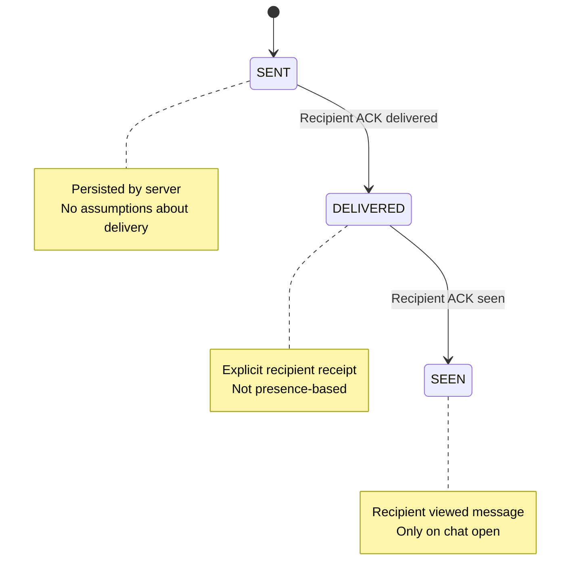
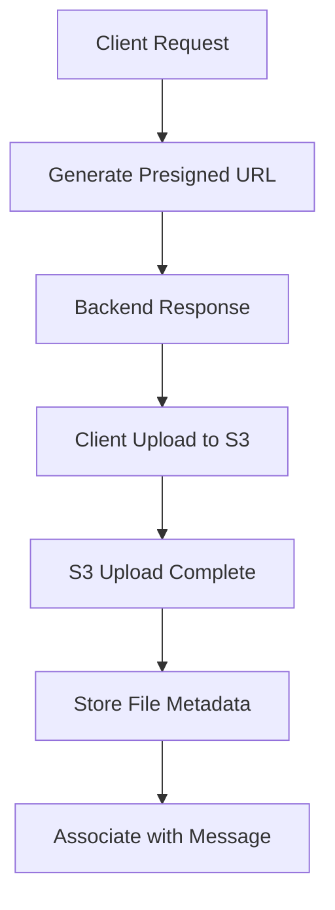
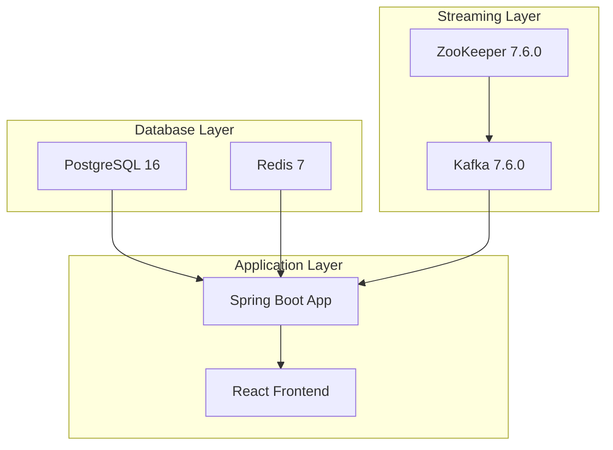

# Project Overview

<cite>
**Referenced Files in This Document**
- [README.md](file://README.md)
- [ChatBackendApplication.java](file://src/main/java/com/chatify/chat_backend/ChatBackendApplication.java)
- [pom.xml](file://pom.xml)
- [WebSocketConfig.java](file://src/main/java/com/chatify/chat_backend/config/WebSocketConfig.java)
- [SecurityConfig.java](file://src/main/java/com/chatify/chat_backend/config/SecurityConfig.java)
- [ChatWebSocketController.java](file://src/main/java/com/chatify/chat_backend/controller/ChatWebSocketController.java)
- [KafkaProducerService.java](file://src/main/java/com/chatify/chat_backend/service/KafkaProducerService.java)
- [KafkaConsumerService.java](file://src/main/java/com/chatify/chat_backend/service/KafkaConsumerService.java)
- [ChatMessageEvent.java](file://src/main/java/com/chatify/chat_backend/dto/ChatMessageEvent.java)
- [Message.java](file://src/main/java/com/chatify/chat_backend/entity/Message.java)
- [User.java](file://src/main/java/com/chatify/chat_backend/entity/User.java)
- [ChatRoom.java](file://src/main/java/com/chatify/chat_backend/entity/ChatRoom.java)
- [MESSAGE_DELIVERY_DESIGN.md](file://MESSAGE_DELIVERY_DESIGN.md)
- [package.json](file://chatify-frontend/package.json)
- [docker-compose.yml](file://docker-compose.yml)
- [RedisConfig.java](file://src/main/java/com/chatify/chat_backend/config/RedisConfig.java)
- [KafkaTopicConfig.java](file://src/main/java/com/chatify/chat_backend/config/KafkaTopicConfig.java)
- [PresenceService.java](file://src/main/java/com/chatify/chat_backend/service/PresenceService.java)
</cite>

## Update Summary
**Changes Made**
- Expanded from simple chat app to comprehensive distributed real-time messaging platform
- Added detailed containerized infrastructure with Docker Compose
- Enhanced WebSocket/STOMP configuration with JWT authentication
- Integrated Redis for presence tracking and caching
- Added Kafka for event-driven message processing
- Documented AWS S3 integration for file uploads
- Updated deployment options and infrastructure architecture
- Enhanced technical depth for enterprise-scale real-time communication

## Table of Contents
1. [Introduction](#introduction)
2. [System Architecture](#system-architecture)
3. [Core Technologies](#core-technologies)
4. [Real-Time Communication Pipeline](#real-time-communication-pipeline)
5. [Message Delivery System](#message-delivery-system)
6. [Presence and Caching](#presence-and-caching)
7. [File Upload Infrastructure](#file-upload-infrastructure)
8. [Deployment Options](#deployment-options)
9. [Containerized Infrastructure](#containerized-infrastructure)
10. [Security and Authentication](#security-and-authentication)
11. [Performance and Scalability](#performance-and-scalability)
12. [Development Setup](#development-setup)
13. [Conclusion](#conclusion)

## Introduction

Chatify is a **comprehensive distributed real-time messaging platform** built with modern enterprise-grade technologies. Unlike a simple chat application, Chatify represents a fully-featured real-time communication system designed for production-scale deployments. The platform combines Spring Boot backend with React frontend to deliver a robust messaging solution supporting direct and group chats, real-time messaging, presence tracking, file attachments, and sophisticated event-driven architecture.

The system demonstrates enterprise-level messaging architecture including WebSocket/STOMP for real-time communication, JWT-based authentication for security, Redis for distributed caching and presence tracking, Kafka for event-driven message processing, and AWS S3 for scalable file storage. Containerization through Docker Compose provides a production-like development environment with all dependencies managed.

**Section sources**
- [README.md:1-16](file://README.md#L1-L16)
- [README.md:18-46](file://README.md#L18-L46)

## System Architecture

Chatify implements a **distributed microservices-inspired architecture** that separates concerns across multiple layers while maintaining real-time responsiveness. The system follows a hybrid synchronous/asynchronous design pattern where immediate responses are handled synchronously via REST APIs, while background processing and event propagation utilize asynchronous messaging.



**Diagram sources**
- [README.md:76-106](file://README.md#L76-L106)
- [docker-compose.yml:1-137](file://docker-compose.yml#L1-L137)

**Section sources**
- [README.md:76-106](file://README.md#L76-L106)
- [docker-compose.yml:1-137](file://docker-compose.yml#L1-L137)

## Core Technologies

### Backend Technology Stack

The backend leverages **Spring Boot 3.5.5** with Java 17, providing enterprise-grade features and performance optimization. The stack includes:

- **Spring Web MVC & WebFlux**: RESTful API endpoints and reactive programming support
- **Spring Security**: Comprehensive security framework with JWT and OAuth2 integration
- **Spring WebSocket**: Real-time bidirectional communication via STOMP over SockJS
- **Spring Data JPA**: Type-safe database operations with PostgreSQL
- **Spring Cache + Redis**: Distributed caching and presence tracking
- **Spring Kafka**: Event-driven architecture with message partitioning
- **AWS SDK**: Native integration with Amazon S3 for file storage
- **Lombok**: Reduces boilerplate code for DTOs and entities

### Frontend Technology Stack

The frontend utilizes **React 19.2.0** with modern development practices:

- **React 19**: Latest React features with concurrent rendering
- **Vite 7.2.4**: Lightning-fast build tool and development server
- **Tailwind CSS 4.1.18**: Utility-first CSS framework
- **@stomp/stompjs + sockjs-client**: Production-ready WebSocket client
- **Axios**: HTTP client for REST API communication
- **React Router 7.13.0**: Client-side routing
- **ESLint & TypeScript**: Code quality and type safety

**Section sources**
- [pom.xml:40-155](file://pom.xml#L40-L155)
- [package.json:12-40](file://package.json#L12-L40)

## Real-Time Communication Pipeline

Chatify implements a sophisticated real-time communication system using WebSocket/STOMP over SockJS, providing low-latency bidirectional messaging with automatic reconnection and heartbeat mechanisms.

### WebSocket Configuration

The WebSocket infrastructure includes:

- **STOMP Endpoint**: `/ws` with SockJS fallback support
- **Heartbeat Management**: 10-second ping/pong intervals for connection health
- **Authentication Integration**: JWT token validation during CONNECT frames
- **Topic Routing**: `/topic` for public channels, `/user` for private messages
- **Concurrency Control**: Thread pool scheduler for heartbeat tasks

### Message Flow Architecture



**Diagram sources**
- [ChatWebSocketController.java:81-110](file://ChatWebSocketController.java#L81-L110)
- [KafkaProducerService.java:32-37](file://KafkaProducerService.java#L32-L37)
- [KafkaConsumerService.java:34-59](file://KafkaConsumerService.java#L34-L59)

**Section sources**
- [WebSocketConfig.java:44-66](file://WebSocketConfig.java#L44-L66)
- [ChatWebSocketController.java:53-110](file://ChatWebSocketController.java#L53-L110)
- [KafkaProducerService.java:27-49](file://KafkaProducerService.java#L27-L49)

## Message Delivery System

Chatify implements a **crash-safe, offline-resilient message delivery system** with explicit state management and batched acknowledgments. The system maintains a strict state machine: SENT → DELIVERED → SEEN.

### Message State Management



**Diagram sources**
- [MESSAGE_DELIVERY_DESIGN.md:29-50](file://MESSAGE_DELIVERY_DESIGN.md#L29-L50)

### Delivery Acknowledgment Process

The system uses **batched acknowledgments** to handle offline scenarios and ensure eventual consistency:

1. **Delivery ACK**: Client batches all messages up to lastDeliveredMessageId
2. **Seen ACK**: Client batches all messages up to lastSeenMessageId
3. **Server Validation**: Database queries validate ownership and state transitions
4. **State Updates**: Atomic updates with timestamps for audit trails

**Section sources**
- [MESSAGE_DELIVERY_DESIGN.md:80-125](file://MESSAGE_DELIVERY_DESIGN.md#L80-L125)
- [ChatWebSocketController.java:144-180](file://ChatWebSocketController.java#L144-L180)

## Presence and Caching

### Redis-Based Presence System

Chatify implements a **distributed presence tracking system** using Redis for real-time online/offline status updates:

- **TTL Management**: 60-second expiration for automatic cleanup
- **Hybrid Storage**: Redis for active sessions, PostgreSQL for persistence
- **Broadcast Mechanism**: Real-time presence updates to all subscribers
- **Bulk Operations**: Efficient scanning of active presence keys

### Caching Strategy

The system employs **multi-level caching** for optimal performance:

- **Redis Cache Manager**: Configurable TTL per cache region
- **Object Mapper**: Jackson serialization with type information
- **Cache Regions**: Separate caches for user profiles and lookups
- **Automatic Eviction**: Cache invalidation on data changes

**Section sources**
- [PresenceService.java:49-81](file://PresenceService.java#L49-L81)
- [RedisConfig.java:70-107](file://RedisConfig.java#L70-L107)

## File Upload Infrastructure

### AWS S3 Integration

Chatify provides **enterprise-grade file attachment support** through AWS S3 integration:

- **Presigned URLs**: Secure temporary access tokens for direct S3 uploads
- **Supported Formats**: Images (JPEG, PNG, GIF, WEBP), PDF, DOC/DOCX, Video (MP4, QuickTime, AVI)
- **Direct Upload**: Client-side uploads bypass backend processing
- **Metadata Storage**: File URLs and names stored in database with message records

### Upload Workflow



**Diagram sources**
- [README.md:41-46](file://README.md#L41-L46)

**Section sources**
- [README.md:32-46](file://README.md#L32-L46)
- [pom.xml:93-97](file://pom.xml#L93-L97)

## Deployment Options

### Docker Compose Deployment

Chatify provides a **production-ready containerized deployment** through Docker Compose:

- **Complete Stack**: Postgres, Redis, Kafka, Zookeeper, Backend, Frontend
- **Environment Variables**: Centralized configuration management
- **Health Checks**: Automated service monitoring and recovery
- **Volume Management**: Persistent data storage across containers

### Local Development Setup

For development environments, Chatify supports **local execution** with individual service dependencies:

- **Java 17+**: Required for Spring Boot backend
- **Node.js 20+**: Required for React frontend
- **Database Dependencies**: PostgreSQL, Redis, Kafka/Zookeeper
- **Build Tools**: Maven for backend, Vite for frontend

**Section sources**
- [README.md:127-217](file://README.md#L127-L217)
- [docker-compose.yml:1-137](file://docker-compose.yml#L1-L137)

## Containerized Infrastructure

### Service Architecture

The Docker Compose setup creates a **fully isolated development environment**:



**Diagram sources**
- [docker-compose.yml:1-137](file://docker-compose.yml#L1-L137)

### Configuration Management

Each service receives **environment-specific configuration**:

- **PostgreSQL**: Volume-mounted data with health checks
- **Redis**: Password-protected with persistence
- **Kafka**: Multi-broker setup with Zookeeper coordination
- **Spring Boot**: Externalized configuration via environment variables
- **Frontend**: Nginx-based production container

**Section sources**
- [docker-compose.yml:3-137](file://docker-compose.yml#L3-L137)

## Security and Authentication

### JWT-Based Authentication

Chatify implements **robust security measures** including:

- **JWT Token Flow**: Access tokens with refresh token rotation
- **OAuth2 Integration**: Google OAuth2 login support
- **CORS Configuration**: Flexible cross-origin resource sharing
- **Session Management**: Stateless authentication with session policy

### WebSocket Security

WebSocket connections include **additional security layers**:

- **Token Validation**: JWT verification during CONNECT frames
- **Principal Authentication**: User identity extraction from tokens
- **Authorization Headers**: Secure transmission of authentication data
- **Connection Interception**: Pre-send validation for all WebSocket messages

**Section sources**
- [SecurityConfig.java:61-90](file://SecurityConfig.java#L61-L90)
- [WebSocketConfig.java:75-105](file://WebSocketConfig.java#L75-L105)

## Performance and Scalability

### Horizontal Scaling Architecture

Chatify is designed for **horizontal scalability** through several architectural patterns:

- **Kafka Partitioning**: Messages keyed by chatRoomId for ordered processing
- **Redis Clustering**: Potential for Redis cluster deployment
- **Database Connection Pooling**: Optimized PostgreSQL connection management
- **Frontend Optimization**: React Window for virtualized message lists

### Performance Optimizations

Key performance features include:

- **WebSocket Heartbeats**: Automatic connection health monitoring
- **Message Pagination**: Efficient loading of chat histories
- **Redis Caching**: Reduced database load for frequently accessed data
- **Asynchronous Processing**: Non-blocking message delivery pipeline

**Section sources**
- [WebSocketConfig.java:59-66](file://WebSocketConfig.java#L59-L66)
- [KafkaProducerService.java:27-49](file://KafkaProducerService.java#L27-L49)

## Development Setup

### Prerequisites

For local development, ensure the following tools are installed:

- **Backend**: Java 17+, Maven, PostgreSQL, Redis, Kafka/Zookeeper
- **Frontend**: Node.js 20+, npm/yarn package manager
- **Development Tools**: IDE with Java and JavaScript support

### Environment Configuration

Create a `.env` file in the project root with required environment variables:

- **Database Credentials**: POSTGRES_DB, POSTGRES_USER, POSTGRES_PASSWORD
- **Redis Configuration**: REDIS_PASSWORD for Redis authentication
- **JWT Secret**: JWT_SECRET for token signing
- **AWS Credentials**: AWS_ACCESS_KEY_ID, AWS_SECRET_ACCESS_KEY, AWS_S3_BUCKET_NAME, AWS_S3_REGION

### Running the Application

**Docker Compose Method** (Recommended):
```bash
docker compose up --build
```

**Local Development Method**:
```bash
# Backend
./mvnw spring-boot:run

# Frontend
cd chatify-frontend
npm install
npm run dev
```

**Section sources**
- [README.md:139-217](file://README.md#L139-L217)

## Conclusion

Chatify represents a **comprehensive real-time messaging platform** that demonstrates enterprise-grade architecture patterns for modern chat applications. The system successfully combines WebSocket/STOMP for instant messaging, JWT authentication for security, Redis for presence and caching, Kafka for event-driven reliability, and AWS S3 for scalable file storage.

The platform's distributed architecture, containerized deployment, and comprehensive feature set make it suitable for both educational purposes and production deployments. Key strengths include:

- **Scalable Architecture**: Designed for horizontal scaling and high availability
- **Real-time Capabilities**: Low-latency messaging with presence tracking
- **Enterprise Features**: File uploads, message delivery receipts, and offline resilience
- **Production Ready**: Containerized deployment with health checks and monitoring
- **Modern Tech Stack**: Latest versions of Spring Boot, React, and supporting technologies

The documented design and implementation provide a solid foundation for extending the platform with advanced features like typing indicators, message editing/deletion, push notifications, and end-to-end encryption while maintaining the system's architectural integrity and performance characteristics.