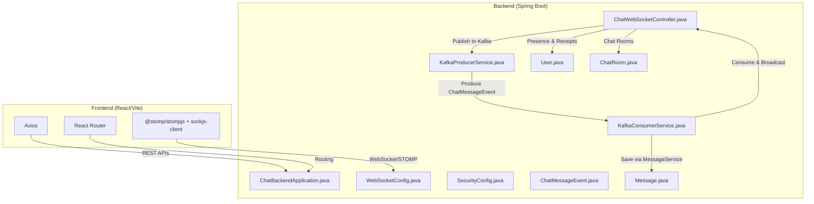
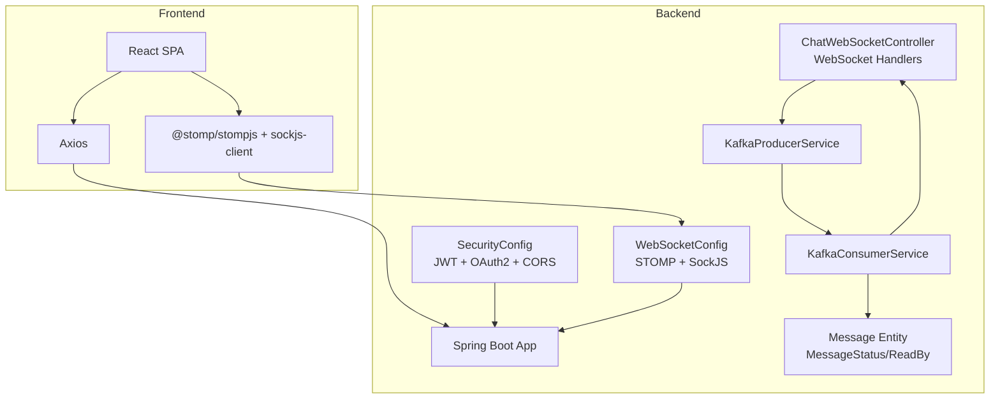
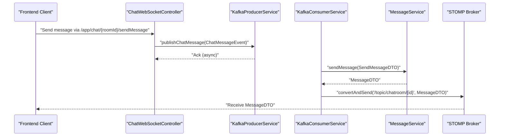
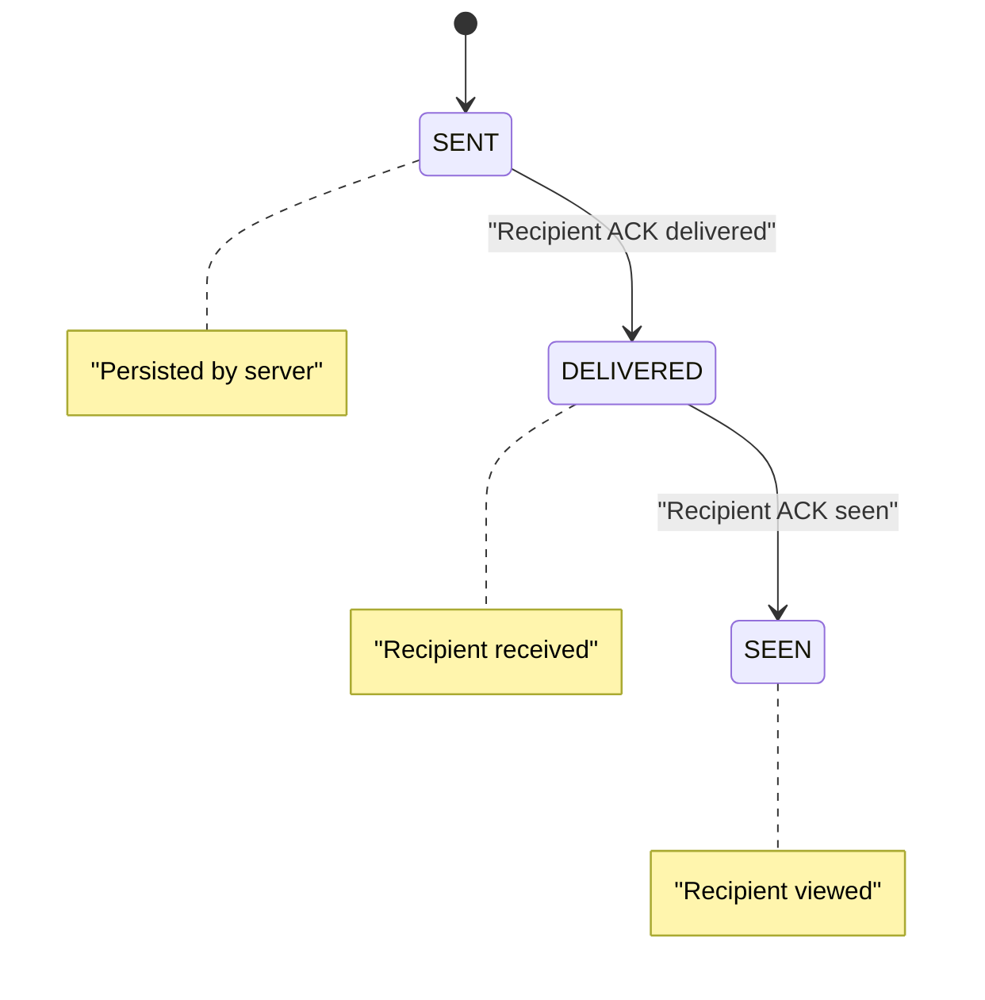
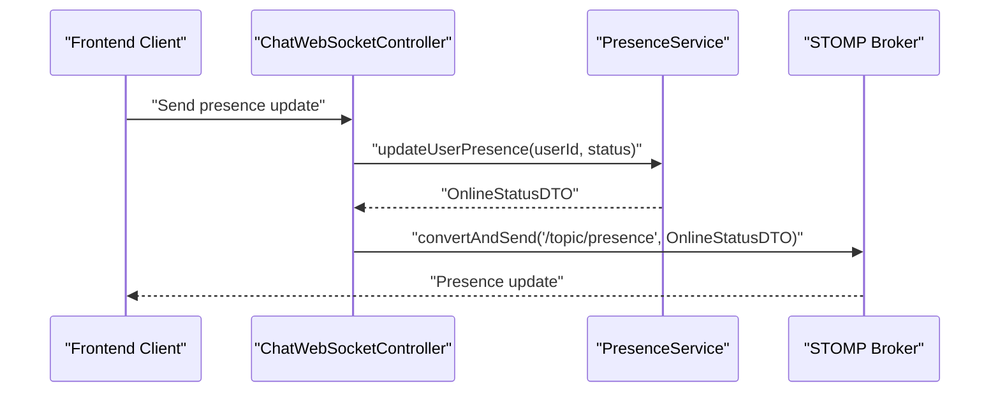
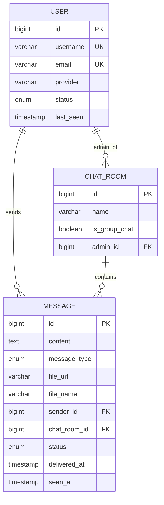
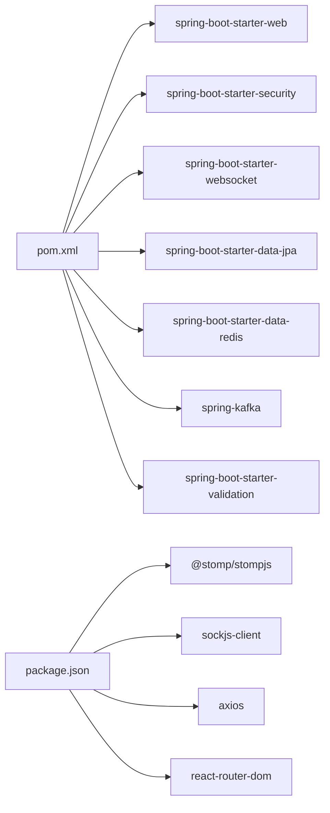

# Project Overview

<cite>
**Referenced Files in This Document**
- [README.md](file://README.md)
- [ChatBackendApplication.java](file://src/main/java/com/chatify/chat_backend/ChatBackendApplication.java)
- [pom.xml](file://pom.xml)
- [WebSocketConfig.java](file://src/main/java/com/chatify/chat_backend/config/WebSocketConfig.java)
- [SecurityConfig.java](file://src/main/java/com/chatify/chat_backend/config/SecurityConfig.java)
- [ChatWebSocketController.java](file://src/main/java/com/chatify/chat_backend/controller/ChatWebSocketController.java)
- [KafkaProducerService.java](file://src/main/java/com/chatify/chat_backend/service/KafkaProducerService.java)
- [KafkaConsumerService.java](file://src/main/java/com/chatify/chat_backend/service/KafkaConsumerService.java)
- [ChatMessageEvent.java](file://src/main/java/com/chatify/chat_backend/dto/ChatMessageEvent.java)
- [Message.java](file://src/main/java/com/chatify/chat_backend/entity/Message.java)
- [User.java](file://src/main/java/com/chatify/chat_backend/entity/User.java)
- [ChatRoom.java](file://src/main/java/com/chatify/chat_backend/entity/ChatRoom.java)
- [MESSAGE_DELIVERY_DESIGN.md](file://MESSAGE_DELIVERY_DESIGN.md)
- [package.json](file://chatify-frontend/package.json)
</cite>

## Table of Contents
1. [Introduction](#introduction)
2. [Project Structure](#project-structure)
3. [Core Components](#core-components)
4. [Architecture Overview](#architecture-overview)
5. [Detailed Component Analysis](#detailed-component-analysis)
6. [Dependency Analysis](#dependency-analysis)
7. [Performance Considerations](#performance-considerations)
8. [Troubleshooting Guide](#troubleshooting-guide)
9. [Conclusion](#conclusion)

## Introduction
Chatify is a modern real-time chat application designed as a full-stack messaging platform. It enables private and group conversations with rich features such as live messaging, typing indicators, read receipts, delivery confirmations, online presence, and file sharing. The backend is built with Spring Boot, while the frontend leverages React and Vite. Real-time communication is powered by WebSocket/STOMP over SockJS on the backend and @stomp/stompjs/sockjs-client on the frontend. Security is enforced via Spring Security with JWT authentication and refresh tokens. The system adopts an event-driven architecture using Apache Kafka to reliably persist and broadcast messages, ensuring scalability and eventual consistency.

## Project Structure
The repository is organized into a backend module (Spring Boot) and a frontend module (React/Vite). The backend exposes REST APIs and WebSocket endpoints, manages authentication, and coordinates message delivery and presence updates. The frontend provides user interfaces for login, chat windows, typing indicators, and presence displays, integrating with the backend via HTTP and WebSocket connections.

**Diagram sources**
- [ChatBackendApplication.java:1-14](file://src/main/java/com/chatify/chat_backend/ChatBackendApplication.java#L1-L14)
- [WebSocketConfig.java:1-111](file://src/main/java/com/chatify/chat_backend/config/WebSocketConfig.java#L1-L111)
- [SecurityConfig.java:1-120](file://src/main/java/com/chatify/chat_backend/config/SecurityConfig.java#L1-L120)
- [ChatWebSocketController.java:1-181](file://src/main/java/com/chatify/chat_backend/controller/ChatWebSocketController.java#L1-L181)
- [KafkaProducerService.java:1-50](file://src/main/java/com/chatify/chat_backend/service/KafkaProducerService.java#L1-L50)
- [KafkaConsumerService.java:1-72](file://src/main/java/com/chatify/chat_backend/service/KafkaConsumerService.java#L1-L72)
- [ChatMessageEvent.java:1-25](file://src/main/java/com/chatify/chat_backend/dto/ChatMessageEvent.java#L1-L25)
- [Message.java:1-69](file://src/main/java/com/chatify/chat_backend/entity/Message.java#L1-L69)
- [User.java:1-56](file://src/main/java/com/chatify/chat_backend/entity/User.java#L1-L56)
- [ChatRoom.java:1-45](file://src/main/java/com/chatify/chat_backend/entity/ChatRoom.java#L1-L45)
- [package.json:12-23](file://chatify-frontend/package.json#L12-L23)

**Section sources**
- [README.md:17-34](file://README.md#L17-L34)
- [README.md:159-185](file://README.md#L159-L185)
- [pom.xml:40-155](file://pom.xml#L40-L155)
- [package.json:12-23](file://chatify-frontend/package.json#L12-L23)

## Core Components
- Real-time messaging via WebSocket/STOMP: The backend registers a STOMP endpoint and configures a simple broker for topics and user destinations. Authentication is validated using JWT during the WebSocket CONNECT frame.
- Event-driven message pipeline: Messages are published as events to a Kafka topic and consumed to persist and broadcast to subscribed clients.
- Presence and receipts: Presence updates are handled via WebSocket, and delivery/read receipts are implemented with batched acknowledgements and server-side state transitions.
- Authentication and security: JWT-based authentication with refresh tokens, OAuth2 support, and CORS configuration for cross-origin access.
- Data model: Entities for users, chat rooms, and messages define relationships and statuses used by the message delivery system.

Practical examples:
- Sending a message in a chat room triggers a WebSocket message that is published to Kafka; consumers save it and broadcast it to all room subscribers.
- When a user opens a chat, a batched “seen” acknowledgment updates message states and notifies the sender.
- When a user starts typing, a typing indicator is published to the room’s typing topic and rendered in the UI.

**Section sources**
- [README.md:5-16](file://README.md#L5-L16)
- [WebSocketConfig.java:44-48](file://src/main/java/com/chatify/chat_backend/config/WebSocketConfig.java#L44-L48)
- [ChatWebSocketController.java:53-110](file://src/main/java/com/chatify/chat_backend/controller/ChatWebSocketController.java#L53-L110)
- [KafkaProducerService.java:32-37](file://src/main/java/com/chatify/chat_backend/service/KafkaProducerService.java#L32-L37)
- [KafkaConsumerService.java:34-59](file://src/main/java/com/chatify/chat_backend/service/KafkaConsumerService.java#L34-L59)
- [MESSAGE_DELIVERY_DESIGN.md:29-50](file://MESSAGE_DELIVERY_DESIGN.md#L29-L50)

## Architecture Overview
The system combines synchronous REST APIs for authentication and file uploads with asynchronous event streaming for reliable message delivery. WebSocket/STOMP provides low-latency, bidirectional communication for presence, typing, and receipts. Kafka decouples producers (WebSocket handlers) from consumers (message persistence and broadcasting), enabling scalability and resilience.

**Diagram sources**
- [SecurityConfig.java:61-90](file://src/main/java/com/chatify/chat_backend/config/SecurityConfig.java#L61-L90)
- [WebSocketConfig.java:44-57](file://src/main/java/com/chatify/chat_backend/config/WebSocketConfig.java#L44-L57)
- [ChatWebSocketController.java:53-181](file://src/main/java/com/chatify/chat_backend/controller/ChatWebSocketController.java#L53-L181)
- [KafkaProducerService.java:32-37](file://src/main/java/com/chatify/chat_backend/service/KafkaProducerService.java#L32-L37)
- [KafkaConsumerService.java:34-59](file://src/main/java/com/chatify/chat_backend/service/KafkaConsumerService.java#L34-L59)
- [Message.java:51-67](file://src/main/java/com/chatify/chat_backend/entity/Message.java#L51-L67)

## Detailed Component Analysis

### Real-Time Messaging Pipeline (WebSocket + Kafka)
This pipeline ensures reliable message delivery with clear separation of concerns:
- Producer: WebSocket controller publishes a structured event to Kafka.
- Consumer: Kafka consumer saves the message and broadcasts it to the room’s topic.
- Client: Subscribes to room topics to receive messages in real time.

**Diagram sources**
- [ChatWebSocketController.java:81-110](file://src/main/java/com/chatify/chat_backend/controller/ChatWebSocketController.java#L81-L110)
- [KafkaProducerService.java:32-37](file://src/main/java/com/chatify/chat_backend/service/KafkaProducerService.java#L32-L37)
- [KafkaConsumerService.java:34-59](file://src/main/java/com/chatify/chat_backend/service/KafkaConsumerService.java#L34-L59)

**Section sources**
- [ChatWebSocketController.java:53-110](file://src/main/java/com/chatify/chat_backend/controller/ChatWebSocketController.java#L53-L110)
- [KafkaProducerService.java:32-37](file://src/main/java/com/chatify/chat_backend/service/KafkaProducerService.java#L32-L37)
- [KafkaConsumerService.java:34-59](file://src/main/java/com/chatify/chat_backend/service/KafkaConsumerService.java#L34-L59)

### Message Delivery and Read Receipts
The system enforces a strict state machine for message lifecycle and uses batched acknowledgments to maintain correctness under network and crash conditions.

**Diagram sources**
- [MESSAGE_DELIVERY_DESIGN.md:29-50](file://MESSAGE_DELIVERY_DESIGN.md#L29-L50)

**Section sources**
- [MESSAGE_DELIVERY_DESIGN.md:78-125](file://MESSAGE_DELIVERY_DESIGN.md#L78-L125)
- [ChatWebSocketController.java:112-131](file://src/main/java/com/chatify/chat_backend/controller/ChatWebSocketController.java#L112-L131)
- [ChatWebSocketController.java:144-180](file://src/main/java/com/chatify/chat_backend/controller/ChatWebSocketController.java#L144-L180)

### Presence Tracking
Presence updates are handled via WebSocket, allowing clients to subscribe to global presence topics and react to online/offline changes.

**Diagram sources**
- [ChatWebSocketController.java:133-142](file://src/main/java/com/chatify/chat_backend/controller/ChatWebSocketController.java#L133-L142)

**Section sources**
- [ChatWebSocketController.java:133-142](file://src/main/java/com/chatify/chat_backend/controller/ChatWebSocketController.java#L133-L142)

### Data Model for Chat
The data model supports chat rooms, users, and messages with explicit status tracking and metadata for file attachments.

**Diagram sources**
- [User.java:20-45](file://src/main/java/com/chatify/chat_backend/entity/User.java#L20-L45)
- [ChatRoom.java:19-39](file://src/main/java/com/chatify/chat_backend/entity/ChatRoom.java#L19-L39)
- [Message.java:21-67](file://src/main/java/com/chatify/chat_backend/entity/Message.java#L21-L67)

**Section sources**
- [User.java:18-56](file://src/main/java/com/chatify/chat_backend/entity/User.java#L18-L56)
- [ChatRoom.java:17-45](file://src/main/java/com/chatify/chat_backend/entity/ChatRoom.java#L17-L45)
- [Message.java:19-69](file://src/main/java/com/chatify/chat_backend/entity/Message.java#L19-L69)

## Dependency Analysis
The backend depends on Spring Boot starters for web, security, WebSocket, JPA, Redis, Kafka, and validation. The frontend integrates React, routing, HTTP client, and WebSocket libraries.

**Diagram sources**
- [pom.xml:40-155](file://pom.xml#L40-L155)
- [package.json:12-23](file://chatify-frontend/package.json#L12-L23)

**Section sources**
- [pom.xml:40-155](file://pom.xml#L40-L155)
- [package.json:12-23](file://chatify-frontend/package.json#L12-L23)

## Performance Considerations
- WebSocket heartbeats: The STOMP broker is configured with periodic heartbeats to detect stale connections efficiently.
- Partitioning with Kafka: Events are keyed by chat room ID to ensure in-room ordering and enable horizontal scaling across partitions.
- Asynchronous processing: Publishing to Kafka and consuming via a dedicated service decouples message ingestion from persistence and broadcasting.
- Caching and presence: Redis-backed caching and presence tracking reduce repeated database queries for frequently accessed user states.

**Section sources**
- [WebSocketConfig.java:59-66](file://src/main/java/com/chatify/chat_backend/config/WebSocketConfig.java#L59-L66)
- [KafkaProducerService.java:32-37](file://src/main/java/com/chatify/chat_backend/service/KafkaProducerService.java#L32-L37)

## Troubleshooting Guide
Common issues and resolutions:
- WebSocket connection failures: Verify backend is running, CORS origins are configured, and the Authorization header contains a valid JWT token.
- Database connectivity: Confirm PostgreSQL is running, credentials are correct, and the database/schema permissions are granted.
- Build problems: Ensure Java 17 and Node.js 18+ are installed, and clear caches if necessary.

**Section sources**
- [README.md:189-208](file://README.md#L189-L208)

## Conclusion
Chatify delivers a robust, scalable real-time chat platform by combining Spring Boot and React with WebSocket/STOMP for instant messaging, JWT for secure authentication, and Kafka for event-driven reliability. Its clear separation of concerns, strict message state machine, and modular architecture make it suitable for both learning and production-grade deployments. The documented design and endpoints provide a solid foundation for extending features such as advanced presence, reactions, and moderation tools.