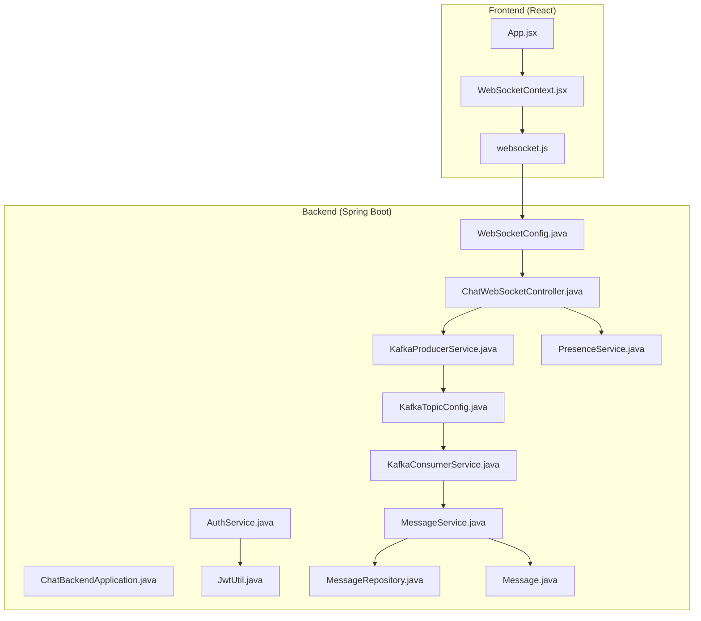
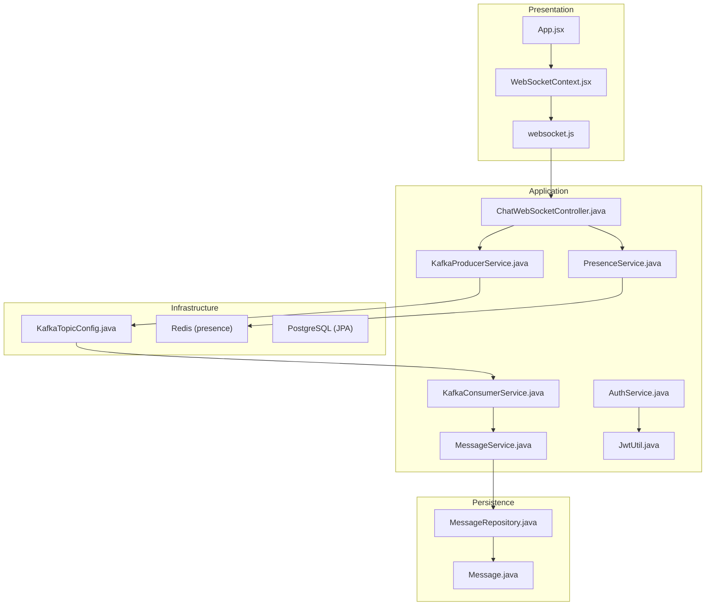
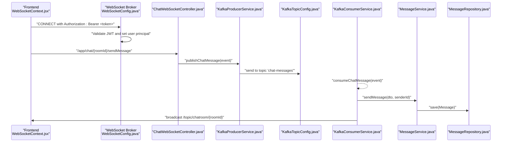
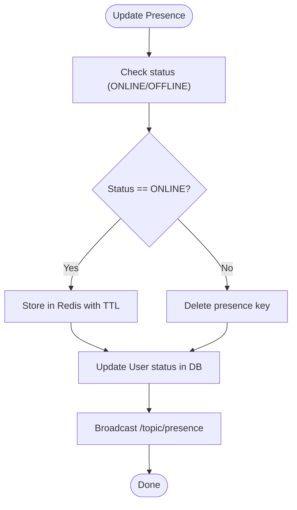
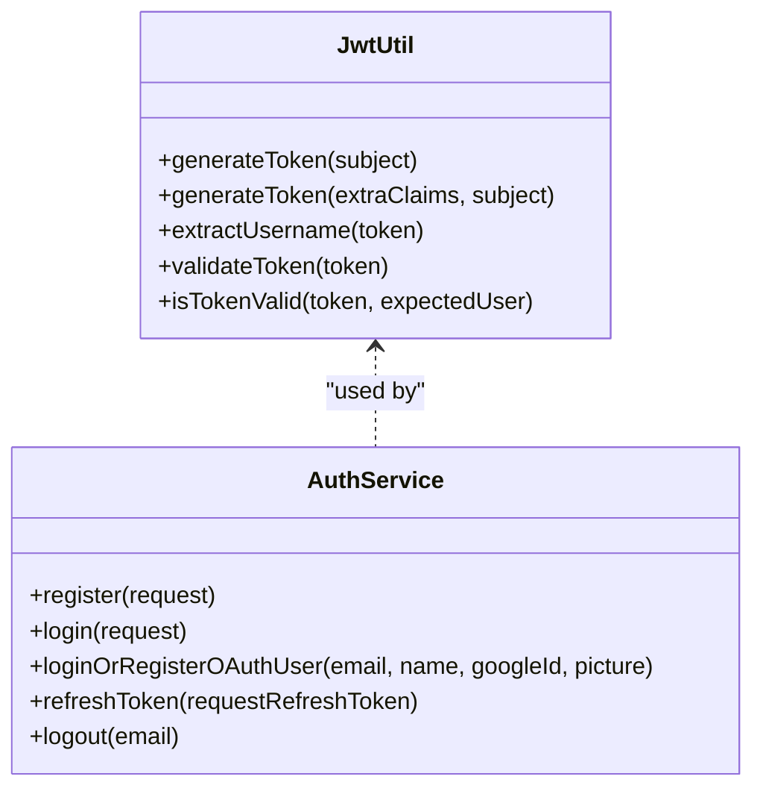
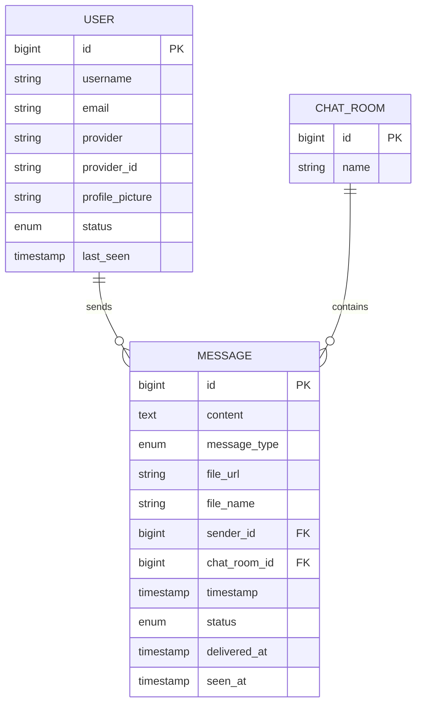
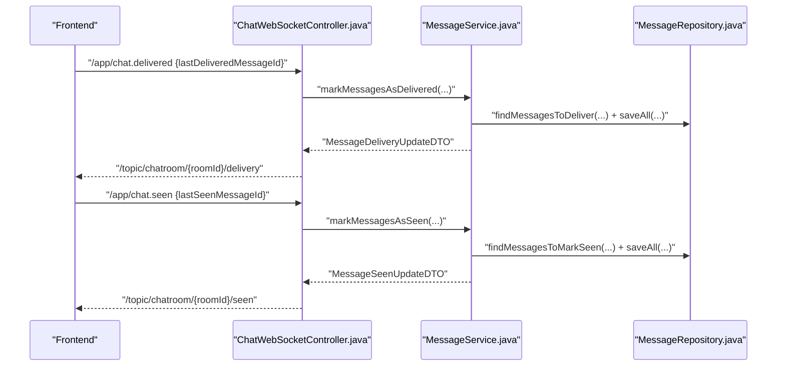
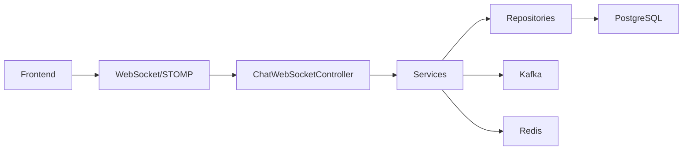

# System Architecture

<cite>
**Referenced Files in This Document**
- [ChatBackendApplication.java](file://src/main/java/com/chatify/chat_backend/ChatBackendApplication.java)
- [WebSocketConfig.java](file://src/main/java/com/chatify/chat_backend/config/WebSocketConfig.java)
- [KafkaTopicConfig.java](file://src/main/java/com/chatify/chat_backend/config/KafkaTopicConfig.java)
- [AuthService.java](file://src/main/java/com/chatify/chat_backend/service/AuthService.java)
- [ChatWebSocketController.java](file://src/main/java/com/chatify/chat_backend/controller/ChatWebSocketController.java)
- [KafkaProducerService.java](file://src/main/java/com/chatify/chat_backend/service/KafkaProducerService.java)
- [KafkaConsumerService.java](file://src/main/java/com/chatify/chat_backend/service/KafkaConsumerService.java)
- [MessageRepository.java](file://src/main/java/com/chatify/chat_backend/repository/MessageRepository.java)
- [Message.java](file://src/main/java/com/chatify/chat_backend/entity/Message.java)
- [MessageService.java](file://src/main/java/com/chatify/chat_backend/service/MessageService.java)
- [PresenceService.java](file://src/main/java/com/chatify/chat_backend/service/PresenceService.java)
- [JwtUtil.java](file://src/main/java/com/chatify/chat_backend/security/JwtUtil.java)
- [App.jsx](file://chatify-frontend/src/App.jsx)
- [WebSocketContext.jsx](file://chatify-frontend/src/context/WebSocketContext.jsx)
- [websocket.js](file://chatify-frontend/src/services/websocket.js)
</cite>

## Table of Contents
1. [Introduction](#introduction)
2. [Project Structure](#project-structure)
3. [Core Components](#core-components)
4. [Architecture Overview](#architecture-overview)
5. [Detailed Component Analysis](#detailed-component-analysis)
6. [Dependency Analysis](#dependency-analysis)
7. [Performance Considerations](#performance-considerations)
8. [Troubleshooting Guide](#troubleshooting-guide)
9. [Conclusion](#conclusion)

## Introduction
This document describes the Chatify system architecture, focusing on a layered design with a React frontend and a Spring Boot backend. The backend implements a microservices-like separation within a single application, modularizing concerns such as authentication, messaging, presence tracking, and file storage. Real-time communication is powered by WebSocket/STOMP for instant messaging, with Kafka acting as an event bus for asynchronous processing. The system boundary includes internal components and external dependencies such as PostgreSQL (via JPA), Redis (for presence), and Kafka.

## Project Structure
The repository is organized into:
- Frontend: React application under chatify-frontend with routing, contexts, hooks, and WebSocket integration.
- Backend: Spring Boot application under src/main/java with layered packages for configuration, controllers, DTOs, entities, exceptions, listeners, repositories, security, and services.

**Diagram sources**
- [App.jsx:12-72](file://chatify-frontend/src/App.jsx#L12-L72)
- [WebSocketContext.jsx:10-190](file://chatify-frontend/src/context/WebSocketContext.jsx#L10-L190)
- [websocket.js:5-327](file://chatify-frontend/src/services/websocket.js#L5-L327)
- [ChatBackendApplication.java:6-11](file://src/main/java/com/chatify/chat_backend/ChatBackendApplication.java#L6-L11)
- [WebSocketConfig.java:30-111](file://src/main/java/com/chatify/chat_backend/config/WebSocketConfig.java#L30-L111)
- [KafkaTopicConfig.java:10-23](file://src/main/java/com/chatify/chat_backend/config/KafkaTopicConfig.java#L10-L23)
- [AuthService.java:21-162](file://src/main/java/com/chatify/chat_backend/service/AuthService.java#L21-L162)
- [ChatWebSocketController.java:22-181](file://src/main/java/com/chatify/chat_backend/controller/ChatWebSocketController.java#L22-L181)
- [KafkaProducerService.java:13-50](file://src/main/java/com/chatify/chat_backend/service/KafkaProducerService.java#L13-L50)
- [KafkaConsumerService.java:12-72](file://src/main/java/com/chatify/chat_backend/service/KafkaConsumerService.java#L12-L72)
- [MessageService.java:29-286](file://src/main/java/com/chatify/chat_backend/service/MessageService.java#L29-L286)
- [PresenceService.java:19-132](file://src/main/java/com/chatify/chat_backend/service/PresenceService.java#L19-L132)
- [JwtUtil.java:18-145](file://src/main/java/com/chatify/chat_backend/security/JwtUtil.java#L18-L145)
- [MessageRepository.java:17-111](file://src/main/java/com/chatify/chat_backend/repository/MessageRepository.java#L17-L111)
- [Message.java:13-69](file://src/main/java/com/chatify/chat_backend/entity/Message.java#L13-L69)

**Section sources**
- [ChatBackendApplication.java:6-11](file://src/main/java/com/chatify/chat_backend/ChatBackendApplication.java#L6-L11)
- [App.jsx:12-72](file://chatify-frontend/src/App.jsx#L12-L72)

## Core Components
- Presentation Layer (React): Provides routing, authentication context, WebSocket context/provider, and UI components for chat, sidebar, and typing indicators.
- Business Logic Layer (Spring Services): Implements authentication, message handling, presence tracking, and Kafka event publishing/consuming.
- Data Access Layer (JPA Repositories): Manages persistence for messages, chat rooms, users, and user chat state.
- Infrastructure Layer (External Services): Uses Kafka for asynchronous messaging, Redis for presence caching, and PostgreSQL via JPA.

Key responsibilities:
- Authentication: JWT generation/validation and refresh token management.
- Messaging: WebSocket handlers, Kafka producers/consumers, and message persistence.
- Presence: Online/offline status with Redis caching and broadcast.
- File Storage: File upload endpoints and DTOs (integration points for cloud storage).

**Section sources**
- [AuthService.java:21-162](file://src/main/java/com/chatify/chat_backend/service/AuthService.java#L21-L162)
- [MessageService.java:29-286](file://src/main/java/com/chatify/chat_backend/service/MessageService.java#L29-L286)
- [PresenceService.java:19-132](file://src/main/java/com/chatify/chat_backend/service/PresenceService.java#L19-L132)
- [KafkaProducerService.java:13-50](file://src/main/java/com/chatify/chat_backend/service/KafkaProducerService.java#L13-L50)
- [KafkaConsumerService.java:12-72](file://src/main/java/com/chatify/chat_backend/service/KafkaConsumerService.java#L12-L72)
- [MessageRepository.java:17-111](file://src/main/java/com/chatify/chat_backend/repository/MessageRepository.java#L17-L111)
- [Message.java:13-69](file://src/main/java/com/chatify/chat_backend/entity/Message.java#L13-L69)

## Architecture Overview
The system follows a layered architecture with clear separation of concerns:
- Presentation: React SPA with routing and WebSocket integration.
- Application: Spring Boot controllers and services.
- Persistence: JPA repositories and entities.
- Integration: Kafka for event-driven messaging, Redis for presence, and JWT for auth.

**Diagram sources**
- [App.jsx:12-72](file://chatify-frontend/src/App.jsx#L12-L72)
- [WebSocketContext.jsx:10-190](file://chatify-frontend/src/context/WebSocketContext.jsx#L10-L190)
- [websocket.js:5-327](file://chatify-frontend/src/services/websocket.js#L5-L327)
- [ChatWebSocketController.java:22-181](file://src/main/java/com/chatify/chat_backend/controller/ChatWebSocketController.java#L22-L181)
- [AuthService.java:21-162](file://src/main/java/com/chatify/chat_backend/service/AuthService.java#L21-L162)
- [MessageService.java:29-286](file://src/main/java/com/chatify/chat_backend/service/MessageService.java#L29-L286)
- [PresenceService.java:19-132](file://src/main/java/com/chatify/chat_backend/service/PresenceService.java#L19-L132)
- [KafkaProducerService.java:13-50](file://src/main/java/com/chatify/chat_backend/service/KafkaProducerService.java#L13-L50)
- [KafkaConsumerService.java:12-72](file://src/main/java/com/chatify/chat_backend/service/KafkaConsumerService.java#L12-L72)
- [MessageRepository.java:17-111](file://src/main/java/com/chatify/chat_backend/repository/MessageRepository.java#L17-L111)
- [Message.java:13-69](file://src/main/java/com/chatify/chat_backend/entity/Message.java#L13-L69)
- [KafkaTopicConfig.java:10-23](file://src/main/java/com/chatify/chat_backend/config/KafkaTopicConfig.java#L10-L23)
- [JwtUtil.java:18-145](file://src/main/java/com/chatify/chat_backend/security/JwtUtil.java#L18-L145)

## Detailed Component Analysis

### Real-Time Messaging with WebSocket/STOMP
The frontend establishes a STOMP connection over SockJS, authenticates using JWT, and subscribes to per-room topics. The backend validates JWT in the inbound channel and forwards messages to Kafka for asynchronous processing.

**Diagram sources**
- [WebSocketContext.jsx:50-112](file://chatify-frontend/src/context/WebSocketContext.jsx#L50-L112)
- [WebSocketConfig.java:68-110](file://src/main/java/com/chatify/chat_backend/config/WebSocketConfig.java#L68-L110)
- [ChatWebSocketController.java:81-110](file://src/main/java/com/chatify/chat_backend/controller/ChatWebSocketController.java#L81-L110)
- [KafkaProducerService.java:32-49](file://src/main/java/com/chatify/chat_backend/service/KafkaProducerService.java#L32-L49)
- [KafkaTopicConfig.java:17-22](file://src/main/java/com/chatify/chat_backend/config/KafkaTopicConfig.java#L17-L22)
- [KafkaConsumerService.java:34-71](file://src/main/java/com/chatify/chat_backend/service/KafkaConsumerService.java#L34-L71)
- [MessageService.java:50-78](file://src/main/java/com/chatify/chat_backend/service/MessageService.java#L50-L78)
- [MessageRepository.java:17-111](file://src/main/java/com/chatify/chat_backend/repository/MessageRepository.java#L17-L111)

**Section sources**
- [WebSocketContext.jsx:50-112](file://chatify-frontend/src/context/WebSocketContext.jsx#L50-L112)
- [WebSocketConfig.java:68-110](file://src/main/java/com/chatify/chat_backend/config/WebSocketConfig.java#L68-L110)
- [ChatWebSocketController.java:81-110](file://src/main/java/com/chatify/chat_backend/controller/ChatWebSocketController.java#L81-L110)
- [KafkaProducerService.java:32-49](file://src/main/java/com/chatify/chat_backend/service/KafkaProducerService.java#L32-L49)
- [KafkaConsumerService.java:34-71](file://src/main/java/com/chatify/chat_backend/service/KafkaConsumerService.java#L34-L71)
- [MessageService.java:50-78](file://src/main/java/com/chatify/chat_backend/service/MessageService.java#L50-L78)

### Presence Tracking with Redis
Presence updates are persisted to Redis with TTL and broadcast to clients. Offline users fall back to database queries.

**Diagram sources**
- [PresenceService.java:49-103](file://src/main/java/com/chatify/chat_backend/service/PresenceService.java#L49-L103)

**Section sources**
- [PresenceService.java:49-103](file://src/main/java/com/chatify/chat_backend/service/PresenceService.java#L49-L103)

### Authentication and JWT Utilities
The backend generates and validates JWT tokens, manages refresh tokens, and integrates JWT validation into the WebSocket channel interceptor.

**Diagram sources**
- [JwtUtil.java:18-145](file://src/main/java/com/chatify/chat_backend/security/JwtUtil.java#L18-L145)
- [AuthService.java:21-162](file://src/main/java/com/chatify/chat_backend/service/AuthService.java#L21-L162)

**Section sources**
- [JwtUtil.java:18-145](file://src/main/java/com/chatify/chat_backend/security/JwtUtil.java#L18-L145)
- [AuthService.java:21-162](file://src/main/java/com/chatify/chat_backend/service/AuthService.java#L21-L162)

### Data Model for Messages
The message entity encapsulates content, type, file metadata, sender, chat room, read receipts, and delivery/seen timestamps.

**Diagram sources**
- [Message.java:13-69](file://src/main/java/com/chatify/chat_backend/entity/Message.java#L13-L69)

**Section sources**
- [Message.java:13-69](file://src/main/java/com/chatify/chat_backend/entity/Message.java#L13-L69)

### Delivery and Seen Receipts
The backend tracks delivery and seen statuses and broadcasts updates to subscribed clients.

**Diagram sources**
- [ChatWebSocketController.java:144-180](file://src/main/java/com/chatify/chat_backend/controller/ChatWebSocketController.java#L144-L180)
- [MessageService.java:194-269](file://src/main/java/com/chatify/chat_backend/service/MessageService.java#L194-L269)
- [MessageRepository.java:42-59](file://src/main/java/com/chatify/chat_backend/repository/MessageRepository.java#L42-L59)

**Section sources**
- [ChatWebSocketController.java:144-180](file://src/main/java/com/chatify/chat_backend/controller/ChatWebSocketController.java#L144-L180)
- [MessageService.java:194-269](file://src/main/java/com/chatify/chat_backend/service/MessageService.java#L194-L269)
- [MessageRepository.java:42-59](file://src/main/java/com/chatify/chat_backend/repository/MessageRepository.java#L42-L59)

## Dependency Analysis
The backend exhibits clean layering with low coupling between presentation and application logic. Controllers depend on services, services depend on repositories, and Kafka bridges asynchronous processing. External dependencies include Kafka, Redis, and PostgreSQL.

**Diagram sources**
- [ChatWebSocketController.java:22-181](file://src/main/java/com/chatify/chat_backend/controller/ChatWebSocketController.java#L22-L181)
- [MessageService.java:29-286](file://src/main/java/com/chatify/chat_backend/service/MessageService.java#L29-L286)
- [MessageRepository.java:17-111](file://src/main/java/com/chatify/chat_backend/repository/MessageRepository.java#L17-L111)
- [KafkaProducerService.java:13-50](file://src/main/java/com/chatify/chat_backend/service/KafkaProducerService.java#L13-L50)
- [KafkaConsumerService.java:12-72](file://src/main/java/com/chatify/chat_backend/service/KafkaConsumerService.java#L12-L72)
- [PresenceService.java:19-132](file://src/main/java/com/chatify/chat_backend/service/PresenceService.java#L19-L132)

**Section sources**
- [ChatWebSocketController.java:22-181](file://src/main/java/com/chatify/chat_backend/controller/ChatWebSocketController.java#L22-L181)
- [MessageService.java:29-286](file://src/main/java/com/chatify/chat_backend/service/MessageService.java#L29-L286)
- [MessageRepository.java:17-111](file://src/main/java/com/chatify/chat_backend/repository/MessageRepository.java#L17-L111)
- [KafkaProducerService.java:13-50](file://src/main/java/com/chatify/chat_backend/service/KafkaProducerService.java#L13-L50)
- [KafkaConsumerService.java:12-72](file://src/main/java/com/chatify/chat_backend/service/KafkaConsumerService.java#L12-L72)
- [PresenceService.java:19-132](file://src/main/java/com/chatify/chat_backend/service/PresenceService.java#L19-L132)

## Performance Considerations
- Partitioning: Kafka topic is configured with multiple partitions to scale throughput.
- Ordering: Kafka producer keys messages by chat room ID to preserve ordering per room.
- Caching: Presence data cached in Redis with TTL reduces DB load and improves response times.
- Asynchronous Processing: Kafka decouples message ingestion from real-time broadcasting, improving latency and resilience.
- Pagination: Message retrieval supports pagination to limit payload sizes.
- Heartbeats: WebSocket heartbeats configured to maintain connection health.

[No sources needed since this section provides general guidance]

## Troubleshooting Guide
Common issues and remedies:
- WebSocket authentication failures: Verify Authorization header and JWT validity in the WebSocket channel interceptor.
- Kafka delivery errors: Inspect producer callbacks and consumer error handling; ensure topic configuration and group ID match.
- Presence inconsistencies: Confirm Redis TTL and fallback to DB for offline users.
- Message ordering anomalies: Ensure Kafka key is chat room ID and partitions are sufficient for concurrency.

**Section sources**
- [WebSocketConfig.java:75-105](file://src/main/java/com/chatify/chat_backend/config/WebSocketConfig.java#L75-L105)
- [KafkaProducerService.java:35-48](file://src/main/java/com/chatify/chat_backend/service/KafkaProducerService.java#L35-L48)
- [KafkaConsumerService.java:64-70](file://src/main/java/com/chatify/chat_backend/service/KafkaConsumerService.java#L64-L70)
- [PresenceService.java:67-78](file://src/main/java/com/chatify/chat_backend/service/PresenceService.java#L67-L78)

## Conclusion
Chatify employs a layered, event-driven architecture that cleanly separates concerns while enabling real-time, scalable messaging. The combination of WebSocket/STOMP for live updates and Kafka for asynchronous processing provides robustness and performance. Modular services for authentication, messaging, and presence, backed by Redis and PostgreSQL, deliver a cohesive and extensible system suitable for growth.