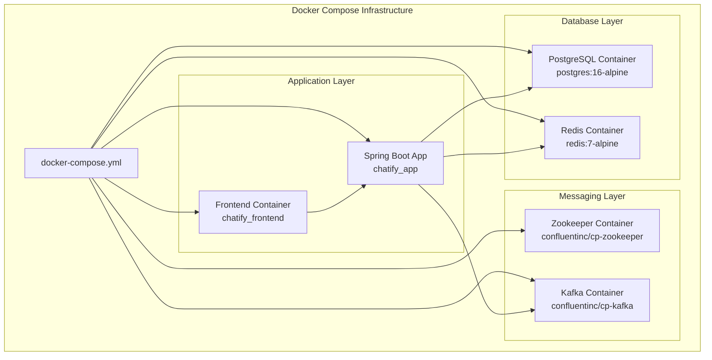
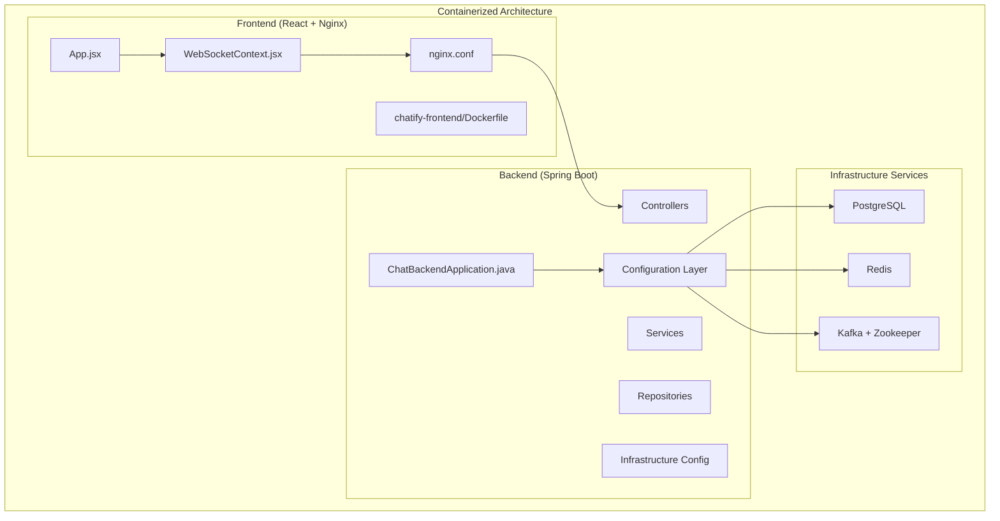
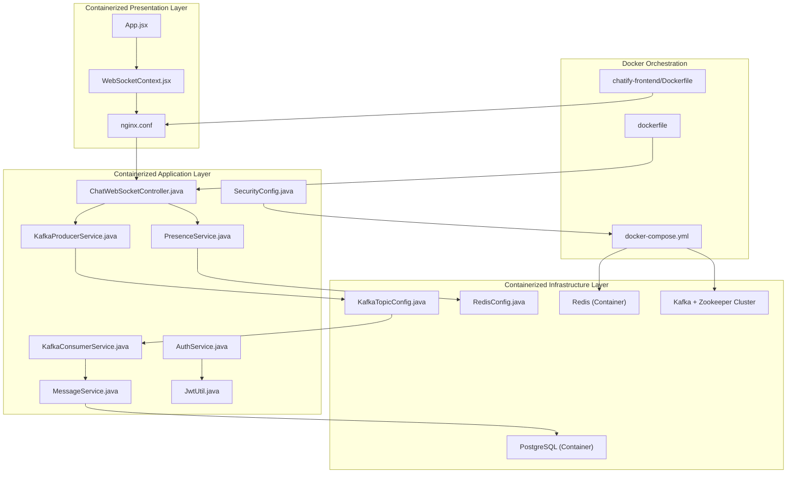
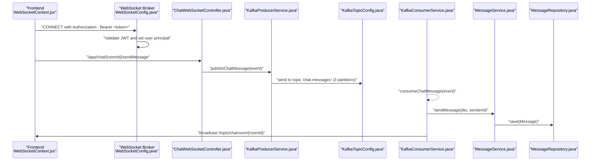
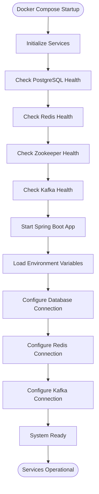
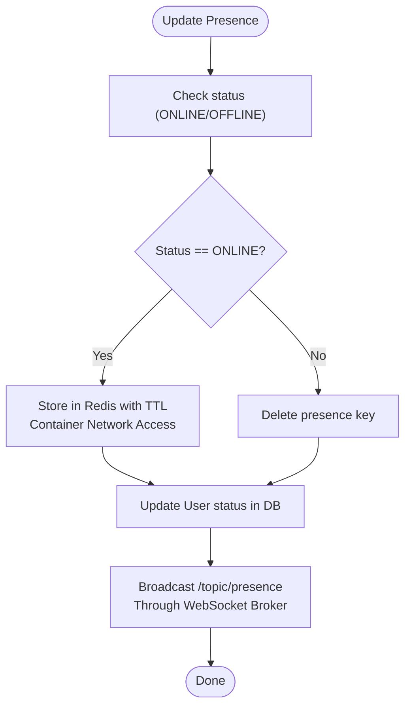
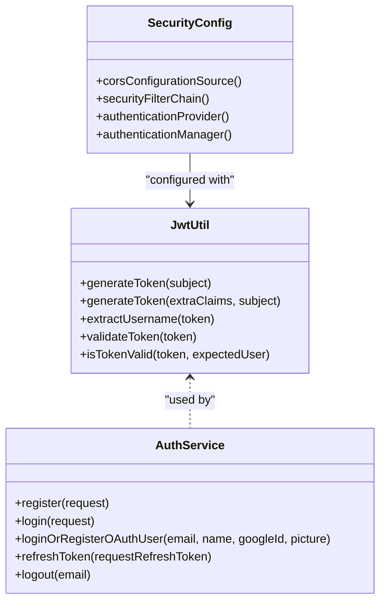
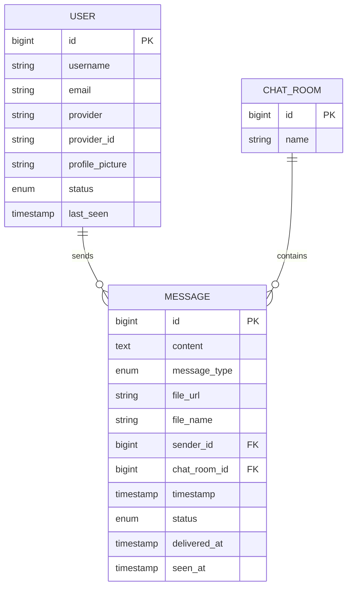
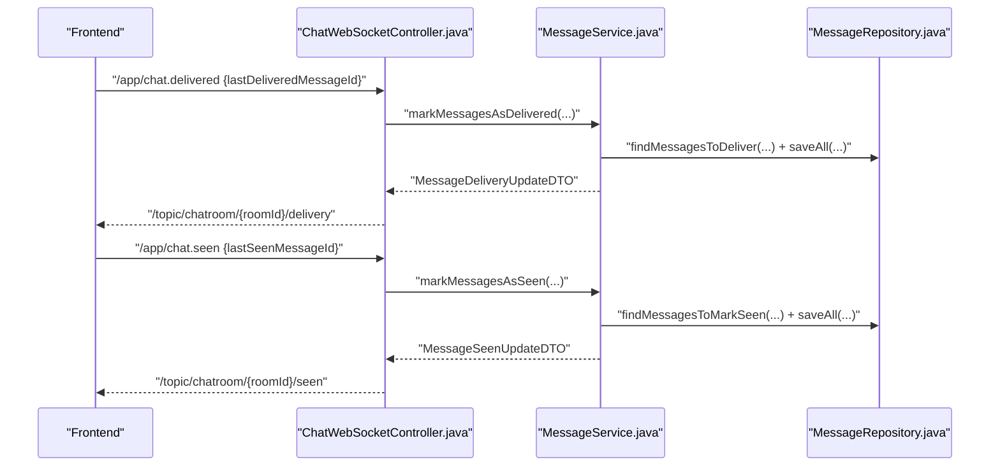
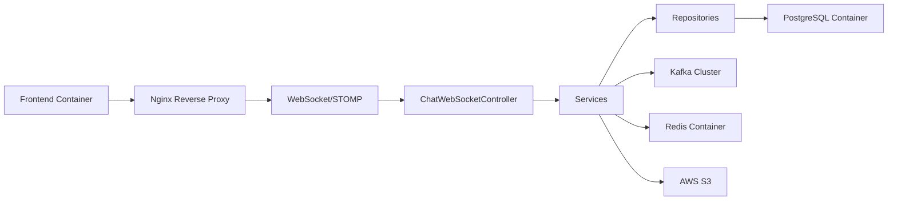

# System Architecture

<cite>
**Referenced Files in This Document**
- [ChatBackendApplication.java](file://src/main/java/com/chatify/chat_backend/ChatBackendApplication.java)
- [WebSocketConfig.java](file://src/main/java/com/chatify/chat_backend/config/WebSocketConfig.java)
- [KafkaTopicConfig.java](file://src/main/java/com/chatify/chat_backend/config/KafkaTopicConfig.java)
- [KafkaErrorHandlerConfig.java](file://src/main/java/com/chatify/chat_backend/config/KafkaErrorHandlerConfig.java)
- [AuthService.java](file://src/main/java/com/chatify/chat_backend/service/AuthService.java)
- [ChatWebSocketController.java](file://src/main/java/com/chatify/chat_backend/controller/ChatWebSocketController.java)
- [KafkaProducerService.java](file://src/main/java/com/chatify/chat_backend/service/KafkaProducerService.java)
- [KafkaConsumerService.java](file://src/main/java/com/chatify/chat_backend/service/KafkaConsumerService.java)
- [MessageRepository.java](file://src/main/java/com/chatify/chat_backend/repository/MessageRepository.java)
- [Message.java](file://src/main/java/com/chatify/chat_backend/entity/Message.java)
- [MessageService.java](file://src/main/java/com/chatify/chat_backend/service/MessageService.java)
- [PresenceService.java](file://src/main/java/com/chatify/chat_backend/service/PresenceService.java)
- [JwtUtil.java](file://src/main/java/com/chatify/chat_backend/security/JwtUtil.java)
- [RedisConfig.java](file://src/main/java/com/chatify/chat_backend/config/RedisConfig.java)
- [SecurityConfig.java](file://src/main/java/com/chatify/chat_backend/config/SecurityConfig.java)
- [App.jsx](file://chatify-frontend/src/App.jsx)
- [WebSocketContext.jsx](file://chatify-frontend/src/context/WebSocketContext.jsx)
- [websocket.js](file://chatify-frontend/src/services/websocket.js)
- [docker-compose.yml](file://docker-compose.yml)
- [dockerfile](file://dockerfile)
- [chatify-frontend/Dockerfile](file://chatify-frontend/Dockerfile)
- [nginx.conf](file://chatify-frontend/nginx.conf)
- [application.properties](file://src/main/resources/application.properties)
- [application-docker.properties](file://src/main/resources/application-docker.properties)
</cite>

## Update Summary
**Changes Made**
- Added comprehensive containerized infrastructure documentation with Docker Compose setup
- Enhanced distributed messaging platform explanation with Kafka cluster configuration
- Updated system boundaries to include container orchestration and microservice-like deployment
- Expanded infrastructure layer documentation with Redis, PostgreSQL, and Kafka services
- Added container networking and service discovery details
- Updated deployment architecture with Nginx reverse proxy and multi-stage builds

## Table of Contents
1. [Introduction](#introduction)
2. [Containerized Infrastructure](#containerized-infrastructure)
3. [Project Structure](#project-structure)
4. [Core Components](#core-components)
5. [Architecture Overview](#architecture-overview)
6. [Detailed Component Analysis](#detailed-component-analysis)
7. [Dependency Analysis](#dependency-analysis)
8. [Performance Considerations](#performance-considerations)
9. [Troubleshooting Guide](#troubleshooting-guide)
10. [Conclusion](#conclusion)

## Introduction
This document describes the Chatify system architecture, focusing on a layered design with a React frontend and a Spring Boot backend deployed in a containerized environment. The backend implements a microservices-like separation within a single application, modularizing concerns such as authentication, messaging, presence tracking, and file storage. Real-time communication is powered by WebSocket/STOMP for instant messaging, with Kafka acting as an event bus for asynchronous processing. The system operates within a distributed infrastructure managed by Docker Compose, featuring container orchestration, service discovery, and persistent storage across PostgreSQL, Redis, and Kafka services.

## Containerized Infrastructure

Chatify utilizes Docker Compose for containerized deployment, creating a distributed messaging platform with orchestrated services. The infrastructure consists of five primary containers: PostgreSQL for relational data persistence, Redis for caching and presence tracking, Zookeeper and Kafka for distributed messaging, and the Spring Boot application container.

**Diagram sources**
- [docker-compose.yml:1-137](file://docker-compose.yml#L1-L137)

### Service Dependencies and Health Checks

Each service defines health checks and startup dependencies to ensure proper initialization order:

- **PostgreSQL**: Health check using `pg_isready` with 5-second timeout
- **Redis**: Health check using `redis-cli ping` with password authentication
- **Zookeeper**: Health check verifying shell connectivity on port 2181
- **Kafka**: Health check listing topics on bootstrap server
- **Application**: Depends on all infrastructure services being healthy

### Multi-Stage Docker Builds

The system employs optimized multi-stage Docker builds for both backend and frontend:

**Backend Build Process:**
- Maven base image for compilation
- Eclipse Temurin JRE for runtime execution
- Non-root user execution for security
- Dedicated uploads directory with proper permissions

**Frontend Build Process:**
- Node.js Alpine for build stage
- Nginx Alpine for production serving
- Static asset optimization and proxy configuration

**Section sources**
- [docker-compose.yml:1-137](file://docker-compose.yml#L1-L137)
- [dockerfile:1-25](file://dockerfile#L1-L25)
- [chatify-frontend/Dockerfile:1-24](file://chatify-frontend/Dockerfile#L1-L24)

## Project Structure
The repository is organized into containerized components with clear separation between frontend, backend, and infrastructure:

- **Frontend**: React application with Nginx reverse proxy under chatify-frontend, configured for SPA routing and API proxying
- **Backend**: Spring Boot application under src/main/java with layered packages for configuration, controllers, DTOs, entities, exceptions, listeners, repositories, security, and services
- **Infrastructure**: Docker Compose orchestration defining service dependencies, health checks, and environment configurations
- **Configuration**: Environment-specific property files for local and Docker deployments

**Diagram sources**
- [App.jsx:12-72](file://chatify-frontend/src/App.jsx#L12-L72)
- [WebSocketContext.jsx:10-190](file://chatify-frontend/src/context/WebSocketContext.jsx#L10-L190)
- [nginx.conf:1-61](file://chatify-frontend/nginx.conf#L1-L61)
- [ChatBackendApplication.java:6-11](file://src/main/java/com/chatify/chat_backend/ChatBackendApplication.java#L6-L11)
- [docker-compose.yml:1-137](file://docker-compose.yml#L1-L137)

**Section sources**
- [docker-compose.yml:1-137](file://docker-compose.yml#L1-L137)
- [ChatBackendApplication.java:6-11](file://src/main/java/com/chatify/chat_backend/ChatBackendApplication.java#L6-L11)

## Core Components
- **Presentation Layer (React + Nginx)**: Provides routing, authentication context, WebSocket context/provider, and UI components for chat, sidebar, and typing indicators, with Nginx handling SPA routing and API/proxy forwarding
- **Business Logic Layer (Spring Services)**: Implements authentication, message handling, presence tracking, and Kafka event publishing/consuming with container-aware configuration
- **Data Access Layer (JPA Repositories)**: Manages persistence for messages, chat rooms, users, and user chat state with environment-specific database configuration
- **Infrastructure Layer (Containerized Services)**: Uses Kafka for asynchronous messaging, Redis for presence caching, PostgreSQL via JPA, and Docker orchestration for service management

Key responsibilities:
- **Authentication**: JWT generation/validation and refresh token management with OAuth2 integration
- **Messaging**: WebSocket handlers, Kafka producers/consumers, and message persistence with distributed topic configuration
- **Presence**: Online/offline status with Redis caching and broadcast using container networking
- **File Storage**: File upload endpoints with AWS S3 integration and container volume management
- **Container Orchestration**: Service discovery, health monitoring, and inter-service communication

**Section sources**
- [AuthService.java:21-162](file://src/main/java/com/chatify/chat_backend/service/AuthService.java#L21-L162)
- [MessageService.java:29-286](file://src/main/java/com/chatify/chat_backend/service/MessageService.java#L29-L286)
- [PresenceService.java:19-132](file://src/main/java/com/chatify/chat_backend/service/PresenceService.java#L19-L132)
- [KafkaProducerService.java:13-50](file://src/main/java/com/chatify/chat_backend/service/KafkaProducerService.java#L13-L50)
- [KafkaConsumerService.java:12-72](file://src/main/java/com/chatify/chat_backend/service/KafkaConsumerService.java#L12-L72)
- [MessageRepository.java:17-111](file://src/main/java/com/chatify/chat_backend/repository/MessageRepository.java#L17-L111)
- [Message.java:13-69](file://src/main/java/com/chatify/chat_backend/entity/Message.java#L13-L69)
- [application.properties:1-75](file://src/main/resources/application.properties#L1-L75)
- [application-docker.properties:1-15](file://src/main/resources/application-docker.properties#L1-L15)

## Architecture Overview
The system follows a layered architecture with containerized deployment and clear separation of concerns across multiple environments:

- **Presentation**: React SPA with Nginx reverse proxy and WebSocket integration
- **Application**: Spring Boot controllers and services with container-aware configuration
- **Persistence**: JPA repositories and entities with environment-specific database settings
- **Integration**: Kafka for event-driven messaging, Redis for presence, and JWT for auth within container network

**Diagram sources**
- [App.jsx:12-72](file://chatify-frontend/src/App.jsx#L12-L72)
- [WebSocketContext.jsx:10-190](file://chatify-frontend/src/context/WebSocketContext.jsx#L10-L190)
- [nginx.conf:1-61](file://chatify-frontend/nginx.conf#L1-L61)
- [ChatWebSocketController.java:22-181](file://src/main/java/com/chatify/chat_backend/controller/ChatWebSocketController.java#L22-L181)
- [AuthService.java:21-162](file://src/main/java/com/chatify/chat_backend/service/AuthService.java#L21-L162)
- [MessageService.java:29-286](file://src/main/java/com/chatify/chat_backend/service/MessageService.java#L29-L286)
- [PresenceService.java:19-132](file://src/main/java/com/chatify/chat_backend/service/PresenceService.java#L19-L132)
- [KafkaProducerService.java:13-50](file://src/main/java/com/chatify/chat_backend/service/KafkaProducerService.java#L13-L50)
- [KafkaConsumerService.java:12-72](file://src/main/java/com/chatify/chat_backend/service/KafkaConsumerService.java#L12-L72)
- [MessageRepository.java:17-111](file://src/main/java/com/chatify/chat_backend/repository/MessageRepository.java#L17-L111)
- [Message.java:13-69](file://src/main/java/com/chatify/chat_backend/entity/Message.java#L13-L69)
- [KafkaTopicConfig.java:10-23](file://src/main/java/com/chatify/chat_backend/config/KafkaTopicConfig.java#L10-L23)
- [JwtUtil.java:18-145](file://src/main/java/com/chatify/chat_backend/security/JwtUtil.java#L18-L145)
- [SecurityConfig.java:1-120](file://src/main/java/com/chatify/chat_backend/config/SecurityConfig.java#L1-L120)
- [docker-compose.yml:1-137](file://docker-compose.yml#L1-L137)
- [dockerfile:1-25](file://dockerfile#L1-L25)
- [chatify-frontend/Dockerfile:1-24](file://chatify-frontend/Dockerfile#L1-L24)

## Detailed Component Analysis

### Distributed Messaging Platform with Kafka
The system implements a distributed messaging platform using Kafka for event-driven architecture. The Kafka cluster consists of Zookeeper for coordination and Kafka brokers for message streaming, orchestrated through Docker Compose.

**Diagram sources**
- [WebSocketContext.jsx:50-112](file://chatify-frontend/src/context/WebSocketContext.jsx#L50-L112)
- [WebSocketConfig.java:68-110](file://src/main/java/com/chatify/chat_backend/config/WebSocketConfig.java#L68-L110)
- [ChatWebSocketController.java:81-110](file://src/main/java/com/chatify/chat_backend/controller/ChatWebSocketController.java#L81-L110)
- [KafkaProducerService.java:32-49](file://src/main/java/com/chatify/chat_backend/service/KafkaProducerService.java#L32-L49)
- [KafkaTopicConfig.java:17-22](file://src/main/java/com/chatify/chat_backend/config/KafkaTopicConfig.java#L17-L22)
- [KafkaConsumerService.java:34-71](file://src/main/java/com/chatify/chat_backend/service/KafkaConsumerService.java#L34-L71)
- [MessageService.java:50-78](file://src/main/java/com/chatify/chat_backend/service/MessageService.java#L50-L78)
- [MessageRepository.java:17-111](file://src/main/java/com/chatify/chat_backend/repository/MessageRepository.java#L17-L111)

**Section sources**
- [WebSocketContext.jsx:50-112](file://chatify-frontend/src/context/WebSocketContext.jsx#L50-L112)
- [WebSocketConfig.java:68-110](file://src/main/java/com/chatify/chat_backend/config/WebSocketConfig.java#L68-L110)
- [ChatWebSocketController.java:81-110](file://src/main/java/com/chatify/chat_backend/controller/ChatWebSocketController.java#L81-L110)
- [KafkaProducerService.java:32-49](file://src/main/java/com/chatify/chat_backend/service/KafkaProducerService.java#L32-L49)
- [KafkaTopicConfig.java:17-22](file://src/main/java/com/chatify/chat_backend/config/KafkaTopicConfig.java#L17-L22)
- [KafkaConsumerService.java:34-71](file://src/main/java/com/chatify/chat_backend/service/KafkaConsumerService.java#L34-L71)
- [MessageService.java:50-78](file://src/main/java/com/chatify/chat_backend/service/MessageService.java#L50-L78)

### Containerized Infrastructure Management
The system leverages Docker Compose for orchestrating the distributed infrastructure, providing service discovery, health monitoring, and inter-service communication.

**Diagram sources**
- [docker-compose.yml:59-119](file://docker-compose.yml#L59-L119)
- [application.properties:1-75](file://src/main/resources/application.properties#L1-L75)
- [application-docker.properties:1-15](file://src/main/resources/application-docker.properties#L1-L15)

**Section sources**
- [docker-compose.yml:59-119](file://docker-compose.yml#L59-L119)
- [application.properties:1-75](file://src/main/resources/application.properties#L1-L75)
- [application-docker.properties:1-15](file://src/main/resources/application-docker.properties#L1-L15)

### Enhanced Presence Tracking with Redis
Presence updates leverage Redis caching with container networking and TTL management for optimal performance in distributed environments.

**Diagram sources**
- [PresenceService.java:49-103](file://src/main/java/com/chatify/chat_backend/service/PresenceService.java#L49-L103)
- [RedisConfig.java:46-66](file://src/main/java/com/chatify/chat_backend/config/RedisConfig.java#L46-L66)

**Section sources**
- [PresenceService.java:49-103](file://src/main/java/com/chatify/chat_backend/service/PresenceService.java#L49-L103)
- [RedisConfig.java:46-66](file://src/main/java/com/chatify/chat_backend/config/RedisConfig.java#L46-L66)

### Authentication and JWT Utilities in Containerized Environment
The backend generates and validates JWT tokens with OAuth2 integration, managing refresh tokens and integrating JWT validation into the WebSocket channel interceptor within the containerized deployment.

**Diagram sources**
- [JwtUtil.java:18-145](file://src/main/java/com/chatify/chat_backend/security/JwtUtil.java#L18-L145)
- [AuthService.java:21-162](file://src/main/java/com/chatify/chat_backend/service/AuthService.java#L21-L162)
- [SecurityConfig.java:36-120](file://src/main/java/com/chatify/chat_backend/config/SecurityConfig.java#L36-L120)

**Section sources**
- [JwtUtil.java:18-145](file://src/main/java/com/chatify/chat_backend/security/JwtUtil.java#L18-L145)
- [AuthService.java:21-162](file://src/main/java/com/chatify/chat_backend/service/AuthService.java#L21-L162)
- [SecurityConfig.java:36-120](file://src/main/java/com/chatify/chat_backend/config/SecurityConfig.java#L36-L120)

### Data Model for Messages
The message entity encapsulates content, type, file metadata, sender, chat room, read receipts, and delivery/seen timestamps with container-aware persistence.

**Diagram sources**
- [Message.java:13-69](file://src/main/java/com/chatify/chat_backend/entity/Message.java#L13-L69)

**Section sources**
- [Message.java:13-69](file://src/main/java/com/chatify/chat_backend/entity/Message.java#L13-L69)

### Delivery and Seen Receipts with Distributed Processing
The backend tracks delivery and seen statuses with distributed processing through Kafka, broadcasting updates to subscribed clients across containerized services.

**Diagram sources**
- [ChatWebSocketController.java:144-180](file://src/main/java/com/chatify/chat_backend/controller/ChatWebSocketController.java#L144-L180)
- [MessageService.java:194-269](file://src/main/java/com/chatify/chat_backend/service/MessageService.java#L194-L269)
- [MessageRepository.java:42-59](file://src/main/java/com/chatify/chat_backend/repository/MessageRepository.java#L42-L59)

**Section sources**
- [ChatWebSocketController.java:144-180](file://src/main/java/com/chatify/chat_backend/controller/ChatWebSocketController.java#L144-L180)
- [MessageService.java:194-269](file://src/main/java/com/chatify/chat_backend/service/MessageService.java#L194-L269)
- [MessageRepository.java:42-59](file://src/main/java/com/chatify/chat_backend/repository/MessageRepository.java#L42-L59)

## Dependency Analysis
The backend exhibits clean layering with low coupling between presentation and application logic, orchestrated through Docker Compose. Controllers depend on services, services depend on repositories, and Kafka bridges asynchronous processing across containerized services. External dependencies include Kafka, Redis, PostgreSQL, and AWS S3 within the container network.

**Diagram sources**
- [nginx.conf:12-31](file://chatify-frontend/nginx.conf#L12-L31)
- [ChatWebSocketController.java:22-181](file://src/main/java/com/chatify/chat_backend/controller/ChatWebSocketController.java#L22-L181)
- [MessageService.java:29-286](file://src/main/java/com/chatify/chat_backend/service/MessageService.java#L29-L286)
- [MessageRepository.java:17-111](file://src/main/java/com/chatify/chat_backend/repository/MessageRepository.java#L17-L111)
- [KafkaProducerService.java:13-50](file://src/main/java/com/chatify/chat_backend/service/KafkaProducerService.java#L13-L50)
- [KafkaConsumerService.java:12-72](file://src/main/java/com/chatify/chat_backend/service/KafkaConsumerService.java#L12-L72)
- [PresenceService.java:19-132](file://src/main/java/com/chatify/chat_backend/service/PresenceService.java#L19-L132)
- [docker-compose.yml:95-112](file://docker-compose.yml#L95-L112)

**Section sources**
- [nginx.conf:12-31](file://chatify-frontend/nginx.conf#L12-L31)
- [ChatWebSocketController.java:22-181](file://src/main/java/com/chatify/chat_backend/controller/ChatWebSocketController.java#L22-L181)
- [MessageService.java:29-286](file://src/main/java/com/chatify/chat_backend/service/MessageService.java#L29-L286)
- [MessageRepository.java:17-111](file://src/main/java/com/chatify/chat_backend/repository/MessageRepository.java#L17-L111)
- [KafkaProducerService.java:13-50](file://src/main/java/com/chatify/chat_backend/service/KafkaProducerService.java#L13-L50)
- [KafkaConsumerService.java:12-72](file://src/main/java/com/chatify/chat_backend/service/KafkaConsumerService.java#L12-L72)
- [PresenceService.java:19-132](file://src/main/java/com/chatify/chat_backend/service/PresenceService.java#L19-L132)
- [docker-compose.yml:95-112](file://docker-compose.yml#L95-L112)

## Performance Considerations
- **Partitioning**: Kafka topic configured with 3 partitions for scalability across containerized deployment
- **Ordering**: Kafka producer keys messages by chat room ID to preserve ordering per room in distributed environment
- **Caching**: Presence data cached in Redis with TTL reduces DB load and improves response times across container instances
- **Asynchronous Processing**: Kafka decouples message ingestion from real-time broadcasting, improving latency and resilience in containerized setup
- **Pagination**: Message retrieval supports pagination to limit payload sizes in distributed messaging
- **Heartbeats**: WebSocket heartbeats configured to maintain connection health across container network
- **Health Monitoring**: Comprehensive health checks ensure service readiness and automatic recovery
- **Multi-Stage Builds**: Optimized Docker images reduce memory footprint and improve deployment performance
- **Service Discovery**: Docker Compose enables seamless inter-service communication through container networking

## Troubleshooting Guide
Common issues and remedies in containerized environment:
- **WebSocket authentication failures**: Verify Authorization header and JWT validity in the WebSocket channel interceptor within container network
- **Kafka delivery errors**: Inspect producer callbacks and consumer error handling; ensure topic configuration and group ID match across container instances
- **Service connectivity issues**: Check Docker Compose service dependencies and health checks for PostgreSQL, Redis, Zookeeper, and Kafka
- **Environment variable configuration**: Verify container-specific environment variables in docker-compose.yml vs. application-docker.properties
- **Port conflicts**: Ensure container ports don't conflict with host system services
- **Volume mounting issues**: Check persistent volume configurations for PostgreSQL, Redis, Zookeeper, and Kafka data directories
- **Network connectivity**: Verify container network configuration and inter-service communication through service names
- **Memory allocation**: Monitor container resource limits and adjust Docker Compose memory settings if needed

**Section sources**
- [WebSocketConfig.java:75-105](file://src/main/java/com/chatify/chat_backend/config/WebSocketConfig.java#L75-L105)
- [KafkaProducerService.java:35-48](file://src/main/java/com/chatify/chat_backend/service/KafkaProducerService.java#L35-L48)
- [KafkaConsumerService.java:64-70](file://src/main/java/com/chatify/chat_backend/service/KafkaConsumerService.java#L64-L70)
- [PresenceService.java:67-78](file://src/main/java/com/chatify/chat_backend/service/PresenceService.java#L67-L78)
- [docker-compose.yml:59-119](file://docker-compose.yml#L59-L119)
- [application-docker.properties:1-15](file://src/main/resources/application-docker.properties#L1-L15)

## Conclusion
Chatify employs a containerized, distributed architecture that combines layered design with microservices-like separation within a single application. The system leverages Docker Compose for orchestration, providing robust service discovery, health monitoring, and inter-container communication. The distributed messaging platform built on Kafka ensures scalable, resilient real-time communication, while WebSocket/STOMP provides immediate user interactions. Modular services for authentication, messaging, and presence, integrated with Redis caching and PostgreSQL persistence, deliver a cohesive and extensible system suitable for containerized deployment and growth. The multi-stage Docker builds optimize performance and security, while comprehensive health checks ensure reliable operation in production environments.