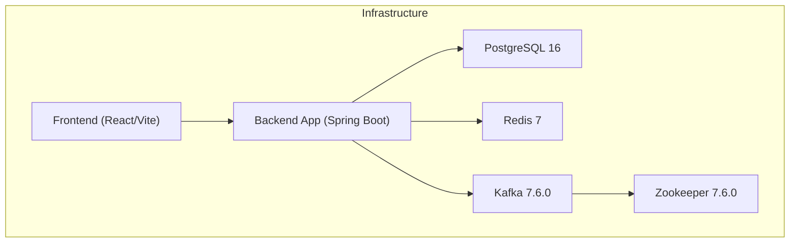
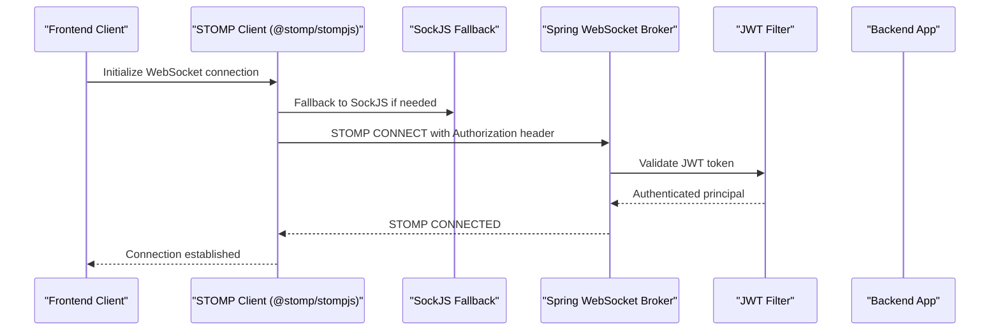

# Technology Stack Overview

<cite>
**Referenced Files in This Document**
- [pom.xml](file://pom.xml)
- [package.json](file://chatify-frontend/package.json)
- [docker-compose.yml](file://docker-compose.yml)
- [application.properties](file://src/main/resources/application.properties)
- [WebSocketConfig.java](file://src/main/java/com/chatify/chat_backend/config/WebSocketConfig.java)
- [SecurityConfig.java](file://src/main/java/com/chatify/chat_backend/config/SecurityConfig.java)
- [RedisConfig.java](file://src/main/java/com/chatify/chat_backend/config/RedisConfig.java)
- [KafkaTopicConfig.java](file://src/main/java/com/chatify/chat_backend/config/KafkaTopicConfig.java)
- [WebSocketContext.jsx](file://chatify-frontend/src/context/WebSocketContext.jsx)
- [useWebSocket.js](file://chatify-frontend/src/hooks/useWebSocket.js)
- [api.js](file://chatify-frontend/src/services/api.js)
- [constants.js](file://chatify-frontend/src/utils/constants.js)
- [vite.config.js](file://chatify-frontend/vite.config.js)
- [eslint.config.js](file://chatify-frontend/eslint.config.js)
</cite>

## Update Summary
**Changes Made**
- Updated Spring Boot version to 3.5.5 with Java 17
- Enhanced PostgreSQL integration with version 16 and improved configuration
- Expanded Redis configuration with caching and presence tracking capabilities
- Added detailed Kafka integration with topic configuration and serialization
- Integrated AWS SDK 2.25.60 for S3 storage with presigned URL support
- Updated React 19 with Vite 7.2.4 and enhanced WebSocket communication
- Improved infrastructure documentation with Docker Compose services

## Table of Contents
1. [Introduction](#introduction)
2. [Backend Technology Stack](#backend-technology-stack)
3. [Frontend Technology Stack](#frontend-technology-stack)
4. [Infrastructure Technologies](#infrastructure-technologies)
5. [Development Tools](#development-tools)
6. [Version Compatibility and Rationale](#version-compatibility-and-rationale)
7. [Architecture Impact and Performance Goals](#architecture-impact-and-performance-goals)
8. [Conclusion](#conclusion)

## Introduction
This document provides a comprehensive overview of the Chatify technology stack, detailing the backend, frontend, infrastructure, and development tools that power the real-time chat application. It explains how each technology contributes to the system's architecture, performance goals, and operational reliability, along with version compatibility and the rationale behind key technology choices.

## Backend Technology Stack
The backend is built on a modern Java ecosystem centered around Spring Boot 3.5.5 and Java 17. It leverages Spring Security for robust authentication and authorization, Spring Data JPA for database operations, Spring WebSocket for real-time messaging, Spring Kafka for asynchronous event processing, PostgreSQL for persistent data storage, Redis for caching and presence tracking, and the AWS SDK for cloud storage integration.

- **Spring Boot 3.5.5**: Provides the foundational framework for rapid application development, dependency injection, auto-configuration, and embedded server support. It enables modular configuration and seamless integration with other Spring projects.
- **Java 17**: Selected for LTS support, strong performance characteristics, and modern language features that improve developer productivity and code maintainability.
- **Spring Security**: Implements authentication, authorization, and OAuth2 login flows. It integrates with JWT for stateless authentication and configures CORS policies for secure cross-origin access.
- **Spring Data JPA**: Offers type-safe database operations, query derivation, and transaction management. It simplifies persistence logic and aligns with PostgreSQL for reliable data storage.
- **Spring WebSocket**: Enables bidirectional real-time communication using STOMP over SockJS. It supports user-specific and broadcast channels for chat rooms, typing indicators, read receipts, and presence updates.
- **Spring Kafka**: Powers event-driven architecture for asynchronous message processing. It decouples components, improves resilience, and supports scalable message distribution across services.
- **PostgreSQL**: Relational database chosen for ACID compliance, advanced SQL features, and mature ecosystem. It supports JSON data types and extensions for modern application needs.
- **Redis**: Used for caching and presence tracking. It provides low-latency key-value operations, TTL-based expiration, and pub/sub capabilities for real-time presence updates.
- **AWS SDK**: Integrates cloud storage capabilities for file uploads and retrieval. It supports signed URLs for secure, time-limited access to S3 objects.

**Section sources**
- [pom.xml:12](file://pom.xml#L12)
- [pom.xml:23](file://pom.xml#L23)
- [pom.xml:40-155](file://pom.xml#L40-L155)
- [application.properties:1-75](file://src/main/resources/application.properties#L1-L75)
- [WebSocketConfig.java:27-111](file://src/main/java/com/chatify/chat_backend/config/WebSocketConfig.java#L27-L111)
- [SecurityConfig.java:27-120](file://src/main/java/com/chatify/chat_backend/config/SecurityConfig.java#L27-L120)
- [RedisConfig.java:23-108](file://src/main/java/com/chatify/chat_backend/config/RedisConfig.java#L23-L108)
- [KafkaTopicConfig.java:9-23](file://src/main/java/com/chatify/chat_backend/config/KafkaTopicConfig.java#L9-L23)

## Frontend Technology Stack
The frontend is built with React 19 and Vite, delivering a fast and responsive user interface. It uses Tailwind CSS for styling, Axios for HTTP requests, and specialized WebSocket libraries (@stomp/stompjs and sockjs-client) for real-time communication. Additional libraries enhance user experience and performance.

- **React 19**: Latest React version providing improved rendering performance, concurrent features, and modern hooks-based development patterns.
- **Vite**: Next-generation build tool offering fast dev server startup, optimized production builds, and efficient hot module replacement.
- **Tailwind CSS**: Utility-first CSS framework enabling rapid UI development with consistent design systems and minimal custom styles.
- **Axios**: HTTP client for API communication with interceptors supporting automatic token refresh and centralized error handling.
- **@stomp/stompjs**: STOMP client for WebSocket messaging, enabling structured protocol-based communication over WebSocket connections.
- **sockjs-client**: WebSocket fallback library ensuring connectivity when native WebSocket is unavailable, improving resilience across environments.

**Section sources**
- [package.json:12-40](file://chatify-frontend/package.json#L12-L40)
- [vite.config.js:1-21](file://chatify-frontend/vite.config.js#L1-L21)
- [WebSocketContext.jsx:1-190](file://chatify-frontend/src/context/WebSocketContext.jsx#L1-L190)
- [useWebSocket.js:1-8](file://chatify-frontend/src/hooks/useWebSocket.js#L1-L8)
- [api.js:1-121](file://chatify-frontend/src/services/api.js#L1-L121)

## Infrastructure Technologies
Infrastructure is containerized using Docker and orchestrated with Docker Compose. This setup ensures consistent environments, simplified deployment, and scalable service management. The compose file defines services for PostgreSQL, Redis, Zookeeper, Kafka, the backend application, and the frontend.

- **Docker**: Containerizes the backend application and frontend for consistent builds and deployments across environments.
- **Docker Compose**: Orchestrates multi-service applications, defining dependencies, networking, and environment variables for PostgreSQL, Redis, Kafka, and the application stack.
- **Cloud Services Integration**: Environment variables in the compose file enable integration with cloud services such as AWS S3 for file storage and external OAuth providers for authentication.

**Diagram sources**
- [docker-compose.yml:1-137](file://docker-compose.yml#L1-L137)

**Section sources**
- [docker-compose.yml:1-137](file://docker-compose.yml#L1-L137)

## Development Tools
Development tools ensure code quality, consistency, and efficient workflows across the team.

- **Maven**: Dependency management and build automation for the Spring Boot backend, including plugin configuration and compiler settings.
- **ESLint**: Static analysis and linting for JavaScript/JSX code, enforcing best practices and consistent code style.
- **Postman**: API testing and documentation tooling for validating backend endpoints, authentication flows, and WebSocket integrations.

**Section sources**
- [pom.xml:157-174](file://pom.xml#L157-L174)
- [eslint.config.js:1-30](file://chatify-frontend/eslint.config.js#L1-L30)

## Version Compatibility and Rationale
This section outlines version compatibility and the reasoning behind technology choices to ensure stability, performance, and maintainability.

- **Spring Boot 3.5.5 + Java 17**: Aligns with LTS Java support and modern Spring ecosystem features. Java 17 offers improved performance, memory management, and concurrency features.
- **PostgreSQL 16**: Latest major release providing enhanced JSON support, performance improvements, and advanced SQL capabilities suitable for chat application data modeling.
- **Redis 7**: Latest stable version with improved performance, clustering, and Pub/Sub enhancements for presence tracking and caching.
- **Kafka 7.6.0 + Zookeeper 7.6.0**: Stable enterprise-grade messaging platform with strong partitioning and replication guarantees for asynchronous events.
- **React 19 + Vite**: Latest React with concurrent rendering and Vite's optimized build pipeline for fast development and production builds.
- **Tailwind CSS v4**: Utility-first CSS framework enabling rapid UI development with consistent design tokens and minimal CSS overhead.
- **AWS SDK 2.x**: Modular SDK with improved performance, tree-shaking, and explicit dependency management for S3 integration.

**Section sources**
- [pom.xml:12](file://pom.xml#L12)
- [pom.xml:23](file://pom.xml#L23)
- [docker-compose.yml:3-84](file://docker-compose.yml#L3-L84)
- [package.json:12-40](file://chatify-frontend/package.json#L12-L40)

## Architecture Impact and Performance Goals
Each technology contributes to achieving specific architectural goals and performance targets.

- **Real-time Communication**: Spring WebSocket with STOMP over SockJS and @stomp/stompjs ensures low-latency, bidirectional messaging. Heartbeats and reconnection logic improve resilience and user experience.
- **Scalability**: Kafka enables asynchronous processing and horizontal scaling. Partitioned topics distribute load across consumers, while Spring Cloud Stream can further abstract messaging concerns.
- **Caching and Presence**: Redis provides sub-second cache hits for user profiles and presence tracking with TTL-based expiration, reducing database load and improving responsiveness.
- **Security and Authentication**: Spring Security with JWT and OAuth2 ensures secure authentication flows, while CORS configuration controls cross-origin access safely.
- **Data Persistence**: Spring Data JPA with PostgreSQL offers ACID transactions, advanced queries, and JSON support for flexible data modeling.
- **Cloud Storage**: AWS SDK integration allows secure, time-limited access to S3 objects, offloading media storage from the application server.
- **Build and Dev Experience**: Vite accelerates development with fast HMR, while ESLint enforces code quality and consistency across the frontend codebase.

**Diagram sources**
- [WebSocketConfig.java:44-111](file://src/main/java/com/chatify/chat_backend/config/WebSocketConfig.java#L44-L111)
- [WebSocketContext.jsx:50-110](file://chatify-frontend/src/context/WebSocketContext.jsx#L50-L110)

**Section sources**
- [WebSocketConfig.java:27-111](file://src/main/java/com/chatify/chat_backend/config/WebSocketConfig.java#L27-L111)
- [SecurityConfig.java:61-90](file://src/main/java/com/chatify/chat_backend/config/SecurityConfig.java#L61-L90)
- [RedisConfig.java:48-107](file://src/main/java/com/chatify/chat_backend/config/RedisConfig.java#L48-L107)
- [KafkaTopicConfig.java:15-22](file://src/main/java/com/chatify/chat_backend/config/KafkaTopicConfig.java#L15-L22)
- [WebSocketContext.jsx:1-190](file://chatify-frontend/src/context/WebSocketContext.jsx#L1-L190)

## Conclusion
The Chatify technology stack combines modern backend frameworks, resilient infrastructure, and contemporary frontend tools to deliver a scalable, secure, and performant real-time chat application. Each technology choice is aligned with the system's architecture and performance goals, ensuring maintainability, extensibility, and a superior user experience.