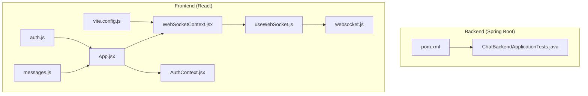
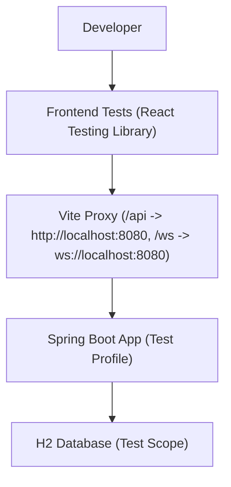
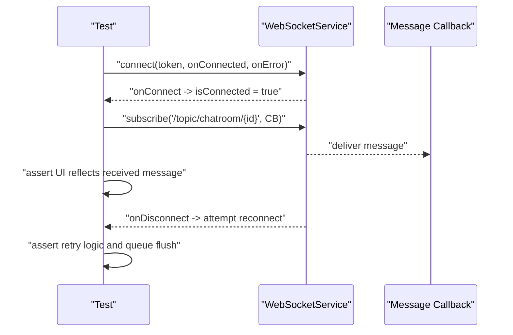
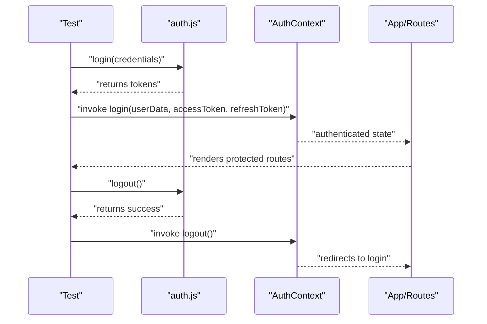
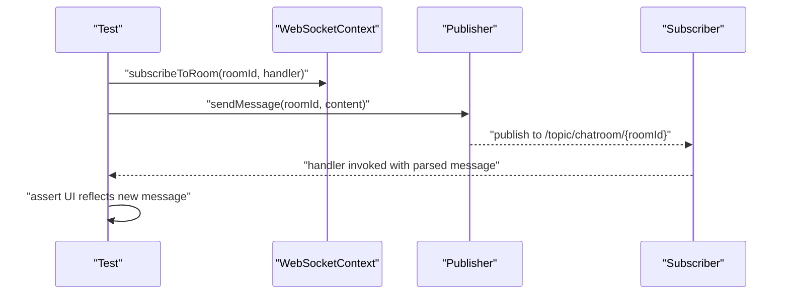
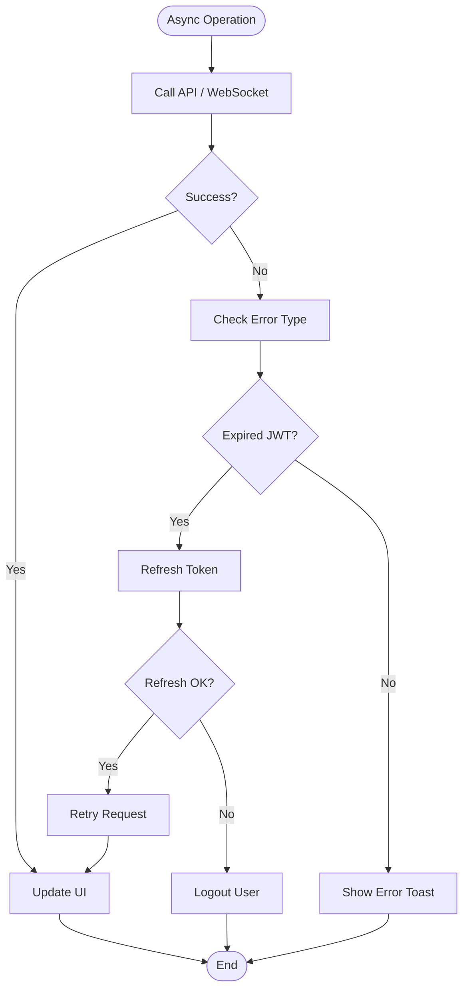
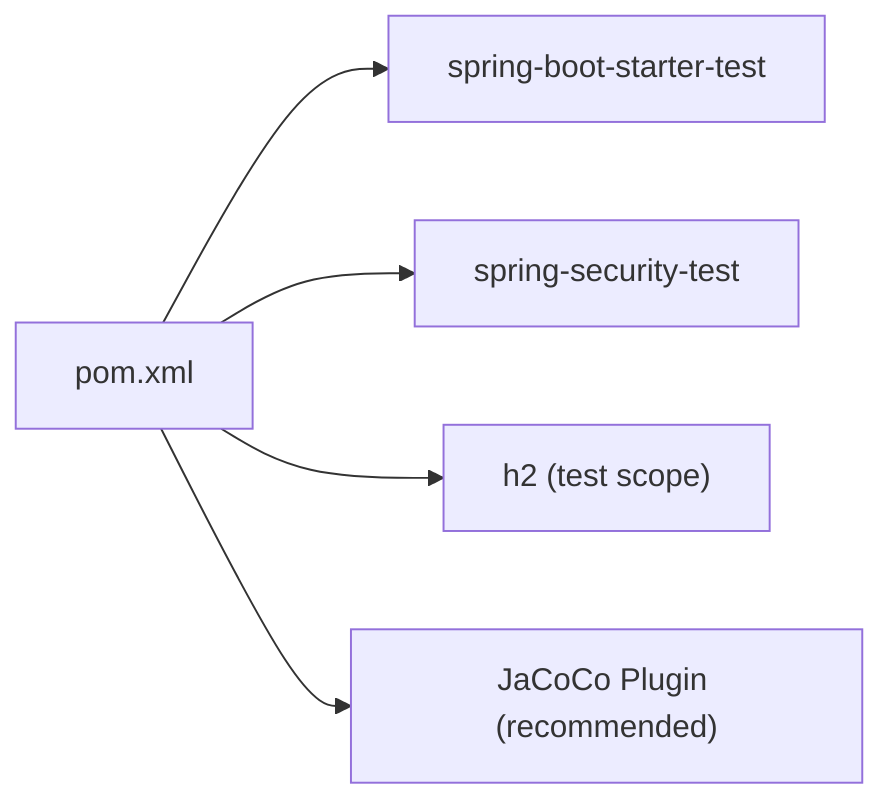
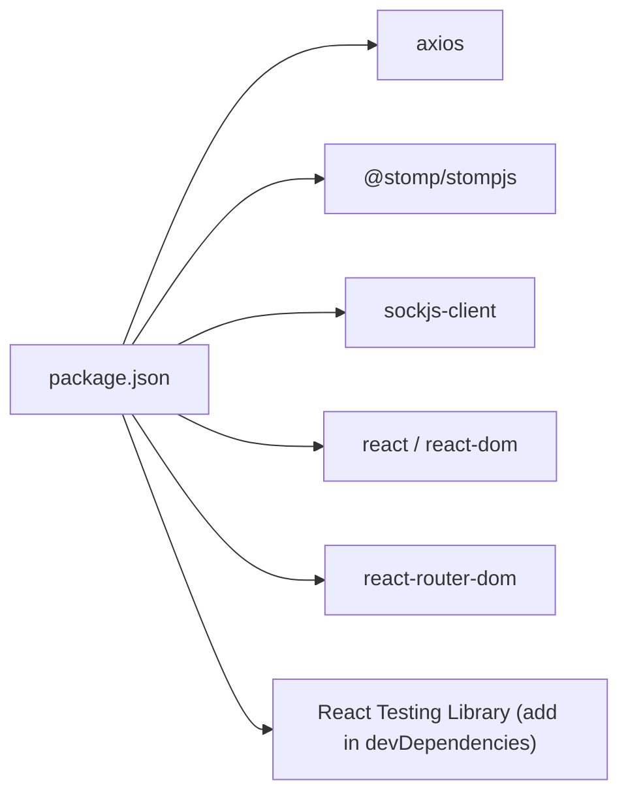
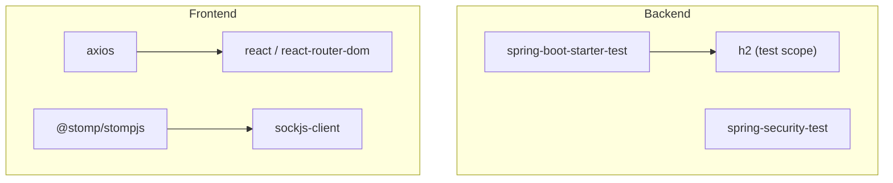

# Testing Strategy

<cite>
**Referenced Files in This Document**
- [pom.xml](file://pom.xml)
- [ChatBackendApplicationTests.java](file://src/test/java/com/chatify/chat_backend/ChatBackendApplicationTests.java)
- [websocket.js](file://chatify-frontend/src/services/websocket.js)
- [WebSocketContext.jsx](file://chatify-frontend/src/context/WebSocketContext.jsx)
- [useWebSocket.js](file://chatify-frontend/src/hooks/useWebSocket.js)
- [auth.js](file://chatify-frontend/src/api/auth.js)
- [messages.js](file://chatify-frontend/src/api/messages.js)
- [AuthContext.jsx](file://chatify-frontend/src/context/AuthContext.jsx)
- [App.jsx](file://chatify-frontend/src/App.jsx)
- [vite.config.js](file://chatify-frontend/vite.config.js)
- [package.json](file://chatify-frontend/package.json)
- [README.md](file://README.md)
</cite>

## Table of Contents
1. [Introduction](#introduction)
2. [Project Structure](#project-structure)
3. [Core Components](#core-components)
4. [Architecture Overview](#architecture-overview)
5. [Detailed Component Analysis](#detailed-component-analysis)
6. [Dependency Analysis](#dependency-analysis)
7. [Performance Considerations](#performance-considerations)
8. [Troubleshooting Guide](#troubleshooting-guide)
9. [Conclusion](#conclusion)
10. [Appendices](#appendices)

## Introduction
This document defines a comprehensive testing strategy for the Chatify application, covering backend and frontend testing approaches, configuration, and practical testing patterns. It focuses on:
- Backend testing with JUnit and Spring Boot Test annotations (unit and integration testing), and database testing with an in-memory database suitable for tests.
- Frontend testing with React Testing Library, mocked services for API testing, and component testing strategies.
- Test configuration in Maven and Vite, including test dependencies and proxy setup for WebSocket and API testing.
- Concrete examples for testing WebSocket functionality, authentication flows, and real-time message handling.
- Patterns for asynchronous operations, error handling, and edge cases.
- Guidance for performance and load testing, and automated testing pipelines.

## Project Structure
The repository is a full-stack application with a Spring Boot backend and a React frontend. Testing is organized as follows:
- Backend: JUnit 5 with Spring Boot Test under src/test/java.
- Frontend: React Testing Library and Vite configuration for local development and proxying to the backend.

**Diagram sources**
- [pom.xml](file://pom.xml)
- [ChatBackendApplicationTests.java](file://src/test/java/com/chatify/chat_backend/ChatBackendApplicationTests.java)
- [vite.config.js](file://chatify-frontend/vite.config.js)
- [WebSocketContext.jsx](file://chatify-frontend/src/context/WebSocketContext.jsx)
- [useWebSocket.js](file://chatify-frontend/src/hooks/useWebSocket.js)
- [websocket.js](file://chatify-frontend/src/services/websocket.js)
- [auth.js](file://chatify-frontend/src/api/auth.js)
- [messages.js](file://chatify-frontend/src/api/messages.js)
- [AuthContext.jsx](file://chatify-frontend/src/context/AuthContext.jsx)
- [App.jsx](file://chatify-frontend/src/App.jsx)

**Section sources**
- [pom.xml](file://pom.xml)
- [ChatBackendApplicationTests.java](file://src/test/java/com/chatify/chat_backend/ChatBackendApplicationTests.java)
- [vite.config.js](file://chatify-frontend/vite.config.js)

## Core Components
- Backend testing dependencies include Spring Boot Starter Test and Spring Security Test. An H2 database is included for tests.
- Frontend testing relies on React Testing Library and Vite’s dev server with proxy configuration for API and WebSocket traffic.

Key testing-related dependencies and configuration:
- Backend: spring-boot-starter-test, spring-security-test, h2 database for tests.
- Frontend: React Testing Library is not declared in package.json; Vite proxy configured for /api and /ws.

**Section sources**
- [pom.xml](file://pom.xml)
- [package.json](file://chatify-frontend/package.json)
- [vite.config.js](file://chatify-frontend/vite.config.js)

## Architecture Overview
This section outlines how tests interact with the system components during development and CI.

**Diagram sources**
- [vite.config.js](file://chatify-frontend/vite.config.js)
- [pom.xml](file://pom.xml)

## Detailed Component Analysis

### Backend Testing Strategy
- Unit testing: Use @Test with @ExtendWith(SpringExtension.class) and @MockBean for collaborators. Focus on service-layer logic and DTO validations.
- Integration testing: Use @WebMvcTest for controllers, @Import for controller dependencies, and @WithMockUser/@WithUserDetails for security contexts.
- Database testing: Use @DataJpaTest for repositories and @AutoConfigureTestDatabase(replace = By.DEFAULT) to leverage H2. Alternatively, use @SpringBootTest with @ActiveProfiles("test") and an embedded database for end-to-end scenarios.
- Security testing: Use @Import(TestSecurityConfig.class) or @WithMockUser to simulate authenticated requests and test authorization logic.
- WebSocket testing: Use @WebMvcTest with WebSocket support and @MockBean for services. Simulate STOMP/SockJS connections via a test WebSocket server or a library that supports STOMP mocking.

Recommended test class structure:
- Base test class annotated with @SpringBootTest and @ActiveProfiles("test").
- Feature-specific test classes extending the base class, using @AutoConfigureTestDatabase and @Sql for schema initialization and cleanup.

Coverage and CI:
- Add JaCoCo plugin to pom.xml for coverage reporting.
- Configure GitHub Actions or similar CI to run mvn test and publish coverage reports.

**Section sources**
- [pom.xml](file://pom.xml)
- [ChatBackendApplicationTests.java](file://src/test/java/com/chatify/chat_backend/ChatBackendApplicationTests.java)

### Frontend Testing Strategy
- Component testing: Use React Testing Library to render components in isolation, mock APIs, and assert UI behavior.
- API testing: Mock axios endpoints in test files to avoid hitting the backend. Use setup files to mock the axios instance.
- WebSocket testing: 
  - Option A: Mock the WebSocket service and verify dispatch of actions and state updates.
  - Option B: Integrate a lightweight STOMP mock server in tests and assert message flows.
- Authentication flow testing:
  - Mock login/logout endpoints and verify AuthContext state changes.
  - Test route protection with PrivateRoute and AuthContext.
- Real-time message handling:
  - Mock WebSocketContext and simulate message subscriptions and callbacks.
  - Verify UI updates for incoming messages, typing indicators, and read receipts.

Vite proxy for local testing:
- The Vite dev server proxies /api and /ws to the backend running on localhost:8080, enabling live reload and seamless integration testing.

**Section sources**
- [vite.config.js](file://chatify-frontend/vite.config.js)
- [AuthContext.jsx](file://chatify-frontend/src/context/AuthContext.jsx)
- [App.jsx](file://chatify-frontend/src/App.jsx)
- [auth.js](file://chatify-frontend/src/api/auth.js)
- [messages.js](file://chatify-frontend/src/api/messages.js)
- [WebSocketContext.jsx](file://chatify-frontend/src/context/WebSocketContext.jsx)
- [useWebSocket.js](file://chatify-frontend/src/hooks/useWebSocket.js)
- [websocket.js](file://chatify-frontend/src/services/websocket.js)

### Testing Patterns and Examples

#### WebSocket Functionality
- Pattern: Mock the WebSocket service or context, trigger connect/disconnect, and assert state transitions and callbacks.
- Example scenario: Connect with a valid token, subscribe to a room, receive a message, and verify UI updates. If disconnected, assert reconnection attempts and queue flushing.

**Diagram sources**
- [websocket.js](file://chatify-frontend/src/services/websocket.js)

#### Authentication Flows
- Pattern: Mock auth endpoints, simulate login, verify AuthContext state, routing, and persisted tokens.
- Example scenario: Successful login updates context and localStorage, navigates to chat; logout clears context and redirects to login.

**Diagram sources**
- [auth.js](file://chatify-frontend/src/api/auth.js)
- [AuthContext.jsx](file://chatify-frontend/src/context/AuthContext.jsx)
- [App.jsx](file://chatify-frontend/src/App.jsx)

#### Real-Time Message Handling
- Pattern: Mock WebSocketContext, subscribe to room/topic, simulate message delivery, and assert UI updates.
- Example scenario: Send a message, receive delivery and seen acknowledgments, and update unread counts.

**Diagram sources**
- [WebSocketContext.jsx](file://chatify-frontend/src/context/WebSocketContext.jsx)

#### Async Operations and Error Handling
- Pattern: Use waitFor, screen.getByText, and act for async rendering. Assert error boundaries and fallback UI.
- Example scenario: Expired JWT triggers token refresh; on failure, logout and show error toast.

**Diagram sources**
- [WebSocketContext.jsx](file://chatify-frontend/src/context/WebSocketContext.jsx)
- [AuthContext.jsx](file://chatify-frontend/src/context/AuthContext.jsx)

#### Edge Cases
- Empty chat rooms, pagination bounds, invalid file uploads, network interruptions, and concurrent message sends.
- Pattern: Use beforeEach to reset mocks and state; assert defensive UI behavior and graceful degradation.

### Test Configuration and Coverage

#### Backend (Maven)
- Dependencies: spring-boot-starter-test, spring-security-test, h2 database for tests.
- Plugins: spring-boot-maven-plugin, maven-compiler-plugin.
- Recommendation: Add JaCoCo plugin for coverage reporting.

**Diagram sources**
- [pom.xml](file://pom.xml)

**Section sources**
- [pom.xml](file://pom.xml)

#### Frontend (Vite)
- Scripts: dev, build, lint, preview.
- Dependencies: axios, @stomp/stompjs, sockjs-client, react, react-router-dom.
- Recommendation: Add React Testing Library and Vitest for unit tests; configure vitest.setup.js to mock axios and WebSocket.

**Diagram sources**
- [package.json](file://chatify-frontend/package.json)

**Section sources**
- [package.json](file://chatify-frontend/package.json)
- [vite.config.js](file://chatify-frontend/vite.config.js)

### Continuous Integration Setup
- Backend: Run mvn test in CI; publish coverage using JaCoCo.
- Frontend: Add npm test script and configure Vitest; publish coverage reports.
- Workflow: Build, run backend tests, run frontend tests, and deploy artifacts.

[No sources needed since this section provides general guidance]

## Dependency Analysis
Backend and frontend testing dependencies and their roles:
- Backend: spring-boot-starter-test for bootstrapping tests; spring-security-test for security-related tests; h2 for in-memory database testing.
- Frontend: axios for HTTP requests; @stomp/stompjs and sockjs-client for WebSocket; react and react-router-dom for routing and UI.

**Diagram sources**
- [pom.xml](file://pom.xml)
- [package.json](file://chatify-frontend/package.json)

**Section sources**
- [pom.xml](file://pom.xml)
- [package.json](file://chatify-frontend/package.json)

## Performance Considerations
- Backend:
  - Use @DirtiesContext judiciously; prefer @Transactional and rollback for speed.
  - Use @Sql to seed minimal datasets for performance.
  - Profile slow tests and refactor heavy fixtures.
- Frontend:
  - Mock external services to avoid network latency.
  - Use fake timers for timeout-heavy components.
  - Parallelize independent tests to reduce CI time.

[No sources needed since this section provides general guidance]

## Troubleshooting Guide
Common issues and resolutions:
- WebSocket connection failures:
  - Ensure backend runs on port 8080 and CORS is configured.
  - Verify JWT validity and refresh flow.
  - Check browser console for connection errors.
- Frontend proxy issues:
  - Confirm Vite proxy targets localhost:8080 for /api and /ws.
  - Restart dev server if proxy stops working.
- Authentication problems:
  - Clear localStorage tokens and retry login.
  - Validate OAuth callback handling.

**Section sources**
- [README.md](file://README.md)
- [vite.config.js](file://chatify-frontend/vite.config.js)

## Conclusion
This testing strategy combines robust backend testing with Spring Boot Test and pragmatic frontend testing with React Testing Library and Vite. By focusing on component isolation, API mocking, and WebSocket simulation, teams can achieve reliable coverage for real-time chat features. Integrating coverage reporting and CI ensures continuous quality assurance.

[No sources needed since this section summarizes without analyzing specific files]

## Appendices

### Backend Test Class Template
- Base class: @SpringBootTest with @ActiveProfiles("test")
- Feature class: Extend base; use @AutoConfigureTestDatabase and @Sql for schema management

**Section sources**
- [ChatBackendApplicationTests.java](file://src/test/java/com/chatify/chat_backend/ChatBackendApplicationTests.java)
- [pom.xml](file://pom.xml)

### Frontend Test Setup Checklist
- Install React Testing Library and Vitest.
- Create a vitest.setup.js to mock axios and WebSocket.
- Write component tests for Chat, Login, Register, and WebSocketContext.
- Mock AuthContext for route protection tests.

**Section sources**
- [package.json](file://chatify-frontend/package.json)
- [auth.js](file://chatify-frontend/src/api/auth.js)
- [messages.js](file://chatify-frontend/src/api/messages.js)
- [WebSocketContext.jsx](file://chatify-frontend/src/context/WebSocketContext.jsx)
- [useWebSocket.js](file://chatify-frontend/src/hooks/useWebSocket.js)
- [websocket.js](file://chatify-frontend/src/services/websocket.js)