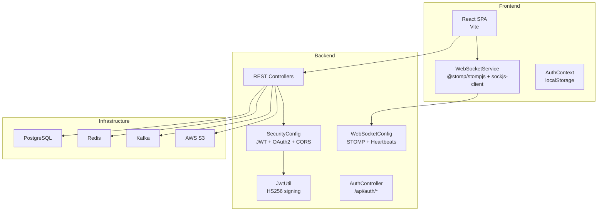
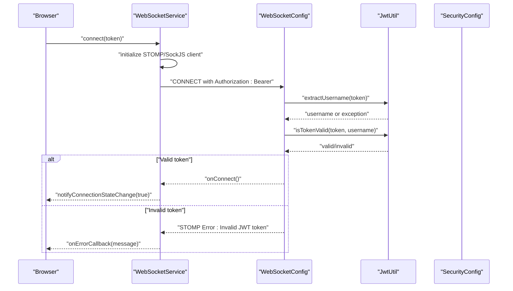
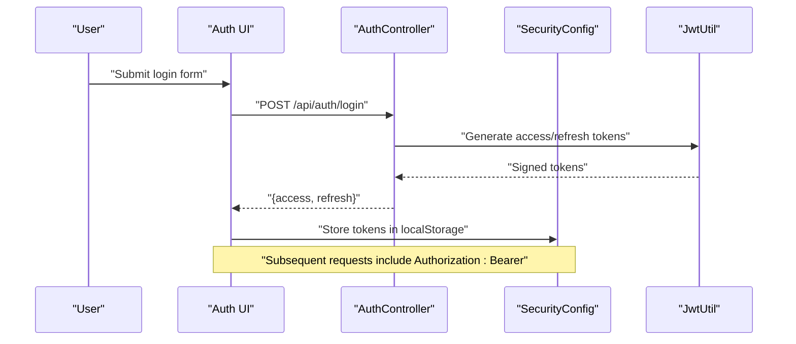
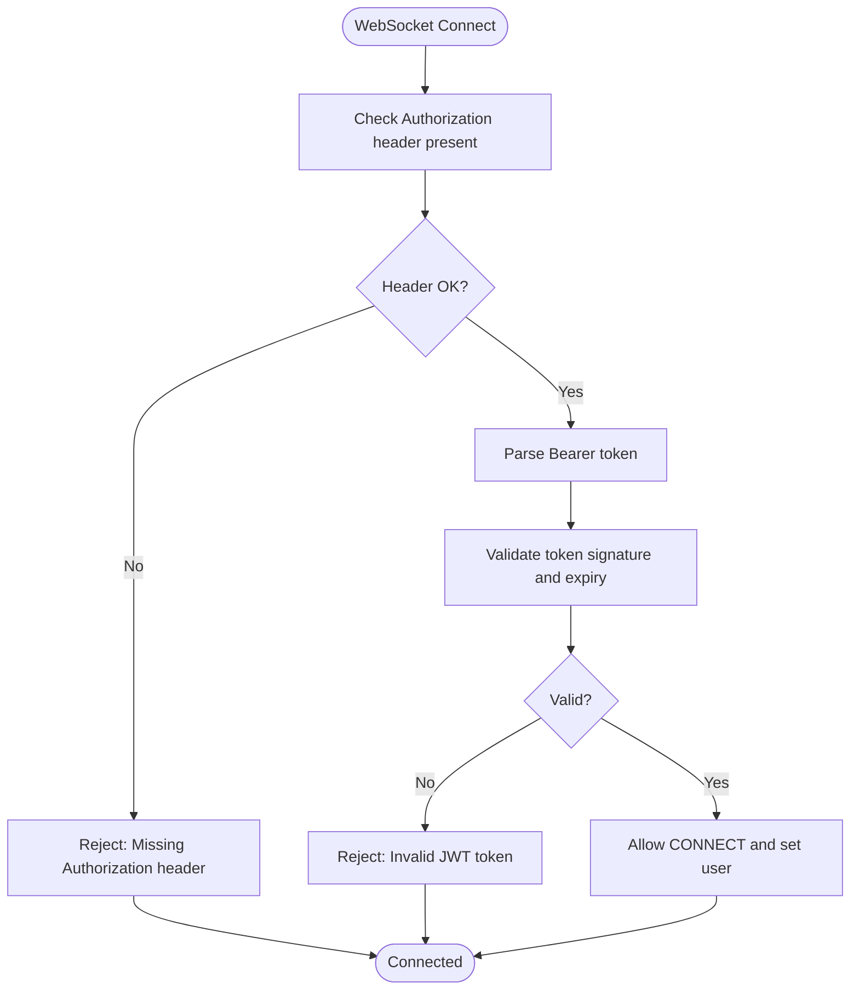
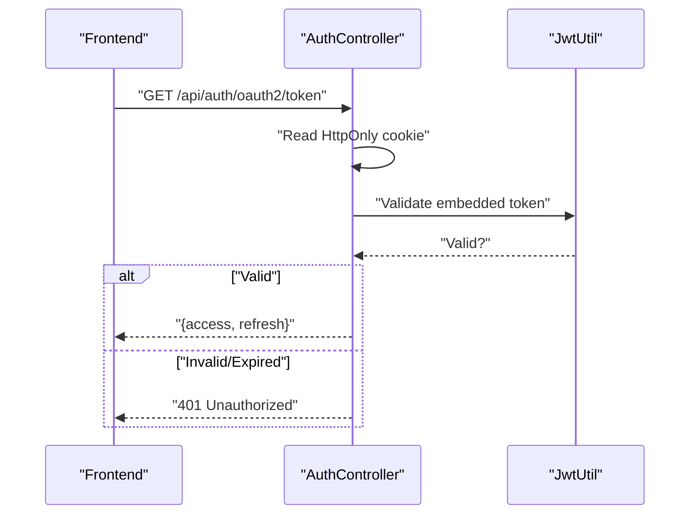
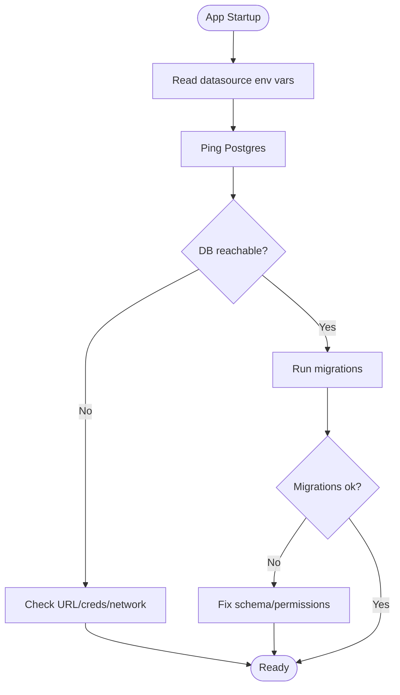
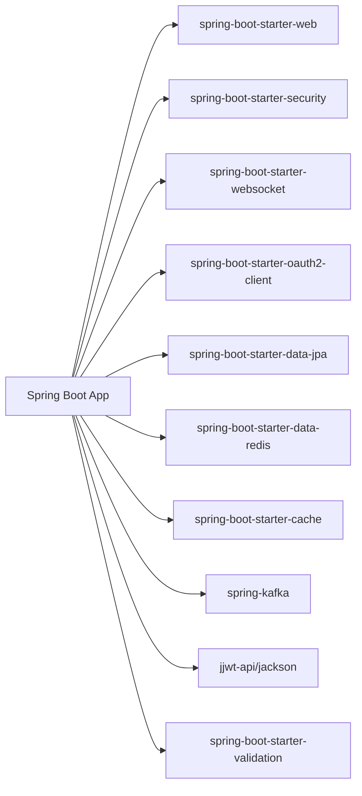

# Troubleshooting and FAQ

<cite>
**Referenced Files in This Document**
- [GlobalExceptionHandler.java](file://src/main/java/com/chatify/chat_backend/exception/GlobalExceptionHandler.java)
- [WebSocketConfig.java](file://src/main/java/com/chatify/chat_backend/config/WebSocketConfig.java)
- [SecurityConfig.java](file://src/main/java/com/chatify/chat_backend/config/SecurityConfig.java)
- [JwtAuthenticationFilter.java](file://src/main/java/com/chatify/chat_backend/security/JwtAuthenticationFilter.java)
- [JwtUtil.java](file://src/main/java/com/chatify/chat_backend/security/JwtUtil.java)
- [AuthController.java](file://src/main/java/com/chatify/chat_backend/controller/AuthController.java)
- [websocket.js](file://chatify-frontend/src/services/websocket.js)
- [constants.js](file://chatify-frontend/src/utils/constants.js)
- [AuthContext.jsx](file://chatify-frontend/src/context/AuthContext.jsx)
- [useWebSocket.js](file://chatify-frontend/src/hooks/useWebSocket.js)
- [docker-compose.yml](file://docker-compose.yml)
- [pom.xml](file://pom.xml)
</cite>

## Table of Contents
1. [Introduction](#introduction)
2. [Project Structure](#project-structure)
3. [Core Components](#core-components)
4. [Architecture Overview](#architecture-overview)
5. [Detailed Component Analysis](#detailed-component-analysis)
6. [Dependency Analysis](#dependency-analysis)
7. [Performance Considerations](#performance-considerations)
8. [Troubleshooting Guide](#troubleshooting-guide)
9. [Conclusion](#conclusion)
10. [Appendices](#appendices)

## Introduction
This document provides a comprehensive troubleshooting guide for the Chatify application. It focuses on diagnosing and resolving common issues across backend, frontend, and deployment layers. Topics include WebSocket connection problems (CORS, JWT validation, network), authentication failures (token expiration, OAuth2 callbacks, credentials), database connectivity (pooling, permissions, migrations), frontend build/API connectivity/real-time issues, and deployment concerns (container startup, environment configuration, service dependencies). It also includes systematic debugging approaches, common error messages, performance troubleshooting, and escalation procedures.

## Project Structure
The application follows a layered architecture:
- Backend: Spring Boot REST + WebSocket services, secured with JWT and OAuth2, integrated with PostgreSQL, Redis, Kafka, and S3.
- Frontend: React SPA using Vite, connecting to backend APIs and WebSocket STOMP endpoints.
- Deployment: Docker Compose orchestrates Postgres, Redis, Zookeeper, Kafka, backend app, and frontend Nginx.

**Diagram sources**
- [docker-compose.yml:1-137](file://docker-compose.yml#L1-L137)
- [pom.xml:40-155](file://pom.xml#L40-L155)

**Section sources**
- [docker-compose.yml:1-137](file://docker-compose.yml#L1-L137)
- [pom.xml:40-155](file://pom.xml#L40-L155)

## Core Components
- Backend exception handling centralizes error responses for consistent diagnostics.
- WebSocket configuration enforces CORS origins, validates JWT in CONNECT frames, and sets heartbeats.
- Security configuration enables CORS, JWT filter bypass for specific paths, and OAuth2 success/failure handlers.
- JWT utilities manage HS256 signing, token generation, and validation.
- Authentication controller exposes registration, login, token exchange, refresh, and logout endpoints.
- Frontend WebSocket service encapsulates connection lifecycle, reconnection, subscriptions, and message queuing.
- Frontend constants define API and WebSocket URLs; AuthContext persists tokens and user state.

**Section sources**
- [GlobalExceptionHandler.java:17-112](file://src/main/java/com/chatify/chat_backend/exception/GlobalExceptionHandler.java#L17-L112)
- [WebSocketConfig.java:30-111](file://src/main/java/com/chatify/chat_backend/config/WebSocketConfig.java#L30-L111)
- [SecurityConfig.java:29-120](file://src/main/java/com/chatify/chat_backend/config/SecurityConfig.java#L29-L120)
- [JwtUtil.java:18-145](file://src/main/java/com/chatify/chat_backend/security/JwtUtil.java#L18-L145)
- [AuthController.java:19-140](file://src/main/java/com/chatify/chat_backend/controller/AuthController.java#L19-L140)
- [websocket.js:5-327](file://chatify-frontend/src/services/websocket.js#L5-L327)
- [constants.js:1-34](file://chatify-frontend/src/utils/constants.js#L1-L34)
- [AuthContext.jsx:9-53](file://chatify-frontend/src/context/AuthContext.jsx#L9-L53)

## Architecture Overview
This section maps the end-to-end flows for WebSocket connections and authentication, highlighting where failures commonly occur.

**Diagram sources**
- [WebSocketConfig.java:68-110](file://src/main/java/com/chatify/chat_backend/config/WebSocketConfig.java#L68-L110)
- [JwtUtil.java:86-118](file://src/main/java/com/chatify/chat_backend/security/JwtUtil.java#L86-L118)
- [websocket.js:42-114](file://chatify-frontend/src/services/websocket.js#L42-L114)

**Diagram sources**
- [AuthController.java:35-53](file://src/main/java/com/chatify/chat_backend/controller/AuthController.java#L35-L53)
- [JwtUtil.java:60-79](file://src/main/java/com/chatify/chat_backend/security/JwtUtil.java#L60-L79)
- [AuthContext.jsx:30-44](file://chatify-frontend/src/context/AuthContext.jsx#L30-L44)

## Detailed Component Analysis

### WebSocket Connectivity Troubleshooting
Common symptoms:
- Connection fails immediately or drops shortly after connect.
- STOMP CONNECT frame rejected with “Invalid JWT token” or “Missing Authorization header”.
- Heartbeats not observed; UI indicates disconnected.

Root causes and fixes:
- Missing or malformed Authorization header in CONNECT frame.
  - Verify the frontend sends Authorization: Bearer <token>.
  - Confirm token exists and is not expired.
- CORS mismatch between frontend origin and allowed origins.
  - Ensure allowed origins include the frontend host/port.
- Backend rejects token due to invalid/expired signature or subject mismatch.
  - Validate JWT secret and expiration settings.
- Network/container networking issues (Docker Compose).
  - Confirm frontend can reach backend WebSocket endpoint.

**Diagram sources**
- [WebSocketConfig.java:75-105](file://src/main/java/com/chatify/chat_backend/config/WebSocketConfig.java#L75-L105)
- [JwtUtil.java:96-118](file://src/main/java/com/chatify/chat_backend/security/JwtUtil.java#L96-L118)

**Section sources**
- [WebSocketConfig.java:36-47](file://src/main/java/com/chatify/chat_backend/config/WebSocketConfig.java#L36-L47)
- [WebSocketConfig.java:75-105](file://src/main/java/com/chatify/chat_backend/config/WebSocketConfig.java#L75-L105)
- [JwtUtil.java:96-118](file://src/main/java/com/chatify/chat_backend/security/JwtUtil.java#L96-L118)
- [websocket.js:59-114](file://chatify-frontend/src/services/websocket.js#L59-L114)
- [constants.js:1-3](file://chatify-frontend/src/utils/constants.js#L1-L3)

### Authentication Troubleshooting
Common symptoms:
- Login returns “Invalid email or password”.
- OAuth2 callback fails; frontend receives unauthorized or session expired.
- Token refresh returns invalid/expired.

Root causes and fixes:
- Credentials incorrect or account locked/disabled.
  - Re-enter credentials; verify account status.
- Missing or expired OAuth2 session cookie.
  - Ensure redirect URI matches configuration; retry OAuth2 login.
- Expired or invalid JWT/refresh token.
  - Request a new access token using a valid refresh token.
- CORS preventing OAuth2 redirect or token exchange.
  - Confirm allowed origins include frontend origin.

**Diagram sources**
- [AuthController.java:69-107](file://src/main/java/com/chatify/chat_backend/controller/AuthController.java#L69-L107)
- [JwtUtil.java:96-118](file://src/main/java/com/chatify/chat_backend/security/JwtUtil.java#L96-L118)

**Section sources**
- [AuthController.java:45-53](file://src/main/java/com/chatify/chat_backend/controller/AuthController.java#L45-L53)
- [AuthController.java:69-107](file://src/main/java/com/chatify/chat_backend/controller/AuthController.java#L69-L107)
- [AuthController.java:109-121](file://src/main/java/com/chatify/chat_backend/controller/AuthController.java#L109-L121)
- [JwtAuthenticationFilter.java:27-35](file://src/main/java/com/chatify/chat_backend/security/JwtAuthenticationFilter.java#L27-L35)
- [JwtAuthenticationFilter.java:42-67](file://src/main/java/com/chatify/chat_backend/security/JwtAuthenticationFilter.java#L42-L67)
- [SecurityConfig.java:74-88](file://src/main/java/com/chatify/chat_backend/config/SecurityConfig.java#L74-L88)

### Database Connectivity Troubleshooting
Common symptoms:
- Application fails to start with datasource/connection errors.
- Queries fail with permission denied or schema not found.
- Migration errors during startup.

Root causes and fixes:
- Incorrect JDBC URL, username, or password.
  - Verify environment variables and container links.
- PostgreSQL not ready or unhealthy.
  - Check healthcheck and logs for Postgres.
- Missing schema or DDL/DML permissions.
  - Ensure user has CREATE/USAGE privileges on target schema.
- Connection pool exhaustion or timeouts.
  - Tune pool size and timeouts in application configuration.

**Diagram sources**
- [docker-compose.yml:85-120](file://docker-compose.yml#L85-L120)

**Section sources**
- [docker-compose.yml:3-20](file://docker-compose.yml#L3-L20)
- [docker-compose.yml:93-103](file://docker-compose.yml#L93-L103)
- [pom.xml:63-73](file://pom.xml#L63-L73)

### Frontend Troubleshooting
Common symptoms:
- Build fails with missing environment variables.
- API calls fail with CORS or 401.
- Real-time messages not received; WebSocket disconnects frequently.

Root causes and fixes:
- Missing Vite environment variables (API/WS URLs).
  - Set VITE_API_URL and VITE_WS_URL in frontend environment.
- CORS mismatch between frontend and backend.
  - Align allowed origins in backend with frontend origin.
- WebSocket not connected; token missing or expired.
  - Ensure AuthContext stores a valid token; reconnect logic handles transient errors.
- Heartbeat mismatch or network instability.
  - Adjust heartbeat intervals and reconnect delays.

**Section sources**
- [constants.js:1-3](file://chatify-frontend/src/utils/constants.js#L1-L3)
- [AuthContext.jsx:30-44](file://chatify-frontend/src/context/AuthContext.jsx#L30-L44)
- [websocket.js:42-138](file://chatify-frontend/src/services/websocket.js#L42-L138)

## Dependency Analysis
Runtime dependencies include Spring Web, Security, WebSocket, OAuth2 Client, JPA, Redis, Kafka, AWS SDK, and JWT libraries. These influence error surfaces and troubleshooting scope.

**Diagram sources**
- [pom.xml:40-155](file://pom.xml#L40-L155)

**Section sources**
- [pom.xml:40-155](file://pom.xml#L40-L155)

## Performance Considerations
Symptoms:
- Slow message delivery.
- Memory growth over time.
- CPU spikes under load.

Recommendations:
- Optimize STOMP heartbeats and reconnect backoff.
- Monitor Redis and Kafka throughput; scale replicas if needed.
- Profile backend threads and connection pools.
- Enable structured logging and metrics collection.

[No sources needed since this section provides general guidance]

## Troubleshooting Guide

### WebSocket Connection Problems
- Symptom: Immediate rejection with “Invalid JWT token”.
  - Cause: Token parsing/validation failure in WebSocketConfig.
  - Action: Verify JWT secret and expiration; regenerate token.
- Symptom: “Missing Authorization header”.
  - Cause: Frontend did not attach Authorization header.
  - Action: Ensure WebSocketService sets Authorization in connectHeaders.
- Symptom: Frequent disconnects.
  - Cause: Heartbeat mismatch or network flakiness.
  - Action: Align heartbeat intervals; check Docker networking.

**Section sources**
- [WebSocketConfig.java:75-105](file://src/main/java/com/chatify/chat_backend/config/WebSocketConfig.java#L75-L105)
- [websocket.js:59-114](file://chatify-frontend/src/services/websocket.js#L59-L114)

### Authentication Failures
- Symptom: Login returns invalid credentials.
  - Cause: Bad credentials or account issues.
  - Action: Retry with correct credentials; confirm account state.
- Symptom: OAuth2 token exchange 401.
  - Cause: Missing/expired HttpOnly cookie.
  - Action: Re-initiate OAuth2 flow; verify redirect URI.
- Symptom: Refresh token invalid/expired.
  - Cause: Token misuse or server-side validation failure.
  - Action: Request new tokens; avoid replay.

**Section sources**
- [AuthController.java:45-53](file://src/main/java/com/chatify/chat_backend/controller/AuthController.java#L45-L53)
- [AuthController.java:69-107](file://src/main/java/com/chatify/chat_backend/controller/AuthController.java#L69-L107)
- [AuthController.java:109-121](file://src/main/java/com/chatify/chat_backend/controller/AuthController.java#L109-L121)

### Database Connectivity Issues
- Symptom: Startup fails with datasource error.
  - Cause: Wrong JDBC URL or credentials.
  - Action: Validate environment variables and container health.
- Symptom: Permission denied on schema.
  - Cause: Insufficient privileges.
  - Action: Grant required privileges; verify schema exists.
- Symptom: Migration failures.
  - Cause: Schema conflicts or DB downtime.
  - Action: Review migration logs; resolve conflicts manually if needed.

**Section sources**
- [docker-compose.yml:93-103](file://docker-compose.yml#L93-L103)
- [docker-compose.yml:15-19](file://docker-compose.yml#L15-L19)

### Frontend Troubleshooting
- Symptom: Build fails due to missing VITE_* variables.
  - Cause: Environment not configured.
  - Action: Provide .env file or CI secrets for VITE_API_URL/VITE_WS_URL.
- Symptom: API CORS errors.
  - Cause: Origins mismatch.
  - Action: Update allowed origins in backend configuration.
- Symptom: WebSocket disconnects repeatedly.
  - Cause: No token or reconnect attempts exhausted.
  - Action: Ensure token present; adjust maxReconnectAttempts/retry delays.

**Section sources**
- [constants.js:1-3](file://chatify-frontend/src/utils/constants.js#L1-L3)
- [websocket.js:116-138](file://chatify-frontend/src/services/websocket.js#L116-L138)
- [AuthContext.jsx:30-44](file://chatify-frontend/src/context/AuthContext.jsx#L30-L44)

### Deployment Issues
- Symptom: Container fails to start.
  - Cause: Dependencies not healthy or misconfigured.
  - Action: Check healthchecks and logs for Postgres/Redis/Kafka; fix environment variables.
- Symptom: Service dependency failures.
  - Cause: Startup order or network issues.
  - Action: Use depends_on conditions and wait for health checks.

**Section sources**
- [docker-compose.yml:15-19](file://docker-compose.yml#L15-L19)
- [docker-compose.yml:113-119](file://docker-compose.yml#L113-L119)

### Systematic Debugging Approaches
- Backend logging:
  - Enable DEBUG level for WebSocketConfig and JwtUtil packages.
  - Inspect GlobalExceptionHandler responses for structured error bodies.
- Frontend console inspection:
  - Observe STOMP debug logs; capture onWebSocketError/onStompError messages.
  - Verify token presence in localStorage and AuthContext state.
- Network analysis:
  - Use browser devtools Network tab to inspect WebSocket handshake and STOMP frames.
  - Confirm allowed origins and credentials exposure in CORS responses.

**Section sources**
- [GlobalExceptionHandler.java:100-110](file://src/main/java/com/chatify/chat_backend/exception/GlobalExceptionHandler.java#L100-L110)
- [websocket.js:64-98](file://chatify-frontend/src/services/websocket.js#L64-L98)
- [AuthContext.jsx:14-28](file://chatify-frontend/src/context/AuthContext.jsx#L14-L28)

### Common Error Messages and Resolutions
- “Invalid JWT token”
  - Causes: Malformed token, wrong secret, expired token.
  - Resolution: Regenerate token with correct secret and expiration.
- “Missing Authorization header”
  - Causes: Frontend did not send token.
  - Resolution: Ensure Authorization header is attached to CONNECT frame.
- “Access denied”
  - Causes: Insufficient permissions.
  - Resolution: Verify roles and scopes; re-authenticate.
- “OAuth2 session expired or not found”
  - Causes: Cookie missing/expired.
  - Resolution: Re-initiate OAuth2 login.
- “Failed to exchange OAuth2 token”
  - Causes: Cookie tampering or decoding error.
  - Resolution: Retry OAuth2 flow; ensure cookie path matches.

**Section sources**
- [WebSocketConfig.java:92-105](file://src/main/java/com/chatify/chat_backend/config/WebSocketConfig.java#L92-L105)
- [GlobalExceptionHandler.java:68-78](file://src/main/java/com/chatify/chat_backend/exception/GlobalExceptionHandler.java#L68-L78)
- [AuthController.java:74-106](file://src/main/java/com/chatify/chat_backend/controller/AuthController.java#L74-L106)

### Performance Troubleshooting
- Slow message delivery:
  - Reduce payload sizes; batch updates; tune Kafka/Redis.
- Memory leaks:
  - Audit WebSocket subscriptions and unsubscriptions; clear queues on disconnect.
- Resource contention:
  - Scale Kafka/Redis; monitor thread pools; adjust heartbeat intervals.

**Section sources**
- [websocket.js:177-221](file://chatify-frontend/src/services/websocket.js#L177-L221)
- [WebSocketConfig.java:59-66](file://src/main/java/com/chatify/chat_backend/config/WebSocketConfig.java#L59-L66)

### Diagnostic Tools and Escalation Procedures
- Backend:
  - Enable debug logging; review GlobalExceptionHandler error payloads.
  - Validate JWT secret and expiration settings.
- Frontend:
  - Capture STOMP debug logs; inspect connection state callbacks.
  - Verify environment variables and local storage persistence.
- Infrastructure:
  - Use Docker Compose healthchecks; inspect service logs.
  - Validate Kafka/Redis connectivity and credentials.

**Section sources**
- [GlobalExceptionHandler.java:17-112](file://src/main/java/com/chatify/chat_backend/exception/GlobalExceptionHandler.java#L17-L112)
- [websocket.js:32-40](file://chatify-frontend/src/services/websocket.js#L32-L40)
- [docker-compose.yml:15-19](file://docker-compose.yml#L15-L19)

## Conclusion
By aligning CORS, validating JWT tokens, ensuring secure OAuth2 flows, and maintaining robust infrastructure, most Chatify issues can be resolved quickly. Use the provided debugging approaches and escalation procedures to isolate problems efficiently.

[No sources needed since this section summarizes without analyzing specific files]

## Appendices

### CORS Configuration Checklist
- Backend allowed origins include frontend origin(s).
- Credentials allowed and exposed headers configured.
- Same-origin policy respected for WebSocket upgrades.

**Section sources**
- [SecurityConfig.java:107-119](file://src/main/java/com/chatify/chat_backend/config/SecurityConfig.java#L107-L119)
- [WebSocketConfig.java:36-47](file://src/main/java/com/chatify/chat_backend/config/WebSocketConfig.java#L36-L47)

### JWT Configuration Checklist
- JWT secret properly base64-encoded and exported.
- Token lifetime configured appropriately.
- Token validation enforced on both REST and WebSocket paths.

**Section sources**
- [JwtUtil.java:27-36](file://src/main/java/com/chatify/chat_backend/security/JwtUtil.java#L27-L36)
- [JwtUtil.java:96-118](file://src/main/java/com/chatify/chat_backend/security/JwtUtil.java#L96-L118)
- [JwtAuthenticationFilter.java:27-35](file://src/main/java/com/chatify/chat_backend/security/JwtAuthenticationFilter.java#L27-L35)

### Frontend Environment Variables
- VITE_API_URL: Backend REST API base URL.
- VITE_WS_URL: WebSocket endpoint path or URL.

**Section sources**
- [constants.js:1-3](file://chatify-frontend/src/utils/constants.js#L1-L3)