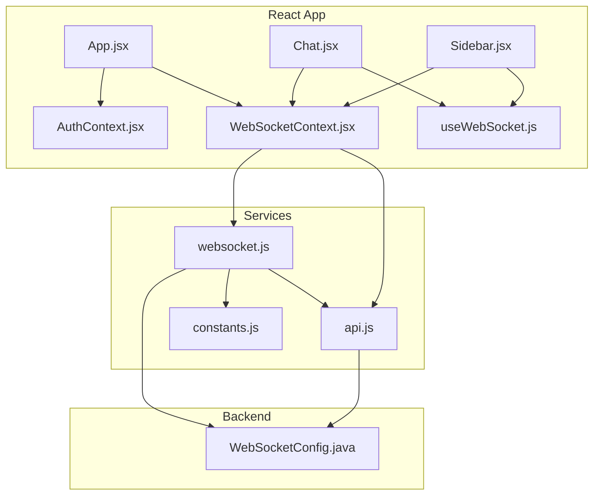
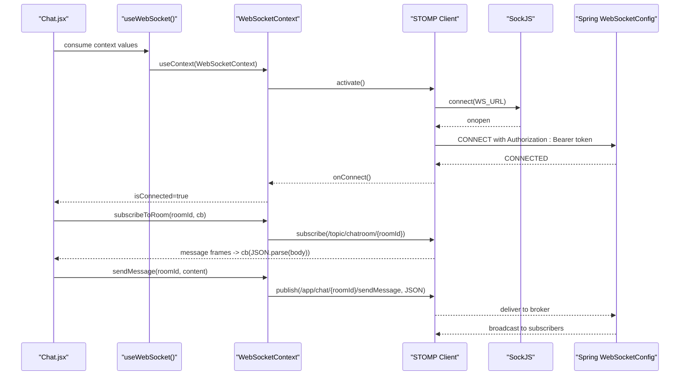
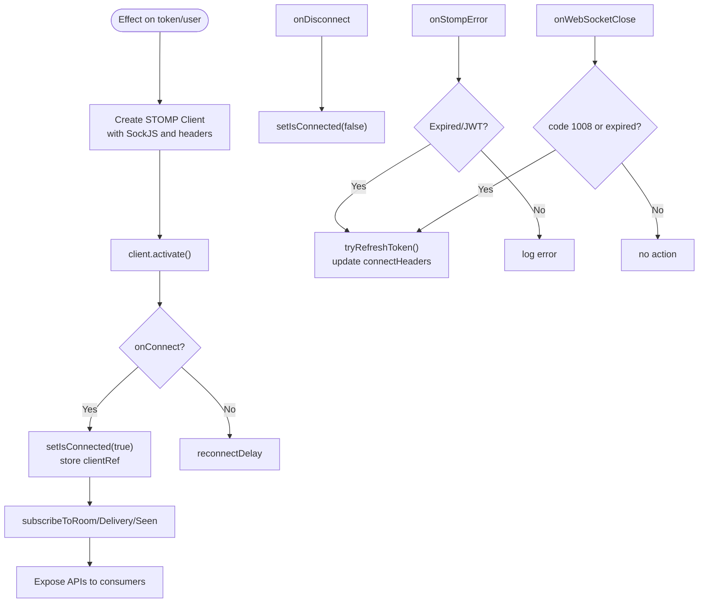
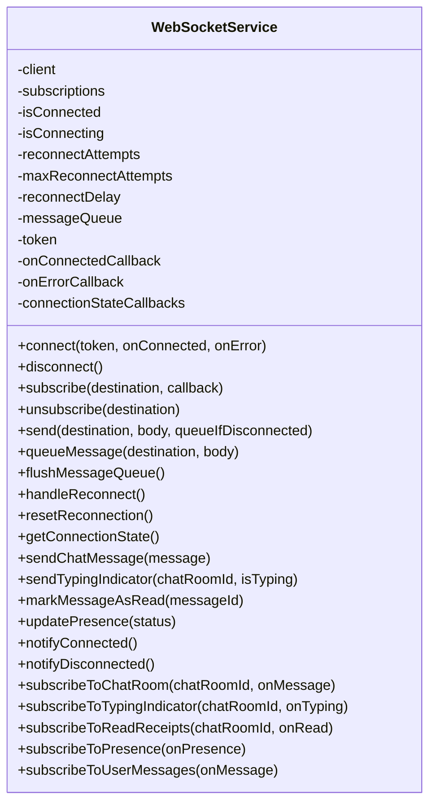
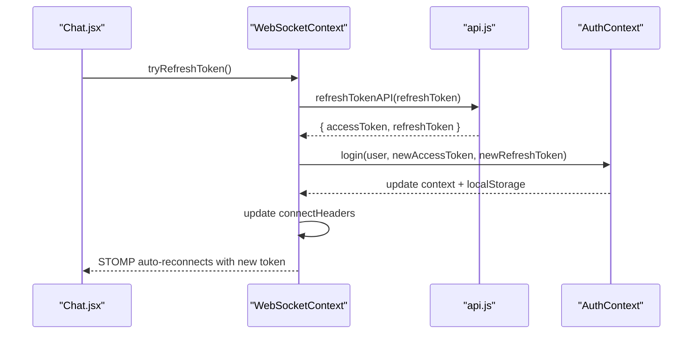
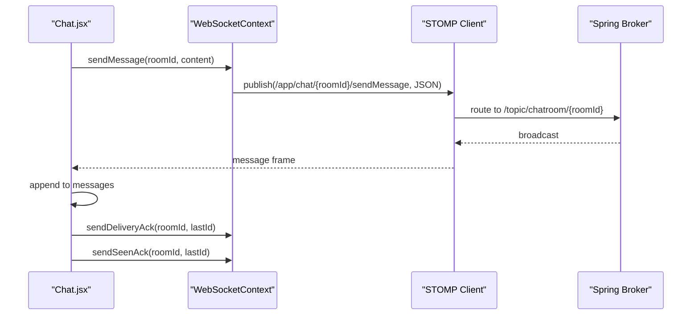
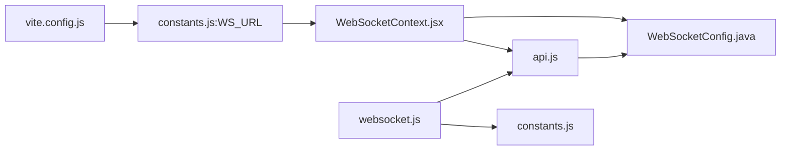

# Client-side WebSocket Integration

<cite>
**Referenced Files in This Document**
- [WebSocketContext.jsx](file://chatify-frontend/src/context/WebSocketContext.jsx)
- [useWebSocket.js](file://chatify-frontend/src/hooks/useWebSocket.js)
- [websocket.js](file://chatify-frontend/src/services/websocket.js)
- [AuthContext.jsx](file://chatify-frontend/src/context/AuthContext.jsx)
- [App.jsx](file://chatify-frontend/src/App.jsx)
- [Chat.jsx](file://chatify-frontend/src/pages/Chat.jsx)
- [Sidebar.jsx](file://chatify-frontend/src/components/Sidebar/Sidebar.jsx)
- [constants.js](file://chatify-frontend/src/utils/constants.js)
- [api.js](file://chatify-frontend/src/services/api.js)
- [useAuth.js](file://chatify-frontend/src/hooks/useAuth.js)
- [test-group-chat.html](file://chatify-frontend/src/pages/test-group-chat.html)
- [WebSocketConfig.java](file://src/main/java/com/chatify/chat_backend/config/WebSocketConfig.java)
- [vite.config.js](file://chatify-frontend/vite.config.js)
</cite>

## Table of Contents
1. [Introduction](#introduction)
2. [Project Structure](#project-structure)
3. [Core Components](#core-components)
4. [Architecture Overview](#architecture-overview)
5. [Detailed Component Analysis](#detailed-component-analysis)
6. [Dependency Analysis](#dependency-analysis)
7. [Performance Considerations](#performance-considerations)
8. [Troubleshooting Guide](#troubleshooting-guide)
9. [Conclusion](#conclusion)

## Introduction
This document explains the client-side WebSocket integration in the React frontend. It covers how WebSocket connections are established and managed, how authentication is integrated, and how real-time messaging flows through the application. It documents the WebSocketContext provider, the useWebSocket hook, and the websocket.js service module. It also provides examples of connection lifecycle, message sending/receiving, reconnection logic, error handling, and integration with React state and authentication contexts.

## Project Structure
The WebSocket integration spans three main areas:
- Context and hook layer: WebSocketContext provider and useWebSocket hook
- Service layer: websocket.js singleton for low-level operations
- UI layer: Chat page and Sidebar consuming the context/hook

**Diagram sources**
- [App.jsx:12-72](file://chatify-frontend/src/App.jsx#L12-L72)
- [AuthContext.jsx:9-52](file://chatify-frontend/src/context/AuthContext.jsx#L9-L52)
- [WebSocketContext.jsx:10-190](file://chatify-frontend/src/context/WebSocketContext.jsx#L10-L190)
- [useWebSocket.js:4-6](file://chatify-frontend/src/hooks/useWebSocket.js#L4-L6)
- [Chat.jsx:34-44](file://chatify-frontend/src/pages/Chat.jsx#L34-L44)
- [Sidebar.jsx:10-14](file://chatify-frontend/src/components/Sidebar/Sidebar.jsx#L10-L14)
- [websocket.js:5-327](file://chatify-frontend/src/services/websocket.js#L5-L327)
- [api.js:1-121](file://chatify-frontend/src/services/api.js#L1-L121)
- [constants.js:1-34](file://chatify-frontend/src/utils/constants.js#L1-L34)
- [WebSocketConfig.java:30-111](file://src/main/java/com/chatify/chat_backend/config/WebSocketConfig.java#L30-L111)

**Section sources**
- [App.jsx:12-72](file://chatify-frontend/src/App.jsx#L12-L72)
- [WebSocketContext.jsx:10-190](file://chatify-frontend/src/context/WebSocketContext.jsx#L10-L190)
- [websocket.js:5-327](file://chatify-frontend/src/services/websocket.js#L5-L327)
- [Chat.jsx:34-44](file://chatify-frontend/src/pages/Chat.jsx#L34-L44)
- [Sidebar.jsx:10-14](file://chatify-frontend/src/components/Sidebar/Sidebar.jsx#L10-L14)

## Core Components
- WebSocketContext provider: Manages STOMP/WebSocket lifecycle, authentication headers, reconnection, and exposes subscription/send APIs.
- useWebSocket hook: Provides access to WebSocketContext values for components.
- websocket.js service: Low-level WebSocket operations, message queueing, reconnection with exponential backoff, and typed subscriptions.

Key responsibilities:
- Authentication integration via Authorization header and refresh flow
- Real-time subscriptions to chatroom, presence, delivery, and seen topics
- Graceful reconnection and error handling
- Message serialization and deserialization

**Section sources**
- [WebSocketContext.jsx:10-190](file://chatify-frontend/src/context/WebSocketContext.jsx#L10-L190)
- [useWebSocket.js:4-6](file://chatify-frontend/src/hooks/useWebSocket.js#L4-L6)
- [websocket.js:5-327](file://chatify-frontend/src/services/websocket.js#L5-L327)

## Architecture Overview
The frontend uses SockJS over STOMP to communicate with the Spring WebSocket broker. The backend validates JWT tokens on CONNECT frames and authorizes the session. The frontend maintains a persistent connection and resubscribes to topics upon reconnect.

**Diagram sources**
- [WebSocketContext.jsx:50-122](file://chatify-frontend/src/context/WebSocketContext.jsx#L50-L122)
- [WebSocketContext.jsx:124-158](file://chatify-frontend/src/context/WebSocketContext.jsx#L124-L158)
- [WebSocketConfig.java:68-111](file://src/main/java/com/chatify/chat_backend/config/WebSocketConfig.java#L68-L111)

## Detailed Component Analysis

### WebSocketContext Provider
Responsibilities:
- Creates a STOMP client with SockJS transport
- Injects Authorization header using the latest token via a mutable ref
- Handles connection lifecycle events (onConnect, onDisconnect)
- Implements STOMP error handling and WebSocket close/error callbacks
- Provides subscription APIs for chatroom, presence, delivery, and seen topics
- Exposes message send and ACK APIs

Reconnection and token refresh:
- Uses a reconnect delay and heartbeat configuration
- Detects JWT expiration errors and triggers token refresh
- Updates connectHeaders with a fresh token and lets STOMP auto-reconnect

**Diagram sources**
- [WebSocketContext.jsx:47-122](file://chatify-frontend/src/context/WebSocketContext.jsx#L47-L122)
- [WebSocketContext.jsx:27-45](file://chatify-frontend/src/context/WebSocketContext.jsx#L27-L45)

**Section sources**
- [WebSocketContext.jsx:10-190](file://chatify-frontend/src/context/WebSocketContext.jsx#L10-L190)

### useWebSocket Hook
A thin wrapper around the context to simplify consumption in components.

Usage pattern:
- Destructure values like isConnected, subscribeToRoom, sendMessage, sendDeliveryAck, sendSeenAck
- Use isConnected to gate UI actions and enable/disable inputs

**Section sources**
- [useWebSocket.js:4-6](file://chatify-frontend/src/hooks/useWebSocket.js#L4-L6)
- [Chat.jsx:34-44](file://chatify-frontend/src/pages/Chat.jsx#L34-L44)
- [Sidebar.jsx:10-14](file://chatify-frontend/src/components/Sidebar/Sidebar.jsx#L10-L14)

### websocket.js Service Module
Responsibilities:
- Singleton service encapsulating STOMP client lifecycle
- Connection state tracking (isConnected, isConnecting)
- Reconnection with exponential backoff and capped attempts
- Message queueing while disconnected
- Typed subscriptions and send helpers for chat, typing, read receipts, presence
- Heartbeats and debug logging

Key methods:
- connect(token, onConnected, onError): initialize and activate client
- subscribe(destination, callback): manage subscriptions and JSON parsing
- send(destination, body, queueIfDisconnected): publish with queue fallback
- handleReconnect(): backoff-based reconnect loop
- disconnect(): cleanup subscriptions and client

**Diagram sources**
- [websocket.js:5-327](file://chatify-frontend/src/services/websocket.js#L5-L327)

**Section sources**
- [websocket.js:5-327](file://chatify-frontend/src/services/websocket.js#L5-L327)

### Integration with Authentication Context and API
- AuthContext stores user and tokens in localStorage and exposes login/logout
- API interceptor injects Authorization header for REST calls
- WebSocketContext uses the same token via a mutable ref to ensure fresh headers on reconnect
- Token refresh for REST is handled by the API interceptor; WebSocketContext handles JWT expiration via STOMP error handling and refresh flow

**Diagram sources**
- [WebSocketContext.jsx:27-45](file://chatify-frontend/src/context/WebSocketContext.jsx#L27-L45)
- [api.js:79-93](file://chatify-frontend/src/services/api.js#L79-L93)
- [AuthContext.jsx:30-44](file://chatify-frontend/src/context/AuthContext.jsx#L30-L44)

**Section sources**
- [AuthContext.jsx:9-52](file://chatify-frontend/src/context/AuthContext.jsx#L9-L52)
- [api.js:11-97](file://chatify-frontend/src/services/api.js#L11-L97)
- [WebSocketContext.jsx:27-45](file://chatify-frontend/src/context/WebSocketContext.jsx#L27-L45)

### Real-time Messaging Patterns
- Sending messages: components call sendMessage with roomId and content; the provider publishes to /app/chat/{roomId}/sendMessage
- Receiving messages: subscribeToRoom returns a subscription; incoming messages are parsed and passed to the callback
- Delivery and seen acknowledgements: sendDeliveryAck and sendSeenAck are used to update message status

**Diagram sources**
- [WebSocketContext.jsx:152-158](file://chatify-frontend/src/context/WebSocketContext.jsx#L152-L158)
- [Chat.jsx:221-228](file://chatify-frontend/src/pages/Chat.jsx#L221-L228)

**Section sources**
- [Chat.jsx:221-228](file://chatify-frontend/src/pages/Chat.jsx#L221-L228)
- [WebSocketContext.jsx:152-158](file://chatify-frontend/src/context/WebSocketContext.jsx#L152-L158)

### Connection State Monitoring and UI Integration
- Chat.jsx reads isConnected and disables/enables inputs accordingly
- Sidebar.jsx displays online/offline status based on isConnected
- Focus/blur handlers trigger seen acknowledgements

**Section sources**
- [Chat.jsx:319-320](file://chatify-frontend/src/pages/Chat.jsx#L319-L320)
- [Chat.jsx:161-181](file://chatify-frontend/src/pages/Chat.jsx#L161-L181)
- [Sidebar.jsx:10-14](file://chatify-frontend/src/components/Sidebar/Sidebar.jsx#L10-L14)

### Reconnection Mechanisms and Graceful Degradation
- WebSocketContext: reconnectDelay and heartbeat configuration; automatic reconnect on STOMP error/close
- websocket.js: exponential backoff with max attempts; queues messages until reconnected; notifies connection state changes
- Graceful degradation: UI disables send controls when disconnected; toast notifications for failures

**Section sources**
- [WebSocketContext.jsx:57-108](file://chatify-frontend/src/context/WebSocketContext.jsx#L57-L108)
- [websocket.js:116-138](file://chatify-frontend/src/services/websocket.js#L116-L138)
- [websocket.js:222-264](file://chatify-frontend/src/services/websocket.js#L222-L264)

## Dependency Analysis
- Frontend dependencies: @stomp/stompjs, sockjs-client
- Environment configuration: Vite proxy for /ws and /api
- Backend configuration: WebSocketConfig registers endpoint, enables SockJS, sets up message broker and channel interceptors

**Diagram sources**
- [vite.config.js:14-18](file://chatify-frontend/vite.config.js#L14-L18)
- [constants.js:1-34](file://chatify-frontend/src/utils/constants.js#L1-34)
- [WebSocketContext.jsx:50-51](file://chatify-frontend/src/context/WebSocketContext.jsx#L50-L51)
- [websocket.js:3](file://chatify-frontend/src/services/websocket.js#L3)
- [WebSocketConfig.java:44-47](file://src/main/java/com/chatify/chat_backend/config/WebSocketConfig.java#L44-L47)

**Section sources**
- [vite.config.js:14-18](file://chatify-frontend/vite.config.js#L14-L18)
- [WebSocketConfig.java:44-47](file://src/main/java/com/chatify/chat_backend/config/WebSocketConfig.java#L44-L47)

## Performance Considerations
- Heartbeats: configured on both client and server to detect dead connections promptly
- Message queueing: websocket.js queues outgoing messages while disconnected to avoid data loss
- Subscription reuse: websocket.js unsubscribes from existing destinations before subscribing again
- UI virtualization: Chat.jsx uses virtualized lists to render large message histories efficiently
- Conditional sends: Chat.jsx checks isConnected and prevents redundant sends

[No sources needed since this section provides general guidance]

## Troubleshooting Guide
Common issues and resolutions:
- Connection fails immediately
  - Verify WS_URL and CORS configuration on backend
  - Check Authorization header presence on CONNECT frames
  - Confirm JWT validity and expiration
- Frequent reconnections
  - Inspect reconnectDelay and max attempts; adjust for network conditions
  - Review heartbeat intervals on client and server
- Messages not received
  - Ensure subscriptions are active and destination paths match server topics
  - Verify JSON parsing in callbacks; websocket.js handles fallback to raw body
- Token expiration during WebSocket session
  - WebSocketContext automatically refreshes token and updates headers
  - Confirm refreshTokenAPI works and AuthContext persists new tokens

Debugging techniques:
- Enable debug logs in STOMP client (development builds)
- Monitor browser Network tab for /ws upgrade and subsequent frames
- Use the HTML test page to validate basic SockJS+STOMP connectivity with a raw JWT

**Section sources**
- [WebSocketContext.jsx:61-63](file://chatify-frontend/src/context/WebSocketContext.jsx#L61-L63)
- [websocket.js:64-68](file://chatify-frontend/src/services/websocket.js#L64-L68)
- [test-group-chat.html:58-94](file://chatify-frontend/src/pages/test-group-chat.html#L58-L94)

## Conclusion
The React frontend integrates WebSocket messaging through a robust provider and service layer. WebSocketContext manages authentication-aware connections, reconnection, and real-time subscriptions. The useWebSocket hook simplifies consumption in components. The websocket.js service adds reliability with queueing, backoff, and typed helpers. Together, these components provide a resilient real-time experience with clear separation of concerns and strong integration with authentication and REST APIs.