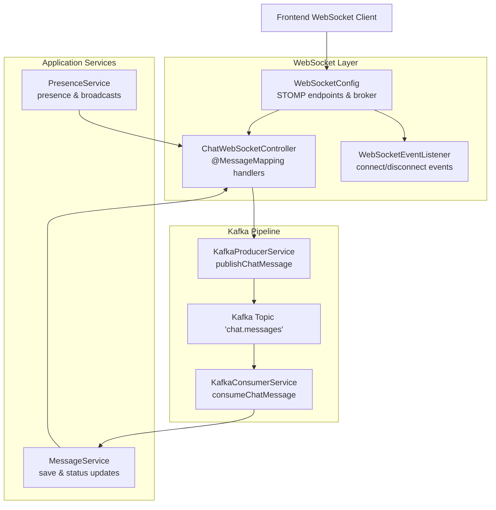
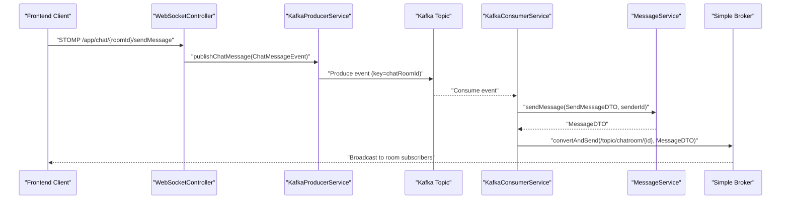
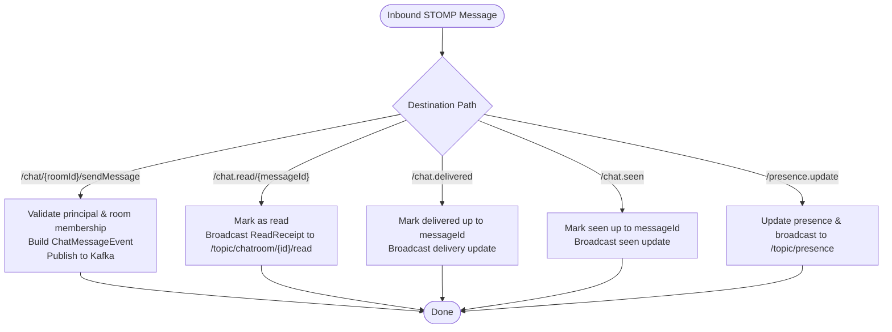
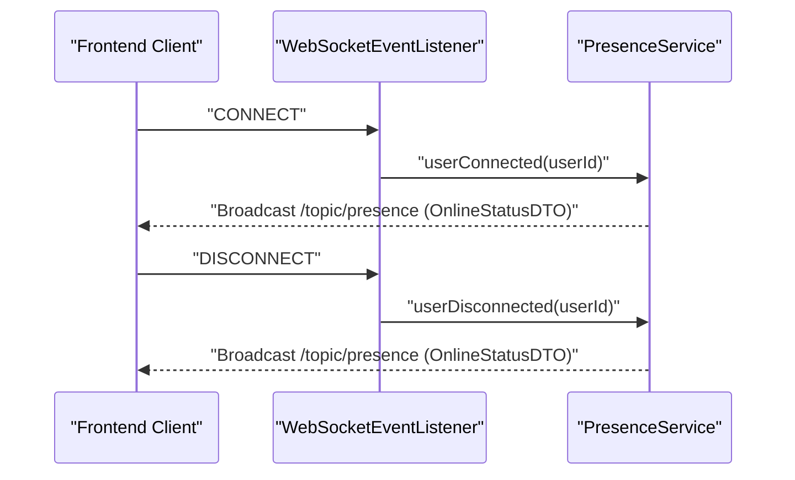
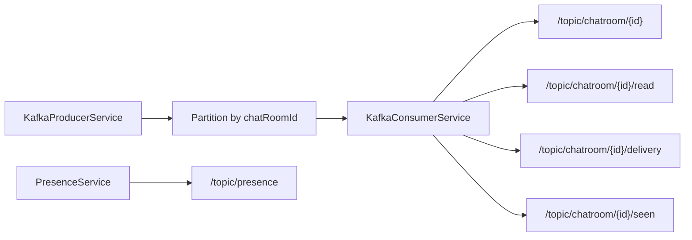
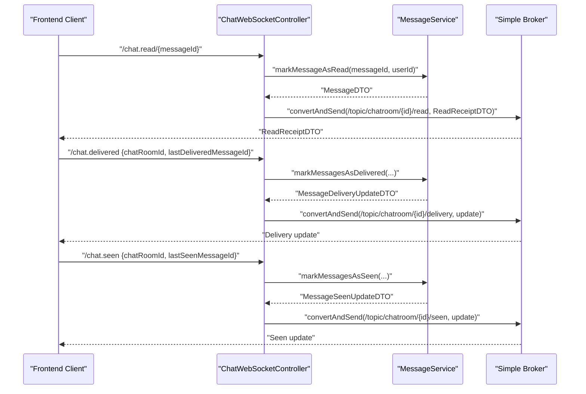
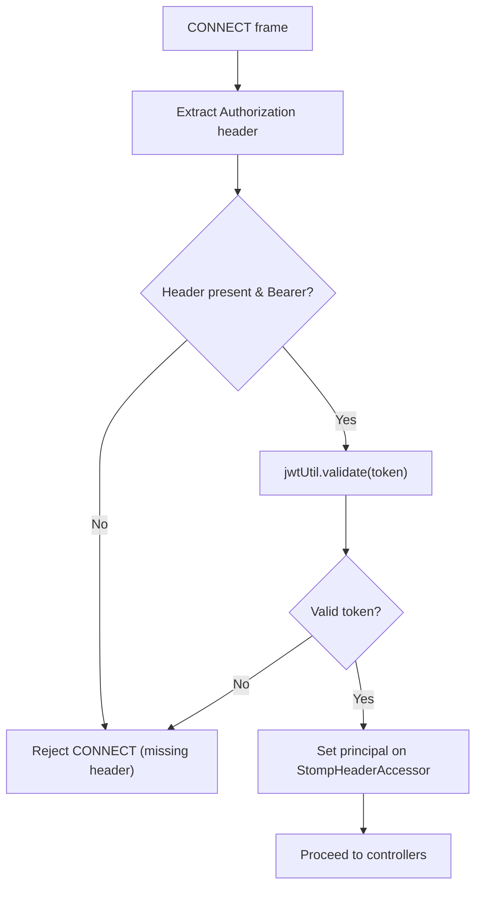
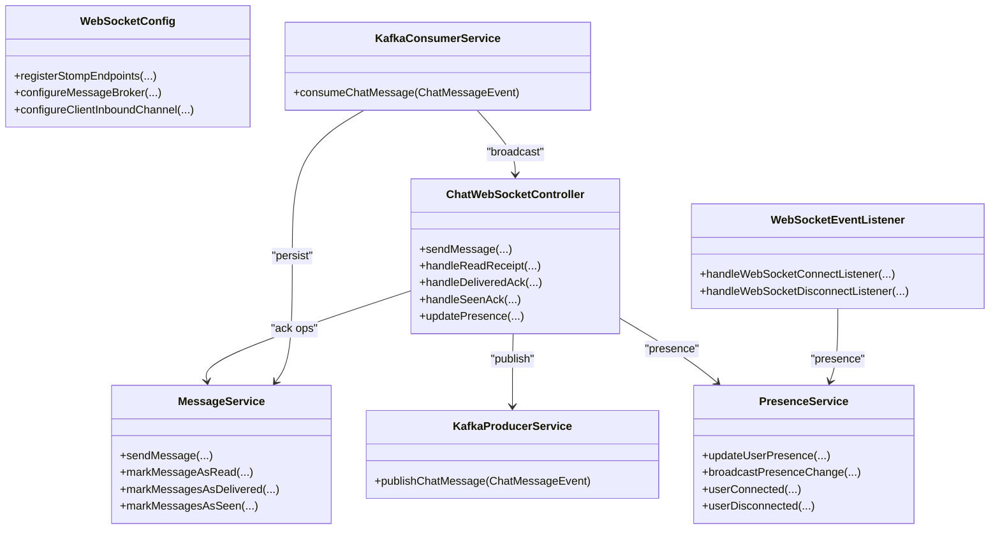

# Message Handling and Routing

<cite>
**Referenced Files in This Document**
- [ChatWebSocketController.java](file://src/main/java/com/chatify/chat_backend/controller/ChatWebSocketController.java)
- [WebSocketEventListener.java](file://src/main/java/com/chatify/chat_backend/listener/WebSocketEventListener.java)
- [WebSocketConfig.java](file://src/main/java/com/chatify/chat_backend/config/WebSocketConfig.java)
- [SendMessageDTO.java](file://src/main/java/com/chatify/chat_backend/dto/SendMessageDTO.java)
- [ChatMessageEvent.java](file://src/main/java/com/chatify/chat_backend/dto/ChatMessageEvent.java)
- [MessageDeliveredAckDTO.java](file://src/main/java/com/chatify/chat_backend/dto/MessageDeliveredAckDTO.java)
- [MessageSeenAckDTO.java](file://src/main/java/com/chatify/chat_backend/dto/MessageSeenAckDTO.java)
- [OnlineStatusDTO.java](file://src/main/java/com/chatify/chat_backend/dto/OnlineStatusDTO.java)
- [MessageDeliveryUpdateDTO.java](file://src/main/java/com/chatify/chat_backend/dto/MessageDeliveryUpdateDTO.java)
- [KafkaProducerService.java](file://src/main/java/com/chatify/chat_backend/service/KafkaProducerService.java)
- [KafkaConsumerService.java](file://src/main/java/com/chatify/chat_backend/service/KafkaConsumerService.java)
- [MessageService.java](file://src/main/java/com/chatify/chat_backend/service/MessageService.java)
- [PresenceService.java](file://src/main/java/com/chatify/chat_backend/service/PresenceService.java)
- [MessageType.java](file://src/main/java/com/chatify/chat_backend/entity/enums/MessageType.java)
- [UserStatus.java](file://src/main/java/com/chatify/chat_backend/entity/enums/UserStatus.java)
</cite>

## Table of Contents
1. [Introduction](#introduction)
2. [Project Structure](#project-structure)
3. [Core Components](#core-components)
4. [Architecture Overview](#architecture-overview)
5. [Detailed Component Analysis](#detailed-component-analysis)
6. [Dependency Analysis](#dependency-analysis)
7. [Performance Considerations](#performance-considerations)
8. [Troubleshooting Guide](#troubleshooting-guide)
9. [Conclusion](#conclusion)

## Introduction
This document explains the WebSocket message handling and routing mechanisms in the backend. It covers inbound message processing, outbound broadcasting, subscription management for chat rooms and presence updates, acknowledgment flows, and the integration with Kafka for persistence and real-time delivery. It also documents connection lifecycle handling, message validation, error handling strategies, and performance considerations for high-volume scenarios.

## Project Structure
The WebSocket stack is organized around Spring WebSocket and STOMP, with Kafka bridging producers and consumers to persist and broadcast messages. Key areas:
- Controllers: WebSocket endpoints for sending messages, read receipts, delivery/seen acknowledgments, and presence updates.
- Listeners: Connection lifecycle events for join/leave notifications.
- Configuration: Broker setup, endpoint registration, and inbound channel authentication.
- Services: Kafka producer/consumer orchestration, message persistence, and presence management.
- DTOs: Message payload and event structures exchanged across layers.

**Diagram sources**
- [WebSocketConfig.java:44-57](file://src/main/java/com/chatify/chat_backend/config/WebSocketConfig.java#L44-L57)
- [ChatWebSocketController.java:53-110](file://src/main/java/com/chatify/chat_backend/controller/ChatWebSocketController.java#L53-L110)
- [WebSocketEventListener.java:24-54](file://src/main/java/com/chatify/chat_backend/listener/WebSocketEventListener.java#L24-L54)
- [KafkaProducerService.java:32-49](file://src/main/java/com/chatify/chat_backend/service/KafkaProducerService.java#L32-L49)
- [KafkaConsumerService.java:34-71](file://src/main/java/com/chatify/chat_backend/service/KafkaConsumerService.java#L34-L71)
- [MessageService.java:50-78](file://src/main/java/com/chatify/chat_backend/service/MessageService.java#L50-L78)
- [PresenceService.java:101-115](file://src/main/java/com/chatify/chat_backend/service/PresenceService.java#L101-L115)

**Section sources**
- [WebSocketConfig.java:44-57](file://src/main/java/com/chatify/chat_backend/config/WebSocketConfig.java#L44-L57)
- [ChatWebSocketController.java:22-47](file://src/main/java/com/chatify/chat_backend/controller/ChatWebSocketController.java#L22-L47)
- [WebSocketEventListener.java:16-55](file://src/main/java/com/chatify/chat_backend/listener/WebSocketEventListener.java#L16-L55)
- [KafkaProducerService.java:14-50](file://src/main/java/com/chatify/chat_backend/service/KafkaProducerService.java#L14-L50)
- [KafkaConsumerService.java:12-72](file://src/main/java/com/chatify/chat_backend/service/KafkaConsumerService.java#L12-L72)
- [MessageService.java:29-286](file://src/main/java/com/chatify/chat_backend/service/MessageService.java#L29-L286)
- [PresenceService.java:19-132](file://src/main/java/com/chatify/chat_backend/service/PresenceService.java#L19-L132)

## Core Components
- ChatWebSocketController: Exposes STOMP endpoints for chat messaging, read receipts, delivery/seen acknowledgments, and presence updates. It validates access, enforces room membership, publishes events to Kafka, and sends targeted acknowledgments to subscribed clients.
- WebSocketEventListener: Handles session connect/disconnect events to update user presence and broadcast presence changes.
- WebSocketConfig: Registers STOMP endpoint with SockJS, enables a simple broker for topics/users, sets application destination prefixes, and authenticates CONNECT frames using JWT.
- KafkaProducerService: Publishes ChatMessageEvent keyed by chat room to preserve ordering per room.
- KafkaConsumerService: Consumes ChatMessageEvent, persists via MessageService, and broadcasts the saved MessageDTO to the room’s topic.
- MessageService: Validates message payloads, ensures participantship, saves messages, and manages read/delivery/seen status transitions and updates.
- PresenceService: Updates user presence, stores online state in Redis with TTL, and broadcasts presence changes.

**Section sources**
- [ChatWebSocketController.java:22-181](file://src/main/java/com/chatify/chat_backend/controller/ChatWebSocketController.java#L22-L181)
- [WebSocketEventListener.java:16-55](file://src/main/java/com/chatify/chat_backend/listener/WebSocketEventListener.java#L16-L55)
- [WebSocketConfig.java:30-111](file://src/main/java/com/chatify/chat_backend/config/WebSocketConfig.java#L30-L111)
- [KafkaProducerService.java:14-50](file://src/main/java/com/chatify/chat_backend/service/KafkaProducerService.java#L14-L50)
- [KafkaConsumerService.java:12-72](file://src/main/java/com/chatify/chat_backend/service/KafkaConsumerService.java#L12-L72)
- [MessageService.java:29-286](file://src/main/java/com/chatify/chat_backend/service/MessageService.java#L29-L286)
- [PresenceService.java:19-132](file://src/main/java/com/chatify/chat_backend/service/PresenceService.java#L19-L132)

## Architecture Overview
The system uses a publish-subscribe model:
- Clients connect via WebSocket with JWT authentication.
- Producers send ChatMessageEvent to Kafka keyed by chat room.
- Consumers persist messages and broadcast to the room’s topic.
- Controllers handle acknowledgments and presence updates, publishing targeted topic messages.

**Diagram sources**
- [ChatWebSocketController.java:81-110](file://src/main/java/com/chatify/chat_backend/controller/ChatWebSocketController.java#L81-L110)
- [KafkaProducerService.java:32-49](file://src/main/java/com/chatify/chat_backend/service/KafkaProducerService.java#L32-L49)
- [KafkaConsumerService.java:34-71](file://src/main/java/com/chatify/chat_backend/service/KafkaConsumerService.java#L34-L71)
- [MessageService.java:50-78](file://src/main/java/com/chatify/chat_backend/service/MessageService.java#L50-L78)

## Detailed Component Analysis

### WebSocket Endpoints and Routing
- Message sending:
  - Legacy route: /chat.sendMessage (kept for backward compatibility; still publishes to Kafka).
  - Primary route: /chat/{roomId}/sendMessage (recommended).
  - Validation: Requires authenticated principal and room membership; otherwise logs warnings and returns.
  - Producer: Builds ChatMessageEvent and publishes to Kafka topic.
- Read receipts:
  - Endpoint: /chat.read/{messageId}.
  - Behavior: Marks message as read, constructs ReadReceiptDTO, and publishes to /topic/chatroom/{id}/read.
- Delivery acknowledgment:
  - Endpoint: /chat.delivered.
  - Behavior: Transitions messages to DELIVERED up to lastDeliveredMessageId and publishes MessageDeliveryUpdateDTO to /topic/chatroom/{id}/delivery.
- Seen acknowledgment:
  - Endpoint: /chat.seen.
  - Behavior: Transitions messages to SEEN up to lastSeenMessageId, marks readBy, and publishes MessageSeenUpdateDTO to /topic/chatroom/{id}/seen.
- Presence:
  - Endpoint: /presence.update.
  - Behavior: Updates user presence and broadcasts to /topic/presence.

**Diagram sources**
- [ChatWebSocketController.java:53-181](file://src/main/java/com/chatify/chat_backend/controller/ChatWebSocketController.java#L53-L181)

**Section sources**
- [ChatWebSocketController.java:53-181](file://src/main/java/com/chatify/chat_backend/controller/ChatWebSocketController.java#L53-L181)

### Connection Lifecycle Events
- Connect event: Extracts principal from CONNECT frame, resolves user, and marks user as online; broadcasts presence change.
- Disconnect event: Same as connect but marks user as offline; broadcasts presence change.
- Security: Early return if principal is missing on connect/disconnect.

**Diagram sources**
- [WebSocketEventListener.java:24-54](file://src/main/java/com/chatify/chat_backend/listener/WebSocketEventListener.java#L24-L54)
- [PresenceService.java:101-115](file://src/main/java/com/chatify/chat_backend/service/PresenceService.java#L101-L115)

**Section sources**
- [WebSocketEventListener.java:16-55](file://src/main/java/com/chatify/chat_backend/listener/WebSocketEventListener.java#L16-L55)
- [PresenceService.java:19-132](file://src/main/java/com/chatify/chat_backend/service/PresenceService.java#L19-L132)

### Message Payload Specifications
- SendMessageDTO: chatRoomId, content, messageType (default TEXT), fileUrl, fileName.
- ChatMessageEvent: chatRoomId, senderId, content, messageType, fileUrl, fileName.
- MessageDeliveredAckDTO: chatRoomId, lastDeliveredMessageId.
- MessageSeenAckDTO: chatRoomId, lastSeenMessageId.
- OnlineStatusDTO: userId, username, status, lastSeen.

These DTOs define the message formats for inbound payloads, Kafka events, and outbound acknowledgments.

**Section sources**
- [SendMessageDTO.java:12-21](file://src/main/java/com/chatify/chat_backend/dto/SendMessageDTO.java#L12-L21)
- [ChatMessageEvent.java:16-25](file://src/main/java/com/chatify/chat_backend/dto/ChatMessageEvent.java#L16-L25)
- [MessageDeliveredAckDTO.java:6-9](file://src/main/java/com/chatify/chat_backend/dto/MessageDeliveredAckDTO.java#L6-L9)
- [MessageSeenAckDTO.java:6-9](file://src/main/java/com/chatify/chat_backend/dto/MessageSeenAckDTO.java#L6-L9)
- [OnlineStatusDTO.java:13-18](file://src/main/java/com/chatify/chat_backend/dto/OnlineStatusDTO.java#L13-L18)

### Message Routing Patterns
- Topic-based broadcasting for chat rooms:
  - Producer: KafkaProducerService publishes with key=chatRoomId to ensure partition affinity and in-room ordering.
  - Consumer: KafkaConsumerService broadcasts saved MessageDTO to /topic/chatroom/{chatRoomId}.
  - Controller acknowledgments: Broadcast to /topic/chatroom/{id}/read, /topic/chatroom/{id}/delivery, /topic/chatroom/{id}/seen.
- Presence notifications:
  - PresenceService broadcasts OnlineStatusDTO to /topic/presence on connect/disconnect and explicit updates.
- User-specific messaging:
  - WebSocketConfig enables /user destinations for point-to-user routing; however, the current implementation focuses on room-based topics.

**Diagram sources**
- [KafkaProducerService.java:32-36](file://src/main/java/com/chatify/chat_backend/service/KafkaProducerService.java#L32-L36)
- [KafkaConsumerService.java:56-59](file://src/main/java/com/chatify/chat_backend/service/KafkaConsumerService.java#L56-L59)
- [ChatWebSocketController.java:128-131](file://src/main/java/com/chatify/chat_backend/controller/ChatWebSocketController.java#L128-L131)
- [ChatWebSocketController.java:157-161](file://src/main/java/com/chatify/chat_backend/controller/ChatWebSocketController.java#L157-L161)
- [ChatWebSocketController.java:176-180](file://src/main/java/com/chatify/chat_backend/controller/ChatWebSocketController.java#L176-L180)
- [PresenceService.java:101-103](file://src/main/java/com/chatify/chat_backend/service/PresenceService.java#L101-L103)

**Section sources**
- [KafkaProducerService.java:27-49](file://src/main/java/com/chatify/chat_backend/service/KafkaProducerService.java#L27-L49)
- [KafkaConsumerService.java:26-71](file://src/main/java/com/chatify/chat_backend/service/KafkaConsumerService.java#L26-L71)
- [ChatWebSocketController.java:128-180](file://src/main/java/com/chatify/chat_backend/controller/ChatWebSocketController.java#L128-L180)
- [PresenceService.java:101-115](file://src/main/java/com/chatify/chat_backend/service/PresenceService.java#L101-L115)

### Acknowledgment Patterns
- Read receipt: Client sends /chat.read/{messageId}; server responds with ReadReceiptDTO to /topic/chatroom/{id}/read.
- Delivery update: Client sends /chat.delivered with lastDeliveredMessageId; server responds with MessageDeliveryUpdateDTO to /topic/chatroom/{id}/delivery.
- Seen update: Client sends /chat.seen with lastSeenMessageId; server responds with MessageSeenUpdateDTO to /topic/chatroom/{id}/seen.

**Diagram sources**
- [ChatWebSocketController.java:112-180](file://src/main/java/com/chatify/chat_backend/controller/ChatWebSocketController.java#L112-L180)
- [MessageService.java:194-228](file://src/main/java/com/chatify/chat_backend/service/MessageService.java#L194-L228)
- [MessageService.java:231-269](file://src/main/java/com/chatify/chat_backend/service/MessageService.java#L231-L269)

**Section sources**
- [ChatWebSocketController.java:112-180](file://src/main/java/com/chatify/chat_backend/controller/ChatWebSocketController.java#L112-L180)
- [MessageService.java:194-269](file://src/main/java/com/chatify/chat_backend/service/MessageService.java#L194-L269)

### Authentication and Authorization
- CONNECT frame authentication: The inbound channel interceptor extracts the Authorization header, validates the JWT via JwtUtil, and sets the principal on the StompHeaderAccessor.
- Endpoint authorization: Controllers are protected with @PreAuthorize("isAuthenticated()"), ensuring only authenticated users can send messages or acknowledgments.
- Room membership checks: Controllers verify that the authenticated user belongs to the target chat room before processing.

**Diagram sources**
- [WebSocketConfig.java:68-110](file://src/main/java/com/chatify/chat_backend/config/WebSocketConfig.java#L68-L110)
- [ChatWebSocketController.java:23-24](file://src/main/java/com/chatify/chat_backend/controller/ChatWebSocketController.java#L23-L24)

**Section sources**
- [WebSocketConfig.java:68-110](file://src/main/java/com/chatify/chat_backend/config/WebSocketConfig.java#L68-L110)
- [ChatWebSocketController.java:23-47](file://src/main/java/com/chatify/chat_backend/controller/ChatWebSocketController.java#L23-L47)

### Message Validation Rules
- Content validation: sendMessage requires either content or a file attachment; otherwise throws a bad request error.
- Participantship: sendMessage verifies that the sender is a participant of the chat room; otherwise unauthorized.
- Acknowledgment boundaries: Delivery/seen updates operate up to a provided messageId; out-of-range or non-existent ids are handled gracefully by returning null updates.

**Section sources**
- [MessageService.java:50-78](file://src/main/java/com/chatify/chat_backend/service/MessageService.java#L50-L78)
- [MessageService.java:194-228](file://src/main/java/com/chatify/chat_backend/service/MessageService.java#L194-L228)
- [MessageService.java:231-269](file://src/main/java/com/chatify/chat_backend/service/MessageService.java#L231-L269)

### Subscription Management
- Chat rooms: Subscriptions to /topic/chatroom/{id} are managed implicitly by the broker; clients subscribe upon joining a room.
- Read/Delivery/Seen: Dedicated topics per room for acknowledgment traffic.
- Presence: Subscriptions to /topic/presence for global presence updates.

**Section sources**
- [WebSocketConfig.java:52-56](file://src/main/java/com/chatify/chat_backend/config/WebSocketConfig.java#L52-L56)
- [ChatWebSocketController.java:128-180](file://src/main/java/com/chatify/chat_backend/controller/ChatWebSocketController.java#L128-L180)
- [PresenceService.java:101-103](file://src/main/java/com/chatify/chat_backend/service/PresenceService.java#L101-L103)

## Dependency Analysis

**Diagram sources**
- [ChatWebSocketController.java:22-181](file://src/main/java/com/chatify/chat_backend/controller/ChatWebSocketController.java#L22-L181)
- [WebSocketEventListener.java:16-55](file://src/main/java/com/chatify/chat_backend/listener/WebSocketEventListener.java#L16-L55)
- [WebSocketConfig.java:30-111](file://src/main/java/com/chatify/chat_backend/config/WebSocketConfig.java#L30-L111)
- [KafkaProducerService.java:14-50](file://src/main/java/com/chatify/chat_backend/service/KafkaProducerService.java#L14-L50)
- [KafkaConsumerService.java:12-72](file://src/main/java/com/chatify/chat_backend/service/KafkaConsumerService.java#L12-L72)
- [MessageService.java:29-286](file://src/main/java/com/chatify/chat_backend/service/MessageService.java#L29-L286)
- [PresenceService.java:19-132](file://src/main/java/com/chatify/chat_backend/service/PresenceService.java#L19-L132)

**Section sources**
- [ChatWebSocketController.java:22-181](file://src/main/java/com/chatify/chat_backend/controller/ChatWebSocketController.java#L22-L181)
- [WebSocketEventListener.java:16-55](file://src/main/java/com/chatify/chat_backend/listener/WebSocketEventListener.java#L16-L55)
- [WebSocketConfig.java:30-111](file://src/main/java/com/chatify/chat_backend/config/WebSocketConfig.java#L30-L111)
- [KafkaProducerService.java:14-50](file://src/main/java/com/chatify/chat_backend/service/KafkaProducerService.java#L14-L50)
- [KafkaConsumerService.java:12-72](file://src/main/java/com/chatify/chat_backend/service/KafkaConsumerService.java#L12-L72)
- [MessageService.java:29-286](file://src/main/java/com/chatify/chat_backend/service/MessageService.java#L29-L286)
- [PresenceService.java:19-132](file://src/main/java/com/chatify/chat_backend/service/PresenceService.java#L19-L132)

## Performance Considerations
- Partitioning and ordering:
  - KafkaProducerService keys messages by chatRoomId, ensuring all messages for a room are routed to the same partition and processed in creation order.
- Throughput:
  - Use asynchronous Kafka sends with callbacks to avoid blocking the WebSocket thread.
- Backpressure:
  - Ensure consumers keep up with producers; tune consumer concurrency and batch sizes.
- Presence caching:
  - PresenceService caches online users in Redis with TTL to reduce DB queries and improve scalability.
- Heartbeats:
  - WebSocketConfig configures broker heartbeats to detect dead connections promptly.

**Section sources**
- [KafkaProducerService.java:27-49](file://src/main/java/com/chatify/chat_backend/service/KafkaProducerService.java#L27-L49)
- [PresenceService.java:67-78](file://src/main/java/com/chatify/chat_backend/service/PresenceService.java#L67-L78)
- [WebSocketConfig.java:52-66](file://src/main/java/com/chatify/chat_backend/config/WebSocketConfig.java#L52-L66)

## Troubleshooting Guide
- Authentication failures:
  - CONNECT without Authorization or invalid JWT leads to rejection in the inbound channel interceptor.
- Missing principal:
  - Controllers return early if principal is null; verify client sends Authorization header.
- Room membership errors:
  - sendMessage and ack handlers check room membership; ensure the authenticated user belongs to the target chat room.
- Kafka publishing failures:
  - Producer logs errors with room and sender info; inspect logs and topic configuration.
- Consumer processing errors:
  - Consumer wraps processing in try/catch and rethrows to enable retries; check error handler configuration.
- Presence anomalies:
  - PresenceService uses Redis TTL as a safety net; if a user appears offline unexpectedly, verify Redis connectivity and TTL settings.

**Section sources**
- [WebSocketConfig.java:68-110](file://src/main/java/com/chatify/chat_backend/config/WebSocketConfig.java#L68-L110)
- [ChatWebSocketController.java:53-181](file://src/main/java/com/chatify/chat_backend/controller/ChatWebSocketController.java#L53-L181)
- [KafkaProducerService.java:38-48](file://src/main/java/com/chatify/chat_backend/service/KafkaProducerService.java#L38-L48)
- [KafkaConsumerService.java:64-71](file://src/main/java/com/chatify/chat_backend/service/KafkaConsumerService.java#L64-L71)
- [PresenceService.java:67-78](file://src/main/java/com/chatify/chat_backend/service/PresenceService.java#L67-L78)

## Conclusion
The WebSocket message handling pipeline integrates secure, authenticated STOMP endpoints with a Kafka-driven persistence and broadcast layer. Room-based topic routing, explicit acknowledgment flows, and Redis-backed presence updates provide a robust foundation for scalable, real-time chat. Adhering to validation rules, leveraging partitioning for ordering, and monitoring consumer throughput ensures reliable operation under high volume.