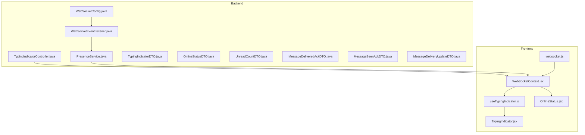
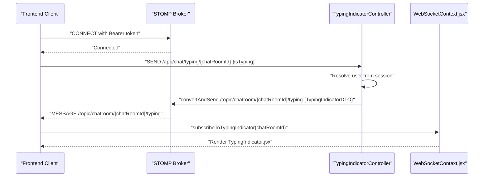
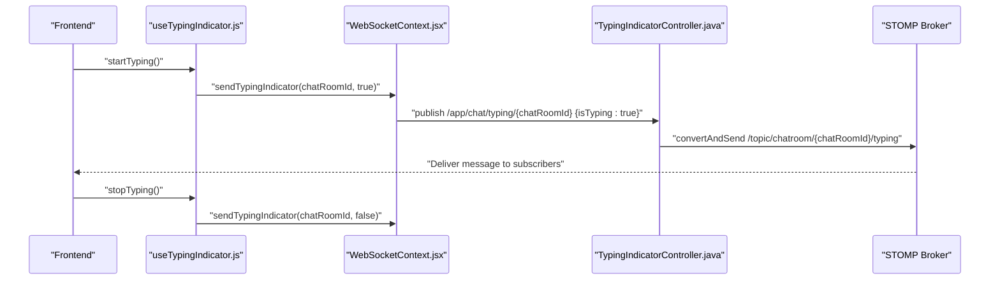
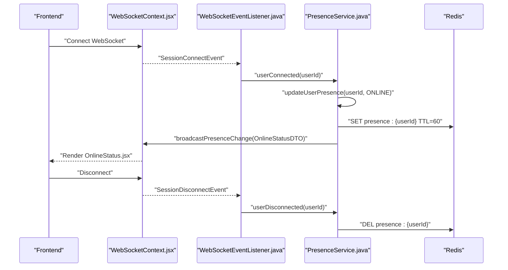
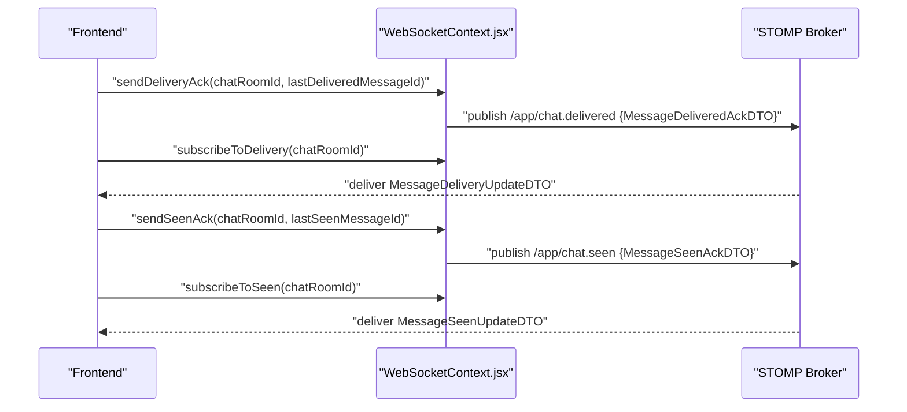
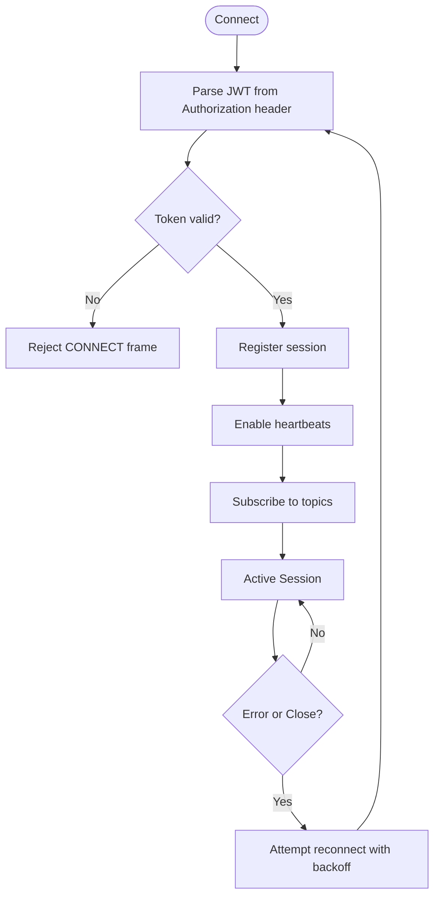
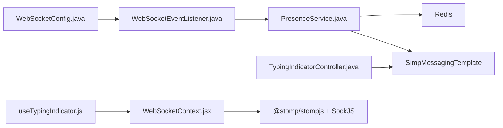

# Real-time Features Implementation

<cite>
**Referenced Files in This Document**
- [TypingIndicatorDTO.java](file://src/main/java/com/chatify/chat_backend/dto/TypingIndicatorDTO.java)
- [OnlineStatusDTO.java](file://src/main/java/com/chatify/chat_backend/dto/OnlineStatusDTO.java)
- [UnreadCountDTO.java](file://src/main/java/com/chatify/chat_backend/dto/UnreadCountDTO.java)
- [MessageDeliveredAckDTO.java](file://src/main/java/com/chatify/chat_backend/dto/MessageDeliveredAckDTO.java)
- [MessageSeenAckDTO.java](file://src/main/java/com/chatify/chat_backend/dto/MessageSeenAckDTO.java)
- [MessageDeliveryUpdateDTO.java](file://src/main/java/com/chatify/chat_backend/dto/MessageDeliveryUpdateDTO.java)
- [MessageSeenUpdateDTO.java](file://src/main/java/com/chatify/chat_backend/dto/MessageSeenUpdateDTO.java)
- [PresenceService.java](file://src/main/java/com/chatify/chat_backend/service/PresenceService.java)
- [TypingIndicatorController.java](file://src/main/java/com/chatify/chat_backend/controller/TypingIndicatorController.java)
- [WebSocketConfig.java](file://src/main/java/com/chatify/chat_backend/config/WebSocketConfig.java)
- [WebSocketEventListener.java](file://src/main/java/com/chatify/chat_backend/listener/WebSocketEventListener.java)
- [WebSocketContext.jsx](file://chatify-frontend/src/context/WebSocketContext.jsx)
- [useTypingIndicator.js](file://chatify-frontend/src/hooks/useTypingIndicator.js)
- [TypingIndicator.jsx](file://chatify-frontend/src/components/Chat/TypingIndicator.jsx)
- [OnlineStatus.jsx](file://chatify-frontend/src/components/Common/OnlineStatus.jsx)
- [websocket.js](file://chatify-frontend/src/services/websocket.js)
</cite>

## Table of Contents
1. [Introduction](#introduction)
2. [Project Structure](#project-structure)
3. [Core Components](#core-components)
4. [Architecture Overview](#architecture-overview)
5. [Detailed Component Analysis](#detailed-component-analysis)
6. [Dependency Analysis](#dependency-analysis)
7. [Performance Considerations](#performance-considerations)
8. [Troubleshooting Guide](#troubleshooting-guide)
9. [Conclusion](#conclusion)
10. [Appendices](#appendices)

## Introduction
This document explains the real-time features implementation for typing indicators, read receipts, online presence tracking, and message delivery acknowledgments. It covers DTO structures, backend services, WebSocket configuration, and frontend integration patterns. It also documents data transmission formats, client-side update mechanisms, and backend integrations with Redis and message state management.

## Project Structure
The real-time features span both backend and frontend:
- Backend Java services and DTOs define the data contracts and presence management.
- Spring WebSocket configuration enables STOMP over SockJS with JWT authentication.
- Frontend React context and hooks manage WebSocket lifecycle, subscriptions, and UI updates.

**Diagram sources**
- [WebSocketConfig.java:1-111](file://src/main/java/com/chatify/chat_backend/config/WebSocketConfig.java#L1-L111)
- [WebSocketEventListener.java:1-55](file://src/main/java/com/chatify/chat_backend/listener/WebSocketEventListener.java#L1-L55)
- [TypingIndicatorController.java:1-56](file://src/main/java/com/chatify/chat_backend/controller/TypingIndicatorController.java#L1-L56)
- [PresenceService.java:1-132](file://src/main/java/com/chatify/chat_backend/service/PresenceService.java#L1-L132)
- [TypingIndicatorDTO.java:1-15](file://src/main/java/com/chatify/chat_backend/dto/TypingIndicatorDTO.java#L1-L15)
- [OnlineStatusDTO.java:1-19](file://src/main/java/com/chatify/chat_backend/dto/OnlineStatusDTO.java#L1-L19)
- [UnreadCountDTO.java:1-6](file://src/main/java/com/chatify/chat_backend/dto/UnreadCountDTO.java#L1-L6)
- [MessageDeliveredAckDTO.java:1-10](file://src/main/java/com/chatify/chat_backend/dto/MessageDeliveredAckDTO.java#L1-L10)
- [MessageSeenAckDTO.java:1-10](file://src/main/java/com/chatify/chat_backend/dto/MessageSeenAckDTO.java#L1-L10)
- [MessageDeliveryUpdateDTO.java:1-12](file://src/main/java/com/chatify/chat_backend/dto/MessageDeliveryUpdateDTO.java#L1-L12)
- [WebSocketContext.jsx:1-190](file://chatify-frontend/src/context/WebSocketContext.jsx#L1-L190)
- [useTypingIndicator.js:1-71](file://chatify-frontend/src/hooks/useTypingIndicator.js#L1-L71)
- [TypingIndicator.jsx:1-44](file://chatify-frontend/src/components/Chat/TypingIndicator.jsx#L1-L44)
- [OnlineStatus.jsx:1-25](file://chatify-frontend/src/components/Common/OnlineStatus.jsx#L1-L25)
- [websocket.js:1-327](file://chatify-frontend/src/services/websocket.js#L1-L327)

**Section sources**
- [WebSocketConfig.java:1-111](file://src/main/java/com/chatify/chat_backend/config/WebSocketConfig.java#L1-L111)
- [WebSocketContext.jsx:1-190](file://chatify-frontend/src/context/WebSocketContext.jsx#L1-L190)

## Core Components
- TypingIndicatorDTO: Carries typing state per user and chat room for real-time typing notifications.
- OnlineStatusDTO: Carries user presence status and last seen timestamp for online presence tracking.
- UnreadCountDTO: Contract for unread message counts per chat room.
- PresenceService: Manages user online/offline status, Redis-backed presence cache, and presence broadcasting.
- TypingIndicatorController: Handles typing indicator updates via WebSocket and broadcasts to chat room subscribers.
- WebSocketConfig: Configures STOMP endpoints, message broker, heartbeats, and JWT authentication interceptor.
- WebSocketEventListener: Listens to session connect/disconnect events and triggers presence updates.
- Frontend WebSocketContext: Provides STOMP client lifecycle, subscriptions, and publish helpers for real-time features.

**Section sources**
- [TypingIndicatorDTO.java:1-15](file://src/main/java/com/chatify/chat_backend/dto/TypingIndicatorDTO.java#L1-L15)
- [OnlineStatusDTO.java:1-19](file://src/main/java/com/chatify/chat_backend/dto/OnlineStatusDTO.java#L1-L19)
- [UnreadCountDTO.java:1-6](file://src/main/java/com/chatify/chat_backend/dto/UnreadCountDTO.java#L1-L6)
- [PresenceService.java:1-132](file://src/main/java/com/chatify/chat_backend/service/PresenceService.java#L1-L132)
- [TypingIndicatorController.java:1-56](file://src/main/java/com/chatify/chat_backend/controller/TypingIndicatorController.java#L1-L56)
- [WebSocketConfig.java:1-111](file://src/main/java/com/chatify/chat_backend/config/WebSocketConfig.java#L1-L111)
- [WebSocketEventListener.java:1-55](file://src/main/java/com/chatify/chat_backend/listener/WebSocketEventListener.java#L1-L55)
- [WebSocketContext.jsx:1-190](file://chatify-frontend/src/context/WebSocketContext.jsx#L1-L190)

## Architecture Overview
The system uses Spring WebSocket (STOMP over SockJS) for real-time communication. JWT authentication secures connections. Presence data is cached in Redis for fast retrieval and automatic expiry. Frontend integrates via a React context wrapper around @stomp/stompjs.

**Diagram sources**
- [WebSocketConfig.java:44-57](file://src/main/java/com/chatify/chat_backend/config/WebSocketConfig.java#L44-L57)
- [WebSocketConfig.java:68-110](file://src/main/java/com/chatify/chat_backend/config/WebSocketConfig.java#L68-L110)
- [TypingIndicatorController.java:30-55](file://src/main/java/com/chatify/chat_backend/controller/TypingIndicatorController.java#L30-L55)
- [WebSocketContext.jsx:124-150](file://chatify-frontend/src/context/WebSocketContext.jsx#L124-L150)
- [TypingIndicator.jsx:1-44](file://chatify-frontend/src/components/Chat/TypingIndicator.jsx#L1-L44)

## Detailed Component Analysis

### Typing Indicator Feature
- Backend:
  - DTO: TypingIndicatorDTO carries user identity, typing state, and chat room identifier.
  - Controller: TypingIndicatorController handles incoming typing updates, enriches payload with authenticated user info, and broadcasts to the chat room’s typing topic.
- Frontend:
  - Hook: useTypingIndicator manages debounced typing signals and auto-stops typing after a timeout.
  - Component: TypingIndicator.jsx renders typing indicators excluding the current user.

**Diagram sources**
- [useTypingIndicator.js:15-48](file://chatify-frontend/src/hooks/useTypingIndicator.js#L15-L48)
- [WebSocketContext.jsx:152-158](file://chatify-frontend/src/context/WebSocketContext.jsx#L152-L158)
- [TypingIndicatorController.java:30-55](file://src/main/java/com/chatify/chat_backend/controller/TypingIndicatorController.java#L30-L55)

**Section sources**
- [TypingIndicatorDTO.java:1-15](file://src/main/java/com/chatify/chat_backend/dto/TypingIndicatorDTO.java#L1-L15)
- [TypingIndicatorController.java:1-56](file://src/main/java/com/chatify/chat_backend/controller/TypingIndicatorController.java#L1-L56)
- [useTypingIndicator.js:1-71](file://chatify-frontend/src/hooks/useTypingIndicator.js#L1-L71)
- [TypingIndicator.jsx:1-44](file://chatify-frontend/src/components/Chat/TypingIndicator.jsx#L1-L44)

### Online Presence Tracking
- Backend:
  - DTO: OnlineStatusDTO carries user presence and last seen timestamp.
  - Service: PresenceService updates user status, caches presence in Redis with TTL, and broadcasts presence changes.
  - Events: WebSocketEventListener listens to connect/disconnect events and invokes PresenceService to update and broadcast status.
- Frontend:
  - Component: OnlineStatus.jsx renders online/offline indicator with optional label and sizing.

**Diagram sources**
- [WebSocketEventListener.java:24-54](file://src/main/java/com/chatify/chat_backend/listener/WebSocketEventListener.java#L24-L54)
- [PresenceService.java:49-115](file://src/main/java/com/chatify/chat_backend/service/PresenceService.java#L49-L115)
- [OnlineStatusDTO.java:1-19](file://src/main/java/com/chatify/chat_backend/dto/OnlineStatusDTO.java#L1-L19)
- [WebSocketContext.jsx:131-136](file://chatify-frontend/src/context/WebSocketContext.jsx#L131-L136)
- [OnlineStatus.jsx:1-25](file://chatify-frontend/src/components/Common/OnlineStatus.jsx#L1-L25)

**Section sources**
- [OnlineStatusDTO.java:1-19](file://src/main/java/com/chatify/chat_backend/dto/OnlineStatusDTO.java#L1-L19)
- [PresenceService.java:1-132](file://src/main/java/com/chatify/chat_backend/service/PresenceService.java#L1-L132)
- [WebSocketEventListener.java:1-55](file://src/main/java/com/chatify/chat_backend/listener/WebSocketEventListener.java#L1-L55)
- [OnlineStatus.jsx:1-25](file://chatify-frontend/src/components/Common/OnlineStatus.jsx#L1-L25)

### Message Delivery and Read Receipts
- Backend DTOs:
  - MessageDeliveredAckDTO and MessageSeenAckDTO carry acknowledgment payloads for delivery and read receipts.
  - MessageDeliveryUpdateDTO and MessageSeenUpdateDTO represent server-initiated updates to clients.
- Frontend:
  - WebSocketContext exposes sendDeliveryAck and sendSeenAck helpers and subscription methods for delivery and seen topics.

**Diagram sources**
- [MessageDeliveredAckDTO.java:1-10](file://src/main/java/com/chatify/chat_backend/dto/MessageDeliveredAckDTO.java#L1-L10)
- [MessageSeenAckDTO.java:1-10](file://src/main/java/com/chatify/chat_backend/dto/MessageSeenAckDTO.java#L1-L10)
- [MessageDeliveryUpdateDTO.java:1-12](file://src/main/java/com/chatify/chat_backend/dto/MessageDeliveryUpdateDTO.java#L1-L12)
- [WebSocketContext.jsx:160-174](file://chatify-frontend/src/context/WebSocketContext.jsx#L160-L174)

**Section sources**
- [MessageDeliveredAckDTO.java:1-10](file://src/main/java/com/chatify/chat_backend/dto/MessageDeliveredAckDTO.java#L1-L10)
- [MessageSeenAckDTO.java:1-10](file://src/main/java/com/chatify/chat_backend/dto/MessageSeenAckDTO.java#L1-L10)
- [MessageDeliveryUpdateDTO.java:1-12](file://src/main/java/com/chatify/chat_backend/dto/MessageDeliveryUpdateDTO.java#L1-L12)
- [WebSocketContext.jsx:160-174](file://chatify-frontend/src/context/WebSocketContext.jsx#L160-L174)

### WebSocket Integration Patterns
- Authentication: JWT token parsed from Authorization header during CONNECT frames; invalid tokens are rejected.
- Heartbeats: Broker configured with periodic heartbeat intervals; frontend aligns heartbeat timings.
- Subscriptions: Frontend subscribes to per-room topics for messages, typing, delivery, and seen updates; global presence topic is supported.
- Reconnection: Frontend attempts exponential backoff reconnection and refreshes tokens on expiration.

**Diagram sources**
- [WebSocketConfig.java:68-110](file://src/main/java/com/chatify/chat_backend/config/WebSocketConfig.java#L68-L110)
- [WebSocketContext.jsx:47-122](file://chatify-frontend/src/context/WebSocketContext.jsx#L47-L122)

**Section sources**
- [WebSocketConfig.java:1-111](file://src/main/java/com/chatify/chat_backend/config/WebSocketConfig.java#L1-L111)
- [WebSocketContext.jsx:1-190](file://chatify-frontend/src/context/WebSocketContext.jsx#L1-L190)

## Dependency Analysis
- Backend:
  - PresenceService depends on RedisTemplate for caching and SimpMessagingTemplate for broadcasting.
  - WebSocketConfig registers STOMP endpoints and sets up JWT authentication interceptor.
  - WebSocketEventListener reacts to session lifecycle events and delegates to PresenceService.
- Frontend:
  - WebSocketContext wraps @stomp/stompjs and SockJS, manages subscriptions, and exposes helpers for real-time features.
  - useTypingIndicator integrates debounce and timeout logic to reduce traffic and stabilize UX.

**Diagram sources**
- [WebSocketConfig.java:27-57](file://src/main/java/com/chatify/chat_backend/config/WebSocketConfig.java#L27-L57)
- [WebSocketEventListener.java:21-22](file://src/main/java/com/chatify/chat_backend/listener/WebSocketEventListener.java#L21-L22)
- [PresenceService.java:22-42](file://src/main/java/com/chatify/chat_backend/service/PresenceService.java#L22-L42)
- [TypingIndicatorController.java:17-23](file://src/main/java/com/chatify/chat_backend/controller/TypingIndicatorController.java#L17-L23)
- [WebSocketContext.jsx:1-190](file://chatify-frontend/src/context/WebSocketContext.jsx#L1-L190)
- [useTypingIndicator.js:1-71](file://chatify-frontend/src/hooks/useTypingIndicator.js#L1-L71)

**Section sources**
- [PresenceService.java:1-132](file://src/main/java/com/chatify/chat_backend/service/PresenceService.java#L1-L132)
- [WebSocketConfig.java:1-111](file://src/main/java/com/chatify/chat_backend/config/WebSocketConfig.java#L1-L111)
- [WebSocketContext.jsx:1-190](file://chatify-frontend/src/context/WebSocketContext.jsx#L1-L190)

## Performance Considerations
- Redis caching for presence:
  - Uses TTL to automatically expire stale presence entries, reducing database load and ensuring eventual consistency.
  - Scans for active presence keys to compute online users efficiently.
- Debouncing and timeouts for typing:
  - Frontend debounce prevents excessive typing indicator broadcasts; timeout ensures automatic stop after inactivity.
- Heartbeats and backoff:
  - Configured broker heartbeats keep connections alive; frontend exponential backoff reduces server load during transient failures.
- Memory management:
  - Frontend unsubscribes and cleans up subscriptions on component unmount; WebSocket service maintains a message queue only while disconnected.
- Scalability:
  - STOMP broker supports horizontal scaling; Redis clustering can back presence cache for large user bases.
  - Per-room subscriptions minimize fan-out compared to global broadcasts.

[No sources needed since this section provides general guidance]

## Troubleshooting Guide
- Authentication failures:
  - Backend rejects CONNECT frames missing or invalid Authorization headers; verify JWT validity and extraction.
- Connection drops:
  - Frontend handles STOMP errors and WebSocket close events; attempts token refresh and reconnects with backoff.
- Presence not updating:
  - Ensure WebSocket connect/disconnect events fire and PresenceService updates Redis and broadcasts.
- Typing indicator not visible:
  - Confirm subscriptions to typing topic and that current user is filtered out in the UI component.

**Section sources**
- [WebSocketConfig.java:68-110](file://src/main/java/com/chatify/chat_backend/config/WebSocketConfig.java#L68-L110)
- [WebSocketContext.jsx:74-109](file://chatify-frontend/src/context/WebSocketContext.jsx#L74-L109)
- [WebSocketEventListener.java:24-54](file://src/main/java/com/chatify/chat_backend/listener/WebSocketEventListener.java#L24-L54)
- [TypingIndicator.jsx:10-17](file://chatify-frontend/src/components/Chat/TypingIndicator.jsx#L10-L17)

## Conclusion
The real-time feature set leverages Spring WebSocket with JWT authentication, Redis-backed presence caching, and a robust frontend integration layer. Typing indicators, presence updates, and message delivery/read receipts are delivered via targeted STOMP topics with efficient client-side subscription and state management.

[No sources needed since this section summarizes without analyzing specific files]

## Appendices

### Data Transmission Formats
- TypingIndicatorDTO
  - Fields: userId, username, isTyping, chatRoomId
  - Example destinations:
    - Client to server: /app/chat/typing/{chatRoomId}
    - Server to clients: /topic/chatroom/{chatRoomId}/typing
- OnlineStatusDTO
  - Fields: userId, username, status, lastSeen
  - Example destinations:
    - Server to clients: /topic/presence
- MessageDeliveredAckDTO and MessageSeenAckDTO
  - Fields: chatRoomId, lastDeliveredMessageId or lastSeenMessageId
  - Example destinations:
    - Client to server: /app/chat.delivered, /app/chat.seen
- MessageDeliveryUpdateDTO and MessageSeenUpdateDTO
  - Fields: chatRoomId, lastDeliveredMessageId or lastSeenMessageId
  - Example destinations:
    - Server to clients: /topic/chatroom/{chatRoomId}/delivery, /topic/chatroom/{chatRoomId}/seen

**Section sources**
- [TypingIndicatorDTO.java:1-15](file://src/main/java/com/chatify/chat_backend/dto/TypingIndicatorDTO.java#L1-L15)
- [OnlineStatusDTO.java:1-19](file://src/main/java/com/chatify/chat_backend/dto/OnlineStatusDTO.java#L1-L19)
- [MessageDeliveredAckDTO.java:1-10](file://src/main/java/com/chatify/chat_backend/dto/MessageDeliveredAckDTO.java#L1-L10)
- [MessageSeenAckDTO.java:1-10](file://src/main/java/com/chatify/chat_backend/dto/MessageSeenAckDTO.java#L1-L10)
- [MessageDeliveryUpdateDTO.java:1-12](file://src/main/java/com/chatify/chat_backend/dto/MessageDeliveryUpdateDTO.java#L1-L12)
- [WebSocketContext.jsx:124-174](file://chatify-frontend/src/context/WebSocketContext.jsx#L124-L174)