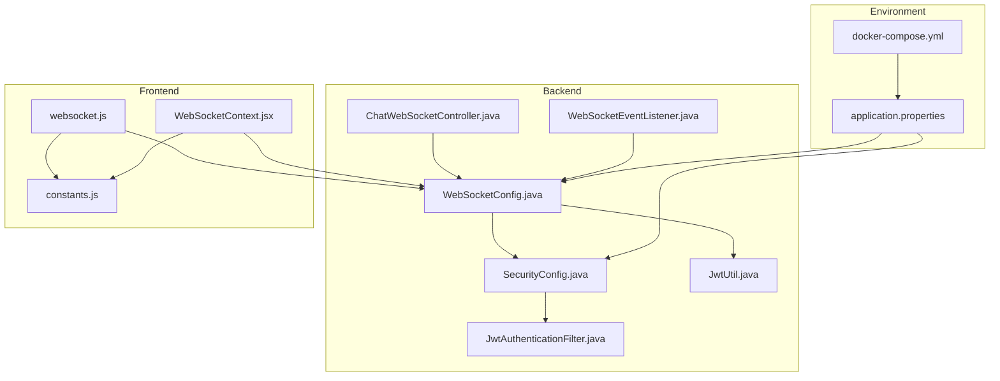
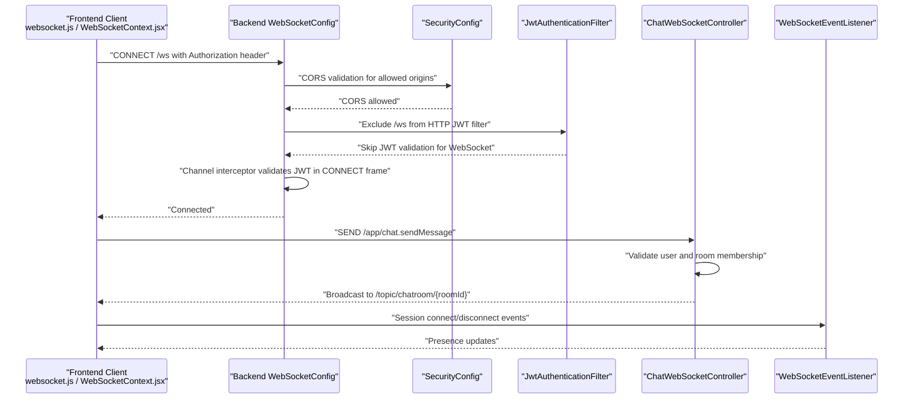
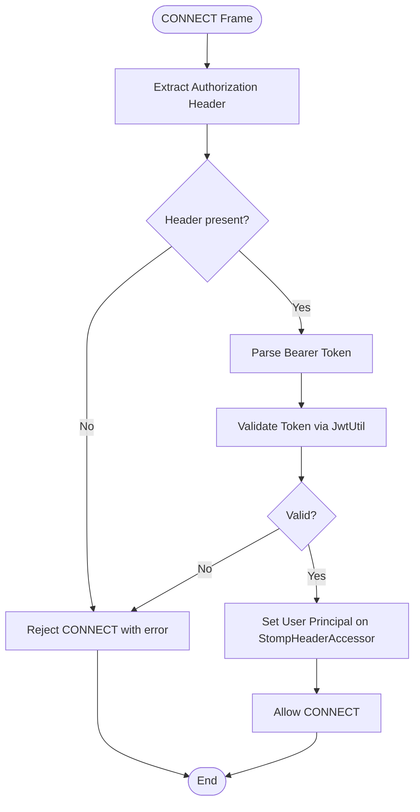
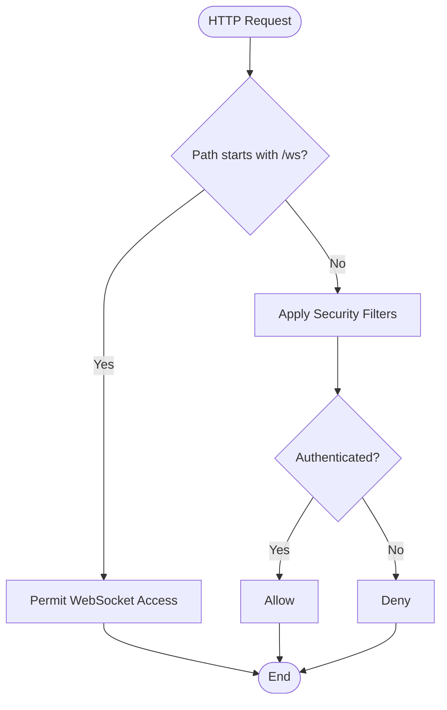
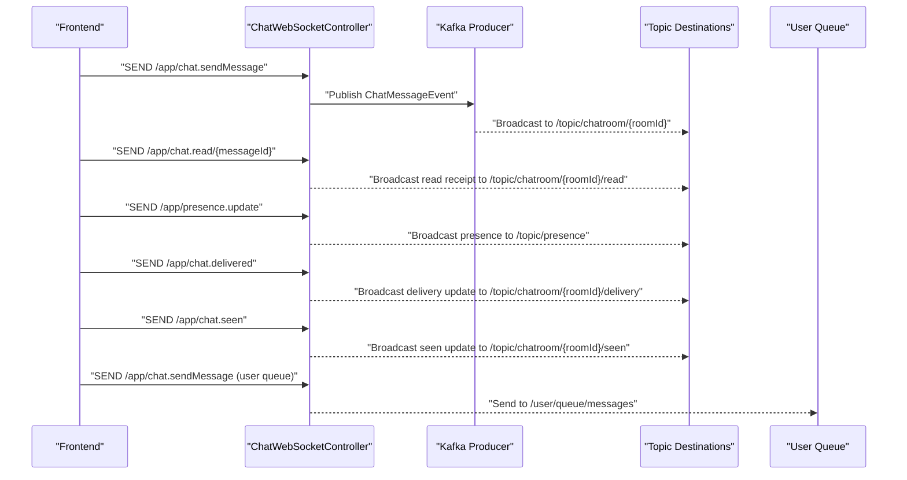
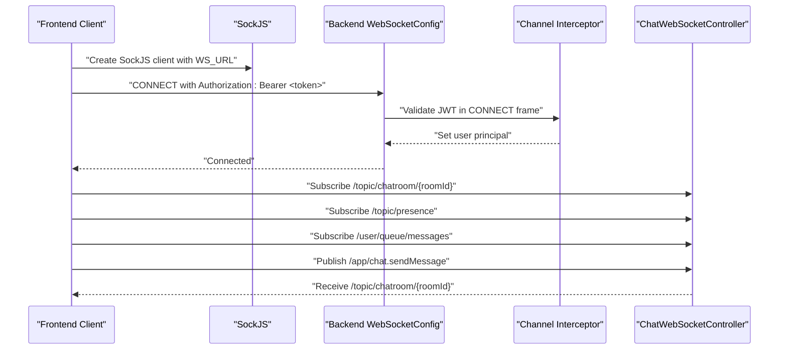
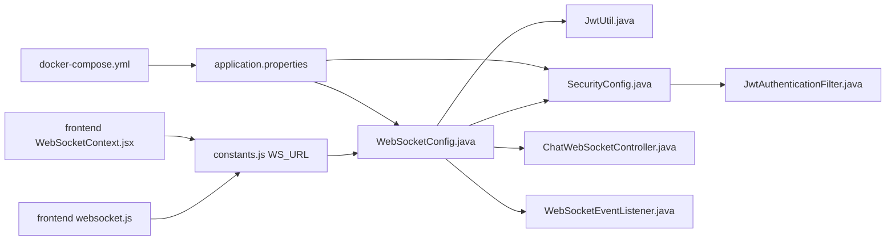

# STOMP Configuration and Setup

<cite>
**Referenced Files in This Document**
- [WebSocketConfig.java](file://src/main/java/com/chatify/chat_backend/config/WebSocketConfig.java)
- [SecurityConfig.java](file://src/main/java/com/chatify/chat_backend/config/SecurityConfig.java)
- [JwtAuthenticationFilter.java](file://src/main/java/com/chatify/chat_backend/security/JwtAuthenticationFilter.java)
- [JwtUtil.java](file://src/main/java/com/chatify/chat_backend/security/JwtUtil.java)
- [ChatWebSocketController.java](file://src/main/java/com/chatify/chat_backend/controller/ChatWebSocketController.java)
- [WebSocketEventListener.java](file://src/main/java/com/chatify/chat_backend/listener/WebSocketEventListener.java)
- [websocket.js](file://chatify-frontend/src/services/websocket.js)
- [WebSocketContext.jsx](file://chatify-frontend/src/context/WebSocketContext.jsx)
- [constants.js](file://chatify-frontend/src/utils/constants.js)
- [application.properties](file://src/main/resources/application.properties)
- [docker-compose.yml](file://docker-compose.yml)
</cite>

## Table of Contents
1. [Introduction](#introduction)
2. [Project Structure](#project-structure)
3. [Core Components](#core-components)
4. [Architecture Overview](#architecture-overview)
5. [Detailed Component Analysis](#detailed-component-analysis)
6. [Dependency Analysis](#dependency-analysis)
7. [Performance Considerations](#performance-considerations)
8. [Troubleshooting Guide](#troubleshooting-guide)
9. [Conclusion](#conclusion)
10. [Appendices](#appendices)

## Introduction
This document explains the STOMP (Simple Text Oriented Messaging Protocol) configuration and WebSocket endpoint setup in the backend server and its integration with the frontend. It covers endpoint registration with SockJS fallback support, CORS configuration for multiple origins, message broker setup with topic and user destinations, channel interceptor configuration for JWT authentication validation during WebSocket CONNECT frames, heartbeat scheduler configuration, and thread pool scheduling for WebSocket operations. It also clarifies the relationship between STOMP endpoints, message routing prefixes, and destination patterns, and provides guidance for production environments, security considerations, and performance tuning parameters.

## Project Structure
The WebSocket and STOMP configuration spans several backend components and the frontend client:
- Backend configuration and security: WebSocketConfig, SecurityConfig, JwtAuthenticationFilter, JwtUtil
- Backend message handling: ChatWebSocketController, WebSocketEventListener
- Frontend client: websocket.js, WebSocketContext.jsx, constants.js
- Environment configuration: application.properties, docker-compose.yml

**Diagram sources**
- [WebSocketConfig.java:1-111](file://src/main/java/com/chatify/chat_backend/config/WebSocketConfig.java#L1-L111)
- [SecurityConfig.java:1-120](file://src/main/java/com/chatify/chat_backend/config/SecurityConfig.java#L1-L120)
- [JwtAuthenticationFilter.java:1-78](file://src/main/java/com/chatify/chat_backend/security/JwtAuthenticationFilter.java#L1-L78)
- [JwtUtil.java:1-145](file://src/main/java/com/chatify/chat_backend/security/JwtUtil.java#L1-L145)
- [ChatWebSocketController.java:1-181](file://src/main/java/com/chatify/chat_backend/controller/ChatWebSocketController.java#L1-L181)
- [WebSocketEventListener.java:1-55](file://src/main/java/com/chatify/chat_backend/listener/WebSocketEventListener.java#L1-L55)
- [websocket.js:1-327](file://chatify-frontend/src/services/websocket.js#L1-L327)
- [WebSocketContext.jsx:1-190](file://chatify-frontend/src/context/WebSocketContext.jsx#L1-L190)
- [constants.js:1-34](file://chatify-frontend/src/utils/constants.js#L1-L34)
- [application.properties:1-75](file://src/main/resources/application.properties#L1-L75)
- [docker-compose.yml:1-137](file://docker-compose.yml#L1-L137)

**Section sources**
- [WebSocketConfig.java:1-111](file://src/main/java/com/chatify/chat_backend/config/WebSocketConfig.java#L1-L111)
- [SecurityConfig.java:1-120](file://src/main/java/com/chatify/chat_backend/config/SecurityConfig.java#L1-L120)
- [JwtAuthenticationFilter.java:1-78](file://src/main/java/com/chatify/chat_backend/security/JwtAuthenticationFilter.java#L1-L78)
- [JwtUtil.java:1-145](file://src/main/java/com/chatify/chat_backend/security/JwtUtil.java#L1-L145)
- [ChatWebSocketController.java:1-181](file://src/main/java/com/chatify/chat_backend/controller/ChatWebSocketController.java#L1-L181)
- [WebSocketEventListener.java:1-55](file://src/main/java/com/chatify/chat_backend/listener/WebSocketEventListener.java#L1-L55)
- [websocket.js:1-327](file://chatify-frontend/src/services/websocket.js#L1-L327)
- [WebSocketContext.jsx:1-190](file://chatify-frontend/src/context/WebSocketContext.jsx#L1-L190)
- [constants.js:1-34](file://chatify-frontend/src/utils/constants.js#L1-L34)
- [application.properties:1-75](file://src/main/resources/application.properties#L1-L75)
- [docker-compose.yml:1-137](file://docker-compose.yml#L1-L137)

## Core Components
- WebSocketConfig: Registers the STOMP endpoint with SockJS fallback, configures CORS for multiple origins, sets up the message broker with topic and user destinations, configures heartbeat scheduler, and adds a channel interceptor for JWT authentication validation during CONNECT frames.
- SecurityConfig: Configures global CORS for HTTP endpoints and authorizes WebSocket endpoints.
- JwtAuthenticationFilter: Validates JWT tokens for HTTP requests and excludes WebSocket endpoints from this filter chain.
- JwtUtil: Provides token parsing, validation, and signing key management.
- ChatWebSocketController: Handles STOMP message mappings for chat, read receipts, presence, and delivery/seen acknowledgments.
- WebSocketEventListener: Listens to WebSocket connect/disconnect events and updates presence accordingly.
- Frontend websocket.js and WebSocketContext.jsx: Establishes the WebSocket connection with SockJS, sends Authorization headers, manages heartbeats, and subscribes to topics and user queues.

**Section sources**
- [WebSocketConfig.java:43-111](file://src/main/java/com/chatify/chat_backend/config/WebSocketConfig.java#L43-L111)
- [SecurityConfig.java:61-120](file://src/main/java/com/chatify/chat_backend/config/SecurityConfig.java#L61-L120)
- [JwtAuthenticationFilter.java:27-78](file://src/main/java/com/chatify/chat_backend/security/JwtAuthenticationFilter.java#L27-L78)
- [JwtUtil.java:27-145](file://src/main/java/com/chatify/chat_backend/security/JwtUtil.java#L27-L145)
- [ChatWebSocketController.java:49-181](file://src/main/java/com/chatify/chat_backend/controller/ChatWebSocketController.java#L49-L181)
- [WebSocketEventListener.java:24-55](file://src/main/java/com/chatify/chat_backend/listener/WebSocketEventListener.java#L24-L55)
- [websocket.js:42-114](file://chatify-frontend/src/services/websocket.js#L42-L114)
- [WebSocketContext.jsx:47-122](file://chatify-frontend/src/context/WebSocketContext.jsx#L47-L122)

## Architecture Overview
The STOMP architecture integrates the frontend client with the backend WebSocket configuration and message broker. The frontend connects to the backend endpoint, authenticates via JWT in the Authorization header, and exchanges messages through STOMP destinations routed by the backend message broker.

**Diagram sources**
- [WebSocketConfig.java:43-111](file://src/main/java/com/chatify/chat_backend/config/WebSocketConfig.java#L43-L111)
- [SecurityConfig.java:61-120](file://src/main/java/com/chatify/chat_backend/config/SecurityConfig.java#L61-L120)
- [JwtAuthenticationFilter.java:27-78](file://src/main/java/com/chatify/chat_backend/security/JwtAuthenticationFilter.java#L27-L78)
- [ChatWebSocketController.java:49-181](file://src/main/java/com/chatify/chat_backend/controller/ChatWebSocketController.java#L49-L181)
- [WebSocketEventListener.java:24-55](file://src/main/java/com/chatify/chat_backend/listener/WebSocketEventListener.java#L24-L55)
- [websocket.js:42-114](file://chatify-frontend/src/services/websocket.js#L42-L114)
- [WebSocketContext.jsx:47-122](file://chatify-frontend/src/context/WebSocketContext.jsx#L47-L122)

## Detailed Component Analysis

### WebSocketConfig: Endpoint Registration, CORS, Message Broker, Heartbeat Scheduler, and Channel Interceptor
- Endpoint registration with SockJS fallback:
  - Registers the STOMP endpoint at the configured URL and enables SockJS fallback for environments without native WebSocket support.
  - Allowed origins are loaded from configuration and applied to the endpoint.
- CORS configuration for multiple origins:
  - Uses the same allowed origins list for the WebSocket endpoint as configured globally.
- Message broker setup:
  - Enables a simple broker for topic and user destinations.
  - Sets heartbeat intervals for both incoming and outgoing heartbeats.
  - Assigns a dedicated ThreadPoolTaskScheduler for heartbeat tasks.
  - Defines application destination prefix and user destination prefix.
- Channel interceptor for JWT authentication:
  - Intercepts inbound messages during CONNECT frames.
  - Extracts the Authorization header, validates the JWT token, and sets the user principal on the accessor.
  - Logs authentication outcomes and throws exceptions for invalid or missing tokens.
- Thread pool scheduling:
  - Creates a ThreadPoolTaskScheduler with a small pool size and a descriptive thread name prefix for heartbeat operations.

**Diagram sources**
- [WebSocketConfig.java:68-111](file://src/main/java/com/chatify/chat_backend/config/WebSocketConfig.java#L68-L111)
- [JwtUtil.java:86-118](file://src/main/java/com/chatify/chat_backend/security/JwtUtil.java#L86-L118)

**Section sources**
- [WebSocketConfig.java:43-111](file://src/main/java/com/chatify/chat_backend/config/WebSocketConfig.java#L43-L111)
- [application.properties:26-30](file://src/main/resources/application.properties#L26-L30)
- [docker-compose.yml:103](file://docker-compose.yml#L103)

### SecurityConfig: Global CORS and WebSocket Endpoint Authorization
- CORS configuration:
  - Defines allowed origins, methods, headers, exposed headers, credentials, and max age.
  - Applies to all HTTP endpoints, including the WebSocket endpoint path.
- WebSocket endpoint authorization:
  - Permits access to WebSocket endpoints to allow the CONNECT frame to reach the channel interceptor.

**Diagram sources**
- [SecurityConfig.java:61-90](file://src/main/java/com/chatify/chat_backend/config/SecurityConfig.java#L61-L90)
- [JwtAuthenticationFilter.java:27-35](file://src/main/java/com/chatify/chat_backend/security/JwtAuthenticationFilter.java#L27-L35)

**Section sources**
- [SecurityConfig.java:61-120](file://src/main/java/com/chatify/chat_backend/config/SecurityConfig.java#L61-L120)
- [JwtAuthenticationFilter.java:27-35](file://src/main/java/com/chatify/chat_backend/security/JwtAuthenticationFilter.java#L27-L35)

### JwtAuthenticationFilter: Excluding WebSocket Paths from HTTP JWT Validation
- Excludes WebSocket endpoints from HTTP JWT validation to allow the channel interceptor to handle authentication.
- Parses Authorization headers for HTTP requests and sets the security context for authenticated users.

**Section sources**
- [JwtAuthenticationFilter.java:27-35](file://src/main/java/com/chatify/chat_backend/security/JwtAuthenticationFilter.java#L27-L35)
- [JwtAuthenticationFilter.java:37-78](file://src/main/java/com/chatify/chat_backend/security/JwtAuthenticationFilter.java#L37-L78)

### JwtUtil: Token Parsing and Validation
- Manages the signing key derived from a Base64-encoded secret.
- Provides methods to extract username, validate tokens, and check expiration.

**Section sources**
- [JwtUtil.java:27-53](file://src/main/java/com/chatify/chat_backend/security/JwtUtil.java#L27-L53)
- [JwtUtil.java:86-118](file://src/main/java/com/chatify/chat_backend/security/JwtUtil.java#L86-L118)

### ChatWebSocketController: STOMP Message Routing and Destinations
- Message mappings:
  - Routes legacy and primary chat send handlers to publish events to Kafka.
  - Handles read receipts, presence updates, and delivery/seen acknowledgments.
- Destination patterns:
  - Uses application destinations under the configured prefix.
  - Broadcasts to topic destinations for chatroom channels.
  - Sends user-specific messages to the user queue.

**Diagram sources**
- [ChatWebSocketController.java:49-181](file://src/main/java/com/chatify/chat_backend/controller/ChatWebSocketController.java#L49-L181)
- [WebSocketConfig.java:50-57](file://src/main/java/com/chatify/chat_backend/config/WebSocketConfig.java#L50-L57)

**Section sources**
- [ChatWebSocketController.java:49-181](file://src/main/java/com/chatify/chat_backend/controller/ChatWebSocketController.java#L49-L181)
- [WebSocketConfig.java:50-57](file://src/main/java/com/chatify/chat_backend/config/WebSocketConfig.java#L50-L57)

### WebSocketEventListener: Presence Management on Connect/Disconnect
- Listens to session connect and disconnect events.
- Updates presence state for authenticated users and logs connection/disconnection.

**Section sources**
- [WebSocketEventListener.java:24-55](file://src/main/java/com/chatify/chat_backend/listener/WebSocketEventListener.java#L24-L55)

### Frontend WebSocket Integration: Connection, Headers, Heartbeats, and Subscriptions
- Connection establishment:
  - Uses SockJS with the configured WebSocket URL.
  - Sends Authorization header with the Bearer token.
- Heartbeats:
  - Configures heartbeat intervals for both incoming and outgoing traffic.
- Subscriptions:
  - Subscribes to topic destinations for chatroom messages, typing indicators, read receipts, presence, and user-specific queues.
- Reconnection logic:
  - Implements exponential backoff and token refresh on STOMP errors or WebSocket close events.

**Diagram sources**
- [websocket.js:42-114](file://chatify-frontend/src/services/websocket.js#L42-L114)
- [WebSocketContext.jsx:47-122](file://chatify-frontend/src/context/WebSocketContext.jsx#L47-L122)
- [constants.js:1-3](file://chatify-frontend/src/utils/constants.js#L1-L3)
- [WebSocketConfig.java:43-111](file://src/main/java/com/chatify/chat_backend/config/WebSocketConfig.java#L43-L111)

**Section sources**
- [websocket.js:42-114](file://chatify-frontend/src/services/websocket.js#L42-L114)
- [WebSocketContext.jsx:47-122](file://chatify-frontend/src/context/WebSocketContext.jsx#L47-L122)
- [constants.js:1-3](file://chatify-frontend/src/utils/constants.js#L1-L3)

## Dependency Analysis
The WebSocket configuration depends on security utilities and message broker components. The frontend depends on the backend endpoint and environment configuration.

**Diagram sources**
- [websocket.js:1-327](file://chatify-frontend/src/services/websocket.js#L1-L327)
- [WebSocketContext.jsx:1-190](file://chatify-frontend/src/context/WebSocketContext.jsx#L1-L190)
- [constants.js:1-34](file://chatify-frontend/src/utils/constants.js#L1-L34)
- [WebSocketConfig.java:1-111](file://src/main/java/com/chatify/chat_backend/config/WebSocketConfig.java#L1-L111)
- [SecurityConfig.java:1-120](file://src/main/java/com/chatify/chat_backend/config/SecurityConfig.java#L1-L120)
- [JwtAuthenticationFilter.java:1-78](file://src/main/java/com/chatify/chat_backend/security/JwtAuthenticationFilter.java#L1-L78)
- [JwtUtil.java:1-145](file://src/main/java/com/chatify/chat_backend/security/JwtUtil.java#L1-L145)
- [ChatWebSocketController.java:1-181](file://src/main/java/com/chatify/chat_backend/controller/ChatWebSocketController.java#L1-L181)
- [WebSocketEventListener.java:1-55](file://src/main/java/com/chatify/chat_backend/listener/WebSocketEventListener.java#L1-L55)
- [application.properties:1-75](file://src/main/resources/application.properties#L1-L75)
- [docker-compose.yml:1-137](file://docker-compose.yml#L1-L137)

**Section sources**
- [WebSocketConfig.java:1-111](file://src/main/java/com/chatify/chat_backend/config/WebSocketConfig.java#L1-L111)
- [SecurityConfig.java:1-120](file://src/main/java/com/chatify/chat_backend/config/SecurityConfig.java#L1-L120)
- [JwtAuthenticationFilter.java:1-78](file://src/main/java/com/chatify/chat_backend/security/JwtAuthenticationFilter.java#L1-L78)
- [JwtUtil.java:1-145](file://src/main/java/com/chatify/chat_backend/security/JwtUtil.java#L1-L145)
- [ChatWebSocketController.java:1-181](file://src/main/java/com/chatify/chat_backend/controller/ChatWebSocketController.java#L1-L181)
- [WebSocketEventListener.java:1-55](file://src/main/java/com/chatify/chat_backend/listener/WebSocketEventListener.java#L1-L55)
- [websocket.js:1-327](file://chatify-frontend/src/services/websocket.js#L1-L327)
- [WebSocketContext.jsx:1-190](file://chatify-frontend/src/context/WebSocketContext.jsx#L1-L190)
- [constants.js:1-34](file://chatify-frontend/src/utils/constants.js#L1-L34)
- [application.properties:1-75](file://src/main/resources/application.properties#L1-L75)
- [docker-compose.yml:1-137](file://docker-compose.yml#L1-L137)

## Performance Considerations
- Heartbeat intervals:
  - Configure heartbeat values to balance responsiveness and network overhead. The backend sets symmetric intervals for both directions.
- Thread pool sizing:
  - The heartbeat scheduler uses a small pool size suitable for lightweight periodic tasks. Increase pool size if the application scales to many concurrent connections and heavy message processing.
- Message broker load:
  - Use topic destinations for fan-out broadcasting and user destinations for point-to-point messaging to minimize unnecessary routing overhead.
- Frontend reconnection:
  - Implement exponential backoff and token refresh to reduce repeated failures and improve resilience under transient network issues.

[No sources needed since this section provides general guidance]

## Troubleshooting Guide
- Authentication failures on CONNECT:
  - Verify the Authorization header format and token validity. The interceptor expects a Bearer token and logs warnings for invalid or missing tokens.
- CORS errors:
  - Ensure allowed origins include the frontend origin(s). Both HTTP and WebSocket endpoints use the same allowed origins configuration.
- Heartbeat timeouts:
  - Adjust heartbeat intervals on the frontend to align with backend settings. Mismatched intervals can cause premature disconnects.
- Token expiration:
  - The frontend handles token refresh on STOMP errors or WebSocket close events with policy violations. Confirm refresh logic and token persistence.

**Section sources**
- [WebSocketConfig.java:75-105](file://src/main/java/com/chatify/chat_backend/config/WebSocketConfig.java#L75-L105)
- [SecurityConfig.java:107-119](file://src/main/java/com/chatify/chat_backend/config/SecurityConfig.java#L107-L119)
- [websocket.js:70-110](file://chatify-frontend/src/services/websocket.js#L70-L110)
- [WebSocketContext.jsx:74-103](file://chatify-frontend/src/context/WebSocketContext.jsx#L74-L103)

## Conclusion
The STOMP configuration integrates WebSocket endpoints with JWT authentication, a message broker for topic and user destinations, and heartbeat scheduling. The frontend establishes secure connections with SockJS, manages heartbeats, and subscribes to relevant destinations. Proper configuration of allowed origins, heartbeat intervals, and authentication ensures reliable real-time communication in production environments.

[No sources needed since this section summarizes without analyzing specific files]

## Appendices

### Configuration Options and Examples
- Endpoint URL:
  - Backend endpoint: configured in the WebSocketConfig endpoint registration.
  - Frontend URL: configurable via environment variable and defaults to the backend endpoint.
- Allowed origins:
  - Defined in application properties and docker-compose environment variables for both HTTP and WebSocket endpoints.
- Authentication header handling:
  - Frontend sends Authorization: Bearer <token> on connect.
  - Backend interceptor extracts and validates the token and sets the user principal.

**Section sources**
- [WebSocketConfig.java:43-48](file://src/main/java/com/chatify/chat_backend/config/WebSocketConfig.java#L43-L48)
- [constants.js:1-3](file://chatify-frontend/src/utils/constants.js#L1-L3)
- [application.properties:26-27](file://src/main/resources/application.properties#L26-L27)
- [docker-compose.yml:103](file://docker-compose.yml#L103)
- [websocket.js:61-63](file://chatify-frontend/src/services/websocket.js#L61-L63)
- [WebSocketContext.jsx:55](file://chatify-frontend/src/context/WebSocketContext.jsx#L55)

### Production Environment Recommendations
- CORS:
  - Restrict allowed origins to known frontend domains and enable credentials only when necessary.
- Heartbeats:
  - Align frontend and backend heartbeat intervals to prevent premature disconnects.
- Security:
  - Enforce HTTPS in production and rotate JWT secrets regularly.
- Scalability:
  - Monitor thread pool usage for the heartbeat scheduler and scale as needed.
- Observability:
  - Enable structured logging for authentication and connection events to aid troubleshooting.

[No sources needed since this section provides general guidance]