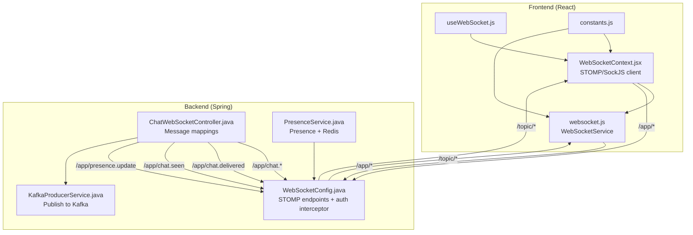
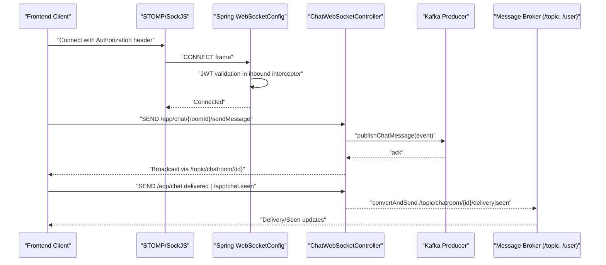
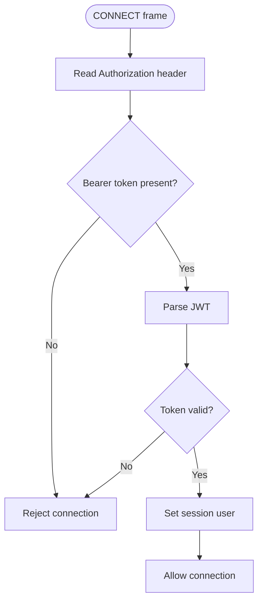
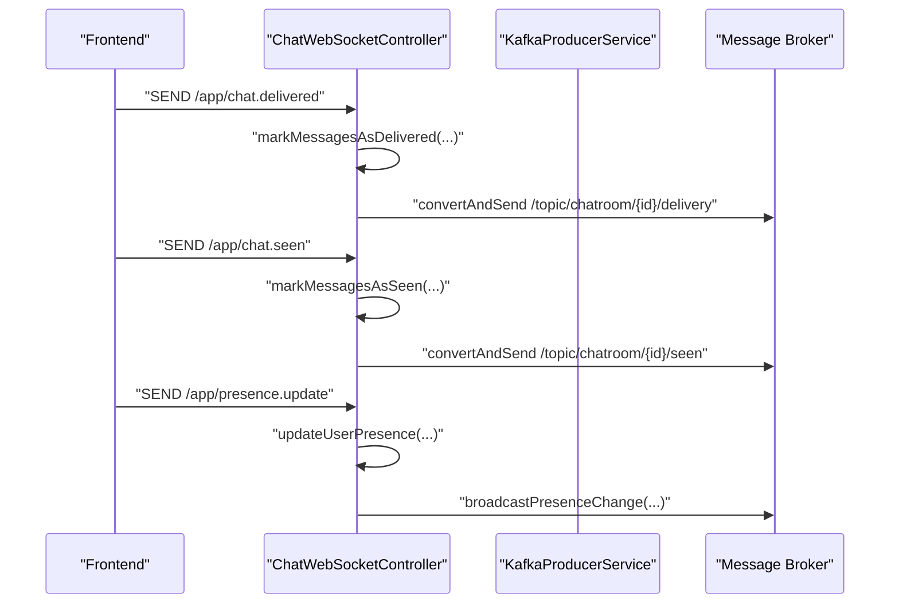
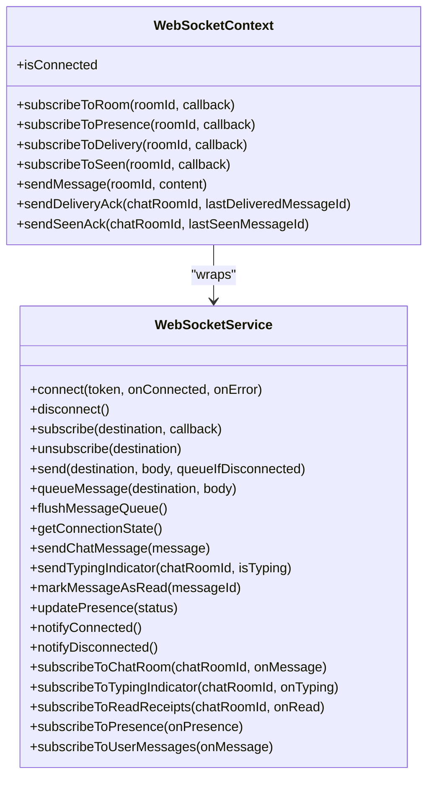
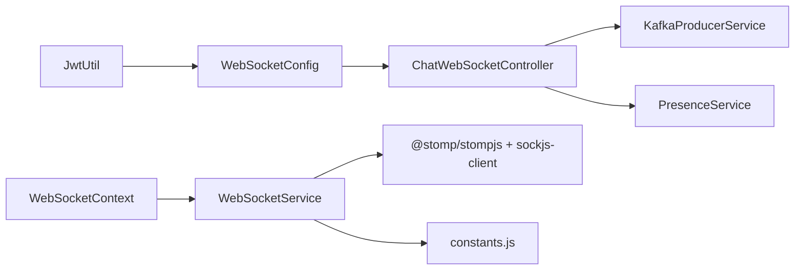

# WebSocket Integration

<cite>
**Referenced Files in This Document**
- [WebSocketConfig.java](file://src/main/java/com/chatify/chat_backend/config/WebSocketConfig.java)
- [ChatWebSocketController.java](file://src/main/java/com/chatify/chat_backend/controller/ChatWebSocketController.java)
- [KafkaProducerService.java](file://src/main/java/com/chatify/chat_backend/service/KafkaProducerService.java)
- [PresenceService.java](file://src/main/java/com/chatify/chat_backend/service/PresenceService.java)
- [ChatMessageEvent.java](file://src/main/java/com/chatify/chat_backend/dto/ChatMessageEvent.java)
- [SendMessageDTO.java](file://src/main/java/com/chatify/chat_backend/dto/SendMessageDTO.java)
- [MessageDeliveredAckDTO.java](file://src/main/java/com/chatify/chat_backend/dto/MessageDeliveredAckDTO.java)
- [MessageSeenAckDTO.java](file://src/main/java/com/chatify/chat_backend/dto/MessageSeenAckDTO.java)
- [OnlineStatusDTO.java](file://src/main/java/com/chatify/chat_backend/dto/OnlineStatusDTO.java)
- [UserStatus.java](file://src/main/java/com/chatify/chat_backend/entity/enums/UserStatus.java)
- [MessageType.java](file://src/main/java/com/chatify/chat_backend/entity/enums/MessageType.java)
- [websocket.js](file://chatify-frontend/src/services/websocket.js)
- [WebSocketContext.jsx](file://chatify-frontend/src/context/WebSocketContext.jsx)
- [useWebSocket.js](file://chatify-frontend/src/hooks/useWebSocket.js)
- [constants.js](file://chatify-frontend/src/utils/constants.js)
</cite>

## Table of Contents
1. [Introduction](#introduction)
2. [Project Structure](#project-structure)
3. [Core Components](#core-components)
4. [Architecture Overview](#architecture-overview)
5. [Detailed Component Analysis](#detailed-component-analysis)
6. [Dependency Analysis](#dependency-analysis)
7. [Performance Considerations](#performance-considerations)
8. [Troubleshooting Guide](#troubleshooting-guide)
9. [Conclusion](#conclusion)
10. [Appendices](#appendices)

## Introduction
This document explains the WebSocket integration for real-time communication in the Chatify application. It covers STOMP protocol configuration, WebSocket endpoint setup, message routing, and the end-to-end message handling architecture. It also documents real-time features such as message delivery receipts, seen/read receipts, typing indicators, and online presence tracking. Practical examples from the React frontend show client-side connection lifecycle management, subscription handling, and message publishing. Configuration options, serialization, and error handling strategies are included, along with relationships to authentication, message processing pipeline, and presence tracking.

## Project Structure
The WebSocket integration spans two layers:
- Backend (Spring Boot): WebSocket broker configuration, STOMP endpoint registration, inbound message handlers, and outbound broadcasting via a message broker and Kafka.
- Frontend (React): A reusable WebSocket service and a context provider wrapping STOMP/SockJS connectivity, subscriptions, and reconnection logic.

**Diagram sources**
- [WebSocketConfig.java:43-57](file://src/main/java/com/chatify/chat_backend/config/WebSocketConfig.java#L43-L57)
- [ChatWebSocketController.java:53-181](file://src/main/java/com/chatify/chat_backend/controller/ChatWebSocketController.java#L53-L181)
- [KafkaProducerService.java:32-49](file://src/main/java/com/chatify/chat_backend/service/KafkaProducerService.java#L32-L49)
- [PresenceService.java:101-103](file://src/main/java/com/chatify/chat_backend/service/PresenceService.java#L101-L103)
- [WebSocketContext.jsx:50-111](file://chatify-frontend/src/context/WebSocketContext.jsx#L50-L111)
- [websocket.js:59-114](file://chatify-frontend/src/services/websocket.js#L59-L114)

**Section sources**
- [WebSocketConfig.java:43-57](file://src/main/java/com/chatify/chat_backend/config/WebSocketConfig.java#L43-L57)
- [ChatWebSocketController.java:53-181](file://src/main/java/com/chatify/chat_backend/controller/ChatWebSocketController.java#L53-L181)
- [KafkaProducerService.java:32-49](file://src/main/java/com/chatify/chat_backend/service/KafkaProducerService.java#L32-L49)
- [PresenceService.java:101-103](file://src/main/java/com/chatify/chat_backend/service/PresenceService.java#L101-L103)
- [WebSocketContext.jsx:50-111](file://chatify-frontend/src/context/WebSocketContext.jsx#L50-L111)
- [websocket.js:59-114](file://chatify-frontend/src/services/websocket.js#L59-L114)

## Core Components
- Backend WebSocket configuration and authentication:
  - STOMP endpoint registration with SockJS fallback.
  - Inbound channel interceptor validates JWT from Authorization header and sets the user on the STOMP session.
  - Message broker configured with heartbeats and user/topic destinations.
- Backend message handlers:
  - Message send handlers route events to Kafka for persistence and broadcast.
  - Delivery/seen/read receipt handlers update message status and broadcast updates.
  - Presence update handler updates user presence and broadcasts changes.
- Frontend WebSocket service and context:
  - STOMP/SockJS client with heartbeat, reconnection, and message queuing.
  - Subscription management for chat rooms, typing, read receipts, presence, and personal queues.
  - Token refresh integration for seamless reconnection after JWT expiration.

**Section sources**
- [WebSocketConfig.java:43-111](file://src/main/java/com/chatify/chat_backend/config/WebSocketConfig.java#L43-L111)
- [ChatWebSocketController.java:53-181](file://src/main/java/com/chatify/chat_backend/controller/ChatWebSocketController.java#L53-L181)
- [websocket.js:59-114](file://chatify-frontend/src/services/websocket.js#L59-L114)
- [WebSocketContext.jsx:50-111](file://chatify-frontend/src/context/WebSocketContext.jsx#L50-L111)

## Architecture Overview
The system uses Spring WebSocket + STOMP over SockJS on the backend and @stomp/stompjs + sockjs-client on the frontend. Messages flow from the frontend to the backend via STOMP, then to Kafka for asynchronous processing. Consumers persist messages and broadcast them to subscribed clients. Receipts and presence updates follow a similar pattern.

**Diagram sources**
- [WebSocketConfig.java:68-111](file://src/main/java/com/chatify/chat_backend/config/WebSocketConfig.java#L68-L111)
- [ChatWebSocketController.java:81-110](file://src/main/java/com/chatify/chat_backend/controller/ChatWebSocketController.java#L81-L110)
- [KafkaProducerService.java:32-49](file://src/main/java/com/chatify/chat_backend/service/KafkaProducerService.java#L32-L49)
- [websocket.js:277-279](file://chatify-frontend/src/services/websocket.js#L277-L279)

## Detailed Component Analysis

### Backend WebSocket Configuration and Authentication
- Endpoint registration:
  - Adds a WebSocket endpoint at "/ws" with SockJS enabled and configurable allowed origins.
- Message broker:
  - Enables a simple broker for "/topic" and "/user" destinations.
  - Heartbeats set to 10 seconds for both directions with a dedicated scheduler.
  - Application destination prefix "/app" and user destination prefix "/user".
- Inbound channel interceptor:
  - Validates Authorization header on CONNECT frames.
  - Extracts JWT subject and sets it as the STOMP session user.
  - Rejects connections with invalid or missing tokens.

**Diagram sources**
- [WebSocketConfig.java:75-106](file://src/main/java/com/chatify/chat_backend/config/WebSocketConfig.java#L75-L106)

**Section sources**
- [WebSocketConfig.java:43-57](file://src/main/java/com/chatify/chat_backend/config/WebSocketConfig.java#L43-L57)
- [WebSocketConfig.java:68-111](file://src/main/java/com/chatify/chat_backend/config/WebSocketConfig.java#L68-L111)

### Message Routing and Handlers
- Message send:
  - Two endpoints: legacy and primary. Both validate membership, build a ChatMessageEvent, and publish to Kafka.
- Delivery receipts:
  - Receives delivered acknowledgements, updates message delivery status, and publishes delivery updates to "/topic/chatroom/{id}/delivery".
- Seen/read receipts:
  - Receives seen acknowledgements and publishes seen updates to "/topic/chatroom/{id}/seen".
- Presence:
  - Updates user presence and broadcasts presence changes to "/topic/presence".

**Diagram sources**
- [ChatWebSocketController.java:144-161](file://src/main/java/com/chatify/chat_backend/controller/ChatWebSocketController.java#L144-L161)
- [ChatWebSocketController.java:163-180](file://src/main/java/com/chatify/chat_backend/controller/ChatWebSocketController.java#L163-L180)
- [ChatWebSocketController.java:133-142](file://src/main/java/com/chatify/chat_backend/controller/ChatWebSocketController.java#L133-L142)

**Section sources**
- [ChatWebSocketController.java:53-181](file://src/main/java/com/chatify/chat_backend/controller/ChatWebSocketController.java#L53-L181)
- [KafkaProducerService.java:32-49](file://src/main/java/com/chatify/chat_backend/service/KafkaProducerService.java#L32-L49)

### Frontend WebSocket Service and Context
- Service features:
  - Connect/disconnect with token injection, heartbeat configuration, and STOMP/SockJS activation.
  - Reconnection with exponential-like backoff and capped multiplier.
  - Message queue flushed upon successful connect.
  - Subscription management with automatic resubscription on reconnect.
  - Dedicated methods for sending chat messages, typing indicators, read receipts, presence updates, and subscribing to topics.
- Context features:
  - Manages a single STOMP client instance per session.
  - Integrates token refresh on STOMP errors or WebSocket close events.
  - Provides convenience methods for subscribing to chat room, typing, delivery, seen, and presence topics.

**Diagram sources**
- [websocket.js:5-327](file://chatify-frontend/src/services/websocket.js#L5-L327)
- [WebSocketContext.jsx:10-190](file://chatify-frontend/src/context/WebSocketContext.jsx#L10-L190)

**Section sources**
- [websocket.js:59-114](file://chatify-frontend/src/services/websocket.js#L59-L114)
- [websocket.js:116-138](file://chatify-frontend/src/services/websocket.js#L116-L138)
- [websocket.js:177-221](file://chatify-frontend/src/services/websocket.js#L177-L221)
- [websocket.js:277-321](file://chatify-frontend/src/services/websocket.js#L277-L321)
- [WebSocketContext.jsx:50-111](file://chatify-frontend/src/context/WebSocketContext.jsx#L50-L111)
- [WebSocketContext.jsx:124-175](file://chatify-frontend/src/context/WebSocketContext.jsx#L124-L175)

### Message Formats and DTOs
- Send message payload:
  - Fields include chat room identifier, content, message type, optional file metadata.
- Chat message event:
  - Carries sender, room, content, type, and file metadata for downstream processing.
- Delivery/seen acknowledgements:
  - Contain chat room identifier and the last acknowledged message identifier.
- Online presence:
  - Includes user identifier, username, status, and last seen timestamp.

**Section sources**
- [SendMessageDTO.java:12-21](file://src/main/java/com/chatify/chat_backend/dto/SendMessageDTO.java#L12-L21)
- [ChatMessageEvent.java:16-25](file://src/main/java/com/chatify/chat_backend/dto/ChatMessageEvent.java#L16-L25)
- [MessageDeliveredAckDTO.java:6-9](file://src/main/java/com/chatify/chat_backend/dto/MessageDeliveredAckDTO.java#L6-L9)
- [MessageSeenAckDTO.java:6-9](file://src/main/java/com/chatify/chat_backend/dto/MessageSeenAckDTO.java#L6-L9)
- [OnlineStatusDTO.java:13-18](file://src/main/java/com/chatify/chat_backend/dto/OnlineStatusDTO.java#L13-L18)

### Real-Time Features
- Message delivery receipts:
  - Frontend sends acknowledgements to "/app/chat.delivered"; backend updates delivery status and publishes to "/topic/chatroom/{id}/delivery".
- Message seen/read receipts:
  - Frontend sends seen acknowledgements to "/app/chat.seen"; backend updates seen status and publishes to "/topic/chatroom/{id}/seen".
- Typing indicators:
  - Frontend can send typing indicator updates; backend routes them to appropriate channels (see frontend usage).
- Online presence:
  - Frontend updates presence via "/app/presence.update"; backend persists and broadcasts presence changes to "/topic/presence".

**Section sources**
- [ChatWebSocketController.java:144-161](file://src/main/java/com/chatify/chat_backend/controller/ChatWebSocketController.java#L144-L161)
- [ChatWebSocketController.java:163-180](file://src/main/java/com/chatify/chat_backend/controller/ChatWebSocketController.java#L163-L180)
- [ChatWebSocketController.java:133-142](file://src/main/java/com/chatify/chat_backend/controller/ChatWebSocketController.java#L133-L142)
- [websocket.js:281-283](file://chatify-frontend/src/services/websocket.js#L281-L283)
- [WebSocketContext.jsx:131-150](file://chatify-frontend/src/context/WebSocketContext.jsx#L131-L150)

## Dependency Analysis
- Backend:
  - WebSocketConfig depends on JwtUtil for token validation and registers STOMP endpoints and message broker.
  - ChatWebSocketController depends on SimpMessageSendingOperations, services, and KafkaProducerService.
  - PresenceService integrates Redis and SimpMessagingTemplate for presence tracking and broadcasting.
- Frontend:
  - WebSocketContext and WebSocketService depend on constants for endpoint configuration and on @stomp/stompjs/sockjs-client for transport.
  - useWebSocket hook exposes context methods to components.

**Diagram sources**
- [WebSocketConfig.java:34](file://src/main/java/com/chatify/chat_backend/config/WebSocketConfig.java#L34)
- [ChatWebSocketController.java:35-47](file://src/main/java/com/chatify/chat_backend/controller/ChatWebSocketController.java#L35-L47)
- [KafkaProducerService.java:18](file://src/main/java/com/chatify/chat_backend/service/KafkaProducerService.java#L18)
- [PresenceService.java:24](file://src/main/java/com/chatify/chat_backend/service/PresenceService.java#L24)
- [websocket.js:1-3](file://chatify-frontend/src/services/websocket.js#L1-L3)
- [WebSocketContext.jsx:2-6](file://chatify-frontend/src/context/WebSocketContext.jsx#L2-L6)

**Section sources**
- [WebSocketConfig.java:34](file://src/main/java/com/chatify/chat_backend/config/WebSocketConfig.java#L34)
- [ChatWebSocketController.java:35-47](file://src/main/java/com/chatify/chat_backend/controller/ChatWebSocketController.java#L35-L47)
- [KafkaProducerService.java:18](file://src/main/java/com/chatify/chat_backend/service/KafkaProducerService.java#L18)
- [PresenceService.java:24](file://src/main/java/com/chatify/chat_backend/service/PresenceService.java#L24)
- [websocket.js:1-3](file://chatify-frontend/src/services/websocket.js#L1-L3)
- [WebSocketContext.jsx:2-6](file://chatify-frontend/src/context/WebSocketContext.jsx#L2-L6)

## Performance Considerations
- Heartbeats:
  - Backend and frontend both configure heartbeat intervals to keep connections alive and detect failures promptly.
- Partitioning:
  - Kafka producer uses chat room ID as the key to ensure in-order processing per room.
- Presence caching:
  - Redis TTL-based caching reduces DB load for presence queries.
- Backpressure:
  - Frontend queues outgoing messages until connected to avoid loss during transient disconnects.

[No sources needed since this section provides general guidance]

## Troubleshooting Guide
- Connection drops and reconnection:
  - Frontend reconnects automatically with bounded backoff; resets on user-initiated actions.
  - Backend heartbeat scheduler keeps the broker connection healthy.
- Token expiration:
  - Frontend attempts token refresh on STOMP or WebSocket errors; updates connect headers and retries.
- Missing Authorization header:
  - Backend rejects CONNECT frames without a proper bearer token.
- Message ordering:
  - Kafka partitioning by chat room ID preserves ordering within a room.
- Subscription management:
  - Frontend unsubscribes and resubscribes on reconnect to ensure coverage.

**Section sources**
- [websocket.js:116-138](file://chatify-frontend/src/services/websocket.js#L116-L138)
- [WebSocketContext.jsx:74-108](file://chatify-frontend/src/context/WebSocketContext.jsx#L74-L108)
- [WebSocketConfig.java:75-106](file://src/main/java/com/chatify/chat_backend/config/WebSocketConfig.java#L75-L106)
- [KafkaProducerService.java:32-36](file://src/main/java/com/chatify/chat_backend/service/KafkaProducerService.java#L32-L36)

## Conclusion
The WebSocket integration leverages STOMP over SockJS for reliable real-time messaging, with JWT-based authentication enforced at the broker level. The frontend provides robust connection lifecycle management, reconnection strategies, and subscription handling. Backend handlers orchestrate message publishing to Kafka and broadcasting via the message broker, while presence and receipts are handled consistently across topics. Together, these components deliver a scalable, observable, and resilient real-time communication system.

[No sources needed since this section summarizes without analyzing specific files]

## Appendices

### Configuration Options
- Backend
  - Allowed origins for WebSocket endpoint.
  - Heartbeat intervals and scheduler pool size.
  - Application and user destination prefixes.
- Frontend
  - WebSocket URL and heartbeat intervals.
  - Reconnection delay and backoff caps.
  - Message queue behavior and callback notifications.

**Section sources**
- [WebSocketConfig.java:36-47](file://src/main/java/com/chatify/chat_backend/config/WebSocketConfig.java#L36-L47)
- [WebSocketConfig.java:52-56](file://src/main/java/com/chatify/chat_backend/config/WebSocketConfig.java#L52-L56)
- [WebSocketConfig.java:60-66](file://src/main/java/com/chatify/chat_backend/config/WebSocketConfig.java#L60-L66)
- [constants.js:1-3](file://chatify-frontend/src/utils/constants.js#L1-L3)
- [websocket.js:69-71](file://chatify-frontend/src/services/websocket.js#L69-L71)
- [WebSocketContext.jsx:57-59](file://chatify-frontend/src/context/WebSocketContext.jsx#L57-L59)

### Message Serialization and Deserialization
- Frontend:
  - Sends JSON payloads and parses incoming message bodies.
- Backend:
  - Uses Spring’s STOMP and Jackson for serialization; DTOs define field shapes.

**Section sources**
- [websocket.js:193-200](file://chatify-frontend/src/services/websocket.js#L193-L200)
- [websocket.js:252-255](file://chatify-frontend/src/services/websocket.js#L252-L255)
- [SendMessageDTO.java:12-21](file://src/main/java/com/chatify/chat_backend/dto/SendMessageDTO.java#L12-L21)

### Relationship with Authentication and Presence
- Authentication:
  - JWT validation in the inbound channel interceptor secures STOMP sessions.
- Presence:
  - PresenceService updates user status, caches with Redis TTL, and broadcasts changes.

**Section sources**
- [WebSocketConfig.java:84-101](file://src/main/java/com/chatify/chat_backend/config/WebSocketConfig.java#L84-L101)
- [PresenceService.java:50-81](file://src/main/java/com/chatify/chat_backend/service/PresenceService.java#L50-L81)
- [PresenceService.java:101-103](file://src/main/java/com/chatify/chat_backend/service/PresenceService.java#L101-L103)